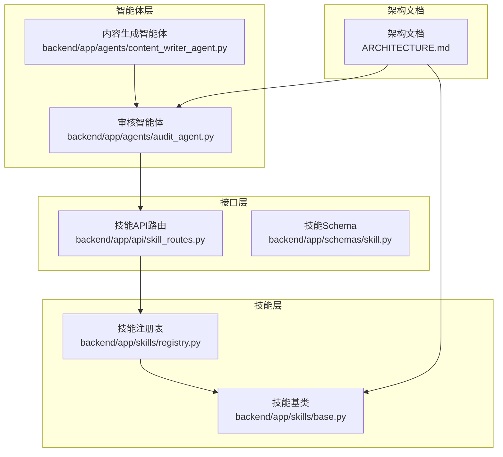
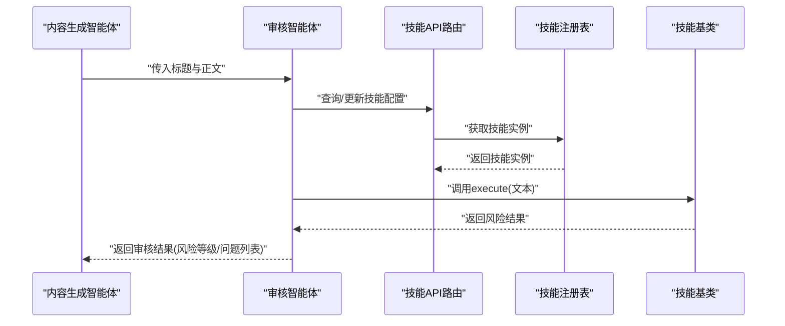
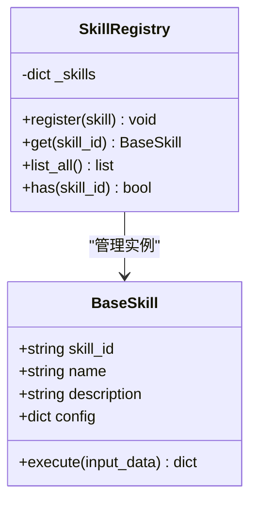
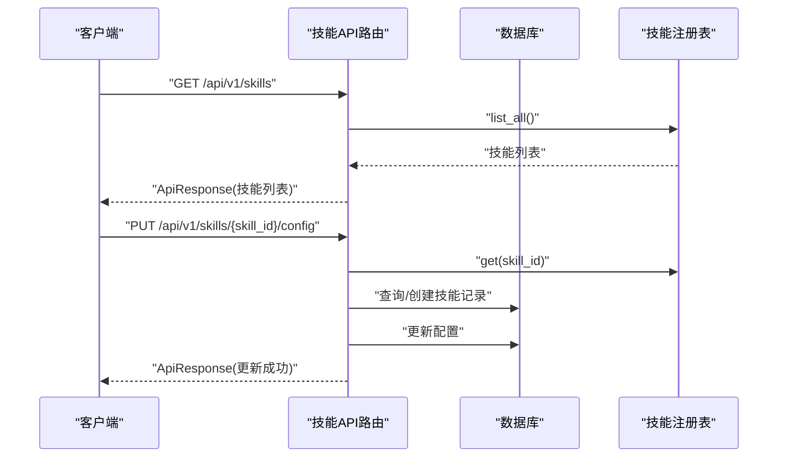
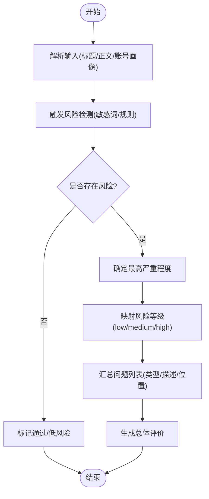
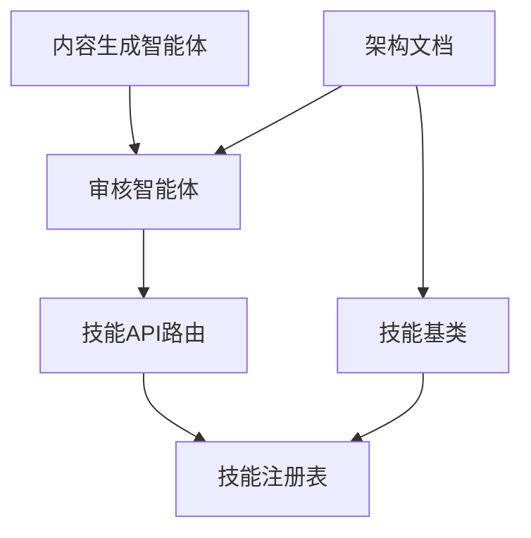

# 风险检测技能

<cite>
**本文引用的文件**
- [架构文档](file://ARCHITECTURE.md)
- [技能注册表](file://backend/app/skills/registry.py)
- [技能基类](file://backend/app/skills/base.py)
- [技能API路由](file://backend/app/api/skill_routes.py)
- [技能Schema](file://backend/app/schemas/skill.py)
- [审核智能体](file://backend/app/agents/audit_agent.py)
- [内容生成智能体](file://backend/app/agents/content_writer_agent.py)
</cite>

## 目录
1. [简介](#简介)
2. [项目结构](#项目结构)
3. [核心组件](#核心组件)
4. [架构概览](#架构概览)
5. [详细组件分析](#详细组件分析)
6. [依赖分析](#依赖分析)
7. [性能考虑](#性能考虑)
8. [故障排查指南](#故障排查指南)
9. [结论](#结论)
10. [附录](#附录)

## 简介
本文件面向开发者与产品团队，系统化阐述“风险检测技能”的实现目标、技术架构、检测规则与评估体系，并提供可落地的集成方案、误报控制与漏检优化策略、风险等级分类与响应机制、以及实际检测案例与规则调整示例。当前版本以关键词匹配与规则引擎为核心，后续可扩展至LLM辅助判定。

## 项目结构
风险检测技能位于后端技能体系中，采用“技能即工具”的设计思想，由智能体在工作流中按需调用。整体结构围绕技能注册表、技能基类、API路由与Schema展开，配合审核智能体在内容生成流水线中进行合规性把关。



**图表来源**
- [技能注册表:10-37](file://backend/app/skills/registry.py#L10-L37)
- [技能基类:16-37](file://backend/app/skills/base.py#L16-L37)
- [技能API路由:14-61](file://backend/app/api/skill_routes.py#L14-L61)
- [技能Schema:6-22](file://backend/app/schemas/skill.py#L6-L22)
- [审核智能体:7-66](file://backend/app/agents/audit_agent.py#L7-L66)
- [内容生成智能体:7-131](file://backend/app/agents/content_writer_agent.py#L7-L131)
- [架构文档:741-748](file://ARCHITECTURE.md#L741-L748)

**章节来源**
- [技能注册表:10-37](file://backend/app/skills/registry.py#L10-L37)
- [技能基类:16-37](file://backend/app/skills/base.py#L16-L37)
- [技能API路由:14-61](file://backend/app/api/skill_routes.py#L14-L61)
- [技能Schema:6-22](file://backend/app/schemas/skill.py#L6-L22)
- [审核智能体:7-66](file://backend/app/agents/audit_agent.py#L7-L66)
- [内容生成智能体:7-131](file://backend/app/agents/content_writer_agent.py#L7-L131)
- [架构文档:741-748](file://ARCHITECTURE.md#L741-L748)

## 核心组件
- 技能基类：定义统一的异步执行接口与配置注入机制，确保所有技能具备稳定的输入输出契约。
- 技能注册表：集中管理技能实例，提供注册、查询、枚举与存在性校验能力。
- 技能API路由：提供技能清单查询与配置更新接口，支持动态配置持久化。
- 审核智能体：在内容生成流水线中承担合规性审核职责，输出风险等级、问题列表与总体评价。
- 架构文档：明确风险检测技能的输入输出、配置项与实现要点，作为设计与开发依据。

**章节来源**
- [技能基类:16-37](file://backend/app/skills/base.py#L16-L37)
- [技能注册表:10-37](file://backend/app/skills/registry.py#L10-L37)
- [技能API路由:14-61](file://backend/app/api/skill_routes.py#L14-L61)
- [审核智能体:7-66](file://backend/app/agents/audit_agent.py#L7-L66)
- [架构文档:741-748](file://ARCHITECTURE.md#L741-L748)

## 架构概览
风险检测技能在内容生产流水线中的位置如下：



**图表来源**
- [内容生成智能体:46-122](file://backend/app/agents/content_writer_agent.py#L46-L122)
- [审核智能体:48-57](file://backend/app/agents/audit_agent.py#L48-L57)
- [技能API路由:17-61](file://backend/app/api/skill_routes.py#L17-L61)
- [技能注册表:22-26](file://backend/app/skills/registry.py#L22-L26)
- [技能基类:26-36](file://backend/app/skills/base.py#L26-L36)

## 详细组件分析

### 风险检测技能定义与输入输出
- 输入：待检测文本对象
- 输出：风险集合与是否存在风险布尔值
- 配置：敏感词表路径、检测规则
- 实现：关键词匹配 + 规则引擎（MVP阶段无需调用LLM）

上述定义来自架构文档，明确了技能的职责边界与扩展方向。

**章节来源**
- [架构文档:741-748](file://ARCHITECTURE.md#L741-L748)

### 技能基类与注册表
- 技能基类提供抽象execute接口，约束输入输出格式，便于统一调度与测试。
- 注册表负责技能生命周期管理，包括注册、查询、枚举与存在性校验，保障运行期稳定性。



**图表来源**
- [技能基类:16-37](file://backend/app/skills/base.py#L16-L37)
- [技能注册表:10-37](file://backend/app/skills/registry.py#L10-L37)

**章节来源**
- [技能基类:16-37](file://backend/app/skills/base.py#L16-L37)
- [技能注册表:10-37](file://backend/app/skills/registry.py#L10-L37)

### 技能API路由与配置持久化
- 列表接口：返回已注册技能的元信息与当前配置。
- 更新接口：支持按技能ID更新配置，配置变更持久化至数据库。



**图表来源**
- [技能API路由:17-61](file://backend/app/api/skill_routes.py#L17-L61)
- [技能注册表:22-26](file://backend/app/skills/registry.py#L22-L26)

**章节来源**
- [技能API路由:17-61](file://backend/app/api/skill_routes.py#L17-L61)
- [技能Schema:19-22](file://backend/app/schemas/skill.py#L19-L22)

### 审核智能体与风险评估
- 审核维度：敏感词检测、事实核查、夸大宣传、标题党程度、调性匹配、内容质量。
- 输出结构：是否通过、风险等级、问题列表（含类型、描述、严重程度、位置）、总体评价。
- 约束：问题数组为空时必须通过；存在高风险问题时必须拒绝；风险等级取最高严重程度。



**图表来源**
- [审核智能体:12-46](file://backend/app/agents/audit_agent.py#L12-L46)

**章节来源**
- [审核智能体:7-66](file://backend/app/agents/audit_agent.py#L7-L66)

### 内容生成流水线中的风险检测
- 内容生成智能体产出正文后，交由审核智能体进行合规性评估。
- 审核智能体在工作流中可配置为非阻断节点，异常时返回降级结果供人工复核。

```mermaid
sequenceDiagram
participant Profile as "账号定位解析智能体"
participant Topic as "热点分析/选题策划"
participant Title as "标题生成"
participant Content as "正文生成"
participant Audit as "审核智能体"
Profile->>Topic : "账号画像"
Topic->>Title : "热点与选题"
Title->>Content : "标题与主题"
Content->>Audit : "正文与标题"
Audit-->>Content : "审核结果(通过/风险等级/问题)"
```

**图表来源**
- [架构文档:835-844](file://ARCHITECTURE.md#L835-L844)
- [内容生成智能体:46-122](file://backend/app/agents/content_writer_agent.py#L46-L122)
- [审核智能体:48-57](file://backend/app/agents/audit_agent.py#L48-L57)

**章节来源**
- [架构文档:835-844](file://ARCHITECTURE.md#L835-L844)
- [内容生成智能体:7-131](file://backend/app/agents/content_writer_agent.py#L7-L131)
- [审核智能体:7-66](file://backend/app/agents/audit_agent.py#L7-L66)

## 依赖分析
- 技能层内部依赖：技能基类为所有技能提供统一接口；注册表集中管理技能实例。
- 接口层依赖：技能API路由依赖注册表与数据库模型，用于查询与更新配置。
- 智能体依赖：审核智能体在工作流中依赖技能配置与内容生成结果；内容生成智能体依赖账号画像与热点素材。
- 架构文档依赖：为技能与智能体提供设计约束与行为规范。



**图表来源**
- [技能基类:16-37](file://backend/app/skills/base.py#L16-L37)
- [技能注册表:10-37](file://backend/app/skills/registry.py#L10-L37)
- [技能API路由:14-61](file://backend/app/api/skill_routes.py#L14-L61)
- [审核智能体:7-66](file://backend/app/agents/audit_agent.py#L7-L66)
- [内容生成智能体:7-131](file://backend/app/agents/content_writer_agent.py#L7-L131)
- [架构文档:741-748](file://ARCHITECTURE.md#L741-L748)

**章节来源**
- [技能基类:16-37](file://backend/app/skills/base.py#L16-L37)
- [技能注册表:10-37](file://backend/app/skills/registry.py#L10-L37)
- [技能API路由:14-61](file://backend/app/api/skill_routes.py#L14-L61)
- [审核智能体:7-66](file://backend/app/agents/audit_agent.py#L7-L66)
- [内容生成智能体:7-131](file://backend/app/agents/content_writer_agent.py#L7-L131)
- [架构文档:741-748](file://ARCHITECTURE.md#L741-L748)

## 性能考虑
- 异步执行：技能基类与智能体均采用异步模式，降低I/O阻塞，提升吞吐。
- 缓存策略：敏感词表与规则可缓存于内存，减少重复加载开销；定期刷新策略基于配置更新接口。
- 并发控制：注册表与API路由应限制并发更新频率，避免数据库写入抖动。
- 监控指标：建议采集执行耗时、错误率、命中率、误报率等指标，结合日志与告警系统进行可视化。

[本节为通用性能指导，不直接分析具体文件]

## 故障排查指南
- 技能未注册：检查注册表是否正确注册技能实例，确认技能ID与模块路径一致。
- 配置更新失败：确认技能ID存在且数据库记录已创建；检查请求体格式与权限。
- 审核服务异常：审核智能体提供降级返回，包含系统问题提示与建议人工复核。
- 结果不符合预期：核对敏感词表与规则配置，必要时通过配置更新接口调整阈值与权重。

**章节来源**
- [技能注册表:16-26](file://backend/app/skills/registry.py#L16-L26)
- [技能API路由:41-60](file://backend/app/api/skill_routes.py#L41-L60)
- [审核智能体:59-65](file://backend/app/agents/audit_agent.py#L59-L65)

## 结论
风险检测技能以“关键词匹配+规则引擎”为核心，结合审核智能体在内容流水线中提供合规性把关。通过技能基类与注册表实现统一抽象与集中管理，配合API路由与Schema完成配置的动态更新与持久化。未来可在MVP基础上引入LLM辅助判定，进一步提升检测精度与鲁棒性。

[本节为总结性内容，不直接分析具体文件]

## 附录

### 风险等级与处理建议
- 低风险：通过审核，可直接发布。
- 中风险：需人工复核，建议修改后二次审核。
- 高风险：拒绝发布，需重大修改并重新提交。

**章节来源**
- [审核智能体:24-46](file://backend/app/agents/audit_agent.py#L24-L46)

### 检测阈值与误报控制
- 阈值设置：敏感词命中次数、规则触发权重、上下文相似度阈值。
- 误报控制：引入白名单、上下文消歧、多规则交叉验证；支持人工标注与反馈闭环。
- 漏检优化：定期更新敏感词表与规则库，结合业务场景动态调整权重。

[本节为通用实践指导，不直接分析具体文件]

### 实际检测案例与规则调整示例
- 案例：标题包含夸张用语，正文缺乏数据支撑 → 标记“夸大宣传”与“内容质量”问题，建议补充数据与限定表述。
- 规则调整：针对特定行业敏感词增加权重；对历史误报词加入排除规则；对新出现的违规表达及时纳入词表。

[本节为通用实践指导，不直接分析具体文件]

### 集成方案与自定义规则开发指南
- 集成步骤
  1) 在技能注册表中注册自定义技能实例。
  2) 通过技能API路由更新配置，保存敏感词表与规则。
  3) 在工作流中调用技能，接收风险结果并驱动后续动作。
- 自定义规则开发
  - 基于关键词匹配：构建正则表达式与同义词集合。
  - 基于规则引擎：定义条件-动作规则，支持优先级与组合逻辑。
  - 基于LLM：在MVP之后引入提示工程与few-shot示例，提升复杂场景识别能力。

**章节来源**
- [技能注册表:16-26](file://backend/app/skills/registry.py#L16-L26)
- [技能API路由:34-60](file://backend/app/api/skill_routes.py#L34-L60)
- [架构文档:741-748](file://ARCHITECTURE.md#L741-L748)