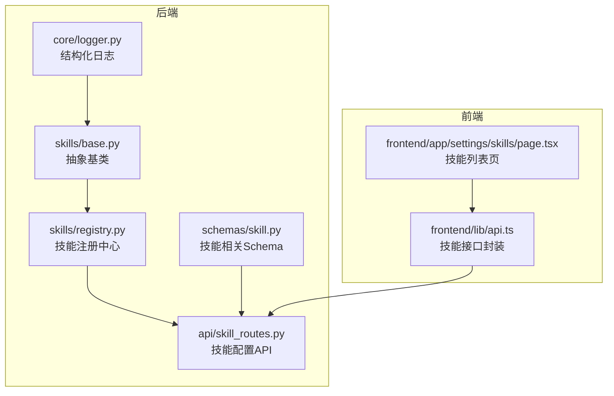
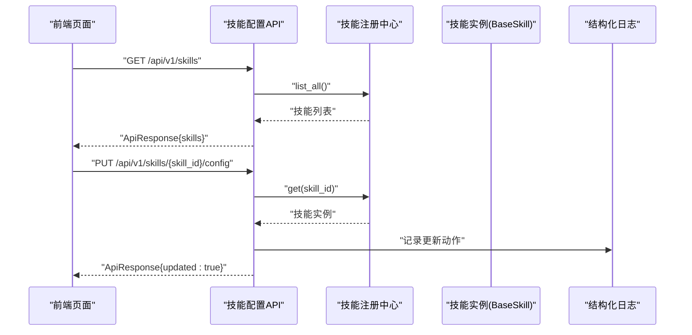
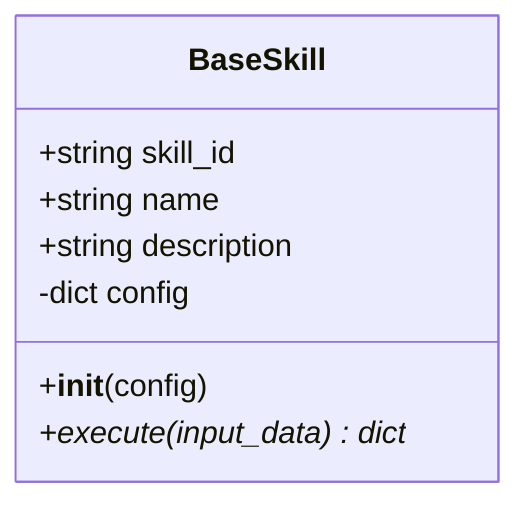
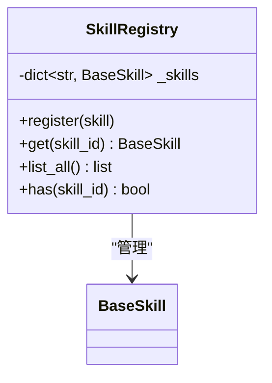
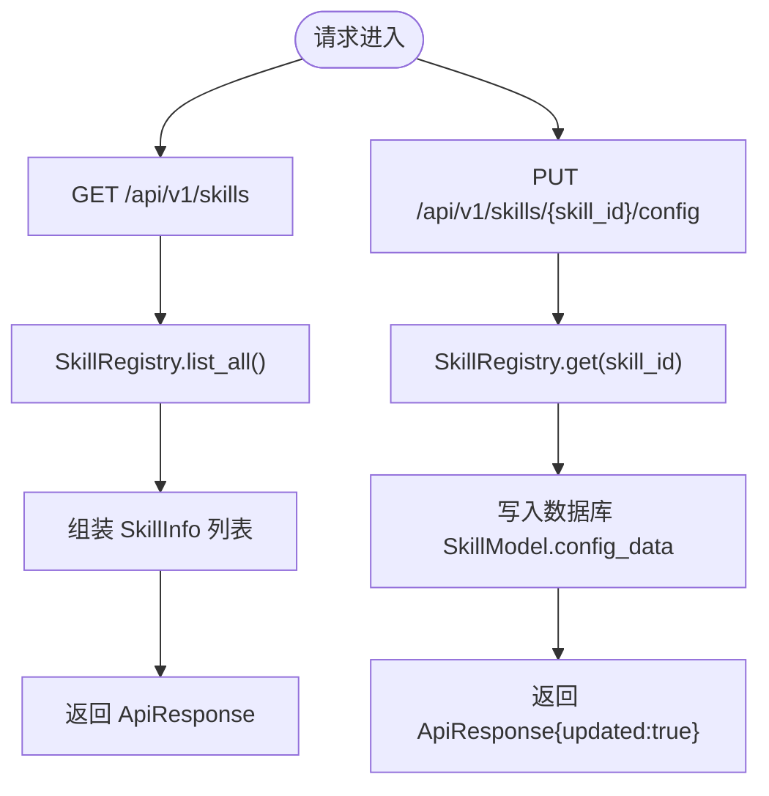
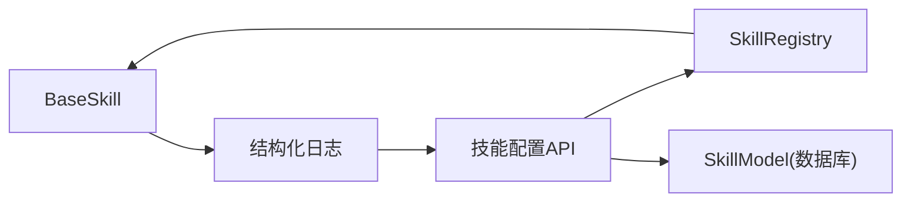

# 技能基类设计

<cite>
**本文引用的文件**
- [backend/app/skills/base.py](file://backend/app/skills/base.py)
- [backend/app/schemas/skill.py](file://backend/app/schemas/skill.py)
- [backend/app/skills/registry.py](file://backend/app/skills/registry.py)
- [backend/app/api/skill_routes.py](file://backend/app/api/skill_routes.py)
- [backend/app/core/logger.py](file://backend/app/core/logger.py)
- [ARCHITECTURE.md](file://ARCHITECTURE.md)
- [frontend/app/settings/skills/page.tsx](file://frontend/app/settings/skills/page.tsx)
- [frontend/lib/api.ts](file://frontend/lib/api.ts)
</cite>

## 目录
1. [引言](#引言)
2. [项目结构](#项目结构)
3. [核心组件](#核心组件)
4. [架构总览](#架构总览)
5. [详细组件分析](#详细组件分析)
6. [依赖分析](#依赖分析)
7. [性能考虑](#性能考虑)
8. [故障排查指南](#故障排查指南)
9. [结论](#结论)
10. [附录](#附录)

## 引言
本文件围绕“技能基类设计”展开，目标是为开发者提供一套完整、可复用的技能抽象与实现指南。文档重点覆盖以下方面：
- BaseSkill 抽象基类的架构设计与职责边界
- 技能接口规范、执行协议与配置管理机制
- 核心属性（skill_id、name、description）的语义与命名规范
- execute 方法的抽象接口设计（输入参数结构化、返回值格式、异步执行）
- 技能作为“工具能力”的设计理念与最佳实践
- 配置注入模式、日志记录规范与错误处理策略
- 继承模板与实现指导

## 项目结构
后端采用分层架构，技能体系位于 backend/app/skills 下，配合注册中心、API 路由与数据模型协同工作；前端提供技能列表与配置更新的用户界面。

**图表来源**
- [backend/app/skills/base.py:1-37](file://backend/app/skills/base.py#L1-L37)
- [backend/app/skills/registry.py:1-37](file://backend/app/skills/registry.py#L1-L37)
- [backend/app/schemas/skill.py:1-22](file://backend/app/schemas/skill.py#L1-L22)
- [backend/app/api/skill_routes.py:1-61](file://backend/app/api/skill_routes.py#L1-L61)
- [backend/app/core/logger.py:1-36](file://backend/app/core/logger.py#L1-L36)
- [frontend/lib/api.ts:86-109](file://frontend/lib/api.ts#L86-L109)
- [frontend/app/settings/skills/page.tsx:40-68](file://frontend/app/settings/skills/page.tsx#L40-L68)

**章节来源**
- [backend/app/skills/base.py:1-37](file://backend/app/skills/base.py#L1-L37)
- [backend/app/skills/registry.py:1-37](file://backend/app/skills/registry.py#L1-L37)
- [backend/app/schemas/skill.py:1-22](file://backend/app/schemas/skill.py#L1-L22)
- [backend/app/api/skill_routes.py:1-61](file://backend/app/api/skill_routes.py#L1-L61)
- [backend/app/core/logger.py:1-36](file://backend/app/core/logger.py#L1-L36)
- [frontend/lib/api.ts:86-109](file://frontend/lib/api.ts#L86-L109)
- [frontend/app/settings/skills/page.tsx:40-68](file://frontend/app/settings/skills/page.tsx#L40-L68)

## 核心组件
- 抽象基类 BaseSkill：定义技能的统一接口与生命周期，包含核心属性与异步 execute 抽象方法。
- 技能注册中心 SkillRegistry：集中管理技能实例，提供注册、查询、枚举等能力，并记录日志。
- 技能 Schema：定义技能信息、列表响应与配置更新请求的数据结构。
- 技能配置 API：提供列出技能与更新技能配置的 HTTP 接口。
- 结构化日志：统一的日志记录入口，便于追踪技能执行与注册行为。
- 前端技能页面与接口封装：展示技能列表、状态与配置，并通过 API 进行更新。

**章节来源**
- [backend/app/skills/base.py:16-37](file://backend/app/skills/base.py#L16-L37)
- [backend/app/skills/registry.py:10-37](file://backend/app/skills/registry.py#L10-L37)
- [backend/app/schemas/skill.py:6-22](file://backend/app/schemas/skill.py#L6-L22)
- [backend/app/api/skill_routes.py:17-61](file://backend/app/api/skill_routes.py#L17-L61)
- [backend/app/core/logger.py:33-36](file://backend/app/core/logger.py#L33-L36)
- [frontend/app/settings/skills/page.tsx:40-68](file://frontend/app/settings/skills/page.tsx#L40-L68)
- [frontend/lib/api.ts:86-109](file://frontend/lib/api.ts#L86-L109)

## 架构总览
技能体系遵循“工具能力”而非“工作流节点”的设计原则：Agent 通过注册中心获取具体技能实例，传入结构化输入并异步执行，最终获得结构化输出。配置通过数据库持久化并在 API 中更新。

**图表来源**
- [backend/app/api/skill_routes.py:17-61](file://backend/app/api/skill_routes.py#L17-L61)
- [backend/app/skills/registry.py:22-26](file://backend/app/skills/registry.py#L22-L26)
- [backend/app/core/logger.py:33-36](file://backend/app/core/logger.py#L33-L36)
- [frontend/lib/api.ts:97-109](file://frontend/lib/api.ts#L97-L109)

## 详细组件分析

### 抽象基类 BaseSkill
- 职责边界
  - 仅承载“工具能力”，不参与编排或状态管理。
  - 提供稳定的输入/输出契约，确保可复用性。
- 核心属性
  - skill_id：技能唯一标识，用于注册与检索。
  - name：技能名称，用于展示与识别。
  - description：技能描述，用于说明用途与约束。
- 配置管理
  - 在构造函数中接收 config 字典，作为技能内部配置注入点。
- 异步执行协议
  - execute(input_data: dict) -> dict：异步执行，输入/输出均为结构化字典。
  - 保持幂等与可测试性，避免副作用依赖外部状态。

**图表来源**
- [backend/app/skills/base.py:19-37](file://backend/app/skills/base.py#L19-L37)

**章节来源**
- [backend/app/skills/base.py:16-37](file://backend/app/skills/base.py#L16-L37)
- [ARCHITECTURE.md:652-666](file://ARCHITECTURE.md#L652-L666)

### 技能注册中心 SkillRegistry
- 职责
  - 维护技能实例映射，支持注册、查询、列举与存在性判断。
  - 在重复注册时记录警告日志，在成功注册时记录信息日志。
- 错误处理
  - 查询不存在的技能时抛出技能未找到异常。

**图表来源**
- [backend/app/skills/registry.py:10-37](file://backend/app/skills/registry.py#L10-L37)

**章节来源**
- [backend/app/skills/registry.py:10-37](file://backend/app/skills/registry.py#L10-L37)
- [backend/app/core/logger.py:33-36](file://backend/app/core/logger.py#L33-L36)

### 技能 Schema 与 API
- 技能信息 Schema
  - SkillInfo：包含技能标识、名称、描述、版本、配置与状态。
  - SkillListResponse：技能列表响应体。
  - SkillConfigUpdateRequest：更新技能配置的请求体。
- 技能配置 API
  - GET /api/v1/skills：返回所有已注册技能的结构化信息。
  - PUT /api/v1/skills/{skill_id}/config：更新指定技能的配置数据，并持久化到数据库。

**图表来源**
- [backend/app/api/skill_routes.py:17-61](file://backend/app/api/skill_routes.py#L17-L61)
- [backend/app/schemas/skill.py:6-22](file://backend/app/schemas/skill.py#L6-L22)

**章节来源**
- [backend/app/schemas/skill.py:6-22](file://backend/app/schemas/skill.py#L6-L22)
- [backend/app/api/skill_routes.py:17-61](file://backend/app/api/skill_routes.py#L17-L61)

### 前端集成
- 技能列表页展示技能名称、ID、版本、状态与描述，并显示当前配置。
- 前端接口封装提供 listSkills 与 updateSkillConfig 方法，分别对应后端的 GET 与 PUT 接口。

**章节来源**
- [frontend/app/settings/skills/page.tsx:40-68](file://frontend/app/settings/skills/page.tsx#L40-L68)
- [frontend/lib/api.ts:86-109](file://frontend/lib/api.ts#L86-L109)

## 依赖分析
- 组件耦合
  - BaseSkill 依赖结构化日志入口，但不依赖数据库或路由层。
  - SkillRegistry 依赖 BaseSkill 与异常类型，负责实例管理。
  - API 路由依赖注册中心与数据模型，负责对外暴露配置能力。
- 外部依赖
  - 结构化日志框架（structlog），统一日志格式与级别。
  - SQLAlchemy 异步会话，用于持久化技能配置。

**图表来源**
- [backend/app/skills/base.py:11](file://backend/app/skills/base.py#L11)
- [backend/app/skills/registry.py:3-5](file://backend/app/skills/registry.py#L3-L5)
- [backend/app/api/skill_routes.py:7-12](file://backend/app/api/skill_routes.py#L7-L12)
- [backend/app/core/logger.py:33-36](file://backend/app/core/logger.py#L33-L36)

**章节来源**
- [backend/app/skills/base.py:11](file://backend/app/skills/base.py#L11)
- [backend/app/skills/registry.py:3-5](file://backend/app/skills/registry.py#L3-L5)
- [backend/app/api/skill_routes.py:7-12](file://backend/app/api/skill_routes.py#L7-L12)
- [backend/app/core/logger.py:33-36](file://backend/app/core/logger.py#L33-L36)

## 性能考虑
- 异步执行：execute 采用异步模式，适合 I/O 密集型工具能力（如网络请求、文件读写）。
- 日志开销：结构化日志以 JSON 渲染，建议在高频路径中控制字段数量与日志级别。
- 注册中心查询：基于内存字典查找，时间复杂度 O(1)，满足高并发场景。
- 数据持久化：配置更新走数据库写入，注意批量更新时的事务与锁竞争。

## 故障排查指南
- 技能未注册
  - 现象：查询技能时报未找到错误。
  - 排查：确认技能是否已通过注册中心完成注册；查看注册日志是否存在重复注册警告。
- 配置未生效
  - 现象：前端显示旧配置。
  - 排查：确认 PUT 请求是否成功；检查数据库中对应记录的配置字段是否更新。
- 日志定位
  - 使用结构化日志定位技能注册与执行过程中的关键事件，结合日志级别进行过滤。

**章节来源**
- [backend/app/skills/registry.py:17-19](file://backend/app/skills/registry.py#L17-L19)
- [backend/app/skills/registry.py:24-26](file://backend/app/skills/registry.py#L24-L26)
- [backend/app/core/logger.py:33-36](file://backend/app/core/logger.py#L33-L36)

## 结论
技能基类设计以“工具能力”为核心，通过清晰的接口契约、稳定的输入输出与可配置的注入机制，实现了高内聚、低耦合的可扩展能力体系。配合注册中心与 API，形成从定义、注册、配置到调用的完整闭环。遵循本文最佳实践，可快速构建高质量、可维护的技能实现。

## 附录

### 最佳实践指南
- 配置注入模式
  - 在构造函数中接收 config 字典，避免硬编码；对必填项进行校验并在初始化阶段抛出明确异常。
- 日志记录规范
  - 使用结构化日志记录关键事件（如注册、执行开始/结束、错误发生），包含上下文字段（如 skill_id、name）。
- 错误处理策略
  - 对外部依赖（网络、文件、数据库）进行显式异常捕获与包装，向上抛出语义化的业务异常。
- 命名规范
  - skill_id：全小写、下划线或短横线分隔，全局唯一；name：人类可读名称；description：简明描述用途与限制。
- 接口设计
  - execute 的输入/输出必须为结构化字典，便于序列化与跨服务传递；避免直接依赖进程内状态。

**章节来源**
- [backend/app/skills/base.py:23-37](file://backend/app/skills/base.py#L23-L37)
- [backend/app/core/logger.py:33-36](file://backend/app/core/logger.py#L33-L36)
- [ARCHITECTURE.md:652-666](file://ARCHITECTURE.md#L652-L666)

### 继承模板与实现指导
- 继承模板
  - 定义 skill_id、name、description 三要素。
  - 在构造函数中接收 config 并进行必要校验。
  - 实现异步 execute 方法，严格遵守输入/输出为结构化字典。
- 实现指导
  - 将外部依赖抽象为可注入的客户端或服务对象，便于测试与替换。
  - 对可能失败的操作添加重试与熔断策略（视具体场景而定）。
  - 在执行前后记录结构化日志，确保可观测性。

**章节来源**
- [backend/app/skills/base.py:19-37](file://backend/app/skills/base.py#L19-L37)
- [ARCHITECTURE.md:693-719](file://ARCHITECTURE.md#L693-L719)