# 技能注册系统

<cite>
**本文引用的文件**
- [backend/app/skills/base.py](file://backend/app/skills/base.py)
- [backend/app/skills/registry.py](file://backend/app/skills/registry.py)
- [backend/app/api/skill_routes.py](file://backend/app/api/skill_routes.py)
- [backend/app/models/tables.py](file://backend/app/models/tables.py)
- [backend/app/schemas/skill.py](file://backend/app/schemas/skill.py)
- [backend/app/core/exceptions.py](file://backend/app/core/exceptions.py)
- [backend/app/main.py](file://backend/app/main.py)
- [OpenClaw-bot-review-main/lib/openclaw-skills.ts](file://OpenClaw-bot-review-main/lib/openclaw-skills.ts)
- [ARCHITECTURE.md](file://ARCHITECTURE.md)
</cite>

## 目录
1. [简介](#简介)
2. [项目结构](#项目结构)
3. [核心组件](#核心组件)
4. [架构总览](#架构总览)
5. [详细组件分析](#详细组件分析)
6. [依赖分析](#依赖分析)
7. [性能考量](#性能考量)
8. [故障排查指南](#故障排查指南)
9. [结论](#结论)
10. [附录](#附录)

## 简介
本文件系统性阐述“技能注册系统”的设计与实现，覆盖技能发现机制、动态加载流程、生命周期管理、注册表数据结构、注册/查找/获取流程、配置验证、最佳实践（命名规范、版本管理、兼容性）、以及卸载与热重载支持建议。文档同时结合后端 Python 与前端 TypeScript 的实现，给出面向开发者的完整框架指导。

## 项目结构
技能注册系统主要分布在后端 Python 与前端 TypeScript 两部分：
- 后端 Python
  - 技能基类与注册中心：skills/base.py、skills/registry.py
  - API 路由：api/skill_routes.py
  - 数据模型：models/tables.py（技能持久化）
  - 请求/响应模型：schemas/skill.py
  - 异常体系：core/exceptions.py
  - 应用入口与全局注册：main.py
- 前端 TypeScript
  - 技能发现与展示：OpenClaw-bot-review-main/lib/openclaw-skills.ts

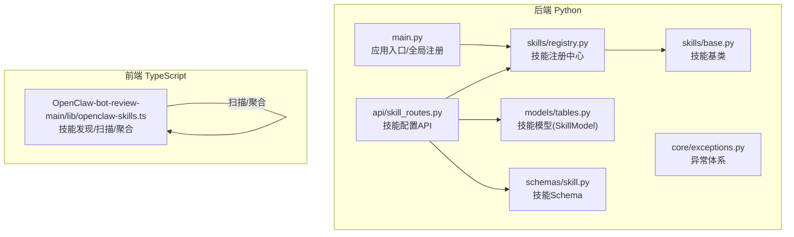

图表来源
- [backend/app/skills/base.py:1-37](file://backend/app/skills/base.py#L1-L37)
- [backend/app/skills/registry.py:1-37](file://backend/app/skills/registry.py#L1-L37)
- [backend/app/api/skill_routes.py:1-61](file://backend/app/api/skill_routes.py#L1-L61)
- [backend/app/models/tables.py:183-199](file://backend/app/models/tables.py#L183-L199)
- [backend/app/schemas/skill.py:1-22](file://backend/app/schemas/skill.py#L1-L22)
- [backend/app/core/exceptions.py:38-43](file://backend/app/core/exceptions.py#L38-L43)
- [backend/app/main.py:32-40](file://backend/app/main.py#L32-L40)
- [OpenClaw-bot-review-main/lib/openclaw-skills.ts:111-151](file://OpenClaw-bot-review-main/lib/openclaw-skills.ts#L111-L151)

章节来源
- [backend/app/skills/base.py:1-37](file://backend/app/skills/base.py#L1-L37)
- [backend/app/skills/registry.py:1-37](file://backend/app/skills/registry.py#L1-L37)
- [backend/app/api/skill_routes.py:1-61](file://backend/app/api/skill_routes.py#L1-L61)
- [backend/app/models/tables.py:183-199](file://backend/app/models/tables.py#L183-L199)
- [backend/app/schemas/skill.py:1-22](file://backend/app/schemas/skill.py#L1-L22)
- [backend/app/core/exceptions.py:38-43](file://backend/app/core/exceptions.py#L38-L43)
- [backend/app/main.py:32-40](file://backend/app/main.py#L32-L40)
- [OpenClaw-bot-review-main/lib/openclaw-skills.ts:111-151](file://OpenClaw-bot-review-main/lib/openclaw-skills.ts#L111-L151)

## 核心组件
- 技能基类 BaseSkill：定义技能的标准接口与元数据字段，约束所有技能实现必须具备的属性与异步执行方法。
- 技能注册中心 SkillRegistry：集中管理已注册技能实例，提供注册、查询、枚举与存在性判断。
- 技能配置 API：提供技能列表与配置更新接口，连接内存注册中心与数据库持久化。
- 技能模型 SkillModel：将技能元数据、配置与状态持久化至数据库。
- 技能 Schema：统一技能信息与配置更新请求的数据结构。
- 异常体系：针对技能不存在等场景提供统一错误码与消息。
- 应用入口：在启动阶段注册内置技能实例，确保系统可用。

章节来源
- [backend/app/skills/base.py:16-37](file://backend/app/skills/base.py#L16-L37)
- [backend/app/skills/registry.py:10-37](file://backend/app/skills/registry.py#L10-L37)
- [backend/app/api/skill_routes.py:17-61](file://backend/app/api/skill_routes.py#L17-L61)
- [backend/app/models/tables.py:183-199](file://backend/app/models/tables.py#L183-L199)
- [backend/app/schemas/skill.py:6-22](file://backend/app/schemas/skill.py#L6-L22)
- [backend/app/core/exceptions.py:38-43](file://backend/app/core/exceptions.py#L38-L43)
- [backend/app/main.py:32-40](file://backend/app/main.py#L32-L40)

## 架构总览
技能注册系统遵循“声明式注册 + 运行时注册中心 + API 管理 + 数据持久化”的整体架构。前端负责技能发现与聚合，后端负责技能实例注册与 API 管理，数据库负责技能配置与状态持久化。

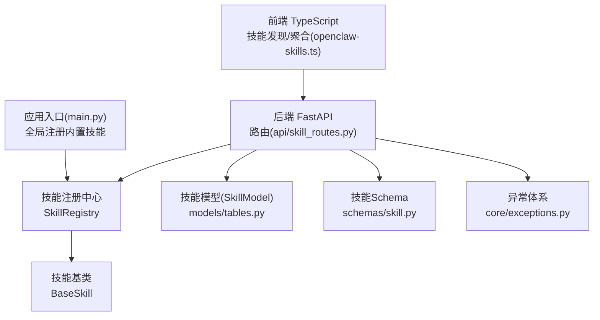

图表来源
- [OpenClaw-bot-review-main/lib/openclaw-skills.ts:111-151](file://OpenClaw-bot-review-main/lib/openclaw-skills.ts#L111-L151)
- [backend/app/api/skill_routes.py:14-61](file://backend/app/api/skill_routes.py#L14-L61)
- [backend/app/skills/registry.py:10-37](file://backend/app/skills/registry.py#L10-L37)
- [backend/app/skills/base.py:16-37](file://backend/app/skills/base.py#L16-L37)
- [backend/app/models/tables.py:183-199](file://backend/app/models/tables.py#L183-L199)
- [backend/app/schemas/skill.py:6-22](file://backend/app/schemas/skill.py#L6-L22)
- [backend/app/core/exceptions.py:38-43](file://backend/app/core/exceptions.py#L38-L43)
- [backend/app/main.py:32-40](file://backend/app/main.py#L32-L40)

## 详细组件分析

### 技能基类 BaseSkill
- 职责：定义技能的标识、名称、描述等元数据，以及异步执行接口 execute。
- 关键点：
  - 元数据字段：skill_id、name、description
  - 配置持有：构造函数接收配置字典，供执行时使用
  - 异步执行：抽象方法 execute(input_data: dict) -> dict

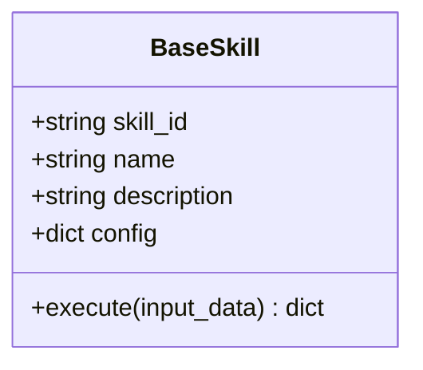

图表来源
- [backend/app/skills/base.py:16-37](file://backend/app/skills/base.py#L16-L37)

章节来源
- [backend/app/skills/base.py:16-37](file://backend/app/skills/base.py#L16-L37)

### 技能注册中心 SkillRegistry
- 职责：维护技能实例映射，提供注册、查询、枚举与存在性判断。
- 关键点：
  - 存储结构：字典，键为 skill_id，值为 BaseSkill 实例
  - 注册：若重复注册会记录警告日志
  - 查询：不存在时抛出技能未找到异常
  - 列表：返回所有已注册技能实例

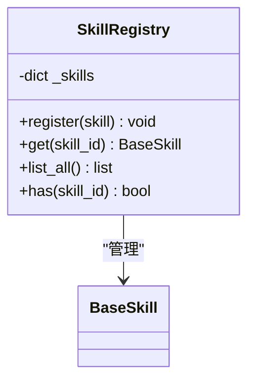

图表来源
- [backend/app/skills/registry.py:10-37](file://backend/app/skills/registry.py#L10-L37)
- [backend/app/skills/base.py:16-37](file://backend/app/skills/base.py#L16-L37)

章节来源
- [backend/app/skills/registry.py:10-37](file://backend/app/skills/registry.py#L10-L37)

### 技能配置 API（FastAPI）
- 路由前缀：/api/v1/skills
- 能力：
  - 列出所有已注册技能，返回结构化信息（含配置与状态）
  - 更新指定技能的配置，持久化到数据库 SkillModel
- 数据流：
  - 调用 SkillRegistry.list_all 获取实例
  - 通过数据库查询/插入/更新 SkillModel 记录

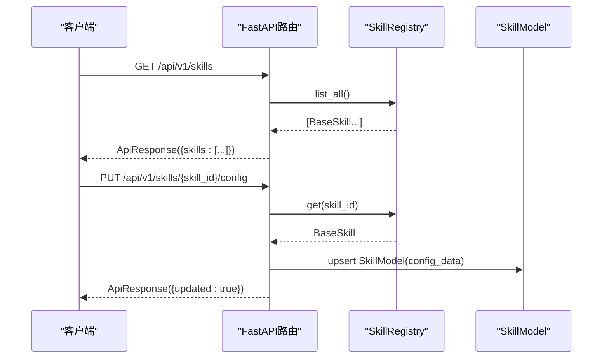

图表来源
- [backend/app/api/skill_routes.py:17-61](file://backend/app/api/skill_routes.py#L17-L61)
- [backend/app/skills/registry.py:22-26](file://backend/app/skills/registry.py#L22-L26)
- [backend/app/models/tables.py:183-199](file://backend/app/models/tables.py#L183-L199)

章节来源
- [backend/app/api/skill_routes.py:17-61](file://backend/app/api/skill_routes.py#L17-L61)

### 技能模型 SkillModel（数据库持久化）
- 字段要点：skill_id、name、description、version、module_path、input_schema、output_schema、config_data、status
- 用途：保存技能的声明式配置与运行时配置，支持 API 更新与持久化

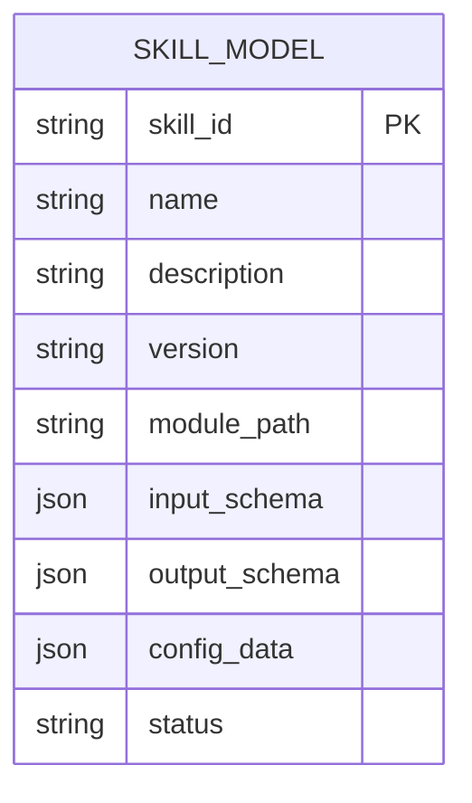

图表来源
- [backend/app/models/tables.py:183-199](file://backend/app/models/tables.py#L183-L199)

章节来源
- [backend/app/models/tables.py:183-199](file://backend/app/models/tables.py#L183-L199)

### 技能 Schema（Pydantic）
- SkillInfo：技能列表返回结构
- SkillListResponse：技能列表响应包装
- SkillConfigUpdateRequest：更新技能配置的请求体

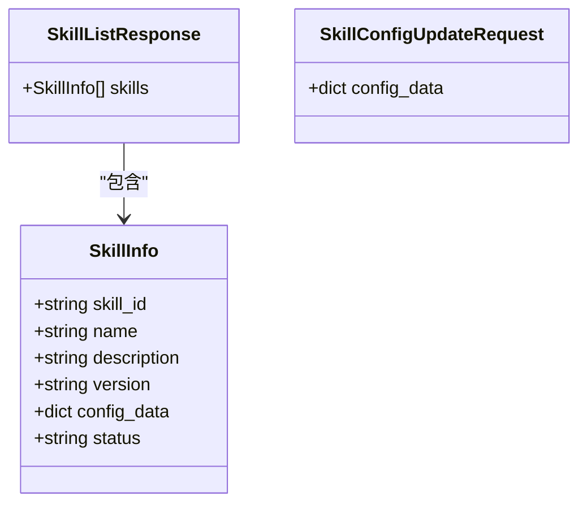

图表来源
- [backend/app/schemas/skill.py:6-22](file://backend/app/schemas/skill.py#L6-L22)

章节来源
- [backend/app/schemas/skill.py:6-22](file://backend/app/schemas/skill.py#L6-L22)

### 异常体系（技能相关）
- SkillNotFoundError：当通过 ID 查询技能不存在时抛出

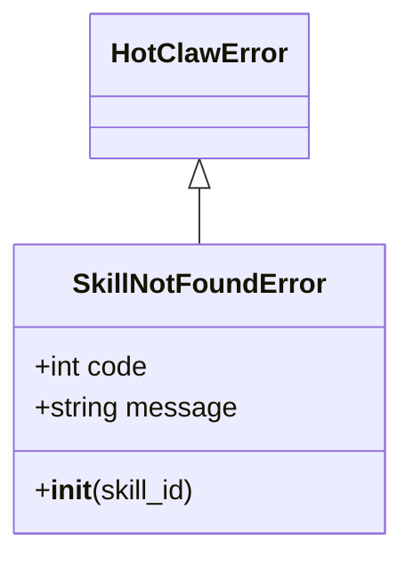

图表来源
- [backend/app/core/exceptions.py:38-43](file://backend/app/core/exceptions.py#L38-L43)

章节来源
- [backend/app/core/exceptions.py:38-43](file://backend/app/core/exceptions.py#L38-L43)

### 应用入口与全局注册
- 在应用生命周期内注册内置技能实例，确保系统启动后即可使用

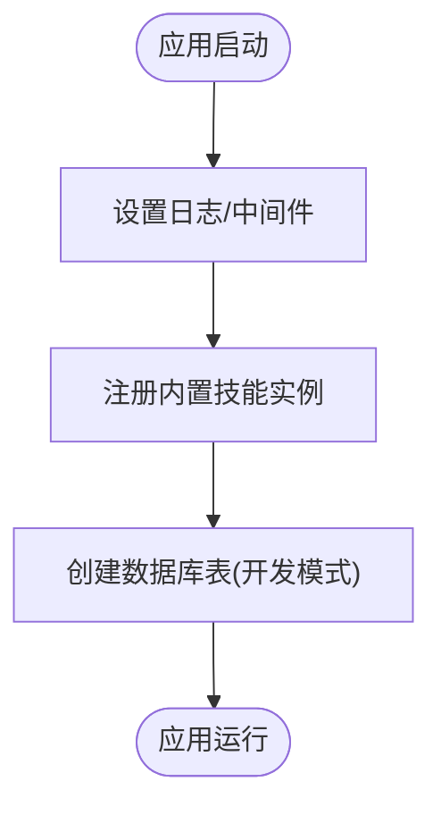

图表来源
- [backend/app/main.py:42-58](file://backend/app/main.py#L42-L58)
- [backend/app/main.py:32-40](file://backend/app/main.py#L32-L40)

章节来源
- [backend/app/main.py:32-40](file://backend/app/main.py#L32-L40)
- [backend/app/main.py:42-58](file://backend/app/main.py#L42-L58)

### 前端技能发现与聚合（TypeScript）
- 能力：
  - 扫描内置、扩展与自定义技能目录，解析 SKILL.md 前言元数据
  - 从会话快照中统计被 Agent 使用过的技能
  - 聚合技能信息与 Agent 列表，提供前端展示
- 关键流程：扫描目录 -> 解析 frontmatter -> 统计使用 -> 返回聚合结果

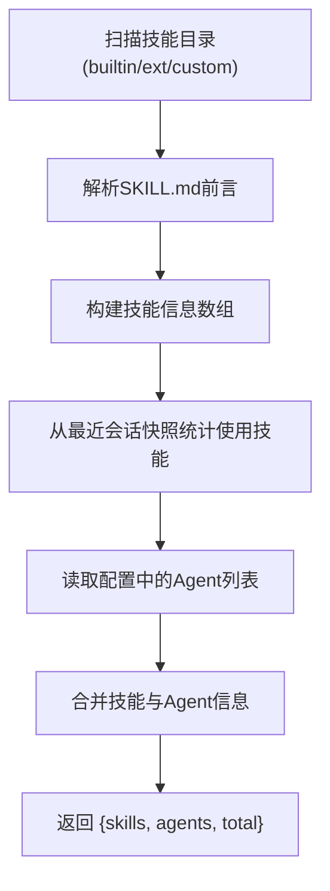

图表来源
- [OpenClaw-bot-review-main/lib/openclaw-skills.ts:111-151](file://OpenClaw-bot-review-main/lib/openclaw-skills.ts#L111-L151)

章节来源
- [OpenClaw-bot-review-main/lib/openclaw-skills.ts:111-151](file://OpenClaw-bot-review-main/lib/openclaw-skills.ts#L111-L151)

## 依赖分析
- 后端依赖关系
  - SkillRegistry 依赖 BaseSkill
  - API 路由依赖 SkillRegistry、SkillModel、SkillInfo Schema、异常体系
  - 应用入口依赖 Agent 注册中心（用于演示注册流程）
- 前端依赖关系
  - openclaw-skills.ts 依赖路径解析与文件系统读取，聚合技能信息

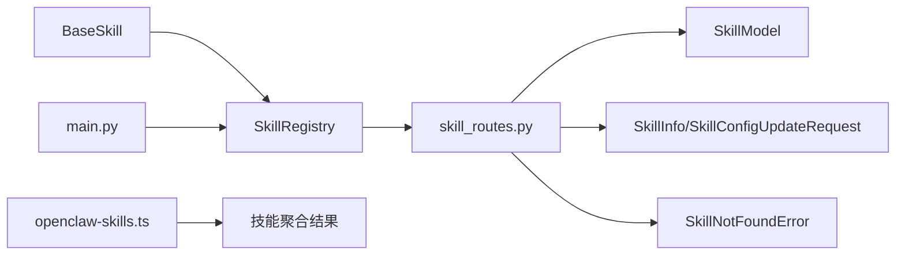

图表来源
- [backend/app/skills/base.py:16-37](file://backend/app/skills/base.py#L16-L37)
- [backend/app/skills/registry.py:10-37](file://backend/app/skills/registry.py#L10-L37)
- [backend/app/api/skill_routes.py:17-61](file://backend/app/api/skill_routes.py#L17-L61)
- [backend/app/models/tables.py:183-199](file://backend/app/models/tables.py#L183-L199)
- [backend/app/schemas/skill.py:6-22](file://backend/app/schemas/skill.py#L6-L22)
- [backend/app/core/exceptions.py:38-43](file://backend/app/core/exceptions.py#L38-L43)
- [backend/app/main.py:32-40](file://backend/app/main.py#L32-L40)
- [OpenClaw-bot-review-main/lib/openclaw-skills.ts:111-151](file://OpenClaw-bot-review-main/lib/openclaw-skills.ts#L111-L151)

章节来源
- [backend/app/skills/base.py:16-37](file://backend/app/skills/base.py#L16-L37)
- [backend/app/skills/registry.py:10-37](file://backend/app/skills/registry.py#L10-L37)
- [backend/app/api/skill_routes.py:17-61](file://backend/app/api/skill_routes.py#L17-L61)
- [backend/app/models/tables.py:183-199](file://backend/app/models/tables.py#L183-L199)
- [backend/app/schemas/skill.py:6-22](file://backend/app/schemas/skill.py#L6-L22)
- [backend/app/core/exceptions.py:38-43](file://backend/app/core/exceptions.py#L38-L43)
- [backend/app/main.py:32-40](file://backend/app/main.py#L32-L40)
- [OpenClaw-bot-review-main/lib/openclaw-skills.ts:111-151](file://OpenClaw-bot-review-main/lib/openclaw-skills.ts#L111-L151)

## 性能考量
- 内存注册中心查询：O(1) 字典查找，适合高频读取
- 列表遍历：线性遍历所有已注册技能，规模较大时注意分页或缓存
- 数据库更新：按需更新 SkillModel，避免频繁写入
- 前端扫描：目录扫描与文件读取在启动时执行，建议缓存结果或增量扫描

## 故障排查指南
- 技能未找到
  - 现象：查询技能时报错
  - 排查：确认技能是否已注册；检查 skill_id 是否正确；查看日志中是否存在重复注册警告
- 配置更新失败
  - 现象：更新技能配置后未生效
  - 排查：确认数据库中 SkillModel 是否成功写入；检查请求体结构是否符合 SkillConfigUpdateRequest
- 前端技能缺失
  - 现象：前端未显示某些技能
  - 排查：确认 SKILL.md 前言格式；检查目录扫描路径；确认会话快照中是否包含对应技能名

章节来源
- [backend/app/skills/registry.py:22-26](file://backend/app/skills/registry.py#L22-L26)
- [backend/app/api/skill_routes.py:40-60](file://backend/app/api/skill_routes.py#L40-L60)
- [OpenClaw-bot-review-main/lib/openclaw-skills.ts:30-47](file://OpenClaw-bot-review-main/lib/openclaw-skills.ts#L30-L47)

## 结论
技能注册系统通过“基类 + 注册中心 + API + 持久化 + 前端发现”的组合，实现了技能的声明式注册、运行时管理与配置治理。后端提供稳定的内存注册中心与统一的 API 接口，前端负责技能发现与聚合，二者协同支撑了技能的全生命周期管理。建议在实际工程中补充动态加载与热重载机制，以进一步提升系统的灵活性与可运维性。

## 附录

### 技能注册流程（类加载、实例化与配置验证）
- 类加载：通过模块路径动态导入技能实现（前端 openclaw-skills.ts 通过文件系统扫描与解析）
- 实例化：在应用启动阶段或运行时根据需要创建技能实例
- 配置验证：通过 SkillModel 的 config_data 字段持久化配置，API 层进行结构校验

章节来源
- [OpenClaw-bot-review-main/lib/openclaw-skills.ts:49-62](file://OpenClaw-bot-review-main/lib/openclaw-skills.ts#L49-L62)
- [backend/app/models/tables.py:183-199](file://backend/app/models/tables.py#L183-L199)
- [backend/app/schemas/skill.py:19-22](file://backend/app/schemas/skill.py#L19-L22)

### 技能查找与获取机制（按ID检索、类型检查与缓存策略）
- 按ID检索：SkillRegistry.get(skill_id) 返回 BaseSkill 实例
- 类型检查：通过异常体系 SkillNotFoundError 处理不存在场景
- 缓存策略：建议在高频查询场景引入 LRU 缓存或数据库查询缓存

章节来源
- [backend/app/skills/registry.py:22-26](file://backend/app/skills/registry.py#L22-L26)
- [backend/app/core/exceptions.py:38-43](file://backend/app/core/exceptions.py#L38-L43)

### 技能注册表数据结构（技能索引、元数据管理与依赖追踪）
- 技能索引：skill_id -> BaseSkill 实例
- 元数据管理：SkillModel 字段涵盖名称、描述、版本、模块路径、输入输出 Schema、配置与状态
- 依赖追踪：前端通过会话快照统计技能使用情况，辅助依赖关系可视化

章节来源
- [backend/app/skills/registry.py:14](file://backend/app/skills/registry.py#L14)
- [backend/app/models/tables.py:183-199](file://backend/app/models/tables.py#L183-L199)
- [OpenClaw-bot-review-main/lib/openclaw-skills.ts:131-138](file://OpenClaw-bot-review-main/lib/openclaw-skills.ts#L131-L138)

### 最佳实践（命名规范、版本管理与兼容性）
- 命名规范：skill_id 唯一且语义清晰；name 与 description 保持一致
- 版本管理：使用 SkillModel.version 字段；API 返回固定版本字段
- 兼容性：新增字段时保持向后兼容；Schema 变更需迁移策略

章节来源
- [backend/app/models/tables.py:190](file://backend/app/models/tables.py#L190)
- [backend/app/api/skill_routes.py:27](file://backend/app/api/skill_routes.py#L27)

### 卸载与热重载支持机制（建议）
- 卸载：从 SkillRegistry 移除实例并清理相关资源；更新数据库状态
- 热重载：监听文件变更或配置变更，触发重新加载与替换实例；保持对外接口稳定

章节来源
- [backend/app/skills/registry.py:16-19](file://backend/app/skills/registry.py#L16-L19)
- [backend/app/models/tables.py:195](file://backend/app/models/tables.py#L195)