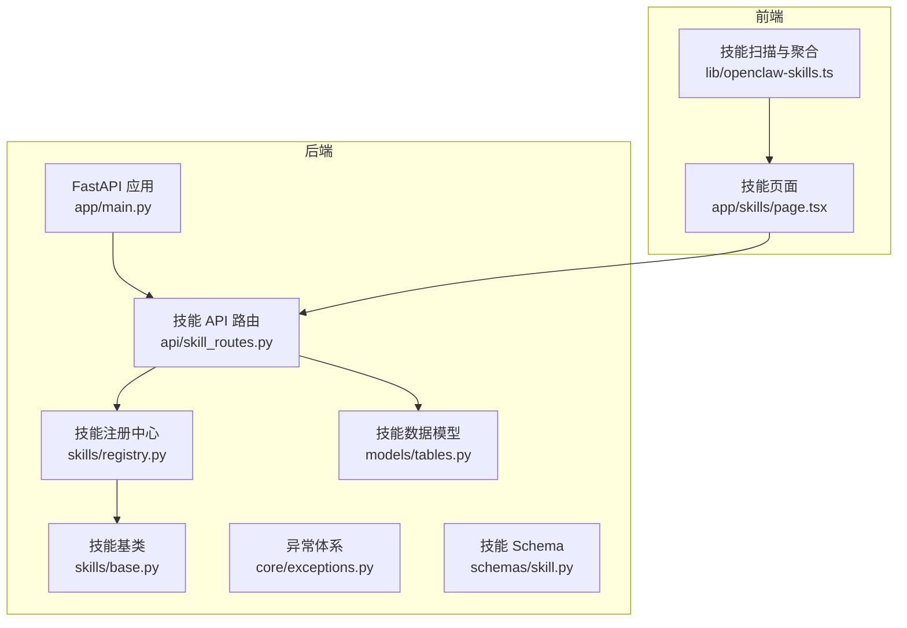
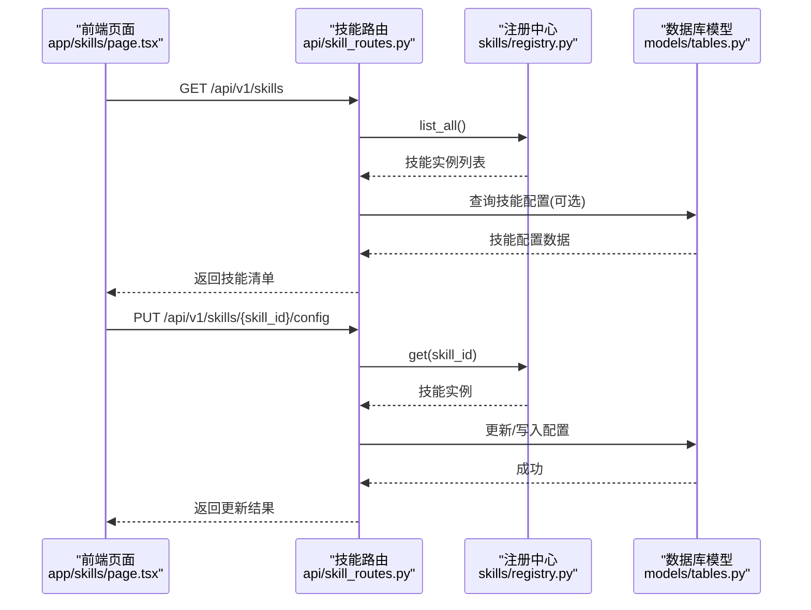
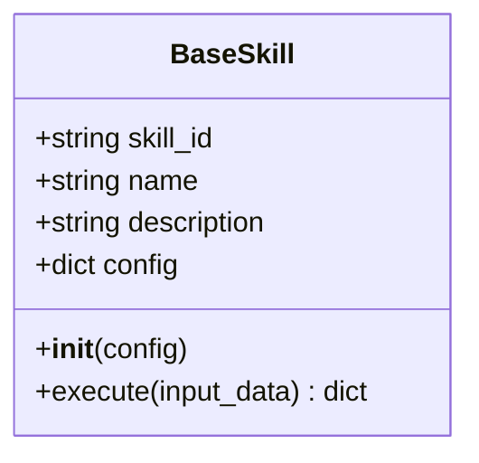
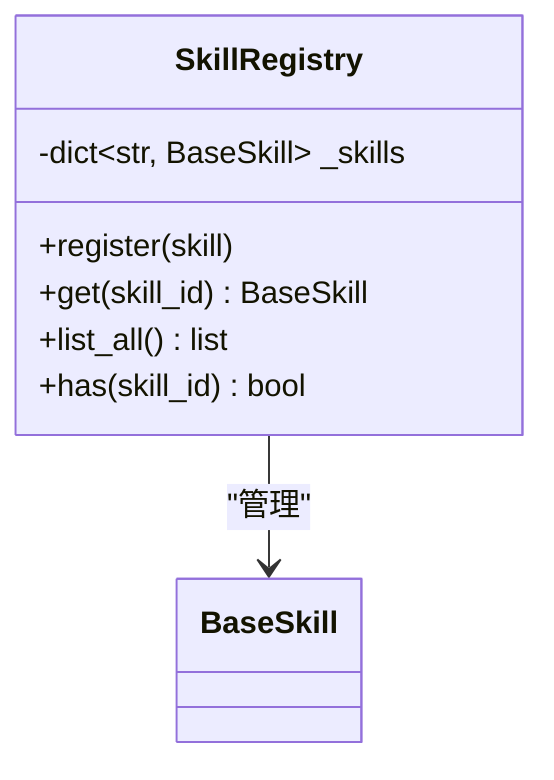
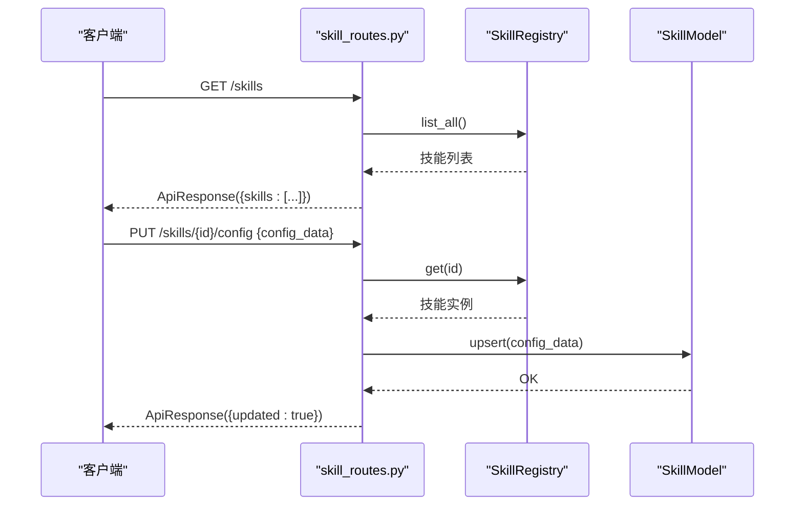
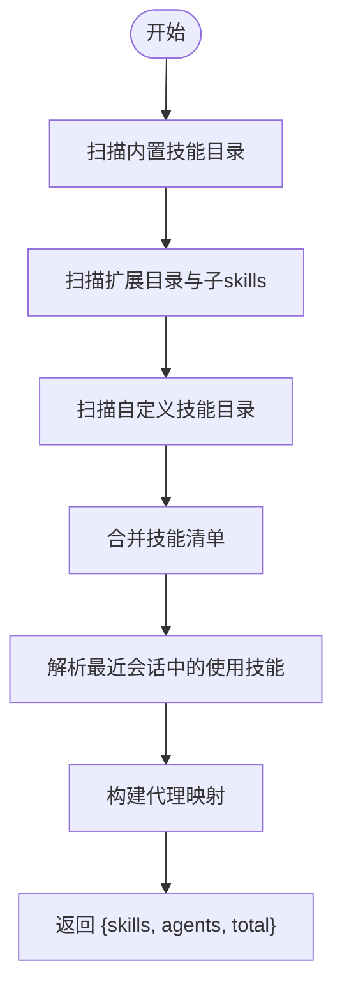
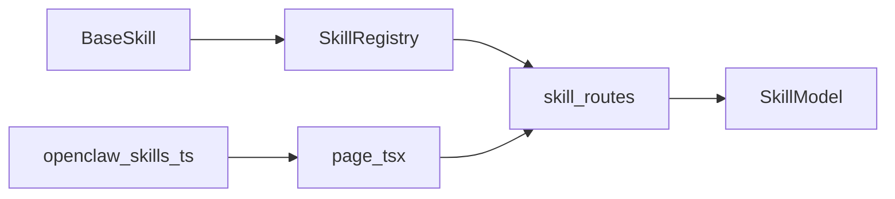
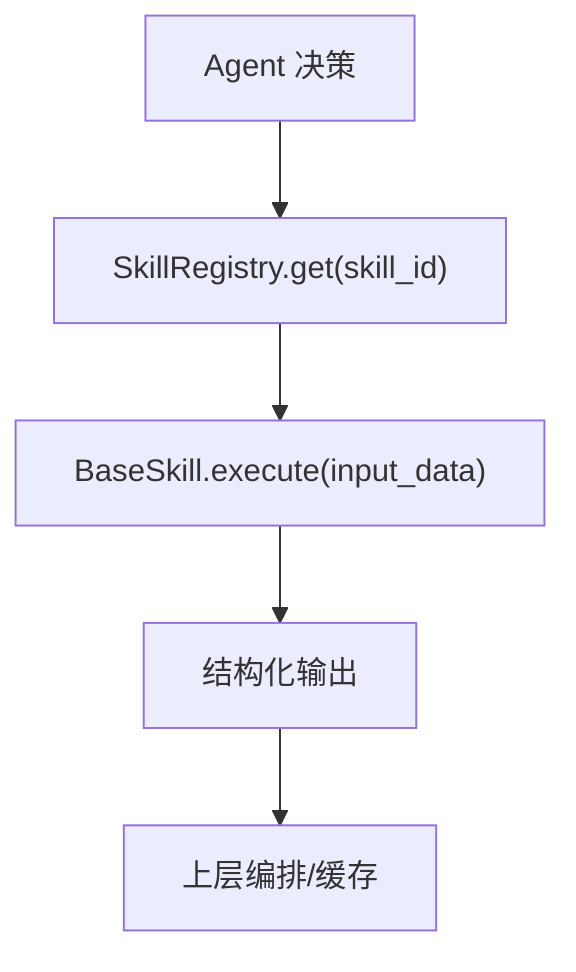

# 技能系统

<cite>
**本文引用的文件**
- [backend/app/skills/base.py](file://backend/app/skills/base.py)
- [backend/app/skills/registry.py](file://backend/app/skills/registry.py)
- [backend/app/api/skill_routes.py](file://backend/app/api/skill_routes.py)
- [backend/app/schemas/skill.py](file://backend/app/schemas/skill.py)
- [backend/app/models/tables.py](file://backend/app/models/tables.py)
- [backend/app/main.py](file://backend/app/main.py)
- [backend/app/core/exceptions.py](file://backend/app/core/exceptions.py)
- [OpenClaw-bot-review-main/lib/openclaw-skills.ts](file://OpenClaw-bot-review-main/lib/openclaw-skills.ts)
- [OpenClaw-bot-review-main/app/skills/page.tsx](file://OpenClaw-bot-review-main/app/skills/page.tsx)
- [ARCHITECTURE.md](file://ARCHITECTURE.md)
</cite>

## 目录
1. [简介](#简介)
2. [项目结构](#项目结构)
3. [核心组件](#核心组件)
4. [架构总览](#架构总览)
5. [详细组件分析](#详细组件分析)
6. [依赖分析](#依赖分析)
7. [性能考虑](#性能考虑)
8. [故障排查指南](#故障排查指南)
9. [结论](#结论)
10. [附录](#附录)

## 简介
本文件为“技能系统”的完整开发文档，面向后端与前端开发者，覆盖以下主题：
- Skill 基类的设计架构：接口规范、执行协议与配置管理机制
- 技能注册中心：技能发现、动态加载与生命周期管理
- 内置技能实现细节：NewsFetcher、SummarySkill 等的输入输出与调用约束
- 自定义技能开发指南：继承规范、依赖注入与错误处理策略
- 技能组合模式、条件执行与性能优化技巧
- 面向开发者的技能开发框架与集成指导

## 项目结构
技能系统由后端 Python 服务与前端 Next.js 页面共同组成：
- 后端负责技能基类、注册中心、API 路由、数据库模型与异常体系
- 前端负责技能清单展示、内容浏览与交互

图表来源
- [backend/app/main.py:1-142](file://backend/app/main.py#L1-L142)
- [backend/app/skills/base.py:1-37](file://backend/app/skills/base.py#L1-L37)
- [backend/app/skills/registry.py:1-37](file://backend/app/skills/registry.py#L1-L37)
- [backend/app/api/skill_routes.py:1-61](file://backend/app/api/skill_routes.py#L1-L61)
- [backend/app/models/tables.py:183-200](file://backend/app/models/tables.py#L183-L200)
- [backend/app/core/exceptions.py:38-43](file://backend/app/core/exceptions.py#L38-L43)
- [backend/app/schemas/skill.py:1-22](file://backend/app/schemas/skill.py#L1-L22)
- [OpenClaw-bot-review-main/app/skills/page.tsx:1-371](file://OpenClaw-bot-review-main/app/skills/page.tsx#L1-L371)
- [OpenClaw-bot-review-main/lib/openclaw-skills.ts:111-162](file://OpenClaw-bot-review-main/lib/openclaw-skills.ts#L111-L162)

章节来源
- [backend/app/main.py:1-142](file://backend/app/main.py#L1-L142)
- [OpenClaw-bot-review-main/app/skills/page.tsx:1-371](file://OpenClaw-bot-review-main/app/skills/page.tsx#L1-L371)
- [OpenClaw-bot-review-main/lib/openclaw-skills.ts:111-162](file://OpenClaw-bot-review-main/lib/openclaw-skills.ts#L111-L162)

## 核心组件
- 技能基类 BaseSkill：定义统一的异步执行协议与配置容器
- 技能注册中心 SkillRegistry：集中管理技能实例、提供查询与列表能力
- 技能 API 路由：提供技能清单与配置更新接口
- 技能数据模型 SkillModel：持久化技能元信息与配置
- 异常体系：对技能不存在、执行失败等进行统一编码
- 前端技能页面与扫描器：展示技能、聚合内置/扩展/自定义技能并统计使用情况

章节来源
- [backend/app/skills/base.py:16-37](file://backend/app/skills/base.py#L16-L37)
- [backend/app/skills/registry.py:10-37](file://backend/app/skills/registry.py#L10-L37)
- [backend/app/api/skill_routes.py:17-61](file://backend/app/api/skill_routes.py#L17-L61)
- [backend/app/models/tables.py:183-200](file://backend/app/models/tables.py#L183-L200)
- [backend/app/core/exceptions.py:38-43](file://backend/app/core/exceptions.py#L38-L43)
- [OpenClaw-bot-review-main/lib/openclaw-skills.ts:111-162](file://OpenClaw-bot-review-main/lib/openclaw-skills.ts#L111-L162)
- [OpenClaw-bot-review-main/app/skills/page.tsx:62-115](file://OpenClaw-bot-review-main/app/skills/page.tsx#L62-L115)

## 架构总览
技能系统采用“声明式注册 + 运行时调用”的模式：
- 启动阶段：后端导入并注册内置 Agent；前端扫描内置/扩展/自定义技能目录，生成技能清单
- 运行阶段：Agent 通过 SkillRegistry 获取具体技能实例并调用 execute；API 提供配置更新与技能清单查询

图表来源
- [backend/app/api/skill_routes.py:17-61](file://backend/app/api/skill_routes.py#L17-L61)
- [backend/app/skills/registry.py:22-26](file://backend/app/skills/registry.py#L22-L26)
- [backend/app/models/tables.py:183-200](file://backend/app/models/tables.py#L183-L200)

## 详细组件分析

### 技能基类设计与执行协议
- 接口规范
  - 必填字段：skill_id、name、description
  - 初始化参数：config（字典）
  - 执行方法：execute(input_data: dict) -> dict（异步）
- 设计原则
  - 无状态：技能不参与编排，仅执行工具型任务
  - 输出稳定：输出应可复用且结构化
  - 配置驱动：通过 config 控制行为（如缓存、超时、开关）

图表来源
- [backend/app/skills/base.py:16-37](file://backend/app/skills/base.py#L16-L37)

章节来源
- [backend/app/skills/base.py:16-37](file://backend/app/skills/base.py#L16-L37)
- [ARCHITECTURE.md:652-666](file://ARCHITECTURE.md#L652-L666)

### 技能注册中心
- 职责
  - 注册：register(skill: BaseSkill)
  - 查询：get(skill_id: str) -> BaseSkill
  - 列表：list_all() -> list[BaseSkill]
  - 存在性：has(skill_id: str) -> bool
- 行为特征
  - 重复注册记录警告
  - 未找到技能抛出统一异常

图表来源
- [backend/app/skills/registry.py:10-37](file://backend/app/skills/registry.py#L10-L37)

章节来源
- [backend/app/skills/registry.py:10-37](file://backend/app/skills/registry.py#L10-L37)
- [backend/app/core/exceptions.py:38-43](file://backend/app/core/exceptions.py#L38-L43)

### 技能 API 路由
- 列出技能：GET /api/v1/skills
  - 返回结构包含 skill_id、name、description、version、config_data、status
- 更新技能配置：PUT /api/v1/skills/{skill_id}/config
  - 请求体：SkillConfigUpdateRequest（含 config_data）
  - 数据持久化：SkillModel 记录模块路径、输入/输出/配置 Schema 等

图表来源
- [backend/app/api/skill_routes.py:17-61](file://backend/app/api/skill_routes.py#L17-L61)
- [backend/app/schemas/skill.py:19-22](file://backend/app/schemas/skill.py#L19-L22)
- [backend/app/models/tables.py:183-200](file://backend/app/models/tables.py#L183-L200)

章节来源
- [backend/app/api/skill_routes.py:17-61](file://backend/app/api/skill_routes.py#L17-L61)
- [backend/app/schemas/skill.py:6-22](file://backend/app/schemas/skill.py#L6-L22)
- [backend/app/models/tables.py:183-200](file://backend/app/models/tables.py#L183-L200)

### 前端技能页面与扫描器
- 技能扫描
  - 扫描内置包、扩展与自定义技能目录，解析 SKILL.md 头信息
  - 解析最近会话中使用的技能，标注使用方
- 技能页面
  - 支持筛选（全部/内置/扩展/自定义）、搜索、查看技能内容
  - 通过 /api/skills 与 /api/skills/content 获取数据

图表来源
- [OpenClaw-bot-review-main/lib/openclaw-skills.ts:111-162](file://OpenClaw-bot-review-main/lib/openclaw-skills.ts#L111-L162)

章节来源
- [OpenClaw-bot-review-main/lib/openclaw-skills.ts:111-162](file://OpenClaw-bot-review-main/lib/openclaw-skills.ts#L111-L162)
- [OpenClaw-bot-review-main/app/skills/page.tsx:62-115](file://OpenClaw-bot-review-main/app/skills/page.tsx#L62-L115)

### 内置技能实现要点（基于架构文档）
- 新闻抓取技能（news_fetcher_skill）
  - 输入：关键词数组、领域、最大条目数
  - 输出：文章列表（标题、来源、链接、发布时间、摘要）
  - 配置：新闻源列表、缓存 TTL、请求超时
  - 实现：HTTP 抓取 + 简单解析（MVP 可用 RSS 或热搜 API）
- 摘要技能（summary_skill）
  - 输入：文本、最大长度
  - 输出：摘要文本
  - 配置：使用的 LLM 模型、温度
  - 实现：调用 LLM 做文本摘要

章节来源
- [ARCHITECTURE.md:721-739](file://ARCHITECTURE.md#L721-L739)

### 自定义技能开发指南
- 继承规范
  - 继承 BaseSkill，设置 skill_id、name、description
  - 在 __init__ 中接收 config 并保存
  - 实现异步 execute 方法，输入输出为结构化字典
- 依赖注入
  - 将外部依赖（如 HTTP 客户端、LLM 客户端）作为构造参数传入
  - 通过 config 控制依赖行为（超时、重试、开关）
- 错误处理策略
  - 对外抛出统一异常类型（如 SkillExecutionError）
  - 记录结构化日志，包含 trace_id、上下文
- 调用约束
  - 保持无状态，避免跨调用共享可变状态
  - 输出稳定、幂等优先，必要时引入缓存与 TTL

章节来源
- [backend/app/skills/base.py:16-37](file://backend/app/skills/base.py#L16-L37)
- [backend/app/core/exceptions.py:93-98](file://backend/app/core/exceptions.py#L93-L98)
- [backend/app/main.py:77-84](file://backend/app/main.py#L77-L84)

### 技能组合模式与条件执行
- 组合模式
  - 多个技能按顺序或并行组合，前序技能输出作为后续输入
  - 通过工作流或编排层协调，技能本身保持无状态
- 条件执行
  - 基于输入参数或配置开关控制是否执行
  - 在 Agent 层根据业务规则决定调用序列
- 性能优化
  - 缓存热点数据（如新闻源结果），设置合理 TTL
  - 对外部 API 调用增加超时与重试
  - 结果去重与增量更新

章节来源
- [ARCHITECTURE.md:699-719](file://ARCHITECTURE.md#L699-L719)

## 依赖分析
- 组件耦合
  - SkillRegistry 与 BaseSkill 单向依赖
  - skill_routes 依赖 SkillRegistry 与 SkillModel
  - 前端 page.tsx 依赖后端 API，lib/openclaw-skills.ts 依赖本地文件系统
- 外部依赖
  - FastAPI、SQLAlchemy、Pydantic（由后端框架提供）
  - 前端 Next.js、React（由前端框架提供）

图表来源
- [backend/app/skills/base.py:16-37](file://backend/app/skills/base.py#L16-L37)
- [backend/app/skills/registry.py:10-37](file://backend/app/skills/registry.py#L10-L37)
- [backend/app/api/skill_routes.py:17-61](file://backend/app/api/skill_routes.py#L17-L61)
- [backend/app/models/tables.py:183-200](file://backend/app/models/tables.py#L183-L200)
- [OpenClaw-bot-review-main/app/skills/page.tsx:78-115](file://OpenClaw-bot-review-main/app/skills/page.tsx#L78-L115)
- [OpenClaw-bot-review-main/lib/openclaw-skills.ts:111-162](file://OpenClaw-bot-review-main/lib/openclaw-skills.ts#L111-L162)

章节来源
- [backend/app/skills/base.py:16-37](file://backend/app/skills/base.py#L16-L37)
- [backend/app/skills/registry.py:10-37](file://backend/app/skills/registry.py#L10-L37)
- [backend/app/api/skill_routes.py:17-61](file://backend/app/api/skill_routes.py#L17-L61)
- [OpenClaw-bot-review-main/app/skills/page.tsx:78-115](file://OpenClaw-bot-review-main/app/skills/page.tsx#L78-L115)
- [OpenClaw-bot-review-main/lib/openclaw-skills.ts:111-162](file://OpenClaw-bot-review-main/lib/openclaw-skills.ts#L111-L162)

## 性能考虑
- 缓存策略
  - 对外部数据源（如新闻热搜）设置 TTL，减少重复抓取
  - 使用内存或分布式缓存存储热点结果
- 超时与重试
  - 为外部 API 调用设置合理超时与指数退避重试
- 输出稳定性
  - 固定输出结构，便于上层编排与缓存命中
- 并发与限流
  - 控制并发请求数，避免对外部服务造成压力
- 日志与追踪
  - 通过中间件注入 trace_id，便于链路追踪与问题定位

## 故障排查指南
- 常见错误与处理
  - 技能不存在：SkillNotFoundError（统一异常码 1004）
  - 技能执行失败：SkillExecutionError（统一异常码 3005）
  - 外部 API/LLM 调用失败：ExternalAPIError/LLMCallError（异常码 3002/3001）
- 排查步骤
  - 检查 /api/v1/skills 是否返回目标技能
  - 核对技能配置是否正确写入数据库
  - 查看系统日志与 trace_id，定位具体失败环节
  - 验证网络连通性与外部服务可用性

章节来源
- [backend/app/core/exceptions.py:38-43](file://backend/app/core/exceptions.py#L38-L43)
- [backend/app/core/exceptions.py:93-98](file://backend/app/core/exceptions.py#L93-L98)
- [backend/app/core/exceptions.py:72-77](file://backend/app/core/exceptions.py#L72-L77)
- [backend/app/core/exceptions.py:65-69](file://backend/app/core/exceptions.py#L65-L69)
- [backend/app/main.py:77-84](file://backend/app/main.py#L77-L84)

## 结论
技能系统以“无状态工具”为核心理念，通过统一的基类与注册中心实现标准化执行协议，并结合前端扫描与 API 管理形成完整的技能生态。开发者可基于此框架快速扩展内置与自定义技能，配合缓存、超时与重试等策略获得稳定性能。

## 附录
- 关键流程图（概念示意）
