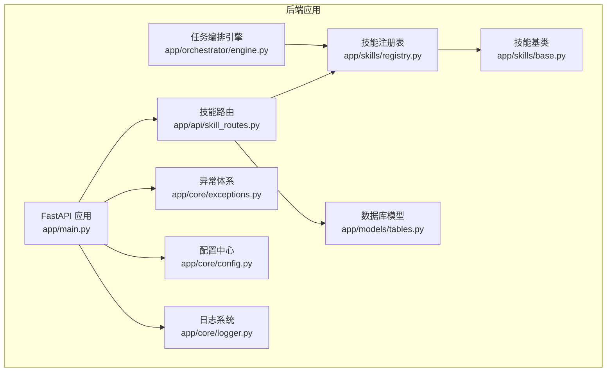
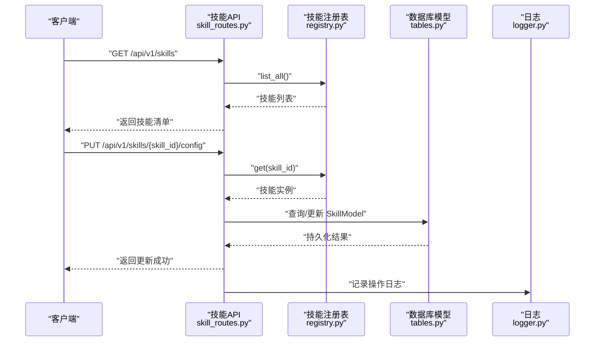
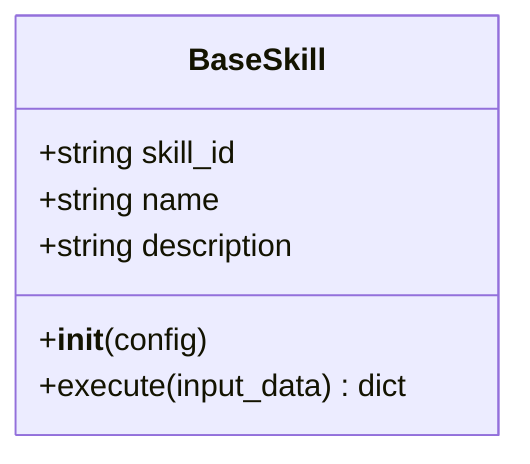
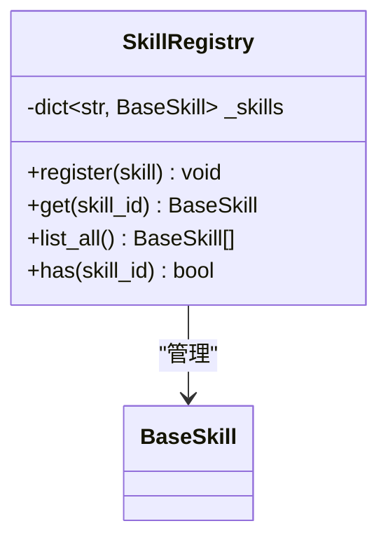
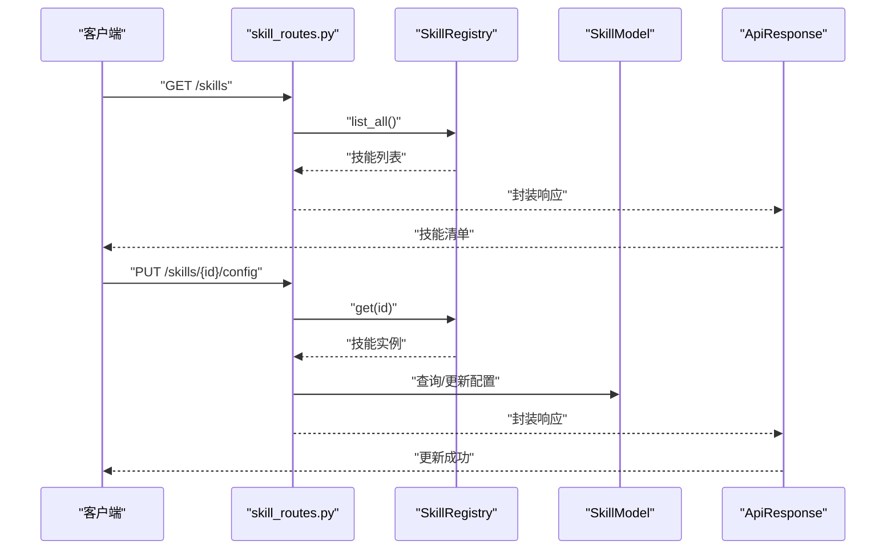
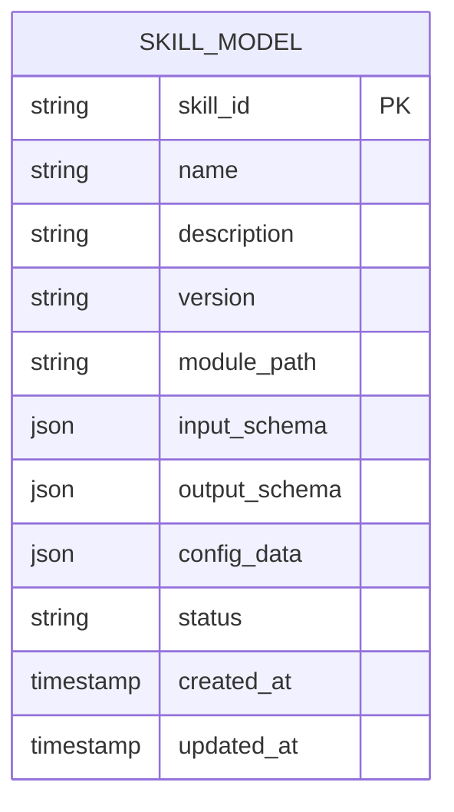
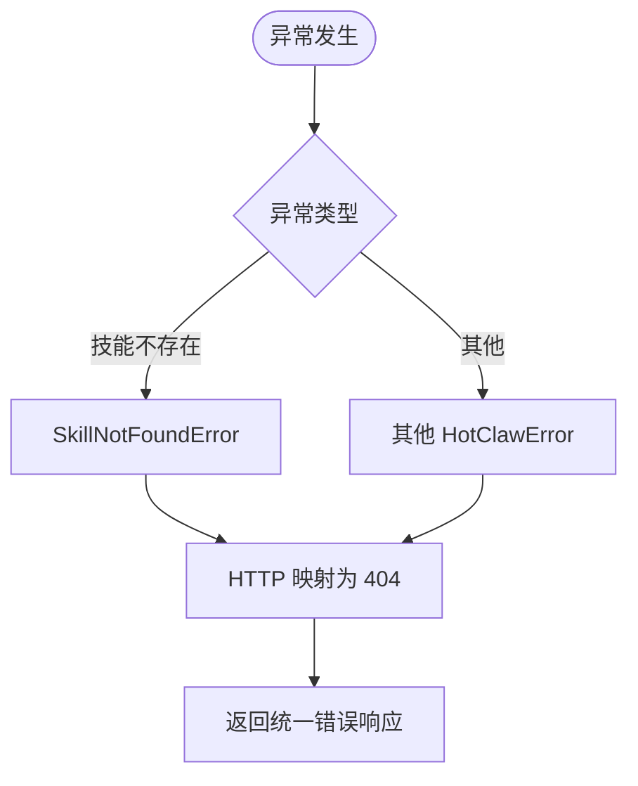
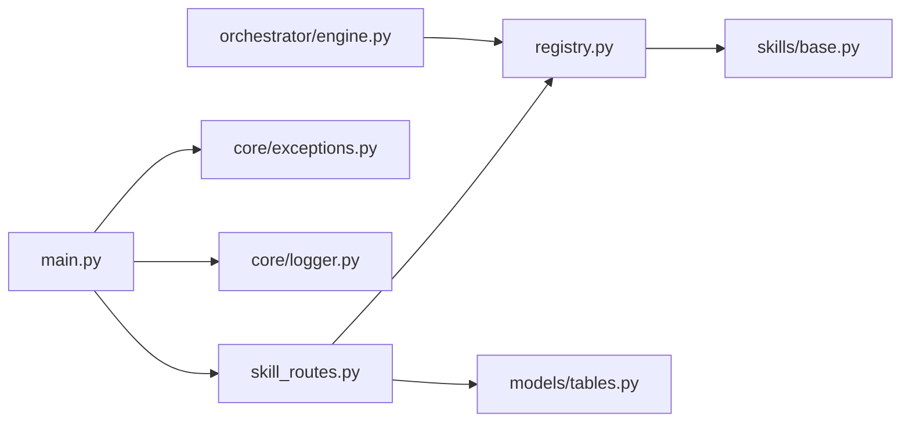

# 自定义技能开发

<cite>
**本文引用的文件**
- [backend/app/skills/base.py](file://backend/app/skills/base.py)
- [backend/app/skills/registry.py](file://backend/app/skills/registry.py)
- [backend/app/api/skill_routes.py](file://backend/app/api/skill_routes.py)
- [backend/app/schemas/skill.py](file://backend/app/schemas/skill.py)
- [backend/app/models/tables.py](file://backend/app/models/tables.py)
- [backend/app/core/exceptions.py](file://backend/app/core/exceptions.py)
- [backend/app/core/config.py](file://backend/app/core/config.py)
- [backend/app/main.py](file://backend/app/main.py)
- [backend/app/orchestrator/engine.py](file://backend/app/orchestrator/engine.py)
- [backend/app/core/logger.py](file://backend/app/core/logger.py)
- [backend/tests/test_agent_api.py](file://backend/tests/test_agent_api.py)
</cite>

## 目录
1. [简介](#简介)
2. [项目结构](#项目结构)
3. [核心组件](#核心组件)
4. [架构总览](#架构总览)
5. [详细组件分析](#详细组件分析)
6. [依赖分析](#依赖分析)
7. [性能考虑](#性能考虑)
8. [故障排查指南](#故障排查指南)
9. [结论](#结论)
10. [附录：从零开始开发自定义技能](#附录从零开始开发自定义技能)

## 简介
本指南面向开发者，提供在本项目中开发“自定义技能”的完整流程与最佳实践。你将学会：
- 继承 BaseSkill 基类并实现异步执行方法
- 将技能注册到全局注册表
- 使用 API 对技能进行查询与配置更新
- 遵循命名约定、配置管理、依赖注入与错误处理规范
- 编写单元测试与集成测试，掌握调试技巧
- 进行性能优化（异步、缓存、资源管理）
- 落实安全策略（输入校验、权限控制、数据保护）

## 项目结构
后端采用 FastAPI + SQLAlchemy 架构，技能系统位于 backend/app/skills，并通过 API 暴露能力；数据库模型在 backend/app/models/tables.py 中定义；统一异常与日志在 core 子模块中。

图表来源
- [backend/app/main.py:1-142](file://backend/app/main.py#L1-L142)
- [backend/app/api/skill_routes.py:1-61](file://backend/app/api/skill_routes.py#L1-L61)
- [backend/app/skills/base.py:1-37](file://backend/app/skills/base.py#L1-L37)
- [backend/app/skills/registry.py:1-37](file://backend/app/skills/registry.py#L1-L37)
- [backend/app/core/exceptions.py:1-125](file://backend/app/core/exceptions.py#L1-L125)
- [backend/app/core/config.py:1-51](file://backend/app/core/config.py#L1-L51)
- [backend/app/core/logger.py:1-36](file://backend/app/core/logger.py#L1-L36)
- [backend/app/orchestrator/engine.py:1-285](file://backend/app/orchestrator/engine.py#L1-L285)
- [backend/app/models/tables.py:1-233](file://backend/app/models/tables.py#L1-L233)

章节来源
- [backend/app/main.py:1-142](file://backend/app/main.py#L1-L142)
- [backend/app/api/skill_routes.py:1-61](file://backend/app/api/skill_routes.py#L1-L61)
- [backend/app/skills/base.py:1-37](file://backend/app/skills/base.py#L1-L37)
- [backend/app/skills/registry.py:1-37](file://backend/app/skills/registry.py#L1-L37)
- [backend/app/models/tables.py:1-233](file://backend/app/models/tables.py#L1-L233)

## 核心组件
- 技能基类 BaseSkill：定义技能的抽象接口与通用属性（如 skill_id、name、description），要求实现异步 execute 方法。
- 技能注册表 SkillRegistry：集中管理已注册技能实例，提供注册、获取、列举与存在性检查等操作。
- 技能 API：提供列出技能与更新技能配置的接口；配置变更持久化至数据库。
- 数据模型：SkillModel 用于持久化技能元信息与配置。
- 异常体系：统一错误码分类，便于前端与监控系统识别。
- 配置中心：集中管理超时、日志级别等运行参数。
- 日志系统：基于 structlog 的结构化日志。
- 编排引擎：在工作流执行过程中调用技能（通过代理间接使用）。

章节来源
- [backend/app/skills/base.py:16-37](file://backend/app/skills/base.py#L16-L37)
- [backend/app/skills/registry.py:10-37](file://backend/app/skills/registry.py#L10-L37)
- [backend/app/api/skill_routes.py:17-61](file://backend/app/api/skill_routes.py#L17-L61)
- [backend/app/models/tables.py:183-200](file://backend/app/models/tables.py#L183-L200)
- [backend/app/core/exceptions.py:38-43](file://backend/app/core/exceptions.py#L38-L43)
- [backend/app/core/config.py:42-46](file://backend/app/core/config.py#L42-L46)
- [backend/app/core/logger.py:8-36](file://backend/app/core/logger.py#L8-L36)
- [backend/app/orchestrator/engine.py:89-285](file://backend/app/orchestrator/engine.py#L89-L285)

## 架构总览
技能在系统中的位置与交互如下：

图表来源
- [backend/app/api/skill_routes.py:17-61](file://backend/app/api/skill_routes.py#L17-L61)
- [backend/app/skills/registry.py:22-26](file://backend/app/skills/registry.py#L22-L26)
- [backend/app/models/tables.py:183-200](file://backend/app/models/tables.py#L183-L200)
- [backend/app/core/logger.py:33-36](file://backend/app/core/logger.py#L33-L36)

## 详细组件分析

### 技能基类 BaseSkill
- 角色：所有技能的抽象基类，约束必须实现异步 execute 方法。
- 关键点：
  - 属性：skill_id、name、description 用于标识与描述技能。
  - 初始化：支持传入配置字典，供子类使用。
  - 执行：execute 接收结构化输入，返回结构化输出。
- 设计模式：抽象工厂/模板方法，确保子类遵循统一契约。

图表来源
- [backend/app/skills/base.py:16-37](file://backend/app/skills/base.py#L16-L37)

章节来源
- [backend/app/skills/base.py:16-37](file://backend/app/skills/base.py#L16-L37)

### 技能注册表 SkillRegistry
- 角色：集中管理技能实例，提供注册、获取、列举与存在性判断。
- 关键点：
  - 注册：若重复注册会记录告警日志。
  - 获取：未找到技能时抛出统一异常。
  - 列举：返回所有已注册技能实例。
- 单例：提供全局共享实例，避免重复初始化。

图表来源
- [backend/app/skills/registry.py:10-37](file://backend/app/skills/registry.py#L10-L37)

章节来源
- [backend/app/skills/registry.py:10-37](file://backend/app/skills/registry.py#L10-L37)

### 技能 API（路由层）
- 列出技能：遍历注册表，组装响应体。
- 更新配置：先校验技能存在性，再读取或创建数据库记录，持久化配置。
- 错误处理：使用统一异常类型，保证错误码与 HTTP 状态映射一致。

图表来源
- [backend/app/api/skill_routes.py:17-61](file://backend/app/api/skill_routes.py#L17-L61)
- [backend/app/skills/registry.py:22-26](file://backend/app/skills/registry.py#L22-L26)
- [backend/app/models/tables.py:183-200](file://backend/app/models/tables.py#L183-L200)

章节来源
- [backend/app/api/skill_routes.py:17-61](file://backend/app/api/skill_routes.py#L17-L61)
- [backend/app/models/tables.py:183-200](file://backend/app/models/tables.py#L183-L200)

### 数据模型与配置持久化
- SkillModel：持久化技能的元信息与配置数据，支持 JSON 字段存储结构化配置。
- API 在更新配置时，若数据库中不存在对应记录则创建新记录，确保配置可追踪。

图表来源
- [backend/app/models/tables.py:183-200](file://backend/app/models/tables.py#L183-L200)

章节来源
- [backend/app/models/tables.py:183-200](file://backend/app/models/tables.py#L183-L200)

### 异常与日志
- 异常：SkillNotFoundError 用于技能不存在场景；统一错误码便于前端与监控系统识别。
- 日志：结构化日志，支持 JSON 输出与时间戳、堆栈信息等增强字段。

图表来源
- [backend/app/core/exceptions.py:38-43](file://backend/app/core/exceptions.py#L38-L43)
- [backend/app/main.py:88-129](file://backend/app/main.py#L88-L129)
- [backend/app/core/logger.py:8-36](file://backend/app/core/logger.py#L8-L36)

章节来源
- [backend/app/core/exceptions.py:38-43](file://backend/app/core/exceptions.py#L38-L43)
- [backend/app/main.py:88-129](file://backend/app/main.py#L88-L129)
- [backend/app/core/logger.py:8-36](file://backend/app/core/logger.py#L8-L36)

## 依赖分析
- 组件耦合：
  - skill_routes 依赖 SkillRegistry 与 SkillModel。
  - SkillRegistry 依赖 BaseSkill。
  - 主应用在启动时注册代理（与技能配合使用），并通过中间件与异常处理器统一治理。
- 外部依赖：
  - FastAPI、SQLAlchemy、structlog、Pydantic 等。

图表来源
- [backend/app/api/skill_routes.py:1-61](file://backend/app/api/skill_routes.py#L1-L61)
- [backend/app/skills/registry.py:1-37](file://backend/app/skills/registry.py#L1-L37)
- [backend/app/skills/base.py:1-37](file://backend/app/skills/base.py#L1-L37)
- [backend/app/models/tables.py:1-233](file://backend/app/models/tables.py#L1-L233)
- [backend/app/main.py:1-142](file://backend/app/main.py#L1-L142)
- [backend/app/core/exceptions.py:1-125](file://backend/app/core/exceptions.py#L1-L125)
- [backend/app/core/logger.py:1-36](file://backend/app/core/logger.py#L1-L36)
- [backend/app/orchestrator/engine.py:1-285](file://backend/app/orchestrator/engine.py#L1-L285)

章节来源
- [backend/app/api/skill_routes.py:1-61](file://backend/app/api/skill_routes.py#L1-L61)
- [backend/app/skills/registry.py:1-37](file://backend/app/skills/registry.py#L1-L37)
- [backend/app/skills/base.py:1-37](file://backend/app/skills/base.py#L1-L37)
- [backend/app/models/tables.py:1-233](file://backend/app/models/tables.py#L1-L233)
- [backend/app/main.py:1-142](file://backend/app/main.py#L1-L142)
- [backend/app/core/exceptions.py:1-125](file://backend/app/core/exceptions.py#L1-L125)
- [backend/app/core/logger.py:1-36](file://backend/app/core/logger.py#L1-L36)
- [backend/app/orchestrator/engine.py:1-285](file://backend/app/orchestrator/engine.py#L1-L285)

## 性能考虑
- 异步执行：execute 必须为异步方法，减少阻塞，提升并发吞吐。
- 超时控制：配置中心提供 skill_timeout，默认值可在部署环境调整。
- 缓存策略：建议在技能内部对昂贵计算或外部调用结果进行缓存（例如 Redis），注意键空间设计与过期策略。
- 资源管理：限制并发度、连接池大小与重试退避；对外部服务调用增加熔断与隔离。
- 日志与追踪：使用结构化日志与 trace_id，便于定位慢调用与异常路径。

章节来源
- [backend/app/skills/base.py:26-36](file://backend/app/skills/base.py#L26-L36)
- [backend/app/core/config.py:42-46](file://backend/app/core/config.py#L42-L46)
- [backend/app/core/logger.py:8-36](file://backend/app/core/logger.py#L8-L36)

## 故障排查指南
- 常见问题
  - 技能未注册：调用 get 会抛出技能不存在异常；检查注册流程与 skill_id 是否一致。
  - 配置未生效：确认 API 已正确更新数据库记录，且重启或刷新缓存。
  - 超时：适当提高 skill_timeout 或优化 execute 内部逻辑。
- 调试技巧
  - 启用调试日志：设置日志级别为 DEBUG，观察结构化输出。
  - 单元测试：参考现有测试风格，构造最小输入，断言输出结构与异常类型。
  - 集成测试：通过 API 路由验证注册、查询与配置更新的端到端流程。

章节来源
- [backend/app/core/exceptions.py:38-43](file://backend/app/core/exceptions.py#L38-L43)
- [backend/app/api/skill_routes.py:34-61](file://backend/app/api/skill_routes.py#L34-L61)
- [backend/tests/test_agent_api.py:7-28](file://backend/tests/test_agent_api.py#L7-L28)
- [backend/app/core/logger.py:8-36](file://backend/app/core/logger.py#L8-L36)

## 结论
本指南提供了从基类继承、注册到 API 配置与持久化的完整闭环，辅以异常、日志、配置与性能优化建议。按此流程开发的技能具备良好的可维护性、可观测性与扩展性。

## 附录：从零开始开发自定义技能

### 步骤一：创建技能类
- 继承 BaseSkill，设置 skill_id、name、description。
- 实现异步 execute 方法，接收结构化输入，返回结构化输出。
- 可在 __init__ 中读取配置字典，用于初始化外部依赖或参数。

章节来源
- [backend/app/skills/base.py:16-37](file://backend/app/skills/base.py#L16-L37)

### 步骤二：注册技能
- 在应用启动阶段或业务初始化时，将技能实例注册到全局注册表。
- 确保 skill_id 全局唯一，避免覆盖已有技能。

章节来源
- [backend/app/skills/registry.py:16-20](file://backend/app/skills/registry.py#L16-L20)

### 步骤三：配置与持久化
- 通过技能 API 更新配置：PUT /api/v1/skills/{skill_id}/config。
- 若数据库中无记录，API 会自动创建；否则更新现有记录。
- 建议在技能内部对敏感配置进行脱敏与最小暴露。

章节来源
- [backend/app/api/skill_routes.py:34-61](file://backend/app/api/skill_routes.py#L34-L61)
- [backend/app/models/tables.py:183-200](file://backend/app/models/tables.py#L183-L200)

### 步骤四：测试与调试
- 单元测试：构造最小输入，断言输出结构与异常类型；参考现有测试风格。
- 集成测试：调用 /api/v1/skills 查询技能列表，调用 /api/v1/skills/{id}/config 更新配置，验证数据库持久化。
- 调试：开启结构化日志，结合 trace_id 定位问题。

章节来源
- [backend/tests/test_agent_api.py:7-28](file://backend/tests/test_agent_api.py#L7-L28)
- [backend/app/core/logger.py:8-36](file://backend/app/core/logger.py#L8-L36)

### 步骤五：性能优化与安全
- 性能：异步 execute、合理超时、缓存与资源池管理。
- 安全：输入参数校验（Schema）、最小权限访问、敏感数据脱敏与加密存储。

章节来源
- [backend/app/skills/base.py:26-36](file://backend/app/skills/base.py#L26-L36)
- [backend/app/core/config.py:42-46](file://backend/app/core/config.py#L42-L46)
- [backend/app/schemas/skill.py:6-22](file://backend/app/schemas/skill.py#L6-L22)