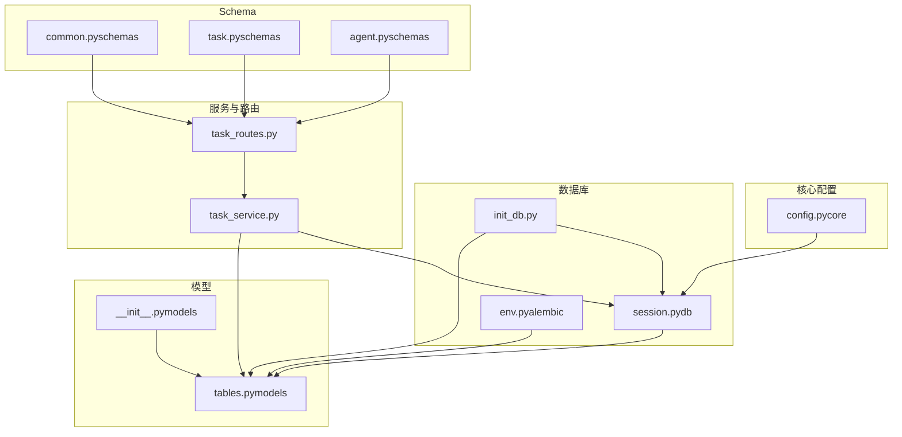
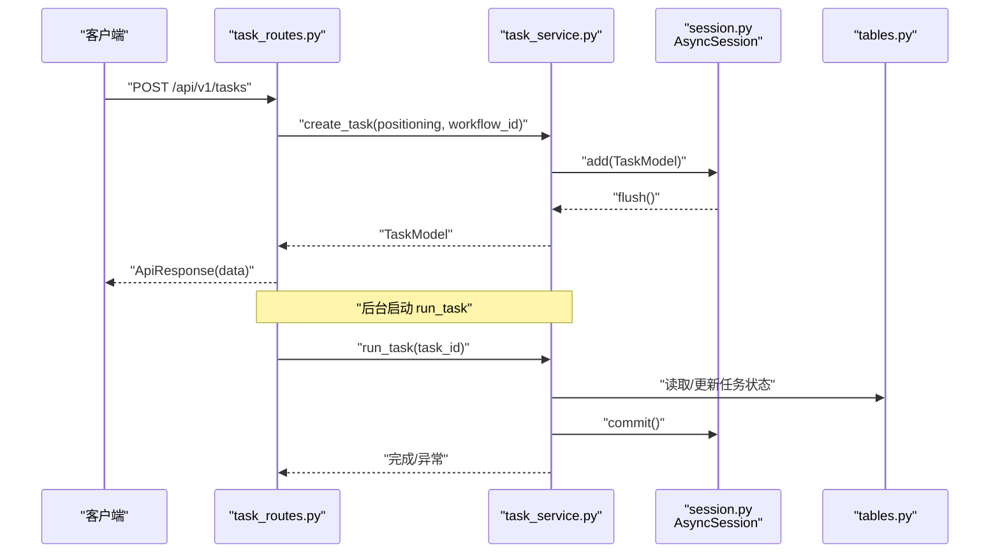
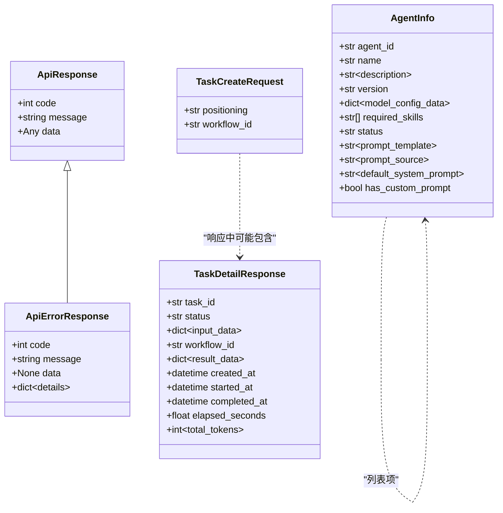
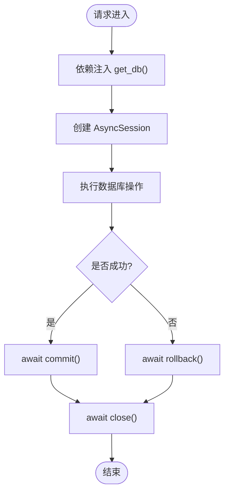
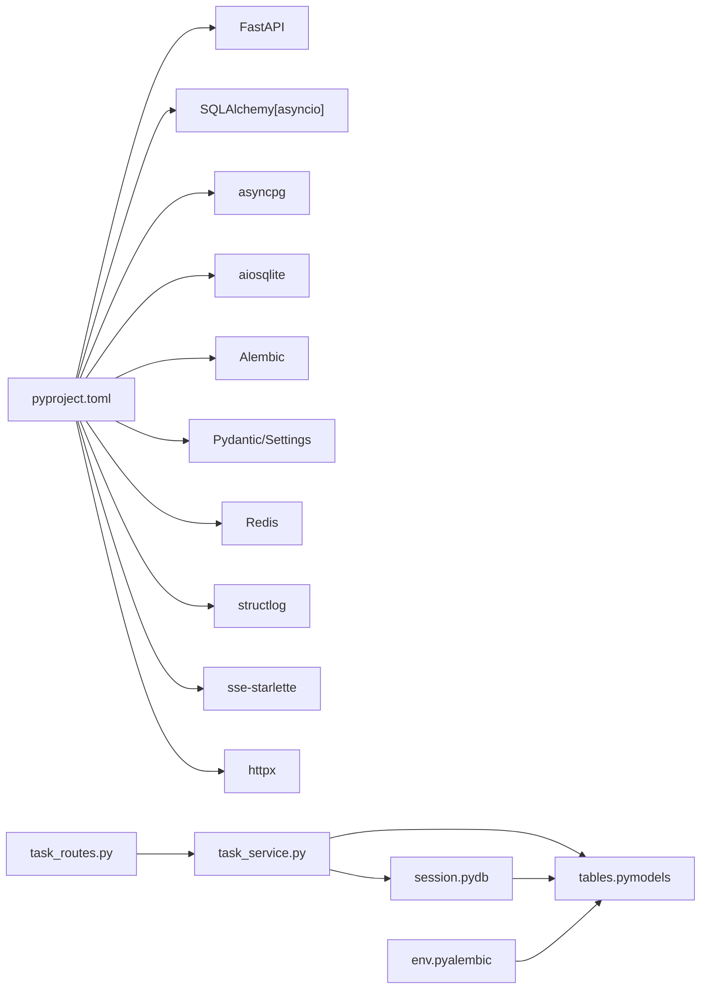

# 数据模型设计

<cite>
**本文引用的文件**
- [tables.py](file://backend/app/models/tables.py)
- [__init__.py（models）](file://backend/app/models/__init__.py)
- [config.py（core）](file://backend/app/core/config.py)
- [session.py（db）](file://backend/app/db/session.py)
- [env.py（alembic）](file://backend/alembic/env.py)
- [script.py.mako（alembic）](file://backend/alembic/script.py.mako)
- [init_db.py](file://scripts/init_db.py)
- [task_service.py](file://backend/app/services/task_service.py)
- [task_routes.py](file://backend/app/api/task_routes.py)
- [common.py（schemas）](file://backend/app/schemas/common.py)
- [task.py（schemas）](file://backend/app/schemas/task.py)
- [agent.py（schemas）](file://backend/app/schemas/agent.py)
- [pyproject.toml](file://backend/pyproject.toml)
</cite>

## 目录
1. [简介](#简介)
2. [项目结构](#项目结构)
3. [核心组件](#核心组件)
4. [架构总览](#架构总览)
5. [详细组件分析](#详细组件分析)
6. [依赖分析](#依赖分析)
7. [性能考虑](#性能考虑)
8. [故障排查指南](#故障排查指南)
9. [结论](#结论)
10. [附录](#附录)

## 简介
本文件系统性梳理后端数据层的设计与实现，覆盖以下方面：
- 数据库表结构与关系映射：重点解析 TaskModel、AgentModel 等核心实体及其外键与级联关系。
- Pydantic 模型的验证机制：字段类型、约束与序列化配置。
- 数据库会话管理：异步引擎、连接池、事务与依赖注入。
- 数据访问模式最佳实践：ORM 使用、查询优化与缓存策略。
- 数据迁移方案：版本管理与回滚策略。
- 面向开发者的完整数据层设计指导与性能优化建议。

## 项目结构
后端采用分层组织：核心配置、数据库会话、ORM 模型、业务服务、API 路由与 Pydantic Schema。关键文件如下图所示：



图表来源
- [config.py（core）:1-51](file://backend/app/core/config.py#L1-L51)
- [session.py（db）:1-33](file://backend/app/db/session.py#L1-L33)
- [env.py（alembic）:1-53](file://backend/alembic/env.py#L1-L53)
- [tables.py（models）:1-233](file://backend/app/models/tables.py#L1-L233)
- [__init__.py（models）:1-28](file://backend/app/models/__init__.py#L1-L28)
- [init_db.py:1-16](file://scripts/init_db.py#L1-L16)
- [common.py（schemas）:1-27](file://backend/app/schemas/common.py#L1-L27)
- [task.py（schemas）:1-83](file://backend/app/schemas/task.py#L1-L83)
- [agent.py（schemas）:1-29](file://backend/app/schemas/agent.py#L1-L29)
- [task_service.py:1-126](file://backend/app/services/task_service.py#L1-L126)
- [task_routes.py:1-163](file://backend/app/api/task_routes.py#L1-L163)

章节来源
- [config.py（core）:1-51](file://backend/app/core/config.py#L1-L51)
- [session.py（db）:1-33](file://backend/app/db/session.py#L1-L33)
- [tables.py（models）:1-233](file://backend/app/models/tables.py#L1-L233)
- [__init__.py（models）:1-28](file://backend/app/models/__init__.py#L1-L28)
- [env.py（alembic）:1-53](file://backend/alembic/env.py#L1-L53)
- [script.py.mako（alembic）:1-25](file://backend/alembic/script.py.mako#L1-L25)
- [init_db.py:1-16](file://scripts/init_db.py#L1-L16)
- [common.py（schemas）:1-27](file://backend/app/schemas/common.py#L1-L27)
- [task.py（schemas）:1-83](file://backend/app/schemas/task.py#L1-L83)
- [agent.py（schemas）:1-29](file://backend/app/schemas/agent.py#L1-L29)
- [task_service.py:1-126](file://backend/app/services/task_service.py#L1-L126)
- [task_routes.py:1-163](file://backend/app/api/task_routes.py#L1-L163)

## 核心组件
- ORM 模型层：基于 SQLAlchemy 2.x 异步 ORM 的 DeclarativeBase 子类集合，包含任务、节点执行、账号画像、话题候选、文章草稿、审核结果、代理、技能、工作流模板与系统日志等表。
- Schema 层：Pydantic BaseModel 定义请求与响应结构，统一返回包装器与错误格式。
- 会话与配置：异步引擎与会话工厂，支持 SQLite（开发）与 PostgreSQL（生产），并提供 Alembic 异步迁移环境。
- 服务与路由：TaskService 提供任务生命周期业务逻辑；API 路由负责请求解析与响应封装，并通过依赖注入获取会话。

章节来源
- [tables.py（models）:1-233](file://backend/app/models/tables.py#L1-L233)
- [__init__.py（models）:1-28](file://backend/app/models/__init__.py#L1-L28)
- [config.py（core）:1-51](file://backend/app/core/config.py#L1-L51)
- [session.py（db）:1-33](file://backend/app/db/session.py#L1-L33)
- [env.py（alembic）:1-53](file://backend/alembic/env.py#L1-L53)
- [task_service.py:1-126](file://backend/app/services/task_service.py#L1-L126)
- [task_routes.py:1-163](file://backend/app/api/task_routes.py#L1-L163)
- [common.py（schemas）:1-27](file://backend/app/schemas/common.py#L1-L27)
- [task.py（schemas）:1-83](file://backend/app/schemas/task.py#L1-L83)
- [agent.py（schemas）:1-29](file://backend/app/schemas/agent.py#L1-L29)

## 架构总览
下图展示从 API 到数据库的调用链路与数据流向，强调异步会话、依赖注入与后台任务执行。



图表来源
- [task_routes.py:1-163](file://backend/app/api/task_routes.py#L1-L163)
- [task_service.py:1-126](file://backend/app/services/task_service.py#L1-L126)
- [session.py（db）:1-33](file://backend/app/db/session.py#L1-L33)
- [tables.py（models）:1-233](file://backend/app/models/tables.py#L1-L233)

## 详细组件分析

### 数据库表结构与关系映射
- 基类与主键
  - 所有模型继承自 DeclarativeBase 子类，统一使用字符串或整数主键，部分表启用自增主键。
- 核心实体与关系
  - TaskModel：任务主表，包含输入输出、状态、计时与令牌统计字段；一对多关系到 TaskNodeRunModel、AccountProfileModel、TopicCandidateModel、ArticleDraftModel。
  - TaskNodeRunModel：节点执行记录，外键关联任务；包含节点/代理标识、状态、计时与令牌统计、重试次数与降级标记。
  - AccountProfileModel：账号画像，一对一关联任务，存储定位信息与风格参数。
  - TopicCandidateModel：话题候选，一对多关联任务，包含标题、角度、钩子、目标情感、评分与排序。
  - ArticleDraftModel：文章草稿，一对多关联任务，包含标题、Markdown/HTML 内容、字数、结构与标签；一对一关联 AuditResultModel。
  - AuditResultModel：审核结果，一对一关联草稿，包含风险等级、问题列表与总体评论。
  - AgentModel：代理配置，主键为 agent_id，存储模块路径、模型配置、提示词模板、输入输出模式、所需技能、重试与回退配置、状态。
  - SkillModel：技能配置，主键为 skill_id，存储模块路径、输入输出模式、配置数据与状态。
  - WorkflowTemplateModel：工作流模板，主键为 workflow_id，存储模板定义、输入模式与输出映射。
  - SystemLogModel：系统日志，包含追踪 ID、任务 ID、节点 ID、级别、模块、消息与上下文。
- 外键与约束
  - 多处使用 ForeignKey 指向 tasks.id；AccountProfileModel 对 tasks.id 建立唯一约束。
  - JSON 字段用于存储结构化数据；Text 字段用于长文本；DateTime 字段默认值与更新触发器由 server_default/onupdate 提供。
- 关系映射
  - 使用 relationship/back_populates 建立双向关系；部分关系设置 cascade="all, delete-orphan" 实现级联删除。

```mermaid
erDiagram
TASKS {
string id PK
string workflow_id
string status
json input_data
json result_data
text error_message
datetime started_at
datetime completed_at
float elapsed_seconds
int total_tokens
datetime created_at
datetime updated_at
}
TASK_NODE_RUNS {
int id PK
string task_id FK
string node_id
string agent_id
string status
json input_data
json output_data
text error_message
boolean degraded
datetime started_at
datetime completed_at
float elapsed_seconds
int prompt_tokens
int completion_tokens
string model_used
int retry_count
datetime created_at
datetime updated_at
}
ACCOUNT_PROFILES {
int id PK
string task_id FK UK
text positioning
string domain
string subdomain
json target_audience
string tone
string content_style
json keywords
datetime created_at
datetime updated_at
}
TOPIC_CANDIDATES {
int id PK
string task_id FK
string title
text angle
text hook
string target_emotion
float estimated_appeal
text reasoning
int rank
boolean selected
datetime created_at
datetime updated_at
}
ARTICLE_DRAFTS {
int id PK
string task_id FK
string title
text content_markdown
text content_html
int word_count
json structure
json tags
string status
datetime created_at
datetime updated_at
}
AUDIT_RESULTS {
int id PK
string task_id FK
int draft_id FK
boolean passed
string risk_level
json issues
text overall_comment
datetime created_at
datetime updated_at
}
AGENTS {
string agent_id PK
string name
text description
string version
string module_path
json model_config_data
text prompt_template
json input_schema
json output_schema
json required_skills
json retry_config
json fallback_config
string status
datetime created_at
datetime updated_at
}
SKILLS {
string skill_id PK
string name
text description
string version
string module_path
json input_schema
json output_schema
json config_data
string status
datetime created_at
datetime updated_at
}
WORKFLOW_TEMPLATES {
string workflow_id PK
string name
text description
string version
json definition
json input_schema
json output_mapping
string status
datetime created_at
datetime updated_at
}
SYSTEM_LOGS {
int id PK
string trace_id
string task_id
string node_id
string level
string module
text message
json context
datetime created_at
}
TASKS ||--o{ TASK_NODE_RUNS : "拥有"
TASKS ||--|| ACCOUNT_PROFILES : "拥有"
TASKS ||--o{ TOPIC_CANDIDATES : "拥有"
TASKS ||--o{ ARTICLE_DRAFTS : "拥有"
TASKS ||--o{ AUDIT_RESULTS : "拥有"
TASK_NODE_RUNS }o--|| TASKS : "属于"
ACCOUNT_PROFILES }o--|| TASKS : "属于"
TOPIC_CANDIDATES }o--|| TASKS : "属于"
ARTICLE_DRAFTS }o--|| TASKS : "属于"
AUDIT_RESULTS }o--|| ARTICLE_DRAFTS : "属于"
```

图表来源
- [tables.py（models）:1-233](file://backend/app/models/tables.py#L1-L233)

章节来源
- [tables.py（models）:1-233](file://backend/app/models/tables.py#L1-L233)

### Pydantic 模型验证机制
- 统一响应包装
  - ApiResponse：通用响应体，包含 code、message、data；ApiErrorResponse：错误响应，包含 details。
- 任务相关 Schema
  - TaskCreateRequest：创建任务的请求体，对 positioning 进行长度约束，workflow_id 提供默认值。
  - TaskDetailResponse/TaskStatusResponse/NodeRunData：响应体字段覆盖任务状态、进度、节点运行详情与令牌统计。
- 代理相关 Schema
  - AgentInfo：代理基本信息与配置字段；AgentListResponse：代理列表；AgentConfigUpdateRequest：代理配置更新请求体。
- 序列化配置
  - 使用 BaseModel 字段类型注解与 Field 约束；序列化时自动处理嵌套对象与可选字段。



图表来源
- [common.py（schemas）:1-27](file://backend/app/schemas/common.py#L1-L27)
- [task.py（schemas）:1-83](file://backend/app/schemas/task.py#L1-L83)
- [agent.py（schemas）:1-29](file://backend/app/schemas/agent.py#L1-L29)

章节来源
- [common.py（schemas）:1-27](file://backend/app/schemas/common.py#L1-L27)
- [task.py（schemas）:1-83](file://backend/app/schemas/task.py#L1-L83)
- [agent.py（schemas）:1-29](file://backend/app/schemas/agent.py#L1-L29)

### 数据库会话管理
- 引擎与会话
  - 使用 create_async_engine 创建异步引擎，根据配置选择 echo 与 pool_pre_ping（非 SQLite）。
  - async_session_factory 提供 AsyncSession 工厂，expire_on_commit=False 以避免提交后属性失效。
- 依赖注入
  - get_db FastAPI 依赖：在请求生命周期内创建、提交、回滚与关闭会话，确保异常安全。
- 初始化与迁移
  - init_db 脚本：通过 engine.begin 与 Base.metadata.create_all 创建所有表。
  - Alembic env：异步迁移环境，支持 offline/online 模式，使用 async_engine_from_config。



图表来源
- [session.py（db）:1-33](file://backend/app/db/session.py#L1-L33)
- [init_db.py:1-16](file://scripts/init_db.py#L1-L16)
- [env.py（alembic）:1-53](file://backend/alembic/env.py#L1-L53)

章节来源
- [session.py（db）:1-33](file://backend/app/db/session.py#L1-L33)
- [config.py（core）:1-51](file://backend/app/core/config.py#L1-L51)
- [init_db.py:1-16](file://scripts/init_db.py#L1-L16)
- [env.py（alembic）:1-53](file://backend/alembic/env.py#L1-L53)

### 数据访问模式最佳实践
- ORM 使用
  - 使用 select/selectinload 等优化 N+1 查询；TaskService 在查询任务详情时使用 selectinload 预加载 node_runs。
  - 使用 flush 保证生成主键后再启动后台任务，避免并发问题。
- 查询优化
  - 分页查询结合 count 子查询统计总数；按创建时间倒序排列。
  - 对高频查询字段建立索引（如 SystemLogModel 中的 trace_id、task_id）。
- 缓存策略
  - 可结合 Redis 缓存热点任务状态与节点进度；对长时间运行的计算结果进行缓存。
- 事务与并发
  - 使用 get_db 依赖确保每个请求在独立事务中执行；后台任务使用独立会话工厂避免阻塞。
- 错误处理
  - 服务层捕获异常并回滚，同时广播错误事件；API 层统一返回 ApiResponse/ApiErrorResponse。

章节来源
- [task_service.py:1-126](file://backend/app/services/task_service.py#L1-L126)
- [task_routes.py:1-163](file://backend/app/api/task_routes.py#L1-L163)
- [tables.py（models）:1-233](file://backend/app/models/tables.py#L1-L233)

### 数据迁移方案与版本管理
- 迁移环境
  - Alembic env 支持异步迁移，通过 async_engine_from_config 连接数据库；offline/online 模式分别用于离线脚本与在线部署。
- 版本管理
  - 使用 Alembic 生成升级/降级脚本，遵循 Mako 模板约定；revision、down_revision、branch_labels、depends_on 由模板注入。
- 回滚与一致性
  - 升级/降级脚本通过 op.add_column/drop_table 等操作维护结构演进；生产环境建议先备份再迁移。

章节来源
- [env.py（alembic）:1-53](file://backend/alembic/env.py#L1-L53)
- [script.py.mako（alembic）:1-25](file://backend/alembic/script.py.mako#L1-L25)

### 备份与恢复机制
- 备份
  - SQLite：直接复制数据库文件；PostgreSQL：使用 pg_dump 导出 SQL 或逻辑备份。
- 恢复
  - 恢复前停止服务，替换或还原数据库文件，然后重启服务；对 PostgreSQL 使用 pg_restore 或 psql 导入。
- 迁移与回滚
  - 结合 Alembic 升级/降级脚本进行结构变更；生产环境建议在维护窗口执行。

章节来源
- [config.py（core）:1-51](file://backend/app/core/config.py#L1-L51)
- [env.py（alembic）:1-53](file://backend/alembic/env.py#L1-L53)

## 依赖分析
- 外部依赖
  - FastAPI、SQLAlchemy[asyncio]、asyncpg、aiosqlite、Alembic、Pydantic/Settings、Redis、structlog、nanoid、sse-starlette、httpx 等。
- 模块耦合
  - API 路由依赖服务层；服务层依赖会话与模型；模型依赖 SQLAlchemy 异步 ORM；迁移依赖 Alembic 与配置。
- 循环依赖
  - 当前结构未见循环导入；若新增模块需注意避免相互依赖。



图表来源
- [pyproject.toml:1-41](file://backend/pyproject.toml#L1-L41)
- [task_routes.py:1-163](file://backend/app/api/task_routes.py#L1-L163)
- [task_service.py:1-126](file://backend/app/services/task_service.py#L1-L126)
- [session.py（db）:1-33](file://backend/app/db/session.py#L1-L33)
- [tables.py（models）:1-233](file://backend/app/models/tables.py#L1-L233)
- [env.py（alembic）:1-53](file://backend/alembic/env.py#L1-L53)

章节来源
- [pyproject.toml:1-41](file://backend/pyproject.toml#L1-L41)
- [task_routes.py:1-163](file://backend/app/api/task_routes.py#L1-L163)
- [task_service.py:1-126](file://backend/app/services/task_service.py#L1-L126)
- [session.py（db）:1-33](file://backend/app/db/session.py#L1-L33)
- [tables.py（models）:1-233](file://backend/app/models/tables.py#L1-L233)
- [env.py（alembic）:1-53](file://backend/alembic/env.py#L1-L53)

## 性能考虑
- 异步 I/O 与连接池
  - 使用异步引擎与会话工厂；非 SQLite 场景启用 pool_pre_ping 保持连接活性。
- 查询优化
  - 使用 selectinload 预加载关联数据；分页查询与 count 子查询；对高频字段建立索引。
- 缓存与限流
  - 对热点任务状态与节点进度使用 Redis 缓存；对 API 接口实施速率限制。
- 并发与后台任务
  - 将耗时任务放入后台任务队列，避免阻塞请求；独立会话工厂处理后台任务。
- 日志与追踪
  - SystemLogModel 记录结构化日志；结合 trace_id 追踪请求链路。

章节来源
- [session.py（db）:1-33](file://backend/app/db/session.py#L1-L33)
- [task_service.py:1-126](file://backend/app/services/task_service.py#L1-L126)
- [tables.py（models）:1-233](file://backend/app/models/tables.py#L1-L233)

## 故障排查指南
- 常见问题
  - 会话未提交/回滚：检查 get_db 依赖是否正确包裹业务逻辑；确保异常路径调用 rollback。
  - 主键冲突：检查 TaskModel 生成策略与 flush 顺序；确认后台任务不会重复写入。
  - 迁移失败：核对 Alembic 环境变量与数据库 URL；查看迁移脚本中的字段与索引变更。
- 日志与监控
  - 使用 SystemLogModel 记录关键事件；结合 ApiResponse/ApiErrorResponse 统一错误上报。
- 事务隔离
  - 对高并发场景使用合适的隔离级别；必要时引入悲观锁或乐观锁策略。

章节来源
- [session.py（db）:1-33](file://backend/app/db/session.py#L1-L33)
- [task_routes.py:1-163](file://backend/app/api/task_routes.py#L1-L163)
- [tables.py（models）:1-233](file://backend/app/models/tables.py#L1-L233)

## 结论
本数据层设计以 SQLAlchemy 异步 ORM 为核心，配合 Pydantic Schema 实现强类型的请求/响应验证；通过依赖注入与后台任务实现高性能与高可用。结合 Alembic 异步迁移与初始化脚本，能够稳定地管理数据库版本演进。建议在生产环境中进一步完善缓存策略、监控告警与灾备演练，持续提升系统稳定性与可维护性。

## 附录
- 快速初始化
  - 执行初始化脚本创建所有表；确保数据库 URL 正确配置。
- 开发与生产差异
  - 开发使用 SQLite，生产使用 PostgreSQL；调整连接池与超时参数。

章节来源
- [init_db.py:1-16](file://scripts/init_db.py#L1-L16)
- [config.py（core）:1-51](file://backend/app/core/config.py#L1-L51)
- [env.py（alembic）:1-53](file://backend/alembic/env.py#L1-L53)