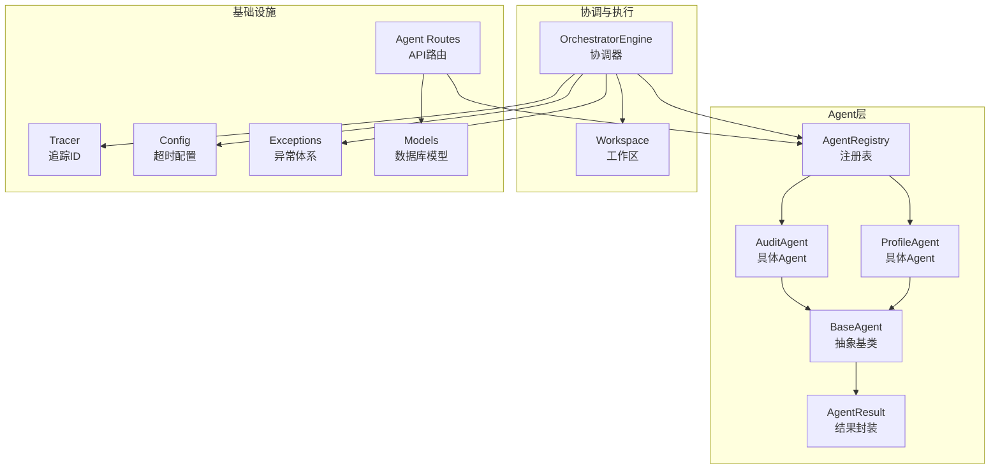
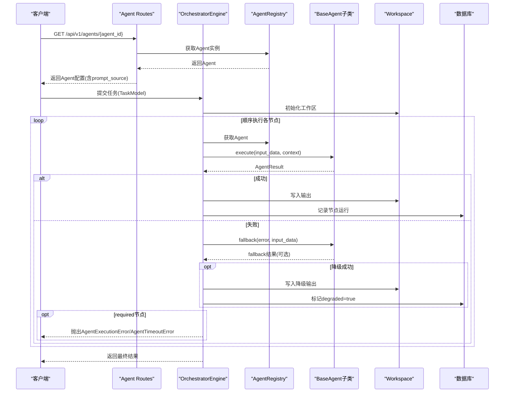
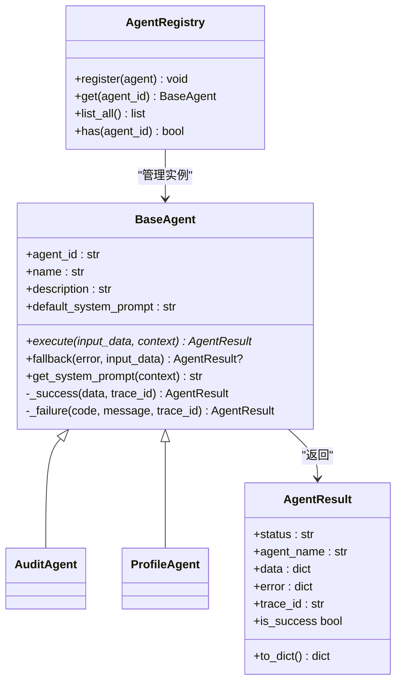
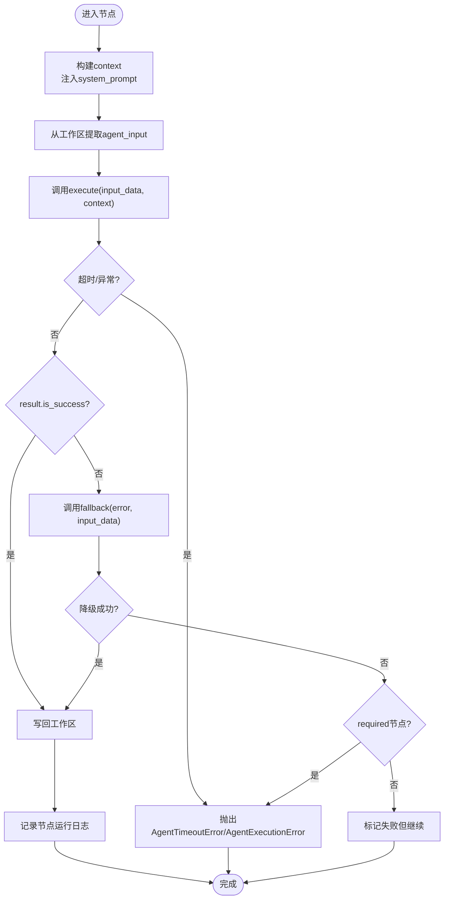
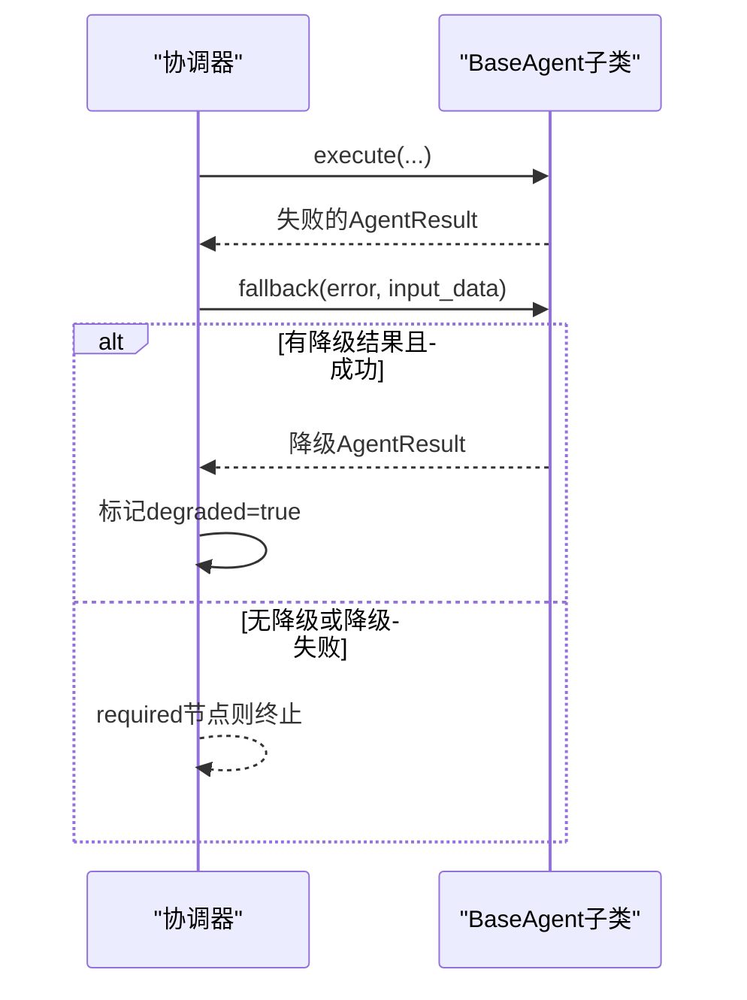
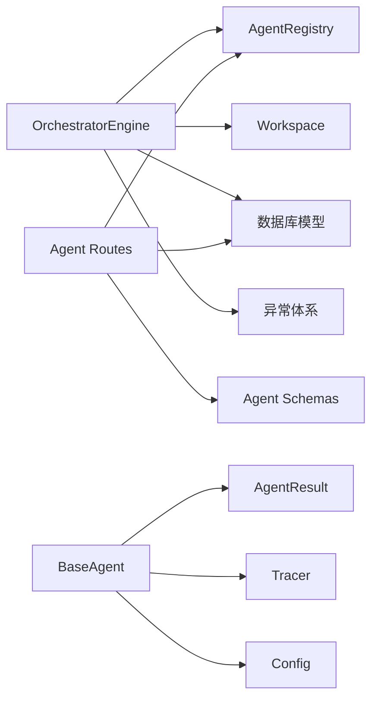

# Agent基类设计

<cite>
**本文引用的文件**
- [backend/app/agents/base.py](file://backend/app/agents/base.py)
- [backend/app/agents/audit_agent.py](file://backend/app/agents/audit_agent.py)
- [backend/app/agents/profile_agent.py](file://backend/app/agents/profile_agent.py)
- [backend/app/agents/registry.py](file://backend/app/agents/registry.py)
- [backend/app/orchestrator/engine.py](file://backend/app/orchestrator/engine.py)
- [backend/app/orchestrator/workspace.py](file://backend/app/orchestrator/workspace.py)
- [backend/app/api/agent_routes.py](file://backend/app/api/agent_routes.py)
- [backend/app/core/tracer.py](file://backend/app/core/tracer.py)
- [backend/app/core/config.py](file://backend/app/core/config.py)
- [backend/app/core/exceptions.py](file://backend/app/core/exceptions.py)
- [backend/app/schemas/agent.py](file://backend/app/schemas/agent.py)
- [backend/app/models/tables.py](file://backend/app/models/tables.py)
</cite>

## 目录
1. [简介](#简介)
2. [项目结构](#项目结构)
3. [核心组件](#核心组件)
4. [架构总览](#架构总览)
5. [详细组件分析](#详细组件分析)
6. [依赖分析](#依赖分析)
7. [性能考虑](#性能考虑)
8. [故障排查指南](#故障排查指南)
9. [结论](#结论)
10. [附录](#附录)

## 简介
本文件面向“Agent基类设计”的技术文档，围绕抽象基类BaseAgent及其结果类AgentResult展开，系统阐述：
- 抽象接口定义与标准执行流程模板
- 统一的结果格式化机制与状态管理
- execute方法的输入输出约定、上下文传递与异步执行模式
- fallback降级策略的设计原理与实现方式
- 如何正确继承与实现自定义Agent的最佳实践
- 常见陷阱与规避方法

## 项目结构
Agent体系位于后端子系统，采用“抽象基类 + 具体实现 + 注册表 + 协调器”的分层设计：
- 抽象基类与结果类：定义统一契约与输出格式
- 具体Agent实现：按业务职责实现execute与可选fallback
- 注册表：集中管理Agent实例，供协调器调度
- 协调器：编排工作流、传递上下文、记录节点运行日志
- 工作区：任务级上下文容器，支持字段映射提取
- API路由：对外暴露Agent配置查询与更新能力
- 追踪与配置：全局trace_id生成与超时配置
- 异常与模型：统一异常体系与数据库模型支撑

图表来源
- [backend/app/agents/base.py:49-99](file://backend/app/agents/base.py#L49-L99)
- [backend/app/agents/audit_agent.py:7-66](file://backend/app/agents/audit_agent.py#L7-L66)
- [backend/app/agents/profile_agent.py:10-73](file://backend/app/agents/profile_agent.py#L10-L73)
- [backend/app/agents/registry.py:10-40](file://backend/app/agents/registry.py#L10-L40)
- [backend/app/orchestrator/engine.py:89-285](file://backend/app/orchestrator/engine.py#L89-L285)
- [backend/app/orchestrator/workspace.py:12-53](file://backend/app/orchestrator/workspace.py#L12-L53)
- [backend/app/api/agent_routes.py:14-115](file://backend/app/api/agent_routes.py#L14-L115)
- [backend/app/core/tracer.py:1-34](file://backend/app/core/tracer.py#L1-L34)
- [backend/app/core/config.py:42-46](file://backend/app/core/config.py#L42-L46)
- [backend/app/core/exceptions.py:79-91](file://backend/app/core/exceptions.py#L79-L91)
- [backend/app/models/tables.py:160-181](file://backend/app/models/tables.py#L160-L181)

章节来源
- [backend/app/agents/base.py:1-99](file://backend/app/agents/base.py#L1-L99)
- [backend/app/orchestrator/engine.py:1-285](file://backend/app/orchestrator/engine.py#L1-L285)

## 核心组件
本节聚焦于抽象基类BaseAgent与结果类AgentResult的设计要点与使用方式。

- 抽象基类BaseAgent
  - 角色定位：工作流节点角色，负责单一业务任务；具备清晰的输入/输出；返回结构化JSON；可调用Skills；不应承担多重职责
  - 关键属性：agent_id、name、description、default_system_prompt
  - 关键方法：
    - execute：抽象方法，定义异步执行规范，接收input_data与context，返回AgentResult
    - fallback：可选降级策略，默认返回None
    - 辅助方法：_success、_failure用于快速构造成功/失败结果
    - get_system_prompt：从context或默认值中解析有效系统提示

- 结果类AgentResult
  - 设计目标：遵循项目规范，统一Agent输出结构
  - 字段：status、agent_name、data、error、trace_id
  - 方法：to_dict序列化、is_success便捷判断

- 上下文与追踪
  - 上下文context：包含只读的前序Agent输出快照，并注入system_prompt
  - 追踪ID：通过ContextVar在任务生命周期内传播，便于日志与审计

章节来源
- [backend/app/agents/base.py:1-99](file://backend/app/agents/base.py#L1-L99)
- [backend/app/core/tracer.py:1-34](file://backend/app/core/tracer.py#L1-L34)

## 架构总览
Agent基类设计贯穿“声明式契约 + 统一结果 + 协调执行”的架构路径。下图展示了从API到执行再到落库的关键交互。

图表来源
- [backend/app/api/agent_routes.py:46-71](file://backend/app/api/agent_routes.py#L46-L71)
- [backend/app/orchestrator/engine.py:92-234](file://backend/app/orchestrator/engine.py#L92-L234)
- [backend/app/agents/registry.py:23-28](file://backend/app/agents/registry.py#L23-L28)
- [backend/app/orchestrator/workspace.py:36-52](file://backend/app/orchestrator/workspace.py#L36-L52)
- [backend/app/models/tables.py:48-74](file://backend/app/models/tables.py#L48-L74)

## 详细组件分析

### BaseAgent抽象基类与AgentResult结果类
- 设计理念
  - 以抽象基类约束所有Agent的执行契约，确保统一的输入输出与错误处理
  - 通过AgentResult标准化输出结构，便于上层编排与前端展示
  - 支持fallback降级策略，增强系统韧性

- 执行流程模板
  - 协调器在每个节点开始时：
    - 从注册表获取Agent实例
    - 从数据库解析有效系统提示，注入context
    - 从工作区提取agent_input
    - 调用execute并带超时控制
    - 根据结果选择写回工作区或触发fallback
    - 记录节点运行日志与统计指标

- 统一结果格式化机制
  - AgentResult提供to_dict序列化，便于持久化与传输
  - is_success属性简化状态判断
  - _success/_failure辅助方法减少样板代码

图表来源
- [backend/app/agents/base.py:49-99](file://backend/app/agents/base.py#L49-L99)
- [backend/app/agents/audit_agent.py:7-66](file://backend/app/agents/audit_agent.py#L7-L66)
- [backend/app/agents/profile_agent.py:10-73](file://backend/app/agents/profile_agent.py#L10-L73)
- [backend/app/agents/registry.py:10-40](file://backend/app/agents/registry.py#L10-L40)

章节来源
- [backend/app/agents/base.py:49-99](file://backend/app/agents/base.py#L49-L99)
- [backend/app/agents/audit_agent.py:48-66](file://backend/app/agents/audit_agent.py#L48-L66)
- [backend/app/agents/profile_agent.py:42-73](file://backend/app/agents/profile_agent.py#L42-L73)

### execute方法的抽象规范
- 输入输出约定
  - 输入：input_data为结构化数据；context为只读快照，包含前序Agent输出与system_prompt
  - 输出：AgentResult，包含status、agent_name、data、error、trace_id
- 上下文传递机制
  - 协调器在每个节点开始时，从工作区快照构建context，并注入effective system prompt
  - Agent可通过get_system_prompt从context覆盖默认提示
- 异步执行模式
  - execute声明为async，协调器通过wait_for在settings.agent_timeout内强制超时
  - 超时或异常均被转换为AgentExecutionError/AgentTimeoutError抛出

图表来源
- [backend/app/orchestrator/engine.py:137-196](file://backend/app/orchestrator/engine.py#L137-L196)
- [backend/app/core/config.py:42-46](file://backend/app/core/config.py#L42-L46)

章节来源
- [backend/app/orchestrator/engine.py:236-243](file://backend/app/orchestrator/engine.py#L236-L243)
- [backend/app/core/config.py:42-46](file://backend/app/core/config.py#L42-L46)

### fallback降级策略
- 设计原理
  - 当Agent执行失败时，若提供fallback，协调器会尝试降级输出，降低required节点失败对整体流程的影响
  - 降级成功时，节点标记degraded=true，继续后续流程
- 实现方式
  - BaseAgent.fallback默认返回None，具体Agent可重写以返回一个“安全/保守”的AgentResult
  - 协调器在节点失败时调用agent.fallback并将错误信息包装为AgentExecutionError传入

图表来源
- [backend/app/orchestrator/engine.py:154-171](file://backend/app/orchestrator/engine.py#L154-L171)
- [backend/app/agents/base.py:77-82](file://backend/app/agents/base.py#L77-L82)

章节来源
- [backend/app/orchestrator/engine.py:154-171](file://backend/app/orchestrator/engine.py#L154-L171)
- [backend/app/agents/base.py:77-82](file://backend/app/agents/base.py#L77-L82)

### 具体Agent实现示例
- AuditAgent
  - 职责：内容合规审核与风险评估
  - execute：模拟延迟后返回固定结构的成功结果
  - fallback：返回“降级”结果，建议人工复核
- ProfileAgent
  - 职责：将用户定位描述解析为结构化画像
  - execute：模拟LLM处理延迟后返回固定结构的成功结果
  - fallback：返回“通用”画像，保证流程继续

章节来源
- [backend/app/agents/audit_agent.py:48-66](file://backend/app/agents/audit_agent.py#L48-L66)
- [backend/app/agents/profile_agent.py:42-73](file://backend/app/agents/profile_agent.py#L42-L73)

### API与配置集成
- Agent配置API
  - 列表与详情：返回Agent元信息、prompt_source、default_system_prompt等
  - 更新：支持更新model_config_data、prompt_template、retry_config
- 追踪ID与超时
  - 追踪ID通过ContextVar传播，便于跨模块日志关联
  - 超时配置来自settings.agent_timeout，协调器在执行时强制超时

章节来源
- [backend/app/api/agent_routes.py:17-115](file://backend/app/api/agent_routes.py#L17-L115)
- [backend/app/core/tracer.py:10-33](file://backend/app/core/tracer.py#L10-L33)
- [backend/app/core/config.py:42-46](file://backend/app/core/config.py#L42-L46)

## 依赖分析
- 组件耦合与内聚
  - BaseAgent与AgentResult高内聚，形成稳定的契约边界
  - OrchestratorEngine通过注册表解耦Agent实例管理，降低耦合度
  - Workspace作为轻量上下文容器，仅依赖日志工具
- 外部依赖与集成点
  - 数据库：TaskModel、TaskNodeRunModel、AgentModel等支撑任务与节点运行记录
  - 异常体系：统一的错误码与消息，便于前端与监控系统消费
  - API路由：与注册表、数据库模型协作，提供Agent配置查询与更新

图表来源
- [backend/app/orchestrator/engine.py:18-26](file://backend/app/orchestrator/engine.py#L18-L26)
- [backend/app/agents/registry.py:3-7](file://backend/app/agents/registry.py#L3-L7)
- [backend/app/api/agent_routes.py:10-12](file://backend/app/api/agent_routes.py#L10-L12)
- [backend/app/schemas/agent.py:6-29](file://backend/app/schemas/agent.py#L6-L29)
- [backend/app/models/tables.py:23-74](file://backend/app/models/tables.py#L23-L74)
- [backend/app/core/exceptions.py:79-91](file://backend/app/core/exceptions.py#L79-L91)

章节来源
- [backend/app/orchestrator/engine.py:18-26](file://backend/app/orchestrator/engine.py#L18-L26)
- [backend/app/agents/registry.py:3-7](file://backend/app/agents/registry.py#L3-L7)
- [backend/app/api/agent_routes.py:10-12](file://backend/app/api/agent_routes.py#L10-L12)
- [backend/app/schemas/agent.py:6-29](file://backend/app/schemas/agent.py#L6-L29)
- [backend/app/models/tables.py:23-74](file://backend/app/models/tables.py#L23-L74)
- [backend/app/core/exceptions.py:79-91](file://backend/app/core/exceptions.py#L79-L91)

## 性能考虑
- 超时控制
  - 使用settings.agent_timeout限制单节点执行时间，避免阻塞整个工作流
- 日志与追踪
  - 通过trace_id与task_id在日志中建立关联，便于定位慢节点与异常
- 节点统计
  - 统计prompt_tokens与completion_tokens，结合总耗时评估成本与性能
- 降级策略
  - fallback可显著降低required节点失败对整体吞吐的影响，建议为关键Agent提供稳健的降级路径

章节来源
- [backend/app/core/config.py:42-46](file://backend/app/core/config.py#L42-L46)
- [backend/app/core/tracer.py:10-33](file://backend/app/core/tracer.py#L10-L33)
- [backend/app/orchestrator/engine.py:211-216](file://backend/app/orchestrator/engine.py#L211-L216)

## 故障排查指南
- 常见错误类型
  - AgentTimeoutError：节点执行超时，检查LLM调用、网络与模型响应
  - AgentExecutionError：节点执行失败，查看error字段与fallback行为
  - AgentNotFoundError：注册表未找到Agent，确认agent_id与注册逻辑
- 排查步骤
  - 检查节点运行记录：确认status、error_message、degraded标志
  - 核对system_prompt来源：custom vs default
  - 查看工作区快照：确认input_mapping是否正确
  - 启用更详细的日志级别，结合trace_id定位问题

章节来源
- [backend/app/core/exceptions.py:79-91](file://backend/app/core/exceptions.py#L79-L91)
- [backend/app/orchestrator/engine.py:164-196](file://backend/app/orchestrator/engine.py#L164-L196)
- [backend/app/models/tables.py:48-74](file://backend/app/models/tables.py#L48-L74)

## 结论
BaseAgent与AgentResult构成了Agent体系的“契约与结果”，通过统一的执行模板、上下文传递与降级策略，实现了可编排、可观测、可恢复的智能体执行框架。配合注册表、协调器与工作区，系统在保持高内聚的同时实现了良好的扩展性与鲁棒性。建议在新增Agent时严格遵循execute/fallback契约，并为关键节点提供稳健的降级路径。

## 附录

### 最佳实践
- 明确职责：每个Agent只做一件事，避免“大杂烩”
- 严格输入输出：输入使用结构化数据，输出使用AgentResult
- 优雅降级：为required节点提供fallback，保障流程连续性
- 上下文最小化：仅注入必要的context字段，避免污染
- 错误归因：在fallback中给出可操作的建议或兜底数据
- 超时与重试：合理设置agent_timeout，必要时在上层增加重试策略

### 常见陷阱
- 忽视fallback：导致required节点失败直接中断工作流
- 滥用全局状态：依赖共享变量而非通过context传递
- 忽略trace_id：无法串联日志与问题定位
- 不一致的错误格式：未使用AgentResult.error导致上层处理困难
- 过度复杂：将多个职责合并到一个Agent中