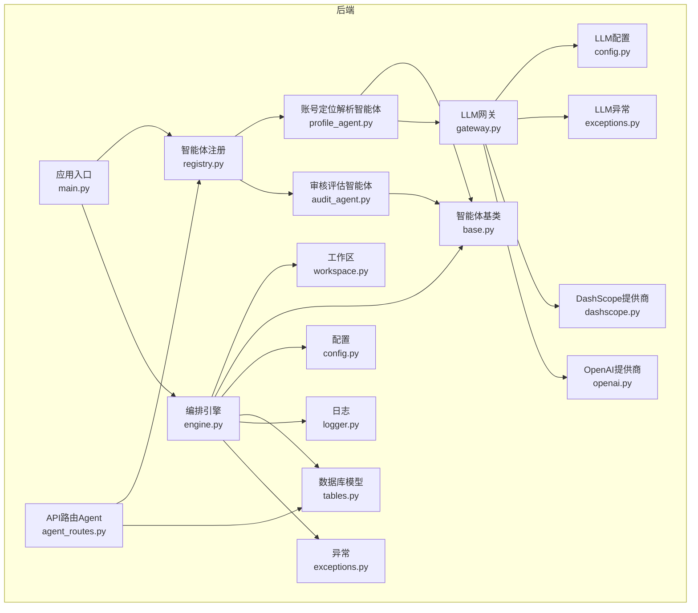
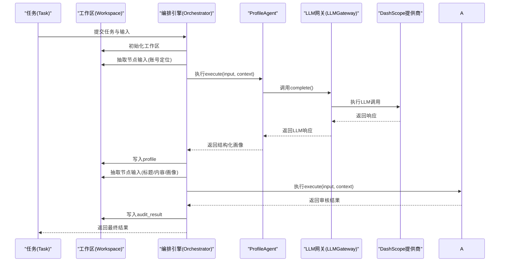
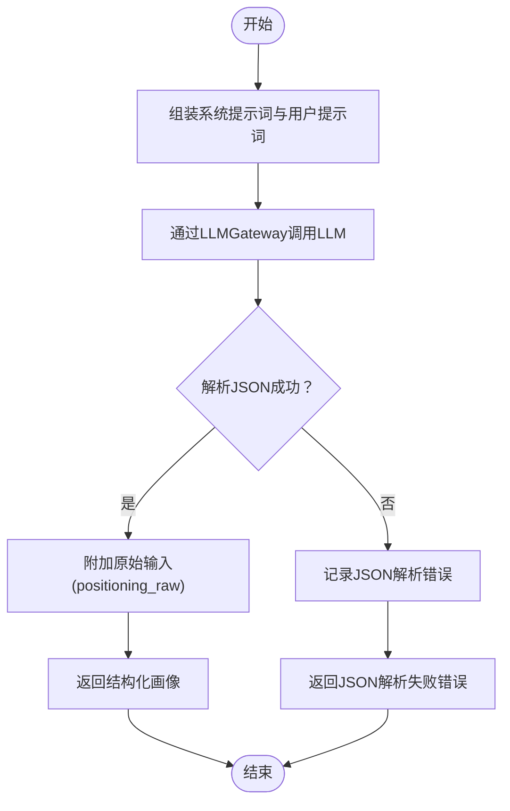
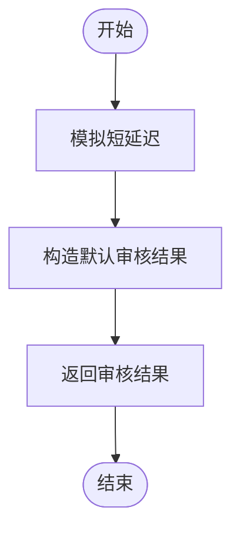
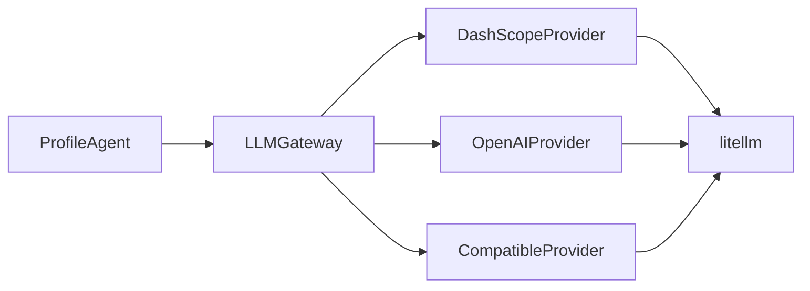
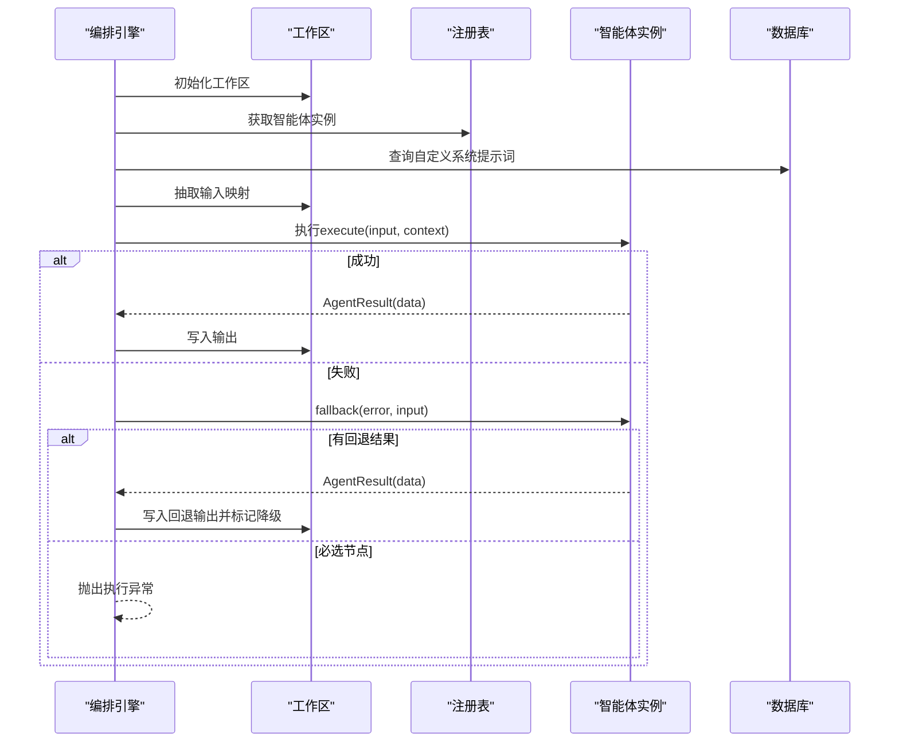
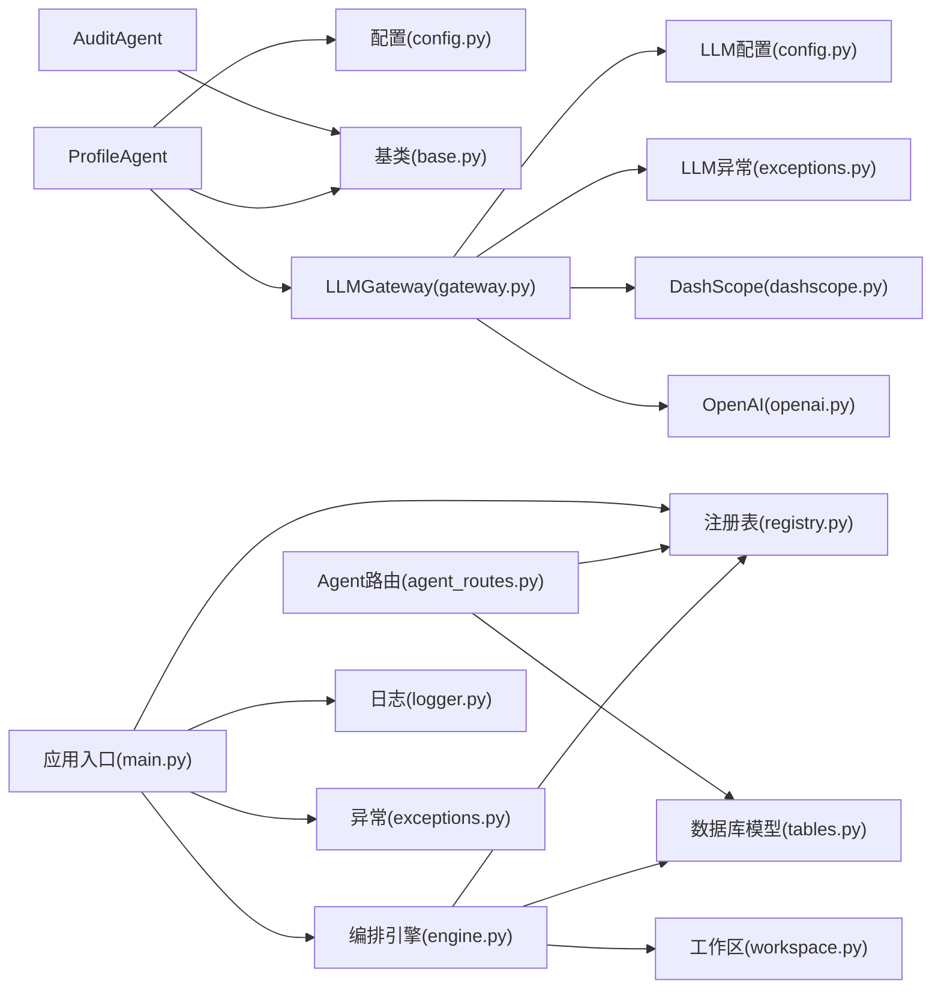

# 内置智能体实现

<cite>
**本文引用的文件**
- [profile_agent.py](file://backend/app/agents/profile_agent.py)
- [audit_agent.py](file://backend/app/agents/audit_agent.py)
- [base.py](file://backend/app/agents/base.py)
- [engine.py](file://backend/app/orchestrator/engine.py)
- [workspace.py](file://backend/app/orchestrator/workspace.py)
- [agent_routes.py](file://backend/app/api/agent_routes.py)
- [config.py](file://backend/app/core/config.py)
- [registry.py](file://backend/app/agents/registry.py)
- [tables.py](file://backend/app/models/tables.py)
- [logger.py](file://backend/app/core/logger.py)
- [exceptions.py](file://backend/app/core/exceptions.py)
- [main.py](file://backend/app/main.py)
- [gateway.py](file://backend/app/llm/gateway.py)
- [base.py](file://backend/app/llm/base.py)
- [config.py](file://backend/app/llm/config.py)
- [exceptions.py](file://backend/app/llm/exceptions.py)
- [dashscope.py](file://backend/app/llm/providers/dashscope.py)
- [openai.py](file://backend/app/llm/providers/openai.py)
- [test_profile_agent.py](file://backend/tests/test_profile_agent.py)
</cite>

## 更新摘要
**变更内容**
- ProfileAgent从mock实现完全重构为基于统一LLM网关的真实实现
- 新增完整的LLM Provider架构，支持DashScope、OpenAI等多种提供商
- 增强了系统提示词设计、JSON解析机制、错误处理和降级策略
- 引入统一的LLM调用接口和配置管理
- 完善了日志记录和监控指标

## 目录
1. [简介](#简介)
2. [项目结构](#项目结构)
3. [核心组件](#核心组件)
4. [架构总览](#架构总览)
5. [详细组件分析](#详细组件分析)
6. [依赖分析](#依赖分析)
7. [性能考虑](#性能考虑)
8. [故障排查指南](#故障排查指南)
9. [结论](#结论)
10. [附录](#附录)

## 简介
本文件面向"内置智能体"的实现与使用，重点覆盖两类智能体：
- ProfileAgent：账号定位解析智能体，负责将用户提供的"账号定位描述"解析为结构化画像，现已完全重构为基于统一LLM网关的真实实现。
- AuditAgent：审核评估智能体，负责对生成的文章标题与正文进行合规性与质量评估，并输出风险等级与问题清单。

文档从系统架构、组件职责、数据流、错误处理、性能优化与监控等方面进行深入剖析，并提供使用示例、配置参数与调用方式，帮助开发者快速集成与扩展。

## 项目结构
后端采用模块化组织，围绕"智能体（Agent）—技能（Skill）—编排器（Orchestrator）—工作区（Workspace）—数据库模型（Models）—API路由（API）—配置（Config）—日志与异常（Core）—LLM网关（LLM）"构建。



**图表来源**
- [main.py:32-40](file://backend/app/main.py#L32-L40)
- [registry.py:10-36](file://backend/app/agents/registry.py#L10-L36)
- [base.py:49-99](file://backend/app/agents/base.py#L49-L99)
- [profile_agent.py:13-97](file://backend/app/agents/profile_agent.py#L13-L97)
- [audit_agent.py:7-66](file://backend/app/agents/audit_agent.py#L7-L66)
- [engine.py:89-285](file://backend/app/orchestrator/engine.py#L89-L285)
- [workspace.py:12-53](file://backend/app/orchestrator/workspace.py#L12-L53)
- [agent_routes.py:17-115](file://backend/app/api/agent_routes.py#L17-L115)
- [config.py:7-51](file://backend/app/core/config.py#L7-L51)
- [tables.py:23-233](file://backend/app/models/tables.py#L23-L233)
- [logger.py:8-36](file://backend/app/core/logger.py#L8-L36)
- [exceptions.py:4-125](file://backend/app/core/exceptions.py#L4-L125)
- [gateway.py:23-303](file://backend/app/llm/gateway.py#L23-L303)
- [config.py:11-165](file://backend/app/llm/config.py#L11-L165)
- [exceptions.py:9-153](file://backend/app/llm/exceptions.py#L9-L153)
- [dashscope.py:12-194](file://backend/app/llm/providers/dashscope.py#L12-L194)
- [openai.py:12-185](file://backend/app/llm/providers/openai.py#L12-L185)

**章节来源**
- [main.py:32-40](file://backend/app/main.py#L32-L40)
- [registry.py:10-36](file://backend/app/agents/registry.py#L10-L36)
- [engine.py:31-86](file://backend/app/orchestrator/engine.py#L31-L86)

## 核心组件
- **智能体基类与结果封装**：统一的执行接口、成功/失败结果封装、系统提示词解析策略。
- **ProfileAgent**：将"账号定位描述"解析为结构化画像，现已完全重构为基于统一LLM网关的真实实现，支持回退策略。
- **AuditAgent**：对标题与正文进行合规性与质量评估，输出风险等级与问题清单。
- **编排引擎**：线性顺序执行默认工作流节点，管理任务生命周期、节点运行记录与广播事件。
- **工作区**：任务级上下文容器，负责数据映射与共享。
- **API路由**：提供智能体查询与配置更新能力。
- **配置**：统一加载环境变量，控制超时、模型与日志级别。
- **数据模型**：持久化任务、节点运行、账号画像、文章草稿与审核结果。
- **日志与异常**：结构化日志与统一异常体系。
- **LLM网关**：统一的LLM调用入口，支持多种Provider和错误处理。
- **LLM Provider**：抽象基类及具体实现（DashScope、OpenAI等）。

**章节来源**
- [base.py:18-99](file://backend/app/agents/base.py#L18-L99)
- [profile_agent.py:13-187](file://backend/app/agents/profile_agent.py#L13-L187)
- [audit_agent.py:7-66](file://backend/app/agents/audit_agent.py#L7-L66)
- [engine.py:89-285](file://backend/app/orchestrator/engine.py#L89-L285)
- [workspace.py:12-53](file://backend/app/orchestrator/workspace.py#L12-L53)
- [agent_routes.py:17-115](file://backend/app/api/agent_routes.py#L17-L115)
- [config.py:7-51](file://backend/app/core/config.py#L7-L51)
- [tables.py:23-233](file://backend/app/models/tables.py#L23-L233)
- [logger.py:8-36](file://backend/app/core/logger.py#L8-L36)
- [exceptions.py:4-125](file://backend/app/core/exceptions.py#L4-L125)
- [gateway.py:23-303](file://backend/app/llm/gateway.py#L23-L303)
- [base.py:74-160](file://backend/app/llm/base.py#L74-L160)
- [config.py:11-165](file://backend/app/llm/config.py#L11-L165)
- [exceptions.py:9-153](file://backend/app/llm/exceptions.py#L9-L153)

## 架构总览
默认工作流为线性链式节点，依次执行：账号定位解析 → 热点分析 → 选题策划 → 标题生成 → 正文生成 → 审核评估。编排器按节点定义从工作区抽取输入，注入系统提示词，执行智能体并写回输出；若节点失败且为必选，则终止任务；若可选则尝试回退策略。



**图表来源**
- [engine.py:92-234](file://backend/app/orchestrator/engine.py#L92-L234)
- [workspace.py:36-52](file://backend/app/orchestrator/workspace.py#L36-L52)
- [profile_agent.py:59-90](file://backend/app/agents/profile_agent.py#L59-L90)
- [audit_agent.py:48-57](file://backend/app/agents/audit_agent.py#L48-L57)
- [gateway.py:117-206](file://backend/app/llm/gateway.py#L117-L206)
- [dashscope.py:70-96](file://backend/app/llm/providers/dashscope.py#L70-L96)

**章节来源**
- [engine.py:31-86](file://backend/app/orchestrator/engine.py#L31-L86)
- [engine.py:92-234](file://backend/app/orchestrator/engine.py#L92-L234)

## 详细组件分析

### ProfileAgent：账号定位解析智能体（重大架构升级）
**更新** ProfileAgent已从mock实现完全重构为基于统一LLM网关的真实实现，增强了系统提示词设计、JSON解析机制、错误处理和降级策略。

- **角色与职责**
  - 将用户输入的"账号定位描述"解析为结构化画像，供后续智能体使用。
  - 使用统一的LLM网关完成推理与JSON输出解析。
  - 提供完整的错误处理和降级策略。
- **输入/输出**
  - 输入：positioning（字符串）
  - 输出：结构化画像对象（包含领域、子域、受众、调性、风格、关键词等字段）
  - 失败时返回标准化错误结果
- **执行流程**
  - 组装系统提示词与用户提示词
  - 通过LLMGateway调用LLM完成解析
  - 解析返回的JSON（兼容Markdown代码块）
  - 保留原始输入到输出
  - 详细的异常捕获并返回标准化错误
- **回退策略**
  - 当LLM异常或JSON解析失败时，返回一个安全的默认画像，确保流程不中断
- **关键实现要点**
  - 使用统一的AgentResult封装成功/失败
  - 支持自定义系统提示词（优先DB自定义，否则使用默认）
  - 严格遵循输出Schema，便于下游消费
  - 完整的日志记录和监控指标
  - 增强的JSON解析机制，支持Markdown代码块



**图表来源**
- [profile_agent.py:59-151](file://backend/app/agents/profile_agent.py#L59-L151)

**章节来源**
- [profile_agent.py:13-187](file://backend/app/agents/profile_agent.py#L13-L187)
- [base.py:18-99](file://backend/app/agents/base.py#L18-L99)
- [engine.py:140-146](file://backend/app/orchestrator/engine.py#L140-L146)
- [gateway.py:117-206](file://backend/app/llm/gateway.py#L117-L206)

### AuditAgent：审核评估智能体
- **角色与职责**
  - 对生成的文章标题与正文进行合规性与质量评估
  - 输出是否通过、风险等级、问题清单与综合评价
- **输入/输出**
  - 输入：titles（候选标题列表）、content（正文数据）、profile（账号画像）
  - 输出：passed、risk_level、issues、overall_comment
- **执行流程**
  - 模拟短延迟后返回固定审核结果（演示用途）
  - 若执行失败，触发回退策略，返回降级结果
- **回退策略**
  - 返回"需要人工复核"的降级结果，避免阻塞流程



**图表来源**
- [audit_agent.py:48-66](file://backend/app/agents/audit_agent.py#L48-L66)

**章节来源**
- [audit_agent.py:7-66](file://backend/app/agents/audit_agent.py#L7-L66)
- [base.py:77-82](file://backend/app/agents/base.py#L77-L82)

### LLM网关与Provider架构
**新增** 完整的LLM网关和Provider架构，提供统一的LLM调用接口和错误处理。

- **LLMGateway**
  - 统一的LLM调用入口，自动处理Provider路由和选择
  - 请求日志和追踪，错误处理和异常转换
  - Provider初始化和生命周期管理
  - 支持多种Provider（DashScope、OpenAI、兼容模式）
- **LLM Provider**
  - 抽象基类定义标准接口
  - 具体实现支持不同的LLM提供商
  - 统一的消息构建和响应解析
  - 细粒度的异常处理
- **配置管理**
  - 统一管理所有LLM Provider的配置
  - 支持从环境变量加载
  - 提供默认Provider和模型配置



**图表来源**
- [gateway.py:23-303](file://backend/app/llm/gateway.py#L23-L303)
- [base.py:74-160](file://backend/app/llm/base.py#L74-L160)
- [config.py:11-165](file://backend/app/llm/config.py#L11-L165)
- [dashscope.py:12-194](file://backend/app/llm/providers/dashscope.py#L12-L194)
- [openai.py:12-185](file://backend/app/llm/providers/openai.py#L12-L185)

**章节来源**
- [gateway.py:23-303](file://backend/app/llm/gateway.py#L23-L303)
- [base.py:74-160](file://backend/app/llm/base.py#L74-L160)
- [config.py:11-165](file://backend/app/llm/config.py#L11-L165)
- [exceptions.py:9-153](file://backend/app/llm/exceptions.py#L9-L153)
- [dashscope.py:12-194](file://backend/app/llm/providers/dashscope.py#L12-L194)
- [openai.py:12-185](file://backend/app/llm/providers/openai.py#L12-L185)

### 编排引擎与工作区
- **编排引擎**
  - 默认线性工作流节点定义（Profile → Hot Topic → Topic Planning → Title → Content → Audit）
  - 从工作区抽取输入，注入系统提示词，执行智能体并写回输出
  - 节点失败处理：必选节点直接终止并抛出异常；可选节点尝试回退并标记降级
  - 记录节点运行日志、耗时、Token用量，并通过广播通知前端
- **工作区**
  - 以任务为单位隔离上下文
  - 支持输入映射（flat key mapping），将上游输出映射到当前智能体输入
  - 提供快照能力，便于持久化与调试



**图表来源**
- [engine.py:137-197](file://backend/app/orchestrator/engine.py#L137-L197)
- [workspace.py:36-52](file://backend/app/orchestrator/workspace.py#L36-L52)
- [registry.py:23-28](file://backend/app/agents/registry.py#L23-L28)

**章节来源**
- [engine.py:89-285](file://backend/app/orchestrator/engine.py#L89-L285)
- [workspace.py:12-53](file://backend/app/orchestrator/workspace.py#L12-L53)
- [registry.py:10-36](file://backend/app/agents/registry.py#L10-L36)

### API与配置
- **Agent配置API**
  - 列出已注册智能体及其状态
  - 获取单个智能体详情（含有效系统提示词来源）
  - 更新智能体配置（模型参数、提示词模板、重试配置等）
- **配置项**
  - LLM相关：API Key、Base URL、模型名、超时
  - 应用与日志：环境、主机、端口、日志级别
  - 超时：智能体、技能、LLM

**章节来源**
- [agent_routes.py:17-115](file://backend/app/api/agent_routes.py#L17-L115)
- [config.py:7-51](file://backend/app/core/config.py#L7-L51)

### 数据模型与持久化
- **任务与节点运行**
  - 任务表：保存任务生命周期、输入/输出、错误、耗时与Token统计
  - 节点运行表：记录每个节点的输入/输出、错误、耗时、Token、模型与重试次数
- **业务实体**
  - 账号画像：从定位描述解析得到的结构化画像
  - 文章草稿：标题、正文、结构、标签、状态
  - 审核结果：通过与否、风险等级、问题清单、综合评价

**章节来源**
- [tables.py:23-233](file://backend/app/models/tables.py#L23-L233)

## 依赖分析
- **组件耦合**
  - 智能体仅依赖基类与配置，解耦良好
  - 编排引擎依赖注册表、工作区、数据库模型与广播器
  - API层仅依赖注册表与数据库模型
  - ProfileAgent依赖LLM网关而非直接依赖具体Provider
- **外部依赖**
  - LLM调用（litellm）
  - 结构化日志（structlog）
  - SQL异步会话（SQLAlchemy）



**图表来源**
- [profile_agent.py:8-15](file://backend/app/agents/profile_agent.py#L8-L15)
- [base.py:11-15](file://backend/app/agents/base.py#L11-L15)
- [engine.py:18-26](file://backend/app/orchestrator/engine.py#L18-L26)
- [agent_routes.py:3-12](file://backend/app/api/agent_routes.py#L3-L12)
- [main.py:20-27](file://backend/app/main.py#L20-L27)
- [logger.py:3-6](file://backend/app/core/logger.py#L3-L6)
- [exceptions.py:1-2](file://backend/app/core/exceptions.py#L1-L2)
- [gateway.py:13-18](file://backend/app/llm/gateway.py#L13-L18)
- [config.py:14-16](file://backend/app/llm/config.py#L14-L16)
- [exceptions.py:15-16](file://backend/app/llm/exceptions.py#L15-L16)
- [dashscope.py:6-9](file://backend/app/llm/providers/dashscope.py#L6-L9)
- [openai.py:6-9](file://backend/app/llm/providers/openai.py#L6-L9)

**章节来源**
- [engine.py:18-26](file://backend/app/orchestrator/engine.py#L18-L26)
- [agent_routes.py:3-12](file://backend/app/api/agent_routes.py#L3-L12)
- [main.py:20-27](file://backend/app/main.py#L20-L27)

## 性能考虑
- **超时控制**
  - 智能体执行超时、LLM调用超时、技能超时均在配置中集中管理，避免阻塞
- **Token统计**
  - 编排引擎汇总节点Prompt与Completion Token，便于成本与性能分析
  - LLM网关提供详细的Token使用统计
- **广播与SSE**
  - 节点开始/完成事件通过广播器推送，前端可实时展示进度摘要
- **日志结构化**
  - 使用结构化日志，便于检索与聚合分析
  - LLM调用提供详细的日志记录和监控指标
- **Provider优化**
  - 支持多个Provider并行初始化
  - 自动选择可用的Provider
  - 统一的超时和重试机制

**章节来源**
- [config.py:42-46](file://backend/app/core/config.py#L42-L46)
- [engine.py:211-216](file://backend/app/orchestrator/engine.py#L211-L216)
- [engine.py:124-132](file://backend/app/orchestrator/engine.py#L124-L132)
- [engine.py:200-210](file://backend/app/orchestrator/engine.py#L200-L210)
- [logger.py:8-36](file://backend/app/core/logger.py#L8-L36)
- [gateway.py:152-204](file://backend/app/llm/gateway.py#L152-L204)
- [config.py:63-70](file://backend/app/llm/config.py#L63-L70)

## 故障排查指南
- **常见错误类型**
  - Agent执行失败：抛出统一异常，必要时终止任务
  - Agent超时：编排器捕获并标记失败
  - LLM调用失败：ProfileAgent捕获并返回错误
  - JSON解析失败：ProfileAgent捕获并返回错误
  - Provider配置错误：LLMGateway提供详细的错误信息
- **回退策略**
  - ProfileAgent：返回安全默认画像
  - AuditAgent：返回"需要人工复核"的降级结果
- **排查步骤**
  - 查看节点运行记录（错误消息、耗时、Token）
  - 检查系统提示词来源（默认/自定义）
  - 核对输入映射是否正确
  - 检查LLM配置与网络连通性
  - 查看LLM Provider的初始化状态
  - 检查环境变量配置

**章节来源**
- [exceptions.py:65-98](file://backend/app/core/exceptions.py#L65-L98)
- [engine.py:154-175](file://backend/app/orchestrator/engine.py#L154-L175)
- [profile_agent.py:92-150](file://backend/app/agents/profile_agent.py#L92-L150)
- [audit_agent.py:59-66](file://backend/app/agents/audit_agent.py#L59-L66)
- [gateway.py:105-115](file://backend/app/llm/gateway.py#L105-L115)

## 结论
本实现以清晰的职责划分与标准化的数据契约支撑多智能体协作：ProfileAgent负责结构化画像解析，现已完全重构为基于统一LLM网关的真实实现，AuditAgent负责合规与质量评估，编排引擎保障顺序执行与可观测性。通过统一的配置、日志与异常体系，以及完整的LLM Provider架构，系统具备良好的可维护性、扩展性和可靠性。建议在生产环境中结合实际业务完善AuditAgent的规则与阈值，并持续优化提示词与回退策略。

## 附录

### 使用示例与集成方法
- **启动应用**
  - 通过应用入口注册所有智能体并启动服务
- **创建任务**
  - 提交任务时包含输入数据（如positioning）
- **查询智能体**
  - 通过Agent配置API获取智能体列表与详情
- **更新智能体配置**
  - 支持更新模型参数、提示词模板与重试配置
- **LLM配置**
  - 配置LLM Provider的API Key和Base URL
  - 设置默认Provider和模型
  - 配置超时和其他参数
- **审核评估**
  - 在工作流中启用Audit节点，或在业务侧单独调用

**章节来源**
- [main.py:32-40](file://backend/app/main.py#L32-L40)
- [agent_routes.py:17-115](file://backend/app/api/agent_routes.py#L17-L115)
- [config.py:11-165](file://backend/app/llm/config.py#L11-L165)

### 配置参数说明
- **LLM相关**
  - llm_api_key：LLM API密钥
  - llm_api_base_url：LLM API基础URL
  - llm_model_name：默认模型名称
  - llm_timeout：LLM调用超时（秒）
  - default_provider：默认LLM Provider（dashscope/openai/compatible）
- **应用与日志**
  - app_env：应用环境（development/production）
  - app_debug：调试开关
  - app_host/app_port：监听地址与端口
  - log_level：日志级别
- **超时**
  - agent_timeout：智能体执行超时（秒）
  - skill_timeout：技能执行超时（秒）

**章节来源**
- [config.py:22-46](file://backend/app/core/config.py#L22-L46)
- [config.py:11-165](file://backend/app/llm/config.py#L11-L165)

### 输入输出规范（关键字段）
- **ProfileAgent**
  - 输入：positioning（字符串）
  - 输出：domain、subdomain、target_audience（age_range、occupation、interests）、tone、content_style、keywords、positioning_raw
- **AuditAgent**
  - 输入：titles（数组）、content（对象）、profile（对象）
  - 输出：passed（布尔）、risk_level（low/medium/high）、issues（数组，含type、description、severity、location）、overall_comment（字符串）

**章节来源**
- [profile_agent.py:26-52](file://backend/app/agents/profile_agent.py#L26-L52)
- [audit_agent.py:12-46](file://backend/app/agents/audit_agent.py#L12-L46)

### 智能体间协作与数据传递协议
- **协作模式**
  - 线性顺序：Profile → Hot Topic → Topic Planning → Title → Content → Audit
  - 工作区作为共享上下文，节点间通过键映射传递数据
- **数据传递**
  - input_mapping定义字段映射关系
  - 上游节点输出作为下游节点输入
  - 必选节点失败即终止，可选节点尝试回退

**章节来源**
- [engine.py:31-86](file://backend/app/orchestrator/engine.py#L31-L86)
- [workspace.py:36-52](file://backend/app/orchestrator/workspace.py#L36-L52)

### LLM网关使用示例
- **基本使用**
  ```python
  gateway = LLMGateway()
  response = await gateway.complete(
      agent_id="profile_agent",
      prompt="解析以下账号定位：职场成长号",
      options=LLMCallOptions(
          system_prompt="你是一位专业的...",
          temperature=0.7,
      ),
      provider="dashscope",
  )
  ```
- **消息模式**
  ```python
  response = await gateway.complete_with_messages(
      agent_id="profile_agent",
      messages=[
          {"role": "system", "content": "系统提示词"},
          {"role": "user", "content": "用户输入"},
      ],
      options=LLMCallOptions(temperature=0.7),
  )
  ```

**章节来源**
- [gateway.py:117-271](file://backend/app/llm/gateway.py#L117-L271)
- [base.py:40-58](file://backend/app/llm/base.py#L40-L58)