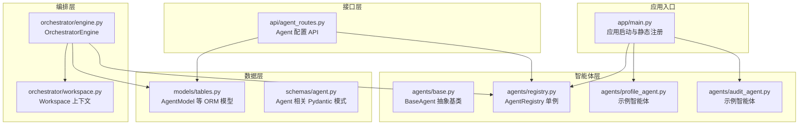
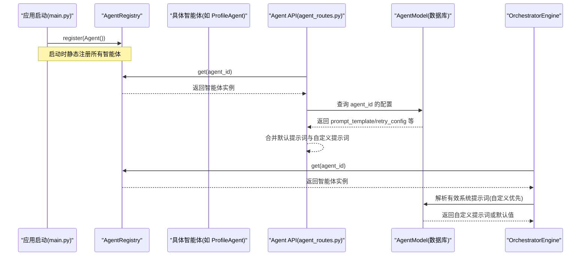
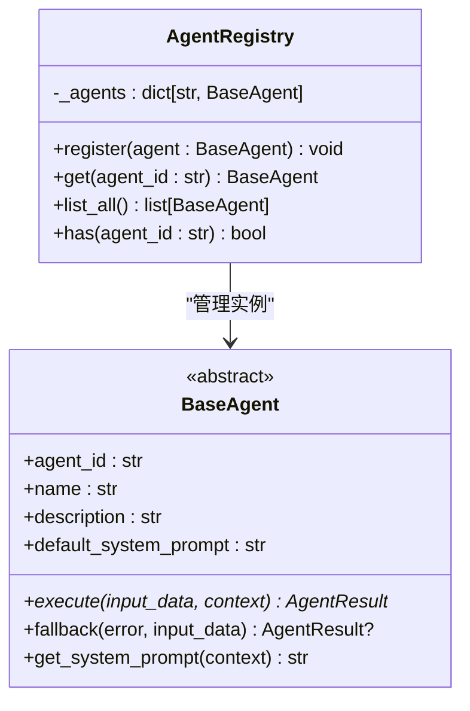
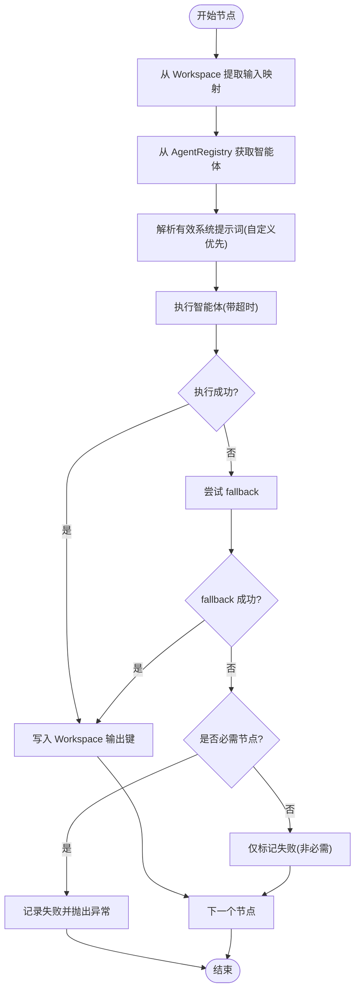
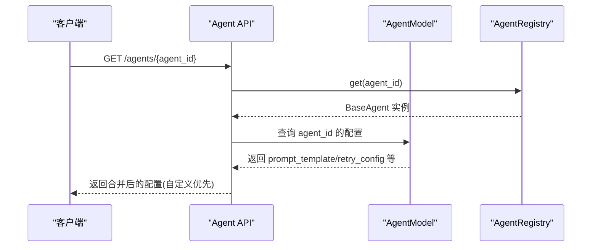
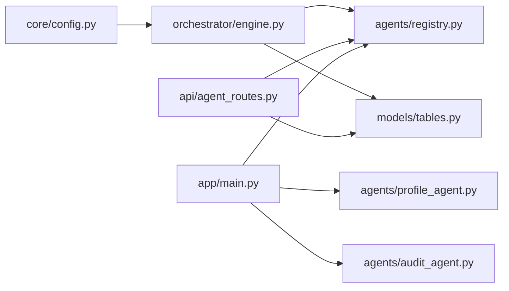

# 智能体注册机制

<cite>
**本文引用的文件**
- [backend/app/agents/registry.py](file://backend/app/agents/registry.py)
- [backend/app/agents/base.py](file://backend/app/agents/base.py)
- [backend/app/skills/registry.py](file://backend/app/skills/registry.py)
- [backend/app/skills/base.py](file://backend/app/skills/base.py)
- [backend/app/api/agent_routes.py](file://backend/app/api/agent_routes.py)
- [backend/app/models/tables.py](file://backend/app/models/tables.py)
- [backend/app/schemas/agent.py](file://backend/app/schemas/agent.py)
- [backend/app/orchestrator/engine.py](file://backend/app/orchestrator/engine.py)
- [backend/app/main.py](file://backend/app/main.py)
- [backend/app/core/exceptions.py](file://backend/app/core/exceptions.py)
- [backend/app/core/config.py](file://backend/app/core/config.py)
- [backend/app/orchestrator/workspace.py](file://backend/app/orchestrator/workspace.py)
- [backend/app/agents/profile_agent.py](file://backend/app/agents/profile_agent.py)
- [backend/app/agents/audit_agent.py](file://backend/app/agents/audit_agent.py)
</cite>

## 目录
1. [引言](#引言)
2. [项目结构](#项目结构)
3. [核心组件](#核心组件)
4. [架构总览](#架构总览)
5. [详细组件分析](#详细组件分析)
6. [依赖关系分析](#依赖关系分析)
7. [性能考虑](#性能考虑)
8. [故障排查指南](#故障排查指南)
9. [结论](#结论)
10. [附录](#附录)

## 引言
本文件系统性阐述智能体注册机制的设计与实现，重点覆盖以下方面：
- AgentRegistry 类的设计架构：动态注册流程、类型验证机制、实例管理策略
- 注册表的数据结构设计：注册表维护、查找算法、生命周期管理
- 智能体配置加载机制：数据库持久化、配置合并与回退策略
- 智能体注册与使用的完整示例：静态注册与动态注册两种方式
- 智能体间依赖关系管理与冲突检测机制
- 扩展新智能体类型的开发指南与注册最佳实践

## 项目结构
后端采用分层架构，智能体注册与调度集中在 agents、orchestrator 与 api 层：
- agents：定义智能体基类与注册表，以及具体智能体实现
- orchestrator：编排引擎按工作流顺序执行智能体，管理上下文与失败降级
- api：对外暴露智能体配置查询与更新接口
- models/schemas：定义数据库模型与请求/响应模式
- core：统一异常体系、配置与日志

图表来源
- [backend/app/main.py:32-40](file://backend/app/main.py#L32-L40)
- [backend/app/agents/registry.py:10-39](file://backend/app/agents/registry.py#L10-L39)
- [backend/app/agents/base.py:49-99](file://backend/app/agents/base.py#L49-L99)
- [backend/app/agents/profile_agent.py:10-73](file://backend/app/agents/profile_agent.py#L10-L73)
- [backend/app/agents/audit_agent.py:7-66](file://backend/app/agents/audit_agent.py#L7-L66)
- [backend/app/orchestrator/engine.py:89-285](file://backend/app/orchestrator/engine.py#L89-L285)
- [backend/app/orchestrator/workspace.py:12-53](file://backend/app/orchestrator/workspace.py#L12-L53)
- [backend/app/api/agent_routes.py:17-115](file://backend/app/api/agent_routes.py#L17-L115)
- [backend/app/models/tables.py:160-181](file://backend/app/models/tables.py#L160-L181)
- [backend/app/schemas/agent.py:6-29](file://backend/app/schemas/agent.py#L6-L29)

章节来源
- [backend/app/main.py:32-40](file://backend/app/main.py#L32-L40)
- [backend/app/agents/registry.py:10-39](file://backend/app/agents/registry.py#L10-L39)
- [backend/app/agents/base.py:49-99](file://backend/app/agents/base.py#L49-L99)
- [backend/app/orchestrator/engine.py:89-285](file://backend/app/orchestrator/engine.py#L89-L285)
- [backend/app/api/agent_routes.py:17-115](file://backend/app/api/agent_routes.py#L17-L115)
- [backend/app/models/tables.py:160-181](file://backend/app/models/tables.py#L160-L181)
- [backend/app/schemas/agent.py:6-29](file://backend/app/schemas/agent.py#L6-L29)

## 核心组件
- AgentRegistry：集中管理所有已注册智能体实例，提供注册、查询、枚举与存在性检查能力
- BaseAgent：定义智能体抽象接口与标准结果封装，支持系统提示词解析、执行与降级策略
- OrchestratorEngine：按固定工作流顺序执行智能体，管理上下文、超时与失败降级
- AgentModel：数据库模型，用于持久化智能体配置（含系统提示词模板、重试配置等）
- Agent API：提供智能体清单查询、详情查询与配置更新接口
- 异常体系：统一错误码分类，便于前端与监控系统识别

章节来源
- [backend/app/agents/registry.py:10-39](file://backend/app/agents/registry.py#L10-L39)
- [backend/app/agents/base.py:49-99](file://backend/app/agents/base.py#L49-L99)
- [backend/app/orchestrator/engine.py:89-285](file://backend/app/orchestrator/engine.py#L89-L285)
- [backend/app/models/tables.py:160-181](file://backend/app/models/tables.py#L160-L181)
- [backend/app/api/agent_routes.py:17-115](file://backend/app/api/agent_routes.py#L17-L115)
- [backend/app/core/exceptions.py:31-43](file://backend/app/core/exceptions.py#L31-L43)

## 架构总览
智能体注册机制贯穿“启动注册—运行时调度—配置持久化—API 查询”的全链路。

图表来源
- [backend/app/main.py:32-40](file://backend/app/main.py#L32-L40)
- [backend/app/agents/registry.py:23-28](file://backend/app/agents/registry.py#L23-L28)
- [backend/app/api/agent_routes.py:46-71](file://backend/app/api/agent_routes.py#L46-L71)
- [backend/app/orchestrator/engine.py:245-263](file://backend/app/orchestrator/engine.py#L245-L263)
- [backend/app/models/tables.py:160-181](file://backend/app/models/tables.py#L160-L181)

## 详细组件分析

### AgentRegistry 设计与实现
- 数据结构：以 agent_id 为键的字典存储智能体实例，支持 O(1) 查找
- 注册流程：重复注册会记录告警日志；注册成功后记录 info 日志
- 查询策略：不存在时抛出统一异常，便于上层处理
- 实例管理：提供 list_all/has 辅助方法，便于 API 列表展示与存在性判断

图表来源
- [backend/app/agents/registry.py:10-39](file://backend/app/agents/registry.py#L10-L39)
- [backend/app/agents/base.py:49-99](file://backend/app/agents/base.py#L49-L99)

章节来源
- [backend/app/agents/registry.py:10-39](file://backend/app/agents/registry.py#L10-L39)
- [backend/app/core/exceptions.py:31-43](file://backend/app/core/exceptions.py#L31-L43)

### BaseAgent 抽象与标准结果
- 接口契约：定义异步 execute 与可选 fallback，确保统一的执行与降级语义
- 结果封装：AgentResult 提供标准化返回结构，包含状态、数据、错误与追踪 ID
- 提示词解析：支持从上下文覆盖默认系统提示词，实现“默认优先、自定义覆盖”

章节来源
- [backend/app/agents/base.py:49-99](file://backend/app/agents/base.py#L49-L99)

### 编排引擎与上下文管理
- 工作流节点：内置线性工作流节点，按顺序执行，严格控制节点顺序
- 上下文提取：通过输入映射从 Workspace 中抽取所需数据
- 失败降级：非必需节点失败时可触发 fallback 并标记降级，必要节点失败则中断并上报
- 超时控制：统一超时阈值，超时即失败并按必需性处理

图表来源
- [backend/app/orchestrator/engine.py:137-196](file://backend/app/orchestrator/engine.py#L137-L196)
- [backend/app/orchestrator/workspace.py:36-53](file://backend/app/orchestrator/workspace.py#L36-L53)

章节来源
- [backend/app/orchestrator/engine.py:89-285](file://backend/app/orchestrator/engine.py#L89-L285)
- [backend/app/orchestrator/workspace.py:12-53](file://backend/app/orchestrator/workspace.py#L12-L53)

### 智能体配置加载与持久化
- 数据模型：AgentModel 支持持久化模块路径、模型配置、提示词模板、输入/输出模式、所需技能、重试与降级配置等
- API 查询：支持列出所有注册智能体，并合并数据库中的自定义提示词与默认提示词
- 配置更新：支持按需更新模型配置、提示词模板与重试配置，空字符串表示“恢复默认”
- 优先级：数据库自定义提示词优先于智能体默认提示词

图表来源
- [backend/app/api/agent_routes.py:46-71](file://backend/app/api/agent_routes.py#L46-L71)
- [backend/app/models/tables.py:160-181](file://backend/app/models/tables.py#L160-L181)
- [backend/app/agents/registry.py:23-28](file://backend/app/agents/registry.py#L23-L28)

章节来源
- [backend/app/api/agent_routes.py:17-115](file://backend/app/api/agent_routes.py#L17-L115)
- [backend/app/models/tables.py:160-181](file://backend/app/models/tables.py#L160-L181)

### 智能体注册与使用示例

#### 静态注册（启动时）
- 在应用生命周期内导入智能体实现并注册到全局注册表
- 典型路径参考：[backend/app/main.py:32-40](file://backend/app/main.py#L32-L40)

章节来源
- [backend/app/main.py:32-40](file://backend/app/main.py#L32-L40)

#### 动态注册（运行时）
- 通过调用注册表的 register 方法注入智能体实例
- 典型路径参考：[backend/app/agents/registry.py:16-21](file://backend/app/agents/registry.py#L16-L21)

章节来源
- [backend/app/agents/registry.py:16-21](file://backend/app/agents/registry.py#L16-L21)

#### 使用示例（编排引擎）
- 通过注册表按 agent_id 获取实例并执行
- 典型路径参考：[backend/app/orchestrator/engine.py:137-147](file://backend/app/orchestrator/engine.py#L137-L147)

章节来源
- [backend/app/orchestrator/engine.py:137-147](file://backend/app/orchestrator/engine.py#L137-L147)

### 智能体间依赖关系管理与冲突检测
- 依赖管理：当前工作流为线性顺序，节点间通过 Workspace 键名建立隐式依赖；输入映射明确声明依赖的上游输出键
- 冲突检测：注册表对重复 agent_id 进行告警；API 查询与更新对缺失 agent_id 抛出统一异常
- 建议：若引入图式工作流，应在编排层增加显式的节点依赖图校验与环路检测

章节来源
- [backend/app/orchestrator/engine.py:32-86](file://backend/app/orchestrator/engine.py#L32-L86)
- [backend/app/agents/registry.py:18-19](file://backend/app/agents/registry.py#L18-L19)
- [backend/app/core/exceptions.py:31-43](file://backend/app/core/exceptions.py#L31-L43)

## 依赖关系分析
- 组件耦合：编排引擎强依赖注册表与数据库模型；API 层依赖注册表与数据库模型；技能注册表与智能体注册表结构相似，职责分离
- 外部依赖：SQLAlchemy ORM、FastAPI、Pydantic、环境变量配置

图表来源
- [backend/app/orchestrator/engine.py:18-26](file://backend/app/orchestrator/engine.py#L18-L26)
- [backend/app/api/agent_routes.py:10-12](file://backend/app/api/agent_routes.py#L10-L12)
- [backend/app/main.py:20-27](file://backend/app/main.py#L20-L27)
- [backend/app/core/config.py:7-51](file://backend/app/core/config.py#L7-L51)

章节来源
- [backend/app/orchestrator/engine.py:18-26](file://backend/app/orchestrator/engine.py#L18-L26)
- [backend/app/api/agent_routes.py:10-12](file://backend/app/api/agent_routes.py#L10-L12)
- [backend/app/main.py:20-27](file://backend/app/main.py#L20-L27)
- [backend/app/core/config.py:7-51](file://backend/app/core/config.py#L7-L51)

## 性能考虑
- 注册表查询：O(1) 字典查找，开销极低
- 编排执行：单任务多节点顺序执行，避免并发锁竞争；超时控制防止阻塞
- 数据库访问：API 列表批量查询减少多次往返；节点运行记录按需持久化
- 建议：对高频查询的提示词与配置启用缓存；对长耗时智能体提供异步回调或队列化

## 故障排查指南
- Agent 未找到：确认智能体是否在启动时完成静态注册，或在运行时正确调用注册表 register
  - 参考：[backend/app/agents/registry.py:23-28](file://backend/app/agents/registry.py#L23-L28)，[backend/app/core/exceptions.py:31-43](file://backend/app/core/exceptions.py#L31-L43)
- 配置更新无效：检查请求体字段与数据库字段映射，空字符串表示“恢复默认”
  - 参考：[backend/app/api/agent_routes.py:74-115](file://backend/app/api/agent_routes.py#L74-L115)
- 超时失败：调整全局超时阈值或优化智能体内部逻辑
  - 参考：[backend/app/core/config.py:42-45](file://backend/app/core/config.py#L42-L45)，[backend/app/orchestrator/engine.py:236-243](file://backend/app/orchestrator/engine.py#L236-L243)
- 提示词未生效：确认数据库中是否存在自定义提示词，否则将回退到默认提示词
  - 参考：[backend/app/orchestrator/engine.py:245-263](file://backend/app/orchestrator/engine.py#L245-L263)

章节来源
- [backend/app/agents/registry.py:23-28](file://backend/app/agents/registry.py#L23-L28)
- [backend/app/core/exceptions.py:31-43](file://backend/app/core/exceptions.py#L31-L43)
- [backend/app/api/agent_routes.py:74-115](file://backend/app/api/agent_routes.py#L74-L115)
- [backend/app/core/config.py:42-45](file://backend/app/core/config.py#L42-L45)
- [backend/app/orchestrator/engine.py:245-263](file://backend/app/orchestrator/engine.py#L245-L263)

## 结论
本注册机制以简洁的注册表为核心，结合统一的智能体抽象与编排引擎，实现了稳定、可扩展的智能体生命周期管理。通过数据库持久化配置与 API 支持，既满足静态部署场景，也具备运行时配置能力。未来可在工作流图化、依赖校验与缓存优化等方面进一步增强。

## 附录

### 开发新智能体类型的步骤
- 定义智能体类：继承 BaseAgent，设置 agent_id/name/description/default_system_prompt，实现 execute 与可选 fallback
  - 参考：[backend/app/agents/base.py:49-99](file://backend/app/agents/base.py#L49-L99)
- 实现智能体逻辑：在 execute 中处理输入与上下文，返回标准化结果
  - 参考：[backend/app/agents/profile_agent.py:42-61](file://backend/app/agents/profile_agent.py#L42-L61)
- 注册智能体：在应用启动时导入并注册，或在运行时动态注册
  - 参考：[backend/app/main.py:32-40](file://backend/app/main.py#L32-L40)，[backend/app/agents/registry.py:16-21](file://backend/app/agents/registry.py#L16-L21)
- 配置持久化：通过 API 更新提示词模板、模型配置与重试策略
  - 参考：[backend/app/api/agent_routes.py:74-115](file://backend/app/api/agent_routes.py#L74-L115)，[backend/app/models/tables.py:160-181](file://backend/app/models/tables.py#L160-L181)

### 注册最佳实践
- 明确 agent_id 唯一性，避免重复注册导致的覆盖与不可预期行为
- 将默认系统提示词与业务规则收敛在智能体类中，通过 API 支持自定义覆盖
- 对可能失败的智能体实现 fallback，降低工作流中断风险
- 使用 Workspace 的输入映射清晰表达节点依赖，便于后续工作流演进