# 智能体系统

<cite>
**本文引用的文件**
- [backend/app/agents/base.py](file://backend/app/agents/base.py)
- [backend/app/agents/registry.py](file://backend/app/agents/registry.py)
- [backend/app/agents/profile_agent.py](file://backend/app/agents/profile_agent.py)
- [backend/app/agents/audit_agent.py](file://backend/app/agents/audit_agent.py)
- [backend/app/orchestrator/engine.py](file://backend/app/orchestrator/engine.py)
- [backend/app/orchestrator/workspace.py](file://backend/app/orchestrator/workspace.py)
- [backend/app/orchestrator/broadcaster.py](file://backend/app/orchestrator/broadcaster.py)
- [backend/app/skills/base.py](file://backend/app/skills/base.py)
- [backend/app/skills/registry.py](file://backend/app/skills/registry.py)
- [backend/app/api/agent_routes.py](file://backend/app/api/agent_routes.py)
- [backend/app/models/tables.py](file://backend/app/models/tables.py)
- [backend/app/core/config.py](file://backend/app/core/config.py)
- [backend/app/main.py](file://backend/app/main.py)
- [frontend/lib/api.ts](file://frontend/lib/api.ts)
</cite>

## 目录
1. [简介](#简介)
2. [项目结构](#项目结构)
3. [核心组件](#核心组件)
4. [架构总览](#架构总览)
5. [详细组件分析](#详细组件分析)
6. [依赖分析](#依赖分析)
7. [性能考虑](#性能考虑)
8. [故障排查指南](#故障排查指南)
9. [结论](#结论)
10. [附录](#附录)

## 简介
本指南面向开发者，提供智能体系统的完整开发框架与扩展指导。内容涵盖：
- Agent基类设计模式：抽象接口、执行流程模板、降级策略
- 智能体注册机制：动态注册、类型检查、实例管理
- 具体智能体实现：ProfileAgent、AuditAgent等内置智能体功能与调用方式
- 自定义智能体开发最佳实践：继承规范、配置管理、错误处理
- 智能体间通信协议、状态传递机制与性能监控
- 基于工作空间与事件广播的端到端执行链路

## 项目结构
后端采用FastAPI + SQLAlchemy + 异步执行的多智能体编排系统，前端通过REST与SSE消费任务执行状态。

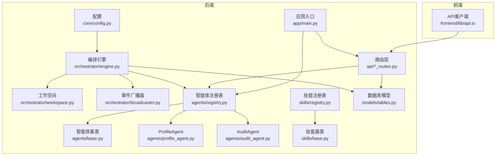

图表来源
- [backend/app/main.py:32-58](file://backend/app/main.py#L32-L58)
- [backend/app/api/agent_routes.py:17-115](file://backend/app/api/agent_routes.py#L17-L115)
- [backend/app/orchestrator/engine.py:89-285](file://backend/app/orchestrator/engine.py#L89-L285)
- [backend/app/orchestrator/workspace.py:12-53](file://backend/app/orchestrator/workspace.py#L12-L53)
- [backend/app/orchestrator/broadcaster.py:11-94](file://backend/app/orchestrator/broadcaster.py#L11-L94)
- [backend/app/agents/registry.py:10-40](file://backend/app/agents/registry.py#L10-L40)
- [backend/app/agents/base.py:49-99](file://backend/app/agents/base.py#L49-L99)
- [backend/app/agents/profile_agent.py:10-73](file://backend/app/agents/profile_agent.py#L10-L73)
- [backend/app/agents/audit_agent.py:7-66](file://backend/app/agents/audit_agent.py#L7-L66)
- [backend/app/skills/registry.py:10-37](file://backend/app/skills/registry.py#L10-L37)
- [backend/app/skills/base.py:16-37](file://backend/app/skills/base.py#L16-L37)
- [backend/app/models/tables.py:23-233](file://backend/app/models/tables.py#L23-L233)
- [backend/app/core/config.py:7-51](file://backend/app/core/config.py#L7-L51)
- [frontend/lib/api.ts:1-110](file://frontend/lib/api.ts#L1-L110)

章节来源
- [backend/app/main.py:32-58](file://backend/app/main.py#L32-L58)
- [backend/app/core/config.py:7-51](file://backend/app/core/config.py#L7-L51)
- [frontend/lib/api.ts:1-110](file://frontend/lib/api.ts#L1-L110)

## 核心组件
- Agent基类与结果封装：统一的异步执行接口、标准化返回结构、成功/失败构造器、默认降级策略钩子
- 注册表：集中管理智能体实例，支持查询、枚举、存在性判断
- 工作空间：任务级上下文容器，提供键值存取、快照、按映射提取输入
- 编排引擎：顺序调度节点、超时控制、失败降级、事件广播、持久化记录
- 技能体系：工具能力抽象与注册表，用于Agent调用
- API路由：对外暴露智能体配置查询与更新接口
- 数据模型：任务、节点运行、账号画像、话题候选、文章草稿、审核结果、Agent/Skill配置等

章节来源
- [backend/app/agents/base.py:49-99](file://backend/app/agents/base.py#L49-L99)
- [backend/app/agents/registry.py:10-40](file://backend/app/agents/registry.py#L10-L40)
- [backend/app/orchestrator/workspace.py:12-53](file://backend/app/orchestrator/workspace.py#L12-L53)
- [backend/app/orchestrator/engine.py:89-285](file://backend/app/orchestrator/engine.py#L89-L285)
- [backend/app/skills/base.py:16-37](file://backend/app/skills/base.py#L16-L37)
- [backend/app/skills/registry.py:10-37](file://backend/app/skills/registry.py#L10-L37)
- [backend/app/api/agent_routes.py:17-115](file://backend/app/api/agent_routes.py#L17-L115)
- [backend/app/models/tables.py:23-233](file://backend/app/models/tables.py#L23-L233)

## 架构总览
系统以“任务”为中心，编排引擎按预置工作流顺序驱动各智能体节点执行。每个节点从工作空间抽取输入，执行完成后写回输出，并通过事件广播器向SSE订阅者推送状态变更。节点运行记录与任务记录持久化至数据库，便于审计与追踪。

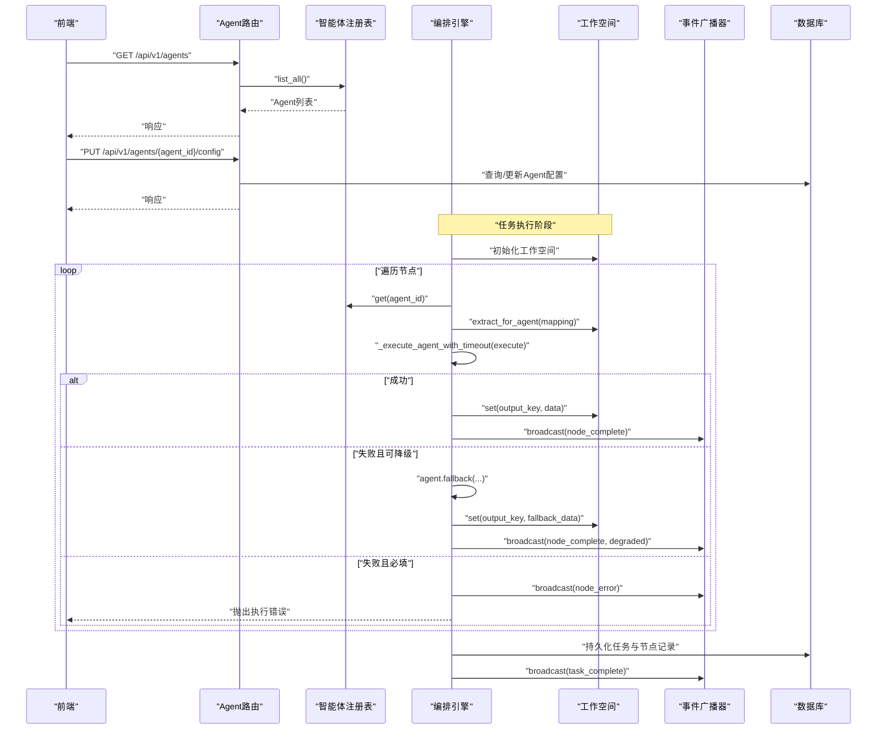

图表来源
- [backend/app/api/agent_routes.py:17-115](file://backend/app/api/agent_routes.py#L17-L115)
- [backend/app/agents/registry.py:23-28](file://backend/app/agents/registry.py#L23-L28)
- [backend/app/orchestrator/engine.py:92-234](file://backend/app/orchestrator/engine.py#L92-L234)
- [backend/app/orchestrator/workspace.py:36-52](file://backend/app/orchestrator/workspace.py#L36-L52)
- [backend/app/orchestrator/broadcaster.py:57-80](file://backend/app/orchestrator/broadcaster.py#L57-L80)
- [backend/app/models/tables.py:23-74](file://backend/app/models/tables.py#L23-L74)

## 详细组件分析

### Agent基类与结果封装
- 抽象接口：execute(input_data, context) 必须返回标准化AgentResult
- 结果封装：AgentResult包含状态、名称、数据、错误、跟踪ID；提供is_success与to_dict
- 成功/失败构造器：_success/_failure统一返回格式
- 降级策略：fallback(error, input_data)默认不降级，可在子类覆盖

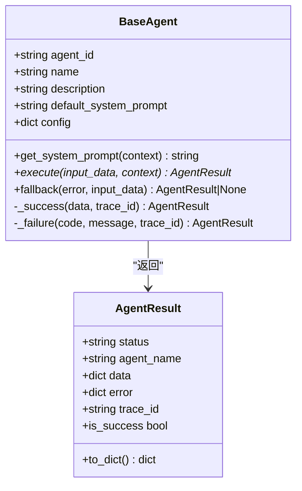

图表来源
- [backend/app/agents/base.py:49-99](file://backend/app/agents/base.py#L49-L99)

章节来源
- [backend/app/agents/base.py:49-99](file://backend/app/agents/base.py#L49-L99)

### 智能体注册机制
- 动态注册：应用启动时批量注册内置智能体实例
- 类型检查：注册表以agent_id为键，重复注册会记录警告
- 实例管理：提供get/list/has操作，缺失时抛出统一异常

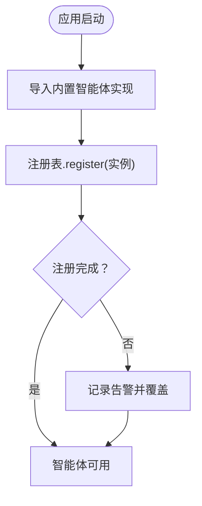

图表来源
- [backend/app/main.py:32-40](file://backend/app/main.py#L32-L40)
- [backend/app/agents/registry.py:16-21](file://backend/app/agents/registry.py#L16-L21)

章节来源
- [backend/app/main.py:32-40](file://backend/app/main.py#L32-L40)
- [backend/app/agents/registry.py:10-40](file://backend/app/agents/registry.py#L10-L40)

### 工作空间与输入映射
- 作用域隔离：每个任务拥有独立工作空间
- 数据共享：支持get/set快照，以及按映射提取输入
- 映射规则：支持直接键访问与input.前缀引用原始输入

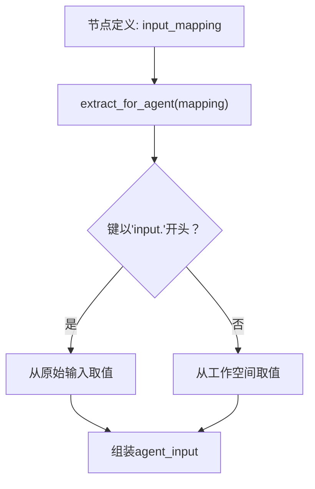

图表来源
- [backend/app/orchestrator/workspace.py:36-52](file://backend/app/orchestrator/workspace.py#L36-L52)
- [backend/app/orchestrator/engine.py:134-135](file://backend/app/orchestrator/engine.py#L134-L135)

章节来源
- [backend/app/orchestrator/workspace.py:12-53](file://backend/app/orchestrator/workspace.py#L12-L53)
- [backend/app/orchestrator/engine.py:134-135](file://backend/app/orchestrator/engine.py#L134-L135)

### 编排引擎执行流程与降级策略
- 默认线性工作流：固定节点顺序与映射
- 执行控制：超时包装、系统提示解析优先级、失败降级
- 事件广播：节点开始/完成/错误，任务完成
- 持久化：节点运行记录、任务记录、令牌统计、耗时计算

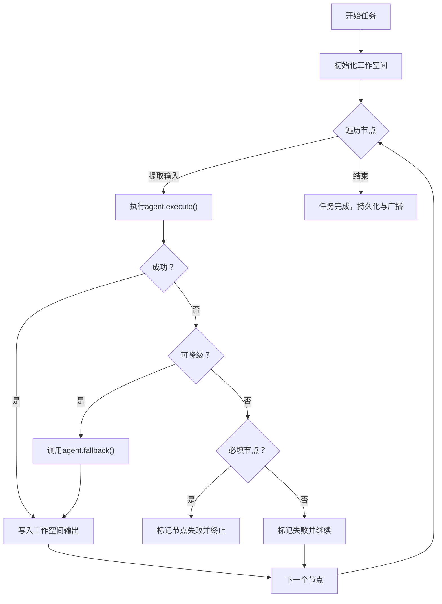

图表来源
- [backend/app/orchestrator/engine.py:92-234](file://backend/app/orchestrator/engine.py#L92-L234)
- [backend/app/orchestrator/broadcaster.py:57-80](file://backend/app/orchestrator/broadcaster.py#L57-L80)
- [backend/app/models/tables.py:48-74](file://backend/app/models/tables.py#L48-L74)

章节来源
- [backend/app/orchestrator/engine.py:92-234](file://backend/app/orchestrator/engine.py#L92-L234)
- [backend/app/orchestrator/broadcaster.py:11-94](file://backend/app/orchestrator/broadcaster.py#L11-L94)
- [backend/app/models/tables.py:23-74](file://backend/app/models/tables.py#L23-L74)

### 具体智能体实现模式
- ProfileAgent：将账号定位描述解析为结构化画像，演示系统提示注入与降级返回
- AuditAgent：对文章进行合规性审核，演示复杂输出结构与降级策略

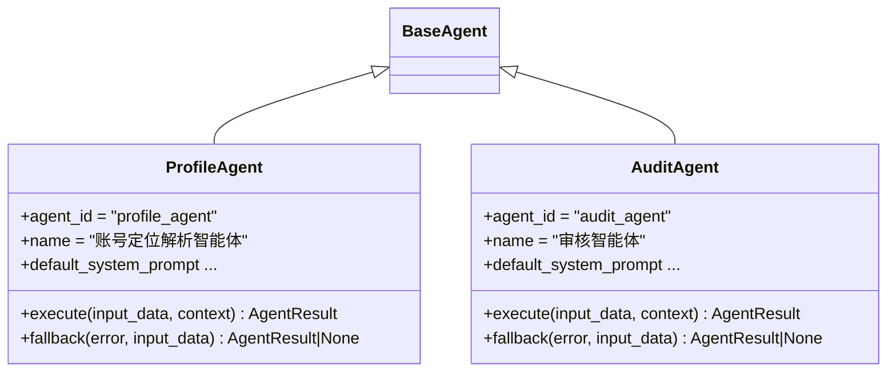

图表来源
- [backend/app/agents/profile_agent.py:10-73](file://backend/app/agents/profile_agent.py#L10-L73)
- [backend/app/agents/audit_agent.py:7-66](file://backend/app/agents/audit_agent.py#L7-L66)

章节来源
- [backend/app/agents/profile_agent.py:10-73](file://backend/app/agents/profile_agent.py#L10-L73)
- [backend/app/agents/audit_agent.py:7-66](file://backend/app/agents/audit_agent.py#L7-L66)

### 技能体系与调用
- 技能基类：统一异步执行接口execute(input_data)->dict
- 技能注册表：集中管理技能实例，提供查询、枚举、存在性判断
- 使用场景：智能体内部可调用技能完成工具型处理（当前示例以mock为主）

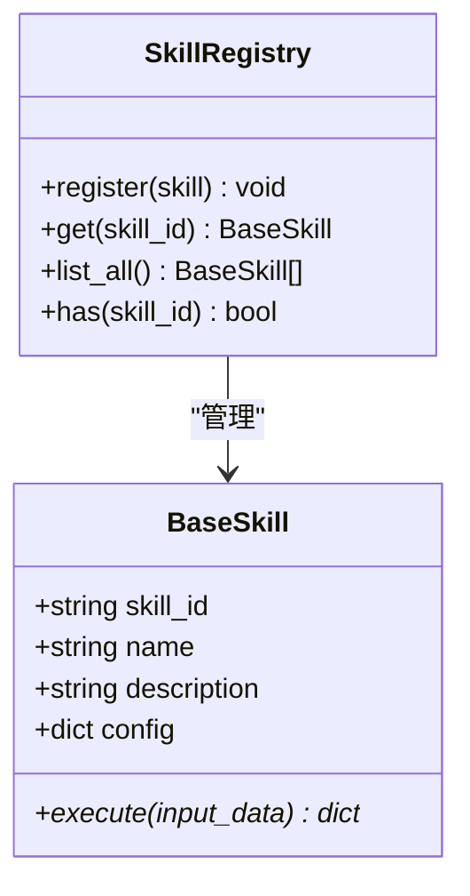

图表来源
- [backend/app/skills/base.py:16-37](file://backend/app/skills/base.py#L16-L37)
- [backend/app/skills/registry.py:10-37](file://backend/app/skills/registry.py#L10-L37)

章节来源
- [backend/app/skills/base.py:16-37](file://backend/app/skills/base.py#L16-L37)
- [backend/app/skills/registry.py:10-37](file://backend/app/skills/registry.py#L10-L37)

### API与配置管理
- 列出智能体：聚合注册表与数据库中的自定义提示，返回统一信息
- 获取单个智能体：返回默认/自定义提示、模型配置、重试配置等
- 更新智能体配置：支持模型配置、提示模板、重试配置的更新，空字符串表示重置为默认

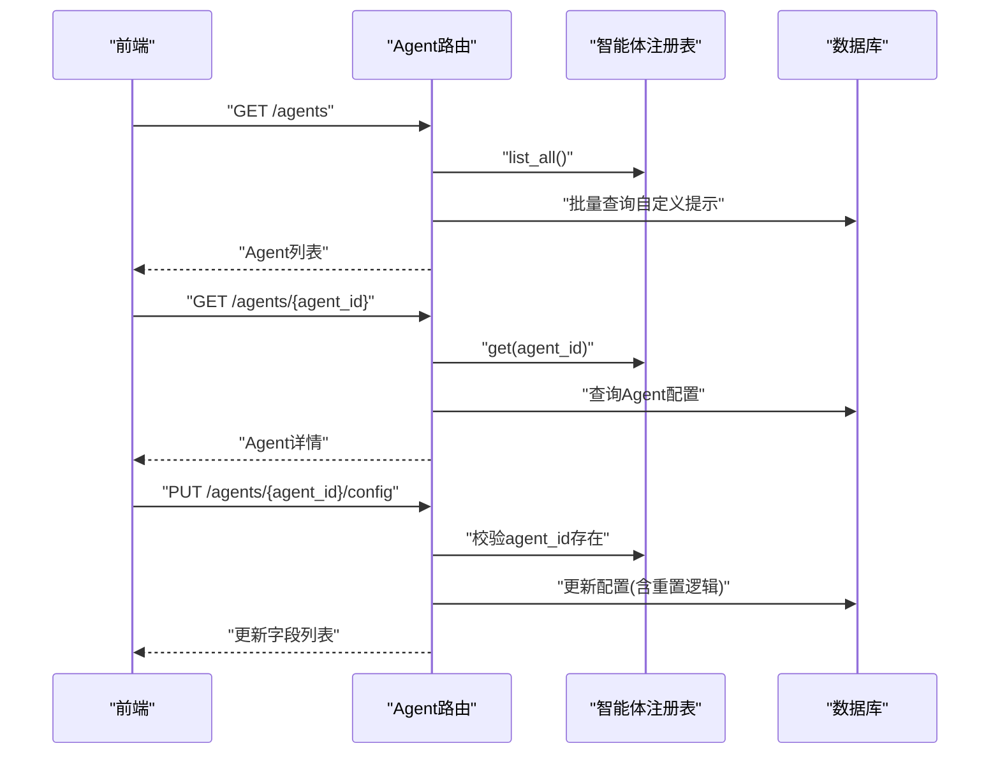

图表来源
- [backend/app/api/agent_routes.py:17-115](file://backend/app/api/agent_routes.py#L17-L115)
- [backend/app/agents/registry.py:23-28](file://backend/app/agents/registry.py#L23-L28)
- [backend/app/models/tables.py:160-181](file://backend/app/models/tables.py#L160-L181)

章节来源
- [backend/app/api/agent_routes.py:17-115](file://backend/app/api/agent_routes.py#L17-L115)
- [backend/app/agents/registry.py:10-40](file://backend/app/agents/registry.py#L10-L40)
- [backend/app/models/tables.py:160-181](file://backend/app/models/tables.py#L160-L181)

### 数据模型与持久化
- 任务与节点运行：记录任务生命周期、节点执行状态、耗时、令牌、错误信息
- 业务实体：账号画像、话题候选、文章草稿、审核结果
- 配置存储：Agent/Skill配置、输入/输出Schema、重试/降级策略等

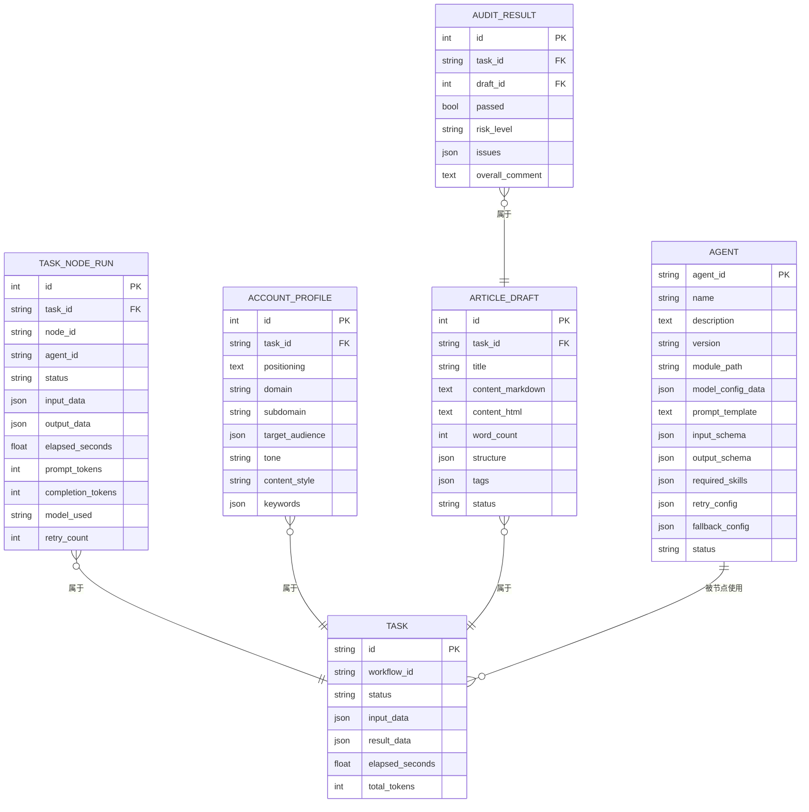

图表来源
- [backend/app/models/tables.py:23-233](file://backend/app/models/tables.py#L23-L233)

章节来源
- [backend/app/models/tables.py:23-233](file://backend/app/models/tables.py#L23-L233)

## 依赖分析
- 组件耦合
  - 编排引擎强依赖注册表与工作空间，弱依赖数据库与广播器
  - 智能体仅依赖基类与日志，解耦于编排细节
  - API路由依赖注册表与数据库模型，提供配置读写能力
- 外部依赖
  - FastAPI、SQLAlchemy、异步I/O、SSE队列
- 循环依赖
  - 未见循环导入；注册在应用生命周期内完成

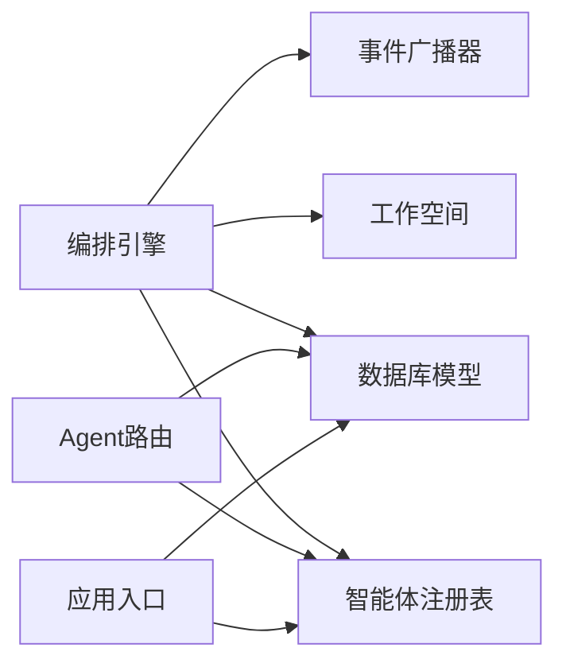

图表来源
- [backend/app/main.py:32-58](file://backend/app/main.py#L32-L58)
- [backend/app/api/agent_routes.py:17-115](file://backend/app/api/agent_routes.py#L17-L115)
- [backend/app/orchestrator/engine.py:89-285](file://backend/app/orchestrator/engine.py#L89-L285)

章节来源
- [backend/app/main.py:32-58](file://backend/app/main.py#L32-L58)
- [backend/app/api/agent_routes.py:17-115](file://backend/app/api/agent_routes.py#L17-L115)
- [backend/app/orchestrator/engine.py:89-285](file://backend/app/orchestrator/engine.py#L89-L285)

## 性能考虑
- 超时控制：编排引擎对单节点执行设置超时，避免阻塞
- 事件缓冲：广播器对历史事件进行缓冲，减少前端竞态丢失
- 令牌统计：节点运行记录累计prompt/completion令牌，便于成本与性能分析
- 日志与追踪：全局Trace ID贯穿请求链路，配合系统日志模型定位问题

章节来源
- [backend/app/core/config.py:42-46](file://backend/app/core/config.py#L42-L46)
- [backend/app/orchestrator/engine.py:236-243](file://backend/app/orchestrator/engine.py#L236-L243)
- [backend/app/orchestrator/broadcaster.py:22-84](file://backend/app/orchestrator/broadcaster.py#L22-L84)
- [backend/app/models/tables.py:220-233](file://backend/app/models/tables.py#L220-L233)

## 故障排查指南
- 节点超时：检查settings.agent_timeout与实际执行时间，必要时调整或拆分任务
- 节点失败：查看节点运行记录的error_message，结合AgentResult.error定位原因
- 降级生效：若required=False的节点触发fallback，节点会标记degraded并继续后续流程
- 广播丢失：确认SSE订阅是否在任务开始前建立，广播器具备历史事件重放能力
- 配置异常：通过Agent路由查询/更新配置，注意空字符串重置为默认提示

章节来源
- [backend/app/core/config.py:42-46](file://backend/app/core/config.py#L42-L46)
- [backend/app/orchestrator/engine.py:164-196](file://backend/app/orchestrator/engine.py#L164-L196)
- [backend/app/orchestrator/broadcaster.py:30-45](file://backend/app/orchestrator/broadcaster.py#L30-L45)
- [backend/app/api/agent_routes.py:74-115](file://backend/app/api/agent_routes.py#L74-L115)

## 结论
本系统以清晰的抽象与模块化设计实现了多智能体编排：Agent基类统一了执行与降级契约，注册表与工作空间提供了稳定的实例管理与上下文共享，编排引擎与事件广播器确保了可观测与可扩展。通过API路由与数据库模型，系统实现了配置即服务与全链路追踪。开发者可在此基础上快速扩展新的智能体与技能，构建更复杂的业务工作流。

## 附录

### 自定义智能体开发最佳实践
- 继承规范
  - 继承BaseAgent，设置agent_id/name/description，实现execute与可选fallback
  - 使用_get_system_prompt_注入系统提示，优先使用数据库自定义提示
- 配置管理
  - 通过Agent路由查询/更新模型配置、提示模板、重试配置
  - 提示模板支持空字符串重置为默认
- 错误处理
  - execute返回失败时，编排引擎会尝试fallback；必填节点失败将中断并上报
  - 使用AgentResult._failure统一错误格式，便于前端与日志消费
- 通信与状态
  - 通过工作空间进行节点间数据传递，遵循input_mapping约定
  - 通过SSE订阅任务流，实时获取节点开始/完成/错误事件
- 性能监控
  - 关注节点耗时、令牌用量与失败率，结合Trace ID定位问题
  - 合理设置超时与重试策略，避免长尾阻塞

章节来源
- [backend/app/agents/base.py:60-99](file://backend/app/agents/base.py#L60-L99)
- [backend/app/api/agent_routes.py:46-115](file://backend/app/api/agent_routes.py#L46-L115)
- [backend/app/orchestrator/engine.py:134-196](file://backend/app/orchestrator/engine.py#L134-L196)
- [backend/app/orchestrator/broadcaster.py:57-80](file://backend/app/orchestrator/broadcaster.py#L57-L80)
- [backend/app/core/config.py:42-46](file://backend/app/core/config.py#L42-L46)