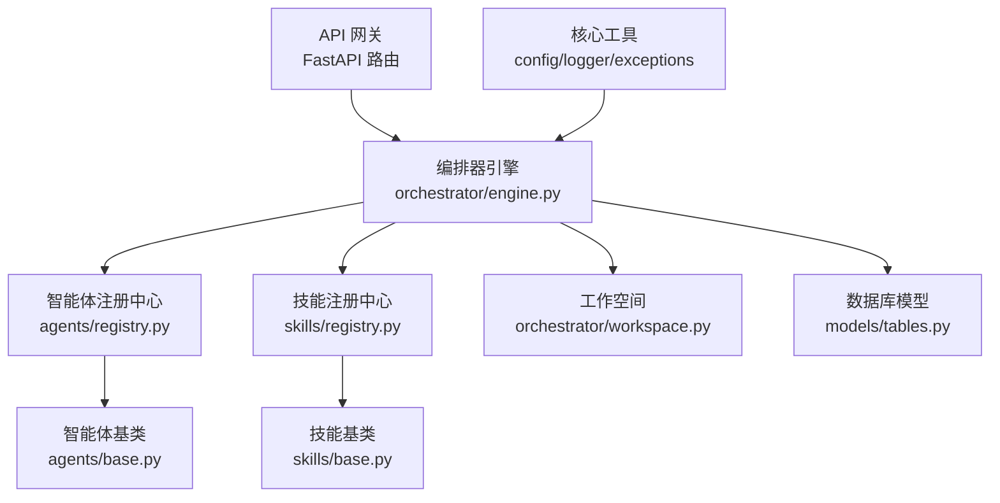
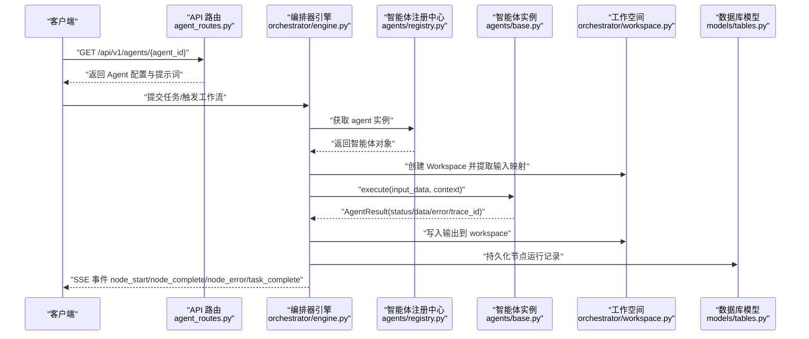
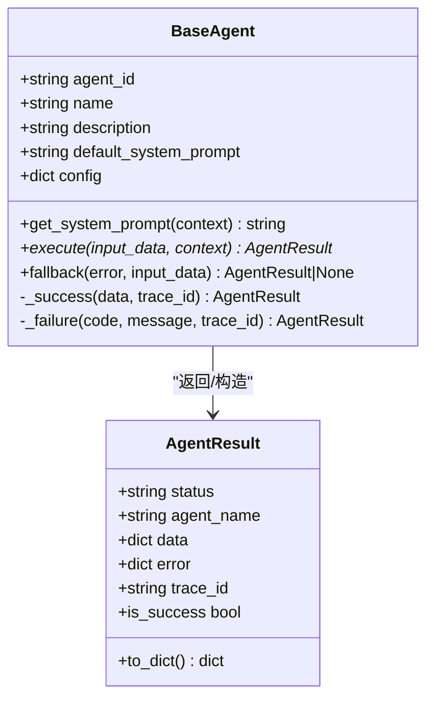
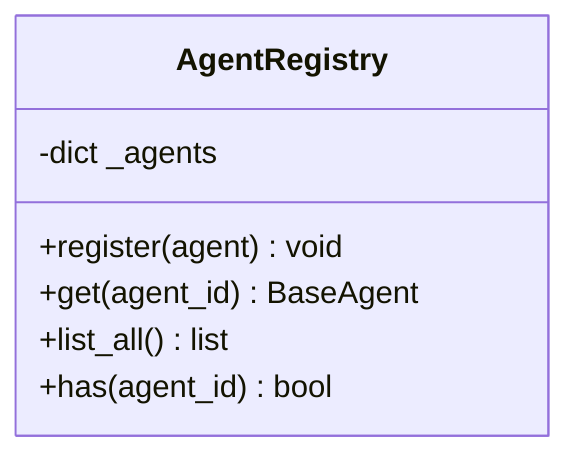
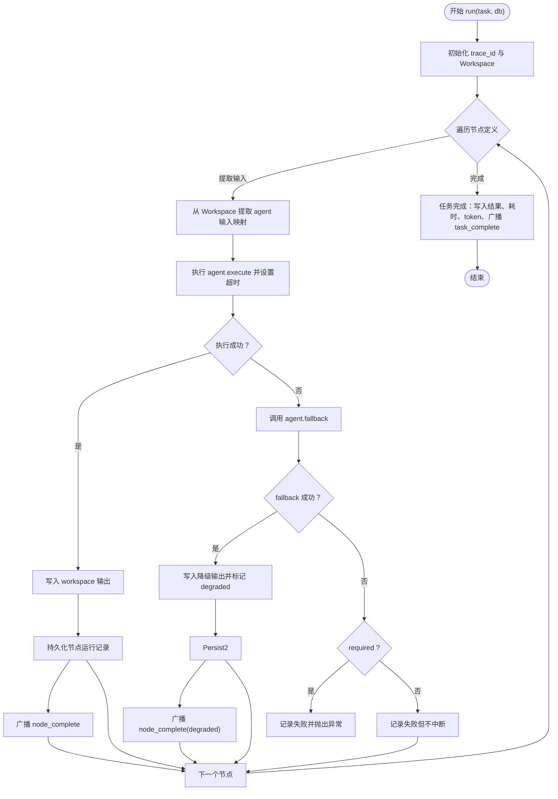
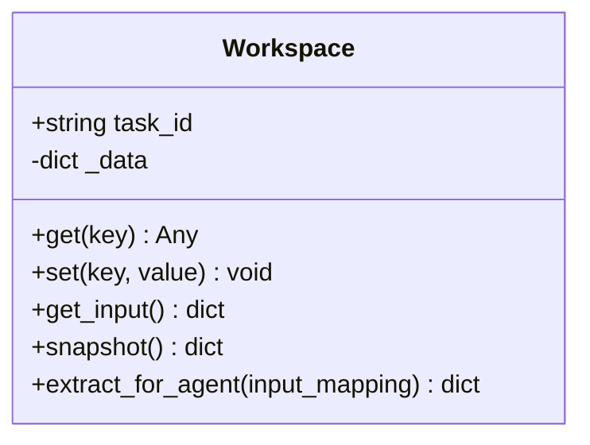
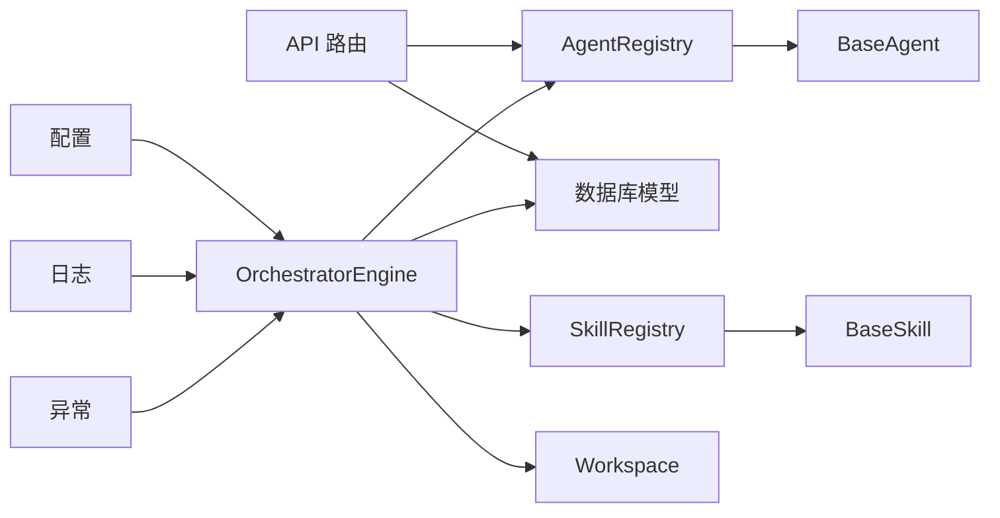

# 自定义智能体开发

<cite>
**本文引用的文件**
- [backend/app/agents/base.py](file://backend/app/agents/base.py)
- [backend/app/agents/audit_agent.py](file://backend/app/agents/audit_agent.py)
- [backend/app/agents/profile_agent.py](file://backend/app/agents/profile_agent.py)
- [backend/app/agents/registry.py](file://backend/app/agents/registry.py)
- [backend/app/orchestestrator/engine.py](file://backend/app/orchestrator/engine.py)
- [backend/app/orchestrator/workspace.py](file://backend/app/orchestrator/workspace.py)
- [backend/app/skills/base.py](file://backend/app/skills/base.py)
- [backend/app/skills/registry.py](file://backend/app/skills/registry.py)
- [backend/app/api/agent_routes.py](file://backend/app/api/agent_routes.py)
- [backend/app/models/tables.py](file://backend/app/models/tables.py)
- [backend/app/core/config.py](file://backend/app/core/config.py)
- [backend/app/core/logger.py](file://backend/app/core/logger.py)
- [backend/app/core/exceptions.py](file://backend/app/core/exceptions.py)
- [ARCHITECTURE.md](file://ARCHITECTURE.md)
</cite>

## 目录
1. [引言](#引言)
2. [项目结构](#项目结构)
3. [核心组件](#核心组件)
4. [架构总览](#架构总览)
5. [详细组件分析](#详细组件分析)
6. [依赖分析](#依赖分析)
7. [性能考量](#性能考量)
8. [故障排查指南](#故障排查指南)
9. [结论](#结论)
10. [附录](#附录)

## 引言
本指南面向希望在本项目基础上开发“自定义智能体”的工程师，系统讲解如何继承 BaseAgent 基类构建智能体，涵盖抽象方法实现、配置参数处理、上下文数据访问、生命周期管理、资源清理、异常处理、调试技巧、性能优化与监控集成，以及代码规范、测试策略与部署注意事项。文档同时提供数据处理型、决策型与协调型智能体的实现范式与参考路径。

## 项目结构
后端采用模块化分层设计：API 网关、编排器、智能体层、技能层、服务层、模型层、Schema 层、核心工具层。智能体与技能均通过注册中心集中管理，编排器按工作流顺序调度，Workspace 作为任务级上下文容器贯穿执行全程。

图表来源
- [backend/app/orchestrator/engine.py:89-285](file://backend/app/orchestrator/engine.py#L89-L285)
- [backend/app/agents/registry.py:10-40](file://backend/app/agents/registry.py#L10-L40)
- [backend/app/skills/registry.py:10-37](file://backend/app/skills/registry.py#L10-L37)
- [backend/app/orchestrator/workspace.py:12-53](file://backend/app/orchestrator/workspace.py#L12-L53)
- [backend/app/agents/base.py:49-99](file://backend/app/agents/base.py#L49-L99)
- [backend/app/skills/base.py:16-37](file://backend/app/skills/base.py#L16-L37)
- [backend/app/models/tables.py:23-181](file://backend/app/models/tables.py#L23-L181)
- [backend/app/core/config.py:7-51](file://backend/app/core/config.py#L7-L51)
- [backend/app/core/logger.py:8-36](file://backend/app/core/logger.py#L8-L36)
- [backend/app/core/exceptions.py:4-125](file://backend/app/core/exceptions.py#L4-L125)

章节来源
- [ARCHITECTURE.md:414-448](file://ARCHITECTURE.md#L414-L448)

## 核心组件
- 智能体基类 BaseAgent：定义统一的抽象接口、结果封装、系统提示词解析、成功/失败便捷构造器与可覆盖的降级策略。
- 智能体注册中心 AgentRegistry：集中注册与检索智能体实例，避免硬编码。
- 编排器 OrchestratorEngine：加载工作流、创建 Workspace、按节点顺序调度智能体、记录节点运行、广播事件、聚合统计与异常处理。
- 工作空间 Workspace：任务级上下文容器，支持提取输入映射、写入输出、快照持久化。
- 技能基类 BaseSkill 与注册中心：技能层的抽象与集中管理。
- API 与模型：Agent 配置查询与更新、任务与节点运行记录持久化。
- 核心工具：配置加载、结构化日志、统一异常体系。

章节来源
- [backend/app/agents/base.py:49-99](file://backend/app/agents/base.py#L49-L99)
- [backend/app/agents/registry.py:10-40](file://backend/app/agents/registry.py#L10-L40)
- [backend/app/orchestrator/engine.py:89-285](file://backend/app/orchestrator/engine.py#L89-L285)
- [backend/app/orchestrator/workspace.py:12-53](file://backend/app/orchestrator/workspace.py#L12-L53)
- [backend/app/skills/base.py:16-37](file://backend/app/skills/base.py#L16-L37)
- [backend/app/skills/registry.py:10-37](file://backend/app/skills/registry.py#L10-L37)
- [backend/app/api/agent_routes.py:17-115](file://backend/app/api/agent_routes.py#L17-L115)
- [backend/app/models/tables.py:23-181](file://backend/app/models/tables.py#L23-L181)
- [backend/app/core/config.py:7-51](file://backend/app/core/config.py#L7-L51)
- [backend/app/core/logger.py:8-36](file://backend/app/core/logger.py#L8-L36)
- [backend/app/core/exceptions.py:4-125](file://backend/app/core/exceptions.py#L4-L125)

## 架构总览
下图展示从请求进入 API 网关，到编排器调度智能体、读写 Workspace、持久化节点运行记录、最终通过 SSE 广播事件的完整链路。

图表来源
- [backend/app/api/agent_routes.py:17-115](file://backend/app/api/agent_routes.py#L17-L115)
- [backend/app/orchestrator/engine.py:92-235](file://backend/app/orchestrator/engine.py#L92-L235)
- [backend/app/agents/registry.py:23-28](file://backend/app/agents/registry.py#L23-L28)
- [backend/app/orchestrator/workspace.py:36-52](file://backend/app/orchestrator/workspace.py#L36-L52)
- [backend/app/models/tables.py:48-74](file://backend/app/models/tables.py#L48-L74)

## 详细组件分析

### BaseAgent 基类与 AgentResult
- 必备抽象方法：execute(input_data: dict, context: dict) -> AgentResult
- 可覆盖方法：fallback(error: Exception, input_data: dict) -> AgentResult | None
- 结果封装：AgentResult 提供统一的 status、agent_name、data、error、trace_id，并提供 is_success 判断与 to_dict 序列化。
- 系统提示词：get_system_prompt(context: dict) 支持从上下文或默认模板获取有效提示词。
- 成功/失败便捷构造：_success(data, trace_id) 与 _failure(code, message, trace_id)。

图表来源
- [backend/app/agents/base.py:18-99](file://backend/app/agents/base.py#L18-L99)

章节来源
- [backend/app/agents/base.py:49-99](file://backend/app/agents/base.py#L49-L99)

### 智能体注册中心 AgentRegistry
- 职责：注册、获取、列举、存在性判断。
- 行为：重复注册告警、未找到抛出统一异常。
- 单例：agent_registry 供编排器与 API 直接使用。

图表来源
- [backend/app/agents/registry.py:10-40](file://backend/app/agents/registry.py#L10-L40)

章节来源
- [backend/app/agents/registry.py:10-40](file://backend/app/agents/registry.py#L10-L40)

### 编排器 OrchestratorEngine
- 工作流：内置线性节点序列，支持必选/非必选节点、超时、降级、广播事件、统计 token。
- 上下文：从注册中心获取 agent，解析有效 system_prompt，将 workspace 快照注入 context。
- 节点执行：带超时的 execute 调用，失败时尝试 fallback；必选节点失败抛出统一异常。
- 持久化：节点运行记录 TaskNodeRunModel，任务记录 TaskModel，汇总耗时与 token。
- 广播：node_start、node_complete、node_error、task_complete。

图表来源
- [backend/app/orchestrator/engine.py:92-235](file://backend/app/orchestrator/engine.py#L92-L235)
- [backend/app/orchestrator/engine.py:236-264](file://backend/app/orchestrator/engine.py#L236-L264)
- [backend/app/orchestrator/engine.py:265-281](file://backend/app/orchestrator/engine.py#L265-L281)

章节来源
- [backend/app/orchestrator/engine.py:89-285](file://backend/app/orchestrator/engine.py#L89-L285)

### 工作空间 Workspace
- 作用：任务级上下文容器，支持 set/get/snapshot，以及按字段映射提取输入。
- 与编排器配合：编排器通过 input_mapping 将 workspace 中的数据映射到智能体输入。

图表来源
- [backend/app/orchestrator/workspace.py:12-53](file://backend/app/orchestrator/workspace.py#L12-L53)

章节来源
- [backend/app/orchestrator/workspace.py:12-53](file://backend/app/orchestrator/workspace.py#L12-L53)

### 技能基类与注册中心
- BaseSkill：定义技能抽象接口 execute(input_data: dict) -> dict。
- SkillRegistry：集中注册、获取、列举、存在性判断，统一异常。

章节来源
- [backend/app/skills/base.py:16-37](file://backend/app/skills/base.py#L16-L37)
- [backend/app/skills/registry.py:10-37](file://backend/app/skills/registry.py#L10-L37)

### API 与模型
- Agent 配置 API：列出智能体、获取详情、更新配置（prompt、模型参数、重试策略等）。
- 数据模型：TaskModel、TaskNodeRunModel、AgentModel 等，支撑任务生命周期与节点运行记录的持久化。

章节来源
- [backend/app/api/agent_routes.py:17-115](file://backend/app/api/agent_routes.py#L17-L115)
- [backend/app/models/tables.py:23-181](file://backend/app/models/tables.py#L23-L181)

### 示例智能体
- 审核智能体 AuditAgent：演示降级策略 fallback 的使用，返回结构化审核结果。
- 账号定位解析智能体 ProfileAgent：演示 LLM 调用、JSON 解析、错误处理与降级策略。

章节来源
- [backend/app/agents/audit_agent.py:7-66](file://backend/app/agents/audit_agent.py#L7-L66)
- [backend/app/agents/profile_agent.py:13-97](file://backend/app/agents/profile_agent.py#L13-L97)

## 依赖分析
- 智能体依赖注册中心与编排器；编排器依赖注册中心、Workspace、配置与异常模块。
- API 层依赖注册中心与数据库模型；模型层支撑编排器持久化。
- 日志与配置贯穿全局，异常体系统一错误码与消息。

图表来源
- [backend/app/api/agent_routes.py:17-115](file://backend/app/api/agent_routes.py#L17-L115)
- [backend/app/orchestrator/engine.py:89-285](file://backend/app/orchestrator/engine.py#L89-L285)
- [backend/app/agents/registry.py:10-40](file://backend/app/agents/registry.py#L10-L40)
- [backend/app/skills/registry.py:10-37](file://backend/app/skills/registry.py#L10-L37)
- [backend/app/orchestrator/workspace.py:12-53](file://backend/app/orchestrator/workspace.py#L12-L53)
- [backend/app/models/tables.py:23-181](file://backend/app/models/tables.py#L23-L181)
- [backend/app/core/config.py:7-51](file://backend/app/core/config.py#L7-L51)
- [backend/app/core/logger.py:8-36](file://backend/app/core/logger.py#L8-L36)
- [backend/app/core/exceptions.py:4-125](file://backend/app/core/exceptions.py#L4-L125)

## 性能考量
- 超时控制：编排器对智能体执行设置超时，防止阻塞；可通过配置调整。
- Token 统计：编排器累加 prompt/completion token，便于成本与性能分析。
- 降级策略：失败时优先尝试 fallback，必要时标记 degraded 并继续流程，降低端到端延迟。
- 日志与追踪：结构化日志与 trace_id 串联请求链路，便于定位慢节点与异常。

章节来源
- [backend/app/orchestrator/engine.py:236-244](file://backend/app/orchestrator/engine.py#L236-L244)
- [backend/app/orchestrator/engine.py:211-216](file://backend/app/orchestrator/engine.py#L211-L216)
- [backend/app/core/config.py:42-46](file://backend/app/core/config.py#L42-L46)
- [backend/app/core/logger.py:8-36](file://backend/app/core/logger.py#L8-L36)

## 故障排查指南
- 统一异常：AgentNotFoundError、AgentTimeoutError、AgentExecutionError 等，便于前端与日志识别。
- 节点失败：编排器记录 error_message，必要时抛出异常终止必选节点；非必选节点降级继续。
- 日志与追踪：结构化日志包含 trace_id、task_id、节点信息，结合数据库节点运行记录定位问题。
- API 配置：通过 Agent 配置接口查看/更新 prompt、模型参数与重试策略，快速验证修复。

章节来源
- [backend/app/core/exceptions.py:31-98](file://backend/app/core/exceptions.py#L31-L98)
- [backend/app/orchestrator/engine.py:176-197](file://backend/app/orchestrator/engine.py#L176-L197)
- [backend/app/api/agent_routes.py:46-115](file://backend/app/api/agent_routes.py#L46-L115)
- [backend/app/models/tables.py:48-74](file://backend/app/models/tables.py#L48-L74)

## 结论
本指南提供了从基类继承、实现抽象方法、接入注册中心与编排器、处理上下文与配置、实现降级策略、到调试与性能优化的完整路径。按照本文的开发流程与最佳实践，可快速构建高质量的自定义智能体，并与技能层、工作流与监控体系无缝集成。

## 附录

### 开发流程指导
- 需求分析：明确智能体职责、输入输出、依赖技能、失败容忍度。
- 设计模式选择：数据处理型（纯计算/解析）、决策型（LLM 推理）、协调型（组合多个技能/智能体）。
- 代码实现：继承 BaseAgent，实现 execute 与 fallback，使用 _success/_failure 构造结果，必要时调用技能。
- 上下文访问：通过 context 获取 system_prompt，通过 Workspace 读写共享数据。
- 配置参数：通过 Agent 配置 API 更新 prompt、模型参数、重试策略。
- 测试验证：编写单元测试与集成测试，覆盖正常路径、异常与降级场景。
- 部署注意事项：确保注册中心在应用启动时完成注册，配置文件正确加载，日志与追踪开启。

章节来源
- [backend/app/agents/base.py:49-99](file://backend/app/agents/base.py#L49-L99)
- [backend/app/api/agent_routes.py:74-115](file://backend/app/api/agent_routes.py#L74-L115)
- [ARCHITECTURE.md:541-632](file://ARCHITECTURE.md#L541-L632)

### 开发示例与实现范式
- 数据处理型智能体：参考 ProfileAgent 的 LLM 调用与 JSON 解析、错误处理与降级策略。
- 决策型智能体：参考 AuditAgent 的降级策略与结构化输出。
- 协调型智能体：通过编排器按序调度多个智能体，利用 Workspace 共享中间结果。

章节来源
- [backend/app/agents/profile_agent.py:45-97](file://backend/app/agents/profile_agent.py#L45-L97)
- [backend/app/agents/audit_agent.py:48-66](file://backend/app/agents/audit_agent.py#L48-L66)
- [backend/app/orchestrator/engine.py:107-175](file://backend/app/orchestrator/engine.py#L107-L175)

### 生命周期管理与资源清理
- 初始化：在应用启动时完成智能体注册。
- 执行期：编排器负责超时、异常捕获、降级与广播。
- 结束：任务完成后持久化结果与统计信息，关闭 SSE 连接。

章节来源
- [backend/app/agents/registry.py:16-21](file://backend/app/agents/registry.py#L16-L21)
- [backend/app/orchestrator/engine.py:228-233](file://backend/app/orchestrator/engine.py#L228-L233)

### 调试技巧与监控集成
- 使用结构化日志与 trace_id 追踪请求链路。
- 通过 Agent 配置接口动态调整提示词与参数，快速验证修复。
- 利用节点运行记录与任务结果快照进行回放与分析。

章节来源
- [backend/app/core/logger.py:8-36](file://backend/app/core/logger.py#L8-L36)
- [backend/app/api/agent_routes.py:46-115](file://backend/app/api/agent_routes.py#L46-L115)
- [backend/app/models/tables.py:48-74](file://backend/app/models/tables.py#L48-L74)

### 代码规范与测试策略
- 代码规范：遵循统一的输入输出结构、错误码与日志格式；保持智能体单一职责。
- 测试策略：单元测试覆盖 execute 与 fallback；集成测试覆盖编排器调度与 Workspace 交互；端到端测试覆盖 API 与 SSE。

章节来源
- [ARCHITECTURE.md:94-123](file://ARCHITECTURE.md#L94-L123)