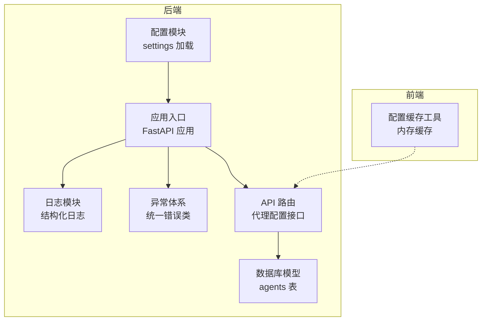
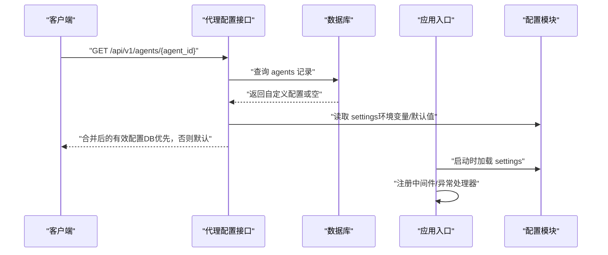
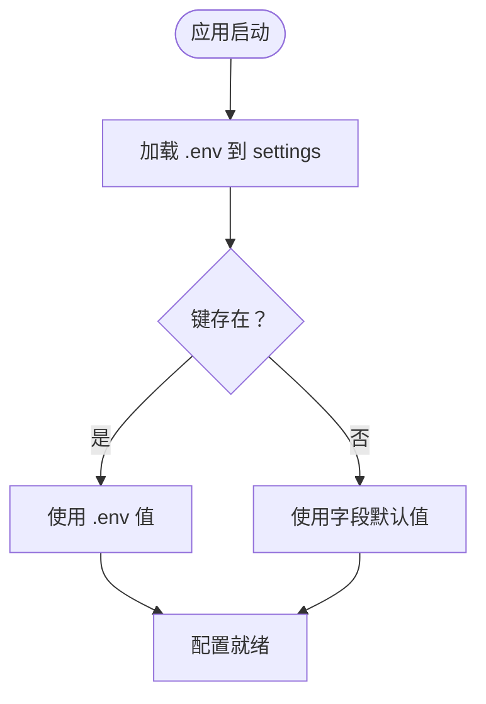
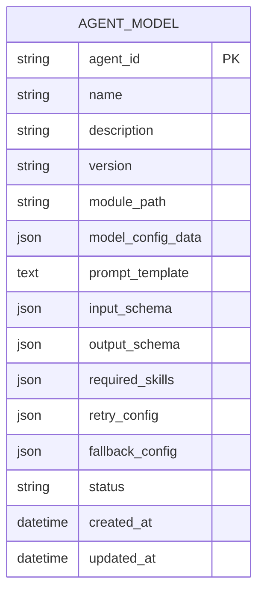
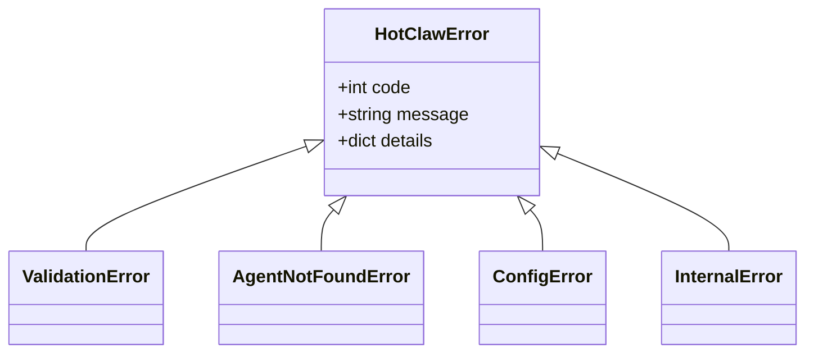
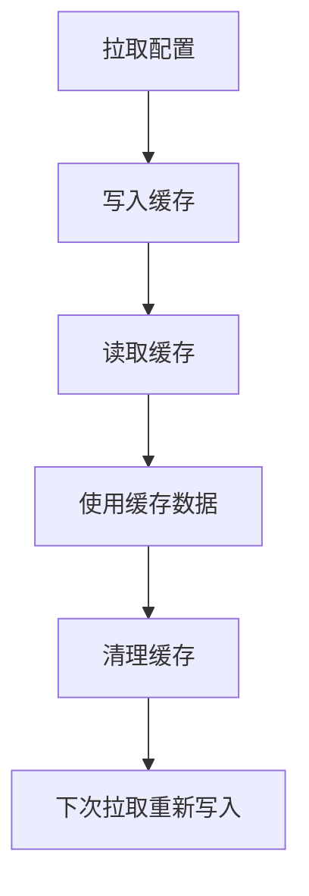
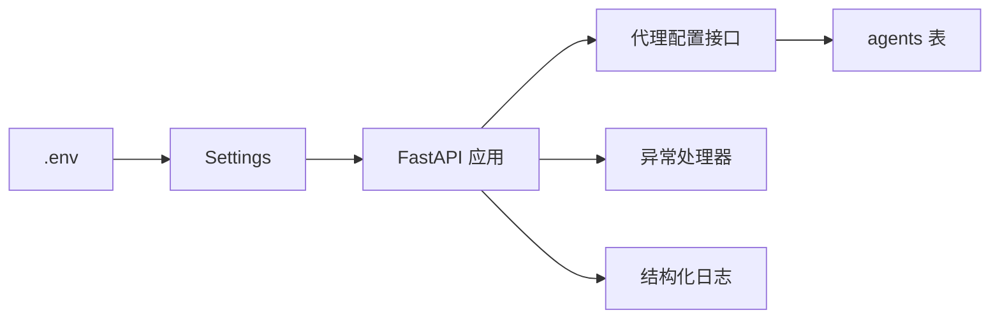

# 配置管理系统

<cite>
**本文引用的文件**
- [backend/app/core/config.py](file://backend/app/core/config.py)
- [backend/app/main.py](file://backend/app/main.py)
- [backend/app/core/exceptions.py](file://backend/app/core/exceptions.py)
- [backend/app/core/logger.py](file://backend/app/core/logger.py)
- [backend/app/api/agent_routes.py](file://backend/app/api/agent_routes.py)
- [backend/app/models/tables.py](file://backend/app/models/tables.py)
- [backend/app/schemas/common.py](file://backend/app/schemas/common.py)
- [OpenClaw-bot-review-main/lib/config-cache.ts](file://OpenClaw-bot-review-main/lib/config-cache.ts)
</cite>

## 目录
1. [引言](#引言)
2. [项目结构](#项目结构)
3. [核心组件](#核心组件)
4. [架构总览](#架构总览)
5. [详细组件分析](#详细组件分析)
6. [依赖分析](#依赖分析)
7. [性能考量](#性能考量)
8. [故障排查指南](#故障排查指南)
9. [结论](#结论)
10. [附录](#附录)

## 引言
本文件面向运维与开发人员，系统化阐述本项目的配置管理体系：环境变量驱动的配置加载、配置持久化与覆盖策略、统一异常与错误响应、以及前端侧的简单内存缓存设计。文档同时给出配置验证、安全与审计建议，以及可扩展的配置注入与热更新思路。

## 项目结构
后端采用 FastAPI + SQLAlchemy 架构，配置集中于 settings 对象；前端提供轻量内存缓存工具以支持客户端侧的配置读取与清理。数据库模型中包含“agents”表用于持久化代理配置（含模型参数、提示词模板、重试与回退策略等）。

**图表来源**
- [backend/app/core/config.py:1-51](file://backend/app/core/config.py#L1-L51)
- [backend/app/main.py:1-142](file://backend/app/main.py#L1-L142)
- [backend/app/core/logger.py:1-36](file://backend/app/core/logger.py#L1-L36)
- [backend/app/core/exceptions.py:1-125](file://backend/app/core/exceptions.py#L1-L125)
- [backend/app/api/agent_routes.py:1-115](file://backend/app/api/agent_routes.py#L1-L115)
- [backend/app/models/tables.py:160-181](file://backend/app/models/tables.py#L160-L181)
- [OpenClaw-bot-review-main/lib/config-cache.ts:1-19](file://OpenClaw-bot-review-main/lib/config-cache.ts#L1-L19)

**章节来源**
- [backend/app/core/config.py:1-51](file://backend/app/core/config.py#L1-L51)
- [backend/app/main.py:1-142](file://backend/app/main.py#L1-L142)
- [backend/app/api/agent_routes.py:1-115](file://backend/app/api/agent_routes.py#L1-L115)
- [backend/app/models/tables.py:160-181](file://backend/app/models/tables.py#L160-L181)
- [OpenClaw-bot-review-main/lib/config-cache.ts:1-19](file://OpenClaw-bot-review-main/lib/config-cache.ts#L1-L19)

## 核心组件
- 配置加载与优先级
  - 后端通过 pydantic-settings 的 Settings 类从 .env 文件加载键值，未在运行时设置的键将回落到字段默认值。该机制实现了“环境变量 > 默认值”的二层优先级。
  - 前端提供内存缓存工具，用于在客户端侧缓存最近一次拉取的配置，便于快速读取与清理。
- 配置持久化与覆盖
  - 代理配置（如模型参数、提示词模板、重试与回退策略）持久化至数据库的 agents 表；API 在读取时优先使用数据库中的自定义配置，否则回退到代理实现的默认值。
- 统一异常与错误响应
  - 定义了按业务域分组的错误码段，全局异常处理器将错误码映射为标准 HTTP 状态码，并返回统一的错误响应结构。
- 日志与审计
  - 使用结构化日志记录关键事件；系统日志表可用于审计追踪。

**章节来源**
- [backend/app/core/config.py:7-47](file://backend/app/core/config.py#L7-L47)
- [OpenClaw-bot-review-main/lib/config-cache.ts:1-19](file://OpenClaw-bot-review-main/lib/config-cache.ts#L1-L19)
- [backend/app/api/agent_routes.py:46-71](file://backend/app/api/agent_routes.py#L46-L71)
- [backend/app/models/tables.py:160-181](file://backend/app/models/tables.py#L160-L181)
- [backend/app/core/exceptions.py:100-125](file://backend/app/core/exceptions.py#L100-L125)
- [backend/app/main.py:87-129](file://backend/app/main.py#L87-L129)
- [backend/app/core/logger.py:8-36](file://backend/app/core/logger.py#L8-L36)

## 架构总览
下图展示配置从加载到使用的整体流程：settings 提供基础配置；API 读取持久化配置并与默认值进行覆盖；异常与日志贯穿全链路。

**图表来源**
- [backend/app/api/agent_routes.py:46-71](file://backend/app/api/agent_routes.py#L46-L71)
- [backend/app/core/config.py:7-47](file://backend/app/core/config.py#L7-L47)
- [backend/app/main.py:42-58](file://backend/app/main.py#L42-L58)

## 详细组件分析

### 配置加载与优先级机制
- 环境变量优先：.env 中的键会覆盖字段默认值；未提供的键保持默认。
- 运行时默认值兜底：若 .env 缺失或未设置某键，将使用字段定义的默认值。
- 前端缓存：客户端侧提供内存缓存工具，便于减少重复请求与提升首屏性能。

**图表来源**
- [backend/app/core/config.py:7-47](file://backend/app/core/config.py#L7-L47)

**章节来源**
- [backend/app/core/config.py:7-47](file://backend/app/core/config.py#L7-L47)
- [OpenClaw-bot-review-main/lib/config-cache.ts:8-18](file://OpenClaw-bot-review-main/lib/config-cache.ts#L8-L18)

### 配置持久化与覆盖策略
- 数据模型：agents 表保存代理的模型参数、提示词模板、输入输出 Schema、所需技能、重试与回退策略等。
- 读取策略：API 优先读取数据库中的自定义配置；若为空，则回退到代理实现的默认值。
- 写入策略：API 支持按需更新部分字段；空字符串表示“重置为默认”，服务端将其存储为 NULL，从而触发回退逻辑。

**图表来源**
- [backend/app/models/tables.py:160-181](file://backend/app/models/tables.py#L160-L181)

**章节来源**
- [backend/app/api/agent_routes.py:46-115](file://backend/app/api/agent_routes.py#L46-L115)
- [backend/app/models/tables.py:160-181](file://backend/app/models/tables.py#L160-L181)

### 异常处理体系与错误响应
- 错误分类：按业务域划分错误码段（如用户输入错误、外部调用错误、配置错误、系统内部错误），便于统一识别与处理。
- HTTP 映射：全局异常处理器将错误码映射为标准 HTTP 状态码；特殊错误有特例映射。
- 统一响应：错误响应包含 code、message、data、details 字段，便于前端一致化处理。

**图表来源**
- [backend/app/core/exceptions.py:4-125](file://backend/app/core/exceptions.py#L4-L125)

**章节来源**
- [backend/app/core/exceptions.py:100-125](file://backend/app/core/exceptions.py#L100-L125)
- [backend/app/main.py:87-129](file://backend/app/main.py#L87-L129)
- [backend/app/schemas/common.py:14-20](file://backend/app/schemas/common.py#L14-L20)

### 前端配置缓存设计
- 设计目标：在客户端侧缓存最近一次拉取的配置，避免重复请求；提供清理能力以便在配置变更后强制刷新。
- 实现要点：单例对象保存最近一次缓存条目（包含数据与时间戳），提供读取、写入与清理三个方法。

**图表来源**
- [OpenClaw-bot-review-main/lib/config-cache.ts:1-19](file://OpenClaw-bot-review-main/lib/config-cache.ts#L1-L19)

**章节来源**
- [OpenClaw-bot-review-main/lib/config-cache.ts:1-19](file://OpenClaw-bot-review-main/lib/config-cache.ts#L1-L19)

### 配置验证与默认值填充
- 后端配置：使用 pydantic Field 的默认值作为兜底；.env 作为外部输入源。
- 代理配置：数据库中缺失的字段回退到代理实现的默认值；API 层不执行额外校验，确保灵活性。
- 建议：可在 API 层引入 Schema 校验（如 Pydantic 模型）对传入的配置进行类型检查与约束，结合默认值填充策略，形成“输入校验 + 默认回退”的双保险。

**章节来源**
- [backend/app/core/config.py:11-47](file://backend/app/core/config.py#L11-L47)
- [backend/app/api/agent_routes.py:74-115](file://backend/app/api/agent_routes.py#L74-L115)

### 安全与审计考虑
- 敏感信息保护：将密钥类配置置于 .env 并严格纳入版本控制排除；运行时避免在日志与错误响应中泄露敏感字段。
- 权限控制：API 接口应增加鉴权与授权校验，防止未授权访问或篡改代理配置。
- 审计日志：利用结构化日志记录关键操作（如配置更新、读取、异常），并在系统日志表中持久化，便于审计与溯源。

**章节来源**
- [backend/app/core/logger.py:8-36](file://backend/app/core/logger.py#L8-L36)
- [backend/app/models/tables.py:220-233](file://backend/app/models/tables.py#L220-L233)

## 依赖分析
- 配置模块依赖 .env 文件与字段默认值，为应用提供基础运行参数。
- API 路由依赖数据库模型以读取/写入代理配置，并与默认值进行覆盖。
- 异常体系与日志模块贯穿应用生命周期，保证可观测性与一致性。

**图表来源**
- [backend/app/core/config.py:7-47](file://backend/app/core/config.py#L7-L47)
- [backend/app/main.py:42-58](file://backend/app/main.py#L42-L58)
- [backend/app/api/agent_routes.py:46-115](file://backend/app/api/agent_routes.py#L46-L115)
- [backend/app/models/tables.py:160-181](file://backend/app/models/tables.py#L160-L181)
- [backend/app/core/exceptions.py:100-125](file://backend/app/core/exceptions.py#L100-L125)
- [backend/app/core/logger.py:8-36](file://backend/app/core/logger.py#L8-L36)

**章节来源**
- [backend/app/core/config.py:7-47](file://backend/app/core/config.py#L7-L47)
- [backend/app/api/agent_routes.py:46-115](file://backend/app/api/agent_routes.py#L46-L115)
- [backend/app/models/tables.py:160-181](file://backend/app/models/tables.py#L160-L181)
- [backend/app/core/exceptions.py:100-125](file://backend/app/core/exceptions.py#L100-L125)
- [backend/app/core/logger.py:8-36](file://backend/app/core/logger.py#L8-L36)

## 性能考量
- 配置读取路径短：settings 仅在应用启动时加载，后续通过 API 拉取代理配置，避免频繁 IO。
- 前端缓存：客户端缓存可显著降低重复请求开销，建议在配置变更后主动清理缓存以保证一致性。
- 数据库查询：代理配置读取采用单表查询与少量字段投影，复杂度低；建议在高并发场景下增加索引与连接池优化。

## 故障排查指南
- 配置未生效
  - 检查 .env 是否存在且键名正确；确认未被运行时环境覆盖。
  - 若期望使用数据库中的自定义配置，请确认 agents 表对应记录已创建且字段非空。
- 错误响应不符合预期
  - 查看全局异常处理器的错误码映射规则；核对业务错误是否落入正确的错误码段。
  - 开启调试模式可查看 details 字段中的详细信息（生产环境建议关闭）。
- 日志与审计
  - 结构化日志包含时间戳、级别、模块与上下文；系统日志表可用于检索 trace_id 关联的操作记录。

**章节来源**
- [backend/app/main.py:87-129](file://backend/app/main.py#L87-L129)
- [backend/app/core/logger.py:8-36](file://backend/app/core/logger.py#L8-L36)
- [backend/app/models/tables.py:220-233](file://backend/app/models/tables.py#L220-L233)

## 结论
本配置系统以“环境变量 + 默认值”为核心，辅以数据库持久化的代理配置覆盖策略，配合统一异常与结构化日志，形成了清晰、可审计、易扩展的配置管理闭环。前端缓存进一步提升了用户体验。建议在 API 层引入 Schema 校验与默认值填充，完善配置验证；同时强化鉴权与敏感信息保护，持续优化性能与可观测性。

## 附录
- 最佳实践
  - 运维
    - 将密钥与敏感配置放入 .env 并纳入安全管控；定期轮换并最小化暴露面。
    - 在生产环境收紧 CORS 与鉴权策略；启用 HTTPS 与访问控制。
    - 监控健康检查与关键指标，结合结构化日志与系统日志进行问题定位。
  - 开发
    - 新增代理配置项时，同步完善数据库 Schema 与默认值；在 API 层补充校验与错误处理。
    - 使用统一的错误码段与响应结构，确保前后端一致化对接。
    - 在客户端侧合理使用缓存工具，变更后及时清理，避免脏读。