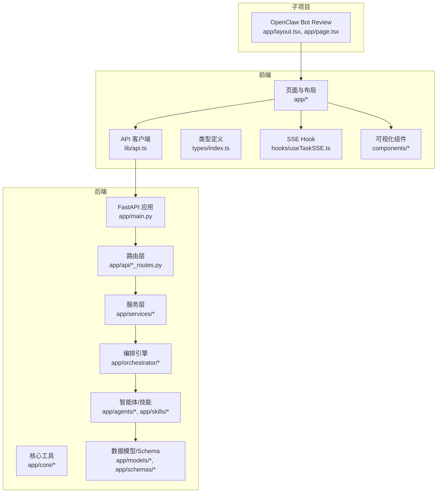
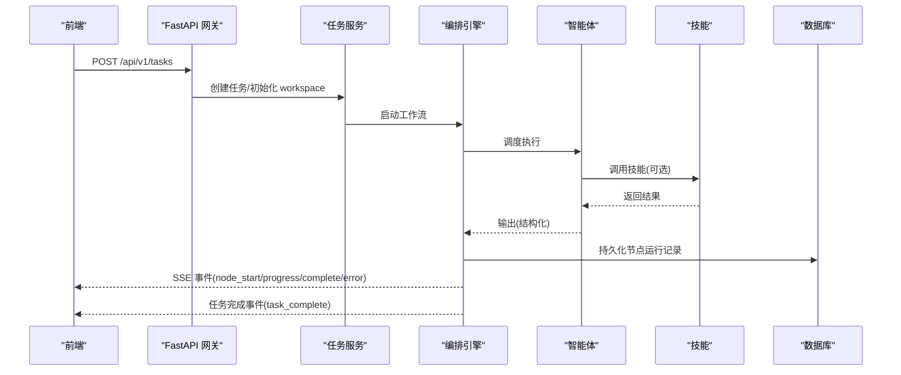
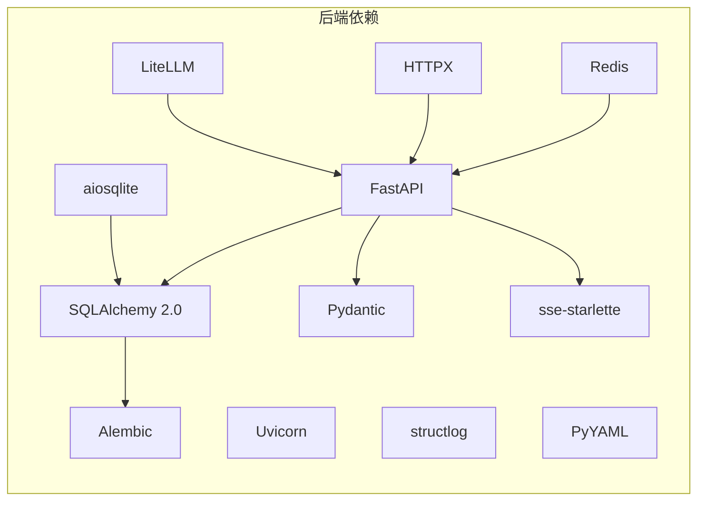

# 代码规范

<cite>
**本文引用的文件**
- [backend/pyproject.toml](file://backend/pyproject.toml)
- [frontend/package.json](file://frontend/package.json)
- [OpenClaw-bot-review-main/package.json](file://OpenClaw-bot-review-main/package.json)
- [ARCHITECTURE.md](file://ARCHITECTURE.md)
- [ai_readme.md](file://ai_readme.md)
- [backend/app/main.py](file://backend/app/main.py)
- [backend/app/api/agent_routes.py](file://backend/app/api/agent_routes.py)
- [frontend/lib/api.ts](file://frontend/lib/api.ts)
- [frontend/types/index.ts](file://frontend/types/index.ts)
- [frontend/components/dashboard/TaskDashboard.tsx](file://frontend/components/dashboard/TaskDashboard.tsx)
- [frontend/hooks/useTaskSSE.ts](file://frontend/hooks/useTaskSSE.ts)
- [OpenClaw-bot-review-main/app/layout.tsx](file://OpenClaw-bot-review-main/app/layout.tsx)
- [OpenClaw-bot-review-main/app/page.tsx](file://OpenClaw-bot-review-main/app/page.tsx)
</cite>

## 目录
1. [引言](#引言)
2. [项目结构](#项目结构)
3. [核心组件](#核心组件)
4. [架构总览](#架构总览)
5. [详细组件分析](#详细组件分析)
6. [依赖分析](#依赖分析)
7. [性能考量](#性能考量)
8. [故障排查指南](#故障排查指南)
9. [结论](#结论)
10. [附录](#附录)

## 引言
本文件为 HotClaw 项目的代码规范文档，面向后端 Python/FastAPI 与前端 TypeScript/React 团队，提供统一的编码风格、类型注解、异步与并发实践、路由设计、组件开发、样式组织、状态管理、Git 提交与分支规范、代码审查清单以及 IDE/工具配置建议。所有规范均以仓库现有实现与架构文档为基础提炼，确保一致性与可维护性。

## 项目结构
HotClaw 采用前后端分离架构：
- 后端：FastAPI 应用，模块化分层（gateway、orchestrator、agents、skills、services、models、schemas、core）
- 前端：Next.js 应用，采用 App Router，组件化与类型驱动
- 另有 OpenClaw Bot Review 子项目，作为独立前端应用

**图表来源**
- [backend/app/main.py:1-142](file://backend/app/main.py#L1-L142)
- [backend/app/api/agent_routes.py:1-115](file://backend/app/api/agent_routes.py#L1-L115)
- [frontend/lib/api.ts:1-110](file://frontend/lib/api.ts#L1-L110)
- [frontend/types/index.ts:1-119](file://frontend/types/index.ts#L1-L119)
- [frontend/hooks/useTaskSSE.ts:1-124](file://frontend/hooks/useTaskSSE.ts#L1-L124)
- [OpenClaw-bot-review-main/app/layout.tsx:1-34](file://OpenClaw-bot-review-main/app/layout.tsx#L1-L34)
- [OpenClaw-bot-review-main/app/page.tsx:1-873](file://OpenClaw-bot-review-main/app/page.tsx#L1-L873)

**章节来源**
- [ARCHITECTURE.md:37-90](file://ARCHITECTURE.md#L37-L90)
- [backend/app/main.py:1-142](file://backend/app/main.py#L1-L142)
- [frontend/package.json:1-23](file://frontend/package.json#L1-L23)
- [OpenClaw-bot-review-main/package.json:1-23](file://OpenClaw-bot-review-main/package.json#L1-L23)

## 核心组件
- 后端应用入口与生命周期：统一日志、Agent 注册、数据库初始化、CORS、Trace ID 中间件、全局异常处理、路由挂载与健康检查
- API 路由：任务、流式事件、智能体配置等路由模块化
- 前端 API 客户端：统一响应结构、错误抛出、SSE URL 构造
- 类型系统：前后端共享的 API 响应、任务、节点、SSE 事件等类型定义
- 实时事件：SSE Hook 管理节点状态流，仪表盘组件消费事件并渲染

**章节来源**
- [backend/app/main.py:32-142](file://backend/app/main.py#L32-L142)
- [backend/app/api/agent_routes.py:1-115](file://backend/app/api/agent_routes.py#L1-L115)
- [frontend/lib/api.ts:1-110](file://frontend/lib/api.ts#L1-L110)
- [frontend/types/index.ts:1-119](file://frontend/types/index.ts#L1-L119)
- [frontend/hooks/useTaskSSE.ts:1-124](file://frontend/hooks/useTaskSSE.ts#L1-L124)

## 架构总览
HotClaw 采用“网关层 + 编排引擎 + 智能体/技能层 + 基础设施层”的分层设计。前端通过 HTTP + SSE 与后端交互，实时消费节点状态事件。

**图表来源**
- [ARCHITECTURE.md:449-494](file://ARCHITECTURE.md#L449-L494)
- [backend/app/main.py:132-142](file://backend/app/main.py#L132-L142)
- [frontend/lib/api.ts:48-50](file://frontend/lib/api.ts#L48-L50)
- [frontend/hooks/useTaskSSE.ts:58-120](file://frontend/hooks/useTaskSSE.ts#L58-L120)

## 详细组件分析

### 后端：FastAPI 应用与路由
- 应用生命周期：启动时初始化日志、注册智能体、创建数据库表、关闭时清理
- 中间件：CORS 允许跨域；HTTP 中间件注入 Trace ID 并透传至响应头
- 异常处理：统一 HotClawError 映射到不同 HTTP 状态码；未捕获异常统一返回 500
- 路由挂载：任务、流式事件、智能体、技能路由模块化引入
- 健康检查：/api/v1/health

最佳实践要点
- 路由函数保持“薄层”：参数校验、依赖注入、调用服务层
- 异常分类：区分业务异常与系统异常，避免泄漏内部细节
- 日志与追踪：使用结构化日志与 Trace ID，便于问题定位

**章节来源**
- [backend/app/main.py:42-142](file://backend/app/main.py#L42-L142)

### 后端：智能体配置 API
- 列表：查询已注册智能体，批量查询数据库中的自定义提示
- 详情：获取智能体配置，优先使用数据库中的自定义提示，否则回退默认提示
- 更新：支持更新模型配置、提示词、重试配置；空字符串表示重置为默认

设计要点
- 配置持久化：数据库中仅存储“定制化”字段，减少冗余
- 有效提示：根据是否存在数据库记录决定提示词来源

**章节来源**
- [backend/app/api/agent_routes.py:1-115](file://backend/app/api/agent_routes.py#L1-L115)

### 前端：API 客户端与类型系统
- API 客户端：统一 BASE 路径、请求封装、错误抛出（非 code=0）
- 类型系统：定义 ApiResponse、任务、节点、SSE 事件等类型，前后端一致
- SSE Hook：订阅 /api/v1/tasks/{id}/stream，监听节点状态变化
- 可视化组件：TaskDashboard 基于节点状态计算指标并渲染

设计要点
- 类型驱动：所有 API 请求/响应以类型约束，降低耦合
- 事件驱动：SSE 事件名与后端一致，前端按事件更新状态

**章节来源**
- [frontend/lib/api.ts:1-110](file://frontend/lib/api.ts#L1-L110)
- [frontend/types/index.ts:1-119](file://frontend/types/index.ts#L1-L119)
- [frontend/hooks/useTaskSSE.ts:1-124](file://frontend/hooks/useTaskSSE.ts#L1-L124)
- [frontend/components/dashboard/TaskDashboard.tsx:1-176](file://frontend/components/dashboard/TaskDashboard.tsx#L1-L176)

### 前端：布局与页面
- 布局：RootLayout 统一 Provider、侧边栏、告警与全局缺陷遮罩
- 页面：Home 页面聚合配置、统计、测试、定时刷新与 Agent 活动状态

设计要点
- 组件职责清晰：布局负责全局结构，页面负责业务聚合
- 国际化与本地缓存：页面内使用 i18n 与 localStorage 缓存测试结果

**章节来源**
- [OpenClaw-bot-review-main/app/layout.tsx:1-34](file://OpenClaw-bot-review-main/app/layout.tsx#L1-L34)
- [OpenClaw-bot-review-main/app/page.tsx:1-873](file://OpenClaw-bot-review-main/app/page.tsx#L1-L873)

## 依赖分析
- 后端依赖：FastAPI、Uvicorn、SQLAlchemy 2.0、Alembic、Pydantic、Redis、HTTPX、structlog、PyYAML、sse-starlette、LiteLLM、aiosqlite 等
- 前端依赖：Next.js、React、TailwindCSS、TypeScript、@types/* 等
- 子项目依赖：与前端一致，独立运行

**图表来源**
- [backend/pyproject.toml:6-22](file://backend/pyproject.toml#L6-L22)
- [frontend/package.json:11-21](file://frontend/package.json#L11-L21)
- [OpenClaw-bot-review-main/package.json:11-21](file://OpenClaw-bot-review-main/package.json#L11-L21)

**章节来源**
- [backend/pyproject.toml:1-41](file://backend/pyproject.toml#L1-L41)
- [frontend/package.json:1-23](file://frontend/package.json#L1-L23)
- [OpenClaw-bot-review-main/package.json:1-23](file://OpenClaw-bot-review-main/package.json#L1-L23)

## 性能考量
- 异步与并发：后端使用 FastAPI + SQLAlchemy asyncio，编排引擎使用 asyncio；前端使用 SSE 与 React Hooks 管理状态，避免阻塞 UI
- 数据库：开发模式自动建表；生产环境使用 Alembic 迁移
- 日志与追踪：结构化日志与 Trace ID，便于性能分析与问题定位
- 前端渲染：TaskDashboard 基于节点状态计算指标，避免重复渲染；SSE 事件按需更新

[本节为通用指导，无需列出具体文件来源]

## 故障排查指南
- 后端异常映射：HotClawError 按类别映射到不同 HTTP 状态码；特殊错误码有特殊处理
- 未捕获异常：统一返回 500，开发模式下可返回错误详情
- 前端错误处理：API 客户端在 code 非 0 时抛错；SSE 错误时关闭连接并清理
- 健康检查：/api/v1/health 用于快速判断后端存活

**章节来源**
- [backend/app/main.py:87-130](file://backend/app/main.py#L87-L130)
- [frontend/lib/api.ts:14-24](file://frontend/lib/api.ts#L14-L24)
- [frontend/hooks/useTaskSSE.ts:113-120](file://frontend/hooks/useTaskSSE.ts#L113-L120)

## 结论
本规范以现有架构与实现为依据，明确了后端 FastAPI 路由与异常处理、前端类型与事件驱动开发、以及跨端一致性契约。遵循本规范有助于提升代码质量、可维护性与团队协作效率。

[本节为总结性内容，无需列出具体文件来源]

## 附录

### Python 后端编码规范（PEP8、类型注解、异步与 FastAPI 路由）
- 代码风格
  - 遵循 PEP8 基本规范（缩进、空行、命名、导入顺序）
  - 函数/方法与类之间使用双空行分隔，模块内类之间单空行
  - 行宽不超过 100 字符，必要时使用反斜杠或括号换行
- 类型注解
  - 所有公共函数/方法参数与返回值添加类型注解
  - 使用 typing.AsyncGenerator/AsyncIterator（如涉及异步迭代）
  - Pydantic 模型字段使用明确类型与默认值
- 异步编程
  - FastAPI 路由函数使用 async def
  - SQLAlchemy 使用 async 会话与异步上下文
  - 避免在异步函数中执行阻塞 IO；必要时使用线程池
- FastAPI 路由设计
  - 路由函数保持“薄层”，参数校验与依赖注入放在上层
  - 使用 Depends 注入数据库会话与配置
  - 全局异常处理器集中处理业务异常与未捕获异常
  - 跨域与追踪中间件统一配置

[本节为通用指导，无需列出具体文件来源]

### TypeScript/React 前端编码规范
- 编码标准
  - 文件命名：组件使用 PascalCase（如 TaskDashboard.tsx），工具函数使用 camelCase（如 useTaskSSE.ts）
  - 类型优先：所有 API 请求/响应以类型定义约束
  - React Hooks：自定义 Hook 以 use 开头，返回值明确
- 组件开发
  - 单一职责：组件只负责单一功能，避免过度耦合
  - Props 与状态：使用 TypeScript 接口定义 props；受控组件优先
  - 事件处理：SSE 事件监听在 useEffect 中注册与清理
- 样式组织
  - TailwindCSS 类名优先；语义化命名，避免魔法数字
  - 全局样式集中管理（如 globals.css），组件内样式局部化
- 状态管理
  - 小型场景使用 React 内置状态；复杂场景使用 Zustand Store（参考架构文档）
  - Store 与组件解耦，通过 Hook 暴露状态与动作

[本节为通用指导，无需列出具体文件来源]

### Git 提交消息规范、分支命名与代码审查清单
- 提交消息规范
  - 格式：类型(作用域): 概述
  - 类型：feat、fix、docs、style、refactor、perf、test、chore、revert
  - 示例：feat(api): 添加智能体配置更新接口
- 分支命名
  - feat/xxx、fix/xxx、docs/xxx、chore/xxx
- 代码审查清单
  - 是否通过类型检查与 Lint
  - 是否新增/修改了 API 契约，前后端是否同步
  - 是否存在潜在性能问题（阻塞 IO、内存泄漏）
  - 是否包含必要的错误处理与日志
  - 是否有充分的测试覆盖

[本节为通用指导，无需列出具体文件来源]

### IDE 配置与工具推荐
- Python
  - 编辑器：VS Code（推荐插件：Python、Pylance、Black、isort、flake8）
  - 格式化：black（行宽 100）、导入排序：isort
  - Lint：flake8 或 ruff
  - 调试：Python 调试器（launch.json 配置）
- TypeScript/React
  - 编辑器：VS Code（推荐插件：ESLint、Prettier、Tailwind CSS IntelliSense）
  - 格式化：Prettier（保持与项目一致）
  - Lint：ESLint（TS/React 规则）
  - 调试：Chrome DevTools（React DevTools）
- 依赖管理
  - 后端：poetry 或 pip-tools（按项目实际）
  - 前端：npm/yarn/pnpm（按 package.json）

[本节为通用指导，无需列出具体文件来源]

### 具体示例（正确与错误写法的路径指引）
- 后端：统一异常处理与响应结构
  - 正确写法：参考 [backend/app/main.py:87-130](file://backend/app/main.py#L87-L130)
  - 错误写法：未捕获异常直接返回 500 且不记录日志
- 后端：路由薄层设计
  - 正确写法：参考 [backend/app/api/agent_routes.py:74-115](file://backend/app/api/agent_routes.py#L74-L115)
  - 错误写法：在路由中直接拼接 SQL 或调用外部服务
- 前端：API 客户端错误处理
  - 正确写法：参考 [frontend/lib/api.ts:14-24](file://frontend/lib/api.ts#L14-L24)
  - 错误写法：忽略响应 code，直接使用 data
- 前端：SSE 事件监听与清理
  - 正确写法：参考 [frontend/hooks/useTaskSSE.ts:58-120](file://frontend/hooks/useTaskSSE.ts#L58-L120)
  - 错误写法：未在组件卸载时关闭 EventSource

**章节来源**
- [backend/app/main.py:87-130](file://backend/app/main.py#L87-L130)
- [backend/app/api/agent_routes.py:74-115](file://backend/app/api/agent_routes.py#L74-L115)
- [frontend/lib/api.ts:14-24](file://frontend/lib/api.ts#L14-L24)
- [frontend/hooks/useTaskSSE.ts:58-120](file://frontend/hooks/useTaskSSE.ts#L58-L120)