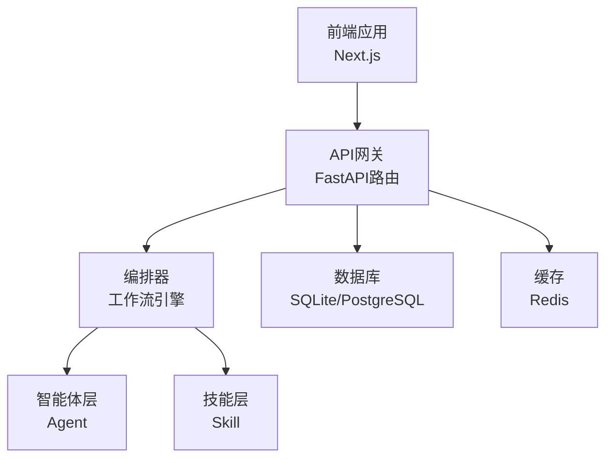
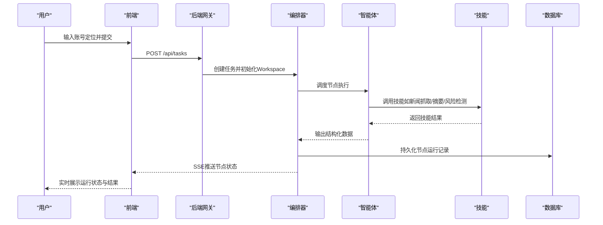
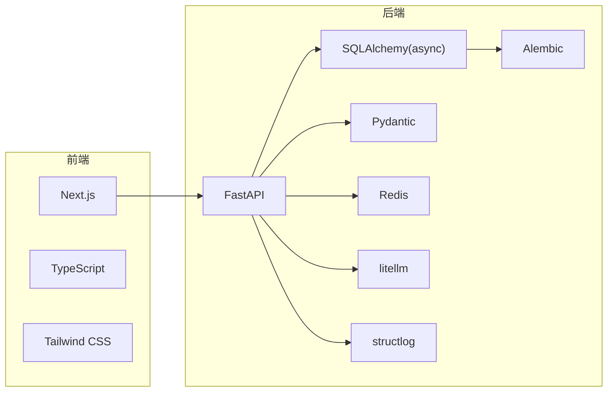

# 工作流程与贡献

<cite>
**本文引用的文件**
- [ARCHITECTURE.md](file://ARCHITECTURE.md)
- [Notice.md](file://Notice.md)
- [ai_readme.md](file://ai_readme.md)
- [frontend/package.json](file://frontend/package.json)
- [frontend/next.config.ts](file://frontend/next.config.ts)
- [frontend/tsconfig.json](file://frontend/tsconfig.json)
- [backend/pyproject.toml](file://backend/pyproject.toml)
- [backend/alembic.ini](file://backend/alembic.ini)
- [backend/alembic/env.py](file://backend/alembic/env.py)
- [backend/app/core/config.py](file://backend/app/core/config.py)
- [OpenClaw-bot-review-main/README.md](file://OpenClaw-bot-review-main/README.md)
- [.gitignore](file://.gitignore)
</cite>

## 目录
1. [引言](#引言)
2. [项目结构](#项目结构)
3. [核心组件](#核心组件)
4. [架构总览](#架构总览)
5. [详细组件分析](#详细组件分析)
6. [依赖分析](#依赖分析)
7. [性能考量](#性能考量)
8. [故障排查指南](#故障排查指南)
9. [结论](#结论)
10. [附录](#附录)

## 引言
本指南面向HotClaw项目的贡献者与维护者，提供一套可执行的工作流程与贡献规范，涵盖：
- Git分支管理策略（主分支保护、功能分支创建、Pull Request流程）
- 代码审查标准（审查清单、反馈处理、合并要求）
- Issue/PR模板与提交信息规范
- 从问题报告到功能实现的完整贡献流程
- 版本发布流程、变更日志维护与向后兼容性考虑
- 社区贡献指南（文档、Bug报告、功能建议）
- 项目治理结构与决策流程

本指南以项目现有架构文档、约束说明与工程配置为依据，确保贡献流程与代码质量、可维护性、可运行性优先。

## 项目结构
HotClaw采用前后端分离架构，后端使用Python/FastAPI，前端使用Next.js，数据库迁移使用Alembic，整体结构清晰、职责分明：
- 前端：Next.js应用，通过rewrites将/api转发至后端服务
- 后端：FastAPI服务，使用异步SQLAlchemy与Alembic管理数据库
- 配置：后端通过Pydantic Settings读取环境变量，支持多Provider LLM配置
- 文档：架构设计与约束说明作为开发与评审的最高准则

图表来源
- [frontend/next.config.ts:1-15](file://frontend/next.config.ts#L1-L15)
- [backend/pyproject.toml:1-41](file://backend/pyproject.toml#L1-L41)
- [backend/alembic.ini:1-39](file://backend/alembic.ini#L1-L39)
- [backend/app/core/config.py:1-99](file://backend/app/core/config.py#L1-L99)

章节来源
- [ARCHITECTURE.md:191-494](file://ARCHITECTURE.md#L191-L494)
- [frontend/next.config.ts:1-15](file://frontend/next.config.ts#L1-L15)
- [backend/pyproject.toml:1-41](file://backend/pyproject.toml#L1-L41)
- [backend/alembic.ini:1-39](file://backend/alembic.ini#L1-L39)
- [backend/app/core/config.py:1-99](file://backend/app/core/config.py#L1-L99)

## 核心组件
- 前端Next.js应用：负责用户交互、实时状态订阅（SSE）、页面路由与可视化展示
- 后端FastAPI服务：统一入口、参数校验、SSE事件推送、任务编排与状态广播
- 编排器（Orchestrator）：按工作流定义调度Agent，管理Workspace上下文，广播节点状态
- 智能体（Agent）：有上下文的决策单元，调用LLM与Skill完成任务
- 技能（Skill）：无状态原子能力，封装具体技术操作（如新闻抓取、摘要、风险检测）
- 数据库与迁移：Alembic管理迁移，支持SQLite与PostgreSQL
- 配置与日志：统一配置加载、结构化日志与追踪

章节来源
- [ARCHITECTURE.md:401-538](file://ARCHITECTURE.md#L401-L538)
- [Notice.md:40-370](file://Notice.md#L40-L370)
- [backend/pyproject.toml:1-41](file://backend/pyproject.toml#L1-L41)
- [backend/alembic/env.py:1-53](file://backend/alembic/env.py#L1-L53)

## 架构总览
HotClaw的系统边界与模块职责清晰，前后端分离，后端通过SSE向前端推送节点状态，前端负责可视化与交互。工作流采用线性链（MVP阶段），未来可扩展为DAG。

图表来源
- [ARCHITECTURE.md:449-494](file://ARCHITECTURE.md#L449-L494)
- [frontend/next.config.ts:1-15](file://frontend/next.config.ts#L1-L15)

章节来源
- [ARCHITECTURE.md:37-78](file://ARCHITECTURE.md#L37-L78)
- [ARCHITECTURE.md:401-538](file://ARCHITECTURE.md#L401-L538)

## 详细组件分析

### Git分支管理策略
- 主分支保护
  - main/master分支受保护，禁止直接推送，必须通过Pull Request合并
  - 合并前要求通过CI检查（构建、测试、静态检查）
- 功能分支创建
  - 基于main/master创建功能分支，命名规范：feat/xxx、fix/xxx、docs/xxx、refactor/xxx
  - 分支命名语义化，与Issue/PR关联，便于追踪
- Pull Request流程
  - PR必须关联Issue，描述变更动机、影响范围与测试要点
  - 至少一名维护者审查通过后方可合并
  - 合并后清理分支，保持仓库整洁

章节来源
- [.gitignore](file://.gitignore)

### 代码审查标准
- 审查清单
  - 是否符合Notice.md与ARCHITECTURE.md的设计约束
  - 是否遵循分层职责（api/services/models/schemas/agents/skills/core）
  - 是否满足结构化输入输出协议与错误处理要求
  - 是否具备必要的测试用例与边界条件覆盖
  - 是否存在硬编码密钥、URL或未来功能提前实现
- 反馈处理
  - 明确标注问题类型（设计、实现、测试、文档）
  - 提供最小修改建议与替代方案
  - 争议问题提交维护小组讨论决定
- 合并要求
  - 通过CI检查
  - 通过至少一名维护者批准
  - 修复所有阻塞性问题

章节来源
- [Notice.md:40-370](file://Notice.md#L40-L370)
- [ARCHITECTURE.md:92-135](file://ARCHITECTURE.md#L92-L135)

### Issue模板与PR模板
- Issue模板
  - 类型：缺陷报告、功能建议、文档改进、性能问题
  - 内容：预期行为、实际行为、复现步骤、环境信息、日志片段
- PR模板
  - 摘要：变更概述与动机
  - 影响范围：对API、配置、数据库的影响
  - 测试方法：新增/修改的测试用例与验证步骤
  - 例外与风险：潜在回归、兼容性问题、安全风险

章节来源
- [Notice.md:373-395](file://Notice.md#L373-L395)

### 提交信息规范
- 规范格式：type(scope): subject
  - 示例：feat(backend): 添加任务状态查询API
- 类型：feat、fix、docs、style、refactor、perf、test、build、ci、chore
- scope：模块或目录（如frontend、backend、agent、skill、db）
- subject：简短描述，不超过50字符，首字母小写，不以点结尾

章节来源
- [Notice.md:373-395](file://Notice.md#L373-L395)

### 贡献流程（从问题到实现）
- 问题报告
  - 在Issue中描述问题背景、复现步骤与期望结果
  - 标注类型与优先级，关联相关模块
- 功能建议
  - 描述场景、收益与可能的实现方案
  - 与架构约束对比，避免偏离MVP目标
- 开发与实现
  - fork仓库，创建功能分支，按规范编写代码与测试
  - 提交PR，填写模板，关联Issue
- 审查与合并
  - 维护者审查，按清单逐项确认
  - CI通过后合并，清理分支

章节来源
- [ai_readme.md:1-24](file://ai_readme.md#L1-L24)
- [Notice.md:40-370](file://Notice.md#L40-L370)

### 版本发布流程
- 版本号策略
  - 遵循语义化版本（主.次.修订），主版本用于破坏性变更
- 发布准备
  - 更新变更日志，汇总重大修复与特性
  - 确认所有测试通过，文档同步更新
- 发布步骤
  - 创建带标签的release分支，打Tag并发布
  - 同步更新包管理器与部署配置
- 回滚策略
  - 保留最近两个版本的发布包，必要时回滚

章节来源
- [backend/pyproject.toml:1-41](file://backend/pyproject.toml#L1-L41)

### 变更日志维护与向后兼容性
- 变更日志
  - 按版本记录新增、修复、废弃与破坏性变更
  - 提供迁移指引与兼容性说明
- 向后兼容性
  - 避免删除公开API与破坏性变更
  - 通过配置或兼容层过渡，逐步淘汰旧接口

章节来源
- [Notice.md:373-395](file://Notice.md#L373-L395)

### 社区贡献指南
- 文档贡献
  - 遵循现有文档风格与术语，补充架构说明、最佳实践与FAQ
- Bug报告
  - 提供最小可复现示例、环境信息与日志
- 功能建议
  - 与项目目标对齐，避免偏离MVP范围
- 开放讨论
  - 重要设计决策通过Issue或维护会议讨论决定

章节来源
- [OpenClaw-bot-review-main/README.md:1-176](file://OpenClaw-bot-review-main/README.md#L1-L176)
- [Notice.md:40-370](file://Notice.md#L40-L370)

### 项目治理结构与决策流程
- 维护者职责
  - 审查PR、把控质量与一致性、推动文档与测试完善
- 决策流程
  - 常规变更：维护者批准即可
  - 重大变更：Issue讨论、达成共识后实施
- 治理透明度
  - 所有决策与变更记录在Issue/PR中，便于追溯

章节来源
- [Notice.md:40-370](file://Notice.md#L40-L370)

## 依赖分析
- 前端依赖
  - Next.js、TypeScript、Tailwind CSS、React生态
  - 通过rewrites将/api转发至后端
- 后端依赖
  - FastAPI、SQLAlchemy(async)、Alembic、Pydantic、Redis、litellm、structlog
  - 通过配置模块加载环境变量，支持多Provider LLM
- 数据库与迁移
  - 支持SQLite与PostgreSQL，Alembic异步迁移

图表来源
- [frontend/package.json:1-23](file://frontend/package.json#L1-L23)
- [backend/pyproject.toml:1-41](file://backend/pyproject.toml#L1-L41)

章节来源
- [frontend/package.json:1-23](file://frontend/package.json#L1-L23)
- [backend/pyproject.toml:1-41](file://backend/pyproject.toml#L1-L41)
- [backend/alembic.ini:1-39](file://backend/alembic.ini#L1-L39)
- [backend/alembic/env.py:1-53](file://backend/alembic/env.py#L1-L53)
- [backend/app/core/config.py:1-99](file://backend/app/core/config.py#L1-L99)

## 性能考量
- 实时性
  - SSE推送节点状态，前端独立消费，降低耦合
- 并发与超时
  - 为外部调用设置超时，避免阻塞
- 缓存与降级
  - 使用Redis缓存热点数据，节点失败时启用降级策略
- 数据库
  - 异步SQLAlchemy与合理索引，避免长事务

章节来源
- [ARCHITECTURE.md:325-360](file://ARCHITECTURE.md#L325-L360)
- [Notice.md:316-340](file://Notice.md#L316-L340)
- [backend/app/core/config.py:79-82](file://backend/app/core/config.py#L79-L82)

## 故障排查指南
- 前端无法访问后端API
  - 检查rewrites配置是否指向正确的后端地址
  - 确认后端服务已启动且端口开放
- 任务运行无状态更新
  - 检查SSE事件推送与前端订阅逻辑
  - 查看后端日志与任务追踪ID
- 数据库连接问题
  - 检查数据库URL与凭据，确认Alembic迁移执行
- LLM调用失败
  - 检查Provider配置、API Key与网络连通性
  - 设置合理的超时与重试策略

章节来源
- [frontend/next.config.ts:1-15](file://frontend/next.config.ts#L1-L15)
- [backend/alembic.ini:1-39](file://backend/alembic.ini#L1-L39)
- [backend/app/core/config.py:52-99](file://backend/app/core/config.py#L52-L99)
- [Notice.md:316-340](file://Notice.md#L316-L340)

## 结论
本指南以架构文档与约束说明为基础，建立了覆盖分支管理、审查标准、模板规范、贡献流程、发布与治理的完整工作流。遵循此流程可确保代码质量、可维护性与可运行性优先，支撑HotClaw从MVP到扩展版本的持续演进。

## 附录
- 相关参考文件
  - 架构设计与核心理念：[ARCHITECTURE.md](file://ARCHITECTURE.md)
  - 开发约束与协议：[Notice.md](file://Notice.md)
  - AI开发注意事项：[ai_readme.md](file://ai_readme.md)
  - 前端工程配置：[frontend/package.json](file://frontend/package.json)
  - 前端路由与API转发：[frontend/next.config.ts](file://frontend/next.config.ts)
  - 前端TypeScript配置：[frontend/tsconfig.json](file://frontend/tsconfig.json)
  - 后端依赖与测试配置：[backend/pyproject.toml](file://backend/pyproject.toml)
  - 数据库迁移配置：[backend/alembic.ini](file://backend/alembic.ini)
  - Alembic异步迁移环境：[backend/alembic/env.py](file://backend/alembic/env.py)
  - 后端配置加载：[backend/app/core/config.py](file://backend/app/core/config.py)
  - 相关项目参考（OpenClaw仪表盘）：[OpenClaw-bot-review-main/README.md](file://OpenClaw-bot-review-main/README.md)