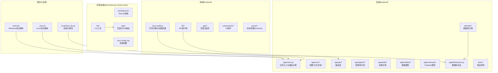
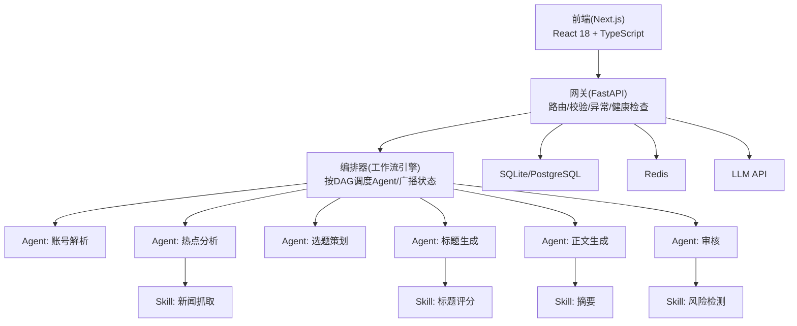
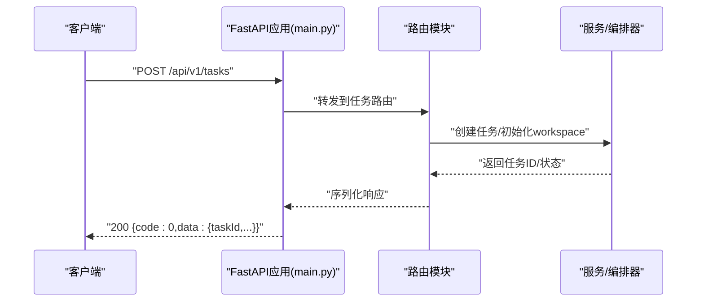
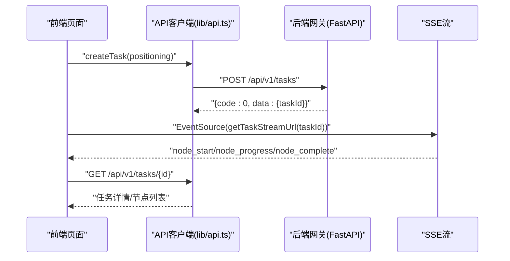
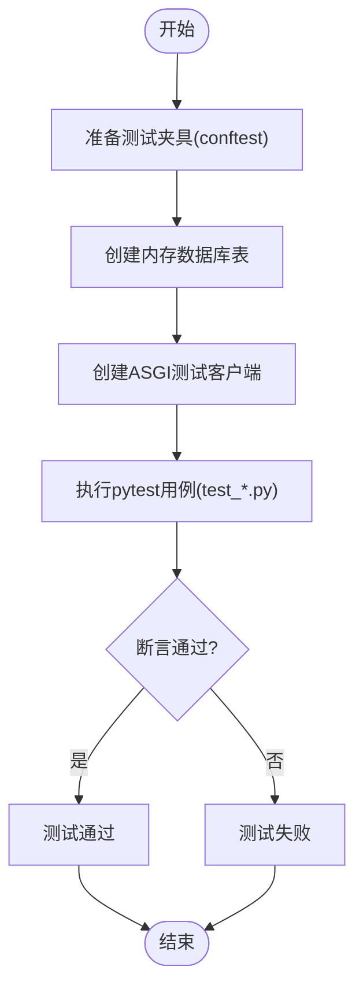
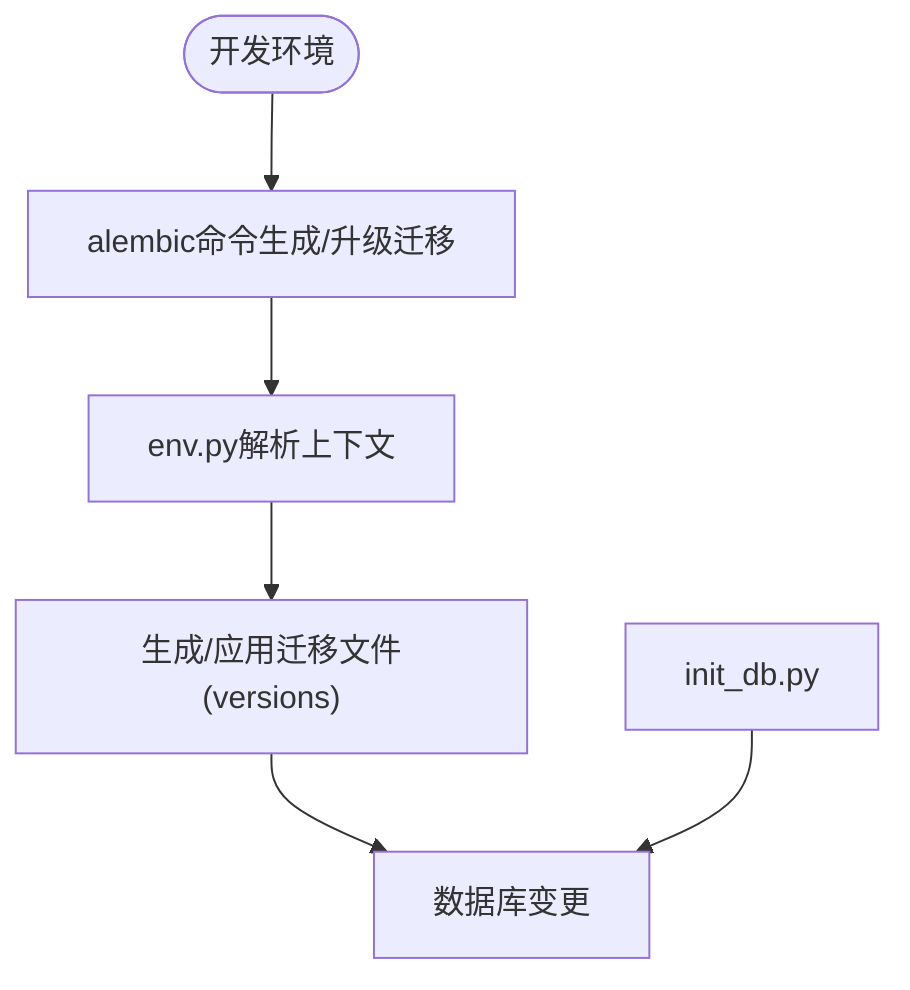
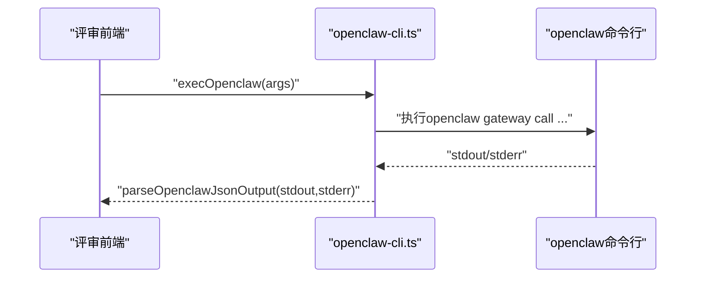
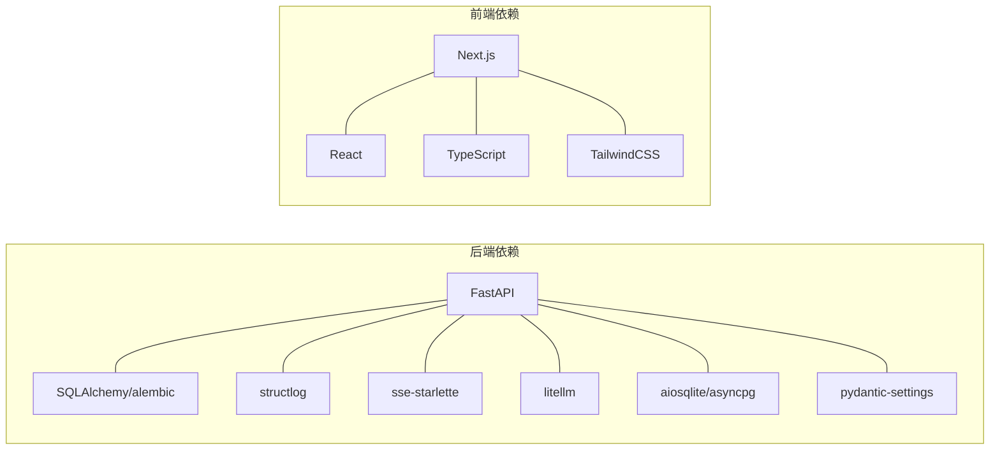

# 开发指南

<cite>
**本文引用的文件**
- [ARCHITECTURE.md](file://ARCHITECTURE.md)
- [backend/pyproject.toml](file://backend/pyproject.toml)
- [frontend/package.json](file://frontend/package.json)
- [OpenClaw-bot-review-main/package.json](file://OpenClaw-bot-review-main/package.json)
- [backend/app/main.py](file://backend/app/main.py)
- [frontend/next.config.ts](file://frontend/next.config.ts)
- [OpenClaw-bot-review-main/next.config.mjs](file://OpenClaw-bot-review-main/next.config.mjs)
- [backend/tests/conftest.py](file://backend/tests/conftest.py)
- [backend/tests/test_agent_api.py](file://backend/tests/test_agent_api.py)
- [backend/tests/test_task_api.py](file://backend/tests/test_task_api.py)
- [backend/app/core/config.py](file://backend/app/core/config.py)
- [backend/app/core/logger.py](file://backend/app/core/logger.py)
- [frontend/lib/api.ts](file://frontend/lib/api.ts)
- [OpenClaw-bot-review-main/lib/openclaw-cli.ts](file://OpenClaw-bot-review-main/lib/openclaw-cli.ts)
- [backend/alembic/env.py](file://backend/alembic/env.py)
- [backend/alembic/script.py.mako](file://backend/alembic/script.py.mako)
- [backend/alembic/versions/](file://backend/alembic/versions/)
- [scripts/init_db.py](file://scripts/init_db.py)
- [start.sh](file://start.sh)
- [start.bat](file://start.bat)
- [.gitignore](file://.gitignore)
</cite>

## 目录
1. [简介](#简介)
2. [项目结构](#项目结构)
3. [核心组件](#核心组件)
4. [架构总览](#架构总览)
5. [详细组件分析](#详细组件分析)
6. [依赖分析](#依赖分析)
7. [性能考量](#性能考量)
8. [故障排查指南](#故障排查指南)
9. [结论](#结论)
10. [附录](#附录)

## 简介
本开发指南面向HotClaw项目的贡献者与核心开发者，提供从环境搭建、代码规范、测试策略、调试技巧到分支与提交规范的全流程开发指导。HotClaw是一个“多智能体公众号爆文编辑部平台”，采用前后端分离架构：前端使用React 18 + TypeScript + Next.js，后端使用FastAPI + Python 3.11+，并通过SSE实现实时状态推送。系统通过“Agent（智能体）+ Skill（技能）”的组合实现从热点抓取、选题策划、标题生成、正文撰写到审核风控的全链路内容生产。

## 项目结构
项目采用多子目录组织，包含后端Python应用、前端Next.js应用、OpenClaw评审相关前端、数据库迁移脚本与资源包等。

图表来源
- [backend/app/main.py:1-142](file://backend/app/main.py#L1-L142)
- [frontend/next.config.ts:1-15](file://frontend/next.config.ts#L1-L15)
- [OpenClaw-bot-review-main/next.config.mjs:1-6](file://OpenClaw-bot-review-main/next.config.mjs#L1-L6)
- [backend/alembic/env.py](file://backend/alembic/env.py)
- [scripts/init_db.py](file://scripts/init_db.py)
- [start.sh](file://start.sh)
- [start.bat](file://start.bat)

章节来源
- [ARCHITECTURE.md:191-290](file://ARCHITECTURE.md#L191-L290)
- [backend/app/main.py:1-142](file://backend/app/main.py#L1-L142)
- [frontend/next.config.ts:1-15](file://frontend/next.config.ts#L1-L15)
- [OpenClaw-bot-review-main/next.config.mjs:1-6](file://OpenClaw-bot-review-main/next.config.mjs#L1-L6)

## 核心组件
- 应用入口与路由
  - 后端FastAPI应用在入口文件中注册CORS、全局中间件、异常处理器，并挂载各模块路由。
  - 前端Next.js通过rewrites将/api前缀代理到后端地址，便于本地联调。
- 配置与日志
  - 后端使用Pydantic Settings加载环境变量，支持数据库、Redis、LLM、应用运行参数与超时配置。
  - 日志采用structlog结构化输出，统一格式与级别。
- 测试基础
  - 使用pytest + pytest-asyncio，测试客户端通过ASGI传输与内存数据库驱动，确保异步与数据库一致性。
- 数据库迁移
  - 使用Alembic进行数据库版本管理，提供env与script模板，版本迁移文件位于versions目录。

章节来源
- [backend/app/main.py:60-142](file://backend/app/main.py#L60-L142)
- [backend/app/core/config.py:1-51](file://backend/app/core/config.py#L1-L51)
- [backend/app/core/logger.py:1-36](file://backend/app/core/logger.py#L1-L36)
- [backend/tests/conftest.py:1-48](file://backend/tests/conftest.py#L1-L48)
- [backend/alembic/env.py](file://backend/alembic/env.py)

## 架构总览
HotClaw采用前后端分离架构：前端负责可视化与交互，后端负责Agent编排与业务逻辑，通过SSE推送任务状态。核心模块包括网关层、编排器、Agent层、Skill层与基础设施层。

图表来源
- [ARCHITECTURE.md:37-78](file://ARCHITECTURE.md#L37-L78)
- [ARCHITECTURE.md:496-538](file://ARCHITECTURE.md#L496-L538)
- [ARCHITECTURE.md:635-759](file://ARCHITECTURE.md#L635-L759)

## 详细组件分析

### 后端应用入口与路由
- 生命周期与中间件
  - 应用启动时初始化日志、注册Agent、创建数据库表；关闭时记录shutdown日志。
  - 添加CORS中间件，设置trace_id HTTP头，增强可观测性。
- 异常处理
  - 定义统一异常映射，将业务错误码转换为HTTP状态码；对未捕获异常返回统一错误响应。
- 路由注册
  - 包含任务、流式SSE、Agent、Skill等路由模块。

图表来源
- [backend/app/main.py:132-142](file://backend/app/main.py#L132-L142)
- [backend/tests/test_task_api.py:7-19](file://backend/tests/test_task_api.py#L7-L19)

章节来源
- [backend/app/main.py:42-142](file://backend/app/main.py#L42-L142)
- [backend/tests/test_task_api.py:1-57](file://backend/tests/test_task_api.py#L1-L57)

### 前端API客户端与SSE订阅
- API客户端
  - 封装通用请求函数，统一处理响应码与错误抛出；提供任务创建、详情、节点列表、Agent/Skill配置等方法。
- SSE订阅
  - 通过getTaskStreamUrl获取SSE流地址，前端使用EventSource消费节点状态事件，实现可视化运行链路。

图表来源
- [frontend/lib/api.ts:14-50](file://frontend/lib/api.ts#L14-L50)
- [ARCHITECTURE.md:325-360](file://ARCHITECTURE.md#L325-L360)

章节来源
- [frontend/lib/api.ts:1-110](file://frontend/lib/api.ts#L1-L110)
- [ARCHITECTURE.md:325-360](file://ARCHITECTURE.md#L325-L360)

### 测试策略与框架使用
- 单元测试
  - 使用pytest与pytest-asyncio，覆盖Agent与Task API的正常与异常场景。
- 集成测试
  - 通过conftest中的内存数据库与ASGI客户端，模拟真实HTTP请求与依赖注入覆盖，保证路由与服务层行为正确。
- 端到端测试
  - 建议在前端增加E2E用例，覆盖从输入账号定位到结果页的完整流程；可在CI中使用Playwright/Cypress等工具补充。

图表来源
- [backend/tests/conftest.py:20-48](file://backend/tests/conftest.py#L20-L48)
- [backend/tests/test_agent_api.py:7-28](file://backend/tests/test_agent_api.py#L7-L28)
- [backend/tests/test_task_api.py:7-57](file://backend/tests/test_task_api.py#L7-L57)

章节来源
- [backend/tests/conftest.py:1-48](file://backend/tests/conftest.py#L1-L48)
- [backend/tests/test_agent_api.py:1-28](file://backend/tests/test_agent_api.py#L1-L28)
- [backend/tests/test_task_api.py:1-57](file://backend/tests/test_task_api.py#L1-L57)

### 数据库迁移与初始化
- Alembic配置
  - env.py提供迁移上下文与目标元数据；script模板定义迁移脚本生成规则；versions目录存放版本化迁移文件。
- 初始化脚本
  - init_db.py可用于开发环境快速初始化数据库结构。

图表来源
- [backend/alembic/env.py](file://backend/alembic/env.py)
- [backend/alembic/script.py.mako](file://backend/alembic/script.py.mako)
- [scripts/init_db.py](file://scripts/init_db.py)

章节来源
- [backend/alembic/env.py](file://backend/alembic/env.py)
- [backend/alembic/script.py.mako](file://backend/alembic/script.py.mako)
- [scripts/init_db.py](file://scripts/init_db.py)

### OpenClaw评审前端CLI工具
- CLI封装
  - 提供跨平台命令执行、JSON解析与哈希计算工具，便于与OpenClaw网关交互。
- 使用场景
  - 在评审前端中调用openclaw命令行工具，解析输出并进行后续处理。

图表来源
- [OpenClaw-bot-review-main/lib/openclaw-cli.ts:13-109](file://OpenClaw-bot-review-main/lib/openclaw-cli.ts#L13-L109)

章节来源
- [OpenClaw-bot-review-main/lib/openclaw-cli.ts:1-109](file://OpenClaw-bot-review-main/lib/openclaw-cli.ts#L1-L109)

## 依赖分析
- 后端依赖
  - FastAPI、Uvicorn、SQLAlchemy 2.0 + alembic、Pydantic、Redis、httpx、structlog、sse-starlette、litellm、aiosqlite等。
  - 开发依赖包含pytest、pytest-asyncio、httpx。
- 前端依赖
  - Next.js、React、TypeScript、TailwindCSS、@types/*等。
- 评审前端依赖
  - Next.js、React、TypeScript、TailwindCSS等。

图表来源
- [backend/pyproject.toml:1-41](file://backend/pyproject.toml#L1-L41)
- [frontend/package.json:1-23](file://frontend/package.json#L1-L23)
- [OpenClaw-bot-review-main/package.json:1-23](file://OpenClaw-bot-review-main/package.json#L1-L23)

章节来源
- [backend/pyproject.toml:1-41](file://backend/pyproject.toml#L1-L41)
- [frontend/package.json:1-23](file://frontend/package.json#L1-L23)
- [OpenClaw-bot-review-main/package.json:1-23](file://OpenClaw-bot-review-main/package.json#L1-L23)

## 性能考量
- SSE推送
  - 使用sse-starlette与EventSource，避免WebSocket复杂度；注意前端连接数与后端广播频率，避免过多节点同时触发事件。
- 数据库与缓存
  - 使用aiosqlite进行内存测试，生产环境使用PostgreSQL；Redis用于缓存与速率限制；合理设置超时与连接池大小。
- LLM调用
  - 使用litellm统一多模型调用，配置合理的超时与重试策略；对长文本处理使用摘要Skill降低Token消耗。
- 前端渲染
  - 使用Next.js静态与增量构建，Tailwind按需引入；对Markdown预览使用轻量渲染库，避免大文档导致的主线程阻塞。

## 故障排查指南
- 健康检查
  - 后端提供健康检查端点，用于确认服务可用性。
- 日志与追踪
  - structlog结构化日志，结合trace_id中间件，便于跨服务定位问题。
- 数据库迁移
  - 若出现表结构不一致，使用Alembic升级/降级迁移；开发环境可使用init_db.py快速重建。
- 前后端联调
  - 前端next.config.ts将/api代理至后端地址，若无法访问，检查代理配置与后端监听地址。

章节来源
- [backend/app/main.py:139-142](file://backend/app/main.py#L139-L142)
- [backend/app/core/logger.py:8-36](file://backend/app/core/logger.py#L8-L36)
- [frontend/next.config.ts:3-12](file://frontend/next.config.ts#L3-L12)
- [backend/alembic/env.py](file://backend/alembic/env.py)
- [scripts/init_db.py](file://scripts/init_db.py)

## 结论
本指南提供了HotClaw项目的开发全流程指导，涵盖架构理解、组件实现、测试策略、调试技巧与性能优化。建议在开发过程中遵循统一的代码规范与提交规范，配合完善的测试与可观测性，持续提升系统的稳定性与可维护性。

## 附录

### 开发环境搭建与配置
- 后端
  - Python 3.11+，安装依赖与开发依赖；配置数据库URL、Redis、LLM参数；使用uvicorn启动服务。
- 前端
  - 安装依赖后使用next dev启动；通过rewrites将/api代理到后端；构建与启动命令见package.json。
- 评审前端
  - 依赖与构建配置见其package.json与next.config.mjs。
- 启动脚本
  - Linux使用start.sh，Windows使用start.bat，分别启动前后端服务。

章节来源
- [backend/pyproject.toml:1-41](file://backend/pyproject.toml#L1-L41)
- [frontend/package.json:1-23](file://frontend/package.json#L1-L23)
- [OpenClaw-bot-review-main/package.json:1-23](file://OpenClaw-bot-review-main/package.json#L1-L23)
- [OpenClaw-bot-review-main/next.config.mjs:1-6](file://OpenClaw-bot-review-main/next.config.mjs#L1-L6)
- [start.sh](file://start.sh)
- [start.bat](file://start.bat)

### 代码规范与最佳实践
- Python编码规范
  - 使用pyproject.toml集中管理依赖与pytest配置；遵循PEP 8，模块命名与导入清晰；使用Pydantic v2进行数据校验。
- TypeScript开发规范
  - 使用TypeScript强类型约束；API客户端统一错误处理；组件拆分与状态管理使用Zustand。
- Git工作流程
  - 建议采用分支策略：main作为保护分支，feature分支用于功能开发，release分支用于版本合并；提交信息遵循约定式提交。

### 测试策略与编写方法
- 单元测试
  - 使用pytest-asyncio编写异步测试；利用conftest提供的内存数据库与ASGI客户端。
- 集成测试
  - 覆盖路由、服务层与数据库交互；重点验证Agent与Task API的输入输出与错误码。
- 端到端测试
  - 建议在前端补充E2E用例，覆盖完整用户旅程。

### 调试技巧与工具使用
- IDE配置
  - VSCode/IntelliJ IDEA启用TypeScript/Python插件；配置断点与调试任务。
- 断点调试
  - 后端使用uvicorn调试模式；前端使用浏览器开发者工具与React DevTools。
- 性能分析
  - 使用Python cProfile与py-spy；前端使用浏览器性能面板与React Profiler。

### 代码审查标准、提交规范与分支管理
- 代码审查
  - 关注架构一致性、异常处理、日志与安全；确保测试覆盖与文档更新。
- 提交规范
  - 使用约定式提交（feat/fix/docs/chore等），简明描述变更内容。
- 分支管理
  - feature/*用于功能开发；release/*用于版本发布；hotfix/*用于紧急修复。