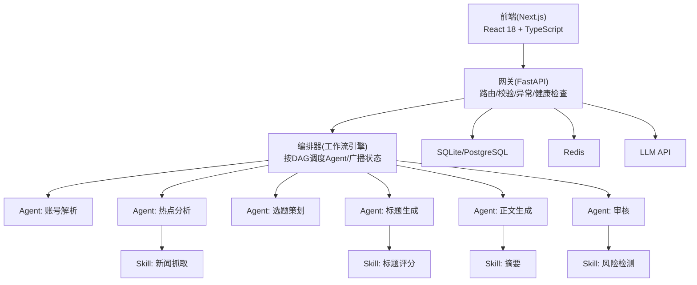
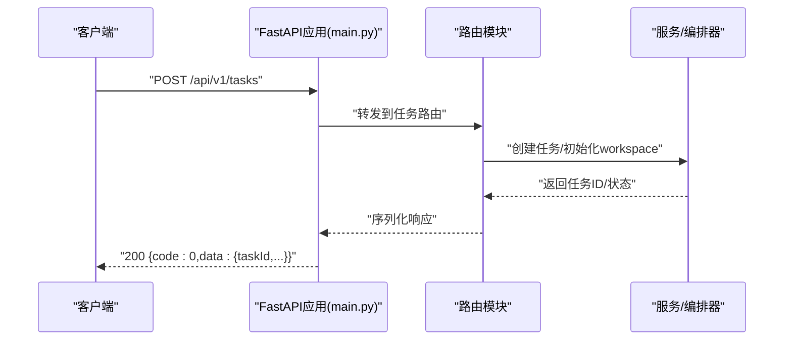
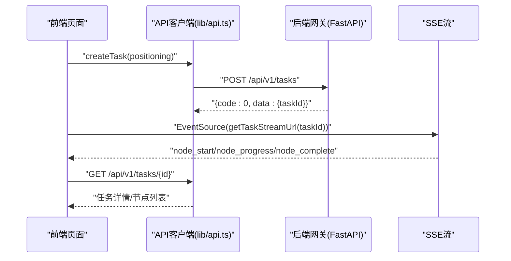
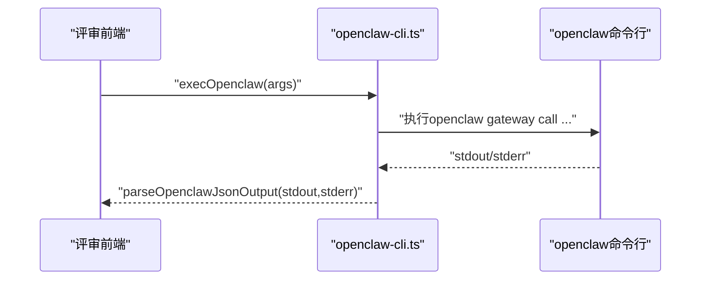
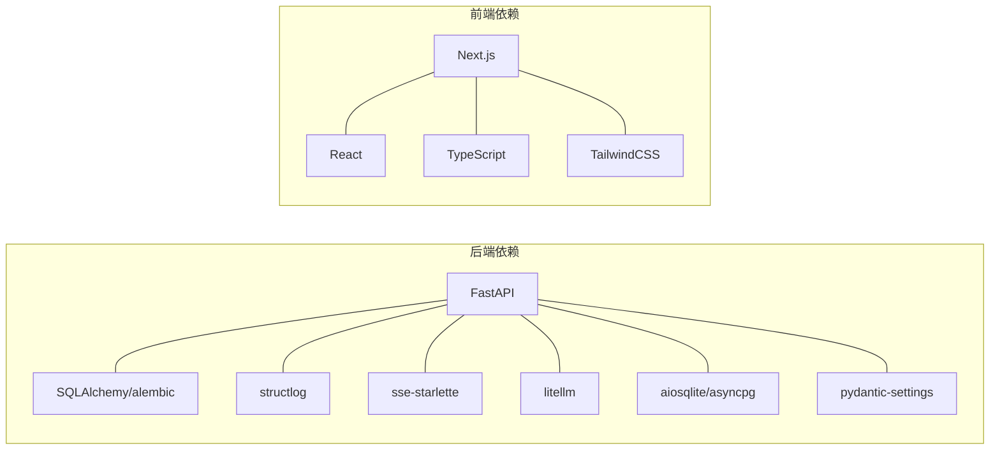

# 开发指南

<cite>
**本文档引用的文件**
- [PROJECT_STRUCTURE.md](file://PROJECT_STRUCTURE.md)
- [ARCHITECTURE.md](file://ARCHITECTURE.md)
- [backend/pyproject.toml](file://backend/pyproject.toml)
- [frontend/package.json](file://frontend/package.json)
- [OpenClaw-bot-review-main/package.json](file://OpenClaw-bot-review-main/package.json)
- [backend/app/main.py](file://backend/app/main.py)
- [frontend/next.config.ts](file://frontend/next.config.ts)
- [OpenClaw-bot-review-main/next.config.mjs](file://OpenClaw-bot-review-main/next.config.mjs)
- [backend/tests/conftest.py](file://backend/tests/conftest.py)
- [backend/tests/test_agent_api.py](file://backend/tests/test_agent_api.py)
- [backend/tests/test_task_api.py](file://backend/tests/test_task_api.py)
- [backend/app/core/config.py](file://backend/app/core/config.py)
- [backend/app/core/logger.py](file://backend/app/core/logger.py)
- [frontend/lib/api.ts](file://frontend/lib/api.ts)
- [OpenClaw-bot-review-main/lib/openclaw-cli.ts](file://OpenClaw-bot-review-main/lib/openclaw-cli.ts)
- [backend/alembic/env.py](file://backend/alembic/env.py)
- [backend/alembic/script.py.mako](file://backend/alembic/script.py.mako)
- [backend/alembic/versions/](file://backend/alembic/versions/)
- [scripts/init_db.py](file://scripts/init_db.py)
- [start.sh](file://start.sh)
- [start.bat](file://start.bat)
- [backend/alembic.ini](file://backend/alembic.ini)
- [backend/app/core/exceptions.py](file://backend/app/core/exceptions.py)
- [backend/app/orchestrator/engine.py](file://backend/app/orchestrator/engine.py)
- [backend/app/orchestrator/broadcaster.py](file://backend/app/orchestrator/broadcaster.py)
- [backend/app/orchestrator/workspace.py](file://backend/app/orchestrator/workspace.py)
- [backend/app/llm/gateway.py](file://backend/app/llm/gateway.py)
- [backend/app/llm/providers/](file://backend/app/llm/providers/)
- [frontend/next.config.ts](file://frontend/next.config.ts)
- [frontend/lib/api.ts](file://frontend/lib/api.ts)
- [frontend/hooks/useTaskSSE.ts](file://frontend/hooks/useTaskSSE.ts)
- [frontend/components/command-center/CommandCenter.tsx](file://frontend/components/command-center/CommandCenter.tsx)
- [frontend/components/command-center/AgentNode.tsx](file://frontend/components/command-center/AgentNode.tsx)
- [frontend/components/command-center/HoloLines.tsx](file://frontend/components/command-center/HoloLines.tsx)
- [frontend/components/command-center/CentralConsole.tsx](file://frontend/components/command-center/CentralConsole.tsx)
- [frontend/components/command-center/MissionStatusBar.tsx](file://frontend/components/command-center/MissionStatusBar.tsx)
- [frontend/components/command-center/AgentDetailModal.tsx](file://frontend/components/command-center/AgentDetailModal.tsx)
</cite>

## 更新摘要
**所做更改**
- 更新Python版本要求：从3.12+调整为3.11+
- 扩展测试文档：新增后端pytest测试详细说明、前端构建和类型检查流程
- 完善开发环境设置：提供更清晰的环境搭建指导和依赖管理说明
- 增强测试策略：详细说明单元测试、集成测试和端到端测试的编写方法

## 目录
1. [简介](#简介)
2. [项目结构](#项目结构)
3. [核心组件](#核心组件)
4. [架构总览](#架构总览)
5. [详细组件分析](#详细组件分析)
6. [开发工具说明](#开发工具说明)
7. [依赖分析](#依赖分析)
8. [性能考量](#性能考量)
9. [故障排查指南](#故障排查指南)
10. [结论](#结论)
11. [附录](#附录)

## 简介
本开发指南面向HotClaw项目的贡献者与核心开发者，提供从环境搭建、代码规范、测试策略、调试技巧到分支与提交规范的全流程开发指导。HotClaw是一个"多智能体公众号爆文编辑部平台"，采用前后端分离架构：前端使用React 18 + TypeScript + Next.js，后端使用FastAPI + Python 3.11+，并通过SSE实现实时状态推送。系统通过"Agent（智能体）+ Skill（技能）"的组合实现从热点抓取、选题策划、标题生成、正文撰写到审核风控的全链路内容生产。

**更新** Python版本要求已从3.12+调整为3.11+，以提高兼容性和部署灵活性。

## 项目结构
HotClaw项目采用多层级目录组织结构，包含后端Python应用、前端Next.js应用、OpenClaw评审相关前端、数据库迁移脚本与资源包等。项目结构体现了清晰的分层架构和模块化设计。

```mermaid
graph TB
subgraph "后端(backend)"
A_main["app/main.py<br/>应用入口与路由注册"]
A_core["app/core/*<br/>配置/日志/异常"]
A_api["app/api/*<br/>路由层"]
A_agents["app/agents/*<br/>智能体实现"]
A_skills["app/skills/*<br/>技能实现"]
A_models["app/models/*<br/>数据模型"]
A_schemas["app/schemas/*<br/>Pydantic模型"]
A_db["app/db/session.py<br/>数据库会话"]
A_tests["tests/*<br/>测试用例"]
A_alembic["alembic/*<br/>数据库迁移"]
A_orchestrator["app/orchestrator/*<br/>工作流编排引擎"]
A_llm["app/llm/*<br/>LLM统一网关"]
end
subgraph "前端(frontend)"
F_next["next.config.ts<br/>开发代理与构建配置"]
F_lib["lib/*<br/>API客户端"]
F_app["app/*<br/>页面与组件"]
F_components["components/command-center/*<br/>深空指挥舱界面"]
F_hooks["hooks/*<br/>自定义Hook"]
F_store["store/*<br/>Zustand状态管理"]
end
subgraph "评审前端(OpenClaw-bot-review-main)"
O_pkg["package.json<br/>Next.js依赖"]
O_next["next.config.mjs<br/>构建配置"]
O_lib["lib/*<br/>CLI工具"]
O_app["app/*<br/>页面与API路由"]
end
subgraph "脚本与资源"
S_init["scripts/init_db.py<br/>初始化脚本"]
S_start_sh["start.sh<br/>Linux启动脚本"]
S_start_bat["start.bat<br/>Windows启动脚本"]
R_structure["PROJECT_STRUCTURE.md<br/>项目结构文档"]
R_architecture["ARCHITECTURE.md<br/>架构设计文档"]
end
F_next --> A_main
F_lib --> A_api
O_lib --> O_app
A_alembic --> A_db
S_init --> A_db
S_start_sh --> A_main
S_start_bat --> A_main
R_structure --> A_main
R_architecture --> A_main
```

**章节来源**
- [PROJECT_STRUCTURE.md:29-64](file://PROJECT_STRUCTURE.md#L29-L64)
- [backend/app/main.py:1-214](file://backend/app/main.py#L1-L214)
- [frontend/next.config.ts:1-15](file://frontend/next.config.ts#L1-L15)
- [OpenClaw-bot-review-main/next.config.mjs:1-6](file://OpenClaw-bot-review-main/next.config.mjs#L1-L6)

## 核心组件
HotClaw的核心组件包括应用入口与路由、配置与日志系统、测试基础、数据库迁移以及智能体编排引擎等关键模块。

- **应用入口与路由**
  - 后端FastAPI应用在入口文件中注册CORS、全局中间件、异常处理器，并挂载各模块路由。
  - 前端Next.js通过rewrites将/api前缀代理到后端地址，便于本地联调。
- **配置与日志**
  - 后端使用Pydantic Settings加载环境变量，支持数据库、Redis、LLM、应用运行参数与超时配置。
  - 日志采用structlog结构化输出，统一格式与级别。
- **测试基础**
  - 使用pytest + pytest-asyncio，测试客户端通过ASGI传输与内存数据库驱动，确保异步与数据库一致性。
- **数据库迁移**
  - 使用Alembic进行数据库版本管理，提供env与script模板，版本迁移文件位于versions目录。
- **智能体编排引擎**
  - 工作流编排器按DAG调度Agent，管理workspace上下文，实现节点状态广播与异常处理。

**章节来源**
- [backend/app/main.py:60-142](file://backend/app/main.py#L60-L142)
- [backend/app/core/config.py:1-166](file://backend/app/core/config.py#L1-L166)
- [backend/app/core/logger.py:1-97](file://backend/app/core/logger.py#L1-L97)
- [backend/tests/conftest.py:1-48](file://backend/tests/conftest.py#L1-L48)
- [backend/alembic/env.py](file://backend/alembic/env.py)

## 架构总览
HotClaw采用前后端分离架构：前端负责可视化与交互，后端负责Agent编排与业务逻辑，通过SSE推送任务状态。核心模块包括网关层、编排器、Agent层、Skill层与基础设施层。

**图表来源**
- [ARCHITECTURE.md:37-78](file://ARCHITECTURE.md#L37-L78)
- [ARCHITECTURE.md:496-538](file://ARCHITECTURE.md#L496-L538)
- [ARCHITECTURE.md:635-759](file://ARCHITECTURE.md#L635-L759)

## 详细组件分析

### 后端应用入口与路由
- **生命周期与中间件**
  - 应用启动时初始化日志、注册Agent、创建数据库表；关闭时记录shutdown日志。
  - 添加CORS中间件，设置trace_id HTTP头，增强可观测性。
- **异常处理**
  - 定义统一异常映射，将业务错误码转换为HTTP状态码；对未捕获异常返回统一错误响应。
- **路由注册**
  - 包含任务、流式SSE、Agent、Skill等路由模块。

**图表来源**
- [backend/app/main.py:132-142](file://backend/app/main.py#L132-L142)
- [backend/tests/test_task_api.py:7-19](file://backend/tests/test_task_api.py#L7-L19)

**章节来源**
- [backend/app/main.py:42-142](file://backend/app/main.py#L42-L142)
- [backend/tests/test_task_api.py:1-57](file://backend/tests/test_task_api.py#L1-L57)

### 前端API客户端与SSE订阅
- **API客户端**
  - 封装通用请求函数，统一处理响应码与错误抛出；提供任务创建、详情、节点列表、Agent/Skill配置等方法。
- **SSE订阅**
  - 通过getTaskStreamUrl获取SSE流地址，前端使用EventSource消费节点状态事件，实现可视化运行链路。

**图表来源**
- [frontend/lib/api.ts:14-50](file://frontend/lib/api.ts#L14-L50)
- [ARCHITECTURE.md:325-360](file://ARCHITECTURE.md#L325-L360)

**章节来源**
- [frontend/lib/api.ts:1-110](file://frontend/lib/api.ts#L1-L110)
- [ARCHITECTURE.md:325-360](file://ARCHITECTURE.md#L325-L360)

### 测试策略与框架使用
- **单元测试**
  - 使用pytest与pytest-asyncio，覆盖Agent与Task API的正常与异常场景。
- **集成测试**
  - 通过conftest中的内存数据库与ASGI客户端，模拟真实HTTP请求与依赖注入覆盖，保证路由与服务层行为正确。
- **端到端测试**
  - 建议在前端增加E2E用例，覆盖从输入账号定位到结果页的完整流程；可在CI中使用Playwright/Cypress等工具补充。

**图表来源**
- [backend/tests/conftest.py:20-48](file://backend/tests/conftest.py#L20-L48)
- [backend/tests/test_agent_api.py:7-28](file://backend/tests/test_agent_api.py#L7-L28)
- [backend/tests/test_task_api.py:7-57](file://backend/tests/test_task_api.py#L7-L57)

**章节来源**
- [backend/tests/conftest.py:1-48](file://backend/tests/conftest.py#L1-L48)
- [backend/tests/test_agent_api.py:1-28](file://backend/tests/test_agent_api.py#L1-L28)
- [backend/tests/test_task_api.py:1-57](file://backend/tests/test_task_api.py#L1-L57)

### 数据库迁移与初始化
- **Alembic配置**
  - env.py提供迁移上下文与目标元数据；script模板定义迁移脚本生成规则；versions目录存放版本化迁移文件。
- **初始化脚本**
  - init_db.py可用于开发环境快速初始化数据库结构。

**图表来源**
- [backend/alembic/env.py](file://backend/alembic/env.py)
- [backend/alembic/script.py.mako](file://backend/alembic/script.py.mako)
- [scripts/init_db.py](file://scripts/init_db.py)

**章节来源**
- [backend/alembic/env.py](file://backend/alembic/env.py)
- [backend/alembic/script.py.mako](file://backend/alembic/script.py.mako)
- [scripts/init_db.py](file://scripts/init_db.py)

### OpenClaw评审前端CLI工具
- **CLI封装**
  - 提供跨平台命令执行、JSON解析与哈希计算工具，便于与OpenClaw网关交互。
- **使用场景**
  - 在评审前端中调用openclaw命令行工具，解析输出并进行后续处理。

**图表来源**
- [OpenClaw-bot-review-main/lib/openclaw-cli.ts:13-109](file://OpenClaw-bot-review-main/lib/openclaw-cli.ts#L13-L109)

**章节来源**
- [OpenClaw-bot-review-main/lib/openclaw-cli.ts:1-109](file://OpenClaw-bot-review-main/lib/openclaw-cli.ts#L1-L109)

## 开发工具说明

### 配置管理系统
HotClaw采用Pydantic v2的BaseSettings进行配置管理，支持环境变量、.env文件和代码默认值的多层配置。

- **配置优先级**
  - 数据库自定义配置 > .env文件 > 代码默认值
  - LLM Provider配置支持动态切换（DeepSeek、DashScope、OpenAI等）
- **关键配置项**
  - 数据库连接URL（SQLite开发/PostgreSQL生产）
  - Redis连接URL（预留功能）
  - LLM API密钥、基础URL和默认模型
  - 应用运行环境、调试模式、监听地址和端口
  - 超时配置（智能体、技能、LLM API）

**章节来源**
- [backend/app/core/config.py:88-166](file://backend/app/core/config.py#L88-L166)

### 日志系统
使用structlog实现结构化日志输出，支持JSON格式便于日志收集系统解析。

- **处理器链**
  1. merge_contextvars - 合并上下文变量（如trace_id）
  2. filter_by_level - 按日志级别过滤
  3. add_logger_name - 添加logger名称
  4. add_log_level - 添加日志级别
  5. TimeStamper - 添加ISO格式时间戳
  6. StackInfoRenderer - 捕获堆栈信息
  7. format_exc_info - 格式化异常信息
  8. UnicodeDecoder - 解码Unicode字符
  9. JSONRenderer - 输出JSON格式
- **链路追踪**
  - 自动生成trace_id并在响应头中返回
  - 支持跨服务请求追踪

**章节来源**
- [backend/app/core/logger.py:19-97](file://backend/app/core/logger.py#L19-L97)

### 异常处理系统
统一的异常处理机制，将业务错误码映射到HTTP状态码。

- **错误码分段**
  - 1xxx: 用户输入错误（400）
  - 2xxx: 冲突错误（409）
  - 3xxx: 外部/执行错误（502）
  - 4xxx: 配置错误（400）
  - 5xxx: 系统错误（500）
- **特殊处理**
  - 资源不存在映射到404
  - 超时错误映射到504
  - 未处理异常统一返回500

**章节来源**
- [backend/app/core/exceptions.py](file://backend/app/core/exceptions.py)

### 数据库迁移工具
使用Alembic进行数据库版本管理，支持开发和生产环境的数据库演进。

- **配置文件**
  - alembic.ini定义脚本位置、SQLAlchemy URL和日志配置
  - 支持PostgreSQL连接（asyncpg驱动）
- **迁移流程**
  - 生成迁移脚本 → 应用迁移 → 版本控制
  - 支持升级和降级操作

**章节来源**
- [backend/alembic.ini:1-39](file://backend/alembic.ini#L1-L39)

### 智能体编排引擎
工作流编排引擎是HotClaw的核心，负责智能体的调度和状态管理。

- **编排流程**
  1. 加载工作流定义
  2. 创建workspace上下文
  3. 按顺序调度智能体
  4. 广播节点状态
  5. 异常处理和降级策略
- **SSE广播器**
  - 使用asyncio.Queue实现发布-订阅模式
  - 历史事件缓冲（deque最大长度100）
  - 新订阅者自动重放历史事件

**章节来源**
- [backend/app/orchestrator/engine.py](file://backend/app/orchestrator/engine.py)
- [backend/app/orchestrator/broadcaster.py:440-466](file://backend/app/orchestrator/broadcaster.py#L440-L466)

### LLM统一网关
使用LiteLLM实现多Provider统一接口，支持多种大模型服务。

- **Provider支持**
  - DashScope（阿里云通义千问/Qwen）
  - OpenAI（GPT系列）
  - DeepSeek（DeepSeek系列）
  - Compatible（兼容OpenAI接口的其他模型）
- **门面模式**
  - 统一入口隐藏多Provider细节
  - JSON块解析支持结构化输出
  - Provider优先级选择

**章节来源**
- [backend/app/llm/gateway.py:497-516](file://backend/app/llm/gateway.py#L497-L516)
- [backend/app/llm/providers/](file://backend/app/llm/providers/)

### 前端开发工具
- **Next.js配置**
  - 开发代理配置，将/api前缀代理到后端
  - Turbopack加速构建
- **SSE通信**
  - 直连后端绕过代理缓冲
  - EventSource自动重连机制
- **组件架构**
  - 深空指挥舱界面（最新版）
  - 像素风办公室场景（旧版）
  - 控制室界面（旧版）

**章节来源**
- [frontend/next.config.ts:3-12](file://frontend/next.config.ts#L3-L12)
- [frontend/lib/api.ts:106-127](file://frontend/lib/api.ts#L106-L127)
- [frontend/hooks/useTaskSSE.ts:729-777](file://frontend/hooks/useTaskSSE.ts#L729-L777)

## 依赖分析
- **后端依赖**
  - FastAPI、Uvicorn、SQLAlchemy 2.0 + alembic、Pydantic、Redis、httpx、structlog、sse-starlette、litellm、aiosqlite等。
  - 开发依赖包含pytest、pytest-asyncio、httpx。
- **前端依赖**
  - Next.js、React、TypeScript、TailwindCSS、@types/*等。
- **评审前端依赖**
  - Next.js、React、TypeScript、TailwindCSS等。

**图表来源**
- [backend/pyproject.toml:1-41](file://backend/pyproject.toml#L1-L41)
- [frontend/package.json:1-24](file://frontend/package.json#L1-L24)
- [OpenClaw-bot-review-main/package.json:1-23](file://OpenClaw-bot-review-main/package.json#L1-L23)

**章节来源**
- [backend/pyproject.toml:1-41](file://backend/pyproject.toml#L1-L41)
- [frontend/package.json:1-24](file://frontend/package.json#L1-L24)
- [OpenClaw-bot-review-main/package.json:1-23](file://OpenClaw-bot-review-main/package.json#L1-L23)

## 性能考量
- **SSE推送**
  - 使用sse-starlette与EventSource，避免WebSocket复杂度；注意前端连接数与后端广播频率，避免过多节点同时触发事件。
- **数据库与缓存**
  - 使用aiosqlite进行内存测试，生产环境使用PostgreSQL；Redis用于缓存与速率限制；合理设置超时与连接池大小。
- **LLM调用**
  - 使用litellm统一多模型调用，配置合理的超时与重试策略；对长文本处理使用摘要Skill降低Token消耗。
- **前端渲染**
  - 使用Next.js静态与增量构建，Tailwind按需引入；对Markdown预览使用轻量渲染库，避免大文档导致的主线程阻塞。
- **编排引擎优化**
  - 智能体执行超时控制（默认120秒）
  - 技能执行超时控制（默认60秒）
  - LLM API调用超时控制（默认60秒）

**章节来源**
- [backend/app/core/config.py:133-140](file://backend/app/core/config.py#L133-L140)

## 故障排查指南
- **健康检查**
  - 后端提供健康检查端点，用于确认服务可用性。
- **日志与追踪**
  - structlog结构化日志，结合trace_id中间件，便于跨服务定位问题。
- **数据库迁移**
  - 若出现表结构不一致，使用Alembic升级/降级迁移；开发环境可使用init_db.py快速重建。
- **前后端联调**
  - 前端next.config.ts将/api代理至后端地址，若无法访问，检查代理配置与后端监听地址。
- **SSE连接问题**
  - 检查EventSource连接是否成功建立
  - 确认后端SSE端点可用
  - 验证网络防火墙设置

**章节来源**
- [backend/app/main.py:210-214](file://backend/app/main.py#L210-L214)
- [backend/app/core/logger.py:8-36](file://backend/app/core/logger.py#L8-L36)
- [frontend/next.config.ts:3-12](file://frontend/next.config.ts#L3-L12)
- [backend/alembic/env.py](file://backend/alembic/env.py)
- [scripts/init_db.py](file://scripts/init_db.py)

## 结论
本指南提供了HotClaw项目的开发全流程指导，涵盖架构理解、组件实现、测试策略、调试技巧与性能优化。新增的项目结构文档和开发工具说明为开发者提供了更深入的技术细节和实用的工具使用指南。建议在开发过程中遵循统一的代码规范与提交规范，配合完善的测试与可观测性，持续提升系统的稳定性与可维护性。

## 附录

### 开发环境搭建与配置
- **后端**
  - Python 3.11+，安装依赖与开发依赖；配置数据库URL、Redis、LLM参数；使用uvicorn启动服务。
- **前端**
  - 安装依赖后使用next dev启动；通过rewrites将/api代理到后端；构建与启动命令见package.json。
- **评审前端**
  - 依赖与构建配置见其package.json与next.config.mjs。
- **启动脚本**
  - Linux使用start.sh，Windows使用start.bat，分别启动前后端服务。

**更新** Python版本要求已从3.12+调整为3.11+，以提高兼容性和部署灵活性。

**章节来源**
- [backend/pyproject.toml:1-41](file://backend/pyproject.toml#L1-L41)
- [frontend/package.json:1-24](file://frontend/package.json#L1-L24)
- [OpenClaw-bot-review-main/package.json:1-23](file://OpenClaw-bot-review-main/package.json#L1-L23)
- [OpenClaw-bot-review-main/next.config.mjs:1-6](file://OpenClaw-bot-review-main/next.config.mjs#L1-L6)
- [start.sh:1-79](file://start.sh#L1-L79)
- [start.bat:1-74](file://start.bat#L1-L74)

### 代码规范与最佳实践
- **Python编码规范**
  - 使用pyproject.toml集中管理依赖与pytest配置；遵循PEP 8，模块命名与导入清晰；使用Pydantic v2进行数据校验。
- **TypeScript开发规范**
  - 使用TypeScript强类型约束；API客户端统一错误处理；组件拆分与状态管理使用Zustand。
- **Git工作流程**
  - 建议采用分支策略：main作为保护分支，feature分支用于功能开发，release分支用于版本合并；提交信息遵循约定式提交。

### 测试策略与编写方法
- **单元测试**
  - 使用pytest-asyncio编写异步测试；利用conftest提供的内存数据库与ASGI客户端。
- **集成测试**
  - 覆盖路由、服务层与数据库交互；重点验证Agent与Task API的输入输出与错误码。
- **端到端测试**
  - 建议在前端补充E2E用例，覆盖完整用户旅程。

### 调试技巧与工具使用
- **IDE配置**
  - VSCode/IntelliJ IDEA启用TypeScript/Python插件；配置断点与调试任务。
- **断点调试**
  - 后端使用uvicorn调试模式；前端使用浏览器开发者工具与React DevTools。
- **性能分析**
  - 使用Python cProfile与py-spy；前端使用浏览器性能面板与React Profiler。

### 代码审查标准、提交规范与分支管理
- **代码审查**
  - 关注架构一致性、异常处理、日志与安全；确保测试覆盖与文档更新。
- **提交规范**
  - 使用约定式提交（feat/fix/docs/chore等），简明描述变更内容。
- **分支管理**
  - feature/*用于功能开发；release/*用于版本发布；hotfix/*用于紧急修复。

### 项目结构详解
HotClaw项目采用清晰的分层架构，每个目录都有明确的职责分工：

- **backend/app/**
  - **main.py**: FastAPI应用入口，负责应用初始化、生命周期管理、中间件配置和路由注册
  - **core/**: 核心基础设施，包括配置管理、日志系统、异常处理和链路追踪
  - **api/**: API路由层，包含任务管理、SSE流、智能体配置、LLM Provider等路由
  - **agents/**: 智能体实现，包含6个核心智能体的完整实现
  - **orchestrator/**: 工作流编排引擎，负责智能体调度和状态管理
  - **llm/**: LLM统一网关，支持多Provider的统一接口
  - **models/**: SQLAlchemy ORM模型定义
  - **schemas/**: Pydantic数据验证模型
  - **services/**: 业务逻辑层，包含各种服务的实现
  - **db/**: 数据库会话管理
  - **tests/**: 单元测试用例

- **frontend/**
  - **app/**: Next.js App Router页面文件
  - **components/**: React组件库，包含command-center、control-room、office等界面
  - **hooks/**: 自定义React Hooks
  - **lib/**: 工具库，主要是API客户端
  - **store/**: Zustand状态管理
  - **types/**: TypeScript类型定义
  - **public/**: 静态资源

- **OpenClaw-bot-review-main/**
  - **app/**: 评审前端页面与API路由
  - **lib/**: CLI工具和OpenClaw交互工具
  - **prd/**: 产品需求文档
  - **public/**: 静态资源

**章节来源**
- [PROJECT_STRUCTURE.md:68-538](file://PROJECT_STRUCTURE.md#L68-L538)

### 架构设计详解
HotClaw的架构设计体现了多智能体协作的核心理念：

- **设计理念**
  - Workspace-First：每个任务创建独立workspace，智能体在同一workspace内共享上下文
  - Manifest-First：通过YAML/JSON manifest声明式注册，系统启动时扫描加载
  - 控制平面与执行平面分离：Orchestrator负责调度，Agent负责执行
  - 可审计可回放：每个节点的输入输出、耗时、Token消耗全部持久化

- **核心组件**
  - **Agent（智能体）**：有角色、有上下文、有决策能力的执行单元
  - **Skill（技能）**：无状态的原子能力，封装具体技术操作
  - **Workflow（工作流）**：定义智能体执行顺序和依赖关系的有向无环图
  - **Workspace（工作空间）**：一次任务执行的上下文容器
  - **Gateway（网关）**：系统对外的唯一入口
  - **Orchestrator（编排器）**：工作流执行引擎

**章节来源**
- [ARCHITECTURE.md:92-135](file://ARCHITECTURE.md#L92-L135)
- [ARCHITECTURE.md:541-632](file://ARCHITECTURE.md#L541-L632)

### 测试框架详细说明

#### 后端pytest测试配置
- **测试环境配置**
  - 使用pytest-asyncio支持异步测试
  - conftest.py提供数据库初始化和测试客户端
  - 内存数据库（SQLite）确保测试隔离性

- **测试用例结构**
  - test_agent_api.py：智能体API测试
  - test_task_api.py：任务API测试
  - tests/e2e/：端到端测试套件

- **测试夹具**
  - db_session：创建测试数据库表
  - client：ASGI测试客户端
  - 支持依赖注入覆盖

**章节来源**
- [backend/tests/conftest.py:1-48](file://backend/tests/conftest.py#L1-L48)
- [backend/tests/test_agent_api.py:1-28](file://backend/tests/test_agent_api.py#L1-L28)
- [backend/tests/test_task_api.py:1-57](file://backend/tests/test_task_api.py#L1-L57)

#### 前端构建与类型检查
- **构建流程**
  - next build：生产环境构建
  - next start：生产环境启动
  - next dev：开发环境启动（带TurboPack加速）

- **类型检查**
  - next typegen：生成TypeScript类型定义
  - 集成在CI/CD流程中进行类型验证

- **开发代理**
  - /api前缀重写到后端地址
  - 支持热重载和错误边界

**章节来源**
- [frontend/package.json:6-11](file://frontend/package.json#L6-L11)
- [frontend/next.config.ts:1-15](file://frontend/next.config.ts#L1-L15)

#### 数据库迁移工具链
- **Alembic配置**
  - alembic.ini：主配置文件
  - env.py：迁移上下文
  - script.py.mako：迁移脚本模板
  - versions/：版本化迁移文件

- **迁移命令**
  - alembic revision --autogenerate：自动生成迁移
  - alembic upgrade head：升级到最新版本
  - alembic downgrade -1：降级一个版本

**章节来源**
- [backend/alembic.ini:1-39](file://backend/alembic.ini#L1-L39)
- [backend/alembic/env.py](file://backend/alembic/env.py)
- [backend/alembic/script.py.mako](file://backend/alembic/script.py.mako)
- [backend/alembic/versions/](file://backend/alembic/versions/)

#### 启动脚本与环境管理
- **Linux启动脚本（start.sh）**
  - 自动检测Python 3.11+和Node.js 18+
  - 虚拟环境创建与激活
  - 并行启动后端和前端服务

- **Windows启动脚本（start.bat）**
  - 图形化界面和错误处理
  - 子进程管理与优雅关闭

- **环境变量管理**
  - .env文件支持UTF-8编码
  - 环境变量优先级：.env > 系统环境变量
  - LLM Provider自动配置

**章节来源**
- [start.sh:11-16](file://start.sh#L11-L16)
- [start.bat:10-24](file://start.bat#L10-L24)
- [backend/app/core/config.py:18-31](file://backend/app/core/config.py#L18-L31)