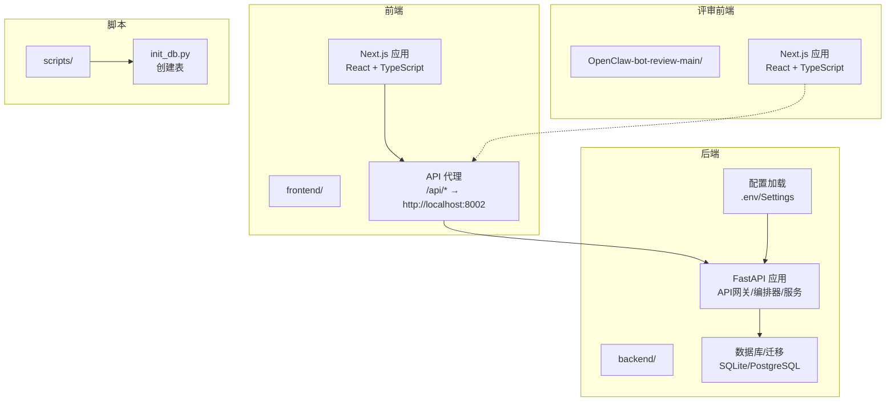
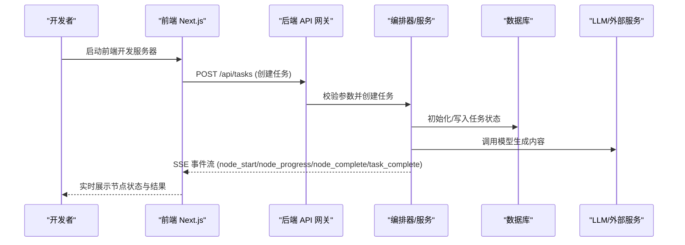
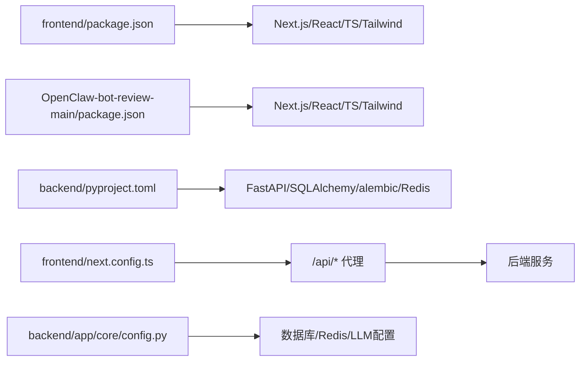
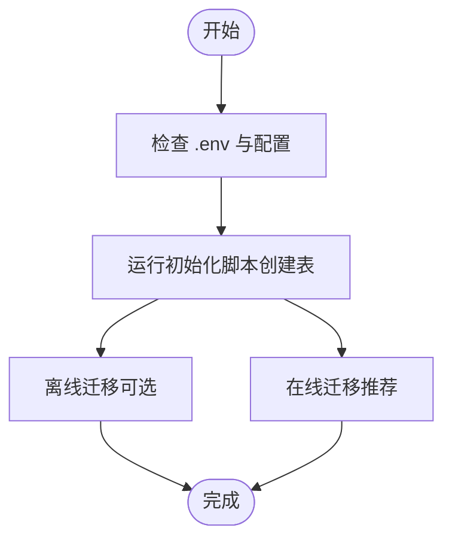

# 开发环境配置

<cite>
**本文引用的文件**
- [ARCHITECTURE.md](file://ARCHITECTURE.md)
- [backend/pyproject.toml](file://backend/pyproject.toml)
- [frontend/package.json](file://frontend/package.json)
- [OpenClaw-bot-review-main/package.json](file://OpenClaw-bot-review-main/package.json)
- [scripts/init_db.py](file://scripts/init_db.py)
- [backend/app/core/config.py](file://backend/app/core/config.py)
- [backend/alembic.ini](file://backend/alembic.ini)
- [backend/alembic/env.py](file://backend/alembic/env.py)
- [frontend/next.config.ts](file://frontend/next.config.ts)
- [frontend/tsconfig.json](file://frontend/tsconfig.json)
- [OpenClaw-bot-review-main/tsconfig.json](file://OpenClaw-bot-review-main/tsconfig.json)
- [OpenClaw-bot-review-main/Dockerfile](file://OpenClaw-bot-review-main/Dockerfile)
- [OpenClaw-bot-review-main/.dockerignore](file://OpenClaw-bot-review-main/.dockerignore)
</cite>

## 目录
1. [简介](#简介)
2. [项目结构](#项目结构)
3. [核心组件](#核心组件)
4. [架构总览](#架构总览)
5. [详细组件分析](#详细组件分析)
6. [依赖分析](#依赖分析)
7. [性能考虑](#性能考虑)
8. [故障排查指南](#故障排查指南)
9. [结论](#结论)
10. [附录](#附录)

## 简介
本指南面向HotClaw项目的开发者，提供从零搭建本地开发环境的完整步骤，涵盖Python后端虚拟环境、Node.js前端环境、数据库初始化与迁移、IDE推荐配置、Docker容器化开发环境、环境变量与第三方服务集成、以及代码格式化、静态分析与自动测试工具链配置。文档同时给出常见问题排查与解决方案，帮助快速上手并高效开发。

## 项目结构
HotClaw采用前后端分离架构：
- 后端（Python/FastAPI）位于 backend/，提供API网关、编排器、智能体与技能层、数据库与配置管理。
- 前端（Next.js/React/TypeScript）位于 frontend/，负责可视化与交互体验。
- 另一个Next.js应用位于 OpenClaw-bot-review-main/，可视为独立评审前端。
- 脚本目录 scripts/ 包含数据库初始化脚本。
- 根目录包含架构文档 ARCHITECTURE.md 与若干辅助文件。

图表来源
- [frontend/next.config.ts:1-15](file://frontend/next.config.ts#L1-L15)
- [backend/app/core/config.py:1-99](file://backend/app/core/config.py#L1-L99)
- [scripts/init_db.py:1-16](file://scripts/init_db.py#L1-L16)

章节来源
- [ARCHITECTURE.md:1-120](file://ARCHITECTURE.md#L1-L120)

## 核心组件
- 后端技术栈：Python 3.11+、FastAPI、SQLAlchemy 2.0 + alembic、Redis、异步数据库驱动、结构化日志与配置校验。
- 前端技术栈：Next.js 16、React 19、TypeScript 5、TailwindCSS、SSE 实时通信。
- 数据库：默认使用SQLite（aiosqlite），也可配置PostgreSQL（asyncpg）。
- 配置：通过环境变量与 .env 文件加载，支持多LLM提供商配置。

章节来源
- [ARCHITECTURE.md:400-448](file://ARCHITECTURE.md#L400-L448)
- [backend/pyproject.toml:1-41](file://backend/pyproject.toml#L1-L41)
- [backend/app/core/config.py:52-99](file://backend/app/core/config.py#L52-L99)

## 架构总览
前后端通过HTTP与SSE通信，前端通过API代理将 /api/* 请求转发至后端服务。后端负责任务编排、智能体执行、技能调用、状态广播与持久化。

图表来源
- [frontend/next.config.ts:1-15](file://frontend/next.config.ts#L1-L15)
- [ARCHITECTURE.md:325-360](file://ARCHITECTURE.md#L325-L360)

## 详细组件分析

### 后端开发环境搭建（Python）
- Python版本要求：>=3.11
- 依赖安装：使用pip安装项目依赖与开发依赖
- 虚拟环境建议：使用venv创建隔离环境
- 运行方式：使用Uvicorn运行FastAPI应用
- 数据库初始化：使用脚本创建所有表
- 配置加载：支持 .env 文件与环境变量

步骤要点
- 创建并激活Python虚拟环境
- 在 backend/ 目录安装依赖
- 准备 .env 文件（见“环境变量配置”）
- 初始化数据库（SQLite或PostgreSQL）
- 启动后端服务

章节来源
- [backend/pyproject.toml:1-41](file://backend/pyproject.toml#L1-L41)
- [scripts/init_db.py:1-16](file://scripts/init_db.py#L1-L16)
- [backend/app/core/config.py:1-99](file://backend/app/core/config.py#L1-L99)

### 前端开发环境搭建（Node.js/Next.js）
- Node.js版本：根据package.json中的依赖范围准备
- 依赖安装：在 frontend/ 与 OpenClaw-bot-review-main/ 目录分别安装
- 开发命令：使用 next dev 启动开发服务器
- API代理：前端通过 next.config.ts 将 /api/* 代理到后端地址
- TypeScript配置：tsconfig.json 已启用严格模式与路径映射

章节来源
- [frontend/package.json:1-23](file://frontend/package.json#L1-L23)
- [OpenClaw-bot-review-main/package.json:1-23](file://OpenClaw-bot-review-main/package.json#L1-L23)
- [frontend/next.config.ts:1-15](file://frontend/next.config.ts#L1-L15)
- [frontend/tsconfig.json:1-42](file://frontend/tsconfig.json#L1-L42)
- [OpenClaw-bot-review-main/tsconfig.json:1-42](file://OpenClaw-bot-review-main/tsconfig.json#L1-L42)

### 数据库初始化与迁移
- 默认数据库：SQLite（aiosqlite），URL在配置中定义
- 初始化脚本：创建所有表
- 迁移工具：alembic，支持离线与在线迁移
- PostgreSQL配置：可在 alembic.ini 中调整连接字符串

章节来源
- [backend/app/core/config.py:52-75](file://backend/app/core/config.py#L52-L75)
- [scripts/init_db.py:1-16](file://scripts/init_db.py#L1-L16)
- [backend/alembic.ini:1-39](file://backend/alembic.ini#L1-L39)
- [backend/alembic/env.py:1-53](file://backend/alembic/env.py#L1-L53)

### 环境变量与第三方服务集成
- LLM提供商：支持 DashScope、OpenAI、Compatible、DeepSeek
- 关键变量：LLM_DEFAULT_PROVIDER、各提供商的API Key与Base URL、模型名
- Redis：用于缓存与会话状态
- 日志级别与超时：可通过环境变量调整

章节来源
- [backend/app/core/config.py:21-99](file://backend/app/core/config.py#L21-L99)

### Docker容器化开发环境
- 评审前端镜像：基于Node.js Alpine，分构建与运行阶段
- 运行端口：3000（容器内）
- .dockerignore：排除不必要的构建产物与日志
- 建议：将后端与数据库容器化，配合卷挂载实现热更新

章节来源
- [OpenClaw-bot-review-main/Dockerfile:1-27](file://OpenClaw-bot-review-main/Dockerfile#L1-L27)
- [OpenClaw-bot-review-main/.dockerignore:1-11](file://OpenClaw-bot-review-main/.dockerignore#L1-L11)

### IDE推荐配置（VS Code）
- Python扩展：启用Pylance、导入排序、格式化与Lint
- TypeScript/Next.js：启用TypeScript TSServer、ESLint、Prettier
- 插件建议：Python、ES7+ React/Redux、Prettier、ESLint、Docker、Rainbow CSV
- 设置建议：启用严格模式、保存时格式化、禁用不必要的自动补全

[本节为通用IDE配置建议，不直接分析具体文件]

### 开发工具链配置
- 代码格式化：Prettier（TypeScript/JS/TSX）
- 静态分析：ESLint（TypeScript/Next.js）、Ruff（Python，可选）
- 自动测试：pytest（Python）、Jest（可选，Next.js）

[本节为通用工具链建议，不直接分析具体文件]

## 依赖分析
后端与前端各自维护独立的依赖与配置，通过API代理实现解耦。

图表来源
- [frontend/package.json:1-23](file://frontend/package.json#L1-L23)
- [OpenClaw-bot-review-main/package.json:1-23](file://OpenClaw-bot-review-main/package.json#L1-L23)
- [backend/pyproject.toml:1-41](file://backend/pyproject.toml#L1-L41)
- [frontend/next.config.ts:1-15](file://frontend/next.config.ts#L1-L15)
- [backend/app/core/config.py:52-99](file://backend/app/core/config.py#L52-L99)

章节来源
- [frontend/package.json:1-23](file://frontend/package.json#L1-L23)
- [OpenClaw-bot-review-main/package.json:1-23](file://OpenClaw-bot-review-main/package.json#L1-L23)
- [backend/pyproject.toml:1-41](file://backend/pyproject.toml#L1-L41)

## 性能考虑
- 前端：使用Next.js Turbopack加速开发，合理拆分页面组件，避免一次性渲染大量节点。
- 后端：异步I/O与连接池优化数据库访问；Redis缓存热点数据；合理设置超时与降级策略。
- SSE：保持事件粒度适中，避免频繁小事件导致带宽压力。
- 数据库：SQLite适合开发，生产建议PostgreSQL并开启索引与分区。

[本节提供通用指导，不直接分析具体文件]

## 故障排查指南
- 端口冲突
  - 现象：启动失败或端口占用
  - 处理：检查后端默认端口与前端代理端口是否冲突，必要时修改配置
- 数据库连接失败
  - 现象：无法连接SQLite或PostgreSQL
  - 处理：确认数据库URL、驱动与凭据；使用初始化脚本创建表
- LLM配置错误
  - 现象：调用LLM失败或返回空
  - 处理：检查提供商API Key、Base URL与模型名；确认网络可达
- API代理失效
  - 现象：前端无法访问后端接口
  - 处理：确认 next.config.ts 的 /api/* 代理目标与后端实际端口一致
- Docker构建失败
  - 现象：镜像构建报错或运行端口不可达
  - 处理：检查Dockerfile与.dockerignore；确保端口映射正确

章节来源
- [backend/app/core/config.py:52-99](file://backend/app/core/config.py#L52-L99)
- [frontend/next.config.ts:1-15](file://frontend/next.config.ts#L1-L15)
- [OpenClaw-bot-review-main/Dockerfile:1-27](file://OpenClaw-bot-review-main/Dockerfile#L1-L27)
- [OpenClaw-bot-review-main/.dockerignore:1-11](file://OpenClaw-bot-review-main/.dockerignore#L1-L11)

## 结论
通过本指南，您可以在本地快速搭建HotClaw的开发环境：后端使用Python虚拟环境与FastAPI，前端使用Next.js与TypeScript，数据库支持SQLite与PostgreSQL，配合API代理与LLM配置即可开展开发。建议结合Docker实现容器化开发，并遵循统一的代码格式化与测试规范，提升团队协作效率。

[本节为总结性内容，不直接分析具体文件]

## 附录

### 环境变量配置清单
- 数据库相关
  - DATABASE_URL：数据库连接URL（默认SQLite）
- Redis相关
  - REDIS_URL：Redis连接URL
- LLM相关
  - LLM_DEFAULT_PROVIDER：默认提供商（dashscope/openai/compatible/deepseek）
  - DASHSCOPE_API_KEY / BASE_URL / MODEL
  - OPENAI_API_KEY / BASE_URL / MODEL
  - COMPATIBLE_API_KEY / BASE_URL / MODEL
  - DEEPSEEK_API_KEY / BASE_URL / MODEL
- 应用与日志
  - APP_ENV / APP_DEBUG / APP_HOST / APP_PORT
  - LOG_LEVEL
- 超时设置
  - AGENT_TIMEOUT / SKILL_TIMEOUT / LLM_TIMEOUT

章节来源
- [backend/app/core/config.py:52-99](file://backend/app/core/config.py#L52-L99)

### 数据库初始化与迁移流程

图表来源
- [scripts/init_db.py:1-16](file://scripts/init_db.py#L1-L16)
- [backend/alembic/env.py:21-52](file://backend/alembic/env.py#L21-L52)