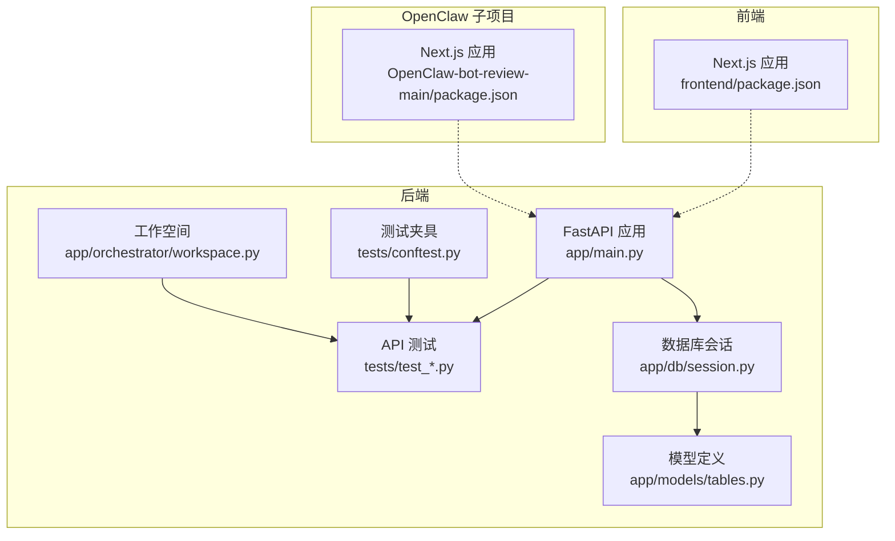
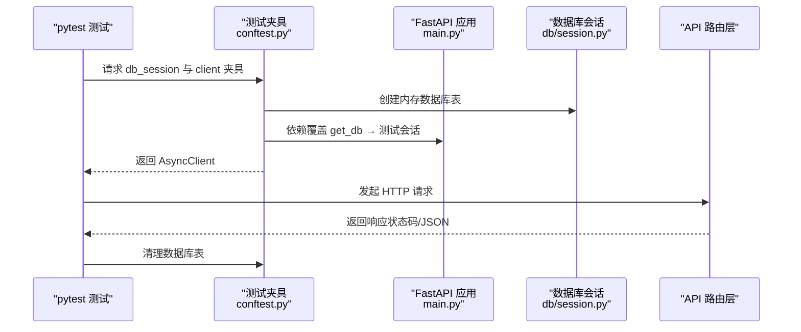
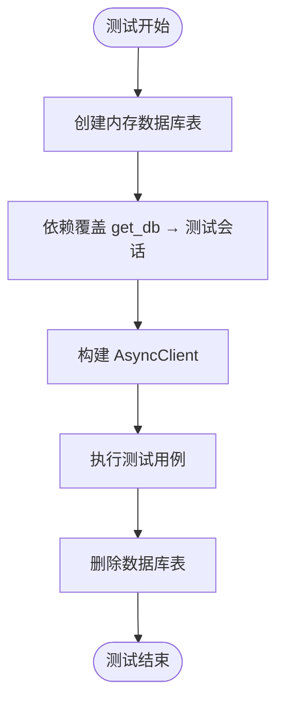
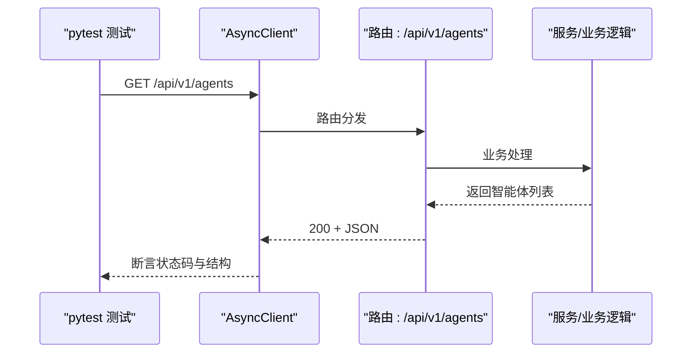
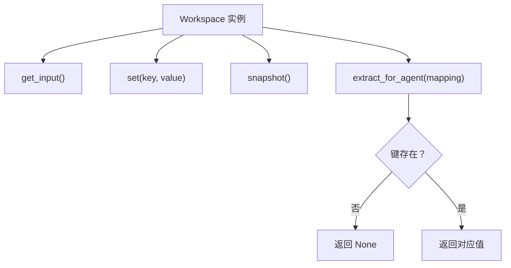
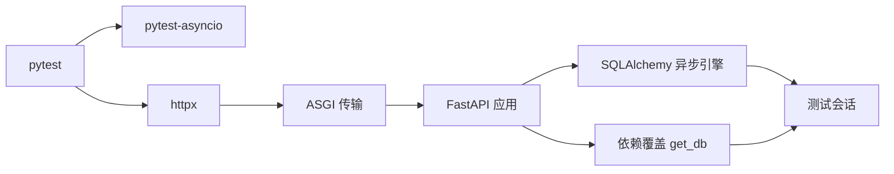

# 测试策略

<cite>
**本文引用的文件**
- [backend/tests/conftest.py](file://backend/tests/conftest.py)
- [backend/pyproject.toml](file://backend/pyproject.toml)
- [backend/tests/test_agent_api.py](file://backend/tests/test_agent_api.py)
- [backend/tests/test_task_api.py](file://backend/tests/test_task_api.py)
- [backend/tests/test_workspace.py](file://backend/tests/test_workspace.py)
- [backend/app/main.py](file://backend/app/main.py)
- [backend/app/db/session.py](file://backend/app/db/session.py)
- [backend/app/models/tables.py](file://backend/app/models/tables.py)
- [backend/app/orchestrator/workspace.py](file://backend/app/orchestrator/workspace.py)
- [frontend/package.json](file://frontend/package.json)
- [OpenClaw-bot-review-main/package.json](file://OpenClaw-bot-review-main/package.json)
- [ARCHITECTURE.md](file://ARCHITECTURE.md)
</cite>

## 目录
1. [引言](#引言)
2. [项目结构](#项目结构)
3. [核心组件](#核心组件)
4. [架构总览](#架构总览)
5. [详细组件分析](#详细组件分析)
6. [依赖分析](#依赖分析)
7. [性能考量](#性能考量)
8. [故障排查指南](#故障排查指南)
9. [结论](#结论)
10. [附录](#附录)

## 引言
本测试策略文档面向 HotClaw 多智能体内容生产平台，围绕测试金字塔（单元测试、集成测试、端到端测试）提出系统化的编写方法与最佳实践，覆盖 pytest 框架使用、fixture 设计、异步测试、数据库测试配置、API 接口测试、Agent 智能体测试与前端组件测试示例，并给出测试覆盖率要求、持续集成配置建议、测试数据管理策略、Mock 对象使用、测试环境隔离与测试数据库配置，以及测试调试技巧与常见问题解决方案。

## 项目结构
HotClaw 采用前后端分离架构，后端基于 FastAPI，前端基于 Next.js。测试主要集中在后端 tests 目录，前端与 OpenClaw 子项目分别拥有独立的 package.json。后端测试通过 pytest-asyncio 支持异步测试，数据库测试使用 SQLite 内存数据库，配合依赖注入覆盖实现隔离。

图表来源
- [backend/app/main.py:1-153](file://backend/app/main.py#L1-L153)
- [backend/tests/conftest.py:1-48](file://backend/tests/conftest.py#L1-L48)
- [backend/app/db/session.py](file://backend/app/db/session.py)
- [backend/app/models/tables.py](file://backend/app/models/tables.py)
- [backend/app/orchestrator/workspace.py](file://backend/app/orchestrator/workspace.py)
- [frontend/package.json:1-23](file://frontend/package.json#L1-L23)
- [OpenClaw-bot-review-main/package.json:1-23](file://OpenClaw-bot-review-main/package.json#L1-L23)

章节来源
- [backend/tests/conftest.py:1-48](file://backend/tests/conftest.py#L1-L48)
- [backend/pyproject.toml:38-41](file://backend/pyproject.toml#L38-L41)
- [ARCHITECTURE.md:401-448](file://ARCHITECTURE.md#L401-L448)

## 核心组件
- 测试夹具（Fixtures）
  - 数据库会话夹具：创建内存数据库表并在测试前后清理，确保每个测试隔离。
  - HTTP 客户端夹具：通过依赖覆盖将应用数据库依赖替换为测试会话，避免真实数据库耦合。
- 异步测试
  - 使用 pytest-asyncio 标记异步测试函数，确保与 FastAPI 异步客户端配合。
- API 测试
  - 覆盖成功路径与错误路径（如 404、422），验证响应码与结构化返回。
- 单元测试
  - 对工作空间（Workspace）等核心业务对象进行行为验证，确保上下文提取与快照正确。
- 前端与 OpenClaw 子项目
  - 通过各自 package.json 的脚本与依赖，为后续前端组件测试与端到端测试奠定基础。

章节来源
- [backend/tests/conftest.py:20-48](file://backend/tests/conftest.py#L20-L48)
- [backend/tests/test_agent_api.py:7-28](file://backend/tests/test_agent_api.py#L7-L28)
- [backend/tests/test_task_api.py:7-57](file://backend/tests/test_task_api.py#L7-L57)
- [backend/tests/test_workspace.py:7-41](file://backend/tests/test_workspace.py#L7-L41)

## 架构总览
后端应用通过生命周期钩子注册智能体、初始化数据库与系统配置；测试通过夹具注入替代真实数据库连接，使用 ASGI 传输创建异步 HTTP 客户端，对路由层进行端到端测试。工作空间（Workspace）贯穿任务执行期的数据上下文管理，是单元测试与集成测试的关键对象。

图表来源
- [backend/tests/conftest.py:20-48](file://backend/tests/conftest.py#L20-L48)
- [backend/app/main.py:34-66](file://backend/app/main.py#L34-L66)
- [backend/app/db/session.py](file://backend/app/db/session.py)

章节来源
- [backend/app/main.py:34-66](file://backend/app/main.py#L34-L66)
- [backend/tests/conftest.py:20-48](file://backend/tests/conftest.py#L20-L48)

## 详细组件分析

### 测试夹具与依赖注入
- 数据库夹具
  - 使用 SQLite 内存数据库，测试开始前创建所有表，结束后删除，保证测试隔离与可重复性。
- HTTP 客户端夹具
  - 通过依赖覆盖将应用的数据库依赖替换为测试会话，确保测试期间不污染真实数据。
  - 使用 ASGI 传输创建异步客户端，便于与 FastAPI 异步路由配合。
- 应用生命周期与智能体注册
  - 应用生命周期中注册 Mock 智能体，测试客户端在每次测试前重新注册，避免状态泄漏。

图表来源
- [backend/tests/conftest.py:20-48](file://backend/tests/conftest.py#L20-L48)
- [backend/app/main.py:34-42](file://backend/app/main.py#L34-L42)

章节来源
- [backend/tests/conftest.py:20-48](file://backend/tests/conftest.py#L20-L48)
- [backend/app/main.py:34-42](file://backend/app/main.py#L34-L42)

### API 接口测试（Agent 与 Task）
- Agent API
  - 成功场景：列出已注册智能体，断言返回码、数据结构与智能体数量与标识。
  - 错误场景：查询不存在的智能体，断言 404 与特定错误码。
- Task API
  - 成功场景：创建任务，断言返回的任务状态、工作流标识与数据完整性。
  - 错误场景：参数校验失败（422）、查询不存在的任务（404）。
  - 健康检查：断言健康端点返回“ok”。

图表来源
- [backend/tests/test_agent_api.py:7-28](file://backend/tests/test_agent_api.py#L7-L28)
- [backend/tests/test_task_api.py:7-57](file://backend/tests/test_task_api.py#L7-L57)

章节来源
- [backend/tests/test_agent_api.py:7-28](file://backend/tests/test_agent_api.py#L7-L28)
- [backend/tests/test_task_api.py:7-57](file://backend/tests/test_task_api.py#L7-L57)

### 单元测试（Workspace 工作空间）
- 基本操作：输入读取、键值设置、快照生成。
- 上下文提取：根据映射从工作空间提取指定字段，缺失键返回空值。
- 错误路径：提取不存在的键，断言返回空值，验证健壮性。

图表来源
- [backend/tests/test_workspace.py:7-41](file://backend/tests/test_workspace.py#L7-L41)
- [backend/app/orchestrator/workspace.py](file://backend/app/orchestrator/workspace.py)

章节来源
- [backend/tests/test_workspace.py:7-41](file://backend/tests/test_workspace.py#L7-L41)

### 前端与 OpenClaw 子项目测试准备
- 前端与 OpenClaw 子项目均使用 Next.js，具备独立的包管理与脚本配置，为后续引入前端组件测试（如 React Testing Library）与端到端测试（如 Playwright/Cypress）提供基础。
- 建议在各自项目中新增测试脚本与依赖，遵循与后端一致的测试组织方式。

章节来源
- [frontend/package.json:1-23](file://frontend/package.json#L1-L23)
- [OpenClaw-bot-review-main/package.json:1-23](file://OpenClaw-bot-review-main/package.json#L1-L23)

## 依赖分析
- 测试框架与异步支持
  - pytest 与 pytest-asyncio 用于编写与运行异步测试。
  - httpx 用于异步 HTTP 客户端测试。
- 数据库与 ORM
  - SQLAlchemy 异步引擎与会话工厂用于测试数据库连接与事务。
  - Alembic 用于迁移与版本管理，测试阶段使用内存数据库替代真实数据库。
- 应用生命周期与依赖注入
  - FastAPI 应用生命周期钩子负责注册智能体与初始化数据库。
  - 依赖覆盖机制用于将真实数据库依赖替换为测试会话。

图表来源
- [backend/pyproject.toml:24-29](file://backend/pyproject.toml#L24-L29)
- [backend/tests/conftest.py:6-47](file://backend/tests/conftest.py#L6-L47)
- [backend/app/main.py:34-42](file://backend/app/main.py#L34-L42)

章节来源
- [backend/pyproject.toml:24-29](file://backend/pyproject.toml#L24-L29)
- [backend/tests/conftest.py:6-47](file://backend/tests/conftest.py#L6-L47)
- [backend/app/main.py:34-42](file://backend/app/main.py#L34-L42)

## 性能考量
- 测试数据库性能
  - 使用 SQLite 内存数据库减少 IO 开销，提升测试执行速度。
  - 避免在测试中执行大量数据写入，必要时批量插入并注意事务边界。
- 异步测试并发
  - 合理拆分测试用例，避免在单个测试中进行过多异步等待。
  - 使用夹具复用客户端与会话，减少重复初始化成本。
- 前端测试性能
  - 前端测试建议使用虚拟 DOM 与轻量级渲染，避免真实网络请求。
  - 对组件进行单元级测试，端到端测试聚焦关键用户路径。

## 故障排查指南
- 依赖注入失败
  - 确认在测试开始前完成智能体注册与依赖覆盖，避免路由访问真实数据库。
- 数据库表未创建
  - 检查夹具中的表创建与删除逻辑，确保在测试前后正确执行。
- 响应码与结构断言失败
  - 核对 API 返回结构与错误码映射，结合应用全局异常处理器定位问题。
- 健康检查失败
  - 检查应用生命周期钩子是否正确初始化数据库与系统配置。

章节来源
- [backend/tests/conftest.py:20-48](file://backend/tests/conftest.py#L20-L48)
- [backend/app/main.py:96-138](file://backend/app/main.py#L96-L138)

## 结论
本测试策略以 pytest 为核心，结合异步测试、依赖注入与内存数据库，构建了覆盖单元、集成与端到端的测试金字塔。通过规范的夹具设计、明确的断言策略与环境隔离，能够有效保障后端 API、智能体与工作空间的稳定性，并为前端与 OpenClaw 子项目的测试奠定基础。建议在持续集成中启用异步模式与测试路径配置，逐步提升测试覆盖率并引入前端组件与端到端测试。

## 附录

### 测试金字塔与最佳实践
- 单元测试
  - 聚焦核心业务对象（如 Workspace）的行为验证，断言输入输出与上下文提取。
  - 使用 Mock 对外部依赖进行隔离，确保测试可重复。
- 集成测试
  - 通过夹具注入数据库会话与 HTTP 客户端，覆盖路由层与服务层交互。
  - 包含成功路径与错误路径（404、422、500 等），验证统一错误响应格式。
- 端到端测试
  - 基于 Next.js 前端与 OpenClaw 子项目，引入组件级与端到端测试框架。
  - 关注关键用户路径（任务创建、运行监控、结果预览）与实时状态更新（SSE）。

### pytest 使用要点
- 异步测试
  - 使用异步测试函数与 asyncio 模式，确保与 FastAPI 异步客户端兼容。
- 夹具设计
  - 将数据库初始化与清理逻辑封装在夹具中，避免重复代码。
  - 通过依赖覆盖实现环境隔离，避免跨测试用例污染。
- 断言策略
  - 对响应码、结构化返回与错误码进行断言，确保 API 行为符合预期。

### 测试覆盖率与持续集成
- 覆盖率要求
  - 建议后端核心模块（API、服务、工作空间）覆盖率不低于 80%，关键路径不低于 90%。
- 持续集成
  - 在 CI 中启用异步模式与测试路径配置，确保测试在无 PostgreSQL 依赖的环境中运行。
  - 使用 SQLite 内存数据库，缩短测试执行时间并提升稳定性。

### 测试数据管理与 Mock 对象
- 测试数据
  - 使用夹具初始化最小化测试数据集，避免在测试中依赖外部资源。
- Mock 对象
  - 对外部服务（如 LLM、第三方 API）进行 Mock，确保测试可控且可重复。
  - 对数据库操作进行 Mock 或使用内存数据库，避免真实数据污染。

### 测试环境隔离与数据库配置
- 环境隔离
  - 通过依赖覆盖与内存数据库实现测试环境隔离，避免跨测试用例共享状态。
- 数据库配置
  - 测试数据库使用 SQLite 内存数据库，生产环境使用 PostgreSQL。
  - 使用 Alembic 管理迁移，在测试中仅创建所需表结构。