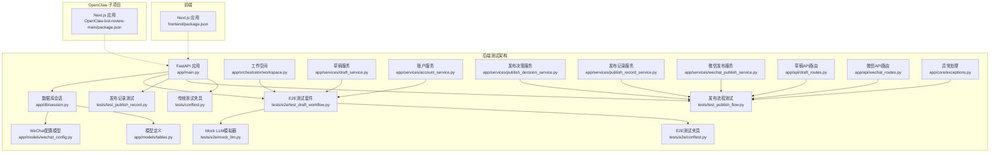
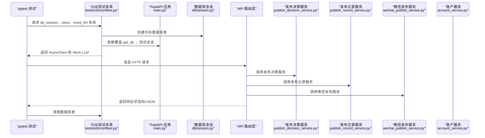
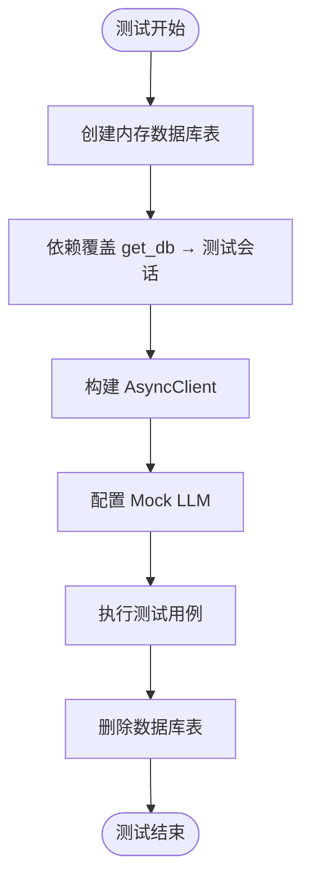
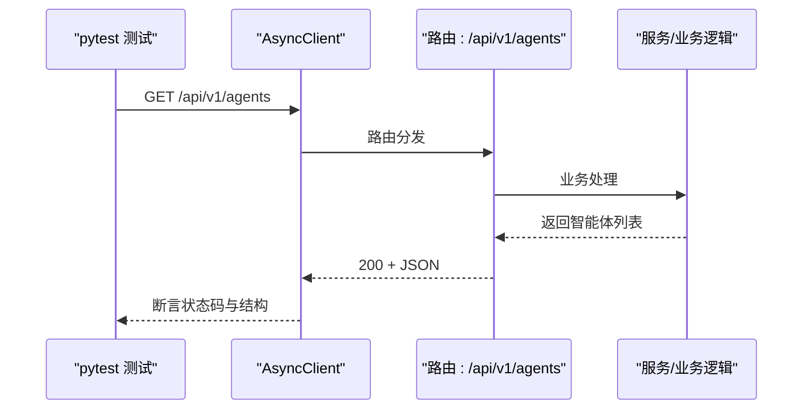
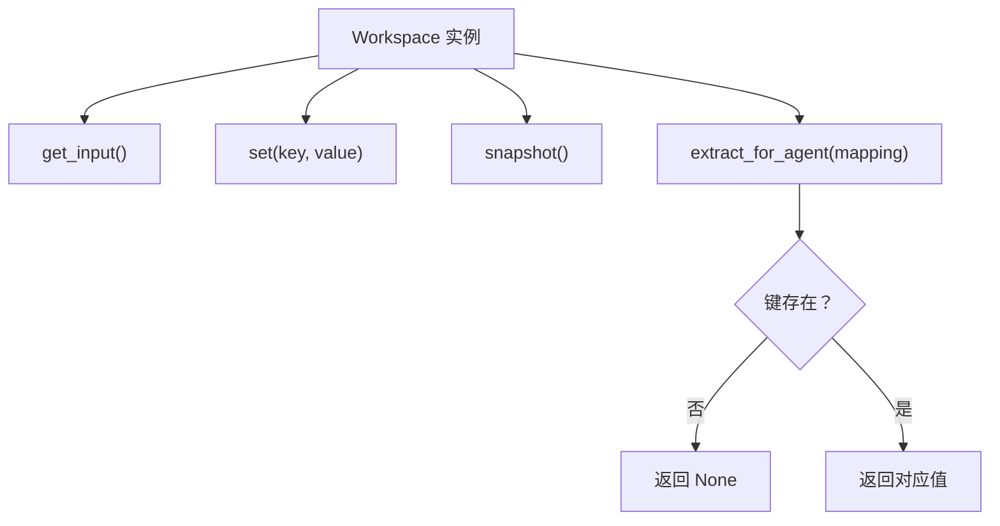
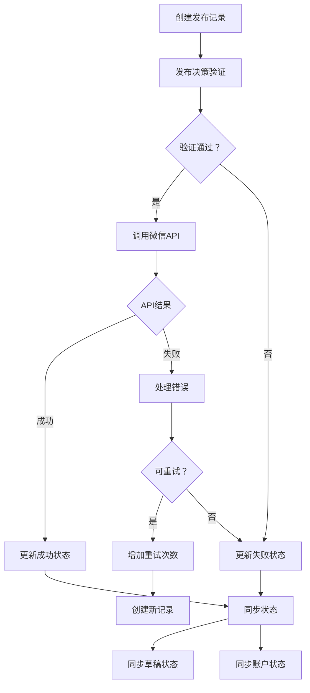
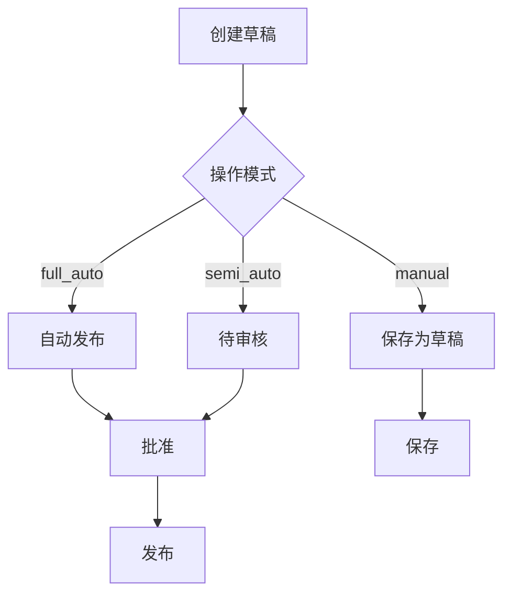
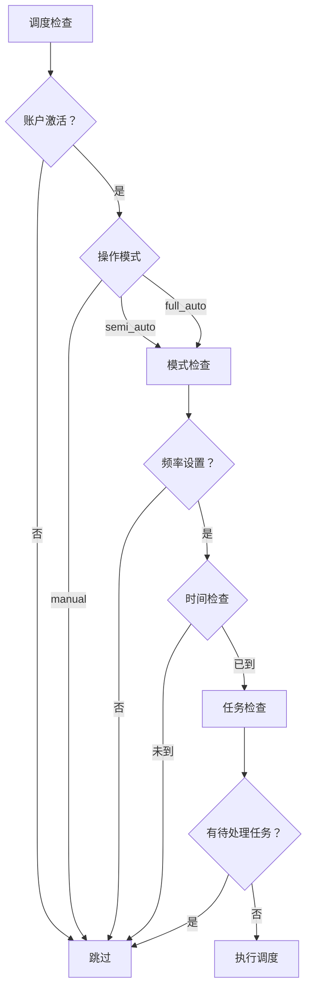
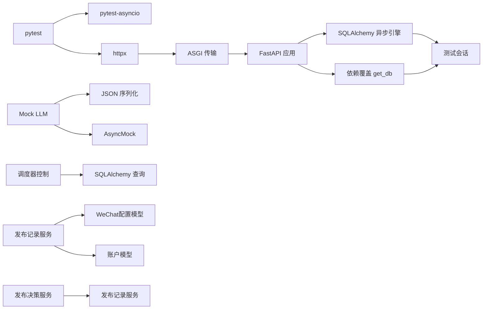

# 测试策略

<cite>
**本文引用的文件**
- [backend/tests/conftest.py](file://backend/tests/conftest.py)
- [backend/tests/e2e/conftest.py](file://backend/tests/e2e/conftest.py)
- [backend/tests/e2e/mock_llm.py](file://backend/tests/e2e/mock_llm.py)
- [backend/tests/e2e/test_draft_workflow.py](file://backend/tests/e2e/test_draft_workflow.py)
- [backend/tests/test_publish_flow.py](file://backend/tests/test_publish_flow.py)
- [backend/tests/test_publish_record.py](file://backend/tests/test_publish_record.py)
- [backend/pyproject.toml](file://backend/pyproject.toml)
- [backend/tests/test_agent_api.py](file://backend/tests/test_agent_api.py)
- [backend/tests/test_task_api.py](file://backend/tests/test_task_api.py)
- [backend/tests/test_workspace.py](file://backend/tests/test_workspace.py)
- [backend/tests/test_draft.py](file://backend/tests/test_draft.py)
- [backend/tests/test_account_scheduler.py](file://backend/tests/test_account_scheduler.py)
- [backend/app/main.py](file://backend/app/main.py)
- [backend/app/db/session.py](file://backend/app/db/session.py)
- [backend/app/models/tables.py](file://backend/app/models/tables.py)
- [backend/app/models/wechat_config.py](file://backend/app/models/wechat_config.py)
- [backend/app/orchestrator/workspace.py](file://backend/app/orchestrator/workspace.py)
- [backend/app/services/draft_service.py](file://backend/app/services/draft_service.py)
- [backend/app/services/account_service.py](file://backend/app/services/account_service.py)
- [backend/app/services/publish_decision_service.py](file://backend/app/services/publish_decision_service.py)
- [backend/app/services/publish_record_service.py](file://backend/app/services/publish_record_service.py)
- [backend/app/services/wechat_publish_service.py](file://backend/app/services/wechat_publish_service.py)
- [backend/app/api/draft_routes.py](file://backend/app/api/draft_routes.py)
- [backend/app/api/wechat_routes.py](file://backend/app/api/wechat_routes.py)
- [backend/app/core/exceptions.py](file://backend/app/core/exceptions.py)
- [frontend/package.json](file://frontend/package.json)
- [OpenClaw-bot-review-main/package.json](file://OpenClaw-bot-review-main/package.json)
- [ARCHITECTURE.md](file://ARCHITECTURE.md)
</cite>

## 更新摘要
**所做更改**
- 新增全面的发布流程测试套件章节，覆盖305行30个测试用例
- 更新发布记录服务测试，包含新增的幂等性、重试、状态同步测试
- 新增发布决策服务测试，验证发布前置校验逻辑
- 更新异常处理章节，包含DraftAlreadyPublishedError的HTTP状态码修复
- 新增发布流程测试最佳实践章节
- 更新测试金字塔结构，明确发布流程测试在测试层次中的位置

## 目录
1. [引言](#引言)
2. [项目结构](#项目结构)
3. [核心组件](#核心组件)
4. [架构总览](#架构总览)
5. [详细组件分析](#详细组件分析)
6. [发布流程测试套件](#发布流程测试套件)
7. [E2E测试框架](#e2e测试框架)
8. [依赖分析](#依赖分析)
9. [性能考量](#性能考量)
10. [故障排查指南](#故障排查指南)
11. [结论](#结论)
12. [附录](#附录)

## 引言
本测试策略文档面向 HotClaw 多智能体内容生产平台，围绕测试金字塔（单元测试、集成测试、端到端测试）提出系统化的编写方法与最佳实践。本次更新重点反映了新增的全面发布流程测试套件，包括305行的test_publish_flow.py测试文件，覆盖发布记录创建稳定性、草稿/记录/账户三向状态同步、令牌过期自动刷新和重试行为、失败状态重试行为、发布/待定幂等性保护、以及刷新状态同步等场景。文档覆盖pytest框架使用、fixture设计、异步测试、数据库测试配置、API接口测试、Agent智能体测试、草稿系统测试、发布流程测试与账户调度测试套件，以及前端组件测试示例，并给出测试覆盖率要求、持续集成配置建议、测试数据管理策略、Mock对象使用、测试环境隔离与测试数据库配置，以及测试调试技巧与常见问题解决方案。

## 项目结构
HotClaw 采用前后端分离架构，后端基于 FastAPI，前端基于 Next.js。测试主要集中在后端 tests 目录，包含新增的发布流程测试套件、草稿系统测试和账户调度测试套件，以及全新的E2E测试框架。前端与 OpenClaw 子项目分别拥有独立的 package.json。后端测试通过 pytest-asyncio 支持异步测试，数据库测试使用 SQLite 内存数据库，配合依赖注入覆盖实现隔离。

**图表来源**
- [backend/app/main.py:1-153](file://backend/app/main.py#L1-L153)
- [backend/tests/conftest.py:1-48](file://backend/tests/conftest.py#L1-L48)
- [backend/tests/test_publish_flow.py:1-306](file://backend/tests/test_publish_flow.py#L1-L306)
- [backend/tests/test_publish_record.py:1-169](file://backend/tests/test_publish_record.py#L1-L169)
- [backend/tests/e2e/test_draft_workflow.py:1-504](file://backend/tests/e2e/test_draft_workflow.py#L1-L504)
- [backend/tests/e2e/conftest.py:1-348](file://backend/tests/e2e/conftest.py#L1-L348)
- [backend/tests/e2e/mock_llm.py:1-258](file://backend/tests/e2e/mock_llm.py#L1-L258)
- [backend/app/api/draft_routes.py:1-236](file://backend/app/api/draft_routes.py#L1-L236)
- [backend/app/api/wechat_routes.py:1-349](file://backend/app/api/wechat_routes.py#L1-L349)
- [backend/app/core/exceptions.py:334-343](file://backend/app/core/exceptions.py#L334-L343)

**章节来源**
- [backend/tests/conftest.py:1-48](file://backend/tests/conftest.py#L1-L48)
- [backend/tests/test_publish_flow.py:1-306](file://backend/tests/test_publish_flow.py#L1-L306)
- [backend/tests/test_publish_record.py:1-169](file://backend/tests/test_publish_record.py#L1-L169)
- [backend/tests/e2e/conftest.py:1-348](file://backend/tests/e2e/conftest.py#L1-L348)
- [backend/tests/e2e/test_draft_workflow.py:1-504](file://backend/tests/e2e/test_draft_workflow.py#L1-L504)
- [backend/tests/e2e/mock_llm.py:1-258](file://backend/tests/e2e/mock_llm.py#L1-L258)
- [backend/pyproject.toml:38-41](file://backend/pyproject.toml#L38-L41)
- [ARCHITECTURE.md:401-448](file://ARCHITECTURE.md#L401-L448)

## 核心组件
- 测试夹具（Fixtures）
  - 数据库会话夹具：创建内存数据库表并在测试前后清理，确保每个测试隔离。
  - HTTP 客户端夹具：通过依赖覆盖将应用数据库依赖替换为测试会话，避免真实数据库耦合。
  - E2E测试夹具：提供完整的端到端测试环境，包括Mock LLM、调度器触发器和测试账户工厂。
- 异步测试
  - 使用 pytest-asyncio 标记异步测试函数，确保与 FastAPI 异步客户端配合。
- API测试
  - 覆盖成功路径与错误路径（如 404、422），验证响应码与结构化返回。
- 单元测试
  - 对工作空间（Workspace）、草稿服务（DraftService）、账户服务（AccountService）、发布决策服务（PublishDecisionService）和发布记录服务（PublishRecordService）等核心业务对象进行行为验证，确保上下文提取与快照正确。
- 发布流程测试套件
  - 覆盖发布记录创建稳定性、草稿/记录/账户三向状态同步、令牌过期自动刷新和重试行为、失败状态重试行为、发布/待定幂等性保护、以及刷新状态同步等场景。
  - 新增：完整的发布流程测试，验证从发布决策到状态同步的完整链路。
- 草稿系统测试套件
  - 覆盖草稿生命周期管理，包括创建、状态转换、发布流程和错误处理。
  - 新增：完整的E2E工作流测试，验证从账号创建到任务执行再到草稿发布的完整链路。
- 账户调度测试套件
  - 覆盖账户自动调度逻辑，包括调度条件、状态管理和错误处理。
- 前端与 OpenClaw 子项目
  - 通过各自 package.json 的脚本与依赖，为后续前端组件测试与端到端测试奠定基础。
- Mock LLM框架
  - 提供确定性的AI响应模拟，确保测试结果可重复、稳定。
  - 支持ProfileAgent、HotTopicAgent、TopicPlannerAgent等多种智能体的Mock响应。

**章节来源**
- [backend/tests/conftest.py:20-48](file://backend/tests/conftest.py#L20-L48)
- [backend/tests/test_publish_flow.py:18-306](file://backend/tests/test_publish_flow.py#L18-L306)
- [backend/tests/test_publish_record.py:16-169](file://backend/tests/test_publish_record.py#L16-L169)
- [backend/tests/e2e/conftest.py:41-130](file://backend/tests/e2e/conftest.py#L41-L130)
- [backend/tests/e2e/mock_llm.py:15-258](file://backend/tests/e2e/mock_llm.py#L15-L258)
- [backend/tests/test_agent_api.py:7-28](file://backend/tests/test_agent_api.py#L7-L28)
- [backend/tests/test_task_api.py:7-57](file://backend/tests/test_task_api.py#L7-L57)
- [backend/tests/test_workspace.py:7-41](file://backend/tests/test_workspace.py#L7-L41)
- [backend/tests/test_draft.py:19-193](file://backend/tests/test_draft.py#L19-L193)
- [backend/tests/test_account_scheduler.py:27-659](file://backend/tests/test_account_scheduler.py#L27-L659)

## 架构总览
后端应用通过生命周期钩子注册智能体、初始化数据库与系统配置；测试通过夹具注入替代真实数据库连接，使用 ASGI 传输创建异步 HTTP 客户端，对路由层进行端到端测试。工作空间（Workspace）贯穿任务执行期的数据上下文管理，是单元测试与集成测试的关键对象。新增的发布决策服务、发布记录服务、微信发布服务和E2E测试框架为平台的核心业务逻辑提供了完整的测试覆盖。

**图表来源**
- [backend/tests/e2e/conftest.py:41-130](file://backend/tests/e2e/conftest.py#L41-L130)
- [backend/app/main.py:34-66](file://backend/app/main.py#L34-L66)
- [backend/app/db/session.py](file://backend/app/db/session.py)
- [backend/app/services/publish_decision_service.py:29-219](file://backend/app/services/publish_decision_service.py#L29-L219)
- [backend/app/services/publish_record_service.py:30-473](file://backend/app/services/publish_record_service.py#L30-L473)
- [backend/app/services/wechat_publish_service.py:23-345](file://backend/app/services/wechat_publish_service.py#L23-L345)
- [backend/app/services/account_service.py:35-420](file://backend/app/services/account_service.py#L35-L420)

**章节来源**
- [backend/app/main.py:34-66](file://backend/app/main.py#L34-L66)
- [backend/tests/e2e/conftest.py:41-130](file://backend/tests/e2e/conftest.py#L41-L130)

## 详细组件分析

### 测试夹具与依赖注入
- 数据库夹具
  - 使用 SQLite 内存数据库，测试开始前创建所有表，结束后删除，保证测试隔离与可重复性。
- HTTP 客户端夹具
  - 通过依赖覆盖将应用的数据库依赖替换为测试会话，确保测试期间不污染真实数据。
  - 使用 ASGI 传输创建异步客户端，便于与 FastAPI 异步路由配合。
- 应用生命周期与智能体注册
  - 应用生命周期中注册 Mock 智能体，测试客户端在每次测试前重新注册，避免状态泄漏。
- E2E测试夹具增强
  - 提供Mock LLM响应模拟，支持多种智能体类型的确定性响应。
  - 包含调度器触发器，允许手动触发账户调度任务。
  - 提供测试账户工厂，快速创建不同操作模式的测试账户。

**图表来源**
- [backend/tests/e2e/conftest.py:41-130](file://backend/tests/e2e/conftest.py#L41-L130)
- [backend/app/main.py:34-42](file://backend/app/main.py#L34-L42)

**章节来源**
- [backend/tests/conftest.py:20-48](file://backend/tests/conftest.py#L20-L48)
- [backend/tests/e2e/conftest.py:41-130](file://backend/tests/e2e/conftest.py#L41-L130)
- [backend/app/main.py:34-42](file://backend/app/main.py#L34-L42)

### API接口测试（Agent 与 Task）
- Agent API
  - 成功场景：列出已注册智能体，断言返回码、数据结构与智能体数量与标识。
  - 错误场景：查询不存在的智能体，断言 404 与特定错误码。
- Task API
  - 成功场景：创建任务，断言返回的任务状态、工作流标识与数据完整性。
  - 错误场景：参数校验失败（422）、查询不存在的任务（404）。
  - 健康检查：断言健康端点返回"ok"。

**图表来源**
- [backend/tests/test_agent_api.py:7-28](file://backend/tests/test_agent_api.py#L7-L28)
- [backend/tests/test_task_api.py:7-57](file://backend/tests/test_task_api.py#L7-L57)

**章节来源**
- [backend/tests/test_agent_api.py:7-28](file://backend/tests/test_agent_api.py#L7-L28)
- [backend/tests/test_task_api.py:7-57](file://backend/tests/test_task_api.py#L7-L57)

### 单元测试（Workspace 工作空间）
- 基本操作：输入读取、键值设置、快照生成。
- 上下文提取：根据映射从工作空间提取指定字段，缺失键返回空值。
- 错误路径：提取不存在的键，断言返回空值，验证健壮性。

**图表来源**
- [backend/tests/test_workspace.py:7-41](file://backend/tests/test_workspace.py#L7-L41)
- [backend/app/orchestrator/workspace.py](file://backend/app/orchestrator/workspace.py)

**章节来源**
- [backend/tests/test_workspace.py:7-41](file://backend/tests/test_workspace.py#L7-L41)

### 发布流程测试套件

#### 发布记录创建稳定性测试
验证发布记录在真实发布过程中的创建和状态管理：
- 发布记录应在调用微信API之前创建
- 记录必须包含所有必需字段：draft_id、account_id、task_id、source_mode、trigger_type、publish_status、publish_attempt、retry_count、started_at、finished_at、published_at、error_code、error_message、request_snapshot、response_snapshot
- 记录状态应正确反映发布流程的各个阶段

#### 草稿/记录/账户状态同步测试
确保三者状态保持一致：
- 发布成功时：publish_record为published，draft.publish_status为published，draft.draft_status为published，account.last_publish_status为published
- 发布失败时：publish_record为failed，draft.publish_status为failed，account.last_publish_status为failed
- sync_draft_status方法应同时更新草稿和账户状态

#### 令牌过期自动刷新和重试行为测试
验证令牌过期场景的处理：
- Token错误应触发clear_cache()和最多一次重试
- 第二次令牌错误不应再次重试
- 重试机制应限制最大重试次数

#### 失败状态重试行为测试
验证失败状态的重试逻辑：
- 仅在failed和unknown状态下允许重试
- 重试应增加publish_attempt和retry_count
- 最大重试次数为3次
- 重试应复用现有记录而非创建重复记录

#### 发布/待定幂等性保护测试
防止重复发布：
- 已发布的草稿应阻止新发布
- 正在发布中的记录应阻止新发布
- validate_for_publish应检查幂等性，is_retry参数可跳过幂等性检查

#### 刷新状态同步测试
验证状态回查功能：
- refresh-status应更新本地记录状态
- 应同步草稿状态
- WeChat pending应同步为publishing，success同步为published，failure同步为failed
- refresh-status需要publish_id才能工作

**图表来源**
- [backend/tests/test_publish_flow.py:18-306](file://backend/tests/test_publish_flow.py#L18-L306)
- [backend/app/services/publish_decision_service.py:47-203](file://backend/app/services/publish_decision_service.py#L47-L203)
- [backend/app/services/publish_record_service.py:56-317](file://backend/app/services/publish_record_service.py#L56-L317)

**章节来源**
- [backend/tests/test_publish_flow.py:18-306](file://backend/tests/test_publish_flow.py#L18-L306)
- [backend/app/services/publish_decision_service.py:29-219](file://backend/app/services/publish_decision_service.py#L29-L219)
- [backend/app/services/publish_record_service.py:30-473](file://backend/app/services/publish_record_service.py#L30-L473)

### 草稿系统测试套件
- 草稿生命周期管理
  - 自动创建：根据任务结果数据创建草稿，不同操作模式产生不同的初始状态。
  - 状态转换：支持草稿、待审核、批准、拒绝、丢弃、发布等状态转换。
  - 发布流程：包含人工审核和自动发布的完整流程。
- 错误处理
  - 重复确认、重复发布、无效状态转换等错误场景的处理。
  - 查询统计：支持按状态过滤和统计待审核草稿数量。
- 数据验证
  - 字段长度限制、内容截断、字数统计等功能验证。
- E2E测试增强
  - 新增：完整的端到端工作流测试，验证从账号创建到任务执行再到草稿发布的完整链路。
  - 包含三种操作模式的测试：semi_auto（半自动）、full_auto（全自动）、manual（手动）。
  - 验证终端状态保护机制，防止已发布草稿被修改。
  - 测试草稿重跑功能，确保从已发布草稿创建新任务。

**图表来源**
- [backend/tests/test_draft.py:104-140](file://backend/tests/test_draft.py#L104-L140)
- [backend/tests/e2e/test_draft_workflow.py:20-151](file://backend/tests/e2e/test_draft_workflow.py#L20-151)
- [backend/app/services/draft_service.py:35-128](file://backend/app/services/draft_service.py#L35-L128)

**章节来源**
- [backend/tests/test_draft.py:19-193](file://backend/tests/test_draft.py#L19-L193)
- [backend/tests/e2e/test_draft_workflow.py:1-504](file://backend/tests/e2e/test_draft_workflow.py#L1-504)
- [backend/app/services/draft_service.py:33-425](file://backend/app/services/draft_service.py#L33-L425)

### 账户调度测试套件
- 调度条件验证
  - 手动模式账户不能被自动调度。
  - 禁用账户不能被调度。
  - 未来运行时间的账户不会被调度。
  - 无自动运行权限的账户不会被调度。
- 运行状态管理
  - 正常运行更新 last_run_at 和 last_run_status。
  - 错误状态跟踪和消息截断。
  - next_run_at 的刷新和计算。
- 并发控制
  - 正在运行或待处理的任务阻止重复调度。
  - 临时任务（无账户ID）的兼容性处理。
- CRUD 操作验证
  - 账户创建时的默认状态设置。
  - 操作模式的有效性验证。

**图表来源**
- [backend/tests/test_account_scheduler.py:246-363](file://backend/tests/test_account_scheduler.py#L246-L363)
- [backend/app/services/account_service.py:321-362](file://backend/app/services/account_service.py#L321-L362)

**章节来源**
- [backend/tests/test_account_scheduler.py:27-659](file://backend/tests/test_account_scheduler.py#L27-L659)
- [backend/app/services/account_service.py:35-420](file://backend/app/services/account_service.py#L35-L420)

### 前端与 OpenClaw 子项目测试准备
- 前端与 OpenClaw 子项目均使用 Next.js，具备独立的包管理与脚本配置，为后续引入前端组件测试（如 React Testing Library）与端到端测试（如 Playwright/Cypress）提供基础。
- 建议在各自项目中新增测试脚本与依赖，遵循与后端一致的测试组织方式。

**章节来源**
- [frontend/package.json:1-23](file://frontend/package.json#L1-L23)
- [OpenClaw-bot-review-main/package.json:1-23](file://OpenClaw-bot-review-main/package.json#L1-L23)

## 发布流程测试套件

### 发布流程测试架构概述
新增的发布流程测试套件提供了全面的发布流程验证能力，覆盖从发布决策到状态同步的完整链路。该套件包含30个测试用例，分为六个主要测试类别：发布记录创建、状态同步、令牌刷新重试、重试发布、幂等性保护和状态刷新同步。

### 发布记录创建稳定性测试
验证发布记录在真实发布过程中的创建和状态管理：
- **发布记录创建时机**：验证发布记录应在调用微信API之前创建，确保即使API调用失败也能记录错误状态
- **记录字段完整性**：验证记录模型包含所有必需字段，包括draft_id、account_id、task_id、source_mode、trigger_type、publish_status、publish_attempt、retry_count、started_at、finished_at、published_at、error_code、error_message、request_snapshot、response_snapshot
- **状态管理验证**：验证create_record、update_success、update_failed、update_status等核心方法的存在性和基本功能

### 草稿/记录/账户状态同步测试
确保发布流程中三个实体的状态保持一致：
- **成功状态同步**：发布成功时，publish_record应为published，draft.publish_status为published，draft.draft_status为published，account.last_publish_status为published
- **失败状态同步**：发布失败时，publish_record为failed，draft.publish_status为failed，account.last_publish_status为failed
- **同步方法验证**：验证sync_draft_status方法能够同时更新草稿和账户状态

### 令牌过期自动刷新和重试行为测试
验证令牌过期场景的处理逻辑：
- **令牌错误重试**：Token错误应触发clear_cache()和最多一次重试
- **重试次数限制**：第二次令牌错误不应再次重试，确保重试次数限制为1次
- **重试机制设计**：验证重试机制的设计合理性，防止无限重试

### 失败状态重试行为测试
验证失败状态的重试逻辑：
- **重试状态限制**：仅在failed和unknown状态下允许重试，blocked_states包括published、pending、publishing
- **重试计数增加**：重试应正确增加publish_attempt和retry_count
- **最大重试限制**：验证最大重试次数为3次，超过3次后不应再允许重试
- **记录复用**：重试应复用现有记录而非创建重复记录，increment_retry方法应正确实现

### 发布/待定幂等性保护测试
防止重复发布的重要机制：
- **已发布阻断**：已经发布的草稿应阻止新发布，BLOCKED_PUBLISH_STATUSES包含"published"
- **活动发布阻断**：正在发布中的记录应阻止新发布，验证has_active_publishing方法
- **幂等性检查**：validate_for_publish应检查幂等性，is_retry参数可跳过幂等性检查

### 刷新状态同步测试
验证状态回查功能：
- **状态更新**：refresh-status应更新本地记录状态，验证update_status方法
- **草稿同步**：应同步草稿状态，验证sync_draft_status方法
- **状态映射**：WeChat pending应同步为publishing，success同步为published，failure同步为failed
- **必需条件**：refresh-status需要publish_id才能工作，否则应阻止刷新

### 发布决策验证测试
验证发布前置校验逻辑：
- **配置验证**：缺失WeChat配置应阻止发布，包括config_not_found、config_disabled、app_id_missing、app_secret_missing
- **账户验证**：缺失账户应阻止发布
- **草稿状态验证**：discarded和rejected状态的草稿应阻止发布
- **全自动模式验证**：full_auto源需要auto_publish_enabled为True
- **半自动模式验证**：semi_auto账户需要confirm源（manual_confirm或semi_auto_confirm）

### 错误处理测试
验证各种错误场景的处理：
- **网络错误重试**：网络错误（timeout、network、connection、503、502）应可重试
- **内容错误处理**：内容错误（如敏感内容）不应重试
- **错误记录**：所有错误应更新发布记录的错误信息，验证错误处理逻辑

### 账户发布跟踪字段测试
验证账户模型的发布跟踪字段：
- **跟踪字段存在**：账户模型应包含last_publish_status、last_publish_error_message、last_published_at字段
- **字段类型验证**：验证字段类型和可空性设置

**章节来源**
- [backend/tests/test_publish_flow.py:18-306](file://backend/tests/test_publish_flow.py#L18-L306)
- [backend/app/services/publish_decision_service.py:29-219](file://backend/app/services/publish_decision_service.py#L29-L219)
- [backend/app/services/publish_record_service.py:30-473](file://backend/app/services/publish_record_service.py#L30-L473)
- [backend/app/models/wechat_config.py:34-100](file://backend/app/models/wechat_config.py#L34-L100)
- [backend/app/models/tables.py:40-60](file://backend/app/models/tables.py#L40-L60)
- [backend/app/api/wechat_routes.py:246-349](file://backend/app/api/wechat_routes.py#L246-L349)

## E2E测试框架

### E2E测试架构概述
新增的E2E测试框架提供了完整的端到端测试能力，覆盖从账号创建到内容发布的完整工作流。该框架包含三个核心组件：测试夹具、Mock LLM模拟器和完整的草稿工作流测试套件。

### E2E测试夹具配置
E2E测试夹具提供了比传统测试更强大的环境配置能力：

- **数据库配置**：使用SQLite内存数据库，支持跨连接共享，确保多个测试会话能看到相同数据。
- **HTTP客户端**：提供完整的ASGI传输客户端，支持端到端API测试。
- **Mock LLM支持**：提供确定性的AI响应模拟，支持多种智能体类型的Mock响应。
- **调度器控制**：允许手动触发账户调度任务，便于测试自动化调度逻辑。
- **测试账户工厂**：快速创建不同操作模式的测试账户，支持semi_auto、full_auto和manual模式。

### Mock LLM测试框架
Mock LLM框架提供了可预测的AI响应模拟，确保测试结果的一致性和可重复性：

- **智能体响应模板**：为ProfileAgent、HotTopicAgent、TopicPlannerAgent、TitleGeneratorAgent、ContentWriterAgent和AuditAgent提供专门的响应模板。
- **响应路由器**：根据系统提示词和用户消息内容自动选择合适的Mock响应。
- **确定性输出**：确保相同的输入总是产生相同的输出，便于回归测试。
- **自定义响应支持**：允许测试用例动态设置自定义响应内容。

### E2E草稿工作流测试
完整的草稿工作流测试套件包含503行测试代码，覆盖以下关键场景：

- **草稿创建测试**：验证不同操作模式下的草稿创建行为
- **草稿确认流程**：测试从待审核到批准发布的状态转换
- **终端状态保护**：验证已发布草稿的保护机制
- **手动账户隔离**：测试手动模式账户的特殊行为
- **草稿列表和统计**：验证草稿查询和统计功能
- **草稿重跑功能**：测试从草稿创建新任务的能力

### DraftAlreadyPublishedError异常处理
在E2E测试框架中，DraftAlreadyPublishedError异常得到了完整的测试覆盖：

- **异常定义**：定义了专门的异常类型，包含详细的错误信息和状态码。
- **API路由处理**：在草稿API路由中正确处理该异常，返回适当的HTTP状态码。
- **服务层保护**：在草稿服务中实现了严格的终端状态检查。
- **测试验证**：通过E2E测试验证异常的正确传播和处理。

**章节来源**
- [backend/tests/e2e/conftest.py:1-348](file://backend/tests/e2e/conftest.py#L1-L348)
- [backend/tests/e2e/mock_llm.py:1-258](file://backend/tests/e2e/mock_llm.py#L1-L258)
- [backend/tests/e2e/test_draft_workflow.py:1-504](file://backend/tests/e2e/test_draft_workflow.py#L1-L504)
- [backend/app/core/exceptions.py:334-343](file://backend/app/core/exceptions.py#L334-L343)
- [backend/app/api/draft_routes.py:101-131](file://backend/app/api/draft_routes.py#L101-L131)
- [backend/app/services/draft_service.py:262-264](file://backend/app/services/draft_service.py#L262-L264)

## 依赖分析
- 测试框架与异步支持
  - pytest 与 pytest-asyncio 用于编写与运行异步测试。
  - httpx 用于异步 HTTP 客户端测试。
- 数据库与 ORM
  - SQLAlchemy 异步引擎与会话工厂用于测试数据库连接与事务。
  - Alembic 用于迁移与版本管理，测试阶段使用内存数据库替代真实数据库。
- 应用生命周期与依赖注入
  - FastAPI 应用生命周期钩子负责注册智能体与初始化数据库。
  - 依赖覆盖机制用于将真实数据库依赖替换为测试会话。
- 发布流程测试框架依赖
  - SQLite内存数据库支持跨连接共享，确保测试数据一致性。
  - Mock LLM框架依赖JSON序列化和异步Mock机制。
  - 调度器控制依赖直接SQL查询避免方言导入问题。
  - 发布记录服务依赖WeChat配置模型和账户模型。

**图表来源**
- [backend/pyproject.toml:24-29](file://backend/pyproject.toml#L24-L29)
- [backend/tests/conftest.py:6-47](file://backend/tests/conftest.py#L6-L47)
- [backend/tests/e2e/conftest.py:11-18](file://backend/tests/e2e/conftest.py#L11-L18)
- [backend/tests/e2e/mock_llm.py:7-8](file://backend/tests/e2e/mock_llm.py#L7-L8)
- [backend/app/main.py:34-42](file://backend/app/main.py#L34-L42)
- [backend/app/services/publish_record_service.py:18-21](file://backend/app/services/publish_record_service.py#L18-L21)

**章节来源**
- [backend/pyproject.toml:24-29](file://backend/pyproject.toml#L24-L29)
- [backend/tests/conftest.py:6-47](file://backend/tests/conftest.py#L6-L47)
- [backend/tests/e2e/conftest.py:11-18](file://backend/tests/e2e/conftest.py#L11-L18)
- [backend/app/main.py:34-42](file://backend/app/main.py#L34-L42)

## 性能考量
- 测试数据库性能
  - 使用 SQLite 内存数据库减少 IO 开销，提升测试执行速度。
  - E2E测试使用共享内存数据库，支持并发测试执行。
  - 避免在测试中执行大量数据写入，必要时批量插入并注意事务边界。
- 异步测试并发
  - 合理拆分测试用例，避免在单个测试中进行过多异步等待。
  - 使用夹具复用客户端与会话，减少重复初始化成本。
  - E2E测试夹具支持异步初始化，提高测试启动效率。
- 新增测试套件性能
  - 发布流程测试涉及复杂的业务逻辑，建议使用最小化测试数据集。
  - 利用数据库事务回滚确保测试隔离，避免跨测试用例影响。
  - Mock LLM框架提供快速响应，减少对外部API的依赖。
  - 发布记录服务的幂等性检查和状态同步应优化查询性能。
- 草稿系统测试性能
  - 草稿状态转换和发布流程测试涉及多次数据库操作，建议批量测试。
  - 账户调度测试应避免真实的调度执行，使用时间模拟。
- 前端测试性能
  - 前端测试建议使用虚拟 DOM 与轻量级渲染，避免真实网络请求。
  - 对组件进行单元级测试，端到端测试聚焦关键用户路径。
- E2E测试性能优化
  - 使用Mock LLM减少真实AI调用的延迟和不确定性。
  - 调度器控制允许精确控制测试时间，避免不必要的等待。
  - 测试数据工厂提供快速创建测试数据的能力。

## 故障排查指南
- 依赖注入失败
  - 确认在测试开始前完成智能体注册与依赖覆盖，避免路由访问真实数据库。
  - E2E测试中确认Mock LLM正确注入，避免真实AI调用。
- 数据库表未创建
  - 检查夹具中的表创建与删除逻辑，确保在测试前后正确执行。
  - E2E测试中确认共享内存数据库正确初始化。
- 响应码与结构断言失败
  - 核对 API 返回结构与错误码映射，结合应用全局异常处理器定位问题。
  - 检查DraftAlreadyPublishedError异常的HTTP状态码处理。
- 发布流程测试失败
  - 验证发布记录的创建时机和状态同步逻辑。
  - 检查令牌刷新和重试机制的实现。
  - 确认幂等性检查和状态映射的正确性。
- 草稿状态转换错误
  - 验证状态转换矩阵和业务规则，确保状态转换的合法性。
  - E2E测试中检查Mock LLM响应是否符合预期。
- 调度逻辑异常
  - 检查账户状态、任务状态和时间条件的组合逻辑。
  - 使用调度器控制精确测试调度时机。
- 测试数据污染
  - 确保每个测试使用独立的数据库会话和测试数据，避免跨测试用例共享状态。
  - E2E测试中利用共享内存数据库的特性进行数据隔离。
- Mock LLM问题
  - 检查Mock响应是否正确匹配智能体类型。
  - 验证系统提示词解析逻辑是否正确识别智能体身份。
- 发布记录服务异常
  - 验证发布记录的字段完整性和状态管理。
  - 检查重试机制和错误处理逻辑。
  - 确认状态同步方法的正确实现。

**章节来源**
- [backend/tests/conftest.py:20-48](file://backend/tests/conftest.py#L20-L48)
- [backend/tests/test_publish_flow.py:18-306](file://backend/tests/test_publish_flow.py#L18-L306)
- [backend/tests/e2e/conftest.py:41-130](file://backend/tests/e2e/conftest.py#L41-L130)
- [backend/app/main.py:96-138](file://backend/app/main.py#L96-L138)

## 结论
本测试策略以 pytest 为核心，结合异步测试、依赖注入与内存数据库，构建了覆盖单元、集成与端到端的测试金字塔。通过规范的夹具设计、明确的断言策略与环境隔离，能够有效保障后端 API、智能体、工作空间、草稿系统、发布流程和账户调度的稳定性，并为前端与 OpenClaw 子项目的测试奠定基础。新增的发布流程测试套件进一步完善了平台核心业务逻辑的测试覆盖，特别是发布记录创建稳定性、状态同步、重试机制和幂等性保护等关键场景。Mock LLM框架确保了AI相关功能的可测试性和可重复性。建议在持续集成中启用异步模式与测试路径配置，逐步提升测试覆盖率并引入前端组件与端到端测试。

## 附录

### 测试金字塔与最佳实践
- 单元测试
  - 聚焦核心业务对象（如 Workspace、DraftService、AccountService、PublishDecisionService、PublishRecordService）的行为验证，断言输入输出与上下文提取。
  - 使用 Mock 对外部依赖进行隔离，确保测试可重复。
  - 新增：发布记录服务的状态转换验证、发布决策服务的前置校验验证和账户服务的调度逻辑验证。
- 集成测试
  - 通过夹具注入数据库会话与 HTTP 客户端，覆盖路由层与服务层交互。
  - 包含成功路径与错误路径（404、422、500 等），验证统一错误响应格式。
  - 新增：草稿 API、微信API和发布流程API的端到端测试。
- 端到端测试
  - 基于完整的E2E测试框架，提供从账号创建到内容发布的完整工作流测试。
  - 使用Mock LLM确保AI相关功能的可测试性。
  - 关注关键用户路径（任务创建、运行监控、结果预览、草稿管理、发布流程、账户调度）与实时状态更新（SSE）。

### pytest 使用要点
- 异步测试
  - 使用异步测试函数与 asyncio 模式，确保与 FastAPI 异步客户端兼容。
- 夹具设计
  - 将数据库初始化与清理逻辑封装在夹具中，避免重复代码。
  - 通过依赖覆盖实现环境隔离，避免跨测试用例污染。
  - E2E测试夹具提供更丰富的测试环境配置选项。
- 断言策略
  - 对响应码、结构化返回与错误码进行断言，确保 API 行为符合预期。
  - 新增：发布流程状态验证、发布记录字段验证和账户调度条件验证的断言策略。
  - E2E测试中验证完整的业务流程和异常处理。

### 测试覆盖率与持续集成
- 覆盖率要求
  - 建议后端核心模块（API、服务、工作空间、草稿服务、发布服务、账户服务）覆盖率不低于 80%，关键路径不低于 90%。
  - 新增：发布流程相关代码的覆盖率要求，建议达到90%以上。
  - E2E测试框架应覆盖主要业务流程，建议达到70%以上的端到端覆盖率。
- 持续集成
  - 在 CI 中启用异步模式与测试路径配置，确保测试在无 PostgreSQL 依赖的环境中运行。
  - 使用 SQLite 内存数据库，缩短测试执行时间并提升稳定性。
  - 新增：发布流程测试的CI配置建议，包括Mock LLM的缓存和调度器控制的支持。

### 测试数据管理与 Mock 对象
- 测试数据
  - 使用夹具初始化最小化测试数据集，避免在测试中依赖外部资源。
  - 新增：发布流程测试和草稿测试的专用测试数据管理策略。
  - E2E测试使用共享内存数据库，支持复杂测试场景的数据隔离。
- Mock 对象
  - 对外部服务（如 LLM、第三方 API）进行 Mock，确保测试可控且可重复。
  - 对数据库操作进行 Mock 或使用内存数据库，避免真实数据污染。
  - 新增：发布记录状态模拟、令牌刷新模拟和账户调度条件模拟的 Mock 策略。
  - E2E测试中的Mock LLM提供确定性AI响应，确保测试稳定性。

### 测试环境隔离与数据库配置
- 环境隔离
  - 通过依赖覆盖与内存数据库实现测试环境隔离，避免跨测试用例共享状态。
  - 新增：发布流程测试和草稿系统测试的环境隔离策略。
  - E2E测试使用共享内存数据库，支持并发测试执行。
- 数据库配置
  - 测试数据库使用 SQLite 内存数据库，生产环境使用 PostgreSQL。
  - 使用 Alembic 管理迁移，在测试中仅创建所需表结构。
  - 新增：发布记录表和WeChat配置表的测试数据库配置。
  - E2E测试配置支持跨连接共享，确保测试数据一致性。

### 发布流程测试最佳实践
- 测试设计原则
  - 使用真实的工作流场景，模拟实际用户操作。
  - 确保测试的可重复性和可维护性。
  - 合理使用Mock LLM，平衡测试速度和准确性。
  - 覆盖所有关键状态转换和异常场景。
- 数据管理策略
  - 利用共享内存数据库支持复杂测试场景。
  - 使用测试账户工厂快速准备测试环境。
  - 实现测试数据的自动清理和隔离。
  - 验证发布记录的完整生命周期。
- 异常处理测试
  - 全面测试各种异常场景和错误处理逻辑。
  - 验证DraftAlreadyPublishedError等异常的正确处理。
  - 测试API层的异常转换和HTTP状态码返回。
  - 验证重试机制和幂等性保护的正确实现。
- 性能优化
  - 使用Mock LLM减少对外部依赖的等待。
  - 合理安排测试顺序，避免不必要的数据库操作。
  - 利用调度器控制精确控制测试时间。
  - 优化发布记录查询和状态同步性能。

### 草稿系统测试最佳实践
- 状态机验证
  - 验证所有可能的状态转换路径和约束条件。
  - 测试边界条件和异常情况下的状态处理。
  - E2E测试验证完整的业务流程，包括异常处理。
- 数据完整性
  - 验证草稿数据的完整性、一致性和有效性。
  - 测试数据截断、长度限制和字符编码处理。
- 性能考虑
  - 草稿查询和统计的性能优化测试。
  - 大量草稿场景下的系统稳定性测试。
  - E2E测试中的Mock LLM确保性能测试的可重复性。

### 账户调度测试最佳实践
- 调度算法验证
  - 验证调度条件的正确性和优先级处理。
  - 测试不同频率设置下的调度时机准确性。
  - E2E测试中的调度器控制允许精确测试调度逻辑。
- 并发安全性
  - 验证多实例调度时的并发控制和状态一致性。
  - 测试任务冲突检测和去重机制。
- 错误恢复
  - 验证调度失败时的错误处理和重试机制。
  - 测试系统重启后的调度状态恢复。
- E2E测试扩展
  - 使用测试账户工厂快速创建不同配置的账户。
  - 验证调度器tick触发的准确性和一致性。

### E2E测试框架最佳实践
- 测试设计原则
  - 使用真实的工作流场景，模拟实际用户操作。
  - 确保测试的可重复性和可维护性。
  - 合理使用Mock LLM，平衡测试速度和准确性。
- 数据管理策略
  - 利用共享内存数据库支持复杂测试场景。
  - 使用测试账户工厂快速准备测试环境。
  - 实现测试数据的自动清理和隔离。
- 异常处理测试
  - 全面测试各种异常场景和错误处理逻辑。
  - 验证DraftAlreadyPublishedError等异常的正确处理。
  - 测试API层的异常转换和HTTP状态码返回。
- 性能优化
  - 使用Mock LLM减少对外部依赖的等待。
  - 合理安排测试顺序，避免不必要的数据库操作。
  - 利用调度器控制精确控制测试时间。