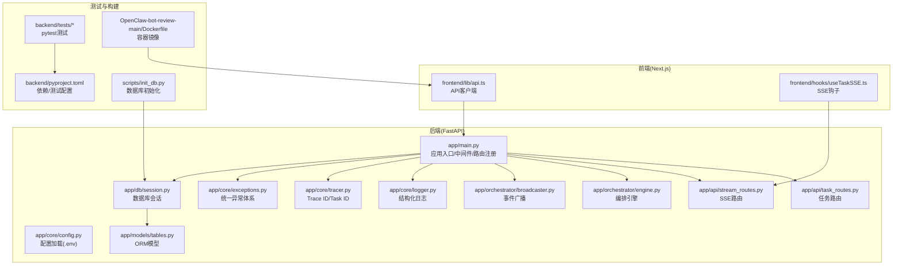
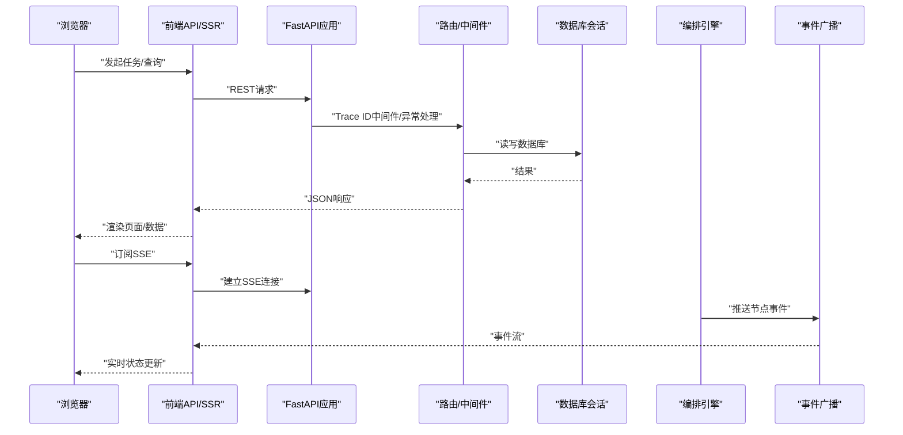
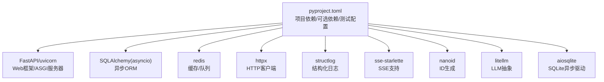

# 调试工具

<cite>
**本文引用的文件**
- [backend/app/main.py](file://backend/app/main.py)
- [backend/app/core/logger.py](file://backend/app/core/logger.py)
- [backend/app/core/tracer.py](file://backend/app/core/tracer.py)
- [backend/app/core/config.py](file://backend/app/core/config.py)
- [backend/app/core/exceptions.py](file://backend/app/core/exceptions.py)
- [backend/app/db/session.py](file://backend/app/db/session.py)
- [backend/app/models/tables.py](file://backend/app/models/tables.py)
- [backend/app/api/task_routes.py](file://backend/app/api/task_routes.py)
- [backend/app/api/stream_routes.py](file://backend/app/api/stream_routes.py)
- [backend/app/orchestrator/engine.py](file://backend/app/orchestrator/engine.py)
- [backend/app/orchestrator/broadcaster.py](file://backend/app/orchestrator/broadcaster.py)
- [backend/tests/conftest.py](file://backend/tests/conftest.py)
- [backend/tests/test_agent_api.py](file://backend/tests/test_agent_api.py)
- [backend/tests/test_task_api.py](file://backend/tests/test_task_api.py)
- [backend/tests/test_workspace.py](file://backend/tests/test_workspace.py)
- [backend/pyproject.toml](file://backend/pyproject.toml)
- [frontend/lib/api.ts](file://frontend/lib/api.ts)
- [frontend/hooks/useTaskSSE.ts](file://frontend/hooks/useTaskSSE.ts)
- [frontend/package.json](file://frontend/package.json)
- [OpenClaw-bot-review-main/Dockerfile](file://OpenClaw-bot-review-main/Dockerfile)
- [scripts/init_db.py](file://scripts/init_db.py)
</cite>

## 目录
1. [简介](#简介)
2. [项目结构](#项目结构)
3. [核心组件](#核心组件)
4. [架构总览](#架构总览)
5. [详细组件分析](#详细组件分析)
6. [依赖分析](#依赖分析)
7. [性能考虑](#性能考虑)
8. [故障排查指南](#故障排查指南)
9. [结论](#结论)
10. [附录](#附录)

## 简介
本指南面向HotClaw项目的开发者与运维人员，提供从Python后端到前端、容器与数据库的全链路调试方法。内容涵盖：
- Python后端：pdb断点调试、结构化日志、异常追踪、性能分析
- 前端：浏览器开发者工具、React DevTools、网络与SSE调试、状态检查
- 容器与部署：Docker镜像构建与运行调试
- 数据库：初始化脚本与查询调试
- API接口：健康检查、SSE事件流、错误码映射
- 常见场景：异步任务、WebSocket/SSE连接、Canvas渲染问题
- 性能监控与内存泄漏检测建议

## 项目结构
HotClaw采用前后端分离架构：
- 后端（FastAPI）：应用入口、中间件、路由、服务层、数据模型与会话管理
- 前端（Next.js）：API客户端、SSE钩子、UI组件与状态管理
- 测试：pytest测试套件
- 运维：Dockerfile、数据库初始化脚本

图表来源
- [backend/app/main.py:1-153](file://backend/app/main.py#L1-L153)
- [backend/app/core/config.py:1-99](file://backend/app/core/config.py#L1-L99)
- [backend/app/core/logger.py:1-36](file://backend/app/core/logger.py#L1-L36)
- [backend/app/core/tracer.py:1-34](file://backend/app/core/tracer.py#L1-L34)
- [backend/app/core/exceptions.py:1-125](file://backend/app/core/exceptions.py#L1-L125)
- [backend/app/db/session.py](file://backend/app/db/session.py)
- [backend/app/models/tables.py](file://backend/app/models/tables.py)
- [backend/app/api/task_routes.py](file://backend/app/api/task_routes.py)
- [backend/app/api/stream_routes.py](file://backend/app/api/stream_routes.py)
- [backend/app/orchestrator/engine.py](file://backend/app/orchestrator/engine.py)
- [backend/app/orchestrator/broadcaster.py](file://backend/app/orchestrator/broadcaster.py)
- [backend/pyproject.toml:1-41](file://backend/pyproject.toml#L1-L41)
- [frontend/lib/api.ts:1-289](file://frontend/lib/api.ts#L1-L289)
- [frontend/hooks/useTaskSSE.ts:1-144](file://frontend/hooks/useTaskSSE.ts#L1-L144)
- [OpenClaw-bot-review-main/Dockerfile:1-27](file://OpenClaw-bot-review-main/Dockerfile#L1-L27)
- [scripts/init_db.py:1-16](file://scripts/init_db.py#L1-L16)

章节来源
- [backend/app/main.py:1-153](file://backend/app/main.py#L1-L153)
- [backend/app/core/config.py:1-99](file://backend/app/core/config.py#L1-L99)
- [frontend/lib/api.ts:1-289](file://frontend/lib/api.ts#L1-L289)
- [frontend/hooks/useTaskSSE.ts:1-144](file://frontend/hooks/useTaskSSE.ts#L1-L144)
- [OpenClaw-bot-review-main/Dockerfile:1-27](file://OpenClaw-bot-review-main/Dockerfile#L1-L27)
- [scripts/init_db.py:1-16](file://scripts/init_db.py#L1-L16)

## 核心组件
- 应用入口与生命周期：负责日志初始化、代理注册、数据库表创建、默认配置初始化、CORS与全局异常处理、路由注册与健康检查
- 结构化日志：基于structlog，输出JSON格式日志，便于集中采集与检索
- 追踪ID：通过上下文变量在HTTP请求中生成并透传trace_id，辅助跨服务链路追踪
- 统一异常：按业务域分类的异常类型，配合全局处理器返回标准化错误响应
- 配置系统：支持从环境变量与.env文件加载，动态注入LLM提供商配置
- 数据库会话与模型：异步SQLAlchemy会话工厂与ORM模型定义
- API路由：任务、流式事件、代理、技能等路由模块
- 编排与广播：工作流编排引擎与事件广播器
- 前端API与SSE：封装REST调用与SSE事件订阅，支持实时任务状态更新

章节来源
- [backend/app/main.py:1-153](file://backend/app/main.py#L1-L153)
- [backend/app/core/logger.py:1-36](file://backend/app/core/logger.py#L1-L36)
- [backend/app/core/tracer.py:1-34](file://backend/app/core/tracer.py#L1-L34)
- [backend/app/core/exceptions.py:1-125](file://backend/app/core/exceptions.py#L1-L125)
- [backend/app/core/config.py:1-99](file://backend/app/core/config.py#L1-L99)
- [backend/app/db/session.py](file://backend/app/db/session.py)
- [backend/app/models/tables.py](file://backend/app/models/tables.py)
- [backend/app/api/task_routes.py](file://backend/app/api/task_routes.py)
- [backend/app/api/stream_routes.py](file://backend/app/api/stream_routes.py)
- [backend/app/orchestrator/engine.py](file://backend/app/orchestrator/engine.py)
- [backend/app/orchestrator/broadcaster.py](file://backend/app/orchestrator/broadcaster.py)
- [frontend/lib/api.ts:1-289](file://frontend/lib/api.ts#L1-L289)
- [frontend/hooks/useTaskSSE.ts:1-144](file://frontend/hooks/useTaskSSE.ts#L1-L144)

## 架构总览
下图展示从浏览器到后端的典型请求路径与SSE事件流。

图表来源
- [backend/app/main.py:69-153](file://backend/app/main.py#L69-L153)
- [backend/app/api/task_routes.py](file://backend/app/api/task_routes.py)
- [backend/app/api/stream_routes.py](file://backend/app/api/stream_routes.py)
- [backend/app/db/session.py](file://backend/app/db/session.py)
- [backend/app/orchestrator/engine.py](file://backend/app/orchestrator/engine.py)
- [backend/app/orchestrator/broadcaster.py](file://backend/app/orchestrator/broadcaster.py)
- [frontend/lib/api.ts:14-55](file://frontend/lib/api.ts#L14-L55)
- [frontend/hooks/useTaskSSE.ts:60-140](file://frontend/hooks/useTaskSSE.ts#L60-L140)

## 详细组件分析

### 后端调试要点（Python/FastAPI）
- pdb断点调试
  - 在路由或服务函数中设置断点，使用调试服务器启动后触发断点
  - 参考：应用入口与路由模块
- 日志系统
  - 使用结构化日志记录关键事件与错误，便于集中检索
  - 参考：日志配置与获取
- 异常追踪
  - 全局异常处理器将未捕获异常记录并返回标准化错误
  - 参考：异常处理与统一异常体系
- 性能分析
  - 使用cProfile/Py-Spy对慢接口进行采样分析
  - 参考：依赖与测试配置

章节来源
- [backend/app/main.py:86-138](file://backend/app/main.py#L86-L138)
- [backend/app/core/logger.py:8-36](file://backend/app/core/logger.py#L8-L36)
- [backend/app/core/exceptions.py:4-125](file://backend/app/core/exceptions.py#L4-L125)
- [backend/pyproject.toml:24-41](file://backend/pyproject.toml#L24-L41)

### 前端调试要点（Next.js/React）
- 浏览器开发者工具
  - Network面板观察REST与SSE请求；Console查看事件日志
  - Elements/Components检查渲染状态
- React DevTools
  - 安装React DevTools扩展，检查组件树与状态变化
- 网络与SSE调试
  - 使用SSE钩子订阅任务事件，关注onerror自动重连行为
  - 参考：SSE钩子与API客户端
- 状态检查
  - 通过SSE钩子返回的状态对象核对节点执行情况

章节来源
- [frontend/lib/api.ts:14-55](file://frontend/lib/api.ts#L14-L55)
- [frontend/hooks/useTaskSSE.ts:60-140](file://frontend/hooks/useTaskSSE.ts#L60-L140)
- [frontend/package.json:1-23](file://frontend/package.json#L1-L23)

### Docker容器调试
- 构建与运行
  - 使用多阶段Dockerfile构建生产镜像，暴露端口并设置环境变量
  - 参考：Dockerfile
- 调试建议
  - 在容器内启用调试端口映射，查看容器日志，验证静态资源与服务端口可达性

章节来源
- [OpenClaw-bot-review-main/Dockerfile:1-27](file://OpenClaw-bot-review-main/Dockerfile#L1-L27)

### 数据库调试
- 初始化脚本
  - 使用异步会话创建所有表，确保模型定义与迁移一致
  - 参考：数据库会话与初始化脚本
- 查询调试
  - 在开发模式下开启详细日志，结合SQLAlchemy事件监听器定位慢查询

章节来源
- [backend/app/db/session.py](file://backend/app/db/session.py)
- [backend/app/models/tables.py](file://backend/app/models/tables.py)
- [scripts/init_db.py:1-16](file://scripts/init_db.py#L1-L16)

### API接口调试
- 健康检查
  - 访问健康端点确认服务可用性
  - 参考：应用入口中的健康检查路由
- 错误码映射
  - 全局异常处理器根据错误类别映射HTTP状态码，便于快速定位问题域
  - 参考：异常处理与统一异常体系
- SSE事件流
  - 通过SSE钩子订阅节点开始/完成/错误与任务完成/错误事件，观察实时状态

章节来源
- [backend/app/main.py:150-153](file://backend/app/main.py#L150-L153)
- [backend/app/main.py:96-138](file://backend/app/main.py#L96-L138)
- [frontend/hooks/useTaskSSE.ts:74-127](file://frontend/hooks/useTaskSSE.ts#L74-L127)

### 常见调试场景
- 异步任务调试
  - 关注编排引擎与事件广播的时序，结合SSE事件核对节点状态
  - 参考：编排引擎与广播器
- WebSocket/SSE连接问题
  - 检查SSE URL构造、浏览器EventSource行为与自动重连策略
  - 参考：SSE钩子与API客户端
- Canvas渲染问题
  - 若涉及Canvas绘制，优先检查数据源与渲染逻辑，再结合浏览器开发者工具定位样式与布局问题

章节来源
- [backend/app/orchestrator/engine.py](file://backend/app/orchestrator/engine.py)
- [backend/app/orchestrator/broadcaster.py](file://backend/app/orchestrator/broadcaster.py)
- [frontend/hooks/useTaskSSE.ts:60-140](file://frontend/hooks/useTaskSSE.ts#L60-L140)
- [frontend/lib/api.ts:48-55](file://frontend/lib/api.ts#L48-L55)

## 依赖分析
后端依赖与测试配置如下：

图表来源
- [backend/pyproject.toml:1-41](file://backend/pyproject.toml#L1-L41)

章节来源
- [backend/pyproject.toml:1-41](file://backend/pyproject.toml#L1-L41)

## 性能考虑
- 日志与追踪
  - 使用结构化日志与Trace ID串联请求链路，便于性能分析与问题定位
- 异步I/O
  - 利用异步SQLAlchemy与httpx减少阻塞，避免长事务与超时
- SSE与事件广播
  - 控制事件频率与消息大小，避免浏览器端内存压力
- 依赖与版本
  - 保持依赖版本稳定，定期评估性能回归

## 故障排查指南
- 后端
  - 启动日志：确认数据库表创建与默认配置初始化是否成功
  - 异常处理：根据错误码映射判断问题域（用户输入、冲突、外部调用、系统）
  - 配置校验：检查.env与环境变量是否正确加载
- 前端
  - 网络：确认API基础路径与SSE URL是否指向正确的后端地址
  - SSE：观察onerror自动重连行为，必要时手动刷新或重启订阅
- 容器
  - 端口映射与静态资源路径，确保服务端口可达
- 数据库
  - 使用初始化脚本重建表结构，核对模型定义一致性

章节来源
- [backend/app/main.py:44-66](file://backend/app/main.py#L44-L66)
- [backend/app/main.py:96-138](file://backend/app/main.py#L96-L138)
- [backend/app/core/config.py:7-16](file://backend/app/core/config.py#L7-L16)
- [frontend/lib/api.ts:14-55](file://frontend/lib/api.ts#L14-L55)
- [frontend/hooks/useTaskSSE.ts:129-133](file://frontend/hooks/useTaskSSE.ts#L129-L133)
- [OpenClaw-bot-review-main/Dockerfile:21-26](file://OpenClaw-bot-review-main/Dockerfile#L21-L26)
- [scripts/init_db.py:8-11](file://scripts/init_db.py#L8-L11)

## 结论
通过结构化日志、统一异常处理、Trace ID追踪、SSE事件流与容器化部署，HotClaw提供了完善的可观测性与可调试性。建议在开发与测试环境中充分利用这些能力，并结合浏览器与React DevTools进行前端问题定位，以快速解决异步任务、连接与渲染等常见问题。

## 附录
- 快速检查清单
  - 后端：日志级别、Trace ID头、健康检查、异常码映射
  - 前端：API基础路径、SSE URL、事件订阅状态
  - 容器：端口映射、静态资源、日志输出
  - 数据库：表结构、初始化脚本、连接URL