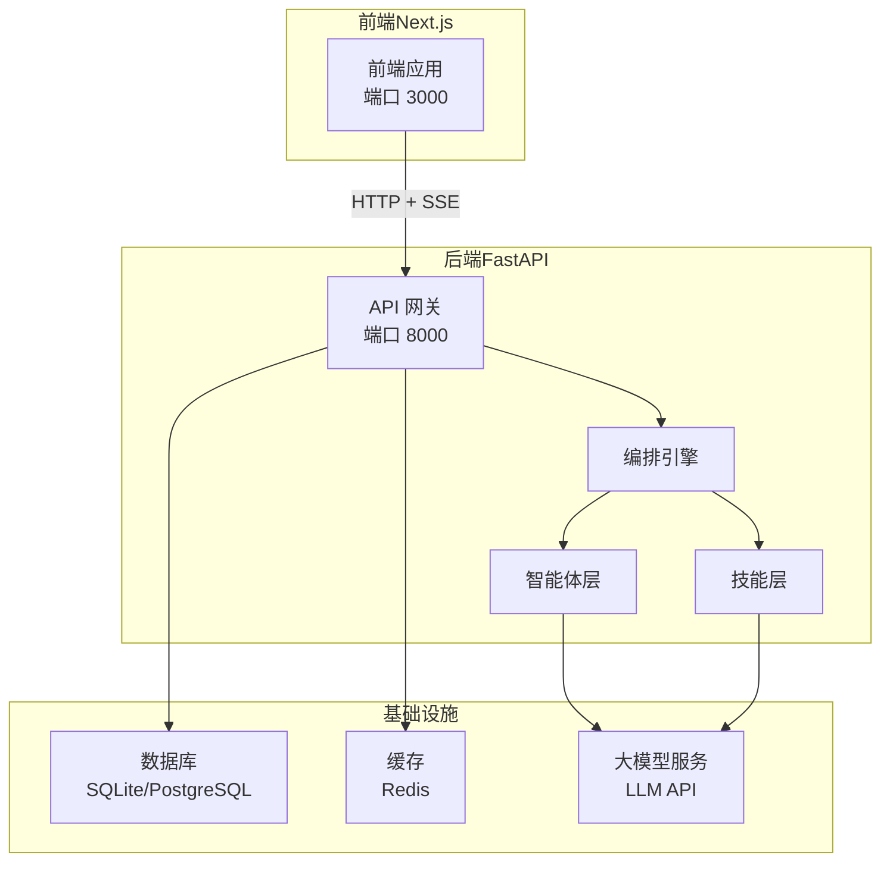
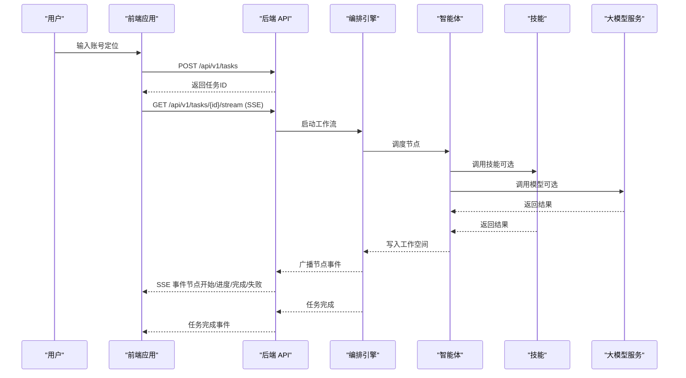
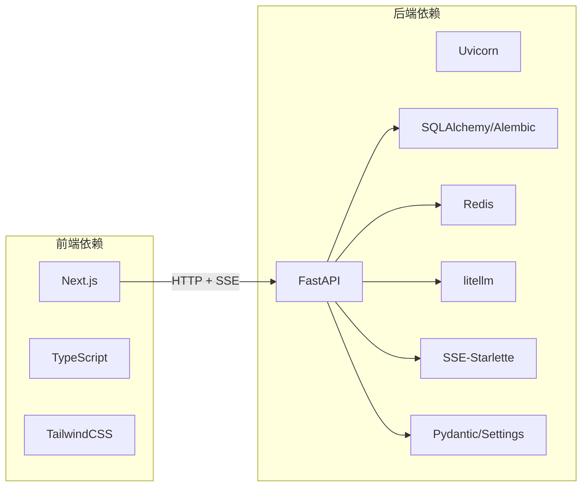

# 快速开始

<cite>
**本文引用的文件**
- [ARCHITECTURE.md](file://ARCHITECTURE.md)
- [start.sh](file://start.sh)
- [start.bat](file://start.bat)
- [backend/pyproject.toml](file://backend/pyproject.toml)
- [frontend/package.json](file://frontend/package.json)
- [OpenClaw-bot-review-main/package.json](file://OpenClaw-bot-review-main/package.json)
- [backend/app/main.py](file://backend/app/main.py)
- [backend/app/core/config.py](file://backend/app/core/config.py)
- [frontend/lib/api.ts](file://frontend/lib/api.ts)
- [frontend/next.config.ts](file://frontend/next.config.ts)
- [backend/alembic.ini](file://backend/alembic.ini)
- [scripts/init_db.py](file://scripts/init_db.py)
</cite>

## 目录
1. [简介](#简介)
2. [项目结构](#项目结构)
3. [核心组件](#核心组件)
4. [架构概览](#架构概览)
5. [详细组件分析](#详细组件分析)
6. [依赖分析](#依赖分析)
7. [性能注意事项](#性能注意事项)
8. [故障排查指南](#故障排查指南)
9. [结论](#结论)
10. [附录](#附录)

## 简介
本指南面向首次使用 HotClaw 的开发者，帮助你在本地快速搭建并运行项目。你将获得：
- 环境前置条件与版本要求
- 后端 Python 与前端 Node.js 依赖安装步骤
- 开发服务器启动命令与步骤
- 必要的环境变量配置说明（如 LLM API 密钥、数据库连接等）
- 首次使用示例：输入账号定位并运行第一个内容生产任务
- 常见启动问题排查与解决方案

## 项目结构
HotClaw 采用前后端分离架构：
- 后端：基于 FastAPI 的 API 网关与编排引擎，负责任务调度、Agent/Skill 执行、SSE 事件推送
- 前端：基于 Next.js 的 React 应用，负责任务创建、运行监控、结果预览与配置管理
- 数据与基础设施：SQLite（开发）或 PostgreSQL（生产）+ Redis（缓存）

图表来源
- [ARCHITECTURE.md](file://ARCHITECTURE.md)
- [frontend/next.config.ts](file://frontend/next.config.ts)
- [backend/app/main.py](file://backend/app/main.py)

章节来源
- [ARCHITECTURE.md](file://ARCHITECTURE.md)
- [frontend/next.config.ts](file://frontend/next.config.ts)
- [backend/app/main.py](file://backend/app/main.py)

## 核心组件
- 后端（FastAPI）
  - 路由与中间件：CORS、全局异常处理、SSE 事件推送
  - 应用生命周期：启动时自动创建数据库表
  - 环境配置：通过 pydantic-settings 从 .env 读取配置
- 前端（Next.js）
  - 代理转发：将 /api/* 请求转发至后端 8000 端口
  - API 客户端：封装统一的请求与错误处理
- 数据库与缓存
  - 开发默认 SQLite，生产建议 PostgreSQL
  - Redis 用于缓存与会话状态

章节来源
- [backend/app/main.py](file://backend/app/main.py)
- [backend/app/core/config.py](file://backend/app/core/config.py)
- [frontend/lib/api.ts](file://frontend/lib/api.ts)
- [frontend/next.config.ts](file://frontend/next.config.ts)

## 架构概览
HotClaw 的核心流程如下：
- 用户在前端输入“账号定位”
- 前端调用后端创建任务
- 后端编排引擎按工作流顺序调度各 Agent
- Agent 通过 Skill 与 LLM 完成任务节点
- 后端通过 SSE 实时推送节点状态
- 前端接收事件并渲染可视化

图表来源
- [ARCHITECTURE.md](file://ARCHITECTURE.md)
- [frontend/lib/api.ts](file://frontend/lib/api.ts)
- [backend/app/main.py](file://backend/app/main.py)

## 详细组件分析

### 环境与前置条件
- Python
  - 版本要求：3.11+
  - 用途：后端 FastAPI 服务、数据库迁移与脚本
- Node.js
  - 版本要求：18+
  - 用途：前端 Next.js 开发服务器与构建
- 数据库
  - 开发：SQLite（默认）
  - 生产：PostgreSQL（需配置连接串）
- 缓存
  - Redis（默认本地地址）
- 大模型服务
  - 需要有效的 LLM API 密钥与基础地址

章节来源
- [backend/pyproject.toml](file://backend/pyproject.toml)
- [frontend/package.json](file://frontend/package.json)
- [OpenClaw-bot-review-main/package.json](file://OpenClaw-bot-review-main/package.json)
- [backend/app/core/config.py](file://backend/app/core/config.py)

### 依赖安装步骤
- 后端 Python 依赖
  - 使用项目提供的启动脚本自动创建虚拟环境并安装依赖
  - 或手动执行：在 backend 目录创建虚拟环境并安装开发依赖
- 前端 Node.js 依赖
  - 在 frontend 目录执行安装（若已存在 node_modules 则跳过）

章节来源
- [start.sh](file://start.sh)
- [start.bat](file://start.bat)
- [backend/pyproject.toml](file://backend/pyproject.toml)
- [frontend/package.json](file://frontend/package.json)

### 开发服务器启动
- 方式一：使用一键启动脚本
  - Linux/macOS：执行脚本自动安装依赖并启动后端（8000）与前端（3000）
  - Windows：执行批处理脚本，自动安装依赖并启动后端与前端
- 方式二：手动分别启动
  - 后端：进入 backend 目录，激活虚拟环境，启动 Uvicorn
  - 前端：进入 frontend 目录，启动 Next.js 开发服务器
- 访问
  - 前端：http://localhost:3000
  - 后端 API 文档：http://localhost:8000/docs

章节来源
- [start.sh](file://start.sh)
- [start.bat](file://start.bat)
- [backend/app/main.py](file://backend/app/main.py)

### 环境变量配置
- 数据库连接
  - 开发默认 SQLite：无需额外配置
  - 生产建议使用 PostgreSQL，设置数据库连接串
- Redis
  - 默认本地 Redis，可按需调整
- LLM
  - 设置 LLM API 密钥与基础地址
  - 可配置默认模型名称
- 应用与日志
  - 环境、调试开关、监听地址与端口、日志级别
- 超时
  - Agent、Skill、LLM 调用超时时间

章节来源
- [backend/app/core/config.py](file://backend/app/core/config.py)
- [backend/alembic.ini](file://backend/alembic.ini)

### 首次使用示例
- 在前端首页输入“账号定位”描述，例如“我是一个关注职场成长的公众号，目标读者是 25-35 岁的互联网从业者”
- 点击“创建任务”，等待后端返回任务 ID
- 进入任务运行页，观察各节点状态变化（账号解析、热点分析、选题策划、标题生成、正文生成、审核）
- 任务完成后，在结果页查看候选选题、标题与正文，并可导出草稿

章节来源
- [ARCHITECTURE.md](file://ARCHITECTURE.md)
- [frontend/lib/api.ts](file://frontend/lib/api.ts)

## 依赖分析
- 后端依赖
  - Web 框架：FastAPI + Uvicorn
  - 数据库：SQLAlchemy + Alembic（异步驱动）
  - 缓存：Redis
  - LLM：litellm（或其他模型 SDK）
  - 实时通信：SSE-Starlette
  - 配置与校验：Pydantic + Pydantic-Settings
- 前端依赖
  - 框架：Next.js + React + TypeScript
  - UI：TailwindCSS
  - 构建与开发：Turbopack（开发模式）

图表来源
- [backend/pyproject.toml](file://backend/pyproject.toml)
- [frontend/package.json](file://frontend/package.json)

章节来源
- [backend/pyproject.toml](file://backend/pyproject.toml)
- [frontend/package.json](file://frontend/package.json)

## 性能注意事项
- SSE 事件推送：前端通过 EventSource 消费后端事件，注意网络延迟与浏览器并发限制
- LLM 调用：合理设置超时与重试策略，避免阻塞工作流
- 数据库与缓存：生产环境建议使用 PostgreSQL + Redis，避免 SQLite 的并发瓶颈
- 前端开发：使用 Turbopack 加速热更新与构建

## 故障排查指南
- 启动脚本提示缺少 Python 或 Node.js
  - 确认已安装 Python 3.11+ 与 Node.js 18+
- 后端无法连接数据库
  - 开发环境默认 SQLite，若使用 PostgreSQL，请正确配置连接串
  - 可使用数据库初始化脚本创建表结构
- 前端无法访问后端 API
  - 检查前端 next.config.ts 的重写配置是否将 /api/* 转发至后端 8000 端口
- LLM 调用失败
  - 检查 LLM API 密钥、基础地址与默认模型配置
- 端口占用
  - 后端默认 8000，前端默认 3000，确保端口未被占用
- Windows 启动后端/前端窗口立即关闭
  - 批处理脚本会在启动后保持窗口以便查看日志，必要时手动关闭

章节来源
- [start.sh](file://start.sh)
- [start.bat](file://start.bat)
- [backend/app/core/config.py](file://backend/app/core/config.py)
- [frontend/next.config.ts](file://frontend/next.config.ts)
- [scripts/init_db.py](file://scripts/init_db.py)

## 结论
通过本指南，你可以完成 HotClaw 的环境准备、依赖安装与开发服务器启动，并成功运行首个内容生产任务。后续可根据需要调整数据库与缓存配置，以及 LLM 服务参数。

## 附录
- 启动脚本与命令
  - Linux/macOS：执行脚本自动安装依赖并启动后端与前端
  - Windows：执行批处理脚本自动安装依赖并启动后端与前端
- 数据库初始化
  - 可使用脚本在开发环境创建所需表结构

章节来源
- [start.sh](file://start.sh)
- [start.bat](file://start.bat)
- [scripts/init_db.py](file://scripts/init_db.py)