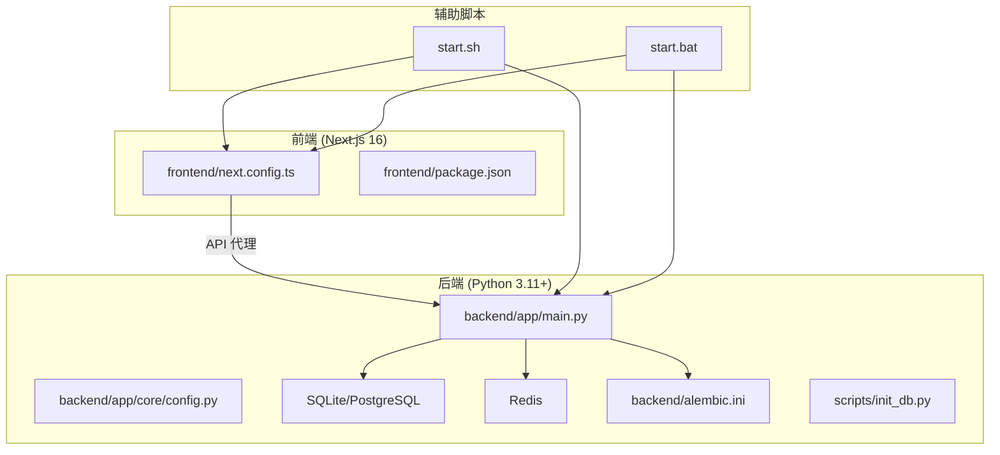
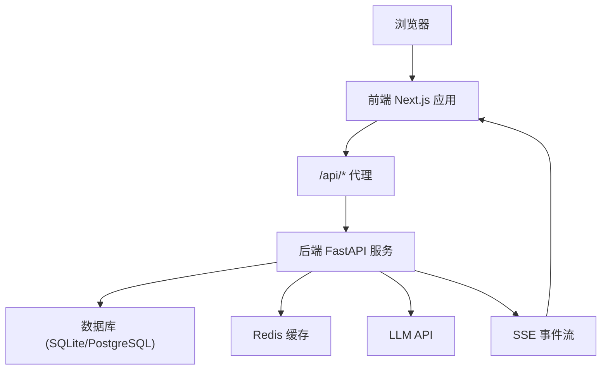
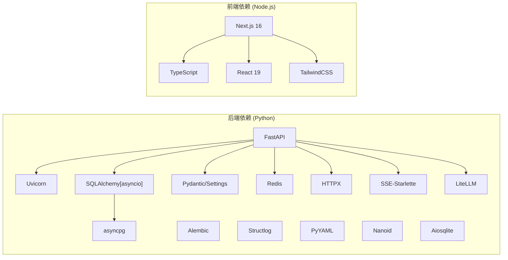

# 快速开始

<cite>
**本文引用的文件**
- [ARCHITECTURE.md](file://ARCHITECTURE.md)
- [backend/pyproject.toml](file://backend/pyproject.toml)
- [frontend/package.json](file://frontend/package.json)
- [OpenClaw-bot-review-main/package.json](file://OpenClaw-bot-review-main/package.json)
- [backend/app/main.py](file://backend/app/main.py)
- [backend/app/core/config.py](file://backend/app/core/config.py)
- [backend/alembic.ini](file://backend/alembic.ini)
- [scripts/init_db.py](file://scripts/init_db.py)
- [frontend/next.config.ts](file://frontend/next.config.ts)
- [start.sh](file://start.sh)
- [start.bat](file://start.bat)
- [OpenClaw-bot-review-main/README.md](file://OpenClaw-bot-review-main/README.md)
</cite>

## 目录
1. [简介](#简介)
2. [项目结构](#项目结构)
3. [核心组件](#核心组件)
4. [架构概览](#架构概览)
5. [详细组件分析](#详细组件分析)
6. [依赖分析](#依赖分析)
7. [性能注意事项](#性能注意事项)
8. [故障排除指南](#故障排除指南)
9. [结论](#结论)
10. [附录](#附录)

## 简介
本指南面向新开发者，帮助你在最短时间内成功运行 HotClaw 项目。HotClaw 是一个基于多智能体协作的微信公众号内容生产平台，包含后端 FastAPI 服务与前端 Next.js 应用。你将学会：
- 环境准备（Python 3.11+、Node.js、数据库等）
- 项目克隆与依赖安装
- 环境变量配置
- 本地开发环境启动（后端 + 前端）
- Docker 容器化部署方案
- 常见问题与故障排除

## 项目结构
项目采用前后端分离架构，后端使用 Python 3.11+ 与 FastAPI，前端使用 Next.js 16 + TypeScript。根目录包含后端、前端、脚本与文档等模块。

```mermaid
graph TB
subgraph "后端 (Python 3.11+)"
BE_MAIN["backend/app/main.py"]
BE_CFG["backend/app/core/config.py"]
BE_DB["SQLite/PostgreSQL"]
BE_REDIS["Redis"]
BE_ALEMBIC["backend/alembic.ini"]
BE_SCRIPTS["scripts/init_db.py"]
end
subgraph "前端 (Next.js 16)"
FE_NEXT["frontend/next.config.ts"]
FE_PKG["frontend/package.json"]
end
subgraph "辅助脚本"
SH_START["start.sh"]
BAT_START["start.bat"]
end
FE_NEXT --> |"API 代理"| BE_MAIN
BE_MAIN --> BE_DB
BE_MAIN --> BE_REDIS
BE_MAIN --> BE_ALEMBIC
SH_START --> BE_MAIN
SH_START --> FE_NEXT
BAT_START --> BE_MAIN
BAT_START --> FE_NEXT
```

**图表来源**
- [backend/app/main.py:1-142](file://backend/app/main.py#L1-L142)
- [backend/app/core/config.py:1-51](file://backend/app/core/config.py#L1-L51)
- [backend/alembic.ini:1-39](file://backend/alembic.ini#L1-L39)
- [scripts/init_db.py:1-16](file://scripts/init_db.py#L1-L16)
- [frontend/next.config.ts:1-15](file://frontend/next.config.ts#L1-L15)
- [start.sh:1-79](file://start.sh#L1-L79)
- [start.bat:1-74](file://start.bat#L1-L74)

**章节来源**
- [ARCHITECTURE.md:1-200](file://ARCHITECTURE.md#L1-L200)
- [backend/app/main.py:1-142](file://backend/app/main.py#L1-L142)
- [frontend/next.config.ts:1-15](file://frontend/next.config.ts#L1-L15)

## 核心组件
- 后端服务（FastAPI）
  - 应用入口与生命周期管理
  - 路由注册（任务、流式事件、智能体、技能）
  - 全局异常处理与跨域中间件
  - 健康检查端点
- 配置系统（Pydantic Settings）
  - 数据库连接（SQLite 开发/PostgreSQL 生产）
  - Redis 连接
  - LLM API 配置（密钥、基础地址、默认模型）
  - 应用运行参数（主机、端口、调试、日志级别）
  - 超时配置（智能体、技能、LLM）
- 数据库与迁移
  - 开发默认 SQLite，生产推荐 PostgreSQL
  - Alembic 配置与初始化脚本
- 前端代理
  - 将 /api/* 请求转发至后端 8000 端口
- 启动脚本
  - 自动检查 Python 3.11+ 与 Node.js 18+
  - 自动创建虚拟环境、安装依赖
  - 同时启动后端（Uvicorn）与前端（Next.js）

**章节来源**
- [backend/app/main.py:1-142](file://backend/app/main.py#L1-L142)
- [backend/app/core/config.py:1-51](file://backend/app/core/config.py#L1-L51)
- [backend/alembic.ini:1-39](file://backend/alembic.ini#L1-L39)
- [scripts/init_db.py:1-16](file://scripts/init_db.py#L1-L16)
- [frontend/next.config.ts:1-15](file://frontend/next.config.ts#L1-L15)
- [start.sh:1-79](file://start.sh#L1-L79)
- [start.bat:1-74](file://start.bat#L1-L74)

## 架构概览
系统采用“前后端分离 + SSE 实时推送”的设计。前端通过 /api/* 代理访问后端，后端通过 SSE 将任务节点状态推送给前端，实现可视化运行链路。

```mermaid
graph TB
Browser["浏览器"] --> FE["前端 Next.js 应用"]
FE --> API["/api/* 代理"]
API --> BE["后端 FastAPI 服务"]
BE --> DB["数据库 (SQLite/PostgreSQL)"]
BE --> REDIS["Redis 缓存"]
BE --> LLM["LLM API"]
BE --> SSE["SSE 事件流"]
SSE --> FE
```

**图表来源**
- [ARCHITECTURE.md:325-360](file://ARCHITECTURE.md#L325-L360)
- [frontend/next.config.ts:4-11](file://frontend/next.config.ts#L4-L11)
- [backend/app/main.py:132-142](file://backend/app/main.py#L132-L142)

**章节来源**
- [ARCHITECTURE.md:325-360](file://ARCHITECTURE.md#L325-L360)
- [frontend/next.config.ts:1-15](file://frontend/next.config.ts#L1-L15)
- [backend/app/main.py:132-142](file://backend/app/main.py#L132-L142)

## 详细组件分析

### 环境准备与前置条件
- Python 3.11+
  - 后端依赖要求 Python >= 3.11
  - 启动脚本会检测并提示安装
- Node.js 18+
  - 前端 Next.js 16 需要 Node.js 18+
  - 启动脚本会检测并提示安装
- 数据库
  - 开发环境默认使用 SQLite（无需额外安装）
  - 生产建议使用 PostgreSQL（需自行准备数据库实例）
- Redis
  - 用于缓存与会话状态管理（默认本地 6379）
- LLM API
  - 需要有效的 API Key 与基础地址（可在环境变量中配置）

**章节来源**
- [backend/pyproject.toml:5](file://backend/pyproject.toml#L5)
- [backend/app/core/config.py:11-31](file://backend/app/core/config.py#L11-L31)
- [start.sh:11-21](file://start.sh#L11-L21)
- [start.bat:10-24](file://start.bat#L10-L24)

### 项目克隆与依赖安装
- 克隆仓库
  - 使用 Git 克隆根目录
- 后端依赖
  - 自动创建虚拟环境并安装依赖（包含开发依赖）
- 前端依赖
  - 安装 Next.js 16 + TypeScript + TailwindCSS 相关包

**章节来源**
- [start.sh:23-39](file://start.sh#L23-L39)
- [start.bat:26-45](file://start.bat#L26-L45)
- [backend/pyproject.toml:24-29](file://backend/pyproject.toml#L24-L29)
- [frontend/package.json:1-23](file://frontend/package.json#L1-L23)

### 环境变量配置
- 数据库连接
  - 开发：SQLite（默认）
  - 生产：PostgreSQL 连接字符串
- Redis 连接
  - 默认本地 Redis
- LLM 配置
  - API Key、基础地址、默认模型名
- 应用参数
  - 运行环境、调试开关、主机、端口、日志级别
- 超时设置
  - 智能体、技能、LLM 的超时秒数

**章节来源**
- [backend/app/core/config.py:7-51](file://backend/app/core/config.py#L7-L51)
- [backend/alembic.ini:3-5](file://backend/alembic.ini#L3-L5)

### 本地开发环境启动
- 方式一：使用启动脚本（推荐）
  - Linux/macOS：执行 start.sh，自动安装依赖并同时启动后端与前端
  - Windows：执行 start.bat，自动安装依赖并同时启动后端与前端
- 方式二：手动启动
  - 后端：进入 backend 目录，激活虚拟环境，启动 Uvicorn（默认 0.0.0.0:8000）
  - 前端：进入 frontend 目录，启动 Next.js 开发服务器（默认 3000）
- API 文档
  - 后端提供 OpenAPI 文档：http://localhost:8000/docs

**章节来源**
- [start.sh:51-79](file://start.sh#L51-L79)
- [start.bat:47-74](file://start.bat#L47-L74)
- [backend/app/main.py:60-65](file://backend/app/main.py#L60-L65)
- [frontend/next.config.ts:4-11](file://frontend/next.config.ts#L4-L11)

### Docker 容器化部署（快速启动）
- 前端镜像构建与运行
  - 使用前端目录的 Dockerfile（若存在）构建镜像并运行
  - 暴露前端端口（如 3000）
- 后端镜像构建与运行
  - 使用后端目录的 Dockerfile（若存在）构建镜像并运行
  - 暴露后端端口（如 8000）
- 数据库与缓存
  - 建议使用独立容器运行 PostgreSQL 与 Redis
- 网络与端口映射
  - 将容器端口映射到宿主机端口
- 注意事项
  - 确保容器网络互通
  - 环境变量与卷挂载（如数据库连接、静态资源）

**章节来源**
- [frontend/package.json:5-10](file://frontend/package.json#L5-L10)
- [OpenClaw-bot-review-main/README.md:78-96](file://OpenClaw-bot-review-main/README.md#L78-L96)

### 数据库初始化与迁移
- 初始化
  - 使用脚本创建所有表（适用于 SQLite）
- 迁移
  - 使用 Alembic 配置进行数据库版本管理（生产环境建议使用 PostgreSQL）

**章节来源**
- [scripts/init_db.py:1-16](file://scripts/init_db.py#L1-L16)
- [backend/alembic.ini:1-39](file://backend/alembic.ini#L1-L39)

## 依赖分析
后端与前端的关键依赖如下：

```mermaid
graph LR
subgraph "后端依赖 (Python)"
FAPI["FastAPI"]
UV["Uvicorn"]
SQLA["SQLAlchemy[asyncio]"]
PSQL["asyncpg"]
ALEMBIC["Alembic"]
PYD["Pydantic/Settings"]
REDIS["Redis"]
HTTPX["HTTPX"]
STRCTL["Structlog"]
YAML["PyYAML"]
SSE["SSE-Starlette"]
NANO["Nanoid"]
LITELLM["LiteLLM"]
SQLITE["Aiosqlite"]
end
subgraph "前端依赖 (Node.js)"
NEXT["Next.js 16"]
TS["TypeScript"]
TAIL["TailwindCSS"]
REACT["React 19"]
end
FAPI --> UV
FAPI --> SQLA
SQLA --> PSQL
FAPI --> PYD
FAPI --> REDIS
FAPI --> HTTPX
FAPI --> SSE
FAPI --> LITELLM
NEXT --> TS
NEXT --> REACT
NEXT --> TAIL
```

**图表来源**
- [backend/pyproject.toml:6-22](file://backend/pyproject.toml#L6-L22)
- [frontend/package.json:11-21](file://frontend/package.json#L11-L21)

**章节来源**
- [backend/pyproject.toml:1-41](file://backend/pyproject.toml#L1-L41)
- [frontend/package.json:1-23](file://frontend/package.json#L1-L23)

## 性能注意事项
- 合理设置超时
  - 根据 LLM 模型与网络情况调整智能体、技能与 LLM 超时
- 数据库与缓存
  - 生产环境使用 PostgreSQL，结合 Redis 缓存热点数据
- SSE 推送
  - 前端使用 EventSource 接收事件，避免频繁轮询
- 日志与追踪
  - 使用结构化日志与全局追踪 ID，便于问题定位

[本节为通用建议，无需特定文件引用]

## 故障排除指南
- Python 版本不满足要求
  - 现象：启动脚本报错，提示需要 Python 3.11+
  - 解决：安装 Python 3.11+ 并重新运行启动脚本
- Node.js 版本不满足要求
  - 现象：前端无法启动或报错
  - 解决：安装 Node.js 18+ 并重新安装依赖
- 数据库连接失败
  - 现象：后端启动时报数据库错误
  - 解决：确认数据库 URL 设置正确（开发默认 SQLite，生产使用 PostgreSQL）
- Redis 连接失败
  - 现象：后端启动时报 Redis 连接错误
  - 解决：确认 Redis 地址与端口正确，或在环境中调整配置
- 前端无法访问后端 API
  - 现象：页面无法获取数据或报跨域错误
  - 解决：确认前端 next.config.ts 的 /api/* 代理已启用，后端已启动
- 启动脚本无法执行
  - 现象：Windows 下 .bat 无法运行，Linux/macOS 下 .sh 无权限
  - 解决：授予执行权限或使用管理员权限运行

**章节来源**
- [start.sh:11-21](file://start.sh#L11-L21)
- [start.bat:10-24](file://start.bat#L10-L24)
- [backend/app/core/config.py:11-20](file://backend/app/core/config.py#L11-L20)
- [frontend/next.config.ts:4-11](file://frontend/next.config.ts#L4-L11)

## 结论
通过本指南，你可以完成环境准备、项目克隆、依赖安装与本地启动，并了解容器化部署思路。建议在开发过程中：
- 使用启动脚本快速启动
- 在开发环境使用 SQLite，生产使用 PostgreSQL
- 合理配置 LLM 与 Redis
- 关注 SSE 实时事件流与日志追踪

[本节为总结，无需特定文件引用]

## 附录

### API 路由与健康检查
- 后端提供统一健康检查端点，可用于容器探针与运维监控
- 前端通过 /api/* 代理访问后端路由

**章节来源**
- [backend/app/main.py:139-142](file://backend/app/main.py#L139-L142)
- [frontend/next.config.ts:4-11](file://frontend/next.config.ts#L4-L11)

### 前后端分离与实时通信
- 前后端职责清晰，前端专注可视化与交互，后端专注编排与业务逻辑
- SSE 事件流用于实时推送节点状态，提升用户体验

**章节来源**
- [ARCHITECTURE.md:80-89](file://ARCHITECTURE.md#L80-L89)
- [ARCHITECTURE.md:325-360](file://ARCHITECTURE.md#L325-L360)