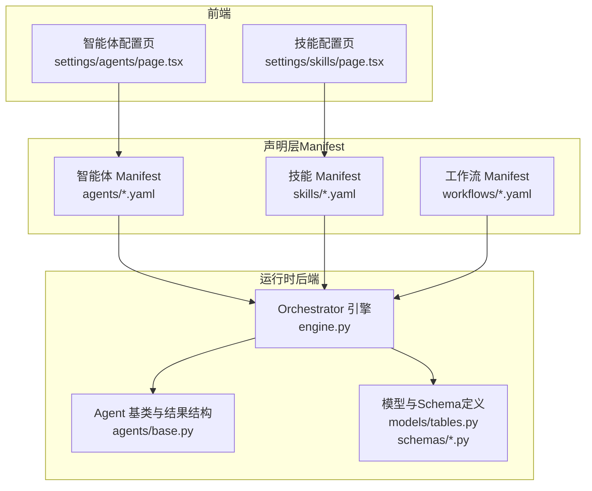
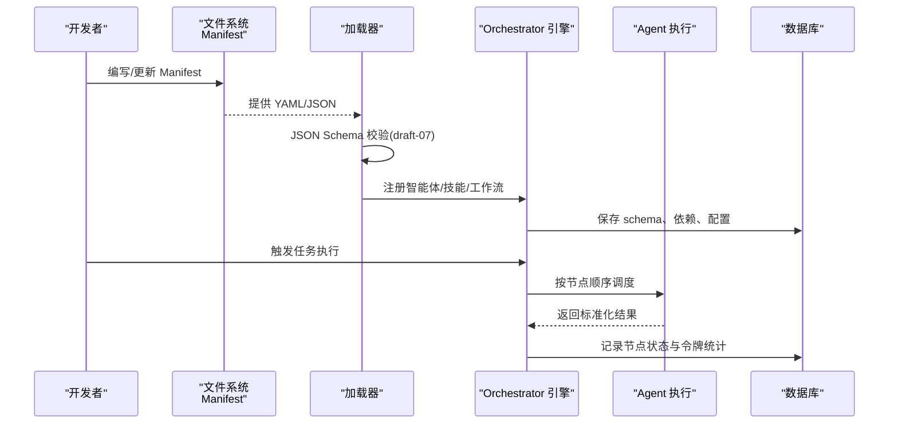
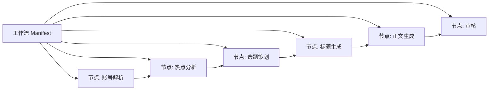

# Manifest文件格式

<cite>
**本文引用的文件**
- [ARCHITECTURE.md](file://ARCHITECTURE.md)
- [Notice.md](file://Notice.md)
- [backend/app/models/tables.py](file://backend/app/models/tables.py)
- [backend/app/orchestrator/engine.py](file://backend/app/orchestrator/engine.py)
- [backend/app/agents/base.py](file://backend/app/agents/base.py)
- [backend/app/schemas/agent.py](file://backend/app/schemas/agent.py)
- [backend/app/schemas/skill.py](file://backend/app/schemas/skill.py)
- [backend/app/schemas/common.py](file://backend/app/schemas/common.py)
- [frontend/app/settings/agents/page.tsx](file://frontend/app/settings/agents/page.tsx)
- [frontend/app/settings/skills/page.tsx](file://frontend/app/settings/skills/page.tsx)
- [OpenClaw-bot-review-main/lib/openclaw-skills.ts](file://OpenClaw-bot-review-main/lib/openclaw-skills.ts)
</cite>

## 目录
1. [简介](#简介)
2. [项目结构](#项目结构)
3. [核心组件](#核心组件)
4. [架构总览](#架构总览)
5. [详细组件分析](#详细组件分析)
6. [依赖分析](#依赖分析)
7. [性能考量](#性能考量)
8. [故障排查指南](#故障排查指南)
9. [结论](#结论)
10. [附录](#附录)

## 简介
本规范文档面向开发者，系统化阐述 HotClaw 平台的 Manifest 文件格式与使用方法，覆盖 YAML/JSON 语法规则、字段定义、数据类型与嵌套结构；重点说明智能体 Manifest 的配置项（agent_id、name、description、parameters、dependencies 等），技能 Manifest 的结构规范（技能类型、参数 schema、执行条件与返回格式），以及工作流 Manifest 的完整示例（节点定义、连接关系与执行策略）。同时解释 Manifest 的验证机制、默认值处理与版本兼容性，并给出 Manifest 编辑器推荐、语法高亮与自动补全工具建议，最后提供模板库与最佳实践指南。

## 项目结构
Manifest 在系统中扮演“声明式注册”的核心角色，贯穿智能体、技能与工作流的生命周期。根据仓库中的架构与实现，Manifest 主要分布于以下位置与职责：
- 智能体 Manifest：用于声明智能体的身份、名称、描述、系统提示、输入输出 schema、依赖技能、重试与降级策略等。
- 技能 Manifest：用于声明技能的身份、名称、描述、版本、模块路径、输入输出 schema、配置数据等。
- 工作流 Manifest：用于声明节点顺序、依赖关系、输入映射、输出键、执行策略等。
- 验证与持久化：运行时通过 JSON Schema（draft-07）与 Pydantic 校验输入输出；数据库中以 JSON 字段存储 schema、依赖与配置。

图表来源
- [backend/app/orchestrator/engine.py:115-227](file://backend/app/orchestrator/engine.py#L115-L227)
- [backend/app/agents/base.py:1-56](file://backend/app/agents/base.py#L1-L56)
- [backend/app/models/tables.py:171-194](file://backend/app/models/tables.py#L171-L194)
- [frontend/app/settings/agents/page.tsx](file://frontend/app/settings/agents/page.tsx)
- [frontend/app/settings/skills/page.tsx](file://frontend/app/settings/skills/page.tsx)

章节来源
- [ARCHITECTURE.md:92-123](file://ARCHITECTURE.md#L92-L123)
- [Notice.md:124-226](file://Notice.md#L124-L226)

## 核心组件
- 智能体（Agent）
  - 角色：工作流节点角色，负责单一业务任务，返回结构化 JSON，可调用技能。
  - 关键字段：agent_id、name、description、default_system_prompt、input_schema、output_schema、required_skills、retry_config、fallback_config、status。
- 技能（Skill）
  - 角色：无状态的原子能力，被 Agent 调用，具备输入输出 schema 与可配置参数。
  - 关键字段：skill_id、name、description、version、module_path、input_schema、output_schema、config_data。
- 工作流（Workflow）
  - 角色：定义节点顺序与依赖关系的有向无环图（DAG），MVP 阶段为线性链。
  - 关键字段：nodes、edges、entry_node、input_mapping、output_key、retry_config、fallback_config。

章节来源
- [backend/app/agents/base.py:1-56](file://backend/app/agents/base.py#L1-L56)
- [backend/app/models/tables.py:171-194](file://backend/app/models/tables.py#L171-L194)
- [ARCHITECTURE.md:641-666](file://ARCHITECTURE.md#L641-L666)

## 架构总览
Manifest 在系统中的作用与流转如下：
- 声明期：YAML/JSON Manifest 描述智能体、技能与工作流。
- 加载期：系统启动时扫描 Manifest，进行 JSON Schema 校验并注册。
- 运行期：Orchestrator 依据工作流定义调度智能体，按输入映射抽取数据，执行后写回输出键；失败时按重试/降级策略处理。
- 可视化：前端页面展示智能体与技能配置，支持查看与编辑。

图表来源
- [ARCHITECTURE.md:985-991](file://ARCHITECTURE.md#L985-L991)
- [backend/app/orchestrator/engine.py:115-227](file://backend/app/orchestrator/engine.py#L115-L227)
- [backend/app/models/tables.py:171-194](file://backend/app/models/tables.py#L171-L194)

## 详细组件分析

### YAML/JSON 语法规则与字段规范
- 通用规则
  - 使用 YAML 或 JSON 表达，推荐 YAML 以提升可读性。
  - 字段名区分大小写；字符串类型字段建议使用双引号包裹，避免歧义。
  - 数组与对象嵌套时保持缩进一致，避免混合缩进导致解析错误。
  - 版本字段采用语义化版本（SemVer），默认值遵循平台约定。
- 数据类型
  - 字符串：用于标识符、名称、描述、路径等。
  - 数字：整数/浮点数，用于计数、阈值、权重等。
  - 布尔：true/false，用于开关控制。
  - 数组：用于列表型配置（如 required_skills、sources）。
  - 对象：用于嵌套结构（如 input_schema、output_schema、config）。
- 嵌套结构
  - JSON Schema（draft-07）作为输入输出约束，支持 required、properties、items、type 等关键字。
  - config 为任意键值对，用于技能参数与运行时配置。

章节来源
- [ARCHITECTURE.md:985-991](file://ARCHITECTURE.md#L985-L991)

### 智能体 Manifest 规范
- 必填字段
  - agent_id：智能体唯一标识符，字符串，长度限制见平台约束。
  - name：智能体显示名称，字符串。
  - description：简要描述，字符串。
  - default_system_prompt：默认系统提示词，字符串。
- 可选字段
  - input_schema：JSON Schema（draft-07），定义输入约束。
  - output_schema：JSON Schema（draft-07），定义输出约束。
  - required_skills：数组，列出依赖的技能标识符。
  - retry_config：对象，定义重试策略（次数、退避、超时等）。
  - fallback_config：对象，定义降级策略（默认输出、替代行为）。
  - status：枚举，active/inactive，默认 active。
- 默认值与兼容性
  - 若未提供 input_schema 或 output_schema，表示不限制输入输出结构，但不建议在生产环境使用。
  - version 字段未提供时，采用默认版本（如 1.0.0），确保后续升级兼容。
- 典型用途
  - 账号定位解析、热点分析、选题策划、标题生成、正文生成、审核评估等。

章节来源
- [backend/app/agents/base.py:1-56](file://backend/app/agents/base.py#L1-L56)
- [backend/app/models/tables.py:171-176](file://backend/app/models/tables.py#L171-L176)
- [ARCHITECTURE.md:985-991](file://ARCHITECTURE.md#L985-L991)

### 技能 Manifest 规范
- 必填字段
  - skill_id：技能唯一标识符，字符串。
  - name：技能显示名称，字符串。
  - description：简要描述，字符串。
  - module_path：技能实现的模块路径（Python 模块定位），字符串。
- 可选字段
  - version：语义化版本，默认 1.0.0。
  - input_schema：JSON Schema（draft-07），定义输入约束。
  - output_schema：JSON Schema（draft-07），定义输出约束。
  - config_data：对象，技能运行时配置（如 API 凭据、速率限制、缓存 TTL 等）。
- 执行条件与返回格式
  - 执行前：对输入进行 JSON Schema 校验；失败抛出 SchemaValidationError。
  - 执行后：对输出进行 JSON Schema 校验；失败触发降级策略。
  - 返回格式：遵循统一的结构化 JSON，便于上层编排与前端展示。
- 典型用途
  - 新闻抓取、文本摘要、风险检测、标题评分等。

章节来源
- [backend/app/models/tables.py:183-194](file://backend/app/models/tables.py#L183-L194)
- [ARCHITECTURE.md:932-991](file://ARCHITECTURE.md#L932-L991)

### 工作流 Manifest 规范
- 必填字段
  - nodes：数组，每个元素定义一个节点，包含 node_id、agent_id、input_mapping、output_key 等。
  - edges：数组，定义节点间的依赖关系（拓扑排序）。
  - entry_node：入口节点标识符，字符串。
- 可选字段
  - input_mapping：对象，将上游输出映射到当前节点输入键。
  - output_key：字符串，当前节点输出写入工作空间的键。
  - retry_config/fallback_config：同智能体。
- 执行策略
  - 线性链：MVP 阶段默认顺序执行，节点失败时按 required 标记决定是否中断。
  - DAG：数据结构支持未来扩展为有向无环图，但当前实现为线性链。
- 典型用途
  - 账号定位解析 → 热点分析 → 选题策划 → 标题生成 → 正文生成 → 审核评估。

章节来源
- [backend/app/orchestrator/engine.py:115-227](file://backend/app/orchestrator/engine.py#L115-L227)
- [Notice.md:167-188](file://Notice.md#L167-L188)

### 验证机制、默认值与版本兼容
- 验证机制
  - 输入/输出校验：使用 JSON Schema（draft-07）与 Pydantic，在执行前与执行后分别校验。
  - 校验失败处理：抛出 SchemaValidationError，由 Orchestrator 按降级策略处理。
- 默认值
  - status：默认 active。
  - version：默认 1.0.0。
  - retry_config/fallback_config：未提供时采用系统默认策略。
- 版本兼容
  - 通过语义化版本管理升级；升级时需保证 JSON Schema 向后兼容，避免破坏性变更。

章节来源
- [ARCHITECTURE.md:985-991](file://ARCHITECTURE.md#L985-L991)
- [backend/app/models/tables.py:171-194](file://backend/app/models/tables.py#L171-L194)

### 编辑器推荐、语法高亮与自动补全
- 编辑器推荐
  - VS Code：安装 YAML/JSON 相关扩展，启用 JSON Schema 校验与自动补全。
  - WebStorm/IntelliJ IDEA：支持 YAML/JSON 与 JSON Schema。
- 语法高亮与自动补全
  - 使用 JSON Schema draft-07 为编辑器提供智能提示，减少拼写与类型错误。
  - 建议为 manifests 目录配置语言关联与 Lint 规则，确保一致性。
- 前端集成
  - 前端页面提供智能体与技能配置的可视化编辑入口，便于非技术用户维护。

章节来源
- [frontend/app/settings/agents/page.tsx](file://frontend/app/settings/agents/page.tsx)
- [frontend/app/settings/skills/page.tsx](file://frontend/app/settings/skills/page.tsx)

### 模板库与最佳实践
- 模板库
  - 智能体模板：包含 agent_id、name、description、default_system_prompt、input_schema、output_schema、required_skills、retry_config、fallback_config。
  - 技能模板：包含 skill_id、name、description、version、module_path、input_schema、output_schema、config_data。
  - 工作流模板：包含 nodes、edges、entry_node、input_mapping、output_key。
- 最佳实践
  - 明确输入输出：始终提供 input_schema 与 output_schema，避免自由文本传递。
  - 保持职责单一：每个智能体只负责单一业务任务，避免“上帝类”。
  - 合理使用降级：为关键节点配置 fallback，保障链路稳定性。
  - 版本化管理：每次变更均递增版本号，配合 JSON Schema 向后兼容。
  - 可观测性：记录 trace_id、节点耗时、令牌消耗，便于问题定位与优化。

章节来源
- [ARCHITECTURE.md:92-123](file://ARCHITECTURE.md#L92-L123)
- [Notice.md:124-226](file://Notice.md#L124-L226)

## 依赖分析
- 组件耦合
  - 智能体与技能：通过 required_skills 建立显式依赖；Orchestrator 在执行前解析依赖并注入上下文。
  - 工作流与智能体：通过 nodes 与 edges 建立执行依赖；Orchestrator 按顺序推进节点。
- 外部依赖
  - JSON Schema（draft-07）与 Pydantic：用于运行时校验。
  - 数据库：以 JSON 字段存储 schema、依赖与配置，支持灵活扩展。
- 潜在循环依赖
  - 工作流定义应为 DAG，避免循环依赖；若出现循环，Orchestrator 将无法调度。

图表来源
- [Notice.md:167-188](file://Notice.md#L167-L188)

章节来源
- [backend/app/orchestrator/engine.py:115-227](file://backend/app/orchestrator/engine.py#L115-L227)
- [backend/app/models/tables.py:171-194](file://backend/app/models/tables.py#L171-L194)

## 性能考量
- Schema 校验开销
  - 在执行前后进行校验会带来一定 CPU 与内存开销，建议在生产环境使用简洁高效的 JSON Schema。
- 重试与降级
  - 合理设置 retry_config 与 fallback_config，避免无限重试导致资源浪费。
- 并发与超时
  - 为长耗时节点设置超时时间，防止阻塞整体链路；必要时拆分节点以提高并发度。
- 日志与追踪
  - 记录 trace_id、节点耗时与令牌消耗，便于性能分析与瓶颈定位。

## 故障排查指南
- 常见错误类型
  - Schema 校验失败：检查 input_schema 与 output_schema 是否与实际数据匹配。
  - 依赖缺失：确认 required_skills 是否正确声明且已注册。
  - 节点执行异常：查看 Orchestrator 广播的 node_error 事件，结合 fallback 配置进行降级。
- 排查步骤
  - 逐节点验证输入输出 schema。
  - 检查工作流 edges 是否形成 DAG。
  - 查看数据库中对应节点的 status、error_message、degraded 标记。
  - 使用前端页面回放任务，定位失败节点。
- 相关实现参考
  - 节点执行与降级策略：参见 Orchestrator 引擎的节点执行与回退逻辑。
  - 统一返回结构：参见 AgentResult 标准化结构。

章节来源
- [backend/app/orchestrator/engine.py:115-227](file://backend/app/orchestrator/engine.py#L115-L227)
- [backend/app/agents/base.py:18-47](file://backend/app/agents/base.py#L18-L47)

## 结论
Manifest 文件格式是 HotClaw 平台实现声明式注册与可编排自动化的核心。通过明确的字段定义、严格的 JSON Schema 校验、完善的默认值与版本兼容策略，开发者可以快速构建稳定可靠的智能体与技能，并借助工作流 Manifest 实现从账号定位到草稿输出的全链路自动化。建议在实践中坚持“职责单一、Schema 明确、版本可控、可观测可回放”的原则，持续优化性能与稳定性。

## 附录
- 相关文件索引
  - 智能体基类与结果结构：[backend/app/agents/base.py:1-56](file://backend/app/agents/base.py#L1-L56)
  - 技能与智能体模型（JSON 字段）：[backend/app/models/tables.py:171-194](file://backend/app/models/tables.py#L171-L194)
  - Orchestrator 引擎（节点执行与广播）：[backend/app/orchestrator/engine.py:115-227](file://backend/app/orchestrator/engine.py#L115-L227)
  - 架构与设计原则：[ARCHITECTURE.md:92-123](file://ARCHITECTURE.md#L92-L123)
  - 输入输出协议与 Agent 返回结构：[Notice.md:190-226](file://Notice.md#L190-L226)
  - 前端智能体/技能配置页面：[frontend/app/settings/agents/page.tsx](file://frontend/app/settings/agents/page.tsx)，[frontend/app/settings/skills/page.tsx](file://frontend/app/settings/skills/page.tsx)
  - 技能扫描与信息提取（OpenClaw 工具）：[OpenClaw-bot-review-main/lib/openclaw-skills.ts:49-86](file://OpenClaw-bot-review-main/lib/openclaw-skills.ts#L49-L86)