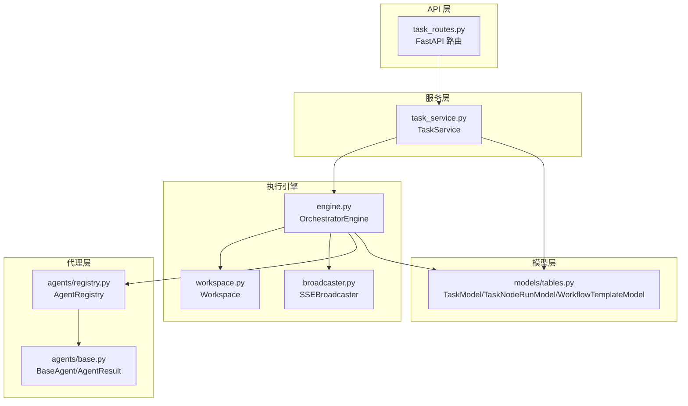
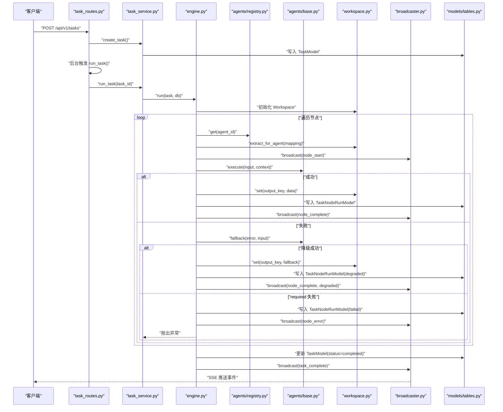
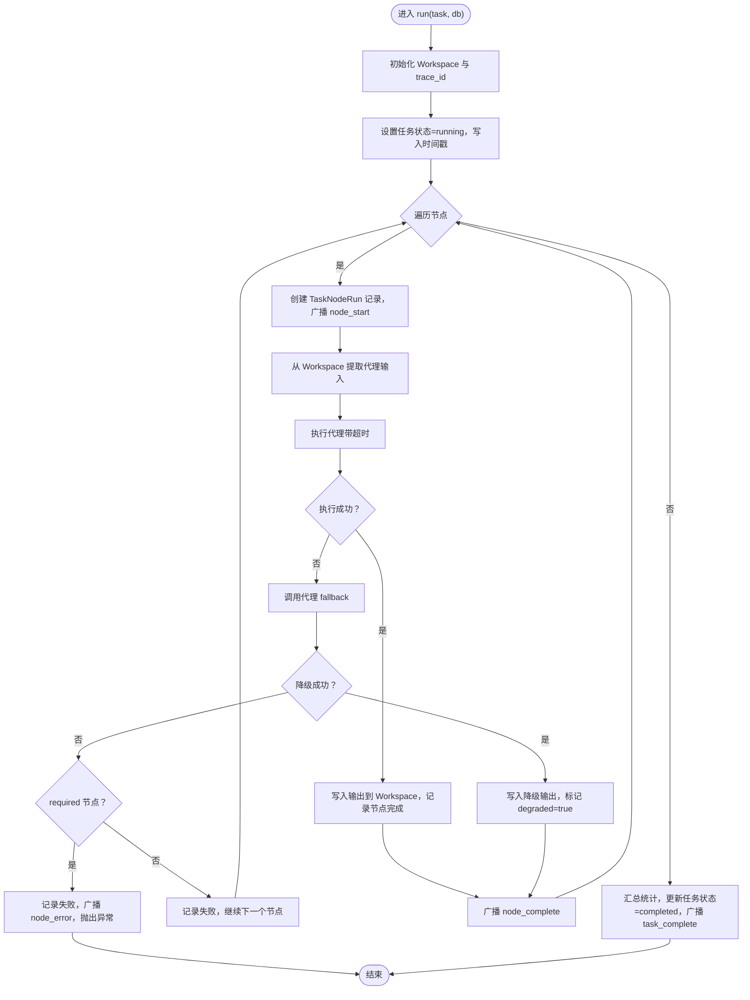
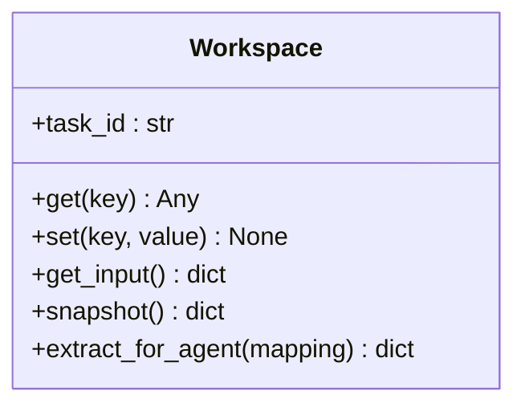
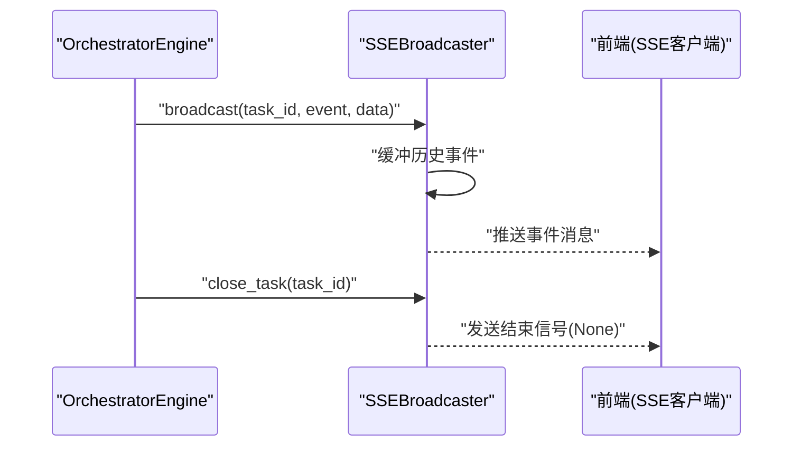
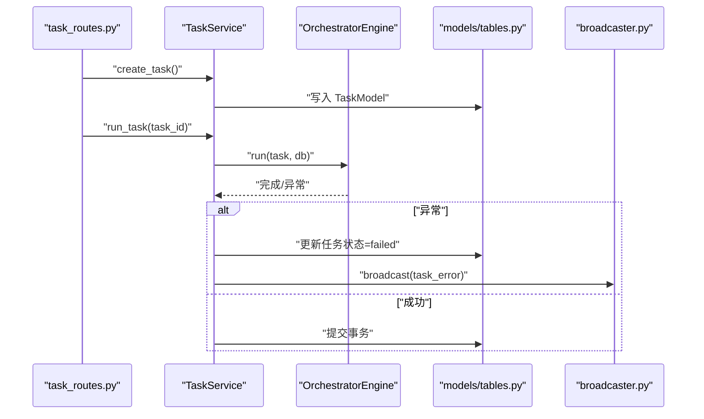
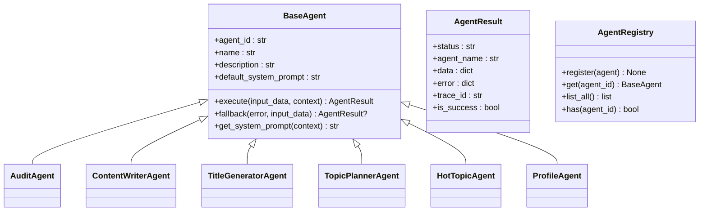
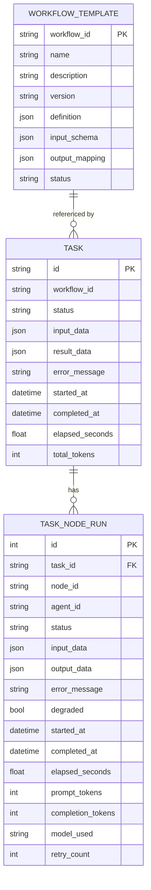
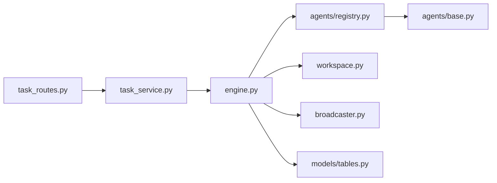

# 工作流定制

<cite>
**本文引用的文件**
- [backend/app/orchestrator/engine.py](file://backend/app/orchestrator/engine.py)
- [backend/app/orchestrator/workspace.py](file://backend/app/orchestrator/workspace.py)
- [backend/app/orchestrator/broadcaster.py](file://backend/app/orchestrator/broadcaster.py)
- [backend/app/models/tables.py](file://backend/app/models/tables.py)
- [backend/app/schemas/task.py](file://backend/app/schemas/task.py)
- [backend/app/api/task_routes.py](file://backend/app/api/task_routes.py)
- [backend/app/services/task_service.py](file://backend/app/services/task_service.py)
- [backend/app/agents/base.py](file://backend/app/agents/base.py)
- [backend/app/agents/registry.py](file://backend/app/agents/registry.py)
- [ARCHITECTURE.md](file://ARCHITECTURE.md)
</cite>

## 目录
1. [简介](#简介)
2. [项目结构](#项目结构)
3. [核心组件](#核心组件)
4. [架构总览](#架构总览)
5. [组件详解](#组件详解)
6. [依赖关系分析](#依赖关系分析)
7. [性能考量](#性能考量)
8. [故障排查指南](#故障排查指南)
9. [结论](#结论)
10. [附录](#附录)

## 简介
本文件面向开发者系统化讲解“工作流定制”，围绕以下目标展开：
- DAG 工作流的定义方法：节点类型、依赖关系与执行顺序控制
- 工作流配置文件格式规范：YAML/JSON 语法、字段含义与校验规则
- 执行引擎机制：任务调度、状态传递、异常处理
- 实战案例：条件分支、并行执行、循环控制
- 动态修改、热更新与版本管理
- 调试工具、性能监控与故障排查
- 设计模式、最佳实践与扩展指南

当前仓库已实现线性链式工作流（MVP），并通过工作流模板模型支持版本化与可扩展性。后续可在现有基础上扩展为更复杂的 DAG。

## 项目结构
后端采用分层架构：API 路由负责请求响应，服务层编排业务流程，执行引擎负责节点调度与状态广播，模型层持久化任务与节点运行记录，代理层承载具体业务逻辑。

图表来源
- [backend/app/api/task_routes.py:1-163](file://backend/app/api/task_routes.py#L1-L163)
- [backend/app/services/task_service.py:1-126](file://backend/app/services/task_service.py#L1-L126)
- [backend/app/orchestrator/engine.py:1-285](file://backend/app/orchestrator/engine.py#L1-L285)
- [backend/app/orchestrator/workspace.py:1-53](file://backend/app/orchestrator/workspace.py#L1-L53)
- [backend/app/orchestrator/broadcaster.py:1-94](file://backend/app/orchestrator/broadcaster.py#L1-L94)
- [backend/app/models/tables.py:23-233](file://backend/app/models/tables.py#L23-L233)
- [backend/app/agents/base.py:1-99](file://backend/app/agents/base.py#L1-L99)
- [backend/app/agents/registry.py:1-40](file://backend/app/agents/registry.py#L1-L40)

章节来源
- [backend/app/api/task_routes.py:1-163](file://backend/app/api/task_routes.py#L1-L163)
- [backend/app/services/task_service.py:1-126](file://backend/app/services/task_service.py#L1-L126)
- [backend/app/orchestrator/engine.py:1-285](file://backend/app/orchestrator/engine.py#L1-L285)
- [backend/app/orchestrator/workspace.py:1-53](file://backend/app/orchestrator/workspace.py#L1-L53)
- [backend/app/orchestrator/broadcaster.py:1-94](file://backend/app/orchestrator/broadcaster.py#L1-L94)
- [backend/app/models/tables.py:23-233](file://backend/app/models/tables.py#L23-L233)
- [backend/app/agents/base.py:1-99](file://backend/app/agents/base.py#L1-L99)
- [backend/app/agents/registry.py:1-40](file://backend/app/agents/registry.py#L1-L40)

## 核心组件
- 执行引擎（OrchestratorEngine）
  - 负责按顺序执行节点，管理工作空间，记录节点运行日志，广播事件，处理超时与异常，并汇总任务统计。
- 工作空间（Workspace）
  - 任务级上下文容器，提供读写能力与输入提取映射，支撑代理间数据传递。
- 事件广播（SSEBroadcaster）
  - 以服务器推送事件形式向订阅者广播节点开始、完成、错误与任务结束事件，支持历史回放。
- 任务服务（TaskService）
  - 创建任务、后台运行工作流、查询任务与节点详情、分页列出任务。
- 代理基类与注册器（BaseAgent、AgentRegistry）
  - 统一代理接口、结果封装与降级策略，集中注册与检索代理实例。
- 数据模型（TaskModel、TaskNodeRunModel、WorkflowTemplateModel）
  - 持久化任务生命周期、节点运行记录与工作流模板定义及版本。

章节来源
- [backend/app/orchestrator/engine.py:89-285](file://backend/app/orchestrator/engine.py#L89-L285)
- [backend/app/orchestrator/workspace.py:12-53](file://backend/app/orchestrator/workspace.py#L12-L53)
- [backend/app/orchestrator/broadcaster.py:11-94](file://backend/app/orchestrator/broadcaster.py#L11-L94)
- [backend/app/services/task_service.py:20-126](file://backend/app/services/task_service.py#L20-L126)
- [backend/app/agents/base.py:18-99](file://backend/app/agents/base.py#L18-L99)
- [backend/app/agents/registry.py:10-40](file://backend/app/agents/registry.py#L10-L40)
- [backend/app/models/tables.py:23-233](file://backend/app/models/tables.py#L23-L233)

## 架构总览
下图展示从 API 到执行引擎、代理与数据库的完整调用链路与事件传播。

图表来源
- [backend/app/api/task_routes.py:19-51](file://backend/app/api/task_routes.py#L19-L51)
- [backend/app/services/task_service.py:39-64](file://backend/app/services/task_service.py#L39-L64)
- [backend/app/orchestrator/engine.py:92-234](file://backend/app/orchestrator/engine.py#L92-L234)
- [backend/app/orchestrator/broadcaster.py:57-80](file://backend/app/orchestrator/broadcaster.py#L57-L80)
- [backend/app/models/tables.py:23-73](file://backend/app/models/tables.py#L23-L73)
- [backend/app/agents/registry.py:23-28](file://backend/app/agents/registry.py#L23-L28)
- [backend/app/agents/base.py:64-82](file://backend/app/agents/base.py#L64-L82)

## 组件详解

### 执行引擎（OrchestratorEngine）
- 节点顺序：当前默认线性顺序（MVP），可通过扩展支持 DAG。
- 输入映射：根据节点定义的 input_mapping 从工作空间抽取代理输入。
- 超时控制：统一超时阈值，避免单节点阻塞整条流水线。
- 降级策略：代理失败时尝试 fallback，若 required 则中断并记录错误。
- 事件广播：节点开始、完成、错误与任务完成事件，便于前端实时反馈。
- 统计汇总：累计提示与补全 token 数，计算任务耗时。

图表来源
- [backend/app/orchestrator/engine.py:92-234](file://backend/app/orchestrator/engine.py#L92-L234)

章节来源
- [backend/app/orchestrator/engine.py:89-285](file://backend/app/orchestrator/engine.py#L89-L285)

### 工作空间（Workspace）
- 作用：隔离的任务上下文，代理通过键访问共享数据。
- 能力：读取/写入、快照、按映射提取输入。
- 映射规则：支持“input.xxx”引用原始输入，或直接引用上层键。

图表来源
- [backend/app/orchestrator/workspace.py:12-53](file://backend/app/orchestrator/workspace.py#L12-L53)

章节来源
- [backend/app/orchestrator/workspace.py:12-53](file://backend/app/orchestrator/workspace.py#L12-L53)

### 事件广播（SSEBroadcaster）
- 订阅/取消订阅：按 task_id 维护队列，支持历史回放。
- 广播：向所有订阅者推送事件消息，自动缓冲历史事件。
- 关闭：任务结束后发送结束信号并清理历史。

图表来源
- [backend/app/orchestrator/broadcaster.py:30-80](file://backend/app/orchestrator/broadcaster.py#L30-L80)

章节来源
- [backend/app/orchestrator/broadcaster.py:11-94](file://backend/app/orchestrator/broadcaster.py#L11-L94)

### 任务服务（TaskService）
- 创建任务：生成任务 ID，写入初始状态与输入。
- 后台运行：捕获异常，更新任务状态与耗时，广播任务错误事件。
- 查询接口：任务详情、节点明细、进度统计、分页列表。

图表来源
- [backend/app/api/task_routes.py:19-51](file://backend/app/api/task_routes.py#L19-L51)
- [backend/app/services/task_service.py:39-64](file://backend/app/services/task_service.py#L39-L64)
- [backend/app/orchestrator/broadcaster.py:70-80](file://backend/app/orchestrator/broadcaster.py#L70-L80)

章节来源
- [backend/app/api/task_routes.py:1-163](file://backend/app/api/task_routes.py#L1-L163)
- [backend/app/services/task_service.py:20-126](file://backend/app/services/task_service.py#L20-L126)

### 代理基类与注册器（BaseAgent、AgentRegistry）
- 统一接口：execute 返回标准化 AgentResult，支持降级 fallback。
- 注册中心：按 agent_id 注册与检索代理实例，缺失时抛出异常。

图表来源
- [backend/app/agents/base.py:18-99](file://backend/app/agents/base.py#L18-L99)
- [backend/app/agents/registry.py:10-40](file://backend/app/agents/registry.py#L10-L40)

章节来源
- [backend/app/agents/base.py:1-99](file://backend/app/agents/base.py#L1-L99)
- [backend/app/agents/registry.py:1-40](file://backend/app/agents/registry.py#L1-L40)

### 数据模型（TaskModel、TaskNodeRunModel、WorkflowTemplateModel）
- 任务模型：保存任务生命周期、输入/输出、错误与统计。
- 节点运行模型：记录每个节点的输入/输出、耗时、token、降级标记与重试次数。
- 工作流模板模型：保存模板定义、输入/输出映射与版本。

图表来源
- [backend/app/models/tables.py:23-233](file://backend/app/models/tables.py#L23-L233)

章节来源
- [backend/app/models/tables.py:23-233](file://backend/app/models/tables.py#L23-L233)

## 依赖关系分析
- 控制流耦合
  - API 路由仅负责请求/响应，业务逻辑集中在服务层。
  - 服务层编排执行引擎，引擎依赖代理注册器、工作空间与广播器。
- 数据持久化
  - 任务与节点运行记录通过 SQLAlchemy 模型持久化，供查询与审计。
- 外部集成
  - SSE 广播器与前端建立长连接，事件格式稳定，便于扩展。

图表来源
- [backend/app/api/task_routes.py:1-163](file://backend/app/api/task_routes.py#L1-L163)
- [backend/app/services/task_service.py:1-126](file://backend/app/services/task_service.py#L1-L126)
- [backend/app/orchestrator/engine.py:1-285](file://backend/app/orchestrator/engine.py#L1-L285)
- [backend/app/orchestrator/workspace.py:1-53](file://backend/app/orchestrator/workspace.py#L1-L53)
- [backend/app/orchestrator/broadcaster.py:1-94](file://backend/app/orchestrator/broadcaster.py#L1-L94)
- [backend/app/models/tables.py:1-233](file://backend/app/models/tables.py#L1-L233)
- [backend/app/agents/base.py:1-99](file://backend/app/agents/base.py#L1-L99)
- [backend/app/agents/registry.py:1-40](file://backend/app/agents/registry.py#L1-L40)

章节来源
- [backend/app/api/task_routes.py:1-163](file://backend/app/api/task_routes.py#L1-L163)
- [backend/app/services/task_service.py:1-126](file://backend/app/services/task_service.py#L1-L126)
- [backend/app/orchestrator/engine.py:1-285](file://backend/app/orchestrator/engine.py#L1-L285)
- [backend/app/orchestrator/workspace.py:1-53](file://backend/app/orchestrator/workspace.py#L1-L53)
- [backend/app/orchestrator/broadcaster.py:1-94](file://backend/app/orchestrator/broadcaster.py#L1-L94)
- [backend/app/models/tables.py:1-233](file://backend/app/models/tables.py#L1-L233)
- [backend/app/agents/base.py:1-99](file://backend/app/agents/base.py#L1-L99)
- [backend/app/agents/registry.py:1-40](file://backend/app/agents/registry.py#L1-L40)

## 性能考量
- 超时控制：统一代理执行超时，避免阻塞导致任务积压。
- 事件缓冲：SSE 广播器对历史事件进行缓冲，减少前端重连成本。
- 统计指标：累计 prompt/completion token，便于成本与性能分析。
- 并发与异步：API 路由与服务层均采用异步，后台任务解耦请求响应。
- 建议
  - 对热点节点引入并发池与限流策略
  - 为高开销代理增加缓存层
  - 对长耗时节点拆分为子任务并支持断点续跑

[本节为通用指导，无需特定文件引用]

## 故障排查指南
- 常见问题定位
  - 节点失败：查看节点运行记录中的 error_message 与 degraded 标记。
  - 任务失败：检查任务状态与错误消息，确认是否因 required 节点失败导致。
  - 超时：确认代理执行耗时与全局超时阈值设置。
- 日志与追踪
  - 使用 trace_id 关联任务与节点日志，结合系统日志模型定位问题。
- 事件流
  - 通过 /tasks/{task_id}/status 与 /tasks/{task_id}/nodes 获取实时进度与节点明细。
- 降级策略
  - 若代理提供 fallback，优先启用降级输出，避免整条流水线中断。

章节来源
- [backend/app/orchestrator/engine.py:164-196](file://backend/app/orchestrator/engine.py#L164-L196)
- [backend/app/orchestrator/broadcaster.py:57-80](file://backend/app/orchestrator/broadcaster.py#L57-L80)
- [backend/app/api/task_routes.py:54-133](file://backend/app/api/task_routes.py#L54-L133)
- [backend/app/models/tables.py:48-73](file://backend/app/models/tables.py#L48-L73)

## 结论
当前实现提供了清晰的线性工作流执行框架，具备完善的事件广播、状态持久化与异常处理能力。建议在此基础上逐步引入 DAG 支持、条件分支与并行执行，同时完善工作流模板的 YAML/JSON 规范与版本管理机制，以满足更复杂的内容生产场景。

[本节为总结性内容，无需特定文件引用]

## 附录

### 工作流配置文件格式规范（建议）
- 文件位置：manifests/workflows/
- 文件类型：YAML/JSON
- 字段说明（示例）
  - workflow_id：工作流唯一标识
  - name/description：名称与描述
  - version：版本号（语义化）
  - definition：工作流定义
    - nodes：节点数组
      - node_id：节点唯一标识
      - agent_id：代理标识
      - name：节点名称
      - input_mapping：输入映射（键到工作空间键的映射）
      - output_key：输出写入的工作空间键
      - required：是否为必经节点
    - edges：边定义（用于 DAG，表示依赖关系）
  - input_schema：输入数据结构约束
  - output_mapping：最终输出映射
  - status：状态（active/draft/archived）
- 校验规则
  - 必填字段完整性
  - 节点 id 唯一性
  - 边构成的有向无环图（DAG）
  - 代理与技能存在性校验
  - schema 合法性与一致性

[本节为规范建议，未直接对应现有文件，故不附加章节来源]

### 执行引擎扩展要点（DAG、并行、循环）
- DAG 解析：从 definition.edges 构建邻接表与入度表，拓扑排序决定执行顺序。
- 并行执行：同一层节点可并发执行，完成后合并到工作空间。
- 循环控制：通过条件判断与 output_key 决定是否重复执行某节点。
- 动态修改：基于模板版本号与变更集，增量应用到运行中的任务。

[本节为概念性扩展，未直接对应现有文件，故不附加章节来源]

### 实战案例（基于现有代理）
- 条件分支：在代理内部根据输出结果决定后续节点（例如审核通过与否）。
- 并行执行：将多个独立代理（如多标题生成）并行化，合并结果。
- 循环控制：热点抓取失败时重试 N 次，或回退到缓存数据。

章节来源
- [ARCHITECTURE.md:567-632](file://ARCHITECTURE.md#L567-L632)
- [backend/app/orchestrator/engine.py:154-175](file://backend/app/orchestrator/engine.py#L154-L175)

### 调试工具与监控
- SSE 实时事件：/api/v1/tasks/{task_id}/stream（由 broadcaser 提供）
- 任务状态查询：/api/v1/tasks/{task_id}/status
- 任务详情与节点明细：/api/v1/tasks/{task_id} 与 /api/v1/tasks/{task_id}/nodes
- 性能指标：total_tokens、elapsed_seconds、节点耗时与降级率

章节来源
- [backend/app/orchestrator/broadcaster.py:30-80](file://backend/app/orchestrator/broadcaster.py#L30-L80)
- [backend/app/api/task_routes.py:54-133](file://backend/app/api/task_routes.py#L54-L133)
- [backend/app/schemas/task.py:27-83](file://backend/app/schemas/task.py#L27-L83)

### 设计模式、最佳实践与扩展指南
- 设计模式
  - 策略模式：不同代理实现统一接口，便于替换与扩展
  - 观察者模式：SSE 广播器作为事件发布者，前端作为订阅者
  - 工厂模式：代理注册器集中管理实例创建
- 最佳实践
  - 代理职责单一，输入输出结构化
  - 必要节点失败即终止，非必要节点降级继续
  - 使用系统日志模型记录结构化日志，便于检索
- 扩展指南
  - 新增代理：实现 BaseAgent，注册到 AgentRegistry
  - 新增工作流：编写模板定义，支持版本化与回滚
  - 新增事件：在广播器中新增事件类型并在引擎中触发

章节来源
- [backend/app/agents/base.py:49-99](file://backend/app/agents/base.py#L49-L99)
- [backend/app/agents/registry.py:10-40](file://backend/app/agents/registry.py#L10-L40)
- [backend/app/orchestrator/broadcaster.py:11-94](file://backend/app/orchestrator/broadcaster.py#L11-L94)
- [backend/app/models/tables.py:220-233](file://backend/app/models/tables.py#L220-L233)