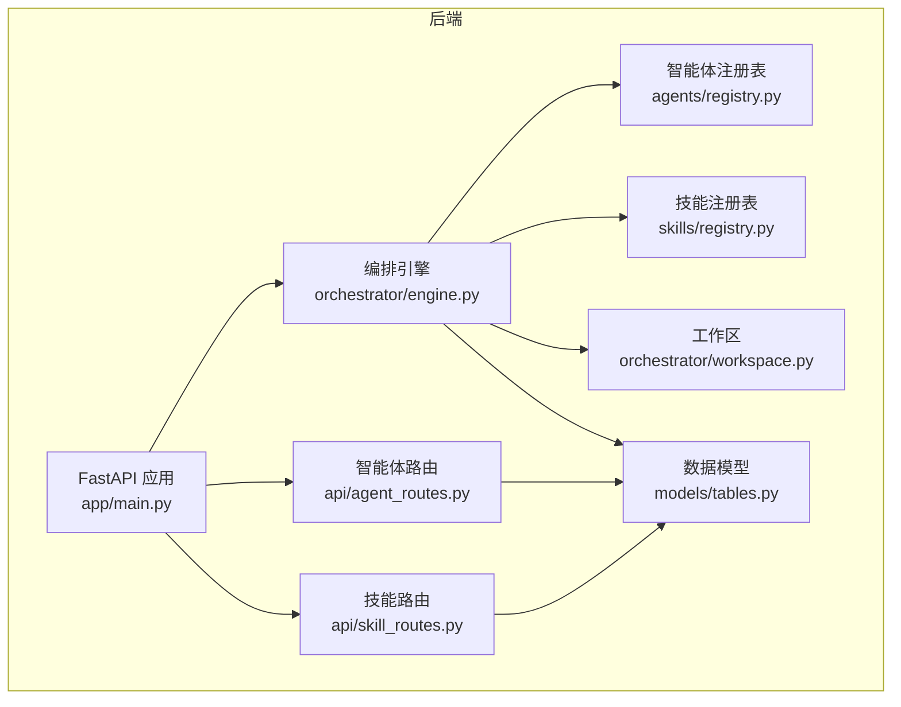
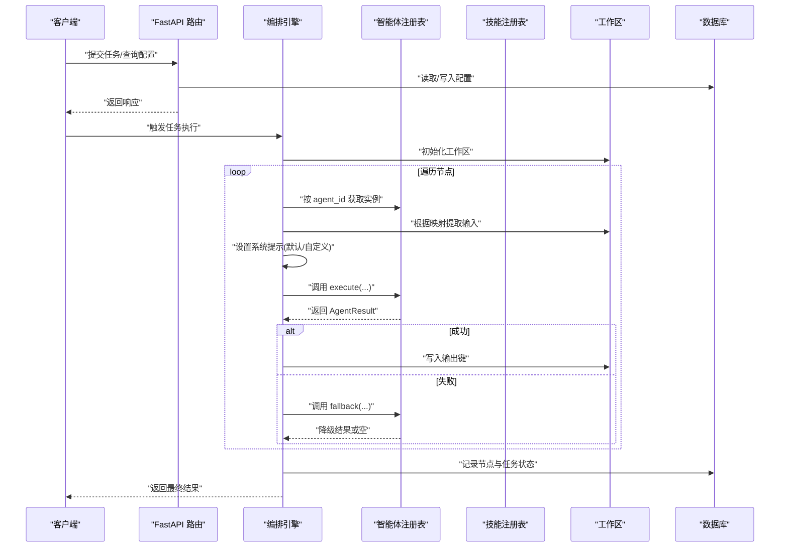
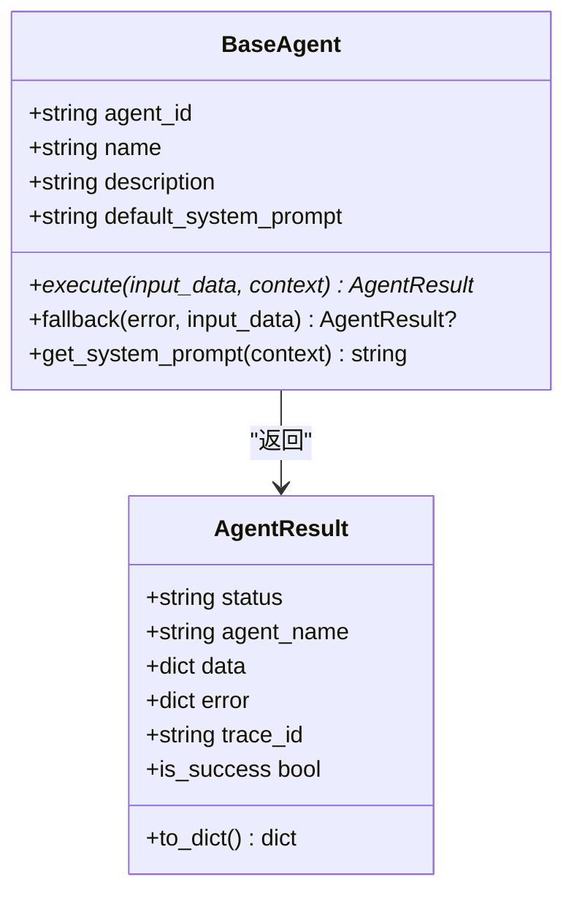
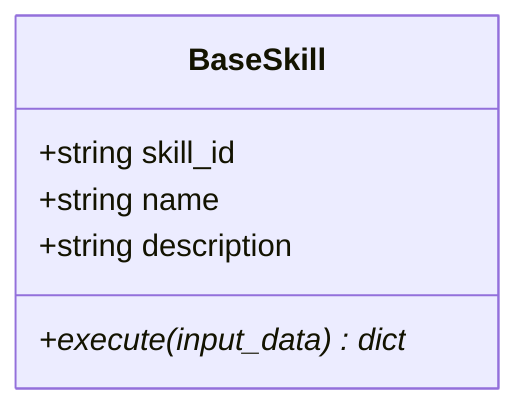
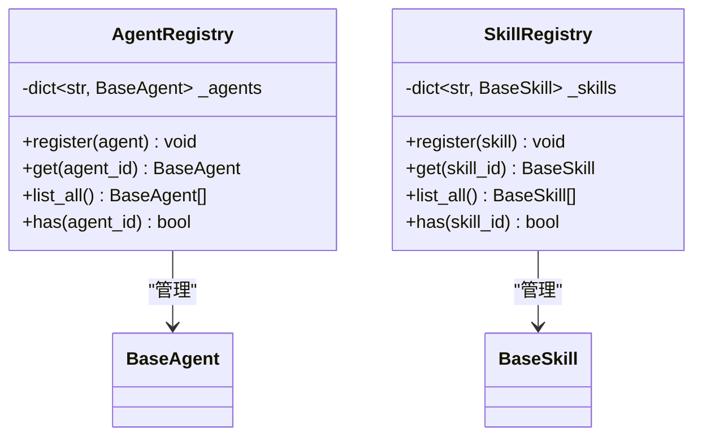
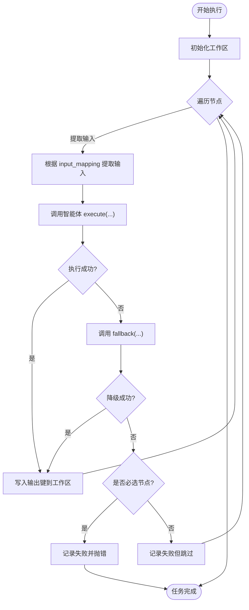
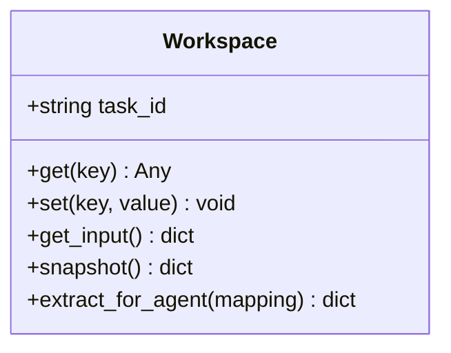
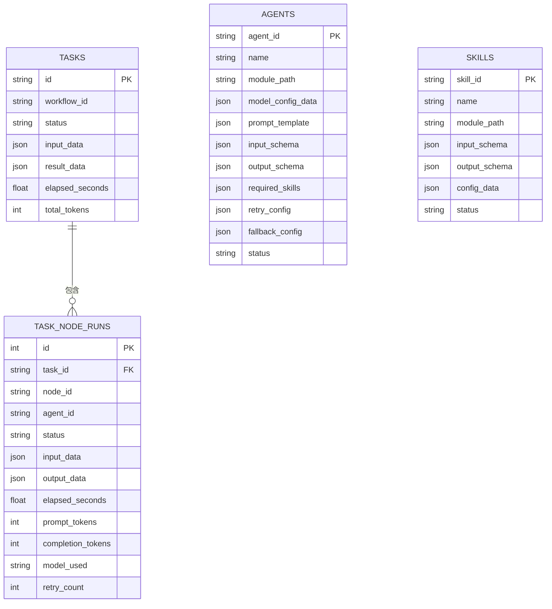
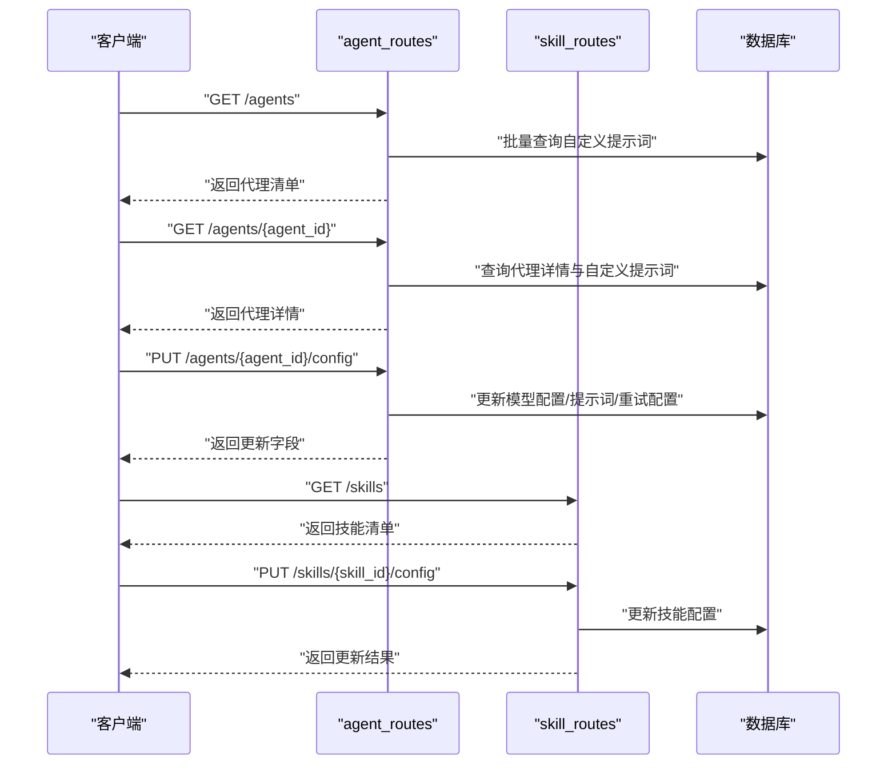
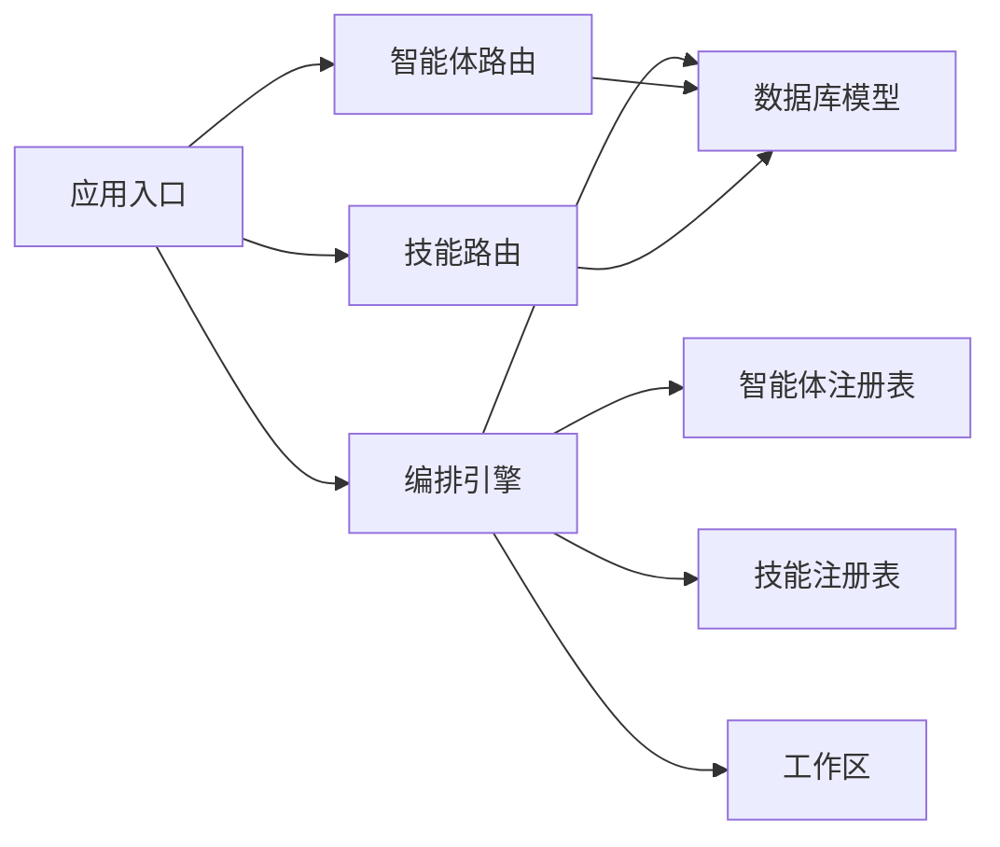

# 扩展开发

<cite>
**本文引用的文件**
- [backend/app/agents/base.py](file://backend/app/agents/base.py)
- [backend/app/agents/registry.py](file://backend/app/agents/registry.py)
- [backend/app/skills/base.py](file://backend/app/skills/base.py)
- [backend/app/skills/registry.py](file://backend/app/skills/registry.py)
- [backend/app/orchestrator/engine.py](file://backend/app/orchestrator/engine.py)
- [backend/app/orchestrator/workspace.py](file://backend/app/orchestrator/workspace.py)
- [backend/app/models/tables.py](file://backend/app/models/tables.py)
- [backend/app/api/agent_routes.py](file://backend/app/api/agent_routes.py)
- [backend/app/api/skill_routes.py](file://backend/app/api/skill_routes.py)
- [backend/app/main.py](file://backend/app/main.py)
- [backend/app/schemas/agent.py](file://backend/app/schemas/agent.py)
- [backend/app/schemas/skill.py](file://backend/app/schemas/skill.py)
</cite>

## 目录
1. [简介](#简介)
2. [项目结构](#项目结构)
3. [核心组件](#核心组件)
4. [架构总览](#架构总览)
5. [详细组件分析](#详细组件分析)
6. [依赖分析](#依赖分析)
7. [性能考量](#性能考量)
8. [故障排查指南](#故障排查指南)
9. [结论](#结论)
10. [附录](#附录)

## 简介
本指南面向高级开发者，系统讲解如何在 HotClaw 平台上进行扩展开发，涵盖以下主题：
- 自定义智能体开发：基类继承、输入输出 Schema 定义、执行逻辑实现
- 自定义技能开发：技能基类实现、配置管理、调用协议
- 工作流定制与扩展：DAG 工作流定义、节点依赖配置
- 插件系统与扩展点：注册机制、动态加载、运行时装配
- Manifest 文件格式、注册机制与动态加载（概念性说明）
- 最佳实践、性能优化与兼容性建议

## 项目结构
后端采用 FastAPI + SQLAlchemy 架构，核心模块围绕“智能体（Agent）+ 技能（Skill）+ 编排器（Orchestrator）+ 工作区（Workspace）+ 数据模型（Models）+ 路由（API）”组织。前端为 Next.js 应用，通过 API 与后端交互。

图表来源
- [backend/app/main.py:1-142](file://backend/app/main.py#L1-L142)
- [backend/app/orchestrator/engine.py:1-285](file://backend/app/orchestrator/engine.py#L1-L285)
- [backend/app/orchestrator/workspace.py:1-53](file://backend/app/orchestrator/workspace.py#L1-L53)
- [backend/app/agents/registry.py:1-40](file://backend/app/agents/registry.py#L1-L40)
- [backend/app/skills/registry.py:1-37](file://backend/app/skills/registry.py#L1-L37)
- [backend/app/models/tables.py:1-233](file://backend/app/models/tables.py#L1-L233)
- [backend/app/api/agent_routes.py:1-115](file://backend/app/api/agent_routes.py#L1-L115)
- [backend/app/api/skill_routes.py:1-61](file://backend/app/api/skill_routes.py#L1-L61)

章节来源
- [backend/app/main.py:1-142](file://backend/app/main.py#L1-L142)
- [backend/app/orchestrator/engine.py:1-285](file://backend/app/orchestrator/engine.py#L1-L285)

## 核心组件
- 智能体基类与结果封装：定义统一的执行接口、标准化返回结构、降级策略入口
- 技能基类：定义工具型能力的统一执行接口
- 注册表：集中注册与检索智能体/技能实例
- 编排引擎：按节点顺序调度执行、上下文传递、错误处理与广播
- 工作区：任务级上下文容器，支持映射式输入提取与快照持久化
- 数据模型：持久化任务、节点运行、代理与技能配置等
- API 路由：对外暴露查询与更新智能体/技能配置的能力

章节来源
- [backend/app/agents/base.py:1-99](file://backend/app/agents/base.py#L1-L99)
- [backend/app/skills/base.py:1-37](file://backend/app/skills/base.py#L1-L37)
- [backend/app/agents/registry.py:1-40](file://backend/app/agents/registry.py#L1-L40)
- [backend/app/skills/registry.py:1-37](file://backend/app/skills/registry.py#L1-L37)
- [backend/app/orchestrator/engine.py:1-285](file://backend/app/orchestrator/engine.py#L1-L285)
- [backend/app/orchestrator/workspace.py:1-53](file://backend/app/orchestrator/workspace.py#L1-L53)
- [backend/app/models/tables.py:1-233](file://backend/app/models/tables.py#L1-L233)
- [backend/app/api/agent_routes.py:1-115](file://backend/app/api/agent_routes.py#L1-L115)
- [backend/app/api/skill_routes.py:1-61](file://backend/app/api/skill_routes.py#L1-L61)

## 架构总览
下图展示从请求到执行再到结果回传的关键路径，体现编排器、注册表、工作区与数据库之间的协作。

图表来源
- [backend/app/orchestrator/engine.py:92-234](file://backend/app/orchestrator/engine.py#L92-L234)
- [backend/app/orchestrator/workspace.py:36-52](file://backend/app/orchestrator/workspace.py#L36-L52)
- [backend/app/agents/registry.py:23-28](file://backend/app/agents/registry.py#L23-L28)
- [backend/app/models/tables.py:23-73](file://backend/app/models/tables.py#L23-L73)

## 详细组件分析

### 智能体基类与结果封装
- 统一接口：execute(input_data: dict, context: dict) -> AgentResult
- 结果封装：AgentResult 包含状态、名称、数据、错误与追踪 ID；提供 is_success 判定
- 降级策略：fallback(error, input_data) -> 可选降级结果
- 系统提示：get_system_prompt(context) 支持从上下文或默认模板获取有效提示

图表来源
- [backend/app/agents/base.py:18-99](file://backend/app/agents/base.py#L18-L99)

章节来源
- [backend/app/agents/base.py:1-99](file://backend/app/agents/base.py#L1-L99)

### 技能基类与调用协议
- 统一接口：execute(input_data: dict) -> dict
- 技能职责：工具型处理，输出稳定可复用
- 使用方式：由智能体在执行过程中调用，输入输出均为结构化字典

图表来源
- [backend/app/skills/base.py:16-37](file://backend/app/skills/base.py#L16-L37)

章节来源
- [backend/app/skills/base.py:1-37](file://backend/app/skills/base.py#L1-L37)

### 注册表与动态装配
- 智能体注册表：以 agent_id 为键注册与检索实例，提供列表与存在性检查
- 技能注册表：以 skill_id 为键注册与检索实例
- 启动期注册：应用生命周期中完成内置智能体的注册

图表来源
- [backend/app/agents/registry.py:10-39](file://backend/app/agents/registry.py#L10-L39)
- [backend/app/skills/registry.py:10-37](file://backend/app/skills/registry.py#L10-L37)

章节来源
- [backend/app/agents/registry.py:1-40](file://backend/app/agents/registry.py#L1-L40)
- [backend/app/skills/registry.py:1-37](file://backend/app/skills/registry.py#L1-L37)
- [backend/app/main.py:32-40](file://backend/app/main.py#L32-L40)

### 编排引擎与工作流执行
- 默认线性工作流：定义一组节点，按序执行
- 输入映射：将工作区中的键映射到智能体输入字段
- 上下文注入：将当前工作区快照作为只读上下文传入智能体
- 错误处理：失败时尝试 fallback；必选节点失败则中断并抛出异常
- 广播与追踪：节点开始/结束事件通过广播器推送，支持任务级追踪 ID

图表来源
- [backend/app/orchestrator/engine.py:92-234](file://backend/app/orchestrator/engine.py#L92-L234)
- [backend/app/orchestrator/workspace.py:36-52](file://backend/app/orchestrator/workspace.py#L36-L52)

章节来源
- [backend/app/orchestrator/engine.py:1-285](file://backend/app/orchestrator/engine.py#L1-L285)
- [backend/app/orchestrator/workspace.py:1-53](file://backend/app/orchestrator/workspace.py#L1-L53)

### 工作区与上下文传递
- 作用域：每个任务一个工作区，保存原始输入与中间输出
- 接口：get/set/snapshot/extract_for_agent
- 映射规则：支持直接键访问与 input. 前缀引用原始输入

图表来源
- [backend/app/orchestrator/workspace.py:12-53](file://backend/app/orchestrator/workspace.py#L12-L53)

章节来源
- [backend/app/orchestrator/workspace.py:1-53](file://backend/app/orchestrator/workspace.py#L1-L53)

### 数据模型与持久化
- 任务表：记录任务生命周期、输入/输出、耗时与总 token
- 节点运行表：记录每个节点的输入/输出、错误、耗时、模型用量与重试次数
- 代理与技能配置表：持久化模块路径、版本、输入/输出 Schema、所需技能、重试/降级配置等
- 日志表：结构化系统日志，支持 trace_id 关联

图表来源
- [backend/app/models/tables.py:23-73](file://backend/app/models/tables.py#L23-L73)
- [backend/app/models/tables.py:160-200](file://backend/app/models/tables.py#L160-L200)
- [backend/app/models/tables.py:183-200](file://backend/app/models/tables.py#L183-L200)

章节来源
- [backend/app/models/tables.py:1-233](file://backend/app/models/tables.py#L1-L233)

### API 路由与配置管理
- 智能体配置 API：列出、查询、更新智能体配置（模型参数、提示词模板、重试配置）
- 技能配置 API：列出、更新技能配置（如外部服务凭据等）

图表来源
- [backend/app/api/agent_routes.py:17-115](file://backend/app/api/agent_routes.py#L17-L115)
- [backend/app/api/skill_routes.py:17-61](file://backend/app/api/skill_routes.py#L17-L61)
- [backend/app/models/tables.py:160-200](file://backend/app/models/tables.py#L160-L200)
- [backend/app/models/tables.py:183-200](file://backend/app/models/tables.py#L183-L200)

章节来源
- [backend/app/api/agent_routes.py:1-115](file://backend/app/api/agent_routes.py#L1-L115)
- [backend/app/api/skill_routes.py:1-61](file://backend/app/api/skill_routes.py#L1-L61)

## 依赖分析
- 组件内聚：智能体与技能分别实现各自职责，通过注册表解耦
- 组件耦合：编排引擎依赖注册表与工作区；API 路由依赖数据库模型
- 外部依赖：SQLAlchemy ORM、FastAPI、异步运行时
- 循环依赖：未见循环导入；注册表与引擎之间为单向依赖

图表来源
- [backend/app/main.py:14-137](file://backend/app/main.py#L14-L137)
- [backend/app/orchestrator/engine.py:18-26](file://backend/app/orchestrator/engine.py#L18-L26)
- [backend/app/agents/registry.py:3-4](file://backend/app/agents/registry.py#L3-L4)
- [backend/app/skills/registry.py:3-4](file://backend/app/skills/registry.py#L3-L4)
- [backend/app/models/tables.py:23-73](file://backend/app/models/tables.py#L23-L73)

章节来源
- [backend/app/main.py:1-142](file://backend/app/main.py#L1-L142)
- [backend/app/orchestrator/engine.py:1-285](file://backend/app/orchestrator/engine.py#L1-L285)

## 性能考量
- 异步执行：编排引擎对智能体调用使用超时控制，避免阻塞
- 批量查询：智能体列表接口批量查询自定义提示词，减少往返
- 计费统计：累计 prompt/completion tokens，便于成本控制
- 日志与追踪：统一 trace_id，便于跨服务链路定位问题
- 数据库索引：日志表对 trace_id/task_id/node_id 建有索引，利于查询

章节来源
- [backend/app/orchestrator/engine.py:236-243](file://backend/app/orchestrator/engine.py#L236-L243)
- [backend/app/api/agent_routes.py:22-28](file://backend/app/api/agent_routes.py#L22-L28)
- [backend/app/models/tables.py:220-233](file://backend/app/models/tables.py#L220-L233)

## 故障排查指南
- 未找到智能体/技能：检查注册表是否已注册对应 ID
- 节点执行失败：查看节点运行记录的错误信息；必选节点失败会中断任务
- 超时错误：调整全局超时设置或优化智能体内部逻辑
- 配置不生效：确认数据库中是否存有自定义提示词/配置，以及更新接口是否正确调用

章节来源
- [backend/app/agents/registry.py:23-28](file://backend/app/agents/registry.py#L23-L28)
- [backend/app/skills/registry.py:22-26](file://backend/app/skills/registry.py#L22-L26)
- [backend/app/orchestrator/engine.py:164-196](file://backend/app/orchestrator/engine.py#L164-L196)
- [backend/app/api/agent_routes.py:74-115](file://backend/app/api/agent_routes.py#L74-L115)
- [backend/app/api/skill_routes.py:34-61](file://backend/app/api/skill_routes.py#L34-L61)

## 结论
HotClaw 的扩展开发围绕“智能体 + 技能 + 编排器 + 工作区 + 数据持久化”的清晰边界展开。通过统一的基类与注册表机制，开发者可以快速实现自定义智能体与技能，并通过编排引擎与工作区实现稳定的上下文传递与执行控制。配合 API 路由与数据库模型，实现了配置的持久化与可观测性。

## 附录

### 自定义智能体开发流程
- 继承基类：实现 execute 与可选 fallback
- 输入输出 Schema：在数据库模型中定义 input_schema 与 output_schema 字段，用于校验与文档化
- 执行逻辑：利用工作区映射提取输入，注入系统提示，调用所需技能，产出结构化数据
- 配置管理：通过 API 更新模型参数、提示词模板与重试配置

章节来源
- [backend/app/agents/base.py:49-99](file://backend/app/agents/base.py#L49-L99)
- [backend/app/models/tables.py:160-181](file://backend/app/models/tables.py#L160-L181)
- [backend/app/api/agent_routes.py:74-115](file://backend/app/api/agent_routes.py#L74-L115)

### 自定义技能开发方法
- 继承基类：实现 execute，确保输入输出为结构化字典
- 配置管理：通过技能配置 API 更新 config_data
- 调用协议：由智能体在执行阶段按需调用，遵循输入输出 Schema

章节来源
- [backend/app/skills/base.py:16-37](file://backend/app/skills/base.py#L16-L37)
- [backend/app/api/skill_routes.py:34-61](file://backend/app/api/skill_routes.py#L34-L61)
- [backend/app/models/tables.py:183-200](file://backend/app/models/tables.py#L183-L200)

### 工作流定制与扩展机制
- 线性工作流：默认节点顺序固定，适合 MVP 快速落地
- DAG 工作流：可通过扩展工作流模板模型与编排器逻辑实现
- 节点依赖：通过 input_mapping 与工作区键关联实现显式依赖

章节来源
- [backend/app/orchestrator/engine.py:31-86](file://backend/app/orchestrator/engine.py#L31-L86)
- [backend/app/orchestrator/workspace.py:36-52](file://backend/app/orchestrator/workspace.py#L36-L52)
- [backend/app/models/tables.py:202-218](file://backend/app/models/tables.py#L202-L218)

### 插件系统与扩展点
- 扩展点识别：智能体/技能注册表、编排引擎节点调度、工作区上下文、API 路由
- 动态加载：启动时注册内置实现；可通过扩展注册新实例
- 插件化：新增智能体/技能时仅需实现基类并注册，无需修改核心编排逻辑

章节来源
- [backend/app/main.py:32-40](file://backend/app/main.py#L32-L40)
- [backend/app/agents/registry.py:16-21](file://backend/app/agents/registry.py#L16-L21)
- [backend/app/skills/registry.py:16-21](file://backend/app/skills/registry.py#L16-L21)

### Manifest 文件格式、注册机制与动态加载（概念性说明）
- Manifest 设计建议：包含 agent_id/name/description/version/module_path/input_schema/output_schema/required_skills/retry_config/fallback_config/status 等字段
- 注册机制：启动时扫描并注册实现；也可通过 API 触发动态注册（需扩展）
- 动态加载：基于 module_path 动态导入模块并实例化对象（需扩展）

[本节为概念性说明，不直接对应具体源码文件]

### 最佳实践与兼容性
- 分层职责：智能体专注业务任务，技能专注工具能力
- 结构化输出：严格定义输入输出 Schema，便于编排与校验
- 可观测性：充分利用 trace_id、节点广播与系统日志
- 兼容性：保持接口稳定性，避免破坏性变更；必要时引入版本字段

[本节为通用指导，不直接对应具体源码文件]