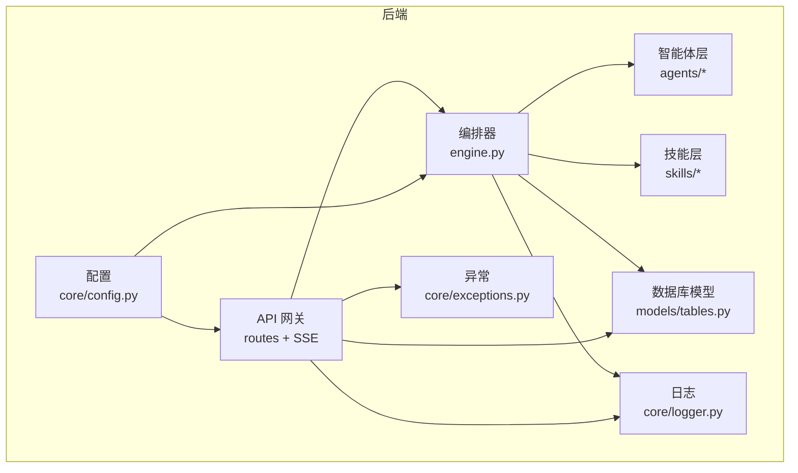
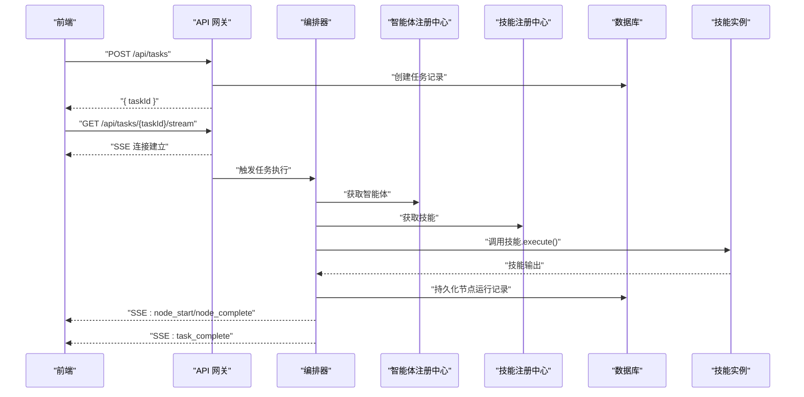
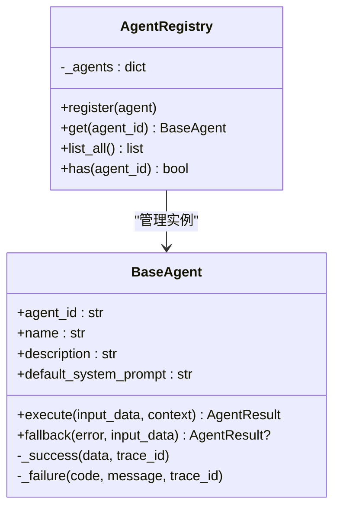
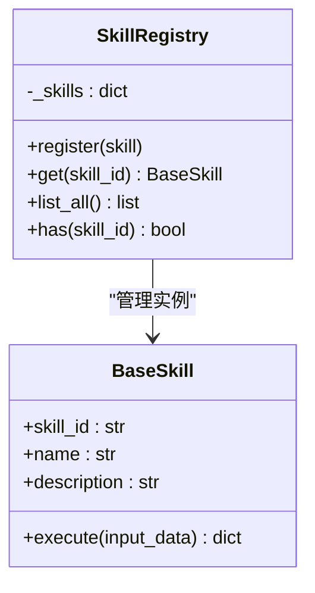
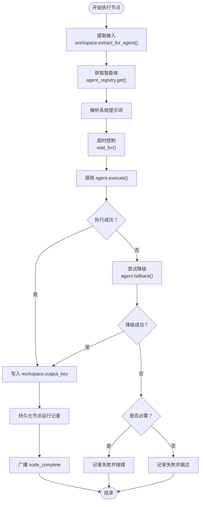
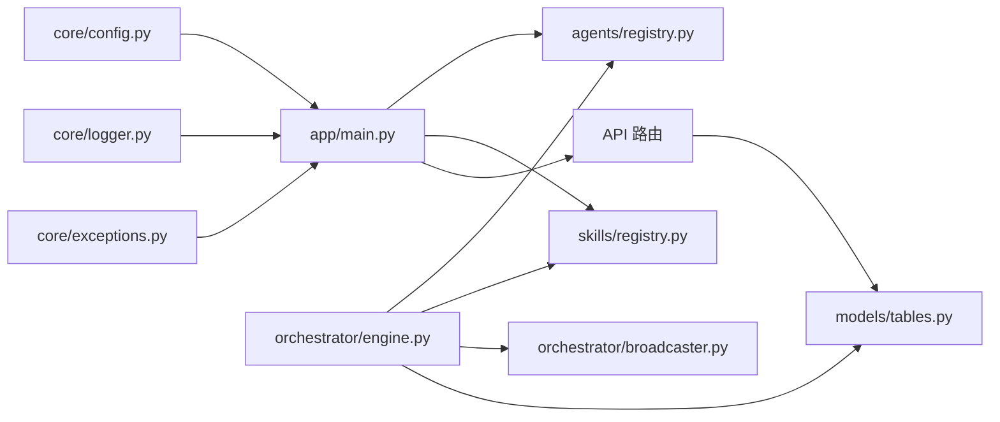

# 插件系统

<cite>
**本文引用的文件**
- [backend/app/main.py](file://backend/app/main.py)
- [backend/app/agents/base.py](file://backend/app/agents/base.py)
- [backend/app/agents/registry.py](file://backend/app/agents/registry.py)
- [backend/app/skills/base.py](file://backend/app/skills/base.py)
- [backend/app/skills/registry.py](file://backend/app/skills/registry.py)
- [backend/app/orchestrator/engine.py](file://backend/app/orchestrator/engine.py)
- [backend/app/orchestrator/broadcaster.py](file://backend/app/orchestrator/broadcaster.py)
- [backend/app/api/agent_routes.py](file://backend/app/api/agent_routes.py)
- [backend/app/models/tables.py](file://backend/app/models/tables.py)
- [backend/app/core/config.py](file://backend/app/core/config.py)
- [backend/app/core/logger.py](file://backend/app/core/logger.py)
- [backend/app/core/exceptions.py](file://backend/app/core/exceptions.py)
- [ARCHITECTURE.md](file://ARCHITECTURE.md)
</cite>

## 目录
1. [简介](#简介)
2. [项目结构](#项目结构)
3. [核心组件](#核心组件)
4. [架构总览](#架构总览)
5. [组件详解](#组件详解)
6. [依赖关系分析](#依赖关系分析)
7. [性能考量](#性能考量)
8. [故障排查指南](#故障排查指南)
9. [结论](#结论)
10. [附录](#附录)

## 简介
本指南围绕现有代码库中的“智能体/技能”体系，系统阐述插件化的使用与扩展方法。当前版本将“插件”映射为“技能（Skill）”，并通过“清单（Manifest）+ 注册中心”的方式实现声明式注册与集中管理。文档覆盖以下主题：
- 插件注册机制：自动发现、手动注册、动态加载策略
- 插件接口规范：依赖注入、生命周期管理、资源共享
- 插件配置管理：配置文件格式、参数传递、环境适配
- 开发流程：从接口实现到打包发布的全过程
- 插件间通信：事件系统与状态同步
- 安全与权限：最小权限原则与隔离
- 模板与工具：开发模板、发布指南与最佳实践

注意：根据架构文档，MVP 阶段未实现“插件（Plugin）”的独立生命周期与鉴权，当前以“技能（Skill）”替代。未来若引入插件，建议复用现有注册与事件机制。

## 项目结构
后端采用分层架构，核心模块如下：
- gateway：API 网关层（路由、参数校验、SSE）
- orchestrator：工作流编排器（调度、事件广播、上下文管理）
- agents：智能体层（基类、注册中心、具体实现）
- skills：技能层（基类、注册中心、具体实现）
- services：业务服务层（任务、草稿、审核等）
- models/schemas：数据模型与输入输出校验
- core：核心工具（日志、异常、追踪）

图表来源
- [backend/app/main.py:1-142](file://backend/app/main.py#L1-L142)
- [backend/app/orchestrator/engine.py:1-285](file://backend/app/orchestrator/engine.py#L1-L285)
- [backend/app/models/tables.py:1-233](file://backend/app/models/tables.py#L1-L233)
- [backend/app/core/config.py:1-51](file://backend/app/core/config.py#L1-L51)
- [backend/app/core/logger.py:1-36](file://backend/app/core/logger.py#L1-L36)
- [backend/app/core/exceptions.py:1-125](file://backend/app/core/exceptions.py#L1-L125)

章节来源
- [backend/app/main.py:1-142](file://backend/app/main.py#L1-L142)
- [ARCHITECTURE.md:414-448](file://ARCHITECTURE.md#L414-L448)

## 核心组件
- 智能体（Agent）：有角色、有上下文、有决策能力的执行单元，负责调用技能并产出结构化结果。
- 技能（Skill）：无状态的原子能力，封装具体技术操作（如 API 调用、数据处理），对外提供标准化输入输出。
- 注册中心：集中管理智能体与技能实例，提供注册、查询、枚举能力。
- 编排器（Orchestrator）：加载工作流、按序调度智能体、管理上下文、广播事件。
- 事件系统（SSE）：向前端推送节点状态、任务完成等事件。
- 配置与日志：统一配置加载、结构化日志与异常体系。

章节来源
- [backend/app/agents/base.py:1-99](file://backend/app/agents/base.py#L1-L99)
- [backend/app/skills/base.py:1-37](file://backend/app/skills/base.py#L1-L37)
- [backend/app/agents/registry.py:1-40](file://backend/app/agents/registry.py#L1-L40)
- [backend/app/skills/registry.py:1-37](file://backend/app/skills/registry.py#L1-L37)
- [backend/app/orchestrator/engine.py:1-285](file://backend/app/orchestrator/engine.py#L1-L285)
- [backend/app/orchestrator/broadcaster.py:1-94](file://backend/app/orchestrator/broadcaster.py#L1-L94)
- [backend/app/core/config.py:1-51](file://backend/app/core/config.py#L1-L51)
- [backend/app/core/logger.py:1-36](file://backend/app/core/logger.py#L1-L36)
- [backend/app/core/exceptions.py:1-125](file://backend/app/core/exceptions.py#L1-L125)

## 架构总览
整体运行时流程：前端提交任务 → 网关接收并创建任务 → 编排器加载工作流 → 逐节点调度智能体 → 智能体调用技能 → 编排器记录节点运行并广播事件 → 前端通过 SSE 实时获知状态。

图表来源
- [backend/app/main.py:132-142](file://backend/app/main.py#L132-L142)
- [backend/app/orchestrator/engine.py:92-234](file://backend/app/orchestrator/engine.py#L92-L234)
- [backend/app/orchestrator/broadcaster.py:57-80](file://backend/app/orchestrator/broadcaster.py#L57-L80)
- [backend/app/api/agent_routes.py:17-43](file://backend/app/api/agent_routes.py#L17-L43)

## 组件详解

### 智能体注册与生命周期
- 注册方式：在应用启动时导入智能体实现并注册到注册中心。
- 生命周期：随应用生命周期存在；可通过配置更新系统提示词与模型参数。
- 依赖注入：编排器通过注册中心获取智能体实例；智能体在执行时可调用技能注册中心获取所需技能。

图表来源
- [backend/app/agents/registry.py:10-36](file://backend/app/agents/registry.py#L10-L36)
- [backend/app/agents/base.py:49-99](file://backend/app/agents/base.py#L49-L99)

章节来源
- [backend/app/main.py:32-58](file://backend/app/main.py#L32-L58)
- [backend/app/agents/registry.py:16-35](file://backend/app/agents/registry.py#L16-L35)
- [backend/app/agents/base.py:57-99](file://backend/app/agents/base.py#L57-L99)

### 技能注册与动态加载
- 注册方式：通过清单（Manifest）声明技能，系统启动时扫描并动态加载模块，注册到技能注册中心。
- 依赖注入：智能体通过技能注册中心按 skill_id 获取实例并调用其 execute 方法。
- 配置管理：技能配置可持久化到数据库，支持运行时更新。

图表来源
- [backend/app/skills/registry.py:10-32](file://backend/app/skills/registry.py#L10-L32)
- [backend/app/skills/base.py:16-37](file://backend/app/skills/base.py#L16-L37)

章节来源
- [backend/app/skills/registry.py:16-32](file://backend/app/skills/registry.py#L16-L32)
- [backend/app/skills/base.py:23-37](file://backend/app/skills/base.py#L23-L37)

### 编排器与工作流执行
- 工作流节点：线性链路，每个节点包含 agent_id、输入映射、输出键、是否必需等。
- 执行流程：提取输入 → 获取智能体 → 解析系统提示词 → 超时控制 → 执行或降级 → 记录节点运行 → 广播事件。
- 事件系统：节点开始、完成、失败等事件通过 SSE 广播给前端。

图表来源
- [backend/app/orchestrator/engine.py:107-234](file://backend/app/orchestrator/engine.py#L107-L234)
- [backend/app/orchestrator/broadcaster.py:57-80](file://backend/app/orchestrator/broadcaster.py#L57-L80)

章节来源
- [backend/app/orchestrator/engine.py:92-234](file://backend/app/orchestrator/engine.py#L92-L234)
- [backend/app/orchestrator/broadcaster.py:11-94](file://backend/app/orchestrator/broadcaster.py#L11-L94)

### 配置管理与参数传递
- 配置来源：环境变量（pydantic-settings），支持数据库、Redis、LLM 等配置。
- 参数传递：智能体执行时通过上下文传入系统提示词、令牌消耗等；技能通过输入/输出 Schema 校验。
- 环境适配：开发/生产环境差异通过配置切换（数据库、日志级别、超时等）。

章节来源
- [backend/app/core/config.py:7-51](file://backend/app/core/config.py#L7-L51)
- [backend/app/agents/base.py:60-62](file://backend/app/agents/base.py#L60-L62)
- [backend/app/skills/base.py:26-36](file://backend/app/skills/base.py#L26-L36)

### 插件开发流程（以技能为例）
- 接口实现：继承 BaseSkill，实现 execute 方法；定义输入/输出 Schema。
- 清单声明：编写 YAML 清单，声明 skill_id、模块路径、输入输出 Schema、配置项。
- 注册与加载：系统启动时扫描清单，动态加载模块并注册到 SkillRegistry。
- 配置持久化：通过 API 更新技能配置，支持运行时生效。
- 发布与回滚：通过清单版本管理与数据库配置回滚。

章节来源
- [backend/app/skills/base.py:16-37](file://backend/app/skills/base.py#L16-L37)
- [backend/app/api/agent_routes.py:74-115](file://backend/app/api/agent_routes.py#L74-L115)
- [backend/app/models/tables.py:183-200](file://backend/app/models/tables.py#L183-L200)

### 插件间通信与事件系统
- 通信机制：智能体与技能之间通过注册中心解耦；编排器统一调度。
- 事件系统：SSE 广播节点开始、完成、失败等事件；支持历史事件重放与关闭清理。

章节来源
- [backend/app/orchestrator/broadcaster.py:30-94](file://backend/app/orchestrator/broadcaster.py#L30-L94)
- [backend/app/orchestrator/engine.py:124-234](file://backend/app/orchestrator/engine.py#L124-L234)

### 安全与权限
- 最小权限原则：智能体仅能访问自身声明的技能与显式授权的 workspace 字段。
- 失败不阻塞：单节点失败可降级，避免整条链路崩溃。
- 配置优先于代码：prompt 模板、模型选择、重试策略等通过配置调整。

章节来源
- [ARCHITECTURE.md:108-109](file://ARCHITECTURE.md#L108-L109)
- [backend/app/orchestrator/engine.py:154-176](file://backend/app/orchestrator/engine.py#L154-L176)

## 依赖关系分析
- 模块内聚：agents 与 skills 通过注册中心解耦；编排器通过注册中心与事件系统协调。
- 外部依赖：FastAPI（路由）、SQLAlchemy（ORM）、structlog（日志）、pydantic-settings（配置）。
- 循环依赖：当前结构未见循环依赖，注册中心承担集中管理职责。

图表来源
- [backend/app/main.py:14-29](file://backend/app/main.py#L14-L29)
- [backend/app/orchestrator/engine.py:18-26](file://backend/app/orchestrator/engine.py#L18-L26)
- [backend/app/orchestrator/broadcaster.py:11-20](file://backend/app/orchestrator/broadcaster.py#L11-L20)
- [backend/app/models/tables.py:18-21](file://backend/app/models/tables.py#L18-L21)
- [backend/app/core/config.py:7-51](file://backend/app/core/config.py#L7-L51)
- [backend/app/core/logger.py:8-36](file://backend/app/core/logger.py#L8-L36)
- [backend/app/core/exceptions.py:4-125](file://backend/app/core/exceptions.py#L4-L125)

章节来源
- [backend/app/main.py:14-29](file://backend/app/main.py#L14-L29)
- [backend/app/orchestrator/engine.py:18-26](file://backend/app/orchestrator/engine.py#L18-L26)
- [backend/app/orchestrator/broadcaster.py:11-20](file://backend/app/orchestrator/broadcaster.py#L11-L20)
- [backend/app/models/tables.py:18-21](file://backend/app/models/tables.py#L18-L21)
- [backend/app/core/config.py:7-51](file://backend/app/core/config.py#L7-L51)
- [backend/app/core/logger.py:8-36](file://backend/app/core/logger.py#L8-L36)
- [backend/app/core/exceptions.py:4-125](file://backend/app/core/exceptions.py#L4-L125)

## 性能考量
- 超时控制：智能体与技能分别设置超时阈值，避免长时间阻塞。
- 事件缓冲：SSE 广播器对历史事件进行缓冲，减少前端重连成本。
- 日志结构化：统一结构化日志，便于性能分析与问题定位。
- 数据持久化：节点运行记录包含耗时、token 消耗等指标，支持后续优化。

章节来源
- [backend/app/core/config.py:42-46](file://backend/app/core/config.py#L42-L46)
- [backend/app/orchestrator/broadcaster.py:22-29](file://backend/app/orchestrator/broadcaster.py#L22-L29)
- [backend/app/core/logger.py:8-31](file://backend/app/core/logger.py#L8-L31)
- [backend/app/orchestrator/engine.py:265-272](file://backend/app/orchestrator/engine.py#L265-L272)

## 故障排查指南
- 统一异常处理：HotClawError 子类化分类错误码，全局异常处理器转换为 HTTP 状态码。
- 未找到资源：AgentNotFound、SkillNotFound 等错误提供明确提示。
- 超时与执行失败：编排器捕获超时与执行异常，记录失败并按必需性决定是否中断。
- 日志与追踪：结构化日志与 trace_id 便于定位问题。

章节来源
- [backend/app/core/exceptions.py:4-125](file://backend/app/core/exceptions.py#L4-L125)
- [backend/app/main.py:88-129](file://backend/app/main.py#L88-L129)
- [backend/app/orchestrator/engine.py:176-196](file://backend/app/orchestrator/engine.py#L176-L196)
- [backend/app/core/logger.py:8-36](file://backend/app/core/logger.py#L8-L36)

## 结论
当前系统以“技能（Skill）”为核心插件化载体，结合“清单（Manifest）+ 注册中心 + 编排器 + SSE 事件”的架构，实现了声明式注册、集中管理与可观测的执行链路。未来若引入“插件（Plugin）”，可在现有注册与事件机制上扩展生命周期与鉴权能力，保持与现有智能体/技能体系的兼容性。

## 附录
- 开发模板与最佳实践
  - 技能实现：继承 BaseSkill，严格定义输入/输出 Schema，确保幂等与无状态。
  - 清单编写：遵循 YAML 格式，声明模块路径与配置项，便于动态加载。
  - 配置更新：通过 API 更新技能配置，支持运行时生效与回滚。
  - 事件消费：前端通过 SSE 订阅任务流，实现节点状态实时展示。
- 发布指南
  - 版本管理：清单与模块版本号保持一致，便于灰度与回滚。
  - 环境适配：通过配置文件区分开发/生产，确保数据库、缓存与 LLM 服务正确连接。
  - 监控与日志：启用结构化日志与 trace_id，配合异常处理器快速定位问题。

章节来源
- [backend/app/skills/base.py:16-37](file://backend/app/skills/base.py#L16-L37)
- [backend/app/api/agent_routes.py:74-115](file://backend/app/api/agent_routes.py#L74-L115)
- [backend/app/orchestrator/broadcaster.py:30-94](file://backend/app/orchestrator/broadcaster.py#L30-L94)
- [backend/app/core/config.py:7-51](file://backend/app/core/config.py#L7-L51)
- [ARCHITECTURE.md:108-109](file://ARCHITECTURE.md#L108-L109)