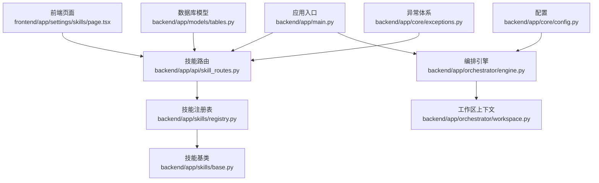
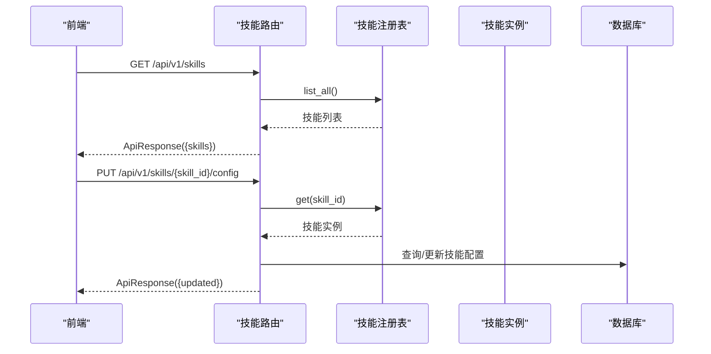
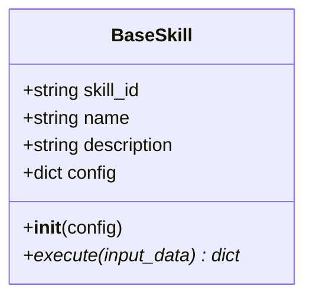
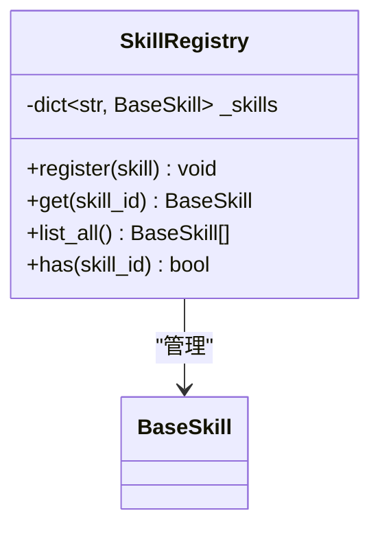
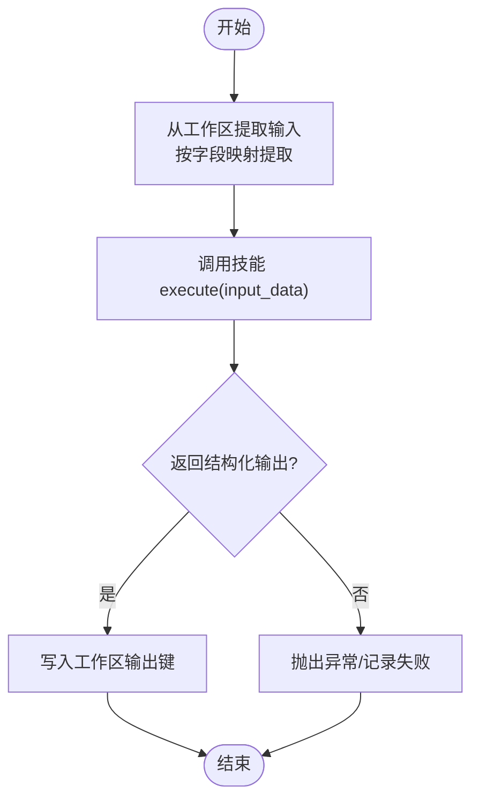
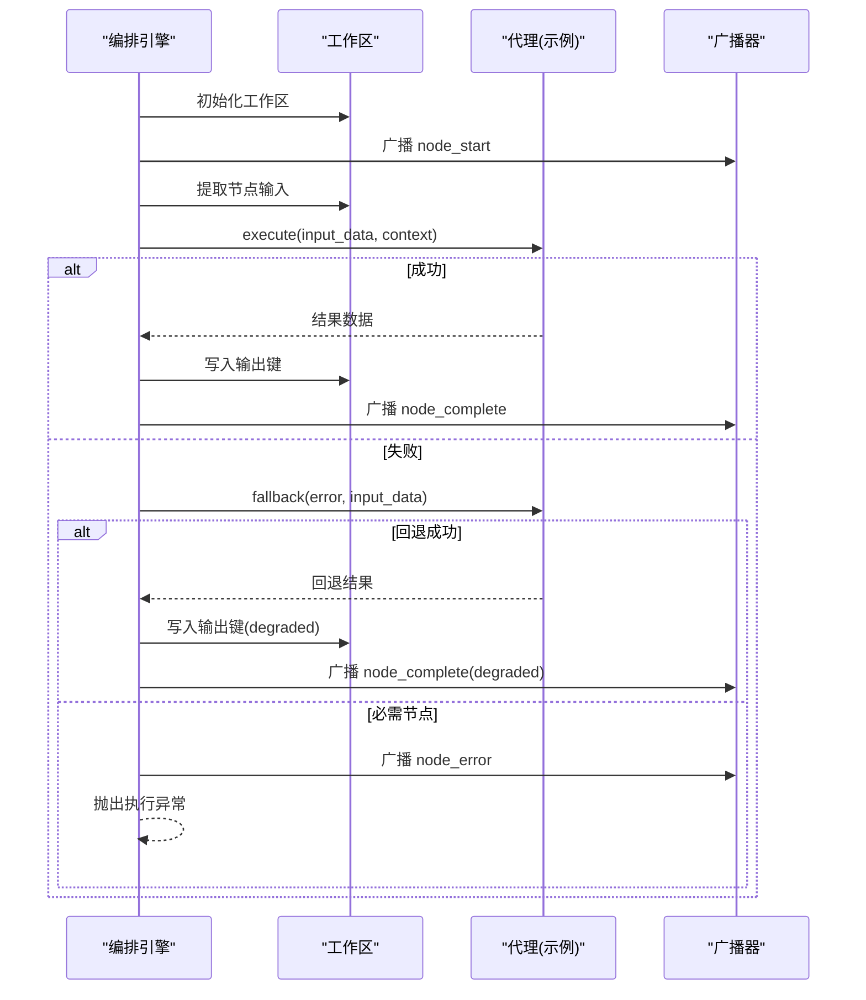
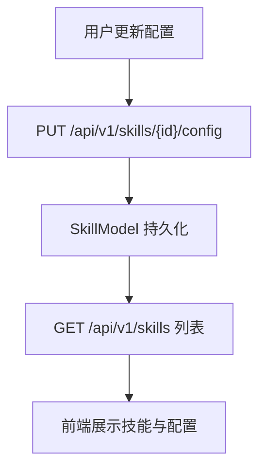
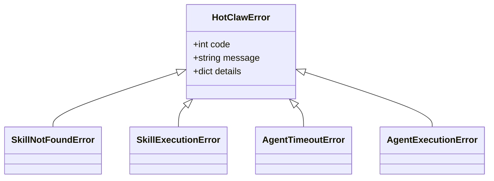
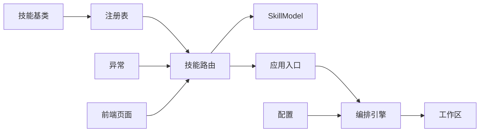

# 自定义技能开发

<cite>
**本文引用的文件**
- [backend/app/skills/base.py](file://backend/app/skills/base.py)
- [backend/app/skills/registry.py](file://backend/app/skills/registry.py)
- [backend/app/orchestrator/engine.py](file://backend/app/orchestrator/engine.py)
- [backend/app/orchestrator/workspace.py](file://backend/app/orchestrator/workspace.py)
- [backend/app/api/skill_routes.py](file://backend/app/api/skill_routes.py)
- [backend/app/models/tables.py](file://backend/app/models/tables.py)
- [backend/app/core/config.py](file://backend/app/core/config.py)
- [backend/app/core/exceptions.py](file://backend/app/core/exceptions.py)
- [backend/app/main.py](file://backend/app/main.py)
- [frontend/app/settings/skills/page.tsx](file://frontend/app/settings/skills/page.tsx)
</cite>

## 目录
1. [简介](#简介)
2. [项目结构](#项目结构)
3. [核心组件](#核心组件)
4. [架构总览](#架构总览)
5. [详细组件分析](#详细组件分析)
6. [依赖分析](#依赖分析)
7. [性能考虑](#性能考虑)
8. [故障排查指南](#故障排查指南)
9. [结论](#结论)
10. [附录](#附录)

## 简介
本指南面向开发者，系统讲解如何在本项目中开发与集成“自定义技能”。内容覆盖：
- 技能基类实现与抽象接口定义
- 执行协议与配置参数处理
- 输入输出规范、参数校验、数据转换与错误处理
- 技能执行引擎工作原理（异步、超时、降级）
- 技能注册与发现（动态加载、依赖管理、版本控制）
- 完整开发示例（从简单工具到复杂业务）
- 缓存策略、性能优化与资源管理
- 模板、测试与调试技巧

## 项目结构
后端采用 FastAPI + SQLAlchemy 异步架构；技能体系位于 backend/app/skills，注册中心为 SkillRegistry；前端提供技能列表页面。

**图表来源**
- [frontend/app/settings/skills/page.tsx:1-81](file://frontend/app/settings/skills/page.tsx#L1-L81)
- [backend/app/api/skill_routes.py:1-61](file://backend/app/api/skill_routes.py#L1-L61)
- [backend/app/skills/registry.py:1-37](file://backend/app/skills/registry.py#L1-L37)
- [backend/app/skills/base.py:1-37](file://backend/app/skills/base.py#L1-L37)
- [backend/app/orchestrator/engine.py:1-285](file://backend/app/orchestrator/engine.py#L1-L285)
- [backend/app/orchestrator/workspace.py:1-53](file://backend/app/orchestrator/workspace.py#L1-L53)
- [backend/app/main.py:1-142](file://backend/app/main.py#L1-L142)
- [backend/app/models/tables.py:1-233](file://backend/app/models/tables.py#L1-L233)
- [backend/app/core/config.py:1-51](file://backend/app/core/config.py#L1-L51)
- [backend/app/core/exceptions.py:1-125](file://backend/app/core/exceptions.py#L1-L125)

**章节来源**
- [backend/app/main.py:1-142](file://backend/app/main.py#L1-L142)
- [frontend/app/settings/skills/page.tsx:1-81](file://frontend/app/settings/skills/page.tsx#L1-L81)

## 核心组件
- 技能基类：定义统一的异步执行协议与配置注入点
- 技能注册表：集中管理技能实例，提供查询与枚举能力
- 技能路由：提供技能清单与配置更新接口
- 数据模型：持久化技能元信息、输入输出模式与配置
- 配置与异常：统一超时、错误码与异常类型
- 工作区上下文：任务级数据容器，支持字段映射提取
- 编排引擎：按节点顺序调度，记录节点运行日志与追踪

**章节来源**
- [backend/app/skills/base.py:16-37](file://backend/app/skills/base.py#L16-L37)
- [backend/app/skills/registry.py:10-37](file://backend/app/skills/registry.py#L10-L37)
- [backend/app/api/skill_routes.py:17-61](file://backend/app/api/skill_routes.py#L17-L61)
- [backend/app/models/tables.py:183-200](file://backend/app/models/tables.py#L183-L200)
- [backend/app/core/config.py:42-46](file://backend/app/core/config.py#L42-L46)
- [backend/app/core/exceptions.py:38-98](file://backend/app/core/exceptions.py#L38-L98)
- [backend/app/orchestrator/workspace.py:12-53](file://backend/app/orchestrator/workspace.py#L12-L53)
- [backend/app/orchestrator/engine.py:89-285](file://backend/app/orchestrator/engine.py#L89-L285)

## 架构总览
技能系统围绕“基类 + 注册表 + 路由 + 模型 + 配置 + 异常”构建，前端通过路由访问技能信息，后端在启动时完成注册表初始化，并在编排流程中按需调用技能。

**图表来源**
- [frontend/app/settings/skills/page.tsx:12-24](file://frontend/app/settings/skills/page.tsx#L12-L24)
- [backend/app/api/skill_routes.py:17-61](file://backend/app/api/skill_routes.py#L17-L61)
- [backend/app/skills/registry.py:22-26](file://backend/app/skills/registry.py#L22-L26)
- [backend/app/models/tables.py:183-200](file://backend/app/models/tables.py#L183-L200)

## 详细组件分析

### 技能基类与执行协议
- 抽象接口：execute(input_data: dict) -> dict，返回结构化输出
- 配置注入：构造函数接收 config，供子类读取
- 日志：统一使用 get_logger 获取日志器
- 设计约束：技能是工具能力，不参与编排，输出应稳定可复用

**图表来源**
- [backend/app/skills/base.py:16-37](file://backend/app/skills/base.py#L16-L37)

**章节来源**
- [backend/app/skills/base.py:16-37](file://backend/app/skills/base.py#L16-L37)

### 技能注册与发现
- 注册表：以 skill_id 为键存储技能实例，支持注册、查询、枚举、存在性检查
- 日志：重复注册会记录警告，成功注册记录 info
- 单例：提供 skill_registry 全局实例
- 路由：GET /api/v1/skills 列出已注册技能；PUT /api/v1/skills/{id}/config 更新配置

**图表来源**
- [backend/app/skills/registry.py:10-37](file://backend/app/skills/registry.py#L10-L37)
- [backend/app/skills/base.py:16-37](file://backend/app/skills/base.py#L16-L37)

**章节来源**
- [backend/app/skills/registry.py:10-37](file://backend/app/skills/registry.py#L10-L37)
- [backend/app/api/skill_routes.py:17-61](file://backend/app/api/skill_routes.py#L17-L61)

### 输入输出规范与参数处理
- 输入：execute 接收结构化字典 input_data
- 输出：必须返回结构化字典，便于后续映射与持久化
- 字段映射：工作区支持将上一步输出映射到下一步输入，支持“input.”前缀引用原始输入
- 模式定义：模型层提供 input_schema、output_schema 字段用于描述输入输出结构（可用于校验或文档）

**图表来源**
- [backend/app/orchestrator/workspace.py:36-52](file://backend/app/orchestrator/workspace.py#L36-L52)
- [backend/app/skills/base.py:26-36](file://backend/app/skills/base.py#L26-L36)
- [backend/app/models/tables.py:183-200](file://backend/app/models/tables.py#L183-L200)

**章节来源**
- [backend/app/orchestrator/workspace.py:36-52](file://backend/app/orchestrator/workspace.py#L36-L52)
- [backend/app/skills/base.py:26-36](file://backend/app/skills/base.py#L26-L36)
- [backend/app/models/tables.py:183-200](file://backend/app/models/tables.py#L183-L200)

### 技能执行引擎与超时控制
- 引擎职责：线性编排节点，记录节点运行状态、耗时、令牌统计与追踪
- 超时控制：通过 asyncio.wait_for 对每个节点执行设置超时（来自配置）
- 降级策略：节点失败时尝试回退（fallback），必要节点失败直接终止
- 广播通知：节点开始/完成/错误事件通过广播器推送
- 结果汇总：最终返回工作区快照作为结果

**图表来源**
- [backend/app/orchestrator/engine.py:92-234](file://backend/app/orchestrator/engine.py#L92-L234)
- [backend/app/orchestrator/engine.py:236-243](file://backend/app/orchestrator/engine.py#L236-L243)
- [backend/app/orchestrator/workspace.py:12-53](file://backend/app/orchestrator/workspace.py#L12-L53)

**章节来源**
- [backend/app/orchestrator/engine.py:89-285](file://backend/app/orchestrator/engine.py#L89-L285)
- [backend/app/core/config.py:42-46](file://backend/app/core/config.py#L42-L46)

### 配置参数与持久化
- 路由更新：PUT /api/v1/skills/{skill_id}/config 支持更新 config_data
- 模型字段：SkillModel 提供 version、module_path、input_schema、output_schema、config_data 等
- 前端展示：前端页面列出技能、版本、状态与配置

**图表来源**
- [backend/app/api/skill_routes.py:34-61](file://backend/app/api/skill_routes.py#L34-L61)
- [backend/app/models/tables.py:183-200](file://backend/app/models/tables.py#L183-L200)
- [frontend/app/settings/skills/page.tsx:12-24](file://frontend/app/settings/skills/page.tsx#L12-L24)

**章节来源**
- [backend/app/api/skill_routes.py:17-61](file://backend/app/api/skill_routes.py#L17-L61)
- [backend/app/models/tables.py:183-200](file://backend/app/models/tables.py#L183-L200)
- [frontend/app/settings/skills/page.tsx:1-81](file://frontend/app/settings/skills/page.tsx#L1-L81)

### 错误处理与异常体系
- 统一异常：HotClawError 及其子类（如 SkillExecutionError、SkillNotFoundError）
- HTTP 映射：全局异常处理器根据 code 分类映射到不同 HTTP 状态码
- 超时与外部错误：AgentTimeoutError、AgentExecutionError、LLMCallError、ExternalAPIError

**图表来源**
- [backend/app/core/exceptions.py:4-125](file://backend/app/core/exceptions.py#L4-L125)

**章节来源**
- [backend/app/core/exceptions.py:38-98](file://backend/app/core/exceptions.py#L38-L98)
- [backend/app/main.py:87-129](file://backend/app/main.py#L87-L129)

## 依赖分析
- 技能基类与注册表：低耦合，注册表仅依赖技能基类
- 路由依赖：技能路由依赖注册表与模型，用于查询与更新
- 引擎依赖：编排引擎依赖工作区、广播器与配置，负责节点调度与日志
- 前端依赖：前端页面依赖 API 路由获取技能列表

**图表来源**
- [backend/app/skills/base.py:16-37](file://backend/app/skills/base.py#L16-L37)
- [backend/app/skills/registry.py:10-37](file://backend/app/skills/registry.py#L10-L37)
- [backend/app/api/skill_routes.py:17-61](file://backend/app/api/skill_routes.py#L17-L61)
- [backend/app/models/tables.py:183-200](file://backend/app/models/tables.py#L183-L200)
- [backend/app/orchestrator/engine.py:89-285](file://backend/app/orchestrator/engine.py#L89-L285)
- [backend/app/orchestrator/workspace.py:12-53](file://backend/app/orchestrator/workspace.py#L12-L53)
- [backend/app/core/config.py:42-46](file://backend/app/core/config.py#L42-L46)
- [backend/app/core/exceptions.py:38-98](file://backend/app/core/exceptions.py#L38-L98)
- [frontend/app/settings/skills/page.tsx:12-24](file://frontend/app/settings/skills/page.tsx#L12-L24)

**章节来源**
- [backend/app/skills/base.py:16-37](file://backend/app/skills/base.py#L16-L37)
- [backend/app/skills/registry.py:10-37](file://backend/app/skills/registry.py#L10-L37)
- [backend/app/api/skill_routes.py:17-61](file://backend/app/api/skill_routes.py#L17-L61)
- [backend/app/models/tables.py:183-200](file://backend/app/models/tables.py#L183-L200)
- [backend/app/orchestrator/engine.py:89-285](file://backend/app/orchestrator/engine.py#L89-L285)
- [backend/app/orchestrator/workspace.py:12-53](file://backend/app/orchestrator/workspace.py#L12-L53)
- [backend/app/core/config.py:42-46](file://backend/app/core/config.py#L42-L46)
- [backend/app/core/exceptions.py:38-98](file://backend/app/core/exceptions.py#L38-L98)
- [frontend/app/settings/skills/page.tsx:12-24](file://frontend/app/settings/skills/page.tsx#L12-L24)

## 性能考虑
- 异步执行：技能与代理均采用 async/await，提升并发吞吐
- 超时控制：通过配置项限制单个节点执行时间，避免阻塞
- 日志与追踪：统一 trace_id，便于定位慢节点与问题根因
- 令牌统计：编排引擎聚合 prompt_tokens 与 completion_tokens，辅助成本控制
- 建议：
  - 将 IO 密集操作放入异步函数
  - 对外部服务调用设置合理超时与重试
  - 使用工作区进行中间结果缓存，减少重复计算
  - 对大对象序列化/反序列化进行节流

[本节为通用建议，无需特定文件引用]

## 故障排查指南
- 技能未注册：调用 get(skill_id) 将触发技能不存在异常
- 超时错误：节点执行超时会抛出 AgentTimeoutError，必要节点会导致任务失败
- 执行失败：节点返回失败时尝试 fallback，若无回退则按 required 字段决定任务成败
- 前端无技能：前端页面显示“暂无已注册的 Skill”，说明当前未注册独立技能

**章节来源**
- [backend/app/skills/registry.py:22-26](file://backend/app/skills/registry.py#L22-L26)
- [backend/app/orchestrator/engine.py:176-196](file://backend/app/orchestrator/engine.py#L176-L196)
- [backend/app/core/exceptions.py:79-98](file://backend/app/core/exceptions.py#L79-L98)
- [frontend/app/settings/skills/page.tsx:38-47](file://frontend/app/settings/skills/page.tsx#L38-L47)

## 结论
本技能体系以“异步 + 注册表 + 路由 + 模型 + 配置 + 异常”为核心，提供了清晰的扩展点与可观测性。开发者可基于 BaseSkill 实现具体技能，通过 SkillRegistry 动态注册，经由 API 进行配置管理，并在编排引擎中被代理节点调用。建议在实现中严格遵循输入输出规范、做好参数校验与错误处理，并结合超时与回退策略保障稳定性。

[本节为总结，无需特定文件引用]

## 附录

### 开发步骤与最佳实践
- 定义技能类：继承 BaseSkill，实现 execute，设置 skill_id/name/description
- 注册技能：在应用启动时或运行时通过 skill_registry.register 注册
- 配置管理：通过路由更新 config_data，持久化至 SkillModel
- 输入输出：严格返回结构化字典，配合工作区字段映射
- 错误处理：捕获并包装为统一异常，必要时抛出 SkillExecutionError
- 测试与调试：使用前端页面查看技能状态与配置；结合日志与 trace_id 定位问题

**章节来源**
- [backend/app/skills/base.py:16-37](file://backend/app/skills/base.py#L16-L37)
- [backend/app/skills/registry.py:16-20](file://backend/app/skills/registry.py#L16-L20)
- [backend/app/api/skill_routes.py:34-61](file://backend/app/api/skill_routes.py#L34-L61)
- [backend/app/orchestrator/workspace.py:36-52](file://backend/app/orchestrator/workspace.py#L36-L52)
- [backend/app/core/exceptions.py:93-98](file://backend/app/core/exceptions.py#L93-L98)
- [frontend/app/settings/skills/page.tsx:12-24](file://frontend/app/settings/skills/page.tsx#L12-L24)

### 示例路径参考
- 简单工具函数：实现一个只做数据转换的技能，返回结构化字典
- 复杂业务逻辑：封装对外 API 调用，包含参数校验、重试与降级
- 配置驱动：从 config 中读取参数，按版本切换行为
- 缓存与资源：在 execute 中复用连接池或缓存，注意并发安全

[本节为概念性指导，无需特定文件引用]