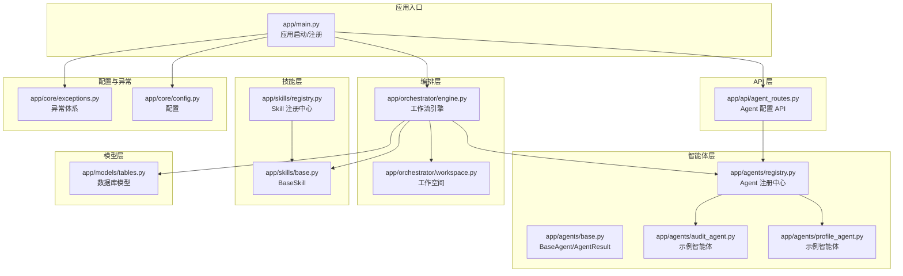
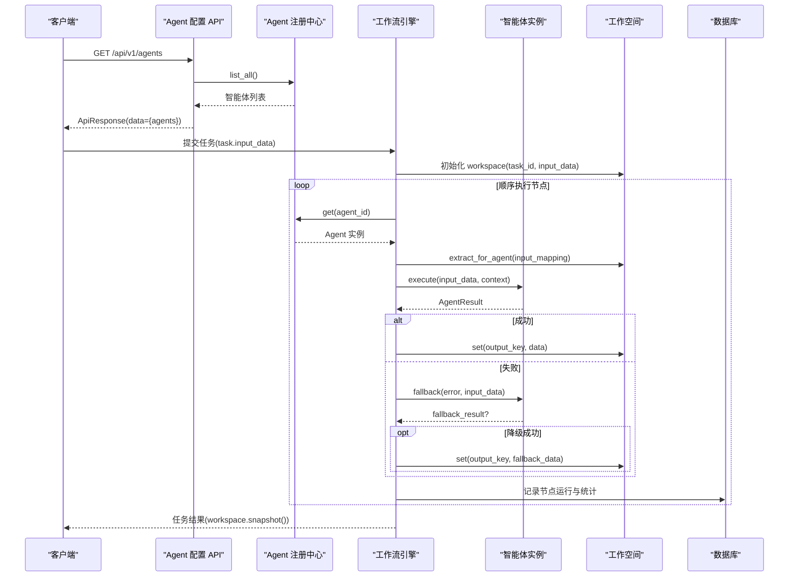
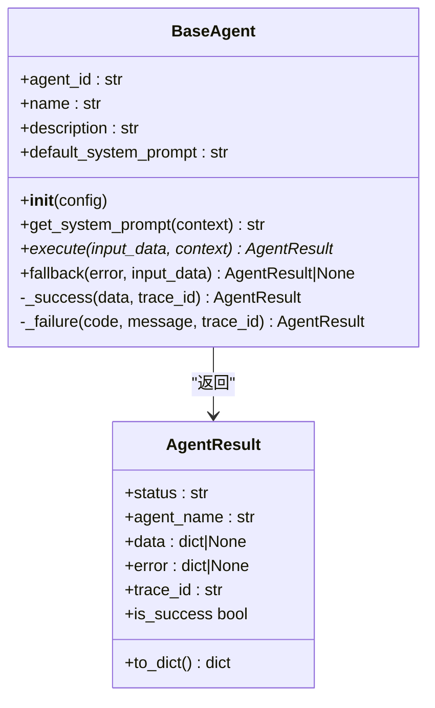
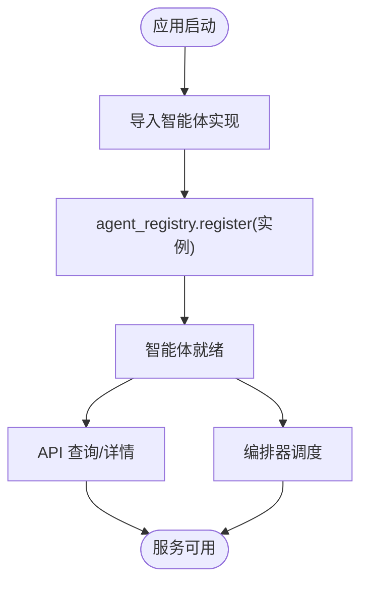
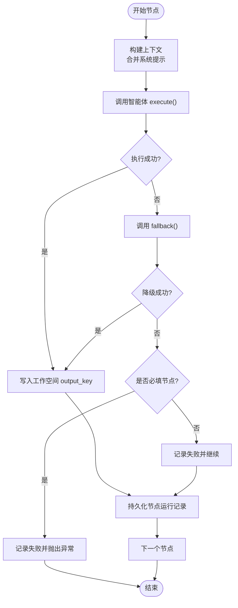
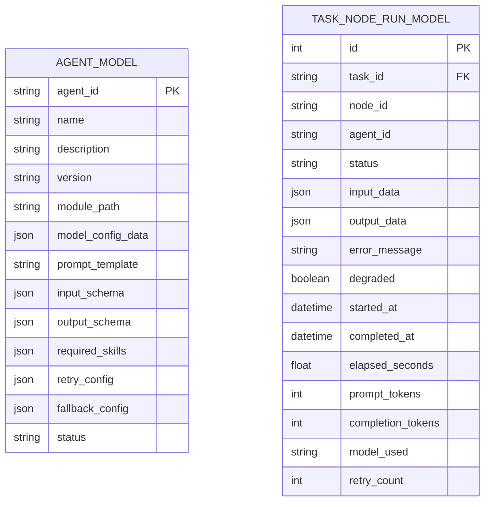
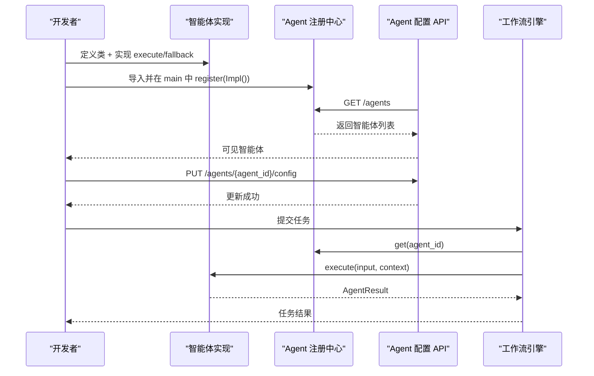
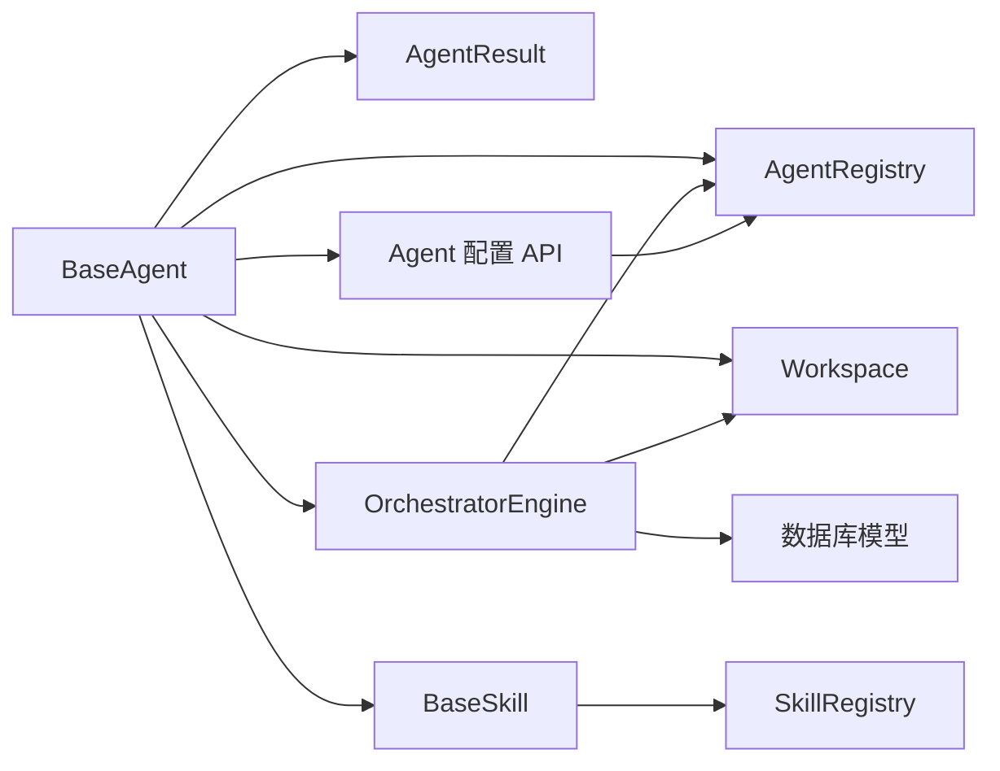

# 自定义智能体开发

<cite>
**本文引用的文件**
- [backend/app/agents/base.py](file://backend/app/agents/base.py)
- [backend/app/agents/registry.py](file://backend/app/agents/registry.py)
- [backend/app/agents/profile_agent.py](file://backend/app/agents/profile_agent.py)
- [backend/app/agents/audit_agent.py](file://backend/app/agents/audit_agent.py)
- [backend/app/schemas/agent.py](file://backend/app/schemas/agent.py)
- [backend/app/schemas/common.py](file://backend/app/schemas/common.py)
- [backend/app/orchestrator/engine.py](file://backend/app/orchestrator/engine.py)
- [backend/app/orchestrator/workspace.py](file://backend/app/orchestrator/workspace.py)
- [backend/app/api/agent_routes.py](file://backend/app/api/agent_routes.py)
- [backend/app/main.py](file://backend/app/main.py)
- [backend/app/core/config.py](file://backend/app/core/config.py)
- [backend/app/models/tables.py](file://backend/app/models/tables.py)
- [backend/app/core/exceptions.py](file://backend/app/core/exceptions.py)
- [backend/app/skills/base.py](file://backend/app/skills/base.py)
- [backend/app/skills/registry.py](file://backend/app/skills/registry.py)
- [Notice.md](file://Notice.md)
- [ARCHITECTURE.md](file://ARCHITECTURE.md)
</cite>

## 目录
1. [简介](#简介)
2. [项目结构](#项目结构)
3. [核心组件](#核心组件)
4. [架构总览](#架构总览)
5. [详细组件分析](#详细组件分析)
6. [依赖分析](#依赖分析)
7. [性能考量](#性能考量)
8. [故障排查指南](#故障排查指南)
9. [结论](#结论)
10. [附录](#附录)

## 简介
本指南面向开发者，提供在本项目中创建自定义智能体（Agent）的完整方法论与实操步骤。内容涵盖：
- BaseAgent 基类的继承与实现要点（抽象方法、生命周期钩子、错误处理）
- 智能体输入输出 Schema 的定义规范（数据验证、类型约束、默认值）
- 智能体执行逻辑模式（异步、状态管理、结果返回）
- 从类定义到注册使用的全流程示例
- 配置管理、动态加载与运行时行为控制
- 性能优化、内存与并发安全建议
- 可复用模板与最佳实践

## 项目结构
后端采用分层清晰的模块化组织，智能体位于 agents 层，编排引擎在 orchestrator 层，API 路由在 api 层，配置与异常在 core 层，数据库模型在 models 层。

图表来源
- [backend/app/main.py:32-58](file://backend/app/main.py#L32-L58)
- [backend/app/api/agent_routes.py:17-43](file://backend/app/api/agent_routes.py#L17-L43)
- [backend/app/orchestrator/engine.py:92-234](file://backend/app/orchestrator/engine.py#L92-L234)
- [backend/app/orchestrator/workspace.py:12-53](file://backend/app/orchestrator/workspace.py#L12-L53)
- [backend/app/agents/base.py:49-99](file://backend/app/agents/base.py#L49-L99)
- [backend/app/agents/registry.py:10-39](file://backend/app/agents/registry.py#L10-L39)
- [backend/app/skills/base.py:16-37](file://backend/app/skills/base.py#L16-L37)
- [backend/app/skills/registry.py:10-37](file://backend/app/skills/registry.py#L10-L37)
- [backend/app/core/config.py:7-51](file://backend/app/core/config.py#L7-L51)
- [backend/app/core/exceptions.py:4-125](file://backend/app/core/exceptions.py#L4-L125)
- [backend/app/models/tables.py:23-233](file://backend/app/models/tables.py#L23-L233)

章节来源
- [backend/app/main.py:32-58](file://backend/app/main.py#L32-L58)
- [ARCHITECTURE.md:414-448](file://ARCHITECTURE.md#L414-L448)

## 核心组件
- BaseAgent 抽象基类：定义智能体的统一接口、系统提示解析、成功/失败结果构造与可选降级策略。
- AgentResult 标准化结果：统一返回结构，包含状态、名称、数据、错误与追踪 ID。
- AgentRegistry 注册中心：集中管理智能体实例，提供注册、查询、枚举与存在性判断。
- Workspace 工作空间：任务级上下文容器，支持读写、快照与按映射提取输入。
- OrchestratorEngine 工作流引擎：顺序调度智能体、注入系统提示、超时控制、降级与错误传播。
- API 路由与 Schema：提供智能体列表、详情与配置更新接口，使用 Pydantic 校验请求体。
- 配置与异常：统一配置加载、超时设置与异常分类，便于统一错误处理。

章节来源
- [backend/app/agents/base.py:49-99](file://backend/app/agents/base.py#L49-L99)
- [backend/app/agents/registry.py:10-39](file://backend/app/agents/registry.py#L10-L39)
- [backend/app/orchestrator/workspace.py:12-53](file://backend/app/orchestrator/workspace.py#L12-L53)
- [backend/app/orchestrator/engine.py:92-234](file://backend/app/orchestrator/engine.py#L92-L234)
- [backend/app/api/agent_routes.py:17-115](file://backend/app/api/agent_routes.py#L17-L115)
- [backend/app/core/config.py:7-51](file://backend/app/core/config.py#L7-L51)
- [backend/app/core/exceptions.py:4-125](file://backend/app/core/exceptions.py#L4-L125)

## 架构总览
智能体开发遵循“控制平面/执行平面分离”的原则：编排器负责调度与上下文管理，智能体专注于执行与输出。系统通过注册中心集中管理智能体与技能，API 提供配置与查询能力，数据库持久化任务与节点运行记录。

图表来源
- [backend/app/api/agent_routes.py:17-43](file://backend/app/api/agent_routes.py#L17-L43)
- [backend/app/orchestrator/engine.py:92-234](file://backend/app/orchestrator/engine.py#L92-L234)
- [backend/app/orchestrator/workspace.py:36-53](file://backend/app/orchestrator/workspace.py#L36-L53)
- [backend/app/agents/registry.py:23-28](file://backend/app/agents/registry.py#L23-L28)

## 详细组件分析

### BaseAgent 基类与继承方法
- 抽象方法 execute：接收结构化输入与只读上下文，返回标准化 AgentResult。
- 生命周期钩子：
  - get_system_prompt(context)：从上下文或默认系统提示中解析有效提示。
  - fallback(error, input_data)：默认不降级，可覆盖实现降级策略。
- 结果构造：
  - _success(data, trace_id)：构造成功结果。
  - _failure(code, message, trace_id)：构造失败结果。
- 关键约束与协议：
  - 输出必须结构化 JSON，遵循统一 AgentResult 结构。
  - 不应承担多个职责，职责单一且可测试。

图表来源
- [backend/app/agents/base.py:49-99](file://backend/app/agents/base.py#L49-L99)

章节来源
- [backend/app/agents/base.py:49-99](file://backend/app/agents/base.py#L49-L99)
- [Notice.md:124-164](file://Notice.md#L124-L164)

### Agent 注册中心与动态加载
- 注册：通过 agent_registry.register(instance) 将智能体实例按 agent_id 注册。
- 查询：agent_registry.get(agent_id) 获取实例，不存在抛出统一异常。
- 列表：agent_registry.list_all() 返回所有已注册智能体。
- 动态加载：应用启动时导入实现类并注册，确保 API 可见与编排可用。

图表来源
- [backend/app/main.py:32-40](file://backend/app/main.py#L32-L40)
- [backend/app/agents/registry.py:16-21](file://backend/app/agents/registry.py#L16-L21)

章节来源
- [backend/app/main.py:32-40](file://backend/app/main.py#L32-L40)
- [backend/app/agents/registry.py:10-39](file://backend/app/agents/registry.py#L10-L39)

### 工作流引擎与执行逻辑
- 节点顺序：按固定线性链顺序执行，确保可控与可追踪。
- 输入映射：通过 Workspace.extract_for_agent(input_mapping) 从工作空间抽取所需字段。
- 系统提示解析：优先使用数据库自定义提示，否则回退到智能体默认提示。
- 超时控制：对单节点执行设置超时，超时触发统一异常。
- 降级与错误传播：失败时尝试 fallback，若必填节点降级失败则中断并上报；非必填节点记录错误但继续。
- 广播与持久化：节点开始/完成/错误事件通过广播器推送，节点运行记录持久化。

图表来源
- [backend/app/orchestrator/engine.py:137-196](file://backend/app/orchestrator/engine.py#L137-L196)
- [backend/app/orchestrator/workspace.py:36-53](file://backend/app/orchestrator/workspace.py#L36-L53)

章节来源
- [backend/app/orchestrator/engine.py:92-234](file://backend/app/orchestrator/engine.py#L92-L234)
- [backend/app/orchestrator/workspace.py:12-53](file://backend/app/orchestrator/workspace.py#L12-L53)

### 智能体输入输出 Schema 定义规范
- 输入输出 Schema 的作用：确保结构化输入输出、便于配置化与可审计。
- 定义方式：通过 Pydantic BaseModel 定义，结合数据库模型中的 JSON 字段存储 schema。
- Schema 存储：AgentModel.input_schema 与 AgentModel.output_schema 用于持久化。
- 请求体校验：API 使用 Pydantic 模型校验请求体，保证入参一致性。
- 输出约束：统一返回 AgentResult，包含 status、agent_name、data/error、trace_id。

图表来源
- [backend/app/models/tables.py:160-180](file://backend/app/models/tables.py#L160-L180)
- [backend/app/models/tables.py:48-73](file://backend/app/models/tables.py#L48-L73)

章节来源
- [backend/app/schemas/agent.py:6-29](file://backend/app/schemas/agent.py#L6-L29)
- [backend/app/models/tables.py:160-180](file://backend/app/models/tables.py#L160-L180)
- [backend/app/api/agent_routes.py:74-115](file://backend/app/api/agent_routes.py#L74-L115)

### 智能体执行逻辑实现模式
- 异步处理：execute/fallback 均为异步方法，适配 LLM 与外部 API 调用。
- 状态管理：通过 Workspace 在节点间共享上下文，避免全局状态污染。
- 结果返回：统一使用 AgentResult，便于编排器处理与前端展示。
- 超时与重试：编排器统一设置超时；重试策略可通过配置项传入智能体。
- 降级策略：fallback 返回成功数据可使链路继续，失败则按 required 决定是否中断。

章节来源
- [backend/app/orchestrator/engine.py:236-243](file://backend/app/orchestrator/engine.py#L236-L243)
- [backend/app/agents/base.py:77-82](file://backend/app/agents/base.py#L77-L82)

### 完整开发示例：从类定义到注册使用
- 步骤 1：创建智能体类，继承 BaseAgent，设置 agent_id/name/description/default_system_prompt。
- 步骤 2：实现 execute 方法，按输入输出 Schema 返回 AgentResult。
- 步骤 3：（可选）实现 fallback 方法，提供降级策略。
- 步骤 4：在应用启动时导入类并在 main 中注册到 agent_registry。
- 步骤 5：通过 API 查询智能体列表与详情，或更新配置（prompt、模型参数、重试策略）。
- 步骤 6：提交任务，编排器按固定链路调度你的智能体。

图表来源
- [backend/app/main.py:32-40](file://backend/app/main.py#L32-L40)
- [backend/app/api/agent_routes.py:74-115](file://backend/app/api/agent_routes.py#L74-L115)
- [backend/app/orchestrator/engine.py:137-196](file://backend/app/orchestrator/engine.py#L137-L196)

章节来源
- [backend/app/main.py:32-40](file://backend/app/main.py#L32-L40)
- [backend/app/api/agent_routes.py:17-115](file://backend/app/api/agent_routes.py#L17-L115)
- [backend/app/orchestrator/engine.py:92-234](file://backend/app/orchestrator/engine.py#L92-L234)

### 配置管理、动态加载与运行时行为控制
- 配置来源：环境变量与配置模块 settings，统一读取数据库、Redis、LLM、超时等参数。
- 智能体配置：AgentModel 持久化模型配置、提示模板、输入输出 Schema、重试与降级配置。
- 运行时控制：API 支持更新智能体配置，编排器在执行前解析有效系统提示并注入上下文。
- 动态加载：应用启动时导入智能体实现并注册，无需重启即可生效。

章节来源
- [backend/app/core/config.py:7-51](file://backend/app/core/config.py#L7-L51)
- [backend/app/models/tables.py:160-180](file://backend/app/models/tables.py#L160-L180)
- [backend/app/api/agent_routes.py:74-115](file://backend/app/api/agent_routes.py#L74-L115)
- [backend/app/orchestrator/engine.py:140-146](file://backend/app/orchestrator/engine.py#L140-L146)

## 依赖分析
- 智能体依赖：BaseAgent、AgentResult、AgentRegistry、Workspace、编排器、API、配置与异常。
- 技能依赖：BaseSkill、SkillRegistry，智能体通过注册中心调用技能。
- 数据依赖：数据库模型持久化任务、节点运行、智能体与技能配置。
- 外部依赖：LLM API、Redis（可选）、数据库。

图表来源
- [backend/app/agents/base.py:49-99](file://backend/app/agents/base.py#L49-L99)
- [backend/app/agents/registry.py:10-39](file://backend/app/agents/registry.py#L10-L39)
- [backend/app/orchestrator/engine.py:92-234](file://backend/app/orchestrator/engine.py#L92-L234)
- [backend/app/models/tables.py:23-233](file://backend/app/models/tables.py#L23-L233)
- [backend/app/skills/base.py:16-37](file://backend/app/skills/base.py#L16-L37)
- [backend/app/skills/registry.py:10-37](file://backend/app/skills/registry.py#L10-L37)

章节来源
- [backend/app/agents/base.py:49-99](file://backend/app/agents/base.py#L49-L99)
- [backend/app/skills/base.py:16-37](file://backend/app/skills/base.py#L16-L37)

## 性能考量
- 超时控制：统一设置 agent_timeout，避免长尾阻塞；必要时在智能体内部对 LLM/外部 API 设置更细粒度超时。
- 并发安全：智能体内部避免共享可变状态，使用只读上下文与不可变数据结构；编排器按序执行，降低竞态。
- 内存管理：避免在智能体中缓存大对象；使用 Workspace 传递必要数据，及时释放临时变量。
- I/O 优化：合并外部 API 调用，减少往返；对热点数据使用本地缓存（注意缓存失效策略）。
- 日志与追踪：利用 trace_id 串联任务与节点，便于定位性能瓶颈。

章节来源
- [backend/app/core/config.py:42-45](file://backend/app/core/config.py#L42-L45)
- [backend/app/orchestrator/engine.py:236-243](file://backend/app/orchestrator/engine.py#L236-L243)
- [Notice.md:342-370](file://Notice.md#L342-L370)

## 故障排查指南
- 常见异常：
  - AgentNotFoundError：智能体未注册或 ID 错误。
  - AgentTimeoutError：节点执行超时，检查 LLM/外部 API 超时与网络。
  - AgentExecutionError：智能体执行失败，查看节点错误消息与日志。
  - SkillNotFoundError：依赖的技能未注册。
- 排查步骤：
  - 检查智能体是否在 main 中注册。
  - 通过 API 获取智能体详情，确认系统提示来源与配置。
  - 查看节点运行记录（task_node_runs）与系统日志（system_logs）。
  - 启用调试模式查看详细错误信息。

章节来源
- [backend/app/core/exceptions.py:31-98](file://backend/app/core/exceptions.py#L31-L98)
- [backend/app/api/agent_routes.py:46-71](file://backend/app/api/agent_routes.py#L46-L71)
- [backend/app/models/tables.py:48-73](file://backend/app/models/tables.py#L48-L73)

## 结论
本指南提供了在现有架构上创建自定义智能体的系统方法：以 BaseAgent 为核心，遵循统一输入输出协议与结构化返回；通过注册中心与编排器实现可观察、可配置、可降级的工作流；借助 API 与数据库模型实现配置化与持久化。遵循这些实践，可在保证可维护性的前提下快速扩展智能体能力。

## 附录

### 可复用模板与最佳实践
- 模板字段与职责
  - agent_id：全局唯一标识，用于注册与编排。
  - name/description：用于 UI 与 API 展示。
  - default_system_prompt：默认系统提示，支持变量占位。
  - execute：实现业务逻辑，返回 AgentResult。
  - fallback：提供降级策略，保障链路可用。
- Schema 定义
  - 使用 Pydantic BaseModel 定义输入输出结构，便于校验与文档化。
  - 将 Schema 存入 AgentModel.input_schema 与 AgentModel.output_schema。
- 配置与运行时
  - 通过 API 更新 prompt、模型参数与重试策略。
  - 编排器在执行前解析有效系统提示并注入上下文。
- 示例参考
  - ProfileAgent：演示结构化输出与降级策略。
  - AuditAgent：演示审核维度与降级返回。

章节来源
- [backend/app/agents/profile_agent.py:10-73](file://backend/app/agents/profile_agent.py#L10-L73)
- [backend/app/agents/audit_agent.py:7-66](file://backend/app/agents/audit_agent.py#L7-L66)
- [backend/app/schemas/agent.py:6-29](file://backend/app/schemas/agent.py#L6-L29)
- [backend/app/models/tables.py:160-180](file://backend/app/models/tables.py#L160-L180)
- [backend/app/api/agent_routes.py:74-115](file://backend/app/api/agent_routes.py#L74-L115)