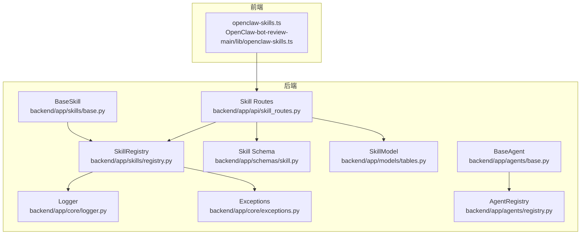
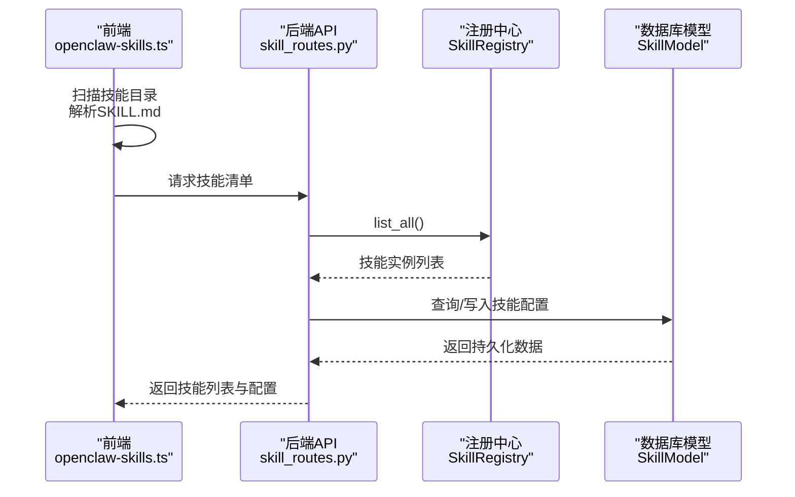
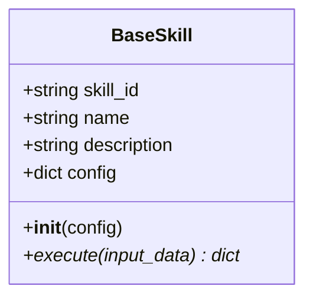
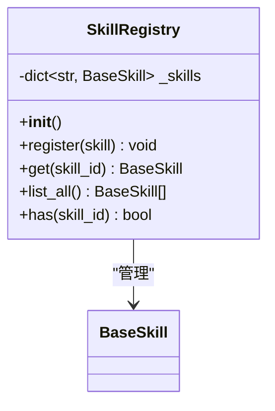
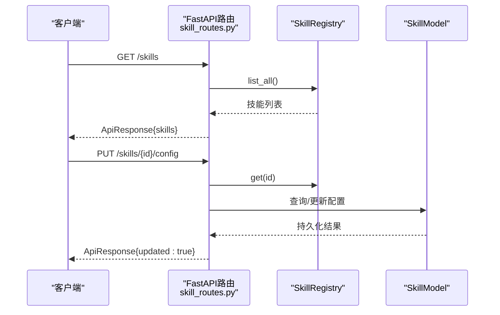
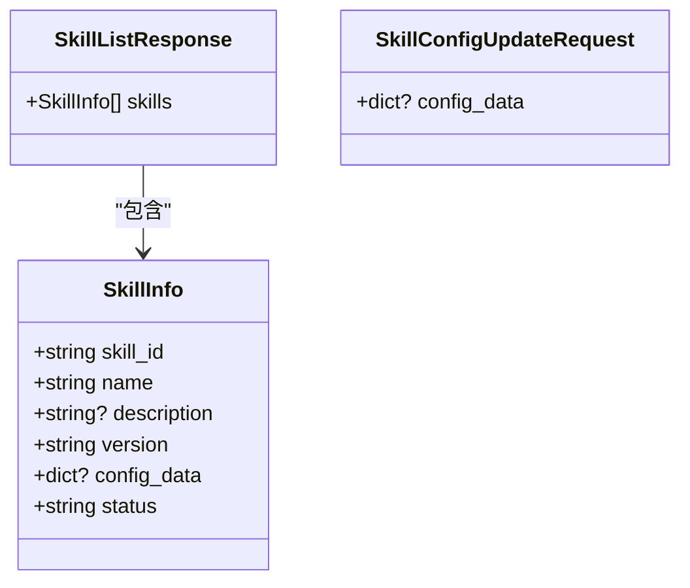
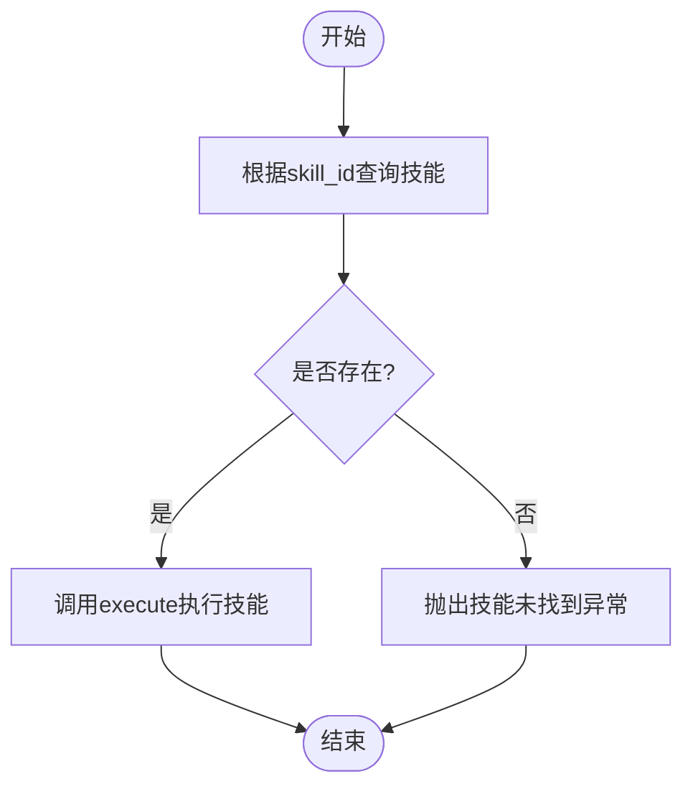
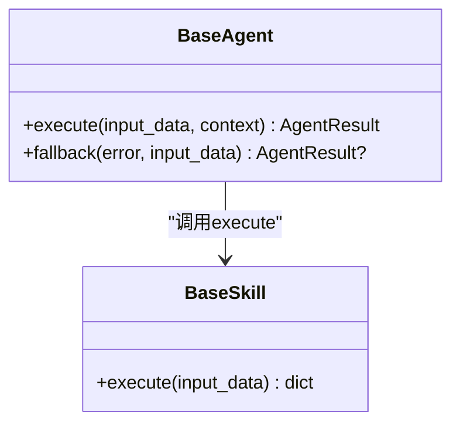
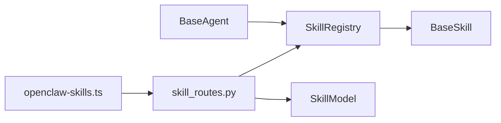

# Skill机制设计

<cite>
**本文引用的文件**
- [backend/app/skills/base.py](file://backend/app/skills/base.py)
- [backend/app/skills/registry.py](file://backend/app/skills/registry.py)
- [backend/app/api/skill_routes.py](file://backend/app/api/skill_routes.py)
- [backend/app/schemas/skill.py](file://backend/app/schemas/skill.py)
- [backend/app/models/tables.py](file://backend/app/models/tables.py)
- [backend/app/core/logger.py](file://backend/app/core/logger.py)
- [backend/app/core/exceptions.py](file://backend/app/core/exceptions.py)
- [backend/app/agents/base.py](file://backend/app/agents/base.py)
- [backend/app/agents/registry.py](file://backend/app/agents/registry.py)
- [OpenClaw-bot-review-main/lib/openclaw-skills.ts](file://OpenClaw-bot-review-main/lib/openclaw-skills.ts)
</cite>

## 目录
1. [引言](#引言)
2. [项目结构](#项目结构)
3. [核心组件](#核心组件)
4. [架构总览](#架构总览)
5. [详细组件分析](#详细组件分析)
6. [依赖关系分析](#依赖关系分析)
7. [性能考量](#性能考量)
8. [故障排查指南](#故障排查指南)
9. [结论](#结论)
10. [附录](#附录)

## 引言
本文件系统化阐述HotClaw中“Skill（技能）”机制的设计与实现，面向开发者提供从概念到代码级细节的完整理解框架。重点包括：
- Skill与Agent的根本区别：Skill是无状态的原子工具能力，不参与编排流程；Agent是有状态的工作流节点，负责业务任务并可调用Skill。
- Skill的设计原则：工具类型处理、稳定输出、可复用性。
- Skill基类BaseSkill的架构设计：抽象方法execute、配置管理、日志记录。
- 声明式注册机制与动态加载原理（前端扫描与后端持久化）。
- Skill配置schema的设计模式与最佳实践。
- 生命周期管理、错误处理策略与性能考虑。

## 项目结构
围绕Skill机制的关键模块分布如下：
- 后端Python层
  - 技能基类与注册中心：backend/app/skills/base.py、backend/app/skills/registry.py
  - 技能API路由：backend/app/api/skill_routes.py
  - 技能Schema：backend/app/schemas/skill.py
  - 数据模型（技能持久化）：backend/app/models/tables.py
  - 日志与异常：backend/app/core/logger.py、backend/app/core/exceptions.py
  - Agent基类与注册中心：backend/app/agents/base.py、backend/app/agents/registry.py
- 前端TypeScript层
  - 技能清单与内容扫描：OpenClaw-bot-review-main/lib/openclaw-skills.ts

图表来源
- [backend/app/skills/base.py:1-37](file://backend/app/skills/base.py#L1-L37)
- [backend/app/skills/registry.py:1-37](file://backend/app/skills/registry.py#L1-L37)
- [backend/app/api/skill_routes.py:1-61](file://backend/app/api/skill_routes.py#L1-L61)
- [backend/app/schemas/skill.py:1-22](file://backend/app/schemas/skill.py#L1-L22)
- [backend/app/models/tables.py:183-199](file://backend/app/models/tables.py#L183-L199)
- [backend/app/core/logger.py:1-36](file://backend/app/core/logger.py#L1-L36)
- [backend/app/core/exceptions.py:38-43](file://backend/app/core/exceptions.py#L38-L43)
- [backend/app/agents/base.py:1-99](file://backend/app/agents/base.py#L1-L99)
- [backend/app/agents/registry.py:1-40](file://backend/app/agents/registry.py#L1-L40)
- [OpenClaw-bot-review-main/lib/openclaw-skills.ts:111-162](file://OpenClaw-bot-review-main/lib/openclaw-skills.ts#L111-L162)

章节来源
- [backend/app/skills/base.py:1-37](file://backend/app/skills/base.py#L1-L37)
- [backend/app/skills/registry.py:1-37](file://backend/app/skills/registry.py#L1-L37)
- [backend/app/api/skill_routes.py:1-61](file://backend/app/api/skill_routes.py#L1-L61)
- [backend/app/schemas/skill.py:1-22](file://backend/app/schemas/skill.py#L1-L22)
- [backend/app/models/tables.py:183-199](file://backend/app/models/tables.py#L183-L199)
- [backend/app/core/logger.py:1-36](file://backend/app/core/logger.py#L1-L36)
- [backend/app/core/exceptions.py:38-43](file://backend/app/core/exceptions.py#L38-L43)
- [backend/app/agents/base.py:1-99](file://backend/app/agents/base.py#L1-L99)
- [backend/app/agents/registry.py:1-40](file://backend/app/agents/registry.py#L1-L40)
- [OpenClaw-bot-review-main/lib/openclaw-skills.ts:111-162](file://OpenClaw-bot-review-main/lib/openclaw-skills.ts#L111-L162)

## 核心组件
- BaseSkill：所有技能的抽象基类，定义统一的执行接口execute与基础配置字段。
- SkillRegistry：集中注册与检索技能实例，提供注册、查询、列表与存在性检查。
- Skill API路由：提供技能清单查询与配置更新接口，并与数据库模型交互。
- Skill Schema：定义技能信息、列表响应与配置更新请求的数据结构。
- SkillModel：技能配置在数据库中的持久化模型，支持输入/输出schema与配置数据存储。
- Logger与Exceptions：统一的日志结构化输出与异常体系，用于技能注册、查询与执行过程的可观测性与错误传播。
- BaseAgent与AgentRegistry：Agent侧的基类与注册中心，体现Skill与Agent在职责上的根本差异。

章节来源
- [backend/app/skills/base.py:16-37](file://backend/app/skills/base.py#L16-L37)
- [backend/app/skills/registry.py:10-37](file://backend/app/skills/registry.py#L10-L37)
- [backend/app/api/skill_routes.py:17-61](file://backend/app/api/skill_routes.py#L17-L61)
- [backend/app/schemas/skill.py:6-22](file://backend/app/schemas/skill.py#L6-L22)
- [backend/app/models/tables.py:183-199](file://backend/app/models/tables.py#L183-L199)
- [backend/app/core/logger.py:33-36](file://backend/app/core/logger.py#L33-L36)
- [backend/app/core/exceptions.py:38-43](file://backend/app/core/exceptions.py#L38-L43)
- [backend/app/agents/base.py:49-99](file://backend/app/agents/base.py#L49-L99)
- [backend/app/agents/registry.py:10-40](file://backend/app/agents/registry.py#L10-L40)

## 架构总览
Skill机制在系统中的位置与交互如下：
- 前端通过openclaw-skills.ts扫描内置、扩展与自定义技能目录，生成技能清单与使用关系。
- 后端提供技能API，查询已注册技能并持久化技能配置。
- SkillRegistry作为内存注册表，承载技能实例的生命周期管理。
- BaseSkill定义统一的execute接口，确保技能具备稳定的工具型输出。
- Agent通过AgentRegistry获取自身所需技能，调用其execute完成具体任务。

图表来源
- [OpenClaw-bot-review-main/lib/openclaw-skills.ts:111-162](file://OpenClaw-bot-review-main/lib/openclaw-skills.ts#L111-L162)
- [backend/app/api/skill_routes.py:17-61](file://backend/app/api/skill_routes.py#L17-L61)
- [backend/app/skills/registry.py:28-32](file://backend/app/skills/registry.py#L28-L32)
- [backend/app/models/tables.py:183-199](file://backend/app/models/tables.py#L183-L199)

## 详细组件分析

### BaseSkill与设计原则
- 抽象方法execute：定义技能的统一执行入口，接收结构化输入并返回结构化输出，保证工具型处理与稳定输出。
- 配置管理：通过构造函数注入config字典，便于在不同上下文中复用同一技能实现。
- 日志记录：继承统一的结构化日志系统，便于追踪技能注册与运行状态。

图表来源
- [backend/app/skills/base.py:19-37](file://backend/app/skills/base.py#L19-L37)

章节来源
- [backend/app/skills/base.py:16-37](file://backend/app/skills/base.py#L16-L37)
- [backend/app/core/logger.py:33-36](file://backend/app/core/logger.py#L33-L36)

### SkillRegistry与声明式注册
- 注册：register方法将技能实例按skill_id存入内存字典，重复注册会记录告警日志。
- 查询：get方法按skill_id检索技能，不存在时抛出技能未找到异常。
- 列表与存在性：list_all与has分别提供枚举与存在性判断。
- 单例：全局共享的skill_registry实例贯穿API与服务层。

图表来源
- [backend/app/skills/registry.py:10-37](file://backend/app/skills/registry.py#L10-L37)

章节来源
- [backend/app/skills/registry.py:10-37](file://backend/app/skills/registry.py#L10-L37)
- [backend/app/core/exceptions.py:38-43](file://backend/app/core/exceptions.py#L38-L43)
- [backend/app/core/logger.py:33-36](file://backend/app/core/logger.py#L33-L36)

### 技能API与动态加载
- 列表接口：GET /api/v1/skills返回已注册技能的基本信息与当前配置。
- 配置更新：PUT /api/v1/skills/{skill_id}/config更新技能配置，并持久化到SkillModel。
- 动态加载：前端通过openclaw-skills.ts扫描内置、扩展与自定义技能目录，解析SKILL.md元信息，构建技能清单与使用关系；后端API据此进行配置同步与持久化。

图表来源
- [backend/app/api/skill_routes.py:17-61](file://backend/app/api/skill_routes.py#L17-L61)
- [backend/app/skills/registry.py:22-29](file://backend/app/skills/registry.py#L22-L29)
- [backend/app/models/tables.py:183-199](file://backend/app/models/tables.py#L183-L199)

章节来源
- [backend/app/api/skill_routes.py:17-61](file://backend/app/api/skill_routes.py#L17-L61)
- [OpenClaw-bot-review-main/lib/openclaw-skills.ts:111-162](file://OpenClaw-bot-review-main/lib/openclaw-skills.ts#L111-L162)

### Skill配置Schema与最佳实践
- SkillInfo：技能标识、名称、描述、版本、配置数据与状态。
- SkillListResponse：技能列表响应结构。
- SkillConfigUpdateRequest：配置更新请求体，支持传入或清空配置数据。
- 最佳实践建议：
  - 明确输入/输出schema，确保execute的输入输出结构化且可验证。
  - 将环境敏感参数放入config_data，避免硬编码。
  - 使用版本字段区分兼容性，配合持久化模型进行灰度与回滚。
  - 保持execute幂等与无状态，便于复用与并发调用。

图表来源
- [backend/app/schemas/skill.py:6-22](file://backend/app/schemas/skill.py#L6-L22)

章节来源
- [backend/app/schemas/skill.py:6-22](file://backend/app/schemas/skill.py#L6-L22)

### 生命周期管理与错误处理
- 生命周期：技能实例由SkillRegistry集中管理，注册后可被Agent调用；配置可通过API更新并持久化。
- 错误处理：
  - 查询不存在技能时抛出技能未找到异常。
  - 统一异常体系便于上层Agent降级与错误传播。
  - 结构化日志记录关键事件，便于审计与排障。

图表来源
- [backend/app/skills/registry.py:22-29](file://backend/app/skills/registry.py#L22-L29)
- [backend/app/core/exceptions.py:38-43](file://backend/app/core/exceptions.py#L38-L43)

章节来源
- [backend/app/skills/registry.py:22-29](file://backend/app/skills/registry.py#L22-L29)
- [backend/app/core/exceptions.py:38-43](file://backend/app/core/exceptions.py#L38-L43)
- [backend/app/core/logger.py:33-36](file://backend/app/core/logger.py#L33-L36)

### Skill与Agent的根本区别
- Skill：无状态的原子工具能力，仅做工具型处理，输出应稳定可复用。
- Agent：有状态的工作流节点，负责单一业务任务，具备明确输入/输出，可调用多个Skill并进行编排。

图表来源
- [backend/app/skills/base.py:26-37](file://backend/app/skills/base.py#L26-L37)
- [backend/app/agents/base.py:64-99](file://backend/app/agents/base.py#L64-L99)

章节来源
- [backend/app/skills/base.py:1-8](file://backend/app/skills/base.py#L1-L8)
- [backend/app/agents/base.py:1-9](file://backend/app/agents/base.py#L1-L9)

## 依赖关系分析
- SkillRegistry依赖BaseSkill与异常体系，提供注册、查询与日志功能。
- API路由依赖SkillRegistry与SkillModel，实现技能清单与配置更新。
- 前端openclaw-skills.ts与后端API协作，完成技能发现与配置同步。
- Agent与Skill在职责上解耦：Agent负责编排与上下文传递，Skill专注原子工具执行。

图表来源
- [OpenClaw-bot-review-main/lib/openclaw-skills.ts:111-162](file://OpenClaw-bot-review-main/lib/openclaw-skills.ts#L111-L162)
- [backend/app/api/skill_routes.py:17-61](file://backend/app/api/skill_routes.py#L17-L61)
- [backend/app/skills/registry.py:10-37](file://backend/app/skills/registry.py#L10-L37)
- [backend/app/models/tables.py:183-199](file://backend/app/models/tables.py#L183-L199)
- [backend/app/agents/base.py:49-99](file://backend/app/agents/base.py#L49-L99)

章节来源
- [OpenClaw-bot-review-main/lib/openclaw-skills.ts:111-162](file://OpenClaw-bot-review-main/lib/openclaw-skills.ts#L111-L162)
- [backend/app/api/skill_routes.py:17-61](file://backend/app/api/skill_routes.py#L17-L61)
- [backend/app/skills/registry.py:10-37](file://backend/app/skills/registry.py#L10-L37)
- [backend/app/models/tables.py:183-199](file://backend/app/models/tables.py#L183-L199)
- [backend/app/agents/base.py:49-99](file://backend/app/agents/base.py#L49-L99)

## 性能考量
- 无状态执行：BaseSkill的execute应尽量无状态，减少锁竞争与上下文切换，提升并发吞吐。
- 配置缓存：对频繁访问的config_data可在内存中缓存，降低数据库查询频率。
- 日志开销：结构化日志JSON渲染与IO写入可能成为瓶颈，建议按需采样或分级。
- 幂等设计：确保execute幂等，便于重试与去重，减少重复计算。
- 资源隔离：将外部依赖（如网络、文件）封装为独立模块，便于限流与熔断。

## 故障排查指南
- 技能未找到：确认技能是否已注册，检查skill_id是否正确；关注注册中心日志与异常抛出点。
- 配置更新失败：核对请求体格式与数据库写入逻辑；检查SkillModel字段映射。
- 执行异常：在Agent侧捕获技能执行异常，结合结构化日志定位trace_id与上下文。
- 前端技能缺失：检查openclaw-skills.ts扫描路径与SKILL.md元信息解析逻辑。

章节来源
- [backend/app/core/exceptions.py:38-43](file://backend/app/core/exceptions.py#L38-L43)
- [backend/app/api/skill_routes.py:34-61](file://backend/app/api/skill_routes.py#L34-L61)
- [OpenClaw-bot-review-main/lib/openclaw-skills.ts:30-62](file://OpenClaw-bot-review-main/lib/openclaw-skills.ts#L30-L62)

## 结论
HotClaw的Skill机制以BaseSkill为核心，通过SkillRegistry实现声明式注册与集中管理，配合API路由与数据库模型完成配置持久化与动态加载。该设计强调工具型、无状态与稳定输出，与Agent的有状态编排职责形成清晰边界。遵循本文提供的Schema设计、生命周期管理与错误处理策略，可有效提升Skill的可维护性与可复用性。

## 附录
- 设计原则速览
  - 工具类型处理：聚焦单一原子能力，避免过度职责。
  - 稳定输出：execute返回结构化数据，便于Agent消费与后续处理。
  - 可复用性：无状态与幂等设计，支持多Agent共享调用。
- 最佳实践清单
  - 明确输入/输出schema，使用Pydantic校验。
  - 将环境参数放入config_data，避免硬编码。
  - 使用版本字段与持久化模型，支持灰度与回滚。
  - 在Agent侧实现fallback策略，增强系统韧性。
  - 通过结构化日志与异常体系，完善可观测性。