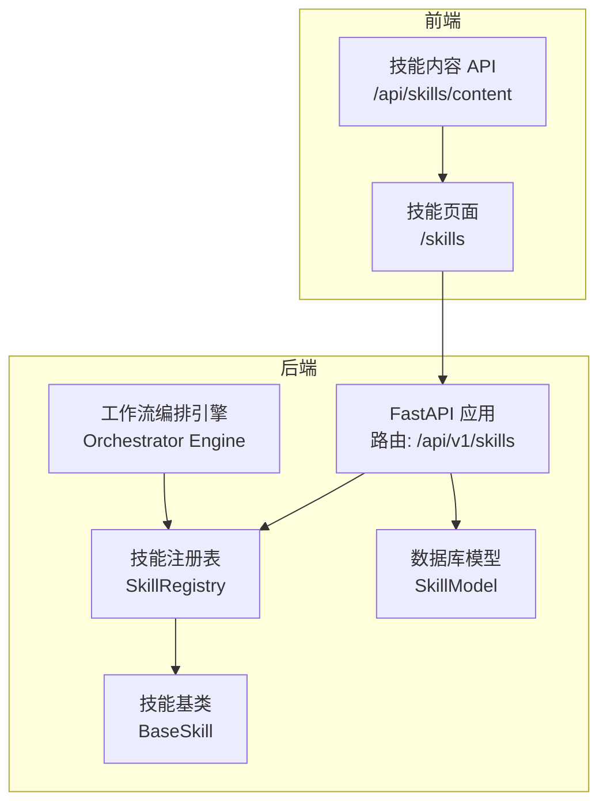
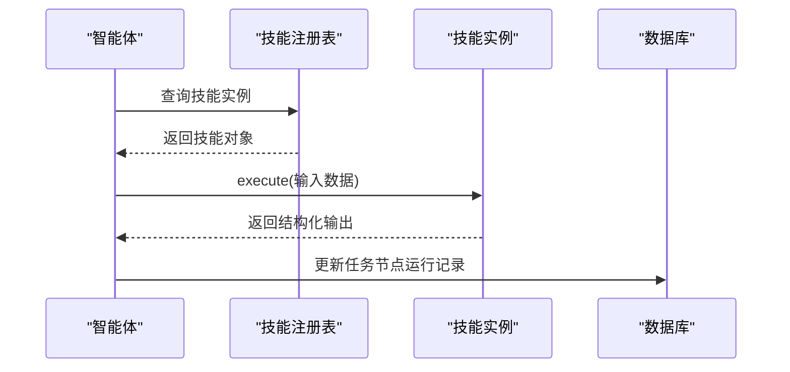
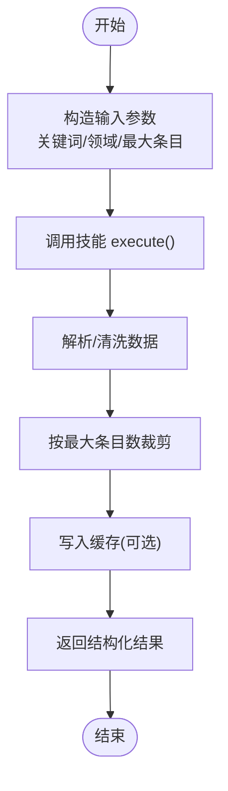
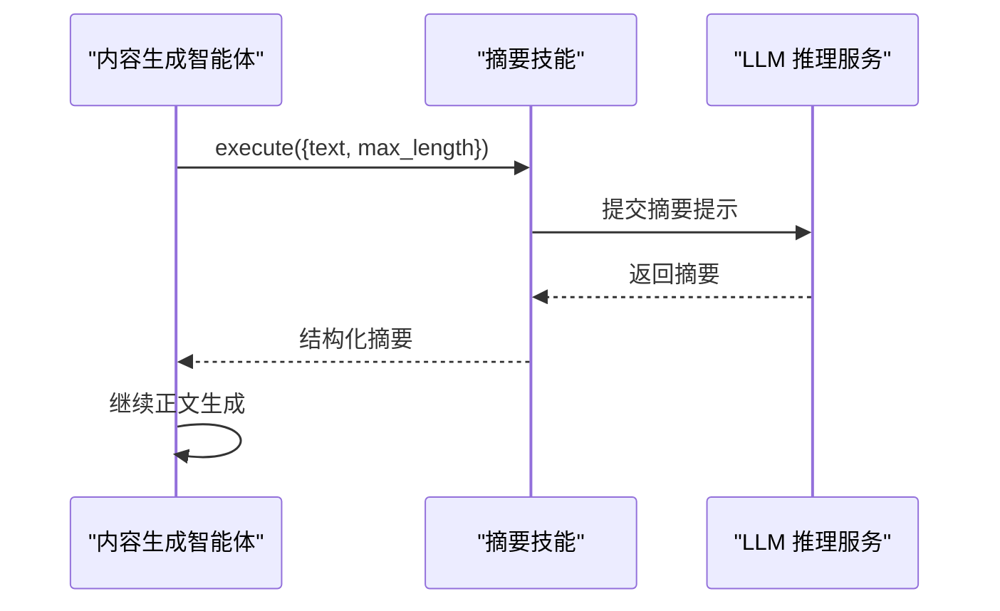
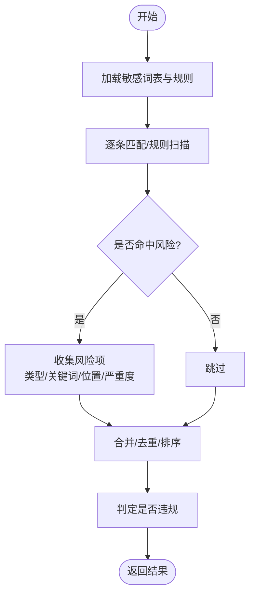
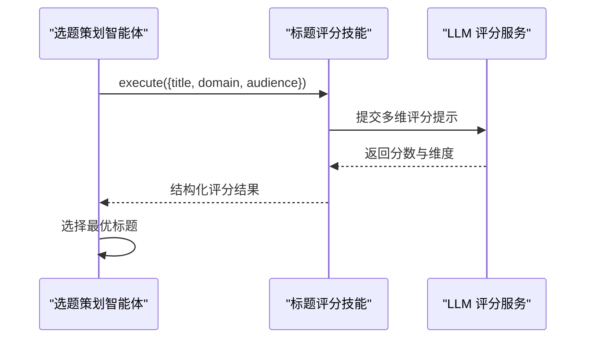
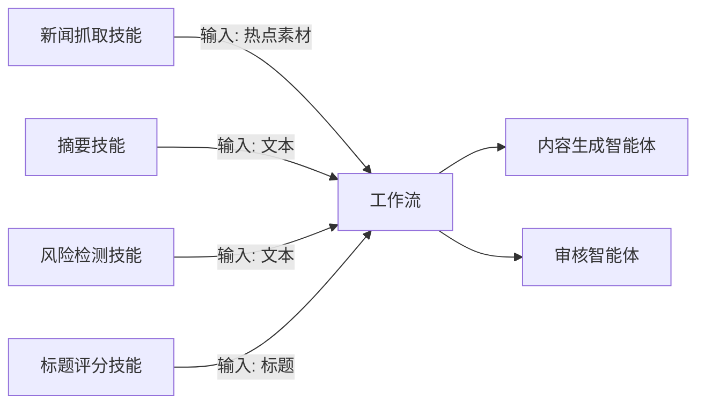
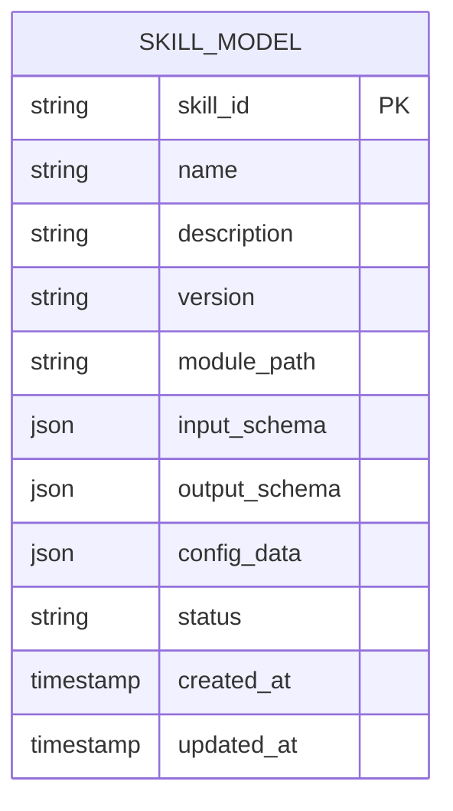

# 内置技能实现

<cite>
**本文引用的文件**
- [backend/app/skills/base.py](file://backend/app/skills/base.py)
- [backend/app/skills/registry.py](file://backend/app/skills/registry.py)
- [backend/app/api/skill_routes.py](file://backend/app/api/skill_routes.py)
- [backend/app/schemas/skill.py](file://backend/app/schemas/skill.py)
- [backend/app/models/tables.py](file://backend/app/models/tables.py)
- [backend/app/orchestrator/engine.py](file://backend/app/orchestrator/engine.py)
- [ARCHITECTURE.md](file://ARCHITECTURE.md)
- [frontend/app/skills/page.tsx](file://frontend/app/skills/page.tsx)
- [frontend/app/api/skills/content/route.ts](file://frontend/app/api/skills/content/route.ts)
</cite>

## 目录
1. [引言](#引言)
2. [项目结构](#项目结构)
3. [核心组件](#核心组件)
4. [架构总览](#架构总览)
5. [详细组件分析](#详细组件分析)
6. [依赖关系分析](#依赖关系分析)
7. [性能考虑](#性能考虑)
8. [故障排查指南](#故障排查指南)
9. [结论](#结论)
10. [附录](#附录)

## 引言
本文件面向开发者与产品人员，系统性梳理内置技能的实现与使用方法。重点覆盖以下技能：
- 新闻抓取技能：数据获取与解析能力
- 摘要技能：内容压缩算法与调用协议
- 风险检测技能：安全评估机制与敏感词规则
- 标题评分技能：质量评估标准与多维评分

文档将从架构、组件、数据流、调用协议、依赖关系、性能优化与故障排查等方面进行说明，并提供流程图与数据流图，帮助快速理解与落地。

## 项目结构
后端采用 FastAPI + SQLAlchemy，前端采用 Next.js。技能体系由“清单声明 + 运行时注册 + API 管理”构成，技能清单位于 manifests/skills 目录，运行时通过注册表集中管理。

图表来源
- [backend/app/api/skill_routes.py:1-61](file://backend/app/api/skill_routes.py#L1-L61)
- [backend/app/skills/registry.py:1-37](file://backend/app/skills/registry.py#L1-L37)
- [backend/app/skills/base.py:1-37](file://backend/app/skills/base.py#L1-L37)
- [backend/app/models/tables.py:183-199](file://backend/app/models/tables.py#L183-L199)
- [backend/app/orchestrator/engine.py:38-81](file://backend/app/orchestrator/engine.py#L38-L81)
- [frontend/app/skills/page.tsx:75-115](file://frontend/app/skills/page.tsx#L75-L115)
- [frontend/app/api/skills/content/route.ts:1-28](file://frontend/app/api/skills/content/route.ts#L1-L28)

章节来源
- [backend/app/api/skill_routes.py:1-61](file://backend/app/api/skill_routes.py#L1-L61)
- [backend/app/skills/registry.py:1-37](file://backend/app/skills/registry.py#L1-L37)
- [backend/app/skills/base.py:1-37](file://backend/app/skills/base.py#L1-L37)
- [backend/app/models/tables.py:183-199](file://backend/app/models/tables.py#L183-L199)
- [backend/app/orchestrator/engine.py:38-81](file://backend/app/orchestrator/engine.py#L38-L81)
- [frontend/app/skills/page.tsx:75-115](file://frontend/app/skills/page.tsx#L75-L115)
- [frontend/app/api/skills/content/route.ts:1-28](file://frontend/app/api/skills/content/route.ts#L1-L28)

## 核心组件
- 抽象基类 BaseSkill：定义统一的异步执行接口与配置注入能力，确保所有技能具备稳定的输入输出契约。
- 技能注册表 SkillRegistry：集中注册、查询、列举技能实例，提供存在性检查与错误处理。
- 技能配置 API：提供技能清单查询与配置更新接口，支持持久化存储与动态更新。
- 数据模型 SkillModel：持久化技能的元信息、输入输出模式与配置数据。
- 工作流编排：通过节点映射将技能作为原子能力接入任务执行链路。

章节来源
- [backend/app/skills/base.py:16-37](file://backend/app/skills/base.py#L16-L37)
- [backend/app/skills/registry.py:10-37](file://backend/app/skills/registry.py#L10-L37)
- [backend/app/api/skill_routes.py:17-61](file://backend/app/api/skill_routes.py#L17-L61)
- [backend/app/schemas/skill.py:6-22](file://backend/app/schemas/skill.py#L6-L22)
- [backend/app/models/tables.py:183-199](file://backend/app/models/tables.py#L183-L199)
- [backend/app/orchestrator/engine.py:38-81](file://backend/app/orchestrator/engine.py#L38-L81)

## 架构总览
技能系统遵循“声明式清单 + 运行时注册 + API 管理”的设计。Agent 在执行过程中通过注册表获取技能实例，按约定输入调用 execute，得到结构化输出。工作流编排器将技能以节点形式串联，形成完整的任务流水线。

图表来源
- [backend/app/skills/registry.py:22-26](file://backend/app/skills/registry.py#L22-L26)
- [backend/app/skills/base.py:26-36](file://backend/app/skills/base.py#L26-L36)
- [backend/app/orchestrator/engine.py:38-81](file://backend/app/orchestrator/engine.py#L38-L81)

## 详细组件分析

### 新闻抓取技能（news_fetcher_skill）
- 功能特性
  - 从多个新闻源抓取热点内容，支持关键词与领域过滤，限制最大条目数。
  - 支持缓存策略与请求超时控制，提升稳定性与性能。
- 输入输出模式
  - 输入：关键词数组、领域、最大条目数
  - 输出：文章列表（标题、来源、链接、发布时间、摘要）
- 参数配置
  - 新闻源列表（名称、URL、启用状态）
  - 最大条目数
  - 缓存 TTL 秒
  - 请求超时
- 调用协议
  - Agent 通过注册表获取技能实例，构造输入对象并调用 execute，随后结合 LLM 进行二次分析或选题。

图表来源
- [ARCHITECTURE.md:723-731](file://ARCHITECTURE.md#L723-L731)
- [backend/app/skills/base.py:26-36](file://backend/app/skills/base.py#L26-L36)

章节来源
- [ARCHITECTURE.md:723-731](file://ARCHITECTURE.md#L723-L731)
- [backend/app/skills/base.py:16-37](file://backend/app/skills/base.py#L16-L37)

### 摘要技能（summary_skill）
- 功能特性
  - 基于 LLM 对长文本进行摘要，支持最大长度限制。
- 输入输出模式
  - 输入：待摘要文本、最大长度
  - 输出：摘要文本
- 参数配置
  - 使用的 LLM 模型
  - 采样温度等推理参数
- 调用协议
  - 在内容生成阶段，先对素材进行摘要压缩，再进入正文生成与结构化输出。

图表来源
- [ARCHITECTURE.md:732-739](file://ARCHITECTURE.md#L732-L739)
- [backend/app/skills/base.py:26-36](file://backend/app/skills/base.py#L26-L36)

章节来源
- [ARCHITECTURE.md:732-739](file://ARCHITECTURE.md#L732-L739)
- [backend/app/skills/base.py:16-37](file://backend/app/skills/base.py#L16-L37)

### 风险检测技能（risk_detector_skill）
- 功能特性
  - 基于敏感词表与规则引擎进行内容安全扫描，输出风险类型、关键词位置与严重程度。
- 输入输出模式
  - 输入：待检测文本
  - 输出：风险列表与是否存在风险的布尔值
- 参数配置
  - 敏感词表路径
  - 检测规则集
- 调用协议
  - 在审核阶段调用，辅助生成合规报告与建议。

图表来源
- [ARCHITECTURE.md:741-749](file://ARCHITECTURE.md#L741-L749)
- [backend/app/skills/base.py:26-36](file://backend/app/skills/base.py#L26-L36)

章节来源
- [ARCHITECTURE.md:741-749](file://ARCHITECTURE.md#L741-L749)
- [backend/app/skills/base.py:16-37](file://backend/app/skills/base.py#L16-L37)

### 标题评分技能（title_scorer_skill）
- 功能特性
  - 基于 LLM 对标题进行多维度质量评估（点击意图、相关性、情绪、清晰度），并给出改进建议。
- 输入输出模式
  - 输入：标题、领域、目标受众
  - 输出：综合分数与各维度得分、改进建议列表
- 参数配置
  - 评分模型
  - 各维度权重
- 调用协议
  - 在标题生成后调用，用于筛选与优化候选标题。

图表来源
- [ARCHITECTURE.md:750-758](file://ARCHITECTURE.md#L750-L758)
- [backend/app/skills/base.py:26-36](file://backend/app/skills/base.py#L26-L36)

章节来源
- [ARCHITECTURE.md:750-758](file://ARCHITECTURE.md#L750-L758)
- [backend/app/skills/base.py:16-37](file://backend/app/skills/base.py#L16-L37)

## 依赖关系分析
- 技能依赖
  - 新闻抓取技能：无内部依赖，作为数据源原子能力。
  - 摘要技能：依赖 LLM 推理服务，用于文本压缩。
  - 风险检测技能：依赖敏感词表与规则引擎，不依赖 LLM。
  - 标题评分技能：依赖 LLM 推理服务，进行多维打分。
- 工作流依赖
  - 内容生成智能体依赖摘要技能进行素材压缩。
  - 审核智能体依赖风险检测技能进行合规评估。

图表来源
- [ARCHITECTURE.md:611-632](file://ARCHITECTURE.md#L611-L632)
- [backend/app/orchestrator/engine.py:38-81](file://backend/app/orchestrator/engine.py#L38-L81)

章节来源
- [ARCHITECTURE.md:611-632](file://ARCHITECTURE.md#L611-L632)
- [backend/app/orchestrator/engine.py:38-81](file://backend/app/orchestrator/engine.py#L38-L81)

## 性能考虑
- 缓存与去重
  - 新闻抓取技能支持缓存 TTL，减少重复抓取与网络开销。
- 并发与限流
  - 对外部 API 与 LLM 推理接口实施并发控制与超时设置，避免雪崩效应。
- 输入裁剪
  - 摘要技能限制最大长度，降低上下文开销与推理成本。
- 规则优先
  - 风险检测技能优先使用规则匹配，减少 LLM 调用频次。
- 降级策略
  - 当技能失败时，工作流应具备降级路径（如直接使用原始素材或简化逻辑），保证主流程可用。

## 故障排查指南
- 技能未注册
  - 现象：调用报错或找不到技能实例。
  - 排查：确认清单已正确声明并加载，注册表中存在对应 skill_id。
- 配置未生效
  - 现象：技能行为与预期不符。
  - 排查：通过配置 API 更新配置并持久化，检查数据库中的 SkillModel 是否已更新。
- 输入输出不匹配
  - 现象：下游智能体解析失败。
  - 排查：对照输入输出模式与配置，确保字段一致；必要时在前端技能页面查看技能内容与配置。
- 前端内容加载失败
  - 现象：技能内容无法显示。
  - 排查：检查内容 API 的 source 与 id 参数，确认后端路由与前端调用一致。

章节来源
- [backend/app/skills/registry.py:22-26](file://backend/app/skills/registry.py#L22-L26)
- [backend/app/api/skill_routes.py:34-61](file://backend/app/api/skill_routes.py#L34-L61)
- [backend/app/models/tables.py:183-199](file://backend/app/models/tables.py#L183-L199)
- [frontend/app/skills/page.tsx:75-115](file://frontend/app/skills/page.tsx#L75-L115)
- [frontend/app/api/skills/content/route.ts:1-28](file://frontend/app/api/skills/content/route.ts#L1-L28)

## 结论
内置技能体系以“无状态、可复用、标准化”为核心设计原则，通过清单声明、运行时注册与 API 管理实现灵活扩展。四类内置技能分别覆盖数据获取、内容压缩、安全评估与标题质量评估，配合工作流编排形成高效的内容生产与审核闭环。建议在生产环境中结合缓存、限流与降级策略，持续优化性能与稳定性。

## 附录
- 使用示例与配置要点
  - 新闻抓取技能：合理设置最大条目数与缓存 TTL，避免过度抓取。
  - 摘要技能：根据目标平台限制调整最大长度，平衡质量与成本。
  - 风险检测技能：定期更新敏感词表与规则，确保覆盖面与准确性。
  - 标题评分技能：依据业务目标调整维度权重，持续迭代评分模型。
- 数据模型概览（技能相关）

图表来源
- [backend/app/models/tables.py:183-199](file://backend/app/models/tables.py#L183-L199)