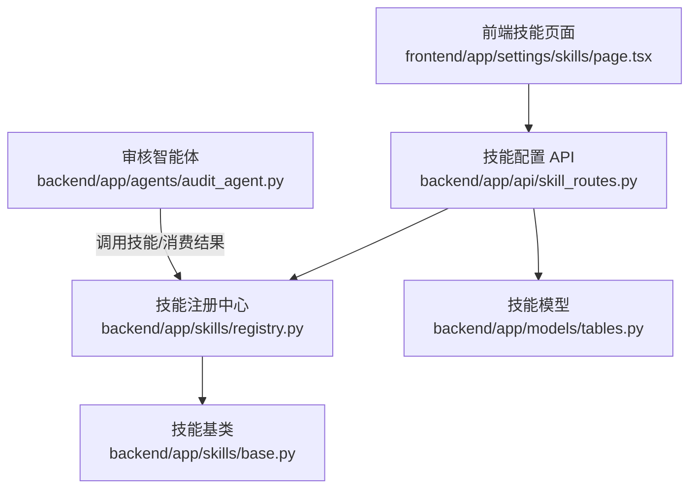
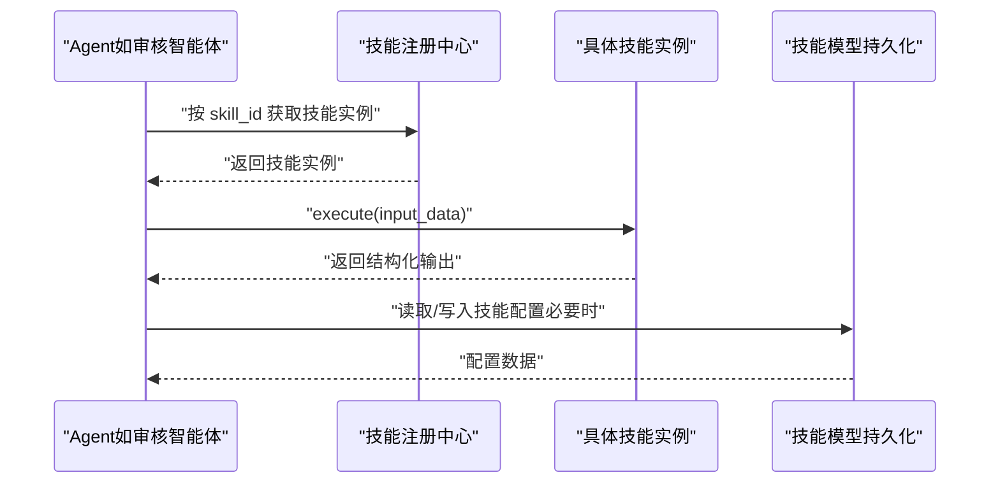
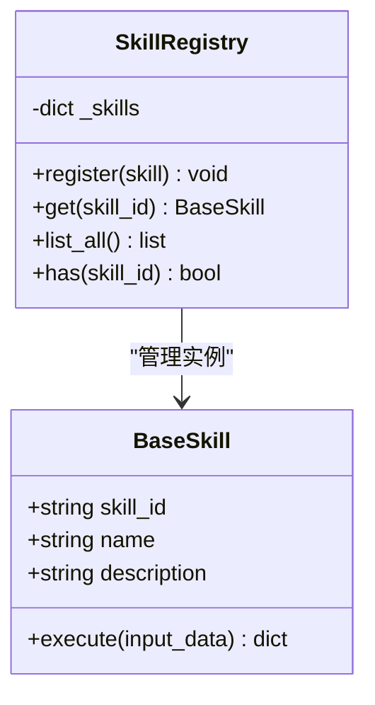
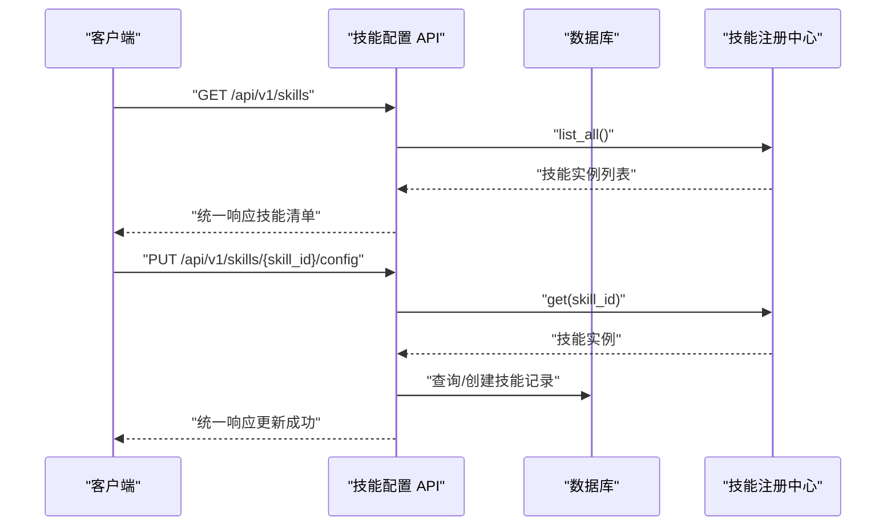
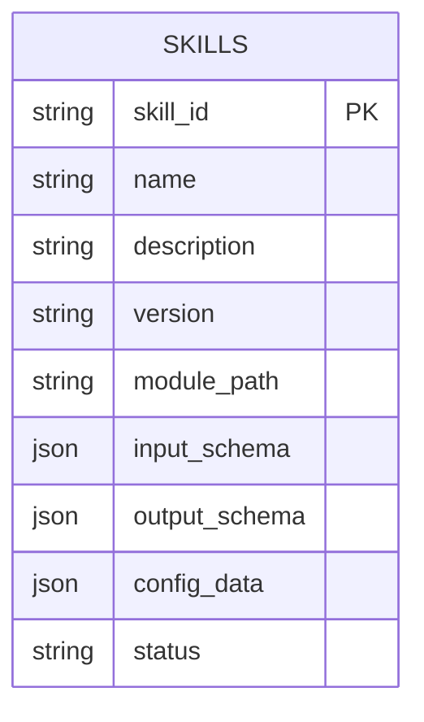
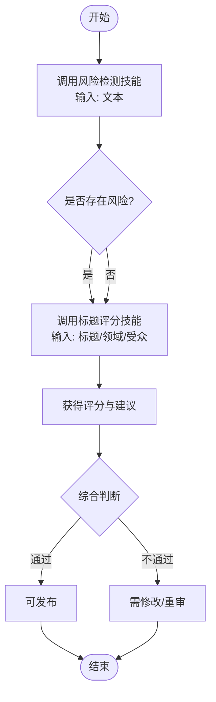
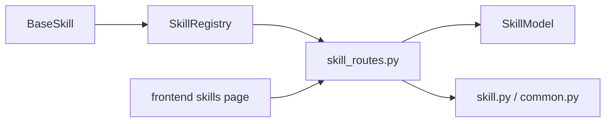

# 内置技能实现

<cite>
**本文引用的文件**
- [backend/app/skills/base.py](file://backend/app/skills/base.py)
- [backend/app/skills/registry.py](file://backend/app/skills/registry.py)
- [backend/app/api/skill_routes.py](file://backend/app/api/skill_routes.py)
- [backend/app/schemas/skill.py](file://backend/app/schemas/skill.py)
- [backend/app/schemas/common.py](file://backend/app/schemas/common.py)
- [backend/app/models/tables.py](file://backend/app/models/tables.py)
- [backend/app/agents/audit_agent.py](file://backend/app/agents/audit_agent.py)
- [frontend/app/settings/skills/page.tsx](file://frontend/app/settings/skills/page.tsx)
- [OpenClaw-bot-review-main/app/api/skills/content/route.ts](file://OpenClaw-bot-review-main/app/api/skills/content/route.ts)
- [ARCHITECTURE.md](file://ARCHITECTURE.md)
</cite>

## 目录
1. [简介](#简介)
2. [项目结构](#项目结构)
3. [核心组件](#核心组件)
4. [架构总览](#架构总览)
5. [详细组件分析](#详细组件分析)
6. [依赖分析](#依赖分析)
7. [性能考虑](#性能考虑)
8. [故障排查指南](#故障排查指南)
9. [结论](#结论)
10. [附录](#附录)

## 简介
本文件面向开发者，系统化梳理 HotClaw 内置技能的实现与使用方式。重点覆盖四大核心内置技能：新闻抓取、摘要、风险检测、标题评分。文档从架构、数据流、输入输出 Schema、配置参数、执行逻辑、协作关系、性能优化、错误处理与调试方法等方面展开，并给出在 Agent 工作流中的集成要点与扩展参考。

## 项目结构
HotClaw 采用前后端分离架构，技能系统位于后端 Python 服务中，前端提供技能管理页面与技能内容查看接口。核心模块包括：
- 后端技能基类与注册中心：定义技能抽象、统一注册与检索入口
- 技能配置 API：提供技能清单查询与配置更新
- 数据模型：持久化技能元数据与配置
- 前端技能页面：展示已注册技能与配置
- 审核智能体：消费技能输出进行合规与质量评估

```mermaid
graph TB
FE["前端技能页面<br/>frontend/app/settings/skills/page.tsx"] --> API["技能配置 API<br/>backend/app/api/skill_routes.py"]
API --> REG["技能注册中心<br/>backend/app/skills/registry.py"]
REG --> BASE["技能基类<br/>backend/app/skills/base.py"]
API --> MODELS["技能模型<br/>backend/app/models/tables.py"]
AUDIT["审核智能体<br/>backend/app/agents/audit_agent.py"] --> |"调用技能/消费结果"| REG
```

图表来源
- [backend/app/api/skill_routes.py:1-61](file://backend/app/api/skill_routes.py#L1-L61)
- [backend/app/skills/registry.py:1-37](file://backend/app/skills/registry.py#L1-L37)
- [backend/app/skills/base.py:1-37](file://backend/app/skills/base.py#L1-L37)
- [backend/app/models/tables.py:183-200](file://backend/app/models/tables.py#L183-L200)
- [backend/app/agents/audit_agent.py:1-38](file://backend/app/agents/audit_agent.py#L1-L38)

章节来源
- [backend/app/api/skill_routes.py:1-61](file://backend/app/api/skill_routes.py#L1-L61)
- [backend/app/skills/registry.py:1-37](file://backend/app/skills/registry.py#L1-L37)
- [backend/app/skills/base.py:1-37](file://backend/app/skills/base.py#L1-L37)
- [backend/app/models/tables.py:183-200](file://backend/app/models/tables.py#L183-L200)
- [frontend/app/settings/skills/page.tsx:1-81](file://frontend/app/settings/skills/page.tsx#L1-L81)

## 核心组件
- 抽象基类 BaseSkill：定义技能标识、名称、描述与异步执行接口
- 技能注册中心 SkillRegistry：集中注册、检索与列举技能实例
- 技能配置 API：提供技能清单与配置更新接口
- 技能模型 SkillModel：持久化技能元数据、输入输出 Schema 与配置
- 审核智能体 AuditAgent：对内容进行合规与质量评估
- 前端技能页面：展示技能信息与配置

章节来源
- [backend/app/skills/base.py:16-37](file://backend/app/skills/base.py#L16-L37)
- [backend/app/skills/registry.py:10-37](file://backend/app/skills/registry.py#L10-L37)
- [backend/app/api/skill_routes.py:17-61](file://backend/app/api/skill_routes.py#L17-L61)
- [backend/app/models/tables.py:183-200](file://backend/app/models/tables.py#L183-L200)
- [backend/app/agents/audit_agent.py:12-38](file://backend/app/agents/audit_agent.py#L12-L38)
- [frontend/app/settings/skills/page.tsx:8-81](file://frontend/app/settings/skills/page.tsx#L8-L81)

## 架构总览
下图展示技能系统在整体系统中的角色与交互：Agent 在工作流中调用技能，技能执行完成后返回结构化结果；审核智能体消费技能输出进行合规评估。

```mermaid
sequenceDiagram
participant Agent as "Agent如审核智能体"
participant Registry as "技能注册中心"
participant Skill as "具体技能实例"
participant Model as "技能模型持久化"
Agent->>Registry : "按 skill_id 获取技能实例"
Registry-->>Agent : "返回技能实例"
Agent->>Skill : "execute(input_data)"
Skill-->>Agent : "返回结构化输出"
Agent->>Model : "读取/写入技能配置必要时"
Model-->>Agent : "配置数据"
```

图表来源
- [backend/app/skills/registry.py:22-26](file://backend/app/skills/registry.py#L22-L26)
- [backend/app/skills/base.py:26-36](file://backend/app/skills/base.py#L26-L36)
- [backend/app/models/tables.py:183-200](file://backend/app/models/tables.py#L183-L200)

## 详细组件分析

### 新闻抓取技能（news_fetcher_skill）
- 角色定位：从多个新闻源抓取热点内容，为上层智能体提供外部信息输入
- 输入 Schema（示意）：关键词数组、领域、最大条目数
- 输出 Schema（示意）：文章列表，包含标题、来源、链接、发布时间、摘要
- 配置参数（示意）：新闻源列表（名称、URL、启用状态）、最大条目数、缓存 TTL、请求超时
- 执行逻辑（示意）：遍历启用的新闻源，发起 HTTP 请求并解析，去重合并，截断至最大条目数
- 性能要点：缓存命中优先、并发抓取、失败降级与重试

章节来源
- [ARCHITECTURE.md:723-731](file://ARCHITECTURE.md#L723-L731)

### 摘要技能（summary_skill）
- 角色定位：对长文本进行压缩，保留关键信息
- 输入 Schema（示意）：待摘要文本、最大长度
- 输出 Schema（示意）：摘要文本
- 配置参数（示意）：使用的 LLM 模型、温度、提示词模板
- 执行逻辑（示意）：构造摘要提示词，调用 LLM 生成摘要，限制输出长度
- 性能要点：上下文截断、分段摘要、缓存重复请求

章节来源
- [ARCHITECTURE.md:732-739](file://ARCHITECTURE.md#L732-L739)

### 风险检测技能（risk_detector_skill）
- 角色定位：对文本进行敏感词与规则检测，输出风险项与总体风险标记
- 输入 Schema（示意）：待检测文本
- 输出 Schema（示意）：风险列表（类型、关键词、位置、严重程度）、是否存在风险
- 配置参数（示意）：敏感词表路径、检测规则集
- 执行逻辑（示意）：关键词匹配 + 规则引擎扫描，聚合风险项并判定总体风险
- 性能要点：预编译正则、批量匹配、短路与缓存

章节来源
- [ARCHITECTURE.md:741-749](file://ARCHITECTURE.md#L741-L749)

### 标题评分技能（title_scorer_skill）
- 角色定位：对标题进行多维度评分（点击率、相关性、情绪、清晰度），并给出改进建议
- 输入 Schema（示意）：标题、领域、目标受众
- 输出 Schema（示意）：综合分数、各维度得分、改进建议列表
- 配置参数（示意）：评分模型、维度权重、提示词模板
- 执行逻辑（示意）：构造多维评分提示词，调用 LLM 生成评分与建议
- 性能要点：提示词缓存、维度拆解与聚合、稳定性输出格式约束

章节来源
- [ARCHITECTURE.md:750-758](file://ARCHITECTURE.md#L750-L758)

### 技能基类与注册中心
- 抽象基类 BaseSkill：定义技能标识、名称、描述与异步 execute 接口
- 注册中心 SkillRegistry：提供注册、获取、列举与存在性检查能力，记录日志并处理未注册错误

```mermaid
classDiagram
class BaseSkill {
+string skill_id
+string name
+string description
+execute(input_data) dict
}
class SkillRegistry {
-dict _skills
+register(skill) void
+get(skill_id) BaseSkill
+list_all() list
+has(skill_id) bool
}
SkillRegistry --> BaseSkill : "管理实例"
```

图表来源
- [backend/app/skills/base.py:16-37](file://backend/app/skills/base.py#L16-L37)
- [backend/app/skills/registry.py:10-37](file://backend/app/skills/registry.py#L10-L37)

章节来源
- [backend/app/skills/base.py:16-37](file://backend/app/skills/base.py#L16-L37)
- [backend/app/skills/registry.py:10-37](file://backend/app/skills/registry.py#L10-L37)

### 技能配置 API
- 列出技能：返回技能 ID、名称、描述、版本、配置与状态
- 更新配置：根据 skill_id 查找技能，读取/创建数据库记录，更新配置字段并持久化

```mermaid
sequenceDiagram
participant Client as "客户端"
participant API as "技能配置 API"
participant DB as "数据库"
participant Registry as "技能注册中心"
Client->>API : "GET /api/v1/skills"
API->>Registry : "list_all()"
Registry-->>API : "技能实例列表"
API-->>Client : "统一响应技能清单"
Client->>API : "PUT /api/v1/skills/{skill_id}/config"
API->>Registry : "get(skill_id)"
Registry-->>API : "技能实例"
API->>DB : "查询/创建技能记录"
API-->>Client : "统一响应更新成功"
```

图表来源
- [backend/app/api/skill_routes.py:17-61](file://backend/app/api/skill_routes.py#L17-L61)
- [backend/app/skills/registry.py:22-26](file://backend/app/skills/registry.py#L22-L26)

章节来源
- [backend/app/api/skill_routes.py:17-61](file://backend/app/api/skill_routes.py#L17-L61)
- [backend/app/schemas/skill.py:6-22](file://backend/app/schemas/skill.py#L6-L22)
- [backend/app/schemas/common.py:7-27](file://backend/app/schemas/common.py#L7-L27)

### 技能模型与持久化
- 技能模型 SkillModel：保存技能 ID、名称、描述、版本、模块路径、输入输出 Schema、配置数据、状态等
- 与 API 协同：API 在更新配置时读写该模型，前端展示配置数据

```mermaid
erDiagram
SKILLS {
string skill_id PK
string name
string description
string version
string module_path
json input_schema
json output_schema
json config_data
string status
}
```

图表来源
- [backend/app/models/tables.py:183-200](file://backend/app/models/tables.py#L183-L200)

章节来源
- [backend/app/models/tables.py:183-200](file://backend/app/models/tables.py#L183-L200)

### 审核智能体与技能协作
- 审核智能体负责对文章标题与正文进行合规与质量评估，其系统提示词明确了输入、输出结构与评估维度
- 协作模式：Agent 在工作流中调用风险检测与标题评分等技能，结合 LLM 输出进行综合判断

```mermaid
flowchart TD
Start(["开始"]) --> Fetch["调用风险检测技能<br/>输入: 文本"]
Fetch --> RiskOut{"是否存在风险?"}
RiskOut --> |是| Review["调用标题评分技能<br/>输入: 标题/领域/受众"]
RiskOut --> |否| Review
Review --> ScoreOut["获得评分与建议"]
ScoreOut --> Decide{"综合判断"}
Decide --> |通过| Publish["可发布"]
Decide --> |不通过| Revise["需修改/重审"]
Publish --> End(["结束"])
Revise --> End
```

图表来源
- [backend/app/agents/audit_agent.py:17-38](file://backend/app/agents/audit_agent.py#L17-L38)
- [ARCHITECTURE.md:741-758](file://ARCHITECTURE.md#L741-L758)

章节来源
- [backend/app/agents/audit_agent.py:12-38](file://backend/app/agents/audit_agent.py#L12-L38)
- [ARCHITECTURE.md:741-758](file://ARCHITECTURE.md#L741-L758)

### 前端技能页面与内容查看
- 技能页面：拉取技能清单并在界面上展示技能信息与配置
- 技能内容查看 API：前端通过 /api/skills/content 查询技能源码或说明内容

章节来源
- [frontend/app/settings/skills/page.tsx:8-81](file://frontend/app/settings/skills/page.tsx#L8-L81)
- [OpenClaw-bot-review-main/app/api/skills/content/route.ts:1-28](file://OpenClaw-bot-review-main/app/api/skills/content/route.ts#L1-L28)

## 依赖分析
- 抽象基类与注册中心：低耦合，仅依赖日志与异常
- API 层：依赖注册中心与数据库模型，提供统一响应包装
- 模型层：SkillModel 作为技能配置与 Schema 的持久化载体
- 前端：依赖 API 提供的技能清单与内容查看接口

```mermaid
graph LR
Base["BaseSkill"] --> Registry["SkillRegistry"]
Registry --> API["skill_routes.py"]
API --> Models["SkillModel"]
API --> Schemas["skill.py / common.py"]
Front["frontend skills page"] --> API
```

图表来源
- [backend/app/skills/base.py:16-37](file://backend/app/skills/base.py#L16-L37)
- [backend/app/skills/registry.py:10-37](file://backend/app/skills/registry.py#L10-L37)
- [backend/app/api/skill_routes.py:17-61](file://backend/app/api/skill_routes.py#L17-L61)
- [backend/app/schemas/skill.py:6-22](file://backend/app/schemas/skill.py#L6-L22)
- [backend/app/schemas/common.py:7-27](file://backend/app/schemas/common.py#L7-L27)
- [backend/app/models/tables.py:183-200](file://backend/app/models/tables.py#L183-L200)
- [frontend/app/settings/skills/page.tsx:8-81](file://frontend/app/settings/skills/page.tsx#L8-L81)

章节来源
- [backend/app/skills/base.py:16-37](file://backend/app/skills/base.py#L16-L37)
- [backend/app/skills/registry.py:10-37](file://backend/app/skills/registry.py#L10-L37)
- [backend/app/api/skill_routes.py:17-61](file://backend/app/api/skill_routes.py#L17-L61)
- [backend/app/schemas/skill.py:6-22](file://backend/app/schemas/skill.py#L6-L22)
- [backend/app/schemas/common.py:7-27](file://backend/app/schemas/common.py#L7-L27)
- [backend/app/models/tables.py:183-200](file://backend/app/models/tables.py#L183-L200)
- [frontend/app/settings/skills/page.tsx:8-81](file://frontend/app/settings/skills/page.tsx#L8-L81)

## 性能考虑
- 缓存策略：对热点抓取结果与重复摘要请求进行缓存，缩短响应时间
- 并发控制：限制并发抓取数量，避免上游源限流或过载
- 上下文优化：对 LLM 调用进行提示词裁剪与分段处理，降低 token 成本
- 失败降级：网络异常或上游不可用时，返回稳定占位结果或回退方案
- 日志与追踪：为关键路径添加结构化日志与 trace_id，便于性能分析与排障

## 故障排查指南
- 技能未注册：检查注册中心是否包含对应 skill_id，确认 manifest 加载与模块路径正确
- 配置更新失败：确认数据库中是否存在对应记录，检查 PUT /api/v1/skills/{skill_id}/config 的请求体
- 执行异常：捕获并记录 execute 异常，确保返回统一错误响应结构
- 前端无法加载：确认 /api/skills 与 /api/skills/content 接口可用，检查跨域与鉴权设置

章节来源
- [backend/app/skills/registry.py:22-26](file://backend/app/skills/registry.py#L22-L26)
- [backend/app/api/skill_routes.py:34-61](file://backend/app/api/skill_routes.py#L34-L61)
- [backend/app/schemas/common.py:14-20](file://backend/app/schemas/common.py#L14-L20)

## 结论
HotClaw 内置技能体系以“无状态工具”为核心理念，通过统一的基类与注册中心实现标准化接入；配合灵活的配置与持久化模型，满足不同业务场景下的内容采集、压缩、合规与质量评估需求。在 Agent 工作流中，技能以原子能力形式被调用，与审核智能体协同完成从信息获取到内容发布的闭环。

## 附录
- 使用指南
  - 在 Agent 中通过注册中心按 skill_id 获取技能实例
  - 构造符合输入 Schema 的结构化输入
  - 调用 execute 并处理结构化输出
  - 必要时通过 API 更新技能配置
- 扩展参考
  - 新增技能：继承 BaseSkill，实现 execute，注册到 SkillRegistry
  - 新增配置：在 SkillModel 中扩展字段，完善输入/输出 Schema
  - 新增路由：遵循统一响应规范，复用 ApiResponse