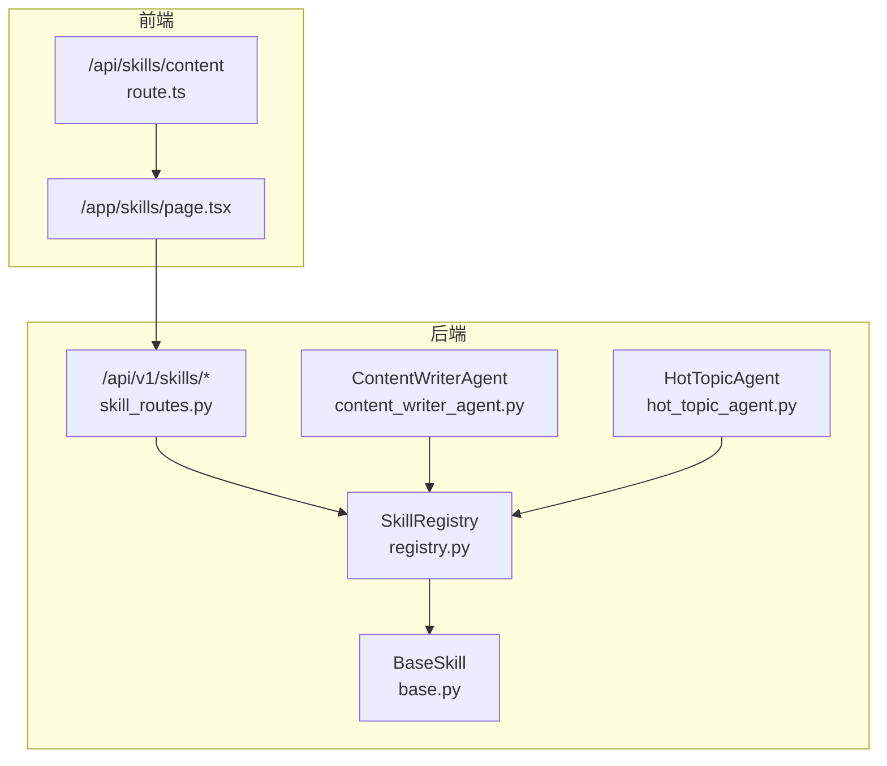
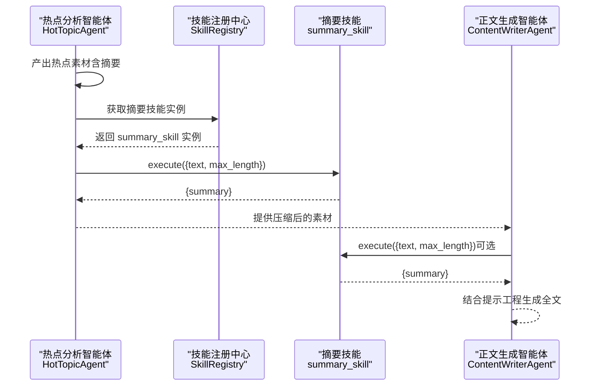
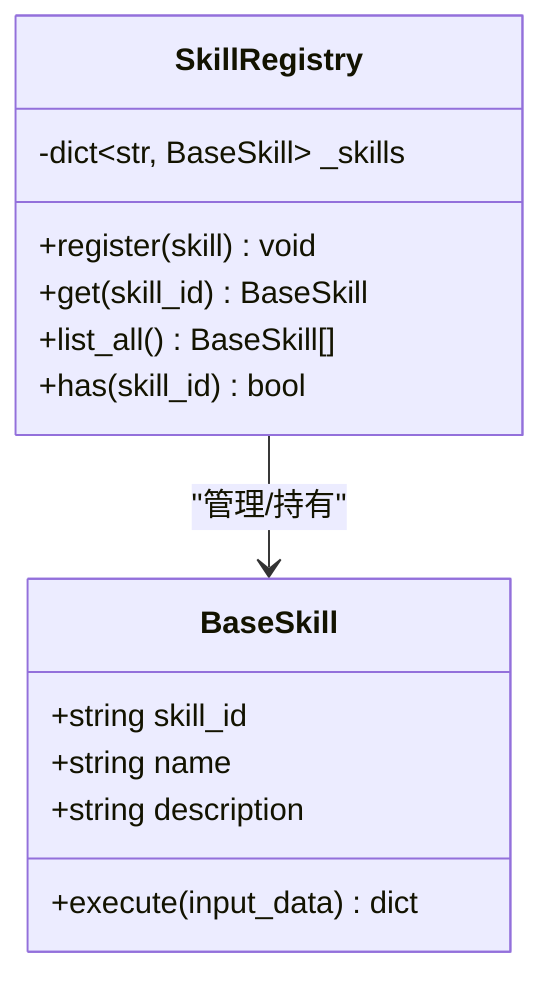
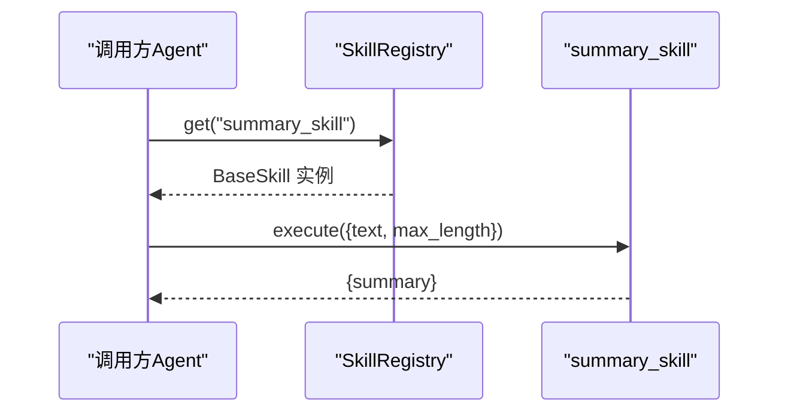
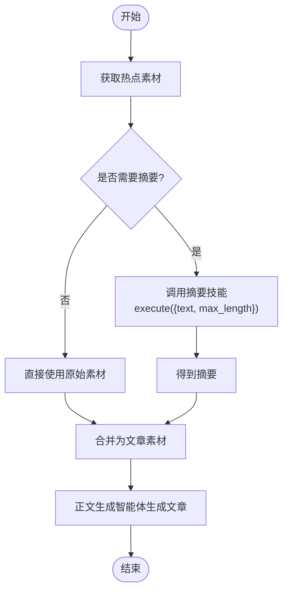
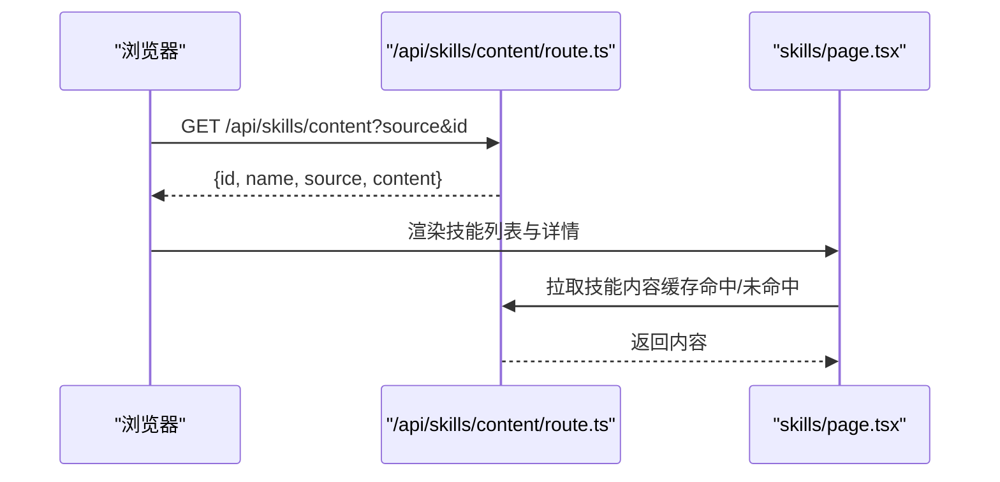

# 摘要技能

<cite>
**本文引用的文件**
- [ARCHITECTURE.md](file://ARCHITECTURE.md)
- [base.py](file://backend/app/skills/base.py)
- [registry.py](file://backend/app/skills/registry.py)
- [skill_routes.py](file://backend/app/api/skill_routes.py)
- [content_writer_agent.py](file://backend/app/agents/content_writer_agent.py)
- [hot_topic_agent.py](file://backend/app/agents/hot_topic_agent.py)
- [route.ts](file://OpenClaw-bot-review-main/app/api/skills/content/route.ts)
- [skills/page.tsx](file://OpenClaw-bot-review-main/app/skills/page.tsx)
</cite>

## 目录
1. [简介](#简介)
2. [项目结构](#项目结构)
3. [核心组件](#核心组件)
4. [架构总览](#架构总览)
5. [详细组件分析](#详细组件分析)
6. [依赖关系分析](#依赖关系分析)
7. [性能考量](#性能考量)
8. [故障排查指南](#故障排查指南)
9. [结论](#结论)
10. [附录](#附录)

## 简介
本文件面向“摘要技能”的技术文档，聚焦其在系统中的定位、输入输出规范、与上游 Agent 的协作方式、以及与前端技能管理界面的交互。根据架构文档，摘要技能（summary_skill）当前以“调用 LLM 做文本摘要”的方式实现，作为内容生成流水线中的素材压缩环节，为正文生成智能体提供精炼后的素材摘要。

摘要技能在系统中的角色与调用链如下：
- 摘要技能对外提供标准化输入输出接口，封装具体的技术操作（LLM 调用）。
- 正文生成智能体在获取选题、标题与热点素材后，调用摘要技能对原始素材进行压缩，再结合自身提示工程生成完整文章。

本文件不涉及具体算法细节（如抽取式/生成式方法的选择与实现），仅依据现有架构与接口定义进行说明，并提供参数调优与使用建议。

章节来源
- [ARCHITECTURE.md: 732–739:732-739](file://ARCHITECTURE.md#L732-L739)
- [content_writer_agent.py: 12–44:12-44](file://backend/app/agents/content_writer_agent.py#L12-L44)

## 项目结构
与摘要技能相关的关键位置：
- 后端技能基类与注册中心：位于 backend/app/skills/
- 技能配置与查询 API：位于 backend/app/api/skill_routes.py
- 正文生成智能体（调用摘要技能）：位于 backend/app/agents/content_writer_agent.py
- 热点分析智能体（产出素材供摘要技能使用）：位于 backend/app/agents/hot_topic_agent.py
- 前端技能内容查看路由与页面：位于 OpenClaw-bot-review-main/app/api/skills/content/ 与 OpenClaw-bot-review-main/app/skills/page.tsx

图表来源
- [registry.py: 10–37:10-37](file://backend/app/skills/registry.py#L10-L37)
- [base.py: 16–37:16-37](file://backend/app/skills/base.py#L16-L37)
- [skill_routes.py: 17–61:17-61](file://backend/app/api/skill_routes.py#L17-L61)
- [content_writer_agent.py: 7–131:7-131](file://backend/app/agents/content_writer_agent.py#L7-L131)
- [hot_topic_agent.py: 7–82:7-82](file://backend/app/agents/hot_topic_agent.py#L7-L82)
- [route.ts: 1–28:1-28](file://OpenClaw-bot-review-main/app/api/skills/content/route.ts#L1-L28)
- [skills/page.tsx: 75–115:75-115](file://OpenClaw-bot-review-main/app/skills/page.tsx#L75-L115)

章节来源
- [registry.py: 10–37:10-37](file://backend/app/skills/registry.py#L10-L37)
- [base.py: 16–37:16-37](file://backend/app/skills/base.py#L16-L37)
- [skill_routes.py: 17–61:17-61](file://backend/app/api/skill_routes.py#L17-L61)
- [content_writer_agent.py: 7–131:7-131](file://backend/app/agents/content_writer_agent.py#L7-L131)
- [hot_topic_agent.py: 7–82:7-82](file://backend/app/agents/hot_topic_agent.py#L7-L82)
- [route.ts: 1–28:1-28](file://OpenClaw-bot-review-main/app/api/skills/content/route.ts#L1-L28)
- [skills/page.tsx: 75–115:75-115](file://OpenClaw-bot-review-main/app/skills/page.tsx#L75-L115)

## 核心组件
- 技能基类与注册中心
  - BaseSkill：定义技能的标准接口（execute）、属性（skill_id、name、description）与日志记录。
  - SkillRegistry：集中注册、查找、列举技能实例，提供错误处理（技能不存在时抛出异常）。
- 摘要技能（summary_skill）
  - 输入：text（待摘要文本）、max_length（目标摘要最大长度）
  - 输出：summary（摘要结果）
  - 配置：使用的 LLM 模型、温度等（由技能配置决定）
- 正文生成智能体（ContentWriterAgent）
  - 在生成文章前调用摘要技能对素材进行压缩，再结合自身提示工程生成完整内容。
- 热点分析智能体（HotTopicAgent）
  - 产出热点素材（含标题、来源、热度、摘要等），为摘要技能提供输入。

章节来源
- [base.py: 16–37:16-37](file://backend/app/skills/base.py#L16-L37)
- [registry.py: 10–37:10-37](file://backend/app/skills/registry.py#L10-L37)
- [ARCHITECTURE.md: 732–739:732-739](file://ARCHITECTURE.md#L732-L739)
- [content_writer_agent.py: 46–122:46-122](file://backend/app/agents/content_writer_agent.py#L46-L122)
- [hot_topic_agent.py: 36–78:36-78](file://backend/app/agents/hot_topic_agent.py#L36-L78)

## 架构总览
摘要技能在系统中的调用关系如下：

图表来源
- [hot_topic_agent.py: 36–78:36-78](file://backend/app/agents/hot_topic_agent.py#L36-L78)
- [registry.py: 22–26:22-26](file://backend/app/skills/registry.py#L22-L26)
- [ARCHITECTURE.md: 732–739:732-739](file://ARCHITECTURE.md#L732-L739)
- [content_writer_agent.py: 46–122:46-122](file://backend/app/agents/content_writer_agent.py#L46-L122)

## 详细组件分析

### 技能基类与注册中心
- BaseSkill
  - 规范化技能接口：execute 接收结构化输入，返回结构化输出。
  - 属性：skill_id、name、description，便于统一管理与展示。
- SkillRegistry
  - 注册：register 将技能实例按 skill_id 存储。
  - 查找：get 若未找到抛出技能未找到异常。
  - 列举：list_all 返回所有已注册技能。
  - 单例：skill_registry 作为全局入口。

图表来源
- [base.py: 16–37:16-37](file://backend/app/skills/base.py#L16-L37)
- [registry.py: 10–37:10-37](file://backend/app/skills/registry.py#L10-L37)

章节来源
- [base.py: 16–37:16-37](file://backend/app/skills/base.py#L16-L37)
- [registry.py: 10–37:10-37](file://backend/app/skills/registry.py#L10-L37)

### 摘要技能接口与调用流程
- 输入输出
  - 输入：text（字符串）、max_length（整数）
  - 输出：summary（字符串）
- 调用协议
  - Agent 通过 SkillRegistry 获取技能实例，构造输入并调用 execute，得到结构化输出。
- 配置
  - 摘要技能的配置（如模型、温度）由技能自身的配置数据决定，可通过技能配置 API 更新。

图表来源
- [registry.py: 22–26:22-26](file://backend/app/skills/registry.py#L22-L26)
- [ARCHITECTURE.md: 732–739:732-739](file://ARCHITECTURE.md#L732-L739)

章节来源
- [ARCHITECTURE.md: 732–739:732-739](file://ARCHITECTURE.md#L732-L739)
- [skill_routes.py: 34–61:34-61](file://backend/app/api/skill_routes.py#L34-L61)

### 正文生成智能体与摘要技能的协作
- 正文生成智能体在生成文章前，会先对热点素材进行压缩，以便在有限字数内承载更多信息。
- 摘要技能的输出作为正文生成的输入之一，配合智能体的系统提示与结构约束，最终生成完整文章。

图表来源
- [content_writer_agent.py: 46–122:46-122](file://backend/app/agents/content_writer_agent.py#L46-L122)
- [hot_topic_agent.py: 36–78:36-78](file://backend/app/agents/hot_topic_agent.py#L36-L78)
- [ARCHITECTURE.md: 732–739:732-739](file://ARCHITECTURE.md#L732-L739)

章节来源
- [content_writer_agent.py: 46–122:46-122](file://backend/app/agents/content_writer_agent.py#L46-L122)
- [hot_topic_agent.py: 36–78:36-78](file://backend/app/agents/hot_topic_agent.py#L36-L78)

### 前端技能内容查看与展示
- 前端提供技能内容查看路由与页面，支持通过 source 与 id 查询技能内容，并在页面中展示。
- 该机制可用于查看摘要技能的实现说明或配置信息（若后端提供）。

图表来源
- [route.ts: 1–28:1-28](file://OpenClaw-bot-review-main/app/api/skills/content/route.ts#L1-L28)
- [skills/page.tsx: 117–156:117-156](file://OpenClaw-bot-review-main/app/skills/page.tsx#L117-L156)

章节来源
- [route.ts: 1–28:1-28](file://OpenClaw-bot-review-main/app/api/skills/content/route.ts#L1-L28)
- [skills/page.tsx: 117–156:117-156](file://OpenClaw-bot-review-main/app/skills/page.tsx#L117-L156)

## 依赖关系分析
- 组件耦合
  - 正文生成智能体依赖技能注册中心获取摘要技能实例。
  - 摘要技能本身无状态，仅依赖其配置（模型、温度等）。
- 外部依赖
  - 摘要技能的实现依赖 LLM 服务（由技能配置决定）。
- 接口契约
  - BaseSkill.execute 的输入输出为结构化字典，保证跨模块稳定传递。

图表来源
- [content_writer_agent.py: 46–122:46-122](file://backend/app/agents/content_writer_agent.py#L46-L122)
- [registry.py: 22–26:22-26](file://backend/app/skills/registry.py#L22-L26)
- [base.py: 26–36:26-36](file://backend/app/skills/base.py#L26-L36)
- [ARCHITECTURE.md: 732–739:732-739](file://ARCHITECTURE.md#L732-L739)

章节来源
- [content_writer_agent.py: 46–122:46-122](file://backend/app/agents/content_writer_agent.py#L46-L122)
- [registry.py: 22–26:22-26](file://backend/app/skills/registry.py#L22-L26)
- [base.py: 26–36:26-36](file://backend/app/skills/base.py#L26-L36)
- [ARCHITECTURE.md: 732–739:732-739](file://ARCHITECTURE.md#L732-L739)

## 性能考量
- 调用开销
  - 摘要技能为无状态工具，调用成本主要取决于 LLM 推理耗时与网络往返。
- 参数影响
  - max_length：直接影响摘要长度与 LLM 上下文占用，进而影响速度与成本。
  - 模型与温度：由技能配置决定，温度越高越可能增加生成不确定性，但有助于多样性。
- 优化建议
  - 合理设置 max_length，避免过长导致上下文溢出与延迟上升。
  - 在保证质量的前提下，优先选择较轻量的模型或较低温度以降低成本。
  - 对重复素材进行去重与合并，减少不必要的摘要调用次数。

## 故障排查指南
- 技能未找到
  - 现象：调用 SkillRegistry.get 抛出技能未找到异常。
  - 排查：确认技能是否已注册、skill_id 是否正确。
- 技能配置更新
  - 通过技能配置 API 更新配置后，确保数据库记录与内存状态一致。
- 前端内容加载失败
  - 现象：技能内容页拉取失败或为空。
  - 排查：检查后端路由返回、URL 参数（source/id）、缓存命中情况。

章节来源
- [registry.py: 22–26:22-26](file://backend/app/skills/registry.py#L22-L26)
- [skill_routes.py: 34–61:34-61](file://backend/app/api/skill_routes.py#L34-L61)
- [route.ts: 10–17:10-17](file://OpenClaw-bot-review-main/app/api/skills/content/route.ts#L10-L17)
- [skills/page.tsx: 134–153:134-153](file://OpenClaw-bot-review-main/app/skills/page.tsx#L134-L153)

## 结论
摘要技能在系统中承担“素材压缩与信息提炼”的职责，通过标准化输入输出与无状态设计，与正文生成智能体形成清晰的协作边界。当前实现以 LLM 为核心，输入为文本与目标长度，输出为摘要。在实际使用中，应重点关注 max_length 与模型配置对性能与成本的影响，并结合前端技能管理界面进行可视化配置与监控。

## 附录

### 输入输出与配置要点
- 输入
  - text：待摘要文本（字符串）
  - max_length：目标摘要最大长度（整数）
- 输出
  - summary：摘要结果（字符串）
- 配置
  - 摘要技能的配置（如模型、温度）由技能配置数据决定，可通过技能配置 API 更新。

章节来源
- [ARCHITECTURE.md: 732–739:732-739](file://ARCHITECTURE.md#L732-L739)
- [skill_routes.py: 34–61:34-61](file://backend/app/api/skill_routes.py#L34-L61)

### 与其他技能的协作模式
- 摘要技能不依赖其他技能，仅作为工具被 Agent 调用。
- 正文生成智能体在生成文章前，会先对热点素材进行压缩，再结合自身提示工程生成完整内容。

章节来源
- [ARCHITECTURE.md: 641–651:641-651](file://ARCHITECTURE.md#L641-L651)
- [content_writer_agent.py: 46–122:46-122](file://backend/app/agents/content_writer_agent.py#L46-L122)
- [hot_topic_agent.py: 36–78:36-78](file://backend/app/agents/hot_topic_agent.py#L36-L78)