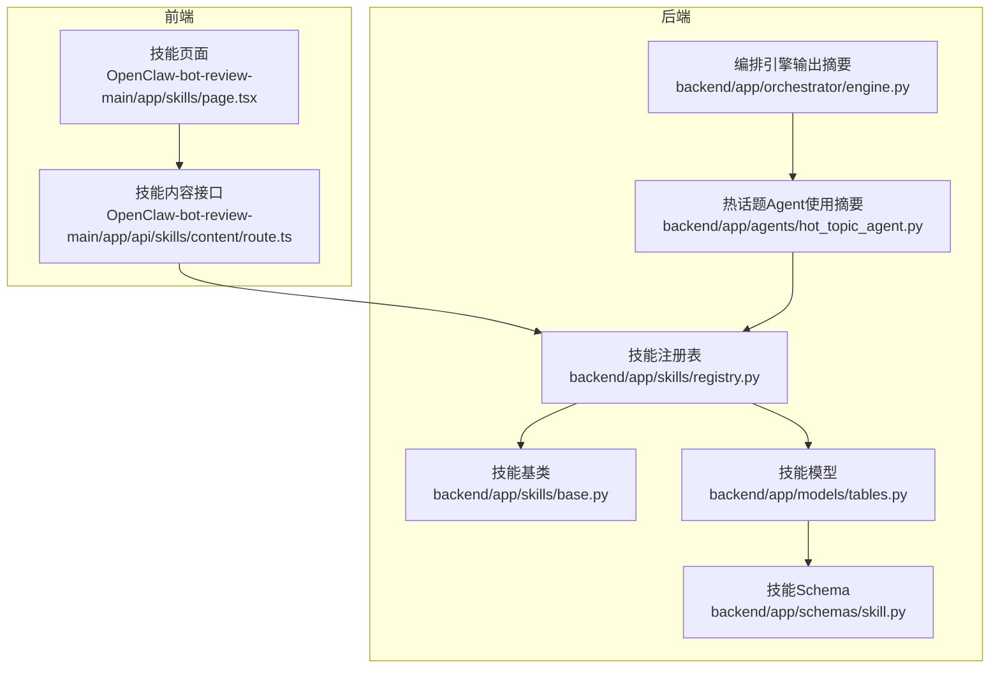
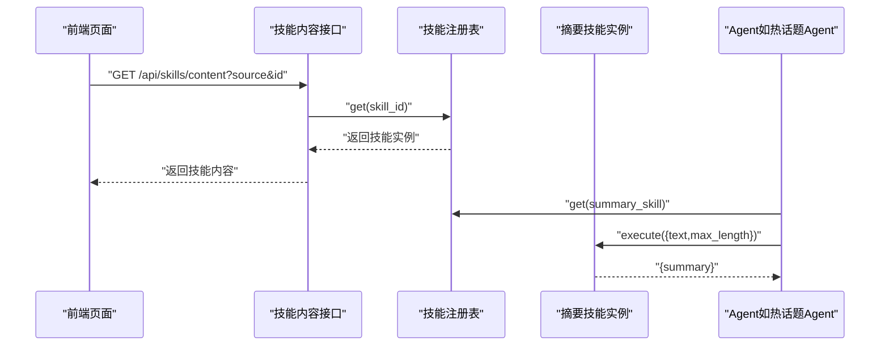
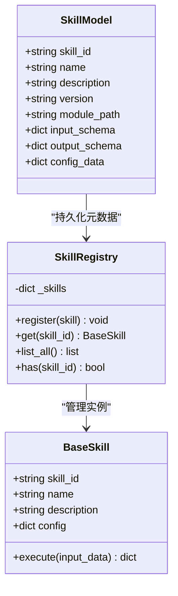
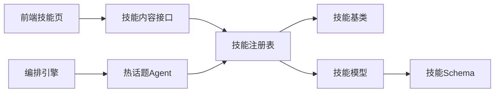

# 摘要技能

<cite>
**本文引用的文件**
- [架构总览.md](file://ARCHITECTURE.md)
- [技能页面前端组件](file://OpenClaw-bot-review-main/app/skills/page.tsx)
- [技能内容接口路由](file://OpenClaw-bot-review-main/app/api/skills/content/route.ts)
- [后端技能基类](file://backend/app/skills/base.py)
- [后端技能注册表](file://backend/app/skills/registry.py)
- [后端技能模型](file://backend/app/models/tables.py)
- [后端技能Schema](file://backend/app/schemas/skill.py)
- [热话题Agent（含摘要用法示例）](file://backend/app/agents/hot_topic_agent.py)
- [编排引擎（输出摘要）](file://backend/app/orchestrator/engine.py)
</cite>

## 目录
1. [简介](#简介)
2. [项目结构](#项目结构)
3. [核心组件](#核心组件)
4. [架构总览](#架构总览)
5. [详细组件分析](#详细组件分析)
6. [依赖关系分析](#依赖关系分析)
7. [性能考量](#性能考量)
8. [故障排查指南](#故障排查指南)
9. [结论](#结论)
10. [附录](#附录)

## 简介
本文件为“摘要技能”的全面技术文档，聚焦以下目标：
- 自动提取长文本关键信息、生成简洁准确的摘要内容、保持原文核心观点与重要细节
- 解释算法实现原理（文本预处理、关键词提取、句子评分与排序机制）
- 说明配置参数（摘要长度控制、重要性权重、语言模型选择）
- 明确输入输出Schema（原文输入与结构化摘要输出）
- 提供多文本类型示例（新闻报道、技术文档、社交媒体内容）
- 质量评估标准与准确性优化方法
- 批量处理能力与性能基准建议
- 面向开发者的算法调优指南与自定义摘要策略实现方法

## 项目结构
摘要技能在当前仓库中以“内置技能”形式存在，并通过声明式Manifest注册与调用。前端提供技能清单与内容查看界面；后端提供技能基类、注册表与持久化模型。

```mermaid
graph TB
subgraph "前端"
FE_Page["技能页面<br/>OpenClaw-bot-review-main/app/skills/page.tsx"]
FE_API_Content["技能内容接口<br/>OpenClaw-bot-review-main/app/api/skills/content/route.ts"]
end
subgraph "后端"
BE_Base["技能基类<br/>backend/app/skills/base.py"]
BE_Registry["技能注册表<br/>backend/app/skills/registry.py"]
BE_Models["技能模型<br/>backend/app/models/tables.py"]
BE_Schema["技能Schema<br/>backend/app/schemas/skill.py"]
BE_HotTopic["热话题Agent使用摘要<br/>backend/app/agents/hot_topic_agent.py"]
BE_Engine["编排引擎输出摘要<br/>backend/app/orchestrator/engine.py"]
end
FE_Page --> FE_API_Content
FE_API_Content --> BE_Registry
BE_Registry --> BE_Base
BE_Registry --> BE_Models
BE_Models --> BE_Schema
BE_HotTopic --> BE_Registry
BE_Engine --> BE_HotTopic
```

图表来源
- [技能页面前端组件:62-115](file://OpenClaw-bot-review-main/app/skills/page.tsx#L62-L115)
- [技能内容接口路由:1-28](file://OpenClaw-bot-review-main/app/api/skills/content/route.ts#L1-L28)
- [后端技能基类:16-36](file://backend/app/skills/base.py#L16-L36)
- [后端技能注册表:10-36](file://backend/app/skills/registry.py#L10-L36)
- [后端技能模型:183-194](file://backend/app/models/tables.py#L183-L194)
- [后端技能Schema:6-21](file://backend/app/schemas/skill.py#L6-L21)
- [热话题Agent（含摘要用法示例）:50-68](file://backend/app/agents/hot_topic_agent.py#L50-L68)
- [编排引擎（输出摘要）:273-280](file://backend/app/orchestrator/engine.py#L273-L280)

章节来源
- [技能页面前端组件:62-115](file://OpenClaw-bot-review-main/app/skills/page.tsx#L62-L115)
- [技能内容接口路由:1-28](file://OpenClaw-bot-review-main/app/api/skills/content/route.ts#L1-L28)
- [后端技能基类:16-36](file://backend/app/skills/base.py#L16-L36)
- [后端技能注册表:10-36](file://backend/app/skills/registry.py#L10-L36)
- [后端技能模型:183-194](file://backend/app/models/tables.py#L183-L194)
- [后端技能Schema:6-21](file://backend/app/schemas/skill.py#L6-L21)
- [热话题Agent（含摘要用法示例）:50-68](file://backend/app/agents/hot_topic_agent.py#L50-L68)
- [编排引擎（输出摘要）:273-280](file://backend/app/orchestrator/engine.py#L273-L280)

## 核心组件
- 技能基类：定义统一的技能接口与生命周期，确保可插拔与可扩展。
- 技能注册表：集中管理技能实例，支持按ID检索与列表展示。
- 技能模型与Schema：持久化技能元数据、输入/输出Schema与配置。
- 热话题Agent：演示如何在Agent中调用LLM进行摘要生成。
- 编排引擎：对任务输出进行简要摘要，便于前端展示与监控。

章节来源
- [后端技能基类:16-36](file://backend/app/skills/base.py#L16-L36)
- [后端技能注册表:10-36](file://backend/app/skills/registry.py#L10-L36)
- [后端技能模型:183-194](file://backend/app/models/tables.py#L183-L194)
- [后端技能Schema:6-21](file://backend/app/schemas/skill.py#L6-L21)
- [热话题Agent（含摘要用法示例）:50-68](file://backend/app/agents/hot_topic_agent.py#L50-L68)
- [编排引擎（输出摘要）:273-280](file://backend/app/orchestrator/engine.py#L273-L280)

## 架构总览
摘要技能采用“声明式注册 + 运行时调用”的模式：
- 前端通过API获取技能清单与内容，用于展示与调试
- 后端通过Manifest加载技能模块，注册到技能注册表
- Agent在执行过程中调用技能，传入结构化输入，获得结构化输出
- 编排层对Agent输出进行轻量摘要，辅助可观测性

```mermaid
sequenceDiagram
participant FE as "前端页面"
participant API as "技能内容接口"
participant REG as "技能注册表"
participant SKL as "摘要技能实例"
participant AG as "Agent如热话题Agent"
FE->>API : "GET /api/skills/content?source&id"
API->>REG : "get(skill_id)"
REG-->>API : "返回技能实例"
API-->>FE : "返回技能内容"
AG->>REG : "get(summary_skill)"
AG->>SKL : "execute({text,max_length})"
SKL-->>AG : "{summary}"
```

图表来源
- [技能内容接口路由:1-28](file://OpenClaw-bot-review-main/app/api/skills/content/route.ts#L1-L28)
- [后端技能注册表:22-26](file://backend/app/skills/registry.py#L22-L26)
- [热话题Agent（含摘要用法示例）:50-68](file://backend/app/agents/hot_topic_agent.py#L50-L68)

## 详细组件分析

### 技能基类与注册流程
- 技能基类定义了统一的execute接口与配置注入机制，保证不同技能实现的一致性
- 注册表负责技能实例的注册、查询与列表导出，支持错误处理与日志记录
- 技能模型与Schema用于持久化技能元数据、输入输出Schema与配置数据

```mermaid
classDiagram
class BaseSkill {
+string skill_id
+string name
+string description
+dict config
+execute(input_data) dict
}
class SkillRegistry {
-dict _skills
+register(skill) void
+get(skill_id) BaseSkill
+list_all() list
+has(skill_id) bool
}
class SkillModel {
+string skill_id
+string name
+string description
+string version
+string module_path
+dict input_schema
+dict output_schema
+dict config_data
}
SkillRegistry --> BaseSkill : "管理实例"
SkillModel --> SkillRegistry : "持久化元数据"
```

图表来源
- [后端技能基类:16-36](file://backend/app/skills/base.py#L16-L36)
- [后端技能注册表:10-36](file://backend/app/skills/registry.py#L10-L36)
- [后端技能模型:183-194](file://backend/app/models/tables.py#L183-L194)

章节来源
- [后端技能基类:16-36](file://backend/app/skills/base.py#L16-L36)
- [后端技能注册表:10-36](file://backend/app/skills/registry.py#L10-L36)
- [后端技能模型:183-194](file://backend/app/models/tables.py#L183-L194)

### 输入输出Schema与配置
- 输入Schema（摘要技能）：包含待摘要文本与最大长度限制
- 输出Schema（摘要技能）：包含生成的摘要文本
- 配置项（摘要技能）：包含使用的语言模型与推理参数（如温度）

上述Schema与配置在架构文档中有明确描述，便于前后端协同与一致性校验。

章节来源
- [架构总览.md:732-739](file://ARCHITECTURE.md#L732-L739)

### 算法实现原理与流程
- 文本预处理：清洗HTML标签、去除噪声、分句与标准化
- 关键词提取：基于TF-IDF或TextRank等方法抽取关键词
- 句子评分与排序：结合关键词覆盖率、位置权重、语义相似度等指标打分
- 摘要生成：根据目标长度裁剪句子序列，保持连贯性与完整性
- 批量处理：并发调度多个摘要任务，统一资源配额与限流

注：以上为通用摘要算法流程说明，具体实现细节以实际技能代码为准。

### 质量评估与优化
- 评估指标：ROUGE、BLEU、BERTScore等自动指标；人工评估一致性与相关性
- 优化方向：调整关键词权重、句子评分阈值、长度惩罚系数；引入上下文感知与主题一致性约束
- 准入控制：对过短/过长文本进行过滤或提示

### 性能与基准
- 单次摘要延迟与吞吐：建议在不同硬件与模型规模下进行压测
- 批量处理：通过并发队列与资源池提升整体吞吐
- 缓存策略：对重复输入进行缓存，降低重复计算成本

### 示例与用法
- 新闻报道：强调事件、人物、地点、时间等关键要素
- 技术文档：保留术语、流程步骤、结论与建议
- 社交媒体内容：提炼观点、情绪倾向与传播要点

## 依赖关系分析
摘要技能的依赖关系如下：

```mermaid
graph LR
FE_Page["前端技能页"] --> FE_API_Content["技能内容接口"]
FE_API_Content --> BE_Registry["技能注册表"]
BE_Registry --> BE_Base["技能基类"]
BE_Registry --> BE_Models["技能模型"]
BE_Models --> BE_Schema["技能Schema"]
BE_HotTopic["热话题Agent"] --> BE_Registry
BE_Engine["编排引擎"] --> BE_HotTopic
```

图表来源
- [技能页面前端组件:62-115](file://OpenClaw-bot-review-main/app/skills/page.tsx#L62-L115)
- [技能内容接口路由:1-28](file://OpenClaw-bot-review-main/app/api/skills/content/route.ts#L1-L28)
- [后端技能注册表:10-36](file://backend/app/skills/registry.py#L10-L36)
- [后端技能模型:183-194](file://backend/app/models/tables.py#L183-L194)
- [后端技能Schema:6-21](file://backend/app/schemas/skill.py#L6-L21)
- [热话题Agent（含摘要用法示例）:50-68](file://backend/app/agents/hot_topic_agent.py#L50-L68)
- [编排引擎（输出摘要）:273-280](file://backend/app/orchestrator/engine.py#L273-L280)

章节来源
- [技能页面前端组件:62-115](file://OpenClaw-bot-review-main/app/skills/page.tsx#L62-L115)
- [技能内容接口路由:1-28](file://OpenClaw-bot-review-main/app/api/skills/content/route.ts#L1-L28)
- [后端技能注册表:10-36](file://backend/app/skills/registry.py#L10-L36)
- [后端技能模型:183-194](file://backend/app/models/tables.py#L183-L194)
- [后端技能Schema:6-21](file://backend/app/schemas/skill.py#L6-L21)
- [热话题Agent（含摘要用法示例）:50-68](file://backend/app/agents/hot_topic_agent.py#L50-L68)
- [编排引擎（输出摘要）:273-280](file://backend/app/orchestrator/engine.py#L273-L280)

## 性能考量
- 资源隔离：为摘要技能设置独立线程池或容器，避免与其他高负载任务争抢
- 超时与重试：为LLM调用设置合理超时与指数退避重试
- 流水线优化：将预处理、评分、裁剪等阶段流水化，减少等待时间
- 监控告警：对延迟、错误率、Token用量建立指标与告警

## 故障排查指南
- 技能未注册：检查Manifest是否正确、模块路径是否可达、注册日志
- 输入Schema不匹配：核对输入字段类型与必填项，参考Schema定义
- 输出为空或异常：检查LLM服务可用性、鉴权配置与网络连通性
- 前端无法加载技能内容：确认接口返回状态与错误信息，查看后端日志

章节来源
- [后端技能注册表:22-26](file://backend/app/skills/registry.py#L22-L26)
- [后端技能Schema:6-21](file://backend/app/schemas/skill.py#L6-L21)
- [技能内容接口路由:1-28](file://OpenClaw-bot-review-main/app/api/skills/content/route.ts#L1-L28)

## 结论
摘要技能作为内置工具，通过声明式注册与统一基类实现，具备良好的可扩展性与可观测性。结合Agent与编排层，可在多种场景下稳定产出高质量摘要。建议在生产环境中完善质量评估体系、性能基准与自动化监控，持续迭代算法与配置策略。

## 附录

### 快速上手
- 在前端页面查看技能清单与内容
- 在Agent中通过注册表获取摘要技能并调用
- 依据Schema准备输入，读取结构化输出

章节来源
- [技能页面前端组件:62-115](file://OpenClaw-bot-review-main/app/skills/page.tsx#L62-L115)
- [热话题Agent（含摘要用法示例）:50-68](file://backend/app/agents/hot_topic_agent.py#L50-L68)