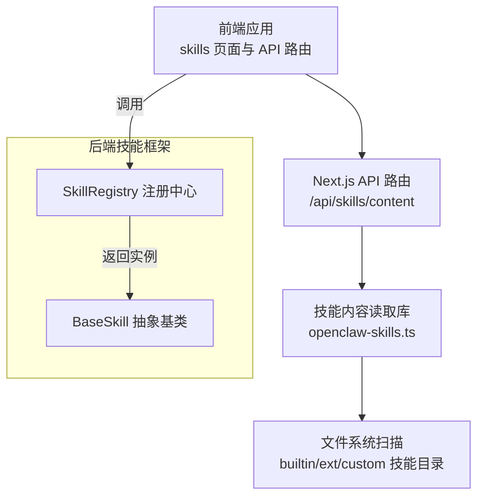
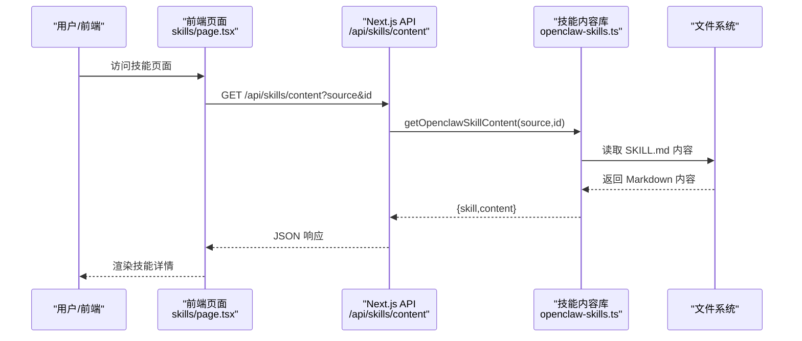
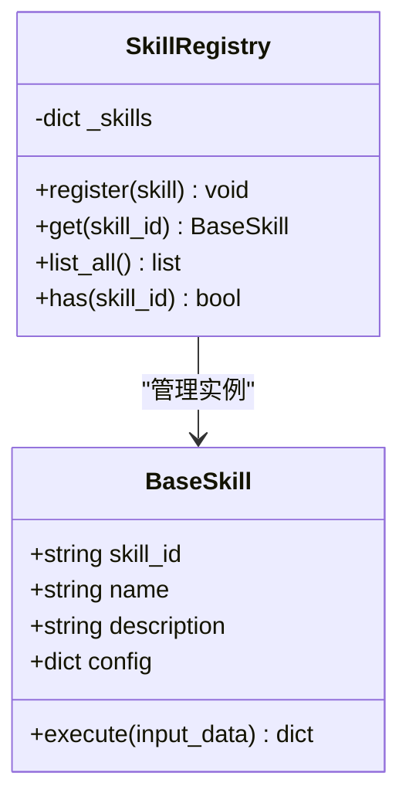
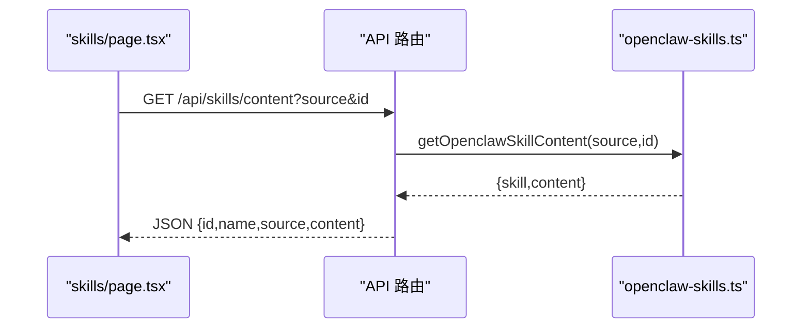
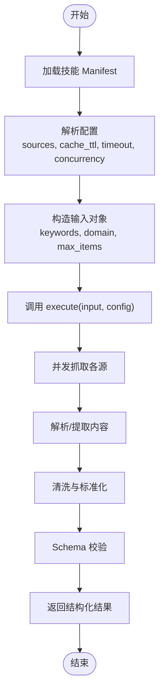
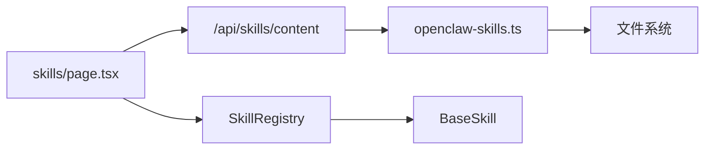

# 新闻抓取技能

<cite>
**本文引用的文件**
- [ARCHITECTURE.md](file://ARCHITECTURE.md)
- [base.py](file://backend/app/skills/base.py)
- [registry.py](file://backend/app/skills/registry.py)
- [route.ts](file://OpenClaw-bot-review-main/app/api/skills/content/route.ts)
- [openclaw-skills.ts](file://OpenClaw-bot-review-main/lib/openclaw-skills.ts)
- [page.tsx](file://OpenClaw-bot-review-main/app/skills/page.tsx)
- [audit_agent.py](file://backend/app/agents/audit_agent.py)
- [profile_agent.py](file://backend/app/agents/profile_agent.py)
</cite>

## 目录
1. [简介](#简介)
2. [项目结构](#项目结构)
3. [核心组件](#核心组件)
4. [架构总览](#架构总览)
5. [详细组件分析](#详细组件分析)
6. [依赖分析](#依赖分析)
7. [性能考虑](#性能考虑)
8. [故障排查指南](#故障排查指南)
9. [结论](#结论)
10. [附录](#附录)

## 简介
本文件面向“新闻抓取技能”的技术实现与使用，围绕以下目标展开：
- 深入介绍新闻抓取技能的核心功能与实现原理：网页内容解析、新闻源识别、内容提取算法、数据清洗流程
- 明确输入参数配置：URL 列表、抓取规则、时间范围过滤等
- 解释输出数据结构：标题、正文、发布时间、来源网站等字段
- 提供实际使用示例与配置模板：如何自定义抓取规则与处理特殊网站
- 说明错误处理机制、重试策略与性能优化建议
- 说明与其他技能的集成方式与数据流转过程

## 项目结构
新闻抓取技能属于“技能”体系的一部分，遵循统一的声明式注册、Schema 校验与调用协议。前端提供技能清单与内容查看接口；后端提供技能基类与注册中心；架构文档定义了输入输出规范与配置结构。

图表来源
- [route.ts:1-28](file://OpenClaw-bot-review-main/app/api/skills/content/route.ts#L1-L28)
- [openclaw-skills.ts:111-161](file://OpenClaw-bot-review-main/lib/openclaw-skills.ts#L111-L161)
- [base.py:16-37](file://backend/app/skills/base.py#L16-L37)
- [registry.py:10-37](file://backend/app/skills/registry.py#L10-L37)

章节来源
- [ARCHITECTURE.md:641-739](file://ARCHITECTURE.md#L641-L739)
- [route.ts:1-28](file://OpenClaw-bot-review-main/app/api/skills/content/route.ts#L1-L28)
- [openclaw-skills.ts:1-162](file://OpenClaw-bot-review-main/lib/openclaw-skills.ts#L1-L162)
- [base.py:1-37](file://backend/app/skills/base.py#L1-L37)
- [registry.py:1-37](file://backend/app/skills/registry.py#L1-L37)

## 核心组件
- 抽象基类与注册中心：定义技能的统一接口与生命周期管理，确保技能可被 Agent 调用且具备稳定的输入输出。
- 前端技能页面与 API：提供技能清单查询与技能内容读取能力，支持按 source/id 查询具体技能 Markdown 内容。
- 架构规范：定义输入/输出 Schema、配置结构与调用协议，保证跨模块一致性。

章节来源
- [base.py:16-37](file://backend/app/skills/base.py#L16-L37)
- [registry.py:10-37](file://backend/app/skills/registry.py#L10-L37)
- [route.ts:1-28](file://OpenClaw-bot-review-main/app/api/skills/content/route.ts#L1-L28)
- [openclaw-skills.ts:111-161](file://OpenClaw-bot-review-main/lib/openclaw-skills.ts#L111-L161)
- [ARCHITECTURE.md:641-739](file://ARCHITECTURE.md#L641-L739)

## 架构总览
新闻抓取技能在系统中的位置与交互如下：

图表来源
- [page.tsx:75-129](file://OpenClaw-bot-review-main/app/skills/page.tsx#L75-L129)
- [route.ts:1-28](file://OpenClaw-bot-review-main/app/api/skills/content/route.ts#L1-L28)
- [openclaw-skills.ts:153-161](file://OpenClaw-bot-review-main/lib/openclaw-skills.ts#L153-L161)

## 详细组件分析

### 技能基类与注册中心
- 抽象基类 BaseSkill：定义技能标识、名称、描述与统一的异步 execute 接口，确保所有技能实现遵循一致的契约。
- 注册中心 SkillRegistry：集中管理技能实例，提供注册、查询、列举与存在性判断能力，避免重复注册与未知技能访问。

图表来源
- [base.py:16-37](file://backend/app/skills/base.py#L16-L37)
- [registry.py:10-37](file://backend/app/skills/registry.py#L10-L37)

章节来源
- [base.py:16-37](file://backend/app/skills/base.py#L16-L37)
- [registry.py:10-37](file://backend/app/skills/registry.py#L10-L37)

### 前端技能页面与内容读取
- 技能页面：拉取技能清单与 Agent 关联信息，支持按 source/id 加载技能 Markdown 内容。
- 内容路由：提供 /api/skills/content 接口，接收 source 与 id 参数，返回对应技能的元信息与内容。

图表来源
- [page.tsx:75-129](file://OpenClaw-bot-review-main/app/skills/page.tsx#L75-L129)
- [route.ts:1-28](file://OpenClaw-bot-review-main/app/api/skills/content/route.ts#L1-L28)
- [openclaw-skills.ts:153-161](file://OpenClaw-bot-review-main/lib/openclaw-skills.ts#L153-L161)

章节来源
- [page.tsx:75-129](file://OpenClaw-bot-review-main/app/skills/page.tsx#L75-L129)
- [route.ts:1-28](file://OpenClaw-bot-review-main/app/api/skills/content/route.ts#L1-L28)
- [openclaw-skills.ts:1-162](file://OpenClaw-bot-review-main/lib/openclaw-skills.ts#L1-L162)

### 新闻抓取技能的输入/输出与配置
- 输入参数（示例）：关键词数组、领域、最大条目数等
- 输出结构（示例）：文章数组，包含标题、来源、链接、发布时间、摘要等
- 配置结构（示例）：新闻源列表、缓存 TTL、请求超时、并发限制等

图表来源
- [ARCHITECTURE.md:932-991](file://ARCHITECTURE.md#L932-L991)

章节来源
- [ARCHITECTURE.md:641-739](file://ARCHITECTURE.md#L641-L739)
- [ARCHITECTURE.md:932-991](file://ARCHITECTURE.md#L932-L991)

### 抓取流程与数据清洗（概念性说明）
- 新闻源识别：依据配置中的 sources 列表，区分不同站点或 API 类型
- 内容提取：针对热搜类 API 可直接解析 JSON；对于网页类内容，可采用选择器或 DOM 解析策略
- 数据清洗：统一字段编码、去除冗余空白、标准化日期格式、过滤无效条目
- 时间范围过滤：在输出阶段按发布时间筛选满足条件的条目

（本节为概念性说明，不直接分析具体文件）

### 错误处理与重试策略（概念性说明）
- 请求失败：对单个源失败进行隔离，记录错误并继续处理其他源
- 超时控制：为每个请求设置超时阈值，避免阻塞整体流程
- 重试机制：对瞬时网络错误进行指数退避重试
- 回退策略：当部分源不可用时，仍返回可用数据并标记降级

（本节为概念性说明，不直接分析具体文件）

### 性能优化建议（概念性说明）
- 并发控制：限制最大并发请求数，避免对上游造成压力
- 结果缓存：利用缓存 TTL 减少重复抓取
- 连接池与复用：复用 HTTP 连接，降低握手开销
- 增量更新：优先抓取最近新增条目，减少全量扫描

（本节为概念性说明，不直接分析具体文件）

## 依赖分析
- 前端依赖后端技能内容库与 API 路由，用于读取与渲染技能 Markdown
- 后端技能框架依赖注册中心以提供统一的技能实例管理
- 架构文档定义了输入/输出 Schema 与配置结构，作为前后端共同契约

图表来源
- [page.tsx:75-129](file://OpenClaw-bot-review-main/app/skills/page.tsx#L75-L129)
- [route.ts:1-28](file://OpenClaw-bot-review-main/app/api/skills/content/route.ts#L1-L28)
- [openclaw-skills.ts:111-161](file://OpenClaw-bot-review-main/lib/openclaw-skills.ts#L111-L161)
- [registry.py:10-37](file://backend/app/skills/registry.py#L10-L37)
- [base.py:16-37](file://backend/app/skills/base.py#L16-L37)

章节来源
- [page.tsx:75-129](file://OpenClaw-bot-review-main/app/skills/page.tsx#L75-L129)
- [route.ts:1-28](file://OpenClaw-bot-review-main/app/api/skills/content/route.ts#L1-L28)
- [openclaw-skills.ts:1-162](file://OpenClaw-bot-review-main/lib/openclaw-skills.ts#L1-L162)
- [registry.py:1-37](file://backend/app/skills/registry.py#L1-L37)
- [base.py:1-37](file://backend/app/skills/base.py#L1-L37)

## 性能考虑
- 并发与限流：通过配置的最大并发请求数控制资源占用
- 缓存策略：利用缓存 TTL 减少重复抓取，提高响应速度
- 超时与重试：为请求设置合理超时与指数退避重试，提升鲁棒性
- 数据清洗前置：在抓取后立即进行清洗与标准化，降低下游处理成本

（本节为通用指导，不直接分析具体文件）

## 故障排查指南
- 技能未找到：确认 source 与 id 是否正确，检查技能目录扫描逻辑
- 请求超时/失败：检查网络连通性、上游服务状态与超时配置
- 输出不符合预期：核对输入 Schema 与配置项，确认数据清洗步骤是否正确
- 审核降级：当审核服务异常时，系统会返回降级结果，建议人工复核

章节来源
- [route.ts:1-28](file://OpenClaw-bot-review-main/app/api/skills/content/route.ts#L1-L28)
- [openclaw-skills.ts:153-161](file://OpenClaw-bot-review-main/lib/openclaw-skills.ts#L153-L161)
- [audit_agent.py:59-66](file://backend/app/agents/audit_agent.py#L59-L66)

## 结论
新闻抓取技能通过统一的技能基类与注册中心实现稳定可复用的能力封装；前端通过 API 路由与内容库提供技能清单与 Markdown 内容读取；架构文档明确了输入输出 Schema 与配置结构，确保跨模块一致性。结合合理的并发控制、缓存与重试策略，可在保证性能的同时提升可靠性。

## 附录

### 使用示例与配置模板（概念性说明）
- 示例场景：基于关键词与领域抓取热点新闻，限制最大条目数并启用缓存
- 配置模板要点：
  - sources：包含多个新闻源，每项含 id/name/type/enabled
  - cache_ttl_seconds：缓存过期时间
  - request_timeout_seconds：单次请求超时
  - max_concurrent_requests：最大并发请求数

章节来源
- [ARCHITECTURE.md:932-991](file://ARCHITECTURE.md#L932-L991)

### 与其他技能的集成与数据流转
- 典型链路：账号定位解析 → 新闻抓取 → 摘要/审核 → 内容生成
- 数据传递：上一步输出作为下一步输入，遵循统一 Schema 校验

章节来源
- [profile_agent.py:42-72](file://backend/app/agents/profile_agent.py#L42-L72)
- [audit_agent.py:48-66](file://backend/app/agents/audit_agent.py#L48-L66)
- [ARCHITECTURE.md:641-739](file://ARCHITECTURE.md#L641-L739)