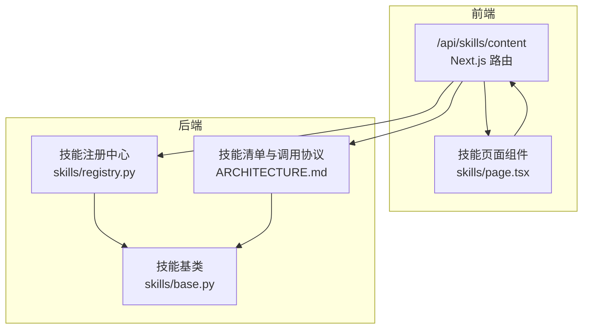
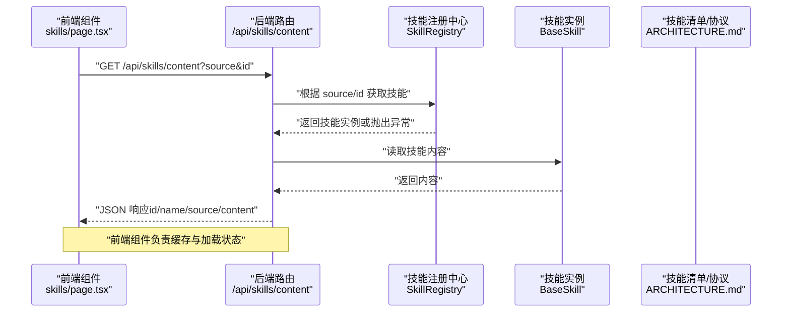
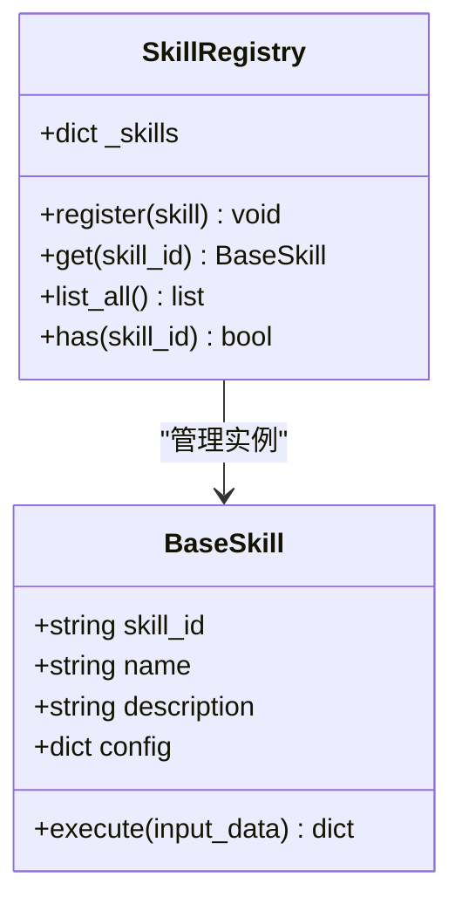
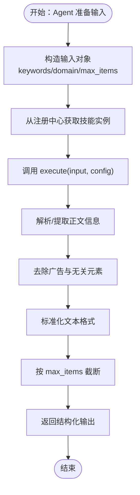
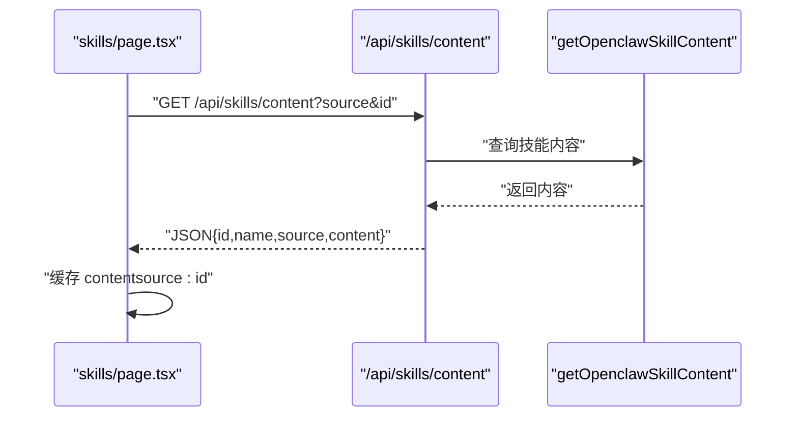
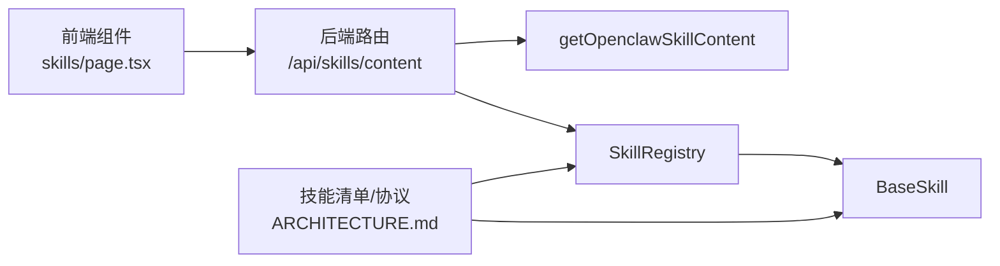

# 新闻抓取技能

<cite>
**本文引用的文件**
- [ARCHITECTURE.md](file://ARCHITECTURE.md)
- [backend/app/skills/base.py](file://backend/app/skills/base.py)
- [backend/app/skills/registry.py](file://backend/app/skills/registry.py)
- [OpenClaw-bot-review-main/app/api/skills/content/route.ts](file://OpenClaw-bot-review-main/app/api/skills/content/route.ts)
- [OpenClaw-bot-review-main/app/skills/page.tsx](file://OpenClaw-bot-review-main/app/skills/page.tsx)
</cite>

## 目录
1. [简介](#简介)
2. [项目结构](#项目结构)
3. [核心组件](#核心组件)
4. [架构总览](#架构总览)
5. [详细组件分析](#详细组件分析)
6. [依赖关系分析](#依赖关系分析)
7. [性能考虑](#性能考虑)
8. [故障排查指南](#故障排查指南)
9. [结论](#结论)
10. [附录](#附录)

## 简介
本文件为“新闻抓取技能”的技术文档，聚焦于从指定URL抓取网页内容、提取正文信息、去除广告与无关元素、标准化文本格式等核心能力。文档覆盖配置参数（目标网站规则、请求头设置、反爬虫策略、超时配置）、输入输出Schema设计、实际抓取示例与常见网站适配方案、错误处理机制（网络异常、内容解析失败、验证码处理）、性能优化策略（并发控制、缓存机制、资源限制），以及面向开发者的扩展指南与自定义网站适配方法。

## 项目结构
围绕“新闻抓取技能”，本仓库中与之直接相关的关键位置如下：
- 后端技能基类与注册中心：位于 backend/app/skills/
- 技能清单与调用协议：位于 ARCHITECTURE.md 中的“Skill 基类”“Skill 注册方式”“Skill 调用协议”“第一版内置 Skills”等章节
- 前端技能内容展示与路由：位于 OpenClaw-bot-review-main/app/api/skills/content/route.ts 与 OpenClaw-bot-review-main/app/skills/page.tsx

```mermaid
graph TB
subgraph "前端"
FE_API["/api/skills/content<br/>Next.js 路由"]
FE_PAGE["技能页面组件<br/>skills/page.tsx"]
end
subgraph "后端"
SKILL_BASE["技能基类<br/>skills/base.py"]
SKILL_REG["技能注册中心<br/>skills/registry.py"]
MANIFEST["技能清单与调用协议<br/>ARCHITECTURE.md"]
end
FE_API --> FE_PAGE
FE_PAGE --> FE_API
FE_API --> MANIFEST
FE_API --> SKILL_REG
SKILL_REG --> SKILL_BASE
MANIFEST --> SKILL_BASE
```

图表来源
- [backend/app/skills/base.py:1-37](file://backend/app/skills/base.py#L1-L37)
- [backend/app/skills/registry.py:1-37](file://backend/app/skills/registry.py#L1-L37)
- [OpenClaw-bot-review-main/app/api/skills/content/route.ts:1-28](file://OpenClaw-bot-review-main/app/api/skills/content/route.ts#L1-L28)
- [OpenClaw-bot-review-main/app/skills/page.tsx:75-171](file://OpenClaw-bot-review-main/app/skills/page.tsx#L75-L171)
- [ARCHITECTURE.md:652-739](file://ARCHITECTURE.md#L652-L739)

章节来源
- [ARCHITECTURE.md:652-739](file://ARCHITECTURE.md#L652-L739)
- [backend/app/skills/base.py:1-37](file://backend/app/skills/base.py#L1-L37)
- [backend/app/skills/registry.py:1-37](file://backend/app/skills/registry.py#L1-L37)
- [OpenClaw-bot-review-main/app/api/skills/content/route.ts:1-28](file://OpenClaw-bot-review-main/app/api/skills/content/route.ts#L1-L28)
- [OpenClaw-bot-review-main/app/skills/page.tsx:75-171](file://OpenClaw-bot-review-main/app/skills/page.tsx#L75-L171)

## 核心组件
- 技能基类（BaseSkill）
  - 职责：定义统一的技能接口，要求实现异步 execute 方法，接收结构化输入并返回结构化输出；支持可选配置注入。
  - 关键点：无状态、纯执行、输出稳定可复用。
- 技能注册中心（SkillRegistry）
  - 职责：集中管理已注册技能实例，提供按 skill_id 获取、列出、存在性判断等操作；未找到时抛出特定异常。
- 技能清单与调用协议（ARCHITECTURE.md）
  - 职责：声明式注册 news_fetcher_skill，定义输入/输出/配置的结构与默认值；Agent 通过注册中心获取并调用技能。

章节来源
- [backend/app/skills/base.py:16-37](file://backend/app/skills/base.py#L16-L37)
- [backend/app/skills/registry.py:10-37](file://backend/app/skills/registry.py#L10-L37)
- [ARCHITECTURE.md:652-739](file://ARCHITECTURE.md#L652-L739)

## 架构总览
下图展示了从前端到后端的典型调用链路：前端通过 /api/skills/content 获取技能内容，后端根据 source/id 查找对应技能并返回内容；同时，Agent 在工作流中通过注册中心调用 news_fetcher_skill。

```mermaid
sequenceDiagram
participant FE as "前端组件<br/>skills/page.tsx"
participant API as "后端路由<br/>/api/skills/content"
participant REG as "技能注册中心<br/>SkillRegistry"
participant SK as "技能实例<br/>BaseSkill"
participant MAN as "技能清单/协议<br/>ARCHITECTURE.md"
FE->>API : "GET /api/skills/content?source&id"
API->>REG : "根据 source/id 获取技能"
REG-->>API : "返回技能实例或抛出异常"
API->>SK : "读取技能内容"
SK-->>API : "返回内容"
API-->>FE : "JSON 响应id/name/source/content"
Note over FE,API : "前端组件负责缓存与加载状态"
```

图表来源
- [OpenClaw-bot-review-main/app/api/skills/content/route.ts:1-28](file://OpenClaw-bot-review-main/app/api/skills/content/route.ts#L1-L28)
- [backend/app/skills/registry.py:22-26](file://backend/app/skills/registry.py#L22-L26)
- [backend/app/skills/base.py:26-36](file://backend/app/skills/base.py#L26-L36)
- [ARCHITECTURE.md:699-719](file://ARCHITECTURE.md#L699-L719)

## 详细组件分析

### 技能基类与注册中心
- 技能基类（BaseSkill）
  - 提供统一的 execute 接口，要求异步执行并返回结构化结果。
  - 支持构造函数注入配置字典，便于在执行前进行参数初始化。
- 技能注册中心（SkillRegistry）
  - 提供 register/get/list_all/has 等方法，确保技能按 skill_id 唯一管理。
  - 未找到技能时抛出特定异常，便于上层统一处理。

```mermaid
classDiagram
class BaseSkill {
+string skill_id
+string name
+string description
+dict config
+execute(input_data) dict
}
class SkillRegistry {
+dict _skills
+register(skill) void
+get(skill_id) BaseSkill
+list_all() list
+has(skill_id) bool
}
SkillRegistry --> BaseSkill : "管理实例"
```

图表来源
- [backend/app/skills/base.py:16-37](file://backend/app/skills/base.py#L16-L37)
- [backend/app/skills/registry.py:10-37](file://backend/app/skills/registry.py#L10-L37)

章节来源
- [backend/app/skills/base.py:16-37](file://backend/app/skills/base.py#L16-L37)
- [backend/app/skills/registry.py:10-37](file://backend/app/skills/registry.py#L10-L37)

### 技能清单与调用协议（news_fetcher_skill）
- 清单与协议要点
  - skill_id、名称、描述、模块路径、输入/输出Schema、默认配置（如 sources、max_items、cache_ttl_seconds）。
  - Agent 通过注册中心获取 news_fetcher_skill 并传入结构化输入（keywords、domain、max_items）。
- 输入/输出/配置概览
  - 输入：keywords（字符串数组）、domain（字符串）、max_items（整数）
  - 输出：articles（数组，每项含 title、source、url、published_at、summary）
  - 配置：sources（数组，含 name/url/enabled）、max_items、cache_ttl_seconds

```mermaid
flowchart TD
Start(["开始：Agent 准备输入"]) --> BuildInput["构造输入对象<br/>keywords/domain/max_items"]
BuildInput --> GetSkill["从注册中心获取技能实例"]
GetSkill --> Exec["调用 execute(input, config)"]
Exec --> Parse["解析/提取正文信息"]
Parse --> Clean["去除广告与无关元素"]
Clean --> Normalize["标准化文本格式"]
Normalize --> Limit["按 max_items 截断"]
Limit --> Return["返回结构化输出"]
Return --> End(["结束"])
```

图表来源
- [ARCHITECTURE.md:672-719](file://ARCHITECTURE.md#L672-L719)
- [ARCHITECTURE.md:723-730](file://ARCHITECTURE.md#L723-L730)

章节来源
- [ARCHITECTURE.md:672-719](file://ARCHITECTURE.md#L672-L719)
- [ARCHITECTURE.md:723-730](file://ARCHITECTURE.md#L723-L730)

### 前端内容获取与展示
- 路由逻辑
  - /api/skills/content 接收 source 与 id 参数，校验必填字段，调用 getOpenclawSkillContent 获取技能内容，返回 JSON。
- 前端组件
  - 技能页面组件负责拉取 /api/skills 列表，选择某技能后通过 /api/skills/content 获取内容，并维护本地缓存键（source:id）。
  - 使用 AbortController 控制请求取消，避免竞态与内存泄漏。

```mermaid
sequenceDiagram
participant Page as "skills/page.tsx"
participant API as "/api/skills/content"
participant Lib as "getOpenclawSkillContent"
Page->>API : "GET /api/skills/content?source&id"
API->>Lib : "查询技能内容"
Lib-->>API : "返回内容"
API-->>Page : "JSON{id,name,source,content}"
Page->>Page : "缓存 contentsource : id"
```

图表来源
- [OpenClaw-bot-review-main/app/api/skills/content/route.ts:1-28](file://OpenClaw-bot-review-main/app/api/skills/content/route.ts#L1-L28)
- [OpenClaw-bot-review-main/app/skills/page.tsx:75-171](file://OpenClaw-bot-review-main/app/skills/page.tsx#L75-L171)

章节来源
- [OpenClaw-bot-review-main/app/api/skills/content/route.ts:1-28](file://OpenClaw-bot-review-main/app/api/skills/content/route.ts#L1-L28)
- [OpenClaw-bot-review-main/app/skills/page.tsx:75-171](file://OpenClaw-bot-review-main/app/skills/page.tsx#L75-L171)

## 依赖关系分析
- 前端对后端的依赖
  - 前端组件依赖 /api/skills/content 路由获取技能内容；路由依赖 getOpenclawSkillContent 与技能注册中心。
- 后端对技能框架的依赖
  - 技能注册中心依赖技能基类；技能清单与调用协议定义了技能的输入/输出/配置契约。
- 外部依赖与集成点
  - 技能清单中声明了 news_fetcher_skill 的 module 与 schema，Agent 通过注册中心调用该技能。

```mermaid
graph LR
FE_Page["前端组件<br/>skills/page.tsx"] --> API_Content["后端路由<br/>/api/skills/content"]
API_Content --> Lib_Get["getOpenclawSkillContent"]
API_Content --> Reg["SkillRegistry"]
Reg --> Base["BaseSkill"]
Manifest["技能清单/协议<br/>ARCHITECTURE.md"] --> Reg
Manifest --> Base
```

图表来源
- [OpenClaw-bot-review-main/app/skills/page.tsx:75-171](file://OpenClaw-bot-review-main/app/skills/page.tsx#L75-L171)
- [OpenClaw-bot-review-main/app/api/skills/content/route.ts:1-28](file://OpenClaw-bot-review-main/app/api/skills/content/route.ts#L1-L28)
- [backend/app/skills/registry.py:10-37](file://backend/app/skills/registry.py#L10-L37)
- [backend/app/skills/base.py:16-37](file://backend/app/skills/base.py#L16-L37)
- [ARCHITECTURE.md:672-719](file://ARCHITECTURE.md#L672-L719)

章节来源
- [OpenClaw-bot-review-main/app/skills/page.tsx:75-171](file://OpenClaw-bot-review-main/app/skills/page.tsx#L75-L171)
- [OpenClaw-bot-review-main/app/api/skills/content/route.ts:1-28](file://OpenClaw-bot-review-main/app/api/skills/content/route.ts#L1-L28)
- [backend/app/skills/registry.py:10-37](file://backend/app/skills/registry.py#L10-L37)
- [backend/app/skills/base.py:16-37](file://backend/app/skills/base.py#L16-L37)
- [ARCHITECTURE.md:672-719](file://ARCHITECTURE.md#L672-L719)

## 性能考虑
- 并发控制
  - 建议在技能内部对并发抓取进行限速与节流，避免触发目标站点的反爬虫机制；可结合队列与信号量控制并发度。
- 缓存机制
  - 前端已采用 source:id 键缓存内容；后端可引入进程内缓存或分布式缓存（如 Redis）以减少重复抓取与解析开销。
- 资源限制
  - 设置合理的请求超时与重试次数；对响应体大小与解析深度进行限制，防止内存与CPU占用过高。
- 网络优化
  - 合理设置请求头（User-Agent、Accept-Language 等），必要时使用代理池与轮换策略降低封禁风险。
- 结果截断
  - 按 max_items 对结果进行截断，避免输出过大影响下游处理。

## 故障排查指南
- 网络异常
  - 表现：请求超时、连接失败、DNS 解析错误。
  - 处理：增加重试与退避策略；记录详细日志；在前端使用 AbortController 取消无效请求。
- 内容解析失败
  - 表现：HTML 结构变化导致正文提取失败、编码问题。
  - 处理：为不同站点维护解析规则映射；对异常页面降级处理（返回空结果或提示）。
- 验证码/反爬虫
  - 表现：出现验证码、IP 封禁、行为验证。
  - 处理：引入代理池、User-Agent 轮换、模拟人类行为（延时、随机滚动）；必要时接入打码平台。
- 技能未找到
  - 表现：/api/skills/content 返回 404。
  - 处理：检查 source/id 是否正确；确认技能已在清单中注册且模块路径有效。
- 前端加载卡顿
  - 表现：长时间 loading。
  - 处理：检查缓存命中率；优化请求并发；在组件中加入防抖与骨架屏。

章节来源
- [OpenClaw-bot-review-main/app/api/skills/content/route.ts:10-17](file://OpenClaw-bot-review-main/app/api/skills/content/route.ts#L10-L17)
- [OpenClaw-bot-review-main/app/skills/page.tsx:127-156](file://OpenClaw-bot-review-main/app/skills/page.tsx#L127-L156)

## 结论
“新闻抓取技能”通过声明式清单与统一的技能基类/注册中心实现了可插拔、可扩展的内容抓取能力。结合前端缓存与后端限流/重试策略，可在保证稳定性的同时提升吞吐。后续建议完善站点规则库、接入代理与验证码处理、增强日志与可观测性，以支撑更复杂的业务场景。

## 附录

### 输入输出Schema设计
- 输入 Schema（示例）
  - keywords: 字符串数组
  - domain: 字符串
  - max_items: 整数
- 输出 Schema（示例）
  - articles: 数组，每项包含 title、source、url、published_at、summary
- 配置 Schema（示例）
  - sources: 数组，包含 name、url、enabled
  - max_items: 整数
  - cache_ttl_seconds: 整数

章节来源
- [ARCHITECTURE.md:723-730](file://ARCHITECTURE.md#L723-L730)

### 实际抓取示例与适配方案
- 示例流程
  - Agent 构造输入（keywords/domain/max_items），从注册中心获取 news_fetcher_skill，执行后得到 articles。
- 常见网站适配
  - 热搜榜单类：优先解析榜单容器与链接，再对详情页进行正文抽取。
  - 新闻详情页：识别正文节点、移除导航/侧边栏/评论区，保留核心段落。
  - 规则维护：为每个站点建立选择器映射与白名单/黑名单，定期更新。

章节来源
- [ARCHITECTURE.md:699-719](file://ARCHITECTURE.md#L699-L719)
- [ARCHITECTURE.md:723-730](file://ARCHITECTURE.md#L723-L730)

### 错误处理机制
- 前端：校验参数、捕获异常、显示错误、支持取消请求。
- 后端：技能未找到抛出异常、路由层统一返回错误信息。
- 建议：增加重试与熔断、记录关键指标、区分可恢复与不可恢复错误。

章节来源
- [OpenClaw-bot-review-main/app/api/skills/content/route.ts:10-27](file://OpenClaw-bot-review-main/app/api/skills/content/route.ts#L10-L27)
- [backend/app/skills/registry.py:22-26](file://backend/app/skills/registry.py#L22-L26)

### 性能优化策略
- 并发：限速与队列控制。
- 缓存：前端缓存与后端缓存双层。
- 资源：超时、重试、响应体大小与解析深度限制。
- 网络：代理池、UA 轮换、行为模拟。

章节来源
- [OpenClaw-bot-review-main/app/skills/page.tsx:127-156](file://OpenClaw-bot-review-main/app/skills/page.tsx#L127-L156)
- [ARCHITECTURE.md:681-690](file://ARCHITECTURE.md#L681-L690)

### 开发者扩展指南与自定义网站适配
- 新增技能
  - 定义输入/输出/配置的 Pydantic 模型，实现 execute 方法，注册到清单并声明 module。
- 自定义网站适配
  - 在技能内部维护站点规则映射，针对不同站点选择合适的解析策略；对异常页面进行降级处理。
- 最佳实践
  - 保持输出稳定、可复用；为每个站点建立测试用例；持续监控抓取质量与稳定性。

章节来源
- [ARCHITECTURE.md:672-691](file://ARCHITECTURE.md#L672-L691)
- [backend/app/skills/base.py:26-36](file://backend/app/skills/base.py#L26-L36)