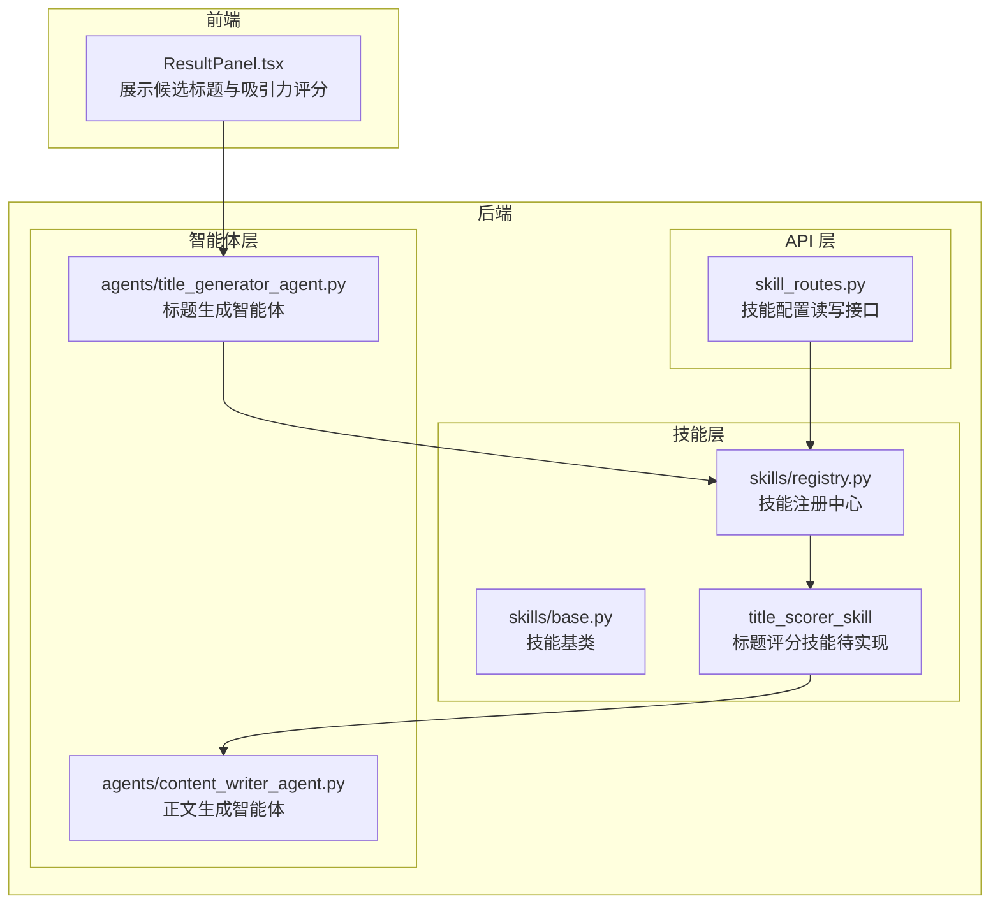
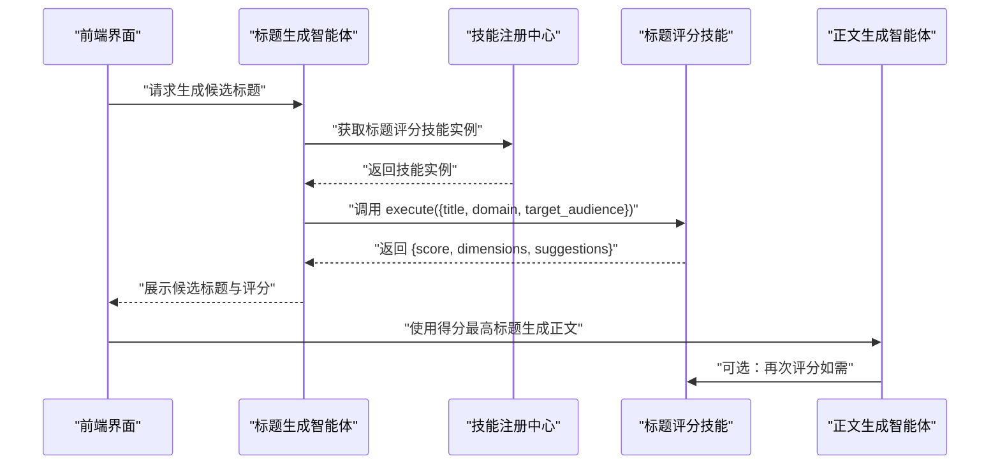
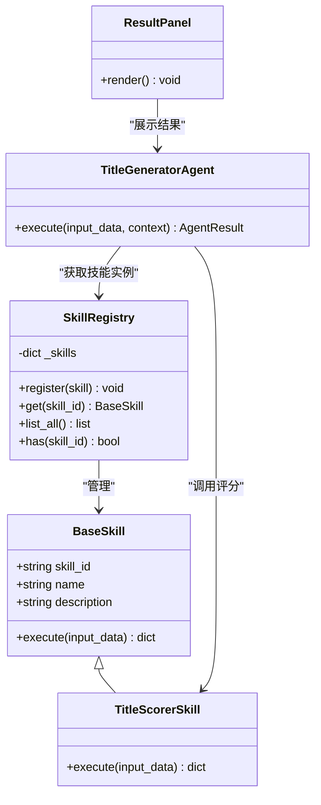

# 标题评分技能

<cite>
**本文引用的文件**
- [ARCHITECTURE.md](file://ARCHITECTURE.md)
- [backend/app/skills/base.py](file://backend/app/skills/base.py)
- [backend/app/skills/registry.py](file://backend/app/skills/registry.py)
- [backend/app/api/skill_routes.py](file://backend/app/api/skill_routes.py)
- [backend/app/schemas/skill.py](file://backend/app/schemas/skill.py)
- [backend/app/agents/title_generator_agent.py](file://backend/app/agents/title_generator_agent.py)
- [backend/app/agents/content_writer_agent.py](file://backend/app/agents/content_writer_agent.py)
- [frontend/components/office/ResultPanel.tsx](file://frontend/components/office/ResultPanel.tsx)
</cite>

## 目录
1. [简介](#简介)
2. [项目结构](#项目结构)
3. [核心组件](#核心组件)
4. [架构总览](#架构总览)
5. [详细组件分析](#详细组件分析)
6. [依赖分析](#依赖分析)
7. [性能考量](#性能考量)
8. [故障排查指南](#故障排查指南)
9. [结论](#结论)
10. [附录](#附录)

## 简介
标题评分技能（title_scorer_skill）是 HotClaw 多智能体内容生产平台中的一个内置技能，用于对候选标题进行多维度质量评估与优化建议生成。其核心目标包括：
- 点击率预测：结合标题吸引力、情绪驱动力、与内容的相关性等维度，给出综合评分。
- 搜索友好度评估：通过关键词密度、语义匹配度等指标，辅助 SEO 优化。
- 情感倾向分析：识别标题中的情绪强度与类型，如焦虑、希望、好奇等，指导内容调性。
- 竞争性分析：对比同类内容的标题风格与评分，提供差异化建议。

输出包含：综合分数、四个维度的子评分（点击度、相关性、情绪、清晰度）、以及可执行的优化建议列表。该技能在工作流中由“标题生成智能体”调用，作为标题筛选与优化的关键环节。

## 项目结构
标题评分技能位于后端技能层（skills），通过统一的技能基类与注册中心进行管理，并由 API 路由提供配置读写能力。前端在结果面板中展示候选标题及其吸引力评分，形成从生成到可视化的闭环。

图表来源
- [backend/app/api/skill_routes.py:1-61](file://backend/app/api/skill_routes.py#L1-L61)
- [backend/app/skills/base.py:16-36](file://backend/app/skills/base.py#L16-L36)
- [backend/app/skills/registry.py:10-36](file://backend/app/skills/registry.py#L10-L36)
- [backend/app/agents/title_generator_agent.py:1-85](file://backend/app/agents/title_generator_agent.py#L1-L85)
- [backend/app/agents/content_writer_agent.py:1-131](file://backend/app/agents/content_writer_agent.py#L1-L131)
- [frontend/components/office/ResultPanel.tsx:66-103](file://frontend/components/office/ResultPanel.tsx#L66-L103)

章节来源
- [ARCHITECTURE.md:750-758](file://ARCHITECTURE.md#L750-L758)
- [backend/app/skills/base.py:16-36](file://backend/app/skills/base.py#L16-L36)
- [backend/app/skills/registry.py:10-36](file://backend/app/skills/registry.py#L10-L36)
- [backend/app/api/skill_routes.py:17-61](file://backend/app/api/skill_routes.py#L17-L61)
- [backend/app/agents/title_generator_agent.py:39-85](file://backend/app/agents/title_generator_agent.py#L39-L85)
- [frontend/components/office/ResultPanel.tsx:66-103](file://frontend/components/office/ResultPanel.tsx#L66-L103)

## 核心组件
- 技能基类（BaseSkill）：定义技能的标准接口与生命周期，确保所有技能具备稳定的输入输出契约与可配置能力。
- 技能注册中心（SkillRegistry）：集中管理技能实例，提供注册、查询、枚举与存在性判断能力。
- 标题评分技能（title_scorer_skill）：面向标题的多维度评估与优化建议生成，输入包含标题文本、领域与目标受众，输出包含综合分数、维度评分与建议列表。
- 标题生成智能体（TitleGeneratorAgent）：在生成候选标题后，调用标题评分技能进行打分与排序，作为后续正文生成的前置步骤。
- API 路由（skill_routes.py）：提供技能列表与配置更新接口，支撑技能的动态配置与持久化。
- 前端结果面板（ResultPanel.tsx）：展示候选标题与吸引力评分，便于人工审阅与二次调整。

章节来源
- [backend/app/skills/base.py:16-36](file://backend/app/skills/base.py#L16-L36)
- [backend/app/skills/registry.py:10-36](file://backend/app/skills/registry.py#L10-L36)
- [backend/app/api/skill_routes.py:17-61](file://backend/app/api/skill_routes.py#L17-L61)
- [backend/app/agents/title_generator_agent.py:39-85](file://backend/app/agents/title_generator_agent.py#L39-L85)
- [frontend/components/office/ResultPanel.tsx:66-103](file://frontend/components/office/ResultPanel.tsx#L66-L103)

## 架构总览
标题评分技能在系统中的位置与调用关系如下：

图表来源
- [backend/app/agents/title_generator_agent.py:39-85](file://backend/app/agents/title_generator_agent.py#L39-L85)
- [backend/app/skills/registry.py:22-26](file://backend/app/skills/registry.py#L22-L26)
- [ARCHITECTURE.md:750-758](file://ARCHITECTURE.md#L750-L758)
- [frontend/components/office/ResultPanel.tsx:66-103](file://frontend/components/office/ResultPanel.tsx#L66-L103)

## 详细组件分析

### 标题评分技能（title_scorer_skill）
- 输入规范
  - title：待评分的标题文本
  - domain：账号所属领域（如职场、科技、生活）
  - target_audience：目标受众特征（如年龄区间、职业、兴趣）
- 输出规范
  - score：综合评分（浮点数）
  - dimensions：包含 clickability（点击度）、relevance（相关性）、emotion（情绪）、clarity（清晰度）四个维度的子评分
  - suggestions：针对标题优化的具体建议列表
- 实现要点
  - 评分模型：通过调用 LLM 对标题进行多维度分析与打分
  - 评分维度权重：可在技能配置中进行调整，以适配不同账号画像与内容类型
  - 优化建议：基于维度得分与常见标题优化模式，生成可执行的改进建议

章节来源
- [ARCHITECTURE.md:750-758](file://ARCHITECTURE.md#L750-L758)

### 标题生成智能体（TitleGeneratorAgent）
- 职责：为选题生成多个候选标题，并调用标题评分技能进行打分与排序
- 调用流程：先生成候选标题，再调用标题评分技能，最后按分数降序展示
- 降级策略：若评分技能不可用，返回默认标题与基础评分

章节来源
- [backend/app/agents/title_generator_agent.py:39-85](file://backend/app/agents/title_generator_agent.py#L39-L85)

### 技能基类与注册中心
- 技能基类（BaseSkill）：定义统一的 execute 接口与配置注入机制，确保技能的可复用性与稳定性
- 技能注册中心（SkillRegistry）：提供技能的注册、查询与枚举能力，支持运行时动态管理

章节来源
- [backend/app/skills/base.py:16-36](file://backend/app/skills/base.py#L16-L36)
- [backend/app/skills/registry.py:10-36](file://backend/app/skills/registry.py#L10-L36)

### API 路由与配置管理
- 技能列表接口：返回已注册技能的元信息与当前配置
- 更新配置接口：支持按技能 ID 更新配置数据，并持久化到数据库

章节来源
- [backend/app/api/skill_routes.py:17-61](file://backend/app/api/skill_routes.py#L17-L61)
- [backend/app/schemas/skill.py:6-22](file://backend/app/schemas/skill.py#L6-L22)

### 前端结果面板（ResultPanel.tsx）
- 展示候选标题与吸引力评分（以百分比形式呈现）
- 为用户提供直观的标题质量反馈，便于人工干预与二次优化

章节来源
- [frontend/components/office/ResultPanel.tsx:66-103](file://frontend/components/office/ResultPanel.tsx#L66-L103)

## 依赖分析
标题评分技能的依赖关系如下：

图表来源
- [backend/app/skills/base.py:16-36](file://backend/app/skills/base.py#L16-L36)
- [backend/app/skills/registry.py:10-36](file://backend/app/skills/registry.py#L10-L36)
- [backend/app/agents/title_generator_agent.py:39-85](file://backend/app/agents/title_generator_agent.py#L39-L85)
- [frontend/components/office/ResultPanel.tsx:66-103](file://frontend/components/office/ResultPanel.tsx#L66-L103)

章节来源
- [backend/app/skills/base.py:16-36](file://backend/app/skills/base.py#L16-L36)
- [backend/app/skills/registry.py:10-36](file://backend/app/skills/registry.py#L10-L36)
- [backend/app/agents/title_generator_agent.py:39-85](file://backend/app/agents/title_generator_agent.py#L39-L85)
- [frontend/components/office/ResultPanel.tsx:66-103](file://frontend/components/office/ResultPanel.tsx#L66-L103)

## 性能考量
- LLM 调用成本：标题评分依赖 LLM 推理，应合理设置并发与缓存策略，避免高峰时段的延迟与费用激增。
- 维度权重可调：通过技能配置动态调整维度权重，可在不同内容类型与账号画像下平衡点击度与相关性。
- 降级策略：当评分技能不可用时，标题生成智能体提供默认行为，保障工作流不中断。
- 前端渲染：结果面板仅展示必要字段，减少不必要的计算与渲染开销。

## 故障排查指南
- 技能未注册
  - 现象：调用技能时报错“技能未找到”
  - 处理：确认技能已在启动时注册，或通过 API 路由进行注册与持久化
- 配置缺失
  - 现象：评分结果异常或为空
  - 处理：检查技能配置是否正确下发，必要时通过配置接口更新
- 评分维度异常
  - 现象：维度评分分布不合理
  - 处理：调整维度权重配置，结合账号画像与内容类型进行优化
- 前端展示异常
  - 现象：吸引力评分未显示或显示异常
  - 处理：确认标题生成智能体返回的评分字段完整，前端组件按约定渲染

章节来源
- [backend/app/skills/registry.py:22-26](file://backend/app/skills/registry.py#L22-L26)
- [backend/app/api/skill_routes.py:34-61](file://backend/app/api/skill_routes.py#L34-L61)
- [frontend/components/office/ResultPanel.tsx:66-103](file://frontend/components/office/ResultPanel.tsx#L66-L103)

## 结论
标题评分技能通过多维度评估与可配置的权重机制，为候选标题提供科学、可解释的质量评分与优化建议。配合标题生成智能体与正文生成智能体，形成从标题到内容的完整质量闭环。建议在实际使用中：
- 根据账号画像与内容类型动态调整维度权重
- 建立定期回测与 A/B 测试机制，持续优化评分模型
- 强化前端可视化与人工干预能力，提升整体内容质量

## 附录
- 评分维度与权重分配（示例）
  - 点击度（clickability）：吸引眼球、制造好奇与紧迫感
  - 相关性（relevance）：与领域、选题、目标受众的匹配程度
  - 情绪（emotion）：情绪强度与类型（焦虑、希望、好奇等）
  - 清晰度（clarity）：表达简洁、意图明确、无歧义
- 优化建议生成机制（示例）
  - 基于维度低分项，提供具体改进建议（如增加关键词、调整语气、简化表达等）
- A/B 测试支持（建议）
  - 通过前端界面与后端配置，对不同权重组合与提示词进行对照实验，收集点击率与转化率数据，持续迭代

章节来源
- [ARCHITECTURE.md:750-758](file://ARCHITECTURE.md#L750-L758)
- [backend/app/agents/title_generator_agent.py:39-85](file://backend/app/agents/title_generator_agent.py#L39-L85)
- [frontend/components/office/ResultPanel.tsx:66-103](file://frontend/components/office/ResultPanel.tsx#L66-L103)