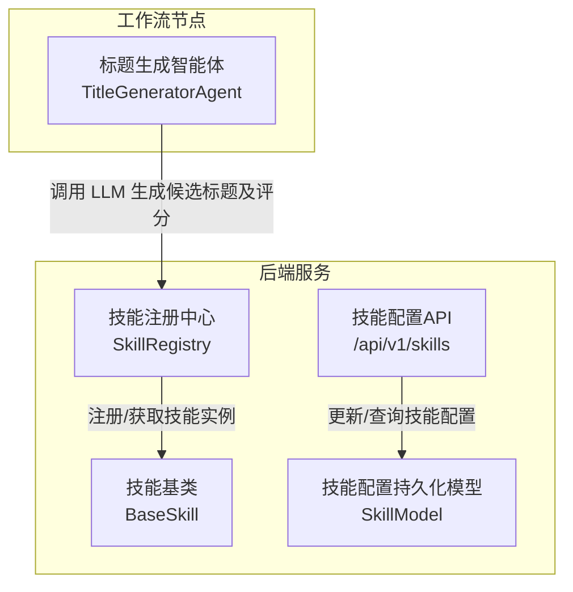
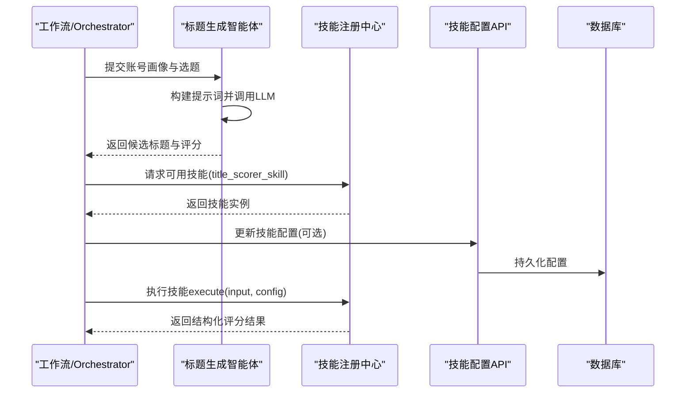
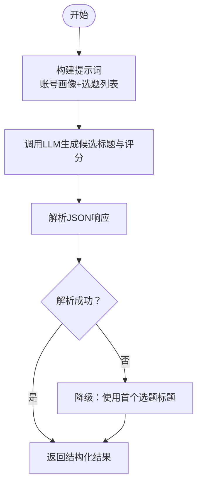
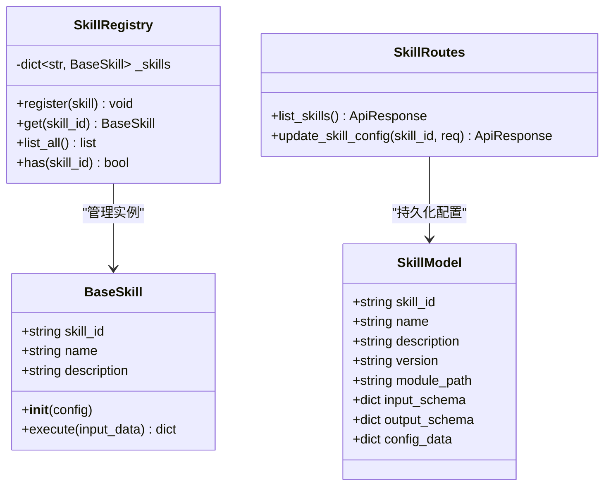
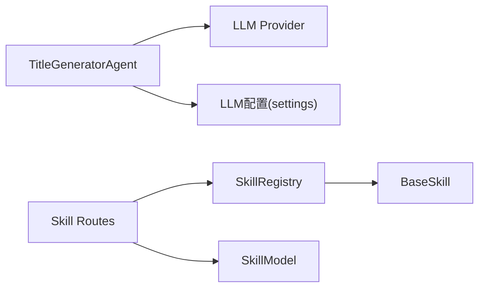

# 标题评分技能

<cite>
**本文引用的文件**
- [ARCHITECTURE.md](file://ARCHITECTURE.md)
- [title_generator_agent.py](file://backend/app/agents/title_generator_agent.py)
- [skill_routes.py](file://backend/app/api/skill_routes.py)
- [base.py](file://backend/app/skills/base.py)
- [registry.py](file://backend/app/skills/registry.py)
- [tables.py](file://backend/app/models/tables.py)
- [skill.py](file://backend/app/schemas/skill.py)
</cite>

## 目录
1. [简介](#简介)
2. [项目结构](#项目结构)
3. [核心组件](#核心组件)
4. [架构总览](#架构总览)
5. [详细组件分析](#详细组件分析)
6. [依赖分析](#依赖分析)
7. [性能考虑](#性能考虑)
8. [故障排查指南](#故障排查指南)
9. [结论](#结论)
10. [附录](#附录)

## 简介
本文件为“标题评分技能”的专业技术文档，聚焦于标题吸引力评估、点击率预测、SEO优化建议与内容质量打分等核心能力。文档基于现有架构与实现线索，系统阐述评分算法的实现思路、评分维度与权重分配、配置参数、输入输出Schema、示例与优化建议、统计意义与业务价值，并面向开发者提供调优指南与自适应评分模型的落地方法。

## 项目结构
标题评分技能在当前仓库中以“技能”形态存在，其输入输出与实现要点在架构文档中有明确描述；同时，标题生成智能体在工作流中承担“候选标题生成与评分”的角色，可作为评分流程的前置环节。技能的注册、配置持久化与API接口由后端框架提供支持。

```mermaid
graph TB
subgraph "后端服务"
A["技能注册中心<br/>SkillRegistry"]
B["技能基类<br/>BaseSkill"]
C["技能配置API<br/>/api/v1/skills"]
D["技能配置持久化模型<br/>SkillModel"]
end
subgraph "工作流节点"
E["标题生成智能体<br/>TitleGeneratorAgent"]
end
E --> |"调用 LLM 生成候选标题及评分"| A
A --> |"注册/获取技能实例"| B
C --> |"更新/查询技能配置"| D
```

图表来源
- [ARCHITECTURE.md](file://ARCHITECTURE.md)
- [title_generator_agent.py](file://backend/app/agents/title_generator_agent.py)
- [skill_routes.py](file://backend/app/api/skill_routes.py)
- [base.py](file://backend/app/skills/base.py)
- [registry.py](file://backend/app/skills/registry.py)
- [tables.py](file://backend/app/models/tables.py)

章节来源
- [ARCHITECTURE.md](file://ARCHITECTURE.md)
- [title_generator_agent.py](file://backend/app/agents/title_generator_agent.py)
- [skill_routes.py](file://backend/app/api/skill_routes.py)
- [base.py](file://backend/app/skills/base.py)
- [registry.py](file://backend/app/skills/registry.py)
- [tables.py](file://backend/app/models/tables.py)

## 核心组件
- 标题评分技能（title_scorer_skill）
  - 输入：标题文本、主领域、目标受众
  - 输出：综合得分、四个维度得分、优化建议数组
  - 实现：调用大模型进行多维度评分
  - 配置：评分模型、维度权重
- 标题生成智能体（TitleGeneratorAgent）
  - 在工作流中负责生成候选标题并给出评分与理由
  - 使用系统提示词驱动LLM完成多维评估与风格多样性约束

章节来源
- [ARCHITECTURE.md](file://ARCHITECTURE.md)
- [title_generator_agent.py](file://backend/app/agents/title_generator_agent.py)

## 架构总览
标题评分技能属于“工具型能力”，由Agent在工作流中按需调用。技能本身无状态、可独立运行，通过注册中心统一管理；技能配置可通过API更新并持久化至数据库。

```mermaid
sequenceDiagram
participant WF as "工作流/Orchestrator"
participant AG as "标题生成智能体"
participant SK as "技能注册中心"
participant API as "技能配置API"
participant DB as "数据库"
WF->>AG : 提交账号画像与选题
AG->>AG : 构建提示词并调用LLM
AG-->>WF : 返回候选标题与评分
WF->>SK : 请求可用技能(title_scorer_skill)
SK-->>WF : 返回技能实例
WF->>API : 更新技能配置(可选)
API->>DB : 持久化配置
WF->>SK : 执行技能execute(input, config)
SK-->>WF : 返回结构化评分结果
```

图表来源
- [ARCHITECTURE.md](file://ARCHITECTURE.md)
- [skill_routes.py](file://backend/app/api/skill_routes.py)
- [registry.py](file://backend/app/skills/registry.py)
- [tables.py](file://backend/app/models/tables.py)

## 详细组件分析

### 标题评分技能（抽象层）
- 输入Schema
  - title: string
  - domain: string
  - target_audience: string
- 输出Schema
  - score: float
  - dimensions: { clickability: float, relevance: float, emotion: float, clarity: float }
  - suggestions: string[]
- 配置
  - 评分模型
  - 维度权重
- 实现模式
  - 通过LLM对标题进行多维度打分与建议生成

章节来源
- [ARCHITECTURE.md](file://ARCHITECTURE.md)

### 标题生成智能体（实现层）
- 角色定位
  - 生成4-6个风格各异的候选标题
  - 为每个标题给出评分与理由
- 评分维度与权重（来自系统提示词）
  - 好奇心激发度(30%)
  - 与内容匹配度(25%)
  - 情绪驱动力(25%)
  - 可信度(20%)
- 提示词工程
  - 包含账号主领域、内容调性、选题列表与排序
  - 输出格式约束为JSON对象
- 错误处理
  - JSON解析失败与LLM异常的降级策略

```mermaid
flowchart TD
Start(["开始"]) --> BuildPrompt["构建提示词<br/>账号画像+选题列表"]
BuildPrompt --> CallLLM["调用LLM生成候选标题与评分"]
CallLLM --> Parse["解析JSON响应"]
Parse --> Valid{"解析成功？"}
Valid --> |是| ReturnOK["返回结构化结果"]
Valid --> |否| Fallback["降级：使用首个选题标题"]
Fallback --> ReturnOK
```

图表来源
- [title_generator_agent.py](file://backend/app/agents/title_generator_agent.py)

章节来源
- [title_generator_agent.py](file://backend/app/agents/title_generator_agent.py)

### 技能注册与配置管理
- 技能注册中心
  - 维护技能实例字典，提供注册、获取、列举、存在性检查
- 技能基类
  - 统一的异步execute接口，约定输入/输出结构
- 技能配置API
  - 列举技能、更新技能配置
  - 支持按skill_id更新config_data
- 配置持久化
  - SkillModel记录模块路径、输入/输出Schema、配置数据等

```mermaid
classDiagram
class BaseSkill {
+string skill_id
+string name
+string description
+__init__(config)
+execute(input_data) dict
}
class SkillRegistry {
-dict~str, BaseSkill~ _skills
+register(skill) void
+get(skill_id) BaseSkill
+list_all() list
+has(skill_id) bool
}
class SkillRoutes {
+list_skills() ApiResponse
+update_skill_config(skill_id, req) ApiResponse
}
class SkillModel {
+string skill_id
+string name
+string description
+string version
+string module_path
+dict input_schema
+dict output_schema
+dict config_data
}
SkillRegistry --> BaseSkill : "管理实例"
SkillRoutes --> SkillModel : "持久化配置"
```

图表来源
- [base.py](file://backend/app/skills/base.py)
- [registry.py](file://backend/app/skills/registry.py)
- [skill_routes.py](file://backend/app/api/skill_routes.py)
- [tables.py](file://backend/app/models/tables.py)

章节来源
- [base.py](file://backend/app/skills/base.py)
- [registry.py](file://backend/app/skills/registry.py)
- [skill_routes.py](file://backend/app/api/skill_routes.py)
- [tables.py](file://backend/app/models/tables.py)

## 依赖分析
- 组件耦合
  - 标题生成智能体依赖LLM服务与系统提示词
  - 技能体系依赖注册中心与配置API
- 外部依赖
  - LLM提供商（DashScope等）
  - FastAPI路由与数据库ORM
- 接口契约
  - 技能execute输入/输出结构由基类约定
  - API层提供配置更新与查询能力

```mermaid
graph LR
AG["TitleGeneratorAgent"] --> LLM["LLM Provider"]
AG --> CFG["LLM配置(settings)"]
SR["SkillRegistry"] --> BS["BaseSkill"]
API["Skill Routes"] --> DB["SkillModel"]
API --> SR
```

图表来源
- [title_generator_agent.py](file://backend/app/agents/title_generator_agent.py)
- [registry.py](file://backend/app/skills/registry.py)
- [skill_routes.py](file://backend/app/api/skill_routes.py)
- [tables.py](file://backend/app/models/tables.py)

章节来源
- [title_generator_agent.py](file://backend/app/agents/title_generator_agent.py)
- [registry.py](file://backend/app/skills/registry.py)
- [skill_routes.py](file://backend/app/api/skill_routes.py)
- [tables.py](file://backend/app/models/tables.py)

## 性能考虑
- LLM调用超时与重试
  - 建议在配置中设置合理的timeout与重试策略，避免阻塞工作流
- 输出解析健壮性
  - 对LLM返回的JSON进行严格解析与降级兜底，减少失败传播
- 维度计算开销
  - 若未来扩展为纯算法评分，应优先采用向量化与缓存策略降低延迟

## 故障排查指南
- JSON解析失败
  - 现象：返回结构不符合预期
  - 排查：确认提示词中明确要求输出JSON格式；检查LLM提供商兼容性
- LLM错误
  - 现象：网络或鉴权异常导致调用失败
  - 排查：核对API Key、Base URL、模型名称；启用降级逻辑
- 技能配置更新无效
  - 现象：更新后未生效
  - 排查：确认API请求成功、数据库记录已更新、重启服务后加载最新配置

章节来源
- [title_generator_agent.py](file://backend/app/agents/title_generator_agent.py)
- [skill_routes.py](file://backend/app/api/skill_routes.py)
- [tables.py](file://backend/app/models/tables.py)

## 结论
标题评分技能以“工具型能力”形式嵌入工作流，当前实现通过LLM完成多维度评分与建议生成。结合标题生成智能体的前置能力，可形成从选题到标题的完整评估闭环。后续可在保持接口稳定的前提下，逐步引入纯算法评分与自适应权重，提升稳定性与可解释性。

## 附录

### 输入输出Schema设计
- 输入Schema（标题评分技能）
  - title: string
  - domain: string
  - target_audience: string
- 输出Schema（标题评分技能）
  - score: float
  - dimensions: { clickability: float, relevance: float, emotion: float, clarity: float }
  - suggestions: string[]

章节来源
- [ARCHITECTURE.md](file://ARCHITECTURE.md)

### 评分维度与权重分配
- 来源：标题生成智能体系统提示词
  - 好奇心激发度(30%)
  - 与内容匹配度(25%)
  - 情绪驱动力(25%)
  - 可信度(20%)

章节来源
- [title_generator_agent.py](file://backend/app/agents/title_generator_agent.py)

### 配置参数与最佳实践
- 评分模型
  - 建议在技能配置中显式指定模型名与供应商
- 维度权重
  - 可通过配置项动态调整各维度权重，便于跨平台/场景适配
- 行业基准对比
  - 建议建立分平台、分领域的基准分数区间，用于归一化与对比

章节来源
- [ARCHITECTURE.md](file://ARCHITECTURE.md)

### 实际评分示例与优化建议
- 示例流程
  - 输入：标题、主领域、目标受众
  - 输出：综合得分、维度得分、优化建议
- 优化建议生成
  - 基于LLM提示词工程，针对点击力、相关性、情绪与清晰度分别给出改进建议

章节来源
- [ARCHITECTURE.md](file://ARCHITECTURE.md)

### 统计意义与业务价值
- 统计意义
  - 维度得分可用于趋势分析与A/B实验，辅助判断标题策略的有效性
- 业务价值
  - 提升内容曝光与点击转化，降低人工筛选成本，支撑规模化内容生产

### 不同内容类型的评分标准与最佳实践
- 微信公众号
  - 强调情绪与信任，适度使用悬念与数字型标题
- 抖音/视频
  - 更注重前2秒抓取力与视觉引导，标题需与封面/首帧呼应
- 小红书/图文
  - 强调实用性与共鸣，建议增加场景化与实证元素

### 开发者调优指南与自适应评分模型
- 调优建议
  - 以A/B实验收集点击率与互动数据，迭代提示词与权重
  - 引入离线特征工程（关键词密度、情感分、悬念指标）与在线推理
- 自适应模型
  - 基于历史样本训练轻量级分类/回归模型，替代或增强LLM的某些维度
  - 通过在线学习持续更新模型参数，结合滑动窗口统计与异常检测