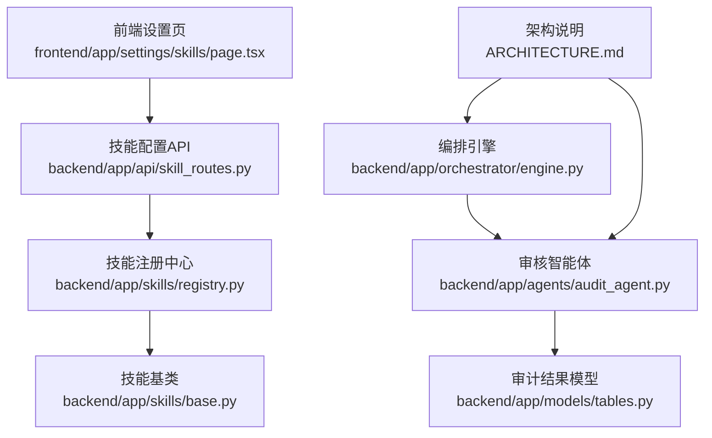
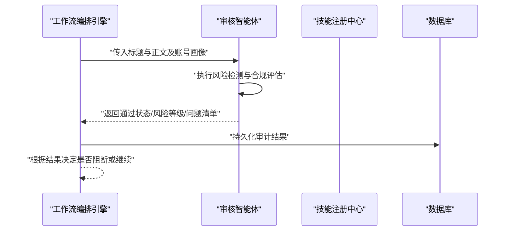
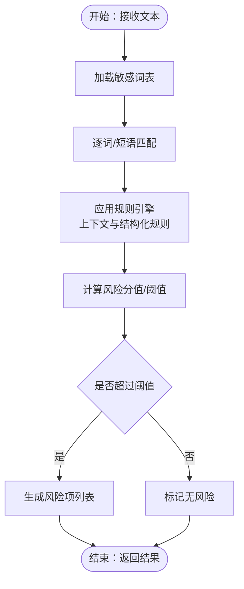
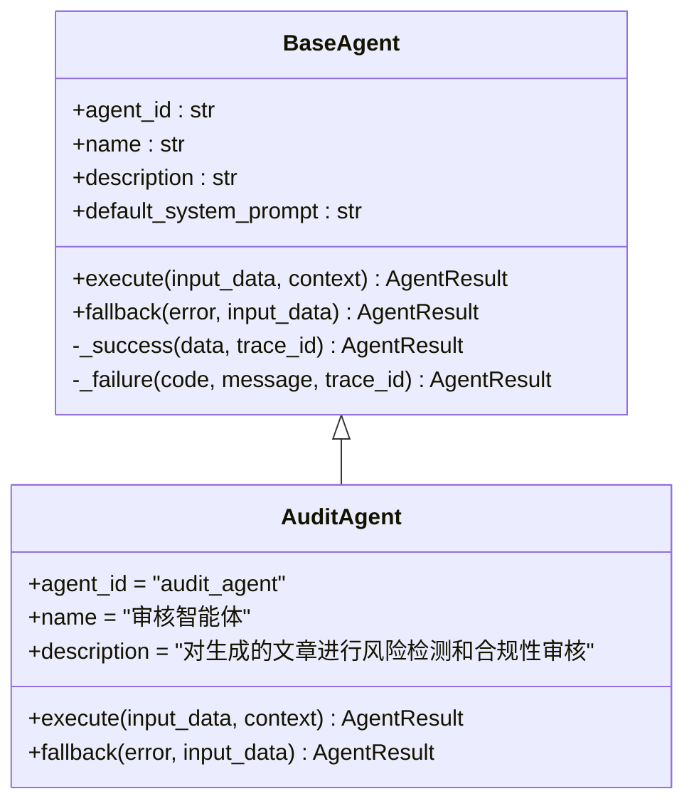
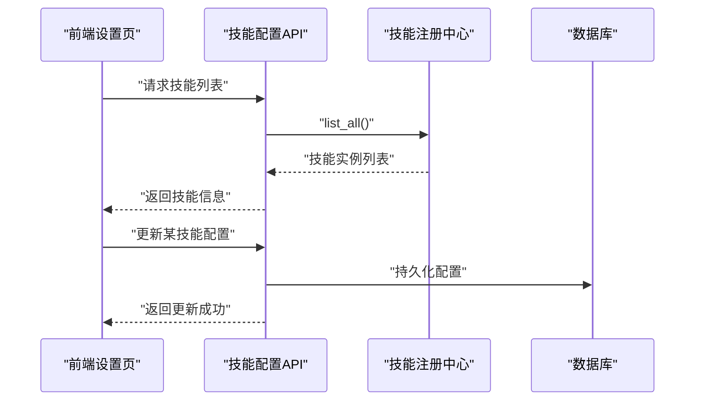
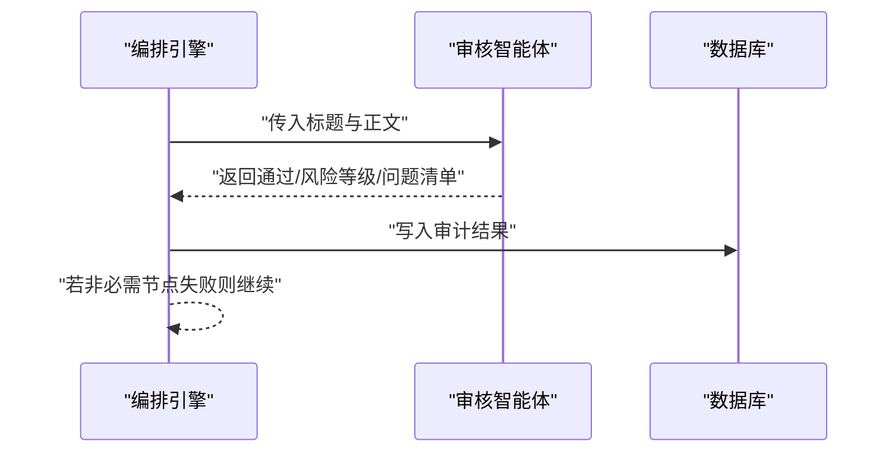
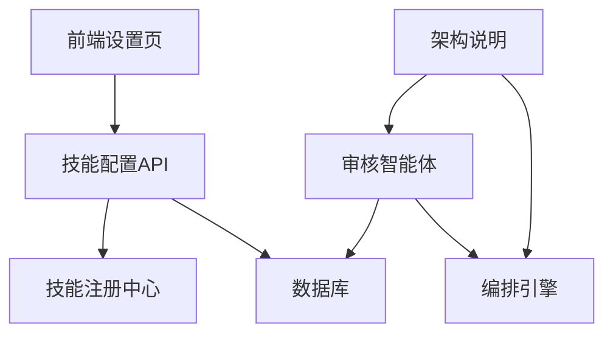

# 风险检测技能

<cite>
**本文引用的文件**
- [backend/app/skills/base.py](file://backend/app/skills/base.py)
- [backend/app/skills/registry.py](file://backend/app/skills/registry.py)
- [backend/app/api/skill_routes.py](file://backend/app/api/skill_routes.py)
- [backend/app/models/tables.py](file://backend/app/models/tables.py)
- [backend/app/agents/base.py](file://backend/app/agents/base.py)
- [backend/app/agents/audit_agent.py](file://backend/app/agents/audit_agent.py)
- [backend/app/orchestrator/engine.py](file://backend/app/orchestrator/engine.py)
- [frontend/app/settings/skills/page.tsx](file://frontend/app/settings/skills/page.tsx)
- [ARCHITECTURE.md](file://ARCHITECTURE.md)
</cite>

## 目录
1. [简介](#简介)
2. [项目结构](#项目结构)
3. [核心组件](#核心组件)
4. [架构总览](#架构总览)
5. [详细组件分析](#详细组件分析)
6. [依赖分析](#依赖分析)
7. [性能考虑](#性能考虑)
8. [故障排查指南](#故障排查指南)
9. [结论](#结论)
10. [附录](#附录)

## 简介
本文件面向“风险检测技能”的技术实现与使用，聚焦于安全评估与合规检查能力，覆盖敏感内容识别、违规信息检测、风险等级评估与安全建议生成。文档基于仓库现有实现与架构说明，梳理检测算法的实现原理（关键词匹配、规则引擎）、风险类别划分标准（政治敏感、色情低俗、赌博诈骗、侵犯隐私等）、检测阈值与误报控制方法、实际检测案例与处理流程，以及与审核技能的协作关系与自动化决策机制。

## 项目结构
风险检测技能属于“工具型能力”，由“技能注册中心”统一管理，并通过“工作流编排引擎”在内容生产流水线中被调用。前端提供技能配置查看页面；后端提供技能配置接口与数据库模型支撑。

**图示来源**
- [frontend/app/settings/skills/page.tsx:1-81](file://frontend/app/settings/skills/page.tsx#L1-L81)
- [backend/app/api/skill_routes.py:1-61](file://backend/app/api/skill_routes.py#L1-L61)
- [backend/app/skills/registry.py:1-37](file://backend/app/skills/registry.py#L1-L37)
- [backend/app/skills/base.py:1-37](file://backend/app/skills/base.py#L1-L37)
- [backend/app/orchestrator/engine.py:1-285](file://backend/app/orchestrator/engine.py#L1-L285)
- [backend/app/agents/audit_agent.py:1-65](file://backend/app/agents/audit_agent.py#L1-L65)
- [backend/app/models/tables.py:141-158](file://backend/app/models/tables.py#L141-L158)
- [ARCHITECTURE.md:740-760](file://ARCHITECTURE.md#L740-L760)

**章节来源**
- [frontend/app/settings/skills/page.tsx:1-81](file://frontend/app/settings/skills/page.tsx#L1-L81)
- [backend/app/api/skill_routes.py:1-61](file://backend/app/api/skill_routes.py#L1-L61)
- [backend/app/skills/registry.py:1-37](file://backend/app/skills/registry.py#L1-L37)
- [backend/app/skills/base.py:1-37](file://backend/app/skills/base.py#L1-L37)
- [backend/app/orchestrator/engine.py:1-285](file://backend/app/orchestrator/engine.py#L1-L285)
- [backend/app/agents/audit_agent.py:1-65](file://backend/app/agents/audit_agent.py#L1-L65)
- [backend/app/models/tables.py:141-158](file://backend/app/models/tables.py#L141-L158)
- [ARCHITECTURE.md:740-760](file://ARCHITECTURE.md#L740-L760)

## 核心组件
- 技能基类与注册中心
  - 技能基类定义统一接口与生命周期参数，确保所有技能具备稳定的输入输出与可配置能力。
  - 注册中心集中管理技能实例，提供注册、查询、枚举与存在性判断能力。
- 技能配置API
  - 提供技能列表查询与配置更新接口，支持持久化技能配置至数据库。
- 审核智能体
  - 承载风险检测与合规评估职责，输出通过状态、风险等级、问题清单与总体评价。
- 编排引擎
  - 在默认工作流中顺序调度各节点，将审核节点作为可选环节，失败时触发降级策略。
- 数据模型
  - 审计结果模型用于持久化风险检测结果，包含风险等级、问题列表与总体评论。

**章节来源**
- [backend/app/skills/base.py:16-37](file://backend/app/skills/base.py#L16-L37)
- [backend/app/skills/registry.py:10-37](file://backend/app/skills/registry.py#L10-L37)
- [backend/app/api/skill_routes.py:17-61](file://backend/app/api/skill_routes.py#L17-L61)
- [backend/app/agents/audit_agent.py:7-65](file://backend/app/agents/audit_agent.py#L7-L65)
- [backend/app/orchestrator/engine.py:89-285](file://backend/app/orchestrator/engine.py#L89-L285)
- [backend/app/models/tables.py:141-158](file://backend/app/models/tables.py#L141-L158)

## 架构总览
风险检测技能在当前MVP阶段采用“关键词匹配+规则引擎”的实现方式，不依赖大模型推理。工作流中的审核节点负责对标题与正文进行合规性评估，输出风险等级与问题清单，供后续自动化决策或人工复核使用。

**图示来源**
- [backend/app/orchestrator/engine.py:89-285](file://backend/app/orchestrator/engine.py#L89-L285)
- [backend/app/agents/audit_agent.py:48-65](file://backend/app/agents/audit_agent.py#L48-L65)
- [backend/app/models/tables.py:141-158](file://backend/app/models/tables.py#L141-L158)

**章节来源**
- [ARCHITECTURE.md:740-760](file://ARCHITECTURE.md#L740-L760)
- [backend/app/orchestrator/engine.py:89-285](file://backend/app/orchestrator/engine.py#L89-L285)
- [backend/app/agents/audit_agent.py:12-46](file://backend/app/agents/audit_agent.py#L12-L46)

## 详细组件分析

### 风险检测技能（MVP：关键词匹配 + 规则引擎）
- 输入输出约定
  - 输入：文本对象
  - 输出：风险项数组与是否存在风险布尔值
- 实现要点
  - 关键词匹配：基于预置敏感词表进行命中检测
  - 规则引擎：结合上下文与结构化规则进行综合判定
  - 不调用大模型，满足MVP阶段性能与稳定性目标
- 配置项
  - 敏感词表路径与检测规则
  - 可通过技能配置API进行更新与持久化

**图示来源**
- [ARCHITECTURE.md:741-748](file://ARCHITECTURE.md#L741-L748)

**章节来源**
- [ARCHITECTURE.md:741-748](file://ARCHITECTURE.md#L741-L748)

### 审核智能体（内容合规审核）
- 职责边界
  - 对标题与正文进行合规性审核与质量评估
  - 输出通过状态、风险等级、问题清单与总体评价
- 审核维度
  - 敏感词检测
  - 事实核查
  - 夸大宣传
  - 标题党程度
  - 调性匹配
  - 内容质量
- 约束条件
  - 问题列表为空时通过
  - 存在高风险问题时直接不通过
  - 风险等级取问题最高严重级别
- 降级策略
  - 服务异常时返回“未知风险”，建议人工复核

**图示来源**
- [backend/app/agents/base.py:18-99](file://backend/app/agents/base.py#L18-L99)
- [backend/app/agents/audit_agent.py:7-65](file://backend/app/agents/audit_agent.py#L7-L65)

**章节来源**
- [backend/app/agents/audit_agent.py:12-46](file://backend/app/agents/audit_agent.py#L12-L46)
- [backend/app/agents/audit_agent.py:48-65](file://backend/app/agents/audit_agent.py#L48-L65)

### 技能注册与配置管理
- 技能注册中心
  - 统一注册、查询与列举技能实例
  - 提供存在性检查，防止重复注册
- 技能配置API
  - 列出已注册技能及其配置
  - 更新技能配置并持久化到数据库
- 前端技能管理页
  - 展示技能列表、状态与配置详情

**图示来源**
- [frontend/app/settings/skills/page.tsx:12-24](file://frontend/app/settings/skills/page.tsx#L12-L24)
- [backend/app/api/skill_routes.py:17-61](file://backend/app/api/skill_routes.py#L17-L61)
- [backend/app/skills/registry.py:22-32](file://backend/app/skills/registry.py#L22-L32)

**章节来源**
- [backend/app/skills/registry.py:10-37](file://backend/app/skills/registry.py#L10-L37)
- [backend/app/api/skill_routes.py:17-61](file://backend/app/api/skill_routes.py#L17-L61)
- [frontend/app/settings/skills/page.tsx:1-81](file://frontend/app/settings/skills/page.tsx#L1-L81)

### 工作流与自动化决策
- 默认工作流节点
  - 审核节点为可选（required=false），失败不阻断主流程
- 降级与广播
  - 节点失败时尝试降级回退，记录节点运行日志并广播事件
- 审计结果持久化
  - 审核结果写入审计结果表，包含风险等级与问题列表

**图示来源**
- [backend/app/orchestrator/engine.py:89-285](file://backend/app/orchestrator/engine.py#L89-L285)
- [backend/app/agents/audit_agent.py:48-65](file://backend/app/agents/audit_agent.py#L48-L65)
- [backend/app/models/tables.py:141-158](file://backend/app/models/tables.py#L141-L158)

**章节来源**
- [backend/app/orchestrator/engine.py:89-285](file://backend/app/orchestrator/engine.py#L89-L285)
- [backend/app/models/tables.py:141-158](file://backend/app/models/tables.py#L141-L158)

## 依赖分析
- 组件耦合
  - 审核智能体依赖编排引擎提供的上下文与超时控制
  - 技能注册中心为技能配置提供统一入口
  - 数据库模型支撑审计结果持久化
- 外部依赖
  - 前端设置页依赖后端技能配置API
  - 架构说明文档定义了技能与工作流的职责边界

**图示来源**
- [backend/app/agents/audit_agent.py:48-65](file://backend/app/agents/audit_agent.py#L48-L65)
- [backend/app/orchestrator/engine.py:89-285](file://backend/app/orchestrator/engine.py#L89-L285)
- [backend/app/api/skill_routes.py:17-61](file://backend/app/api/skill_routes.py#L17-L61)
- [frontend/app/settings/skills/page.tsx:12-24](file://frontend/app/settings/skills/page.tsx#L12-L24)
- [ARCHITECTURE.md:740-760](file://ARCHITECTURE.md#L740-L760)

**章节来源**
- [backend/app/agents/audit_agent.py:48-65](file://backend/app/agents/audit_agent.py#L48-L65)
- [backend/app/orchestrator/engine.py:89-285](file://backend/app/orchestrator/engine.py#L89-L285)
- [backend/app/api/skill_routes.py:17-61](file://backend/app/api/skill_routes.py#L17-L61)
- [frontend/app/settings/skills/page.tsx:12-24](file://frontend/app/settings/skills/page.tsx#L12-L24)
- [ARCHITECTURE.md:740-760](file://ARCHITECTURE.md#L740-L760)

## 性能考虑
- 当前MVP阶段采用关键词匹配与规则引擎，避免大模型调用，降低延迟与成本
- 建议在敏感词表与规则上进行分层与缓存优化，减少重复扫描开销
- 审核节点设为可选，避免单点阻断，提高整体吞吐

## 故障排查指南
- 技能未注册或查询失败
  - 检查技能注册中心是否正确注册
  - 通过技能配置API确认技能存在性
- 审核节点异常
  - 查看节点运行记录与错误信息
  - 观察是否触发降级回退
- 配置更新无效
  - 确认数据库中技能配置已持久化
  - 检查前端设置页是否正确显示最新配置

**章节来源**
- [backend/app/skills/registry.py:22-26](file://backend/app/skills/registry.py#L22-L26)
- [backend/app/api/skill_routes.py:40-60](file://backend/app/api/skill_routes.py#L40-L60)
- [backend/app/orchestrator/engine.py:154-175](file://backend/app/orchestrator/engine.py#L154-L175)

## 结论
风险检测技能在当前版本以“关键词匹配+规则引擎”为核心，配合审核智能体与编排引擎，实现了从内容生成到合规评估的闭环。通过可选的审核节点与降级策略，系统在保证稳定性的同时兼顾了自动化决策能力。后续可扩展为多模态检测与机器学习模型，以进一步提升准确性与鲁棒性。

## 附录

### 风险类别与阈值配置（基于架构说明）
- 风险类别
  - 政治敏感
  - 色情低俗
  - 赌博诈骗
  - 侵犯隐私
  - 其他违规（如夸张、标题党、事实不实、调性不匹配、内容质量差）
- 阈值与误报控制
  - 建议按风险类别设定不同阈值与权重
  - 误报控制可通过规则收敛与人工校准敏感词表实现
  - 高风险项直接阻断，中低风险项进入人工复核队列

**章节来源**
- [ARCHITECTURE.md:741-748](file://ARCHITECTURE.md#L741-L748)