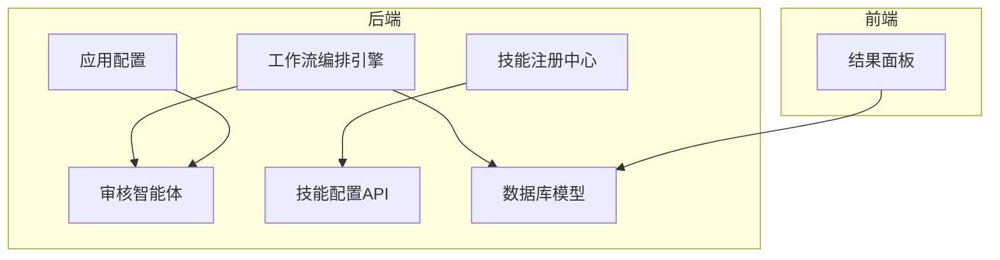
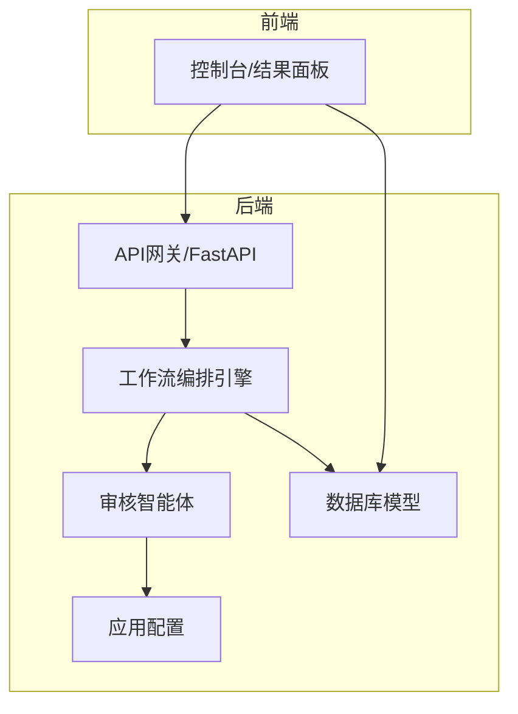
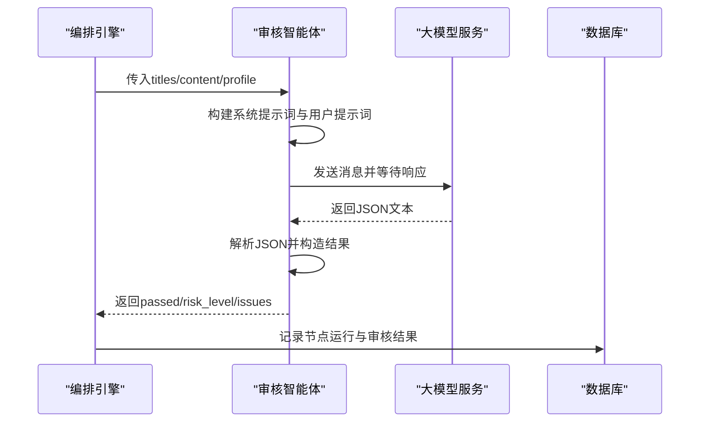
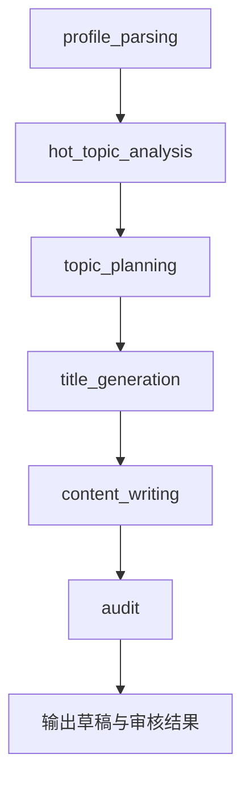
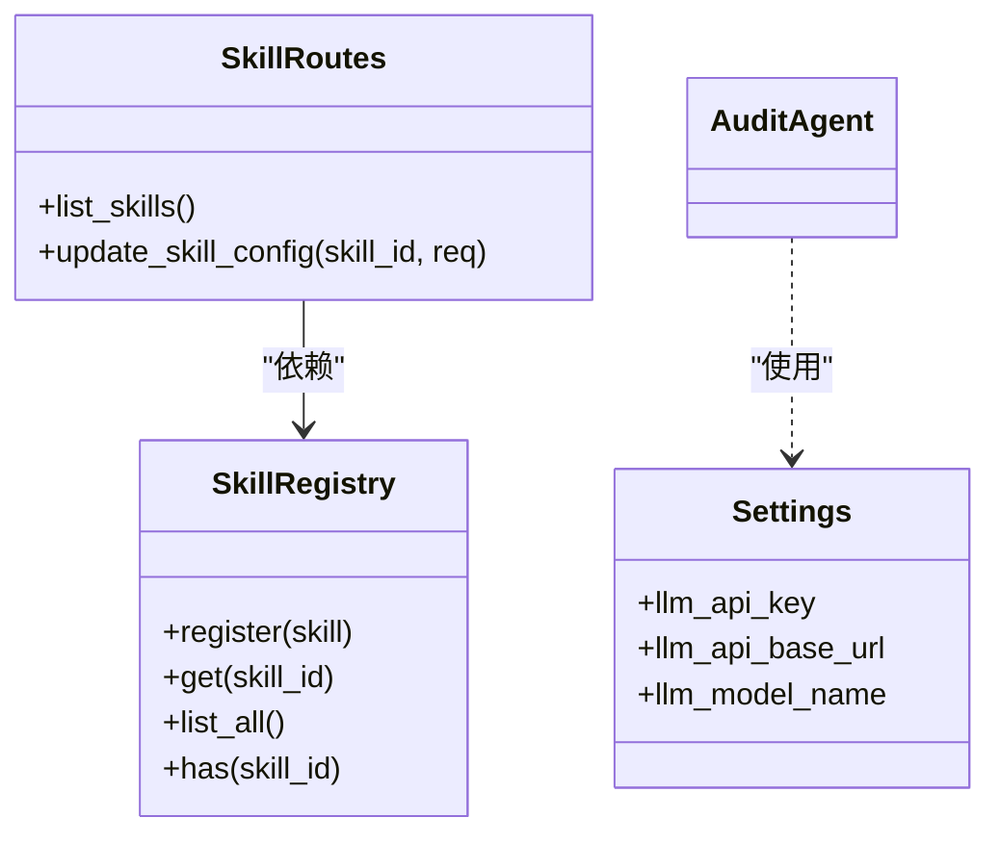
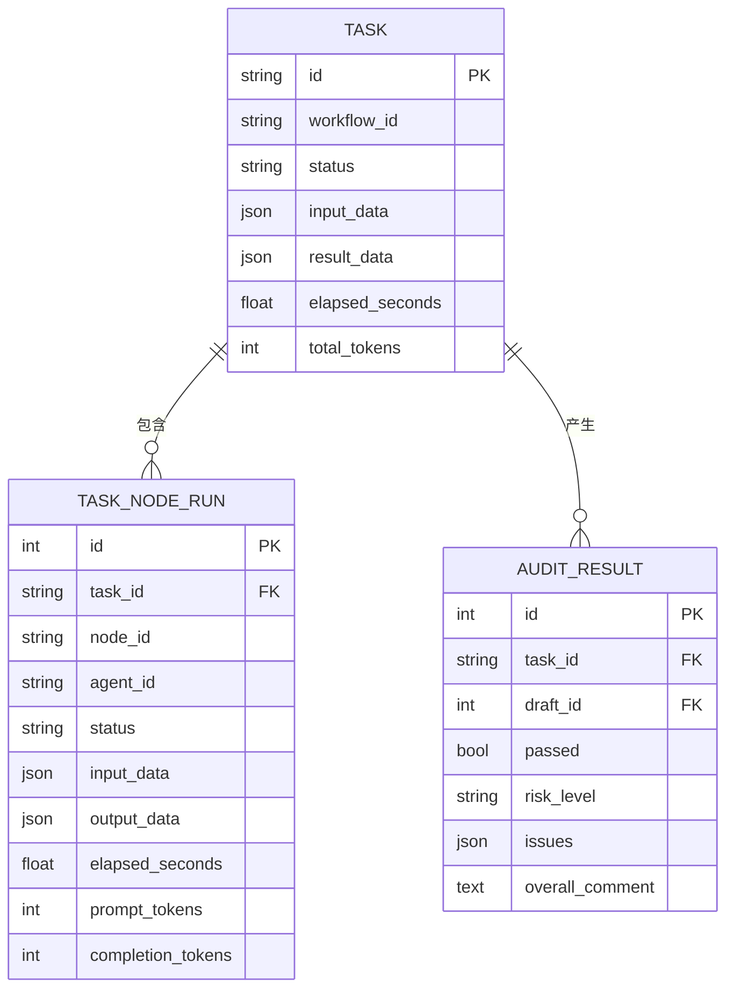
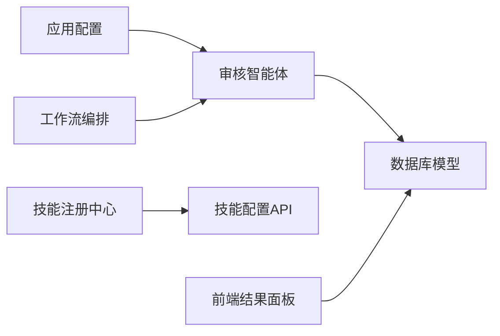

# 风险检测技能

<cite>
**本文引用的文件**
- [架构设计文档](file://ARCHITECTURE.md)
- [审核智能体实现](file://backend/app/agents/audit_agent.py)
- [内容生成智能体实现](file://backend/app/agents/content_writer_agent.py)
- [工作流编排引擎](file://backend/app/orchestrator/engine.py)
- [技能注册中心](file://backend/app/skills/registry.py)
- [基础技能类](file://backend/app/skills/base.py)
- [技能配置API](file://backend/app/api/skill_routes.py)
- [数据库模型定义](file://backend/app/models/tables.py)
- [应用配置](file://backend/app/core/config.py)
- [前端结果面板展示](file://frontend/components/office/ResultPanel.tsx)
- [端到端工作流测试](file://backend/scripts/test_e2e_workflow.py)
</cite>

## 目录
1. [简介](#简介)
2. [项目结构](#项目结构)
3. [核心组件](#核心组件)
4. [架构总览](#架构总览)
5. [详细组件分析](#详细组件分析)
6. [依赖关系分析](#依赖关系分析)
7. [性能考量](#性能考量)
8. [故障排查指南](#故障排查指南)
9. [结论](#结论)
10. [附录](#附录)

## 简介
本文件面向开发者与平台运营人员，系统化阐述“风险检测技能”的技术实现与工程实践。该技能位于内容生产工作流的最终环节，承担内容合规性检查、敏感信息识别、法律风险评估与平台规则遵循的职责。系统采用“智能体-技能”分层架构，其中风险检测以“审核智能体”为核心载体，结合系统配置、工作流编排与数据库持久化，形成可配置、可观测、可降级的风控闭环。

## 项目结构
围绕风险检测相关的关键目录与文件如下：
- 后端核心
  - 审核智能体：负责调用大模型进行合规与质量评估，产出风险报告
  - 工作流编排：串联各智能体，管理上下文与节点执行
  - 技能与配置：技能注册中心、技能配置API、系统配置
  - 数据模型：任务、节点运行、审核结果等结构化存储
- 前端展示
  - 结果面板：展示审核通过状态、风险等级与综合评价

```mermaid
graph TB
subgraph "后端"
A["工作流编排引擎"]
B["审核智能体"]
C["技能注册中心"]
D["技能配置API"]
E["数据库模型"]
F["应用配置"]
end
subgraph "前端"
G["结果面板"]
end
A --> B
A --> E
C --> D
F --> B
G --> E
```

**图表来源**
- [工作流编排引擎:31-86](file://backend/app/orchestrator/engine.py#L31-L86)
- [审核智能体实现:12-16](file://backend/app/agents/audit_agent.py#L12-L16)
- [技能注册中心:10-37](file://backend/app/skills/registry.py#L10-L37)
- [技能配置API:17-61](file://backend/app/api/skill_routes.py#L17-L61)
- [数据库模型定义:23-157](file://backend/app/models/tables.py#L23-L157)
- [应用配置:52-99](file://backend/app/core/config.py#L52-L99)
- [前端结果面板展示:97-125](file://frontend/components/office/ResultPanel.tsx#L97-L125)

**章节来源**
- [架构设计文档:1-200](file://ARCHITECTURE.md#L1-L200)
- [工作流编排引擎:31-86](file://backend/app/orchestrator/engine.py#L31-L86)
- [审核智能体实现:12-16](file://backend/app/agents/audit_agent.py#L12-L16)
- [技能注册中心:10-37](file://backend/app/skills/registry.py#L10-L37)
- [技能配置API:17-61](file://backend/app/api/skill_routes.py#L17-L61)
- [数据库模型定义:23-157](file://backend/app/models/tables.py#L23-L157)
- [应用配置:52-99](file://backend/app/core/config.py#L52-L99)
- [前端结果面板展示:97-125](file://frontend/components/office/ResultPanel.tsx#L97-L125)

## 核心组件
- 审核智能体（风险检测核心）
  - 角色：对生成的文章标题与正文进行合规性审核与质量评估
  - 输入：候选标题列表、正文内容、账号画像
  - 输出：通过/未通过、风险等级、问题清单、综合评价
  - 能力：基于系统提示词驱动的大模型推理，具备问题类型覆盖与严重程度分级
- 工作流编排引擎
  - 角色：按节点顺序执行智能体，管理上下文与节点运行记录
  - 关键节点：content_writing → audit（审核节点标记为非必需，失败可降级）
- 技能与配置
  - 技能注册中心：集中管理技能实例
  - 技能配置API：动态更新技能配置（如阈值、白名单、规则）
- 数据模型
  - 审核结果模型：持久化 passed、risk_level、issues、overall_comment
- 前端展示
  - 结果面板：直观呈现审核状态与风险等级

**章节来源**
- [审核智能体实现:17-51](file://backend/app/agents/audit_agent.py#L17-L51)
- [工作流编排引擎:78-85](file://backend/app/orchestrator/engine.py#L78-L85)
- [技能注册中心:10-37](file://backend/app/skills/registry.py#L10-L37)
- [技能配置API:34-61](file://backend/app/api/skill_routes.py#L34-L61)
- [数据库模型定义:141-157](file://backend/app/models/tables.py#L141-L157)
- [前端结果面板展示:102-121](file://frontend/components/office/ResultPanel.tsx#L102-L121)

## 架构总览
风险检测在整体架构中的位置与交互如下：

```mermaid
graph TB
subgraph "前端"
FE["控制台/结果面板"]
end
subgraph "后端"
GW["API网关/FastAPI"]
ORCH["工作流编排引擎"]
AG_AUDIT["审核智能体"]
DB["数据库模型"]
CFG["应用配置"]
end
FE --> GW
GW --> ORCH
ORCH --> AG_AUDIT
AG_AUDIT --> CFG
ORCH --> DB
FE --> DB
```

**图表来源**
- [架构设计文档:39-78](file://ARCHITECTURE.md#L39-L78)
- [工作流编排引擎:92-234](file://backend/app/orchestrator/engine.py#L92-L234)
- [审核智能体实现:53-85](file://backend/app/agents/audit_agent.py#L53-L85)
- [应用配置:52-99](file://backend/app/core/config.py#L52-L99)
- [数据库模型定义:23-157](file://backend/app/models/tables.py#L23-L157)

## 详细组件分析

### 审核智能体（风险检测核心）
- 职责与输入输出
  - 输入：titles（候选标题）、content（正文）、profile（账号画像）
  - 输出：passed、risk_level、issues（含type、description、severity、location）、overall_comment
- 检测维度
  - 敏感词检测（政治敏感、违禁词、低俗用语）
  - 事实核查（虚假数据、不存在研究）
  - 夸大宣传（绝对化用语）
  - 标题党程度（标题与正文不符）
  - 调性匹配（与账号定位一致）
  - 内容质量（结构、逻辑、可读性）
- 约束与规则
  - issues为空时passed为true
  - 存在high severity问题时passed必须为false
  - risk_level取issues中最高severity等级
- 执行流程
  - 构建系统提示词与用户提示词
  - 调用大模型完成审核
  - 解析JSON输出，失败时返回降级结果

```mermaid
sequenceDiagram
participant Orchestrator as "编排引擎"
participant Audit as "审核智能体"
participant LLM as "大模型服务"
participant DB as "数据库"
Orchestrator->>Audit : 传入titles/content/profile
Audit->>Audit : 构建系统提示词与用户提示词
Audit->>LLM : 发送消息并等待响应
LLM-->>Audit : 返回JSON文本
Audit->>Audit : 解析JSON并构造结果
Audit-->>Orchestrator : 返回passed/risk_level/issues
Orchestrator->>DB : 记录节点运行与审核结果
```

**图表来源**
- [工作流编排引擎:137-175](file://backend/app/orchestrator/engine.py#L137-L175)
- [审核智能体实现:53-85](file://backend/app/agents/audit_agent.py#L53-L85)
- [数据库模型定义:141-157](file://backend/app/models/tables.py#L141-L157)

**章节来源**
- [审核智能体实现:17-51](file://backend/app/agents/audit_agent.py#L17-L51)
- [审核智能体实现:87-140](file://backend/app/agents/audit_agent.py#L87-L140)
- [工作流编排引擎:78-85](file://backend/app/orchestrator/engine.py#L78-L85)

### 工作流编排与上下文传递
- 节点顺序
  - profile_parsing → hot_topic_analysis → topic_planning → title_generation → content_writing → audit
- 上下文映射
  - audit节点输入映射：titles → titles；content → content；profile → profile
- 节点特性
  - audit节点标记为非必需，失败可降级，避免阻断整体输出

```mermaid
flowchart TD
A["profile_parsing"] --> B["hot_topic_analysis"]
B --> C["topic_planning"]
C --> D["title_generation"]
D --> E["content_writing"]
E --> F["audit"]
F --> G["输出草稿与审核结果"]
```

**图表来源**
- [工作流编排引擎:31-86](file://backend/app/orchestrator/engine.py#L31-L86)
- [端到端工作流测试:104-146](file://backend/scripts/test_e2e_workflow.py#L104-L146)

**章节来源**
- [工作流编排引擎:31-86](file://backend/app/orchestrator/engine.py#L31-L86)
- [端到端工作流测试:104-146](file://backend/scripts/test_e2e_workflow.py#L104-L146)

### 技能与配置管理
- 技能注册中心
  - 提供技能注册、查询、列举与存在性判断
- 技能配置API
  - 支持按skill_id更新config_data，持久化至SkillModel
- 应用配置
  - LLM相关配置（API Key、Base URL、Model）通过Settings统一注入

```mermaid
classDiagram
class SkillRegistry {
+register(skill)
+get(skill_id)
+list_all()
+has(skill_id)
}
class SkillRoutes {
+list_skills()
+update_skill_config(skill_id, req)
}
class Settings {
+llm_api_key
+llm_api_base_url
+llm_model_name
}
SkillRoutes --> SkillRegistry : "依赖"
AuditAgent ..> Settings : "使用"
```

**图表来源**
- [技能注册中心:10-37](file://backend/app/skills/registry.py#L10-L37)
- [技能配置API:17-61](file://backend/app/api/skill_routes.py#L17-L61)
- [应用配置:52-99](file://backend/app/core/config.py#L52-L99)

**章节来源**
- [技能注册中心:10-37](file://backend/app/skills/registry.py#L10-L37)
- [技能配置API:34-61](file://backend/app/api/skill_routes.py#L34-L61)
- [应用配置:52-99](file://backend/app/core/config.py#L52-L99)

### 数据模型与持久化
- 审核结果模型
  - 字段：passed、risk_level、issues、overall_comment
  - 关系：与ArticleDraftModel一对一关联
- 任务与节点运行
  - TaskModel、TaskNodeRunModel记录执行状态、耗时、Token消耗

```mermaid
erDiagram
TASK {
string id PK
string workflow_id
string status
json input_data
json result_data
float elapsed_seconds
int total_tokens
}
TASK_NODE_RUN {
int id PK
string task_id FK
string node_id
string agent_id
string status
json input_data
json output_data
float elapsed_seconds
int prompt_tokens
int completion_tokens
}
AUDIT_RESULT {
int id PK
string task_id FK
int draft_id FK
bool passed
string risk_level
json issues
text overall_comment
}
TASK ||--o{ TASK_NODE_RUN : "包含"
TASK ||--o{ AUDIT_RESULT : "产生"
```

**图表来源**
- [数据库模型定义:23-157](file://backend/app/models/tables.py#L23-L157)

**章节来源**
- [数据库模型定义:141-157](file://backend/app/models/tables.py#L141-L157)

## 依赖关系分析
- 审核智能体依赖
  - 应用配置：LLM模型、API Key、超时等
  - 工作流编排：节点执行顺序、上下文映射、降级策略
- 技能层依赖
  - 技能注册中心与技能配置API为技能的动态管理提供支撑
- 前后端依赖
  - 前端通过SSE接收节点状态，最终从后端获取任务结果进行展示

```mermaid
graph LR
CFG["应用配置"] --> AUDIT["审核智能体"]
ORCH["工作流编排"] --> AUDIT
REG["技能注册中心"] --> ROUTES["技能配置API"]
AUDIT --> DB["数据库模型"]
FE["前端结果面板"] --> DB
```

**图表来源**
- [应用配置:52-99](file://backend/app/core/config.py#L52-L99)
- [审核智能体实现:53-85](file://backend/app/agents/audit_agent.py#L53-L85)
- [工作流编排引擎:92-234](file://backend/app/orchestrator/engine.py#L92-L234)
- [技能注册中心:10-37](file://backend/app/skills/registry.py#L10-L37)
- [技能配置API:34-61](file://backend/app/api/skill_routes.py#L34-L61)
- [数据库模型定义:23-157](file://backend/app/models/tables.py#L23-L157)
- [前端结果面板展示:97-125](file://frontend/components/office/ResultPanel.tsx#L97-L125)

**章节来源**
- [应用配置:52-99](file://backend/app/core/config.py#L52-L99)
- [审核智能体实现:53-85](file://backend/app/agents/audit_agent.py#L53-L85)
- [工作流编排引擎:92-234](file://backend/app/orchestrator/engine.py#L92-L234)
- [技能注册中心:10-37](file://backend/app/skills/registry.py#L10-L37)
- [技能配置API:34-61](file://backend/app/api/skill_routes.py#L34-L61)
- [数据库模型定义:23-157](file://backend/app/models/tables.py#L23-L157)
- [前端结果面板展示:97-125](file://frontend/components/office/ResultPanel.tsx#L97-L125)

## 性能考量
- LLM调用超时与降级
  - 审核智能体在JSON解析失败或异常时返回降级结果，避免阻断工作流
- Token与耗时统计
  - 节点运行记录中累计prompt_tokens与completion_tokens，便于成本与性能分析
- 超时配置
  - 通过Settings.llm_timeout与agent_timeout控制执行时限

**章节来源**
- [审核智能体实现:82-85](file://backend/app/agents/audit_agent.py#L82-L85)
- [工作流编排引擎:236-243](file://backend/app/orchestrator/engine.py#L236-L243)
- [应用配置:79-82](file://backend/app/core/config.py#L79-L82)

## 故障排查指南
- 常见问题与定位
  - JSON解析失败：检查大模型返回格式，确认系统提示词约束
  - LLM错误：检查API Key、Base URL、模型名称与网络连通性
  - 节点超时：调整settings.agent_timeout与settings.llm_timeout
- 降级策略
  - 审核智能体在异常时返回降级结果（passed=false、risk_level=unknown、issues含system问题）
- 日志与追踪
  - 通过TaskNodeRunModel记录error_message，结合trace_id进行问题回溯

**章节来源**
- [审核智能体实现:82-85](file://backend/app/agents/audit_agent.py#L82-L85)
- [审核智能体实现:134-140](file://backend/app/agents/audit_agent.py#L134-L140)
- [工作流编排引擎:176-196](file://backend/app/orchestrator/engine.py#L176-L196)

## 结论
风险检测技能通过“审核智能体+工作流编排+配置管理+数据持久化”的协同，实现了对生成内容的合规性检查与风险评估。其非必需的节点设计确保了整体流程的韧性，而结构化的输入输出与可配置的系统参数为后续扩展与优化提供了坚实基础。

## 附录

### 检测维度与规则
- 敏感词检测：政治敏感、违禁词、低俗用语
- 事实核查：虚假数据、不存在研究
- 夸大宣传：绝对化用语
- 标题党程度：标题与正文不符
- 调性匹配：与账号定位一致
- 内容质量：结构、逻辑、可读性

**章节来源**
- [审核智能体实现:39-50](file://backend/app/agents/audit_agent.py#L39-L50)

### 配置参数与白名单管理
- 技能配置API
  - 支持按skill_id更新config_data，持久化至SkillModel
- 白名单管理
  - 可通过技能配置维护敏感词白名单与自定义规则
- 系统配置
  - LLM API Key、Base URL、Model、超时等通过Settings统一管理

**章节来源**
- [技能配置API:34-61](file://backend/app/api/skill_routes.py#L34-L61)
- [应用配置:52-99](file://backend/app/core/config.py#L52-L99)

### 输入输出Schema设计
- 待检测内容输入
  - titles：候选标题数组
  - content：正文内容对象（含content_markdown）
  - profile：账号画像对象（含domain、tone、keywords等）
- 风险报告输出
  - passed：布尔值
  - risk_level：字符串（low/medium/high）
  - issues：数组，元素含type、description、severity、location
  - overall_comment：综合评价（100字以内）

**章节来源**
- [审核智能体实现:23-37](file://backend/app/agents/audit_agent.py#L23-L37)
- [内容生成智能体实现:29-35](file://backend/app/agents/content_writer_agent.py#L29-L35)

### 实际检测案例与误报处理
- 案例场景
  - 标题党：标题与正文内容严重不符
  - 调性不匹配：文章风格与账号定位不一致
  - 夸大宣传：使用绝对化用语
- 误报处理策略
  - 通过调整系统提示词与增加上下文信息降低误判
  - 审核节点降级兜底，避免阻断工作流

**章节来源**
- [审核智能体实现:39-50](file://backend/app/agents/audit_agent.py#L39-L50)
- [审核智能体实现:134-140](file://backend/app/agents/audit_agent.py#L134-L140)

### 可信度评估与置信度计算
- 当前实现
  - 通过issues中最高severity等级确定risk_level
  - passed由issues是否为空及是否存在high severity决定
- 建议
  - 引入置信度分数（0-1）作为辅助指标，结合阈值进行分级与告警

**章节来源**
- [审核智能体实现:47-50](file://backend/app/agents/audit_agent.py#L47-L50)

### 风险等级划分与处理建议
- 风险等级
  - low：低风险，可直接发布
  - medium：中等风险，建议人工复核
  - high：高风险，禁止发布
- 处理建议
  - high：阻断发布，要求修改后重新审核
  - medium：标注风险项，人工复核后决定
  - low：自动通过，进入草稿输出

**章节来源**
- [审核智能体实现:30-31](file://backend/app/agents/audit_agent.py#L30-L31)
- [审核智能体实现:47-50](file://backend/app/agents/audit_agent.py#L47-L50)

### 自定义检测规则开发指南
- 规则来源
  - 系统提示词：可在数据库中为审核智能体配置自定义prompt模板
  - 技能配置：通过技能配置API更新config_data，实现阈值、白名单、规则开关
- 开发步骤
  - 在数据库中为AgentModel更新prompt_template
  - 通过SkillModel的config_data维护规则参数
  - 在前端或API层提供规则编辑界面

**章节来源**
- [工作流编排引擎:245-263](file://backend/app/orchestrator/engine.py#L245-L263)
- [技能配置API:34-61](file://backend/app/api/skill_routes.py#L34-L61)
- [数据库模型定义:160-180](file://backend/app/models/tables.py#L160-L180)

### 检测算法优化方法
- 大模型优化
  - 优化系统提示词与few-shot示例，提升稳定性
  - 控制输入长度（如正文截断），避免超出token限制
- 后处理优化
  - 对issues进行去重与聚合，减少冗余
  - 引入置信度阈值过滤低置信度问题
- 性能优化
  - 合理设置超时与并发，避免LLM调用成为瓶颈
  - 使用缓存与预热策略，降低首帧延迟

**章节来源**
- [审核智能体实现:110-115](file://backend/app/agents/audit_agent.py#L110-L115)
- [工作流编排引擎:236-243](file://backend/app/orchestrator/engine.py#L236-L243)