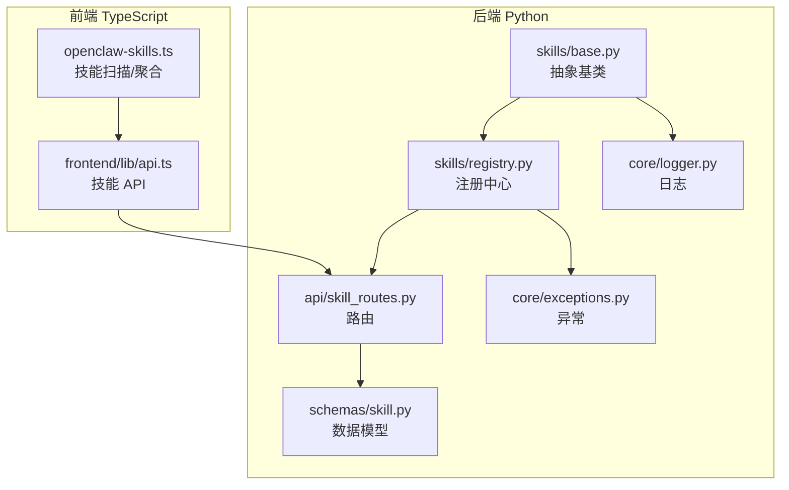
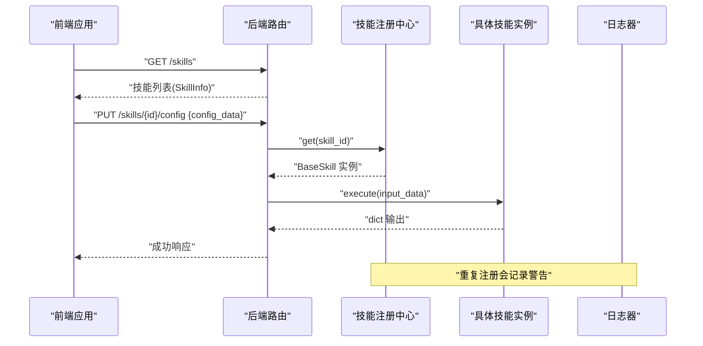
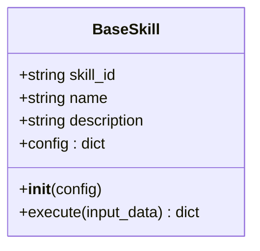
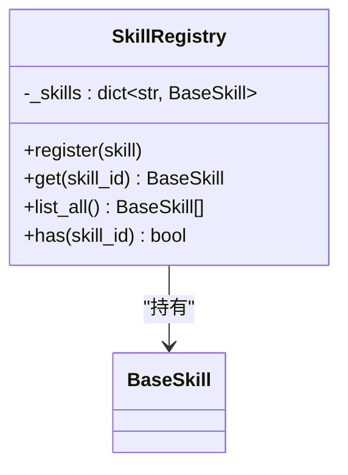
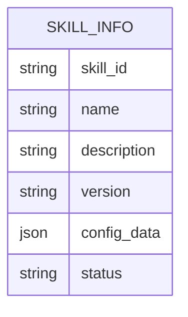
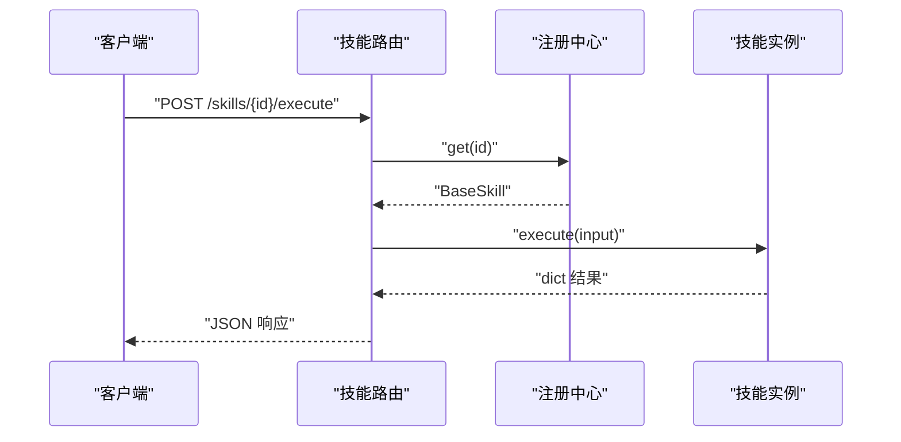
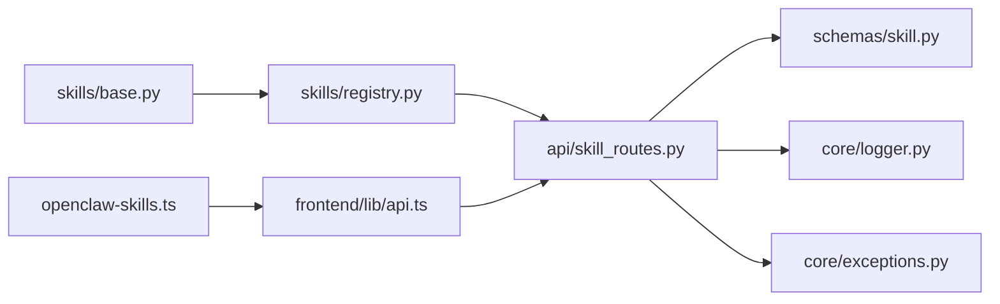

# 技能基类设计

<cite>
**本文引用的文件**
- [backend/app/skills/base.py](file://backend/app/skills/base.py)
- [backend/app/schemas/skill.py](file://backend/app/schemas/skill.py)
- [backend/app/skills/registry.py](file://backend/app/skills/registry.py)
- [backend/app/api/skill_routes.py](file://backend/app/api/skill_routes.py)
- [backend/app/core/logger.py](file://backend/app/core/logger.py)
- [backend/app/core/exceptions.py](file://backend/app/core/exceptions.py)
- [ARCHITECTURE.md](file://ARCHITECTURE.md)
- [frontend/lib/api.ts](file://frontend/lib/api.ts)
- [OpenClaw-bot-review-main/lib/openclaw-skills.ts](file://OpenClaw-bot-review-main/lib/openclaw-skills.ts)
</cite>

## 目录
1. [引言](#引言)
2. [项目结构](#项目结构)
3. [核心组件](#核心组件)
4. [架构总览](#架构总览)
5. [详细组件分析](#详细组件分析)
6. [依赖分析](#依赖分析)
7. [性能考量](#性能考量)
8. [故障排查指南](#故障排查指南)
9. [结论](#结论)
10. [附录：最佳实践与示例](#附录最佳实践与示例)

## 引言
本文件系统化梳理“技能基类”设计，围绕抽象基类 BaseSkill 的设计理念、接口规范、执行协议、配置管理、生命周期与错误处理、日志记录以及最佳实践展开，并结合前端与后端实现给出可操作的参考路径。读者无需深入源码即可理解技能体系的职责边界与扩展方式。

## 项目结构
技能相关能力横跨后端 Python 与前端 TypeScript 两部分：
- 后端 Python
  - 抽象基类与注册中心：backend/app/skills/base.py、backend/app/skills/registry.py
  - 接口与异常：backend/app/api/skill_routes.py、backend/app/core/exceptions.py、backend/app/core/logger.py
  - 数据模型：backend/app/schemas/skill.py
- 前端 TypeScript
  - 技能清单与配置更新 API：frontend/lib/api.ts
  - 技能元数据扫描与聚合：OpenClaw-bot-review-main/lib/openclaw-skills.ts

图表来源
- [backend/app/skills/base.py:1-37](file://backend/app/skills/base.py#L1-L37)
- [backend/app/skills/registry.py:1-37](file://backend/app/skills/registry.py#L1-L37)
- [backend/app/api/skill_routes.py:1-50](file://backend/app/api/skill_routes.py#L1-L50)
- [backend/app/schemas/skill.py:1-22](file://backend/app/schemas/skill.py#L1-L22)
- [backend/app/core/logger.py:1-200](file://backend/app/core/logger.py#L1-L200)
- [backend/app/core/exceptions.py:1-200](file://backend/app/core/exceptions.py#L1-L200)
- [frontend/lib/api.ts:86-109](file://frontend/lib/api.ts#L86-L109)
- [OpenClaw-bot-review-main/lib/openclaw-skills.ts:111-162](file://OpenClaw-bot-review-main/lib/openclaw-skills.ts#L111-L162)

章节来源
- [backend/app/skills/base.py:1-37](file://backend/app/skills/base.py#L1-L37)
- [backend/app/skills/registry.py:1-37](file://backend/app/skills/registry.py#L1-L37)
- [backend/app/api/skill_routes.py:1-50](file://backend/app/api/skill_routes.py#L1-L50)
- [backend/app/schemas/skill.py:1-22](file://backend/app/schemas/skill.py#L1-L22)
- [frontend/lib/api.ts:86-109](file://frontend/lib/api.ts#L86-L109)
- [OpenClaw-bot-review-main/lib/openclaw-skills.ts:111-162](file://OpenClaw-bot-review-main/lib/openclaw-skills.ts#L111-L162)

## 核心组件
- 抽象基类 BaseSkill
  - 定义技能的标识、名称、描述等元信息字段
  - 提供构造函数接收 config 参数并保存为实例字典
  - 规定异步 execute 方法签名，输入输出均为结构化字典
- 技能注册中心 SkillRegistry
  - 维护 skill_id 到实例的映射
  - 提供注册、查询、枚举、存在性判断等能力
  - 对重复注册进行告警，对缺失 ID 抛出异常
- 数据模型与 API
  - 后端使用 Pydantic 模型描述技能信息与配置更新请求
  - 前端提供列表与更新配置的 API 封装
- 日志与异常
  - 使用统一日志器记录注册与警告事件
  - 缺失技能时抛出自定义异常

章节来源
- [backend/app/skills/base.py:16-37](file://backend/app/skills/base.py#L16-L37)
- [backend/app/skills/registry.py:10-37](file://backend/app/skills/registry.py#L10-L37)
- [backend/app/schemas/skill.py:6-22](file://backend/app/schemas/skill.py#L6-L22)
- [backend/app/core/logger.py:1-200](file://backend/app/core/logger.py#L1-L200)
- [backend/app/core/exceptions.py:1-200](file://backend/app/core/exceptions.py#L1-L200)

## 架构总览
技能体系遵循“无状态原子能力”的定位：Agent 调用技能完成具体工具型任务，不参与编排或状态持久化。下图展示从前端到后端的调用链路与关键对象交互。

图表来源
- [backend/app/api/skill_routes.py:1-50](file://backend/app/api/skill_routes.py#L1-L50)
- [backend/app/skills/registry.py:22-26](file://backend/app/skills/registry.py#L22-L26)
- [backend/app/skills/base.py:26-36](file://backend/app/skills/base.py#L26-L36)
- [backend/app/core/logger.py:1-200](file://backend/app/core/logger.py#L1-L200)

## 详细组件分析

### 抽象基类 BaseSkill
- 设计理念
  - 明确技能是“工具型能力”，不参与编排，输出稳定可复用
  - 通过 skill_id、name、description 提供标准化元信息
- 接口规范
  - 构造函数接收 config 字典，作为技能运行期配置的注入点
  - execute 为异步方法，输入/输出均为结构化字典，便于跨层序列化与契约约束
- 命名约定
  - skill_id 建议全局唯一且稳定，用于注册中心索引与路由参数
  - name 与 description 用于 UI 展示与文档生成
- 执行协议
  - 输入参数格式：dict（建议在上层通过 Pydantic 模型校验）
  - 返回值结构：dict（建议在上层通过 Pydantic 模型校验）
  - 异步执行模式：采用 async/await，适合 IO 密集型工具调用
- 生命周期与资源管理
  - 基类不内置生命周期钩子；如需资源初始化/释放，应在子类中显式实现
- 错误处理与日志
  - 基类不直接抛错；建议在子类内部捕获异常并记录日志
  - 可通过统一日志器记录关键事件与错误上下文

图表来源
- [backend/app/skills/base.py:16-37](file://backend/app/skills/base.py#L16-L37)

章节来源
- [backend/app/skills/base.py:16-37](file://backend/app/skills/base.py#L16-L37)
- [ARCHITECTURE.md:652-666](file://ARCHITECTURE.md#L652-L666)

### 技能注册中心 SkillRegistry
- 职责
  - 维护技能实例映射，支持注册、查询、列举与存在性判断
- 并发与一致性
  - 当前实现为内存字典，适合单进程场景；多进程部署需引入分布式注册或进程间同步
- 错误处理
  - 查询不存在的 skill_id 时抛出自定义异常
  - 重复注册记录警告日志，避免覆盖已有实例

图表来源
- [backend/app/skills/registry.py:10-37](file://backend/app/skills/registry.py#L10-L37)

章节来源
- [backend/app/skills/registry.py:10-37](file://backend/app/skills/registry.py#L10-L37)
- [backend/app/core/exceptions.py:1-200](file://backend/app/core/exceptions.py#L1-L200)
- [backend/app/core/logger.py:1-200](file://backend/app/core/logger.py#L1-L200)

### 数据模型与 API
- 后端模型
  - SkillInfo：封装技能标识、名称、描述、版本、配置与状态
  - SkillListResponse：技能列表响应
  - SkillConfigUpdateRequest：配置更新请求体
- 前端 API
  - listSkills：获取技能列表
  - updateSkillConfig：按 skillId 更新配置

图表来源
- [backend/app/schemas/skill.py:6-22](file://backend/app/schemas/skill.py#L6-L22)

章节来源
- [backend/app/schemas/skill.py:6-22](file://backend/app/schemas/skill.py#L6-L22)
- [frontend/lib/api.ts:86-109](file://frontend/lib/api.ts#L86-L109)

### 执行流程与路由集成
- 路由层负责解析请求、调用注册中心获取技能实例、调用 execute 并返回结果
- 建议在路由层对输入/输出进行 Pydantic 校验，确保契约一致

图表来源
- [backend/app/api/skill_routes.py:1-50](file://backend/app/api/skill_routes.py#L1-L50)
- [backend/app/skills/registry.py:22-26](file://backend/app/skills/registry.py#L22-L26)
- [backend/app/skills/base.py:26-36](file://backend/app/skills/base.py#L26-L36)

章节来源
- [backend/app/api/skill_routes.py:1-50](file://backend/app/api/skill_routes.py#L1-L50)

### 前端技能扫描与聚合
- openclaw-skills.ts 提供技能清单扫描、前端展示所需元数据与使用统计
- 与后端的技能信息模型保持字段对齐，便于统一展示

章节来源
- [OpenClaw-bot-review-main/lib/openclaw-skills.ts:111-162](file://OpenClaw-bot-review-main/lib/openclaw-skills.ts#L111-L162)

## 依赖分析
- 组件耦合
  - SkillRegistry 依赖 BaseSkill 与异常模块
  - 路由层依赖注册中心与数据模型
  - 前端依赖后端 API 与类型定义
- 外部依赖
  - Pydantic 用于数据校验与序列化
  - Python 异步运行时用于 execute 的并发执行

图表来源
- [backend/app/skills/base.py:16-37](file://backend/app/skills/base.py#L16-L37)
- [backend/app/skills/registry.py:10-37](file://backend/app/skills/registry.py#L10-L37)
- [backend/app/api/skill_routes.py:1-50](file://backend/app/api/skill_routes.py#L1-L50)
- [backend/app/schemas/skill.py:6-22](file://backend/app/schemas/skill.py#L6-L22)
- [backend/app/core/logger.py:1-200](file://backend/app/core/logger.py#L1-L200)
- [backend/app/core/exceptions.py:1-200](file://backend/app/core/exceptions.py#L1-L200)
- [frontend/lib/api.ts:86-109](file://frontend/lib/api.ts#L86-L109)
- [OpenClaw-bot-review-main/lib/openclaw-skills.ts:111-162](file://OpenClaw-bot-review-main/lib/openclaw-skills.ts#L111-L162)

章节来源
- [backend/app/skills/base.py:16-37](file://backend/app/skills/base.py#L16-L37)
- [backend/app/skills/registry.py:10-37](file://backend/app/skills/registry.py#L10-L37)
- [backend/app/api/skill_routes.py:1-50](file://backend/app/api/skill_routes.py#L1-L50)
- [backend/app/schemas/skill.py:6-22](file://backend/app/schemas/skill.py#L6-L22)
- [frontend/lib/api.ts:86-109](file://frontend/lib/api.ts#L86-L109)
- [OpenClaw-bot-review-main/lib/openclaw-skills.ts:111-162](file://OpenClaw-bot-review-main/lib/openclaw-skills.ts#L111-L162)

## 性能考量
- 异步执行
  - execute 采用异步模式，适合网络请求、文件读写等 IO 密集场景
- 配置缓存
  - 在子类中对 config 进行必要缓存，避免重复解析与网络请求
- 日志开销
  - 控制高频日志输出，仅在关键路径记录上下文信息
- 并发与限流
  - 对外部服务调用增加超时与重试策略，防止阻塞 execute

## 故障排查指南
- 常见问题
  - 未注册技能：调用 get(skill_id) 会抛出异常
  - 重复注册：控制台出现“已注册”警告
  - 执行失败：检查子类 execute 的异常捕获与日志记录
- 定位手段
  - 查看后端日志中的注册与警告事件
  - 使用前端 API 获取技能列表与配置，确认状态与配置是否正确
- 修复建议
  - 确保 skill_id 唯一且稳定
  - 在子类中完善输入校验与异常分支
  - 对外部依赖添加超时与降级策略

章节来源
- [backend/app/skills/registry.py:16-26](file://backend/app/skills/registry.py#L16-L26)
- [backend/app/core/exceptions.py:1-200](file://backend/app/core/exceptions.py#L1-L200)
- [backend/app/core/logger.py:1-200](file://backend/app/core/logger.py#L1-L200)
- [frontend/lib/api.ts:86-109](file://frontend/lib/api.ts#L86-L109)

## 结论
技能基类以“无状态、工具型、稳定输出”为核心设计原则，通过清晰的接口与注册中心实现解耦与可扩展。配合前后端一致的数据模型与 API，能够快速构建可维护的技能生态。建议在子类中强化输入输出校验、异常处理与日志记录，并结合异步执行优化 IO 密集型任务的吞吐。

## 附录：最佳实践与示例

### 继承规范与方法重写要求
- 必填
  - 设置 skill_id、name、description
  - 实现 execute(input_data) -> dict
- 建议
  - 在 __init__ 中对 config 进行校验与默认值合并
  - 在 execute 中对 input_data 使用 Pydantic 模型校验
  - 记录关键执行日志，包含输入摘要与耗时

章节来源
- [backend/app/skills/base.py:19-36](file://backend/app/skills/base.py#L19-L36)
- [backend/app/schemas/skill.py:6-22](file://backend/app/schemas/skill.py#L6-L22)

### 配置管理机制
- config 参数传递
  - 通过构造函数注入，保存为实例字典
  - 前端通过 updateSkillConfig 接口更新配置
- 配置验证
  - 建议在子类中对 config 字典进行键值校验与类型转换
  - 可结合 Pydantic 模型定义配置 Schema

章节来源
- [backend/app/skills/base.py:23-24](file://backend/app/skills/base.py#L23-L24)
- [frontend/lib/api.ts:101-109](file://frontend/lib/api.ts#L101-L109)

### 生命周期与错误处理
- 生命周期
  - 基类无内置钩子；如需初始化/清理，在子类中显式实现
- 错误处理
  - 子类内部捕获异常并记录日志
  - 对外部依赖设置超时与重试

章节来源
- [backend/app/skills/base.py:26-36](file://backend/app/skills/base.py#L26-L36)
- [backend/app/core/logger.py:1-200](file://backend/app/core/logger.py#L1-L200)

### 性能考虑
- 使用异步 execute 适配 IO 密集任务
- 对外部服务调用增加超时与重试
- 控制日志频率，保留关键路径上下文

### 示例：如何正确实现自定义技能
- 步骤
  - 定义子类并设置 skill_id、name、description
  - 在 __init__ 中处理 config，进行必要的校验与合并
  - 在 execute 中对输入进行校验，执行业务逻辑，返回结构化字典
  - 在路由层对输入/输出进行 Pydantic 校验
  - 通过注册中心注册实例并在前端查看与配置

章节来源
- [backend/app/skills/base.py:19-36](file://backend/app/skills/base.py#L19-L36)
- [backend/app/skills/registry.py:16-20](file://backend/app/skills/registry.py#L16-L20)
- [backend/app/api/skill_routes.py:1-50](file://backend/app/api/skill_routes.py#L1-L50)
- [frontend/lib/api.ts:86-109](file://frontend/lib/api.ts#L86-L109)