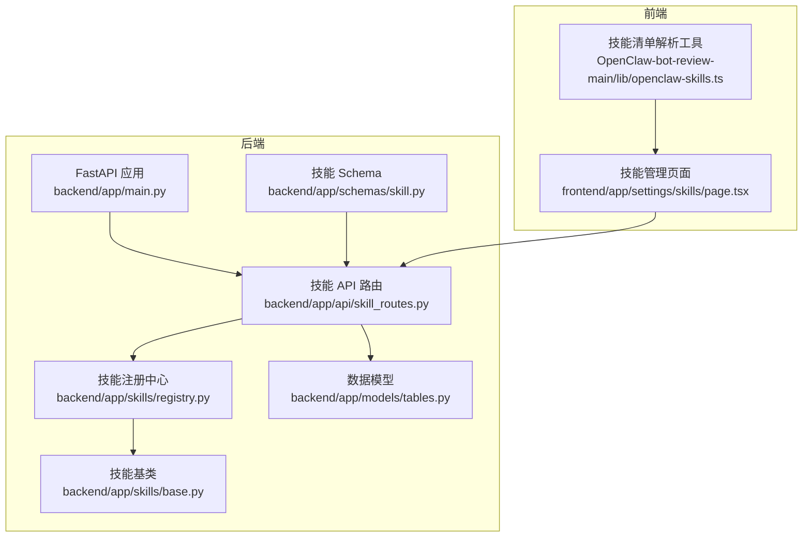
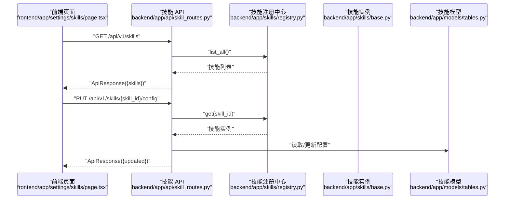
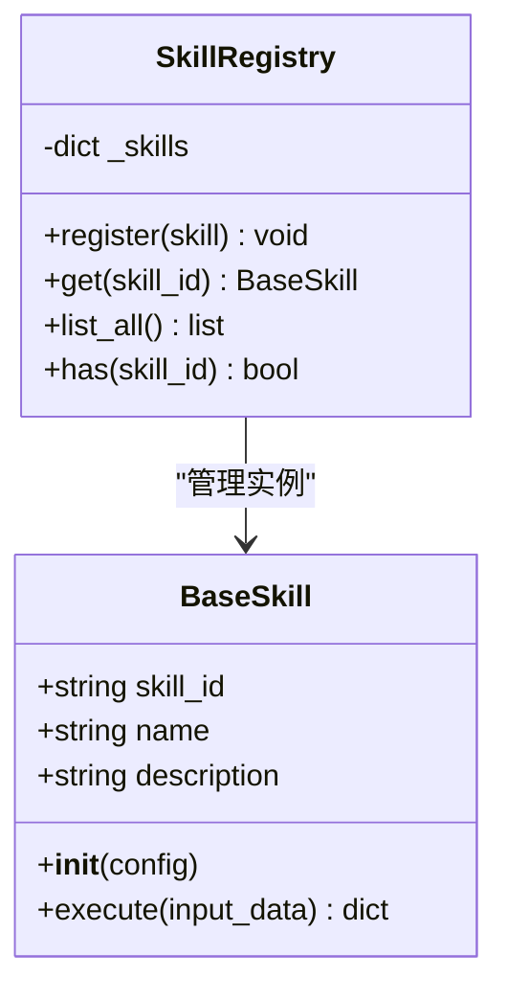
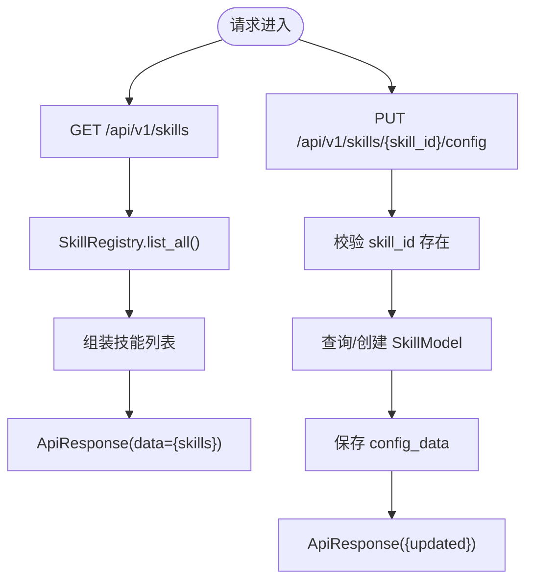
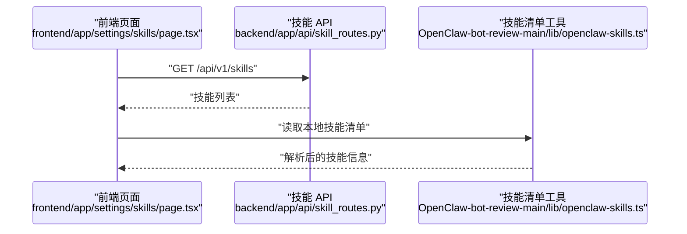
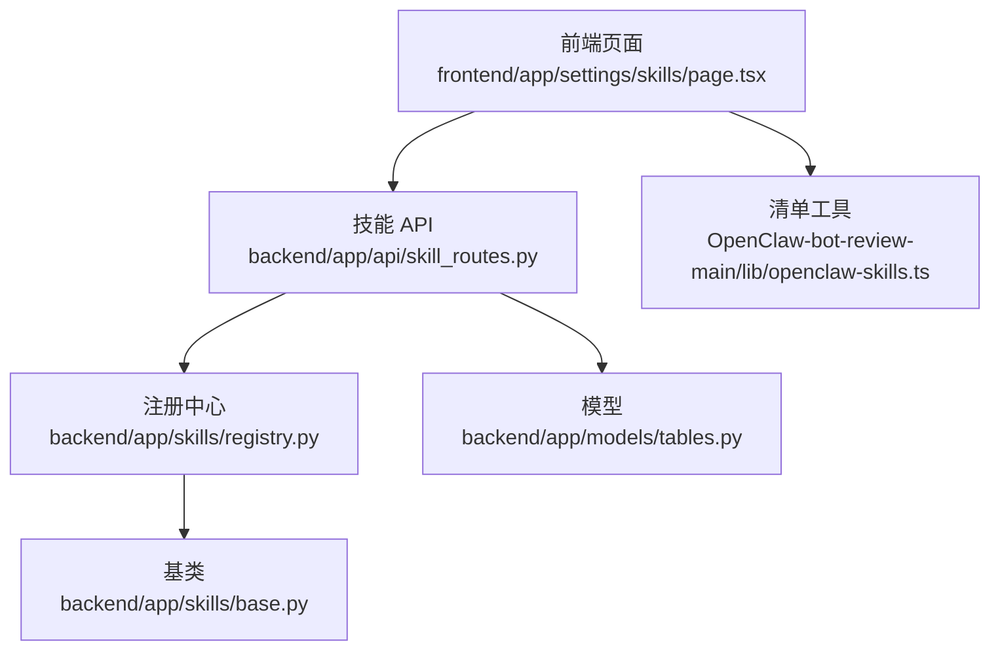

# 技能开发指南

<cite>
**本文引用的文件**
- [backend/app/skills/base.py](file://backend/app/skills/base.py)
- [backend/app/skills/registry.py](file://backend/app/skills/registry.py)
- [backend/app/api/skill_routes.py](file://backend/app/api/skill_routes.py)
- [backend/app/models/tables.py](file://backend/app/models/tables.py)
- [backend/app/main.py](file://backend/app/main.py)
- [backend/app/schemas/skill.py](file://backend/app/schemas/skill.py)
- [backend/tests/test_workspace.py](file://backend/tests/test_workspace.py)
- [OpenClaw-bot-review-main/lib/openclaw-skills.ts](file://OpenClaw-bot-review-main/lib/openclaw-skills.ts)
- [frontend/app/settings/skills/page.tsx](file://frontend/app/settings/skills/page.tsx)
- [ARCHITECTURE.md](file://ARCHITECTURE.md)
</cite>

## 目录
1. [引言](#引言)
2. [项目结构](#项目结构)
3. [核心组件](#核心组件)
4. [架构总览](#架构总览)
5. [详细组件分析](#详细组件分析)
6. [依赖分析](#依赖分析)
7. [性能考量](#性能考量)
8. [故障排查指南](#故障排查指南)
9. [结论](#结论)
10. [附录](#附录)

## 引言
本指南面向新技能开发者，提供从需求分析、设计规划、实现编码到测试验证的完整流程，涵盖技能配置文件的编写规范、字段定义与验证规则，以及最佳实践（代码结构、错误处理、性能优化、安全考虑）。文档同时给出简单技能与复杂技能的实现思路、测试方法（单元测试、集成测试、性能测试）、调试技巧、常见问题与性能调优建议，以及技能发布与维护的指导原则。

## 项目结构
本仓库包含后端 FastAPI 服务、前端 Next.js 应用、技能清单解析工具与架构文档。与技能开发直接相关的关键目录与文件如下：
- 后端
  - 技能基类与注册中心：backend/app/skills/base.py、backend/app/skills/registry.py
  - 技能 API 路由：backend/app/api/skill_routes.py
  - 数据模型（技能持久化）：backend/app/models/tables.py
  - 应用入口与全局异常处理：backend/app/main.py
  - 技能相关 Pydantic Schema：backend/app/schemas/skill.py
  - 测试样例（工作空间）：backend/tests/test_workspace.py
- 前端
  - 技能列表页面：frontend/app/settings/skills/page.tsx
  - 技能清单解析工具（TypeScript）：OpenClaw-bot-review-main/lib/openclaw-skills.ts
- 架构文档
  - ARCHITECTURE.md：系统架构、设计理念、Agent/Skill 区分、工作流与配置设计等

**图表来源**
- [backend/app/main.py:1-142](file://backend/app/main.py#L1-L142)
- [backend/app/skills/base.py:1-37](file://backend/app/skills/base.py#L1-L37)
- [backend/app/skills/registry.py:1-37](file://backend/app/skills/registry.py#L1-L37)
- [backend/app/api/skill_routes.py:1-61](file://backend/app/api/skill_routes.py#L1-L61)
- [backend/app/models/tables.py:183-199](file://backend/app/models/tables.py#L183-L199)
- [backend/app/schemas/skill.py:1-22](file://backend/app/schemas/skill.py#L1-L22)
- [frontend/app/settings/skills/page.tsx:1-81](file://frontend/app/settings/skills/page.tsx#L1-L81)
- [OpenClaw-bot-review-main/lib/openclaw-skills.ts:1-162](file://OpenClaw-bot-review-main/lib/openclaw-skills.ts#L1-L162)

**章节来源**
- [backend/app/main.py:1-142](file://backend/app/main.py#L1-L142)
- [ARCHITECTURE.md:1-2095](file://ARCHITECTURE.md#L1-L2095)

## 核心组件
- 技能基类 BaseSkill：定义技能的标准接口与抽象方法，约束技能的输入输出与执行行为。
- 技能注册中心 SkillRegistry：集中管理技能实例，提供注册、查询、列举与存在性判断。
- 技能 API 路由：提供技能列表与配置更新接口，连接前端与数据库。
- 技能数据模型：SkillModel 用于持久化技能的标识、名称、描述、版本、模块路径、输入/输出 Schema、配置与状态。
- 技能 Schema：SkillInfo、SkillListResponse、SkillConfigUpdateRequest 用于 API 请求/响应的数据结构与校验。
- 前端技能页面：展示已注册技能、状态与配置，调用后端技能 API。
- 技能清单解析工具：解析本地技能清单（Markdown 前言块），统计使用情况与来源。

**章节来源**
- [backend/app/skills/base.py:16-37](file://backend/app/skills/base.py#L16-L37)
- [backend/app/skills/registry.py:10-37](file://backend/app/skills/registry.py#L10-L37)
- [backend/app/api/skill_routes.py:17-61](file://backend/app/api/skill_routes.py#L17-L61)
- [backend/app/models/tables.py:183-199](file://backend/app/models/tables.py#L183-L199)
- [backend/app/schemas/skill.py:6-22](file://backend/app/schemas/skill.py#L6-L22)
- [frontend/app/settings/skills/page.tsx:8-81](file://frontend/app/settings/skills/page.tsx#L8-L81)
- [OpenClaw-bot-review-main/lib/openclaw-skills.ts:49-162](file://OpenClaw-bot-review-main/lib/openclaw-skills.ts#L49-L162)

## 架构总览
技能在系统中的定位与调用关系如下：
- 设计理念强调“Skills 是原子能力”，Agent 通过注册中心获取技能实例并调用其 execute 方法。
- 技能配置通过数据库持久化，前端通过 API 更新配置。
- 后端应用在启动时注册内置 Agent，技能通过 manifest 与注册中心管理。

**图表来源**
- [frontend/app/settings/skills/page.tsx:12-24](file://frontend/app/settings/skills/page.tsx#L12-L24)
- [backend/app/api/skill_routes.py:17-61](file://backend/app/api/skill_routes.py#L17-L61)
- [backend/app/skills/registry.py:22-26](file://backend/app/skills/registry.py#L22-L26)
- [backend/app/skills/base.py:26-36](file://backend/app/skills/base.py#L26-L36)
- [backend/app/models/tables.py:183-199](file://backend/app/models/tables.py#L183-L199)

**章节来源**
- [ARCHITECTURE.md:635-759](file://ARCHITECTURE.md#L635-L759)
- [backend/app/api/skill_routes.py:17-61](file://backend/app/api/skill_routes.py#L17-L61)

## 详细组件分析

### 技能基类与注册中心
- BaseSkill
  - 职责：定义技能的标识、名称、描述与异步 execute 接口。
  - 输入输出：execute(input_data: dict) -> dict，返回结构化输出。
  - 设计要点：技能应无状态、可复用、输出稳定。
- SkillRegistry
  - 职责：注册、查询、列举技能；提供存在性判断；未找到时抛出统一异常。
  - 一致性：以 skill_id 为键，避免重复注册并记录日志。

**图表来源**
- [backend/app/skills/base.py:16-37](file://backend/app/skills/base.py#L16-L37)
- [backend/app/skills/registry.py:10-37](file://backend/app/skills/registry.py#L10-L37)

**章节来源**
- [backend/app/skills/base.py:16-37](file://backend/app/skills/base.py#L16-L37)
- [backend/app/skills/registry.py:10-37](file://backend/app/skills/registry.py#L10-L37)

### 技能 API 路由与数据模型
- 路由
  - GET /api/v1/skills：列出已注册技能，组装为 ApiResponse。
  - PUT /api/v1/skills/{skill_id}/config：更新技能配置，若数据库中不存在则创建记录。
- 数据模型
  - SkillModel：持久化技能的 skill_id、name、description、version、module_path、input_schema、output_schema、config_data、status 等字段。
- Schema
  - SkillInfo：技能信息结构，包含技能标识、名称、描述、版本、配置、状态。
  - SkillListResponse：技能列表响应结构。
  - SkillConfigUpdateRequest：更新技能配置的请求体结构。

**图表来源**
- [backend/app/api/skill_routes.py:17-61](file://backend/app/api/skill_routes.py#L17-L61)
- [backend/app/skills/registry.py:22-26](file://backend/app/skills/registry.py#L22-L26)
- [backend/app/models/tables.py:183-199](file://backend/app/models/tables.py#L183-L199)
- [backend/app/schemas/skill.py:6-22](file://backend/app/schemas/skill.py#L6-L22)

**章节来源**
- [backend/app/api/skill_routes.py:17-61](file://backend/app/api/skill_routes.py#L17-L61)
- [backend/app/models/tables.py:183-199](file://backend/app/models/tables.py#L183-L199)
- [backend/app/schemas/skill.py:6-22](file://backend/app/schemas/skill.py#L6-L22)

### 前端技能页面与清单解析
- 前端页面
  - 通过 listSkills() 获取技能列表并在页面展示，支持显示配置数据。
- 清单解析工具
  - 解析 Markdown 前言块（name/description/emoji），扫描内置/扩展/自定义技能目录，统计使用情况与来源，构建技能清单。

**图表来源**
- [frontend/app/settings/skills/page.tsx:12-24](file://frontend/app/settings/skills/page.tsx#L12-L24)
- [OpenClaw-bot-review-main/lib/openclaw-skills.ts:111-162](file://OpenClaw-bot-review-main/lib/openclaw-skills.ts#L111-L162)
- [backend/app/api/skill_routes.py:17-31](file://backend/app/api/skill_routes.py#L17-L31)

**章节来源**
- [frontend/app/settings/skills/page.tsx:8-81](file://frontend/app/settings/skills/page.tsx#L8-L81)
- [OpenClaw-bot-review-main/lib/openclaw-skills.ts:1-162](file://OpenClaw-bot-review-main/lib/openclaw-skills.ts#L1-L162)

### 概念总览
- Agent 与 Skill 的区别：Agent 有状态、做决策；Skill 无状态、纯执行。
- 技能应具备稳定的输入输出、可配置性与可复用性。
- 配置优先于代码：通过配置改变行为，减少硬编码。

[此图为概念性示意，无需图表来源]

**章节来源**
- [ARCHITECTURE.md:635-651](file://ARCHITECTURE.md#L635-L651)

## 依赖分析
- 组件耦合
  - API 路由依赖注册中心与数据库模型。
  - 注册中心依赖技能基类。
  - 前端页面依赖 API 路由与清单工具。
- 外部依赖
  - FastAPI、SQLAlchemy、Pydantic、前端 React/Next.js。
- 循环依赖
  - 当前结构清晰，未见循环导入。

**图表来源**
- [backend/app/api/skill_routes.py:1-61](file://backend/app/api/skill_routes.py#L1-L61)
- [backend/app/skills/registry.py:1-37](file://backend/app/skills/registry.py#L1-L37)
- [backend/app/skills/base.py:1-37](file://backend/app/skills/base.py#L1-L37)
- [backend/app/models/tables.py:183-199](file://backend/app/models/tables.py#L183-L199)
- [frontend/app/settings/skills/page.tsx:1-81](file://frontend/app/settings/skills/page.tsx#L1-L81)
- [OpenClaw-bot-review-main/lib/openclaw-skills.ts:1-162](file://OpenClaw-bot-review-main/lib/openclaw-skills.ts#L1-L162)

**章节来源**
- [backend/app/api/skill_routes.py:1-61](file://backend/app/api/skill_routes.py#L1-L61)
- [backend/app/skills/registry.py:1-37](file://backend/app/skills/registry.py#L1-L37)
- [backend/app/skills/base.py:1-37](file://backend/app/skills/base.py#L1-L37)
- [backend/app/models/tables.py:183-199](file://backend/app/models/tables.py#L183-L199)
- [frontend/app/settings/skills/page.tsx:1-81](file://frontend/app/settings/skills/page.tsx#L1-L81)
- [OpenClaw-bot-review-main/lib/openclaw-skills.ts:1-162](file://OpenClaw-bot-review-main/lib/openclaw-skills.ts#L1-L162)

## 性能考量
- 技能执行
  - 异步化：execute 为异步方法，便于并发与 I/O 密集场景。
  - 缓存：可在技能内对昂贵操作（如网络请求、大模型调用）设置缓存与 TTL。
- API 层
  - 减少不必要的序列化开销，保持响应体简洁。
  - 合理分页与过滤，避免一次性返回大量技能数据。
- 数据层
  - 针对 config_data 字段使用 JSON 类型，避免冗余拆分。
  - 为常用查询字段建立索引（如 skill_id）。
- 前端
  - 懒加载与虚拟滚动，提升大数据量下的渲染性能。
  - 合理使用缓存与去抖，减少重复请求。

[本节为通用性能建议，无需章节来源]

## 故障排查指南
- 技能未注册
  - 现象：调用技能时报未找到。
  - 排查：确认技能是否已注册；检查 skill_id 是否正确；查看日志。
  - 参考：[backend/app/skills/registry.py:22-26](file://backend/app/skills/registry.py#L22-L26)
- 配置更新失败
  - 现象：更新配置后未生效。
  - 排查：确认请求体结构与字段名；检查数据库记录是否存在；查看响应。
  - 参考：[backend/app/api/skill_routes.py:34-61](file://backend/app/api/skill_routes.py#L34-L61)
- 前端无法显示技能
  - 现象：技能列表为空或报错。
  - 排查：确认后端健康检查与路由是否可达；检查跨域配置；查看浏览器网络面板。
  - 参考：[backend/app/main.py:139-142](file://backend/app/main.py#L139-L142)，[frontend/app/settings/skills/page.tsx:12-24](file://frontend/app/settings/skills/page.tsx#L12-L24)
- 工作空间相关测试
  - 参考：[backend/tests/test_workspace.py:7-41](file://backend/tests/test_workspace.py#L7-L41)

**章节来源**
- [backend/app/skills/registry.py:22-26](file://backend/app/skills/registry.py#L22-L26)
- [backend/app/api/skill_routes.py:34-61](file://backend/app/api/skill_routes.py#L34-L61)
- [backend/app/main.py:139-142](file://backend/app/main.py#L139-L142)
- [frontend/app/settings/skills/page.tsx:12-24](file://frontend/app/settings/skills/page.tsx#L12-L24)
- [backend/tests/test_workspace.py:7-41](file://backend/tests/test_workspace.py#L7-L41)

## 结论
本指南从系统架构出发，明确了技能的职责边界与调用方式，给出了配置与实现的规范、测试与调试的方法，以及发布与维护的原则。遵循这些规范与最佳实践，可确保技能的稳定性、可维护性与可扩展性。

[本节为总结性内容，无需章节来源]

## 附录

### 技能开发流程
- 需求分析：明确技能目标、输入输出、依赖与边界。
- 设计规划：定义技能标识、名称、描述、版本；设计输入/输出 Schema；确定配置项。
- 实现编码：继承 BaseSkill，实现 execute；必要时在注册中心注册。
- 测试验证：编写单元测试与集成测试；验证配置更新与持久化。
- 发布与维护：通过 API 更新配置；持续监控与优化。

**章节来源**
- [backend/app/skills/base.py:16-37](file://backend/app/skills/base.py#L16-L37)
- [backend/app/skills/registry.py:16-21](file://backend/app/skills/registry.py#L16-L21)
- [backend/app/api/skill_routes.py:34-61](file://backend/app/api/skill_routes.py#L34-L61)

### 技能配置文件编写规范
- 字段定义
  - 必填：skill_id、name、version、module_path。
  - 常用：description、input_schema、output_schema、config_data、status。
- 验证规则
  - 使用 Pydantic Schema 校验请求体；后端路由对配置更新进行校验。
  - 前端展示时对配置数据进行格式化显示。
- 示例参考
  - 技能 Schema 定义与 API 请求体结构。

**章节来源**
- [backend/app/models/tables.py:183-199](file://backend/app/models/tables.py#L183-L199)
- [backend/app/schemas/skill.py:19-22](file://backend/app/schemas/skill.py#L19-L22)
- [frontend/app/settings/skills/page.tsx:68-72](file://frontend/app/settings/skills/page.tsx#L68-L72)

### 开发示例
- 简单技能
  - 场景：无外部依赖的纯计算型技能。
  - 要点：定义清晰的输入输出 Schema；在 execute 中完成计算并返回结构化结果。
- 复杂技能
  - 场景：需要网络请求、缓存、重试与降级的技能。
  - 要点：在技能内实现缓存与超时控制；对异常进行捕获与降级；记录必要的日志与指标。

**章节来源**
- [backend/app/skills/base.py:26-36](file://backend/app/skills/base.py#L26-L36)
- [ARCHITECTURE.md:635-759](file://ARCHITECTURE.md#L635-L759)

### 测试方法
- 单元测试
  - 针对 execute 的输入输出进行断言；覆盖正常与异常分支。
- 集成测试
  - 调用 API 路由，验证技能列表与配置更新流程。
- 性能测试
  - 对 I/O 密集型技能进行并发压测；评估缓存命中率与延迟。

**章节来源**
- [backend/tests/test_workspace.py:7-41](file://backend/tests/test_workspace.py#L7-L41)
- [backend/app/api/skill_routes.py:17-61](file://backend/app/api/skill_routes.py#L17-L61)

### 调试技巧
- 后端
  - 使用 trace_id 中间件定位请求链路；查看结构化日志；利用全局异常处理器统一返回。
- 前端
  - 使用浏览器开发者工具观察网络请求与响应；检查跨域与权限问题。
- 清单解析
  - 使用清单工具读取本地技能文件，核对 frontmatter 与路径。

**章节来源**
- [backend/app/main.py:77-130](file://backend/app/main.py#L77-L130)
- [OpenClaw-bot-review-main/lib/openclaw-skills.ts:30-47](file://OpenClaw-bot-review-main/lib/openclaw-skills.ts#L30-L47)

### 安全与最佳实践
- 安全
  - 限制前端跨域范围；对敏感配置进行脱敏；避免在日志中打印敏感信息。
- 最佳实践
  - 代码结构：模块化、职责单一；错误处理：明确异常类型与降级策略；性能优化：缓存、并发与资源池；配置优先于代码：通过配置调整行为。

**章节来源**
- [backend/app/main.py:67-84](file://backend/app/main.py#L67-L84)
- [ARCHITECTURE.md:92-123](file://ARCHITECTURE.md#L92-L123)