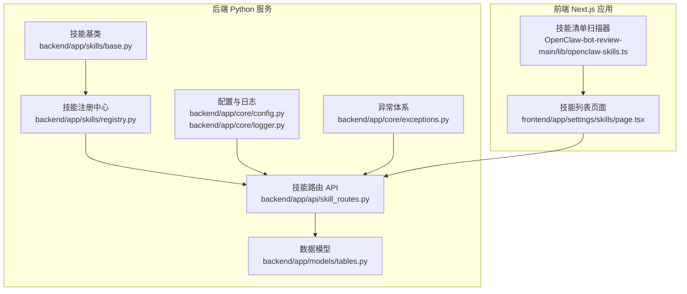
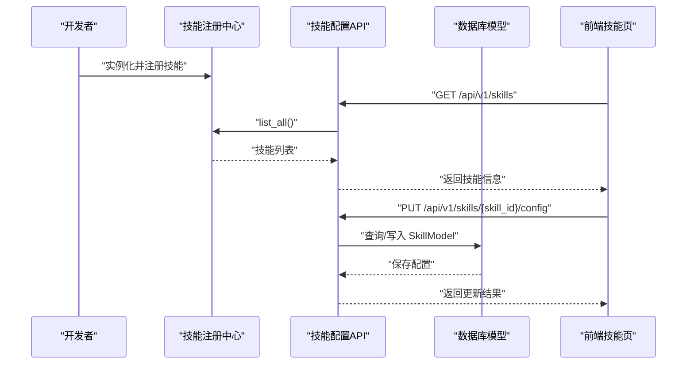
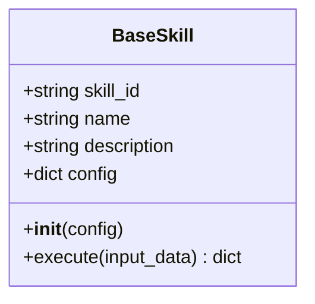
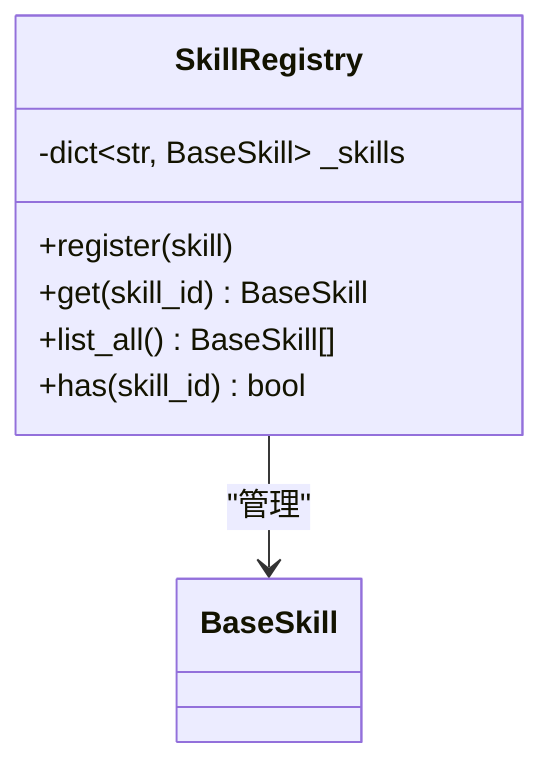
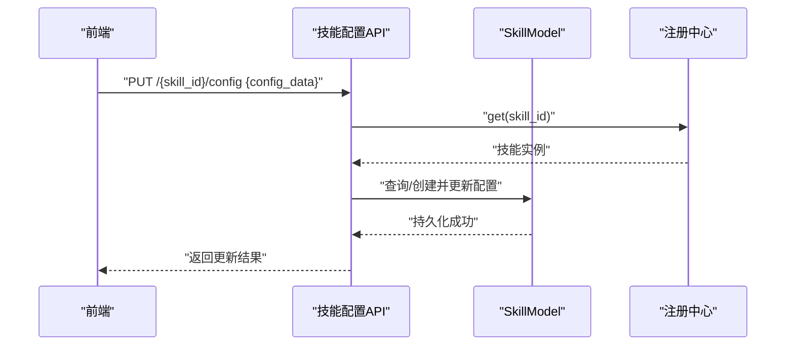
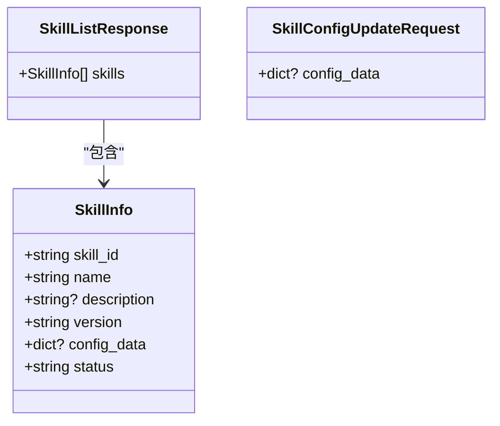
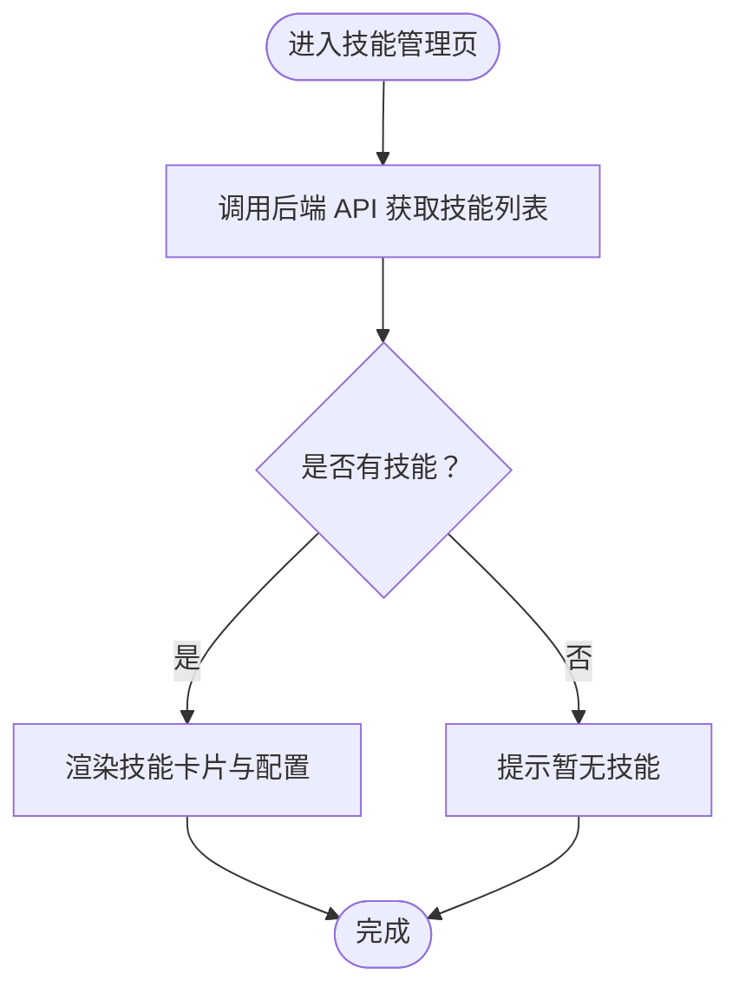
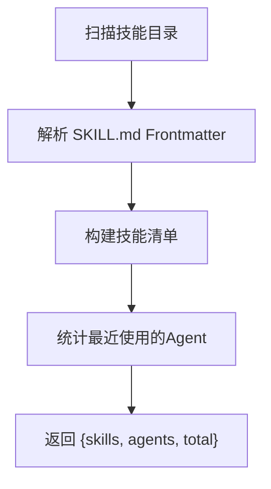
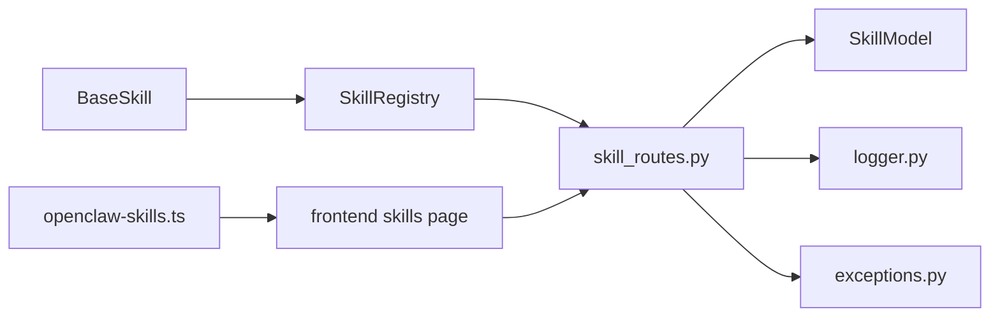

# 技能开发指南

<cite>
**本文档引用的文件**
- [backend/app/skills/base.py](file://backend/app/skills/base.py)
- [backend/app/skills/registry.py](file://backend/app/skills/registry.py)
- [backend/app/schemas/skill.py](file://backend/app/schemas/skill.py)
- [backend/app/api/skill_routes.py](file://backend/app/api/skill_routes.py)
- [backend/app/models/tables.py](file://backend/app/models/tables.py)
- [backend/app/core/config.py](file://backend/app/core/config.py)
- [backend/app/core/logger.py](file://backend/app/core/logger.py)
- [backend/app/core/exceptions.py](file://backend/app/core/exceptions.py)
- [frontend/app/settings/skills/page.tsx](file://frontend/app/settings/skills/page.tsx)
- [OpenClaw-bot-review-main/lib/openclaw-skills.ts](file://OpenClaw-bot-review-main/lib/openclaw-skills.ts)
</cite>

## 目录
1. [简介](#简介)
2. [项目结构](#项目结构)
3. [核心组件](#核心组件)
4. [架构总览](#架构总览)
5. [详细组件分析](#详细组件分析)
6. [依赖关系分析](#依赖关系分析)
7. [性能考虑](#性能考虑)
8. [故障排查指南](#故障排查指南)
9. [结论](#结论)
10. [附录](#附录)

## 简介
本指南面向开发者，提供在HotClaw平台中从零开始创建自定义Skill的完整流程与最佳实践。内容涵盖：
- 继承BaseSkill基类、实现execute方法与输入输出Schema设计
- 技能配置管理（参数定义、默认值、校验规则、持久化与热更新）
- 技能注册机制与动态加载路径
- 测试策略（单元、集成、性能）
- 错误处理、日志记录与异常恢复
- 调试工具使用与常见问题解决
- 面向新手的完整开发教程与代码模板指引

## 项目结构
HotClaw采用前后端分离架构，技能系统主要由后端Python服务提供运行时能力，前端Next.js应用提供可视化管理界面。

```mermaid
graph TB
subgraph "后端 Python 服务"
A["技能基类<br/>backend/app/skills/base.py"]
B["技能注册中心<br/>backend/app/skills/registry.py"]
C["技能路由 API<br/>backend/app/api/skill_routes.py"]
D["数据模型<br/>backend/app/models/tables.py"]
E["配置与日志<br/>backend/app/core/config.py<br/>backend/app/core/logger.py"]
F["异常体系<br/>backend/app/core/exceptions.py"]
end
subgraph "前端 Next.js 应用"
G["技能列表页面<br/>frontend/app/settings/skills/page.tsx"]
H["技能清单扫描器<br/>OpenClaw-bot-review-main/lib/openclaw-skills.ts"]
end
A --> B
B --> C
C --> D
E --> C
F --> C
G --> C
H --> G
```

图表来源
- [backend/app/skills/base.py:1-37](file://backend/app/skills/base.py#L1-L37)
- [backend/app/skills/registry.py:1-37](file://backend/app/skills/registry.py#L1-L37)
- [backend/app/api/skill_routes.py:1-61](file://backend/app/api/skill_routes.py#L1-L61)
- [backend/app/models/tables.py:183-200](file://backend/app/models/tables.py#L183-L200)
- [backend/app/core/config.py:1-99](file://backend/app/core/config.py#L1-L99)
- [backend/app/core/logger.py:1-36](file://backend/app/core/logger.py#L1-L36)
- [backend/app/core/exceptions.py:1-125](file://backend/app/core/exceptions.py#L1-L125)
- [frontend/app/settings/skills/page.tsx:1-81](file://frontend/app/settings/skills/page.tsx#L1-L81)
- [OpenClaw-bot-review-main/lib/openclaw-skills.ts:1-162](file://OpenClaw-bot-review-main/lib/openclaw-skills.ts#L1-L162)

章节来源
- [backend/app/skills/base.py:1-37](file://backend/app/skills/base.py#L1-L37)
- [backend/app/skills/registry.py:1-37](file://backend/app/skills/registry.py#L1-L37)
- [backend/app/api/skill_routes.py:1-61](file://backend/app/api/skill_routes.py#L1-L61)
- [backend/app/models/tables.py:183-200](file://backend/app/models/tables.py#L183-L200)
- [frontend/app/settings/skills/page.tsx:1-81](file://frontend/app/settings/skills/page.tsx#L1-L81)
- [OpenClaw-bot-review-main/lib/openclaw-skills.ts:1-162](file://OpenClaw-bot-review-main/lib/openclaw-skills.ts#L1-L162)

## 核心组件
- 技能基类：定义统一接口与生命周期，约束所有技能必须实现异步执行方法与稳定的输入输出格式。
- 注册中心：集中管理技能实例，提供注册、查询、枚举与存在性检查。
- 路由与模型：提供技能配置的查询与更新API，并将配置持久化到数据库。
- 前端展示：列出已注册技能及其配置，便于运维与调试。
- 日志与异常：统一的日志结构与异常体系，便于追踪与排错。

章节来源
- [backend/app/skills/base.py:16-37](file://backend/app/skills/base.py#L16-L37)
- [backend/app/skills/registry.py:10-37](file://backend/app/skills/registry.py#L10-L37)
- [backend/app/api/skill_routes.py:17-61](file://backend/app/api/skill_routes.py#L17-L61)
- [backend/app/models/tables.py:183-200](file://backend/app/models/tables.py#L183-L200)
- [frontend/app/settings/skills/page.tsx:8-81](file://frontend/app/settings/skills/page.tsx#L8-L81)
- [backend/app/core/logger.py:8-36](file://backend/app/core/logger.py#L8-L36)
- [backend/app/core/exceptions.py:38-43](file://backend/app/core/exceptions.py#L38-L43)

## 架构总览
下图展示了技能从注册到运行、再到配置更新与持久化的全链路：

```mermaid
sequenceDiagram
participant Dev as "开发者"
participant Reg as "技能注册中心"
participant API as "技能配置API"
participant DB as "数据库模型"
participant FE as "前端技能页"
Dev->>Reg : "实例化并注册技能"
FE->>API : "GET /api/v1/skills"
API->>Reg : "list_all()"
Reg-->>API : "技能列表"
API-->>FE : "返回技能信息"
FE->>API : "PUT /api/v1/skills/{skill_id}/config"
API->>DB : "查询/写入 SkillModel"
DB-->>API : "保存配置"
API-->>FE : "返回更新结果"
```

图表来源
- [backend/app/skills/registry.py:22-32](file://backend/app/skills/registry.py#L22-L32)
- [backend/app/api/skill_routes.py:17-61](file://backend/app/api/skill_routes.py#L17-L61)
- [backend/app/models/tables.py:183-200](file://backend/app/models/tables.py#L183-L200)
- [frontend/app/settings/skills/page.tsx:12-24](file://frontend/app/settings/skills/page.tsx#L12-L24)

## 详细组件分析

### 技能基类与执行接口
- 统一抽象：所有技能需继承基类并实现异步execute方法，确保输入输出为结构化字典，便于编排与日志记录。
- 生命周期：通过构造函数接收配置字典，支持按需注入外部依赖（如客户端、缓存、LLM等）。
- 设计原则：技能应为“工具型处理”，不参与编排；输出稳定可复用，避免副作用。

```mermaid
classDiagram
class BaseSkill {
+string skill_id
+string name
+string description
+dict config
+__init__(config)
+execute(input_data) dict
}
```

图表来源
- [backend/app/skills/base.py:16-37](file://backend/app/skills/base.py#L16-L37)

章节来源
- [backend/app/skills/base.py:16-37](file://backend/app/skills/base.py#L16-L37)

### 技能注册中心
- 职责：维护技能ID到实例的映射，提供注册、查询、枚举与存在性判断。
- 并发与健壮性：重复注册会记录告警；查询不存在的技能抛出统一异常。
- 单例模式：全局共享同一注册表，保证一致性。

```mermaid
classDiagram
class SkillRegistry {
-dict~str, BaseSkill~ _skills
+register(skill)
+get(skill_id) BaseSkill
+list_all() BaseSkill[]
+has(skill_id) bool
}
SkillRegistry --> BaseSkill : "管理"
```

图表来源
- [backend/app/skills/registry.py:10-37](file://backend/app/skills/registry.py#L10-L37)

章节来源
- [backend/app/skills/registry.py:10-37](file://backend/app/skills/registry.py#L10-L37)

### 技能配置API与持久化
- 列表接口：返回已注册技能的基本信息与当前配置。
- 更新接口：根据技能ID更新其配置，若数据库中无记录则自动创建。
- 数据模型：SkillModel包含技能标识、名称、模块路径、输入输出Schema、配置数据与状态等字段。

```mermaid
sequenceDiagram
participant FE as "前端"
participant API as "技能配置API"
participant DB as "SkillModel"
participant Reg as "注册中心"
FE->>API : "PUT /{skill_id}/config {config_data}"
API->>Reg : "get(skill_id)"
Reg-->>API : "技能实例"
API->>DB : "查询/创建并更新配置"
DB-->>API : "持久化成功"
API-->>FE : "返回更新结果"
```

图表来源
- [backend/app/api/skill_routes.py:34-61](file://backend/app/api/skill_routes.py#L34-L61)
- [backend/app/models/tables.py:183-200](file://backend/app/models/tables.py#L183-L200)
- [backend/app/skills/registry.py:22-26](file://backend/app/skills/registry.py#L22-L26)

章节来源
- [backend/app/api/skill_routes.py:17-61](file://backend/app/api/skill_routes.py#L17-L61)
- [backend/app/models/tables.py:183-200](file://backend/app/models/tables.py#L183-L200)

### 输入输出Schema与配置请求
- 技能信息模型：包含技能ID、名称、描述、版本、配置数据与状态。
- 列表响应模型：封装技能数组。
- 配置更新请求模型：仅包含可选的配置数据字段。

```mermaid
classDiagram
class SkillInfo {
+string skill_id
+string name
+string? description
+string version
+dict? config_data
+string status
}
class SkillListResponse {
+SkillInfo[] skills
}
class SkillConfigUpdateRequest {
+dict? config_data
}
SkillListResponse --> SkillInfo : "包含"
```

图表来源
- [backend/app/schemas/skill.py:6-22](file://backend/app/schemas/skill.py#L6-L22)

章节来源
- [backend/app/schemas/skill.py:6-22](file://backend/app/schemas/skill.py#L6-L22)

### 前端技能管理页面
- 功能：拉取后端技能列表并在页面展示，支持查看每个技能的配置。
- 交互：首次挂载时发起请求，加载完成后渲染技能卡片与配置JSON。

```mermaid
flowchart TD
Start(["进入技能管理页"]) --> Fetch["调用后端 API 获取技能列表"]
Fetch --> Render{"是否有技能？"}
Render --> |是| ShowCards["渲染技能卡片与配置"]
Render --> |否| Empty["提示暂无技能"]
ShowCards --> End(["完成"])
Empty --> End
```

图表来源
- [frontend/app/settings/skills/page.tsx:12-24](file://frontend/app/settings/skills/page.tsx#L12-L24)
- [frontend/app/settings/skills/page.tsx:48-76](file://frontend/app/settings/skills/page.tsx#L48-L76)

章节来源
- [frontend/app/settings/skills/page.tsx:8-81](file://frontend/app/settings/skills/page.tsx#L8-L81)

### 外部技能清单扫描（前端侧）
- 能力：扫描内置、扩展与自定义技能目录，解析技能元信息与使用情况。
- 用途：为前端技能管理提供更丰富的上下文（如技能来源、最近被哪些Agent使用过）。

```mermaid
flowchart TD
Scan["扫描技能目录"] --> Parse["解析 SKILL.md Frontmatter"]
Parse --> Build["构建技能清单"]
Build --> Agents["统计最近使用的Agent"]
Agents --> Output["返回 {skills, agents, total}"]
```

图表来源
- [OpenClaw-bot-review-main/lib/openclaw-skills.ts:111-151](file://OpenClaw-bot-review-main/lib/openclaw-skills.ts#L111-L151)

章节来源
- [OpenClaw-bot-review-main/lib/openclaw-skills.ts:1-162](file://OpenClaw-bot-review-main/lib/openclaw-skills.ts#L1-L162)

## 依赖关系分析
- 技能基类与注册中心：低耦合，注册中心依赖技能基类接口。
- 路由层：依赖注册中心进行技能查询，依赖数据库模型进行配置持久化。
- 前端：依赖后端API；同时具备独立的技能扫描能力用于展示。
- 日志与异常：全局统一接入，保障可观测性与一致性。

```mermaid
graph LR
Base["BaseSkill"] --> Reg["SkillRegistry"]
Reg --> Routes["skill_routes.py"]
Routes --> Model["SkillModel"]
Routes --> Logger["logger.py"]
Routes --> Exceptions["exceptions.py"]
FE["frontend skills page"] --> Routes
Scanner["openclaw-skills.ts"] --> FE
```

图表来源
- [backend/app/skills/base.py:16-37](file://backend/app/skills/base.py#L16-L37)
- [backend/app/skills/registry.py:10-37](file://backend/app/skills/registry.py#L10-L37)
- [backend/app/api/skill_routes.py:14-61](file://backend/app/api/skill_routes.py#L14-L61)
- [backend/app/models/tables.py:183-200](file://backend/app/models/tables.py#L183-L200)
- [backend/app/core/logger.py:8-36](file://backend/app/core/logger.py#L8-L36)
- [backend/app/core/exceptions.py:38-43](file://backend/app/core/exceptions.py#L38-L43)
- [frontend/app/settings/skills/page.tsx:12-24](file://frontend/app/settings/skills/page.tsx#L12-L24)
- [OpenClaw-bot-review-main/lib/openclaw-skills.ts:111-151](file://OpenClaw-bot-review-main/lib/openclaw-skills.ts#L111-L151)

章节来源
- [backend/app/skills/base.py:16-37](file://backend/app/skills/base.py#L16-L37)
- [backend/app/skills/registry.py:10-37](file://backend/app/skills/registry.py#L10-L37)
- [backend/app/api/skill_routes.py:14-61](file://backend/app/api/skill_routes.py#L14-L61)
- [backend/app/models/tables.py:183-200](file://backend/app/models/tables.py#L183-L200)
- [backend/app/core/logger.py:8-36](file://backend/app/core/logger.py#L8-L36)
- [backend/app/core/exceptions.py:38-43](file://backend/app/core/exceptions.py#L38-L43)
- [frontend/app/settings/skills/page.tsx:12-24](file://frontend/app/settings/skills/page.tsx#L12-L24)
- [OpenClaw-bot-review-main/lib/openclaw-skills.ts:111-151](file://OpenClaw-bot-review-main/lib/openclaw-skills.ts#L111-L151)

## 性能考虑
- 执行超时：系统提供技能执行超时配置项，建议在技能内部结合该阈值进行分段处理与早停。
- 日志开销：使用结构化日志，避免在高频路径打印大对象；必要时降低采样率。
- 数据库访问：配置更新走一次写入，批量操作时合并事务以减少往返。
- 并发与锁：注册中心为内存字典，多进程部署时需确保进程内单例，跨进程通过API同步。

章节来源
- [backend/app/core/config.py:80-82](file://backend/app/core/config.py#L80-L82)
- [backend/app/core/logger.py:8-36](file://backend/app/core/logger.py#L8-L36)

## 故障排查指南
- 技能未找到：调用get时抛出统一异常，检查技能ID是否正确、是否已注册。
- 配置更新失败：确认数据库连接正常、请求体格式正确；查看后端日志定位具体错误。
- 日志与追踪：使用结构化日志，结合trace_id与task_id定位问题；必要时开启调试模式。
- 前端无法显示：检查API连通性与CORS配置；确认前端已正确调用后端接口。

章节来源
- [backend/app/core/exceptions.py:38-43](file://backend/app/core/exceptions.py#L38-L43)
- [backend/app/api/skill_routes.py:40-41](file://backend/app/api/skill_routes.py#L40-L41)
- [backend/app/core/logger.py:8-36](file://backend/app/core/logger.py#L8-L36)
- [frontend/app/settings/skills/page.tsx:12-24](file://frontend/app/settings/skills/page.tsx#L12-L24)

## 结论
通过统一的技能基类、注册中心与API，HotClaw实现了可扩展、可观测且易于维护的技能体系。遵循本文档的开发流程与最佳实践，开发者可以快速、安全地交付高质量的自定义技能，并在生产环境中获得良好的稳定性与可运维性。

## 附录

### 新手开发教程（步骤式）
- 步骤1：创建技能类
  - 继承基类并实现异步execute方法，确保输入输出为结构化字典。
  - 在构造函数中接收配置字典，按需注入外部依赖。
  - 参考路径：[backend/app/skills/base.py:16-37](file://backend/app/skills/base.py#L16-L37)
- 步骤2：注册技能
  - 实例化技能并调用注册中心的register方法，确保skill_id唯一。
  - 参考路径：[backend/app/skills/registry.py:16-20](file://backend/app/skills/registry.py#L16-L20)
- 步骤3：定义Schema
  - 使用Pydantic模型定义技能的输入输出Schema与配置请求体。
  - 参考路径：[backend/app/schemas/skill.py:6-22](file://backend/app/schemas/skill.py#L6-L22)
- 步骤4：持久化配置
  - 通过API更新技能配置，后端会持久化到数据库模型。
  - 参考路径：[backend/app/api/skill_routes.py:34-61](file://backend/app/api/skill_routes.py#L34-L61)，[backend/app/models/tables.py:183-200](file://backend/app/models/tables.py#L183-L200)
- 步骤5：前端展示
  - 在前端页面中调用后端API展示技能列表与配置。
  - 参考路径：[frontend/app/settings/skills/page.tsx:12-24](file://frontend/app/settings/skills/page.tsx#L12-L24)
- 步骤6：测试与验证
  - 编写单元测试覆盖execute方法与边界条件；
  - 编写集成测试验证API更新配置与持久化；
  - 进行性能压测，评估执行耗时与资源占用。
- 步骤7：日志与异常
  - 使用结构化日志记录关键事件；
  - 捕获并转换为统一异常类型，便于前端与监控系统消费。

### 代码模板指引（路径参考）
- 技能基类与注册中心：[backend/app/skills/base.py:16-37](file://backend/app/skills/base.py#L16-L37)，[backend/app/skills/registry.py:10-37](file://backend/app/skills/registry.py#L10-L37)
- 技能配置API：[backend/app/api/skill_routes.py:17-61](file://backend/app/api/skill_routes.py#L17-L61)
- 数据模型：[backend/app/models/tables.py:183-200](file://backend/app/models/tables.py#L183-L200)
- 前端技能页：[frontend/app/settings/skills/page.tsx:8-81](file://frontend/app/settings/skills/page.tsx#L8-L81)
- 外部技能扫描器：[OpenClaw-bot-review-main/lib/openclaw-skills.ts:111-151](file://OpenClaw-bot-review-main/lib/openclaw-skills.ts#L111-L151)