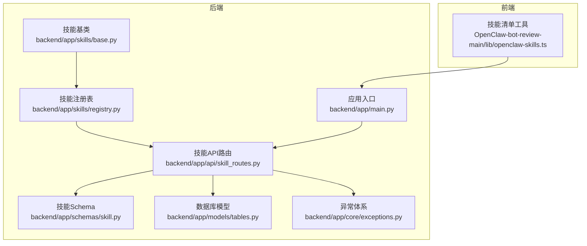
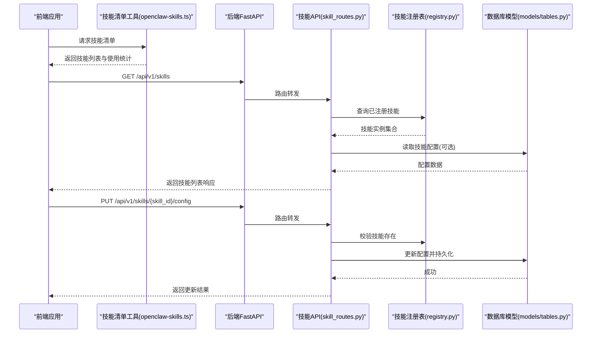
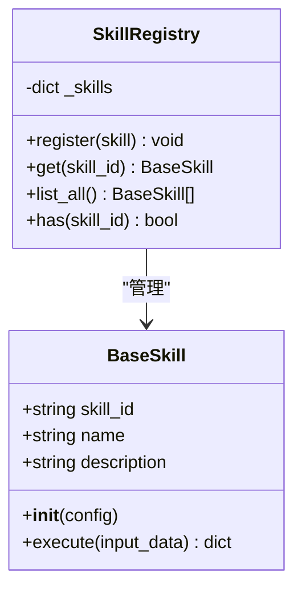
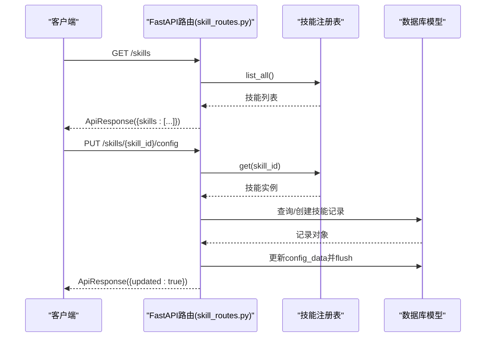
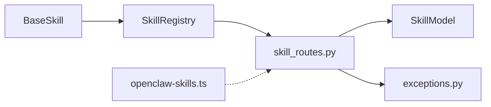

# 技能注册机制

<cite>
**本文引用的文件**
- [backend/app/skills/base.py](file://backend/app/skills/base.py)
- [backend/app/skills/registry.py](file://backend/app/skills/registry.py)
- [backend/app/api/skill_routes.py](file://backend/app/api/skill_routes.py)
- [backend/app/schemas/skill.py](file://backend/app/schemas/skill.py)
- [backend/app/models/tables.py](file://backend/app/models/tables.py)
- [backend/app/core/exceptions.py](file://backend/app/core/exceptions.py)
- [backend/app/main.py](file://backend/app/main.py)
- [OpenClaw-bot-review-main/lib/openclaw-skills.ts](file://OpenClaw-bot-review-main/lib/openclaw-skills.ts)
</cite>

## 目录
1. [引言](#引言)
2. [项目结构](#项目结构)
3. [核心组件](#核心组件)
4. [架构总览](#架构总览)
5. [详细组件分析](#详细组件分析)
6. [依赖分析](#依赖分析)
7. [性能考虑](#性能考虑)
8. [故障排除指南](#故障排除指南)
9. [结论](#结论)
10. [附录：注册流程示例与最佳实践](#附录注册流程示例与最佳实践)

## 引言
本文件系统性阐述“技能注册机制”的设计与实现，覆盖技能发现、注册、实例化、配置管理、生命周期管理以及前端技能清单能力。后端通过统一的技能基类与注册表实现技能的集中管理；前端通过扫描本地技能目录与会话快照生成技能清单，并支持按来源与ID检索技能内容。本文档同时给出Manifest配置规范、命名约定、配置验证与热更新建议、版本控制策略、错误处理与故障排除方法。

## 项目结构
围绕技能注册机制的关键文件分布如下：
- 后端Python（FastAPI）：技能抽象基类、技能注册表、技能配置API、数据库模型、异常体系、应用入口
- 前端TypeScript：技能清单扫描与内容读取工具

图表来源
- [backend/app/skills/base.py:1-37](file://backend/app/skills/base.py#L1-L37)
- [backend/app/skills/registry.py:1-37](file://backend/app/skills/registry.py#L1-L37)
- [backend/app/api/skill_routes.py:1-61](file://backend/app/api/skill_routes.py#L1-L61)
- [backend/app/schemas/skill.py:1-22](file://backend/app/schemas/skill.py#L1-L22)
- [backend/app/models/tables.py:183-199](file://backend/app/models/tables.py#L183-L199)
- [backend/app/core/exceptions.py:38-43](file://backend/app/core/exceptions.py#L38-L43)
- [backend/app/main.py:14-28](file://backend/app/main.py#L14-L28)
- [OpenClaw-bot-review-main/lib/openclaw-skills.ts:111-162](file://OpenClaw-bot-review-main/lib/openclaw-skills.ts#L111-L162)

章节来源
- [backend/app/skills/base.py:1-37](file://backend/app/skills/base.py#L1-L37)
- [backend/app/skills/registry.py:1-37](file://backend/app/skills/registry.py#L1-L37)
- [backend/app/api/skill_routes.py:1-61](file://backend/app/api/skill_routes.py#L1-L61)
- [backend/app/schemas/skill.py:1-22](file://backend/app/schemas/skill.py#L1-L22)
- [backend/app/models/tables.py:183-199](file://backend/app/models/tables.py#L183-L199)
- [backend/app/core/exceptions.py:38-43](file://backend/app/core/exceptions.py#L38-L43)
- [backend/app/main.py:14-28](file://backend/app/main.py#L14-L28)
- [OpenClaw-bot-review-main/lib/openclaw-skills.ts:111-162](file://OpenClaw-bot-review-main/lib/openclaw-skills.ts#L111-L162)

## 核心组件
- 抽象技能基类：定义技能标识、名称、描述与异步执行接口，确保所有技能实现具备一致的契约。
- 技能注册表：提供注册、查询、枚举与存在性检查等能力，支持日志记录与重复注册告警。
- 技能配置API：提供技能列表查询与配置更新接口，持久化到数据库模型。
- 数据库模型：技能配置持久化字段（含输入/输出Schema、配置数据、状态等），支持版本与时间戳。
- 异常体系：为技能不存在等场景提供统一错误类型。
- 应用入口：在启动阶段完成注册表初始化与数据库表创建。
- 前端技能清单工具：扫描内置/扩展/自定义技能目录，解析Markdown前言元数据，聚合使用统计与代理信息。

章节来源
- [backend/app/skills/base.py:16-37](file://backend/app/skills/base.py#L16-L37)
- [backend/app/skills/registry.py:10-37](file://backend/app/skills/registry.py#L10-L37)
- [backend/app/api/skill_routes.py:17-61](file://backend/app/api/skill_routes.py#L17-L61)
- [backend/app/models/tables.py:183-199](file://backend/app/models/tables.py#L183-L199)
- [backend/app/core/exceptions.py:38-43](file://backend/app/core/exceptions.py#L38-L43)
- [backend/app/main.py:42-58](file://backend/app/main.py#L42-L58)
- [OpenClaw-bot-review-main/lib/openclaw-skills.ts:111-162](file://OpenClaw-bot-review-main/lib/openclaw-skills.ts#L111-L162)

## 架构总览
后端采用“技能基类 + 注册表 + API路由 + 数据库模型”的分层设计；前端通过工具函数扫描本地资源生成技能清单。整体交互如下：

图表来源
- [OpenClaw-bot-review-main/lib/openclaw-skills.ts:111-162](file://OpenClaw-bot-review-main/lib/openclaw-skills.ts#L111-L162)
- [backend/app/api/skill_routes.py:17-61](file://backend/app/api/skill_routes.py#L17-L61)
- [backend/app/skills/registry.py:22-26](file://backend/app/skills/registry.py#L22-L26)
- [backend/app/models/tables.py:183-199](file://backend/app/models/tables.py#L183-L199)

## 详细组件分析

### 抽象技能基类（BaseSkill）
- 角色与职责：定义技能的最小可用接口与元数据字段，确保不同技能实现遵循统一契约。
- 关键点：
  - 抽象方法execute(input_data)：接收结构化输入，返回结构化输出。
  - 元数据字段：skill_id、name、description用于标识与展示。
  - 初始化参数：支持传入配置字典，便于后续配置管理。

章节来源
- [backend/app/skills/base.py:16-37](file://backend/app/skills/base.py#L16-L37)

### 技能注册表（SkillRegistry）
- 角色与职责：集中管理技能实例，提供注册、查询、枚举与存在性判断。
- 关键点：
  - 注册：以skill_id为键存储，重复注册会记录警告日志。
  - 查询：通过skill_id获取实例，不存在时抛出技能未找到异常。
  - 列表：返回所有已注册技能实例。
  - 存在性：快速判断某skill_id是否已注册。

图表来源
- [backend/app/skills/base.py:16-37](file://backend/app/skills/base.py#L16-L37)
- [backend/app/skills/registry.py:10-37](file://backend/app/skills/registry.py#L10-L37)

章节来源
- [backend/app/skills/registry.py:10-37](file://backend/app/skills/registry.py#L10-L37)

### 技能配置API（skill_routes.py）
- 角色与职责：对外提供技能列表查询与配置更新接口，负责与数据库模型交互。
- 关键点：
  - GET /api/v1/skills：遍历注册表中的技能，组装响应数据（含技能ID、名称、描述、配置、状态等）。
  - PUT /api/v1/skills/{skill_id}/config：校验技能存在，读取或创建数据库记录，更新配置数据并持久化。
  - 依赖：技能注册表、数据库会话、技能配置Schema、技能模型。

图表来源
- [backend/app/api/skill_routes.py:17-61](file://backend/app/api/skill_routes.py#L17-L61)
- [backend/app/skills/registry.py:22-26](file://backend/app/skills/registry.py#L22-L26)
- [backend/app/models/tables.py:183-199](file://backend/app/models/tables.py#L183-L199)

章节来源
- [backend/app/api/skill_routes.py:17-61](file://backend/app/api/skill_routes.py#L17-L61)
- [backend/app/schemas/skill.py:19-22](file://backend/app/schemas/skill.py#L19-L22)
- [backend/app/models/tables.py:183-199](file://backend/app/models/tables.py#L183-L199)

### 数据库模型（SkillModel）
- 角色与职责：持久化技能配置，支撑配置管理、版本控制与状态维护。
- 关键字段：
  - 主键：skill_id
  - 名称与描述：name、description
  - 版本：version
  - 模块路径：module_path（用于动态加载）
  - 输入/输出Schema：input_schema、output_schema
  - 配置数据：config_data（结构化配置）
  - 状态：status（如active）
  - 时间戳：created_at、updated_at

章节来源
- [backend/app/models/tables.py:183-199](file://backend/app/models/tables.py#L183-L199)

### 异常体系（SkillNotFoundError）
- 角色与职责：当请求的技能不存在时抛出统一异常，便于上层路由与中间件进行标准化处理。
- 关键点：
  - 与API路由配合，触发404响应码映射。

章节来源
- [backend/app/core/exceptions.py:38-43](file://backend/app/core/exceptions.py#L38-L43)
- [backend/app/api/skill_routes.py:41](file://backend/app/api/skill_routes.py#L41-L41)

### 应用入口（main.py）
- 角色与职责：应用生命周期管理、中间件与全局异常处理、路由注册。
- 关键点：
  - 启动阶段注册代理（演示用途），实际技能注册需结合具体实现。
  - 创建数据库表（开发模式）。
  - 统一异常处理：根据错误类别映射HTTP状态码。

章节来源
- [backend/app/main.py:32-58](file://backend/app/main.py#L32-L58)
- [backend/app/main.py:87-129](file://backend/app/main.py#L87-L129)

### 前端技能清单工具（openclaw-skills.ts）
- 角色与职责：扫描内置/扩展/自定义技能目录，解析Markdown前言元数据，聚合使用统计与代理信息。
- 关键点：
  - 扫描逻辑：内置包、扩展包、用户自定义目录。
  - 元数据解析：从SKILL.md中提取name、description、emoji等。
  - 使用统计：从最近会话快照中提取被使用的技能名称。
  - 内容读取：按source与id定位并读取技能内容。

章节来源
- [OpenClaw-bot-review-main/lib/openclaw-skills.ts:111-162](file://OpenClaw-bot-review-main/lib/openclaw-skills.ts#L111-L162)

## 依赖分析
- 技能基类与注册表：低耦合，注册表依赖基类接口。
- API路由：依赖注册表与数据库模型，向上提供HTTP接口。
- 前端工具：独立于后端，仅依赖本地文件系统与配置文件。
- 异常体系：被API路由与注册表使用，保证错误传播一致性。

图表来源
- [backend/app/skills/base.py:16-37](file://backend/app/skills/base.py#L16-L37)
- [backend/app/skills/registry.py:10-37](file://backend/app/skills/registry.py#L10-L37)
- [backend/app/api/skill_routes.py:17-61](file://backend/app/api/skill_routes.py#L17-L61)
- [backend/app/models/tables.py:183-199](file://backend/app/models/tables.py#L183-L199)
- [backend/app/core/exceptions.py:38-43](file://backend/app/core/exceptions.py#L38-L43)
- [OpenClaw-bot-review-main/lib/openclaw-skills.ts:111-162](file://OpenClaw-bot-review-main/lib/openclaw-skills.ts#L111-L162)

## 性能考虑
- 注册表查询：基于内存字典，O(1)查找；注意避免频繁重建注册表。
- API响应：列表接口遍历注册表，规模较大时建议分页或缓存。
- 数据库访问：配置更新涉及读写SkillModel，建议批量提交与索引优化。
- 前端扫描：扫描本地文件系统可能较慢，建议缓存结果并在变更时刷新。

## 故障排除指南
- 技能未找到（404）：确认技能ID正确且已在注册表中注册；检查API路由是否调用注册表查询。
- 配置更新失败：确认技能存在、数据库连接正常、请求体格式符合Schema。
- 重复注册告警：避免重复注册同一skill_id；检查初始化逻辑。
- 前端技能缺失：确认SKILL.md存在且前言元数据格式正确；检查扩展与自定义目录权限。

章节来源
- [backend/app/api/skill_routes.py:41](file://backend/app/api/skill_routes.py#L41-L41)
- [backend/app/skills/registry.py:17-19](file://backend/app/skills/registry.py#L17-L19)
- [OpenClaw-bot-review-main/lib/openclaw-skills.ts:30-47](file://OpenClaw-bot-review-main/lib/openclaw-skills.ts#L30-L47)

## 结论
该技能注册机制以“基类 + 注册表 + API + 持久化”为核心，结合前端技能清单工具形成前后端协同的完整闭环。通过清晰的契约、统一的异常与响应、可扩展的配置模型，系统支持技能的动态发现、注册与运行期配置管理。建议在生产环境中强化配置校验、引入版本控制与灰度发布策略，并对大规模技能集进行缓存与分页优化。

## 附录：注册流程示例与最佳实践

### 技能发现与清单生成（前端）
- 发现范围：内置包、扩展包、用户自定义目录
- 元数据解析：从SKILL.md前言提取name、description、emoji
- 使用统计：从最近会话快照中识别被使用技能
- 内容读取：按source与id读取技能内容

章节来源
- [OpenClaw-bot-review-main/lib/openclaw-skills.ts:111-162](file://OpenClaw-bot-review-main/lib/openclaw-skills.ts#L111-L162)

### 技能注册与实例化（后端）
- 实现基类：继承BaseSkill并实现execute方法
- 注册：将实例注册到SkillRegistry，确保skill_id唯一
- 查询：通过skill_id获取实例并调用execute
- 销毁：移除注册表条目（如需要）

章节来源
- [backend/app/skills/base.py:16-37](file://backend/app/skills/base.py#L16-L37)
- [backend/app/skills/registry.py:16-26](file://backend/app/skills/registry.py#L16-L26)

### Manifest配置规范（建议）
- 技能ID命名规则：小写字母、数字、短横线组合，避免特殊字符
- 元数据定义：name、description、emoji、模块路径（module_path）
- 依赖声明：可通过输入/输出Schema或配置数据体现
- 版本控制：version字段用于追踪变更
- 配置验证：Schema校验与默认值设置
- 热更新：通过API更新config_data并持久化，重启或重载策略视实现而定

章节来源
- [backend/app/models/tables.py:183-199](file://backend/app/models/tables.py#L183-L199)
- [backend/app/schemas/skill.py:6-12](file://backend/app/schemas/skill.py#L6-L12)

### 生命周期管理（建议）
- 初始化：加载配置、建立外部依赖
- 激活：注册到注册表，对外暴露
- 停用：从注册表移除或标记状态为非活跃
- 销毁：释放资源、清理缓存

章节来源
- [backend/app/skills/registry.py:16-26](file://backend/app/skills/registry.py#L16-L26)

### 最佳实践
- 命名约定：skill_id全局唯一，语义明确
- 配置管理：使用Schema约束配置结构，提供默认值
- 错误处理：捕获并包装底层异常，提供上下文信息
- 日志记录：关键事件（注册、更新、查询）记录日志
- 安全性：限制可执行模块路径，避免任意代码注入