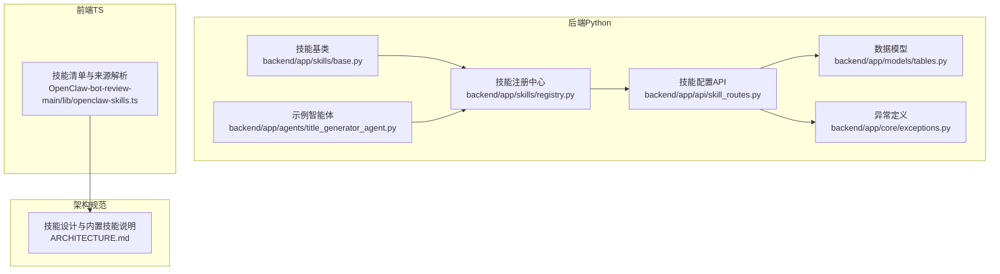
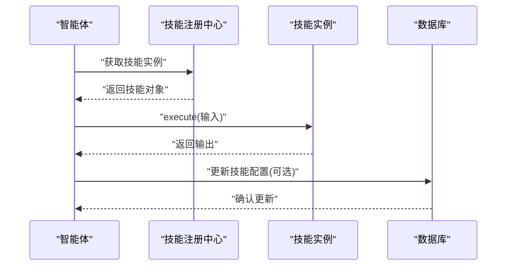
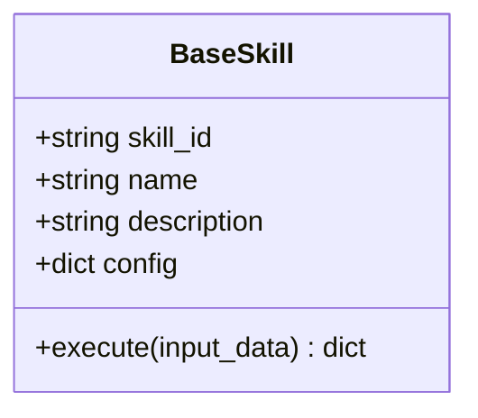
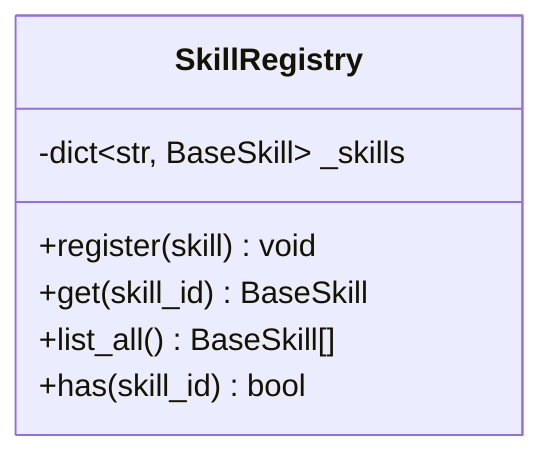
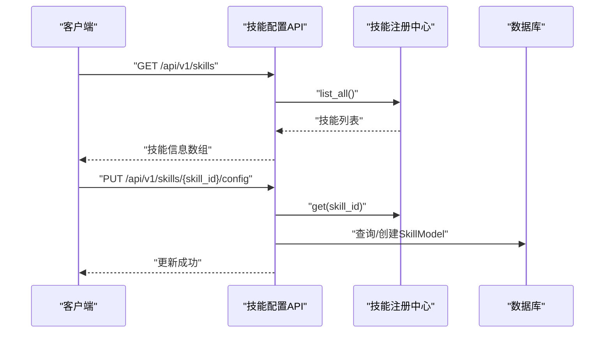
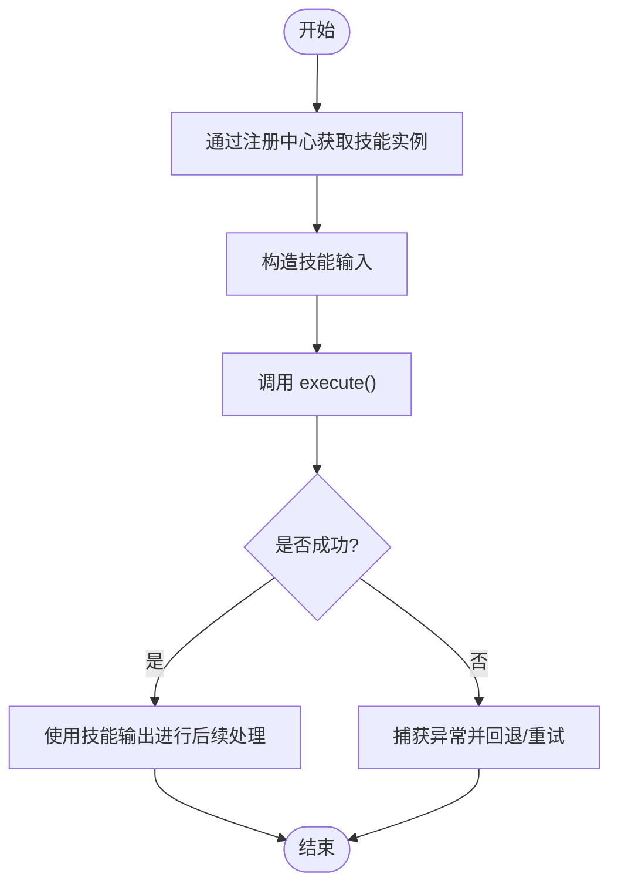
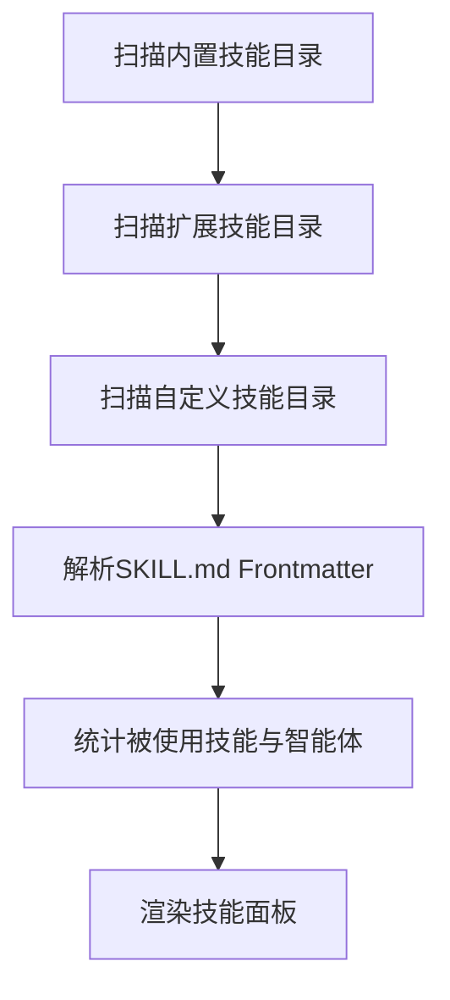
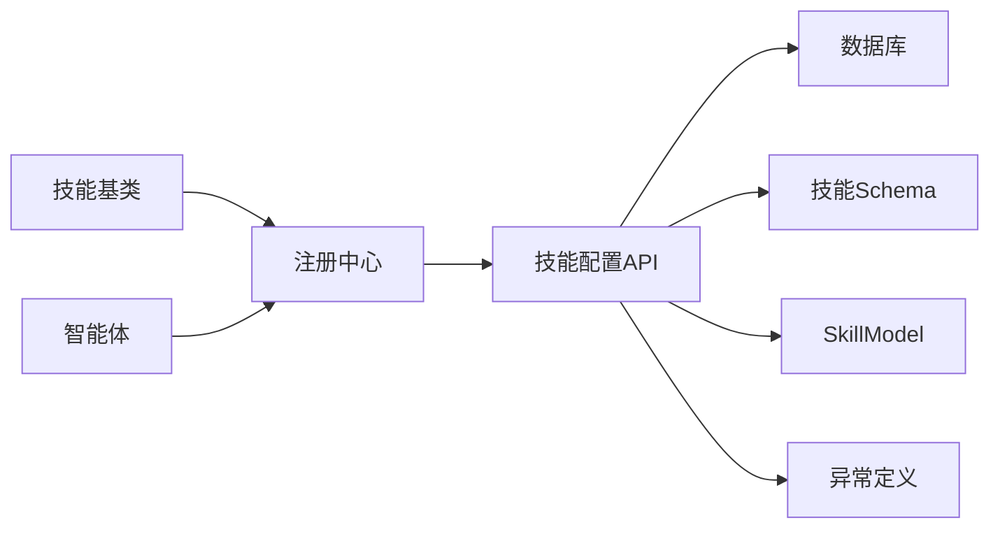

# 技能系统

<cite>
**本文引用的文件**
- [backend/app/skills/base.py](file://backend/app/skills/base.py)
- [backend/app/skills/registry.py](file://backend/app/skills/registry.py)
- [backend/app/api/skill_routes.py](file://backend/app/api/skill_routes.py)
- [backend/app/schemas/skill.py](file://backend/app/schemas/skill.py)
- [backend/app/models/tables.py](file://backend/app/models/tables.py)
- [backend/app/core/exceptions.py](file://backend/app/core/exceptions.py)
- [backend/app/agents/title_generator_agent.py](file://backend/app/agents/title_generator_agent.py)
- [ARCHITECTURE.md](file://ARCHITECTURE.md)
- [OpenClaw-bot-review-main/lib/openclaw-skills.ts](file://OpenClaw-bot-review-main/lib/openclaw-skills.ts)
</cite>

## 目录
1. [引言](#引言)
2. [项目结构](#项目结构)
3. [核心组件](#核心组件)
4. [架构总览](#架构总览)
5. [详细组件分析](#详细组件分析)
6. [依赖分析](#依赖分析)
7. [性能考虑](#性能考虑)
8. [故障排查指南](#故障排查指南)
9. [结论](#结论)
10. [附录](#附录)

## 引言
本文件面向HotClaw技能系统，提供从基础设计到实现细节、从调用协议到扩展开发的完整技术文档。重点涵盖：
- 技能基类设计与接口规范
- 技能注册机制与动态加载
- 技能与智能体的协作模式与调用时机
- 内置技能能力概览（新闻抓取、摘要、风险检测、标题评分）
- 配置管理与API交互
- 性能优化、错误处理与扩展最佳实践

## 项目结构
技能系统主要分布在后端Python服务与前端展示层：
- 后端Python
  - 技能基类与注册中心：backend/app/skills/base.py、backend/app/skills/registry.py
  - 技能配置API：backend/app/api/skill_routes.py
  - 数据模型与异常：backend/app/models/tables.py、backend/app/core/exceptions.py
  - 智能体示例：backend/app/agents/title_generator_agent.py
- 前端TypeScript
  - 技能清单与来源解析：OpenClaw-bot-review-main/lib/openclaw-skills.ts
- 架构与规范
  - ARCHITECTURE.md中对技能基类、注册方式、调用协议与内置技能的说明

**图表来源**
- [backend/app/skills/base.py:1-37](file://backend/app/skills/base.py#L1-L37)
- [backend/app/skills/registry.py:1-37](file://backend/app/skills/registry.py#L1-L37)
- [backend/app/api/skill_routes.py:1-61](file://backend/app/api/skill_routes.py#L1-L61)
- [backend/app/models/tables.py](file://backend/app/models/tables.py)
- [backend/app/core/exceptions.py](file://backend/app/core/exceptions.py)
- [backend/app/agents/title_generator_agent.py:1-85](file://backend/app/agents/title_generator_agent.py#L1-L85)
- [OpenClaw-bot-review-main/lib/openclaw-skills.ts:1-162](file://OpenClaw-bot-review-main/lib/openclaw-skills.ts#L1-L162)
- [ARCHITECTURE.md:640-839](file://ARCHITECTURE.md#L640-L839)

**章节来源**
- [backend/app/skills/base.py:1-37](file://backend/app/skills/base.py#L1-L37)
- [backend/app/skills/registry.py:1-37](file://backend/app/skills/registry.py#L1-L37)
- [backend/app/api/skill_routes.py:1-61](file://backend/app/api/skill_routes.py#L1-L61)
- [OpenClaw-bot-review-main/lib/openclaw-skills.ts:1-162](file://OpenClaw-bot-review-main/lib/openclaw-skills.ts#L1-L162)
- [ARCHITECTURE.md:640-839](file://ARCHITECTURE.md#L640-L839)

## 核心组件
- 技能基类：定义统一的技能标识、名称、描述与异步执行协议，确保所有技能具备一致的调用契约。
- 技能注册中心：集中管理技能实例，提供注册、查询、枚举与存在性检查等能力。
- 技能配置API：提供技能清单查询与配置更新接口，支持持久化存储与运行时调整。
- 数据模型与异常：定义技能配置的数据库映射与技能不存在等异常类型。
- 智能体协作：智能体通过注册中心获取技能实例并按约定协议调用，形成“工具化”的可组合能力。

**章节来源**
- [backend/app/skills/base.py:16-37](file://backend/app/skills/base.py#L16-L37)
- [backend/app/skills/registry.py:10-37](file://backend/app/skills/registry.py#L10-L37)
- [backend/app/api/skill_routes.py:17-61](file://backend/app/api/skill_routes.py#L17-L61)
- [backend/app/schemas/skill.py:6-22](file://backend/app/schemas/skill.py#L6-L22)
- [backend/app/models/tables.py](file://backend/app/models/tables.py)
- [backend/app/core/exceptions.py](file://backend/app/core/exceptions.py)
- [backend/app/agents/title_generator_agent.py:39-85](file://backend/app/agents/title_generator_agent.py#L39-L85)

## 架构总览
技能系统遵循“无状态工具”理念：技能不参与编排，仅作为可复用的工具能力被智能体按需调用。系统通过声明式清单与动态加载实现技能注册；通过API提供配置管理；通过Schema约束输入输出与配置。

**图表来源**
- [backend/app/skills/registry.py:22-26](file://backend/app/skills/registry.py#L22-L26)
- [backend/app/skills/base.py:26-36](file://backend/app/skills/base.py#L26-L36)
- [backend/app/api/skill_routes.py:34-61](file://backend/app/api/skill_routes.py#L34-L61)

## 详细组件分析

### 技能基类设计
- 角色定位：抽象出技能的最小可用接口，强调“工具能力”而非“决策主体”，确保可组合、可替换、可复用。
- 接口规范：
  - 必备字段：技能ID、名称、描述
  - 初始化参数：可选配置字典
  - 执行协议：异步execute，接收结构化输入，返回结构化输出
- 设计原则：无状态、稳定输出、可重复利用；与智能体解耦，避免在技能内引入复杂状态机或编排逻辑。

**图表来源**
- [backend/app/skills/base.py:16-37](file://backend/app/skills/base.py#L16-L37)

**章节来源**
- [backend/app/skills/base.py:1-37](file://backend/app/skills/base.py#L1-L37)
- [ARCHITECTURE.md:652-666](file://ARCHITECTURE.md#L652-L666)

### 技能注册中心
- 职责：维护技能实例映射，提供注册、查询、列举与存在性判断。
- 并发与幂等：重复注册同一ID会记录告警；查询不存在的ID抛出技能未找到异常。
- 单例：全局唯一实例，便于跨模块共享。

**图表来源**
- [backend/app/skills/registry.py:10-37](file://backend/app/skills/registry.py#L10-L37)

**章节来源**
- [backend/app/skills/registry.py:1-37](file://backend/app/skills/registry.py#L1-L37)
- [backend/app/core/exceptions.py](file://backend/app/core/exceptions.py)

### 技能配置API
- 列表接口：返回已注册技能的基本信息、版本、配置与状态。
- 更新接口：根据技能ID更新配置，若数据库中不存在对应记录则创建；返回更新结果。
- 数据模型：技能配置持久化到SkillModel，包含技能ID、名称与模块路径等。

**图表来源**
- [backend/app/api/skill_routes.py:17-61](file://backend/app/api/skill_routes.py#L17-L61)
- [backend/app/skills/registry.py:22-26](file://backend/app/skills/registry.py#L22-L26)
- [backend/app/schemas/skill.py:15-22](file://backend/app/schemas/skill.py#L15-L22)
- [backend/app/models/tables.py](file://backend/app/models/tables.py)

**章节来源**
- [backend/app/api/skill_routes.py:1-61](file://backend/app/api/skill_routes.py#L1-L61)
- [backend/app/schemas/skill.py:1-22](file://backend/app/schemas/skill.py#L1-L22)
- [backend/app/models/tables.py](file://backend/app/models/tables.py)

### 内置技能概览与调用协议
- 调用协议：智能体通过注册中心获取技能实例，构造输入对象，调用execute并消费输出。
- 内置技能（基于架构文档）：
  - 新闻抓取技能：输入关键词、领域与最大条数；输出文章列表（标题、来源、链接、发布时间、摘要）；配置含新闻源列表、最大条目数、缓存TTL等。
  - 摘要技能：输入文本与最大长度；输出摘要；配置含LLM模型与温度等。
  - 风险检测技能：输入文本；输出风险列表与是否存在风险；配置含敏感词表与规则。
  - 标题评分技能：输入标题、领域与目标受众；输出综合分数与维度分数及建议；配置含评分模型与权重。
- 与智能体协作：智能体在合适时机调用技能以完成特定工具性任务，如热点抓取、内容摘要、风险扫描与标题评分。

**图表来源**
- [ARCHITECTURE.md:699-719](file://ARCHITECTURE.md#L699-L719)

**章节来源**
- [ARCHITECTURE.md:641-758](file://ARCHITECTURE.md#L641-L758)
- [backend/app/agents/title_generator_agent.py:39-85](file://backend/app/agents/title_generator_agent.py#L39-L85)

### 前端技能清单与来源解析
- 能力：扫描内置、扩展与自定义技能目录，解析SKILL.md的Frontmatter，统计各技能被哪些智能体使用过，并结合配置文件渲染技能面板。
- 用途：为前端提供技能清单、来源标记与使用统计，辅助用户理解技能生态与使用情况。

**图表来源**
- [OpenClaw-bot-review-main/lib/openclaw-skills.ts:64-151](file://OpenClaw-bot-review-main/lib/openclaw-skills.ts#L64-L151)

**章节来源**
- [OpenClaw-bot-review-main/lib/openclaw-skills.ts:1-162](file://OpenClaw-bot-review-main/lib/openclaw-skills.ts#L1-L162)

## 依赖分析
- 组件耦合
  - 技能基类与注册中心：低耦合，通过技能ID与接口契约交互。
  - 注册中心与API：API依赖注册中心进行技能查询与存在性校验。
  - API与数据库：API负责持久化技能配置，依赖SkillModel与数据库会话。
  - 智能体与技能：智能体通过注册中心间接依赖技能实现。
- 外部依赖
  - FastAPI用于API路由与依赖注入
  - SQLAlchemy用于数据库访问
  - Pydantic用于Schema校验与序列化

**图表来源**
- [backend/app/skills/base.py:1-37](file://backend/app/skills/base.py#L1-L37)
- [backend/app/skills/registry.py:1-37](file://backend/app/skills/registry.py#L1-L37)
- [backend/app/api/skill_routes.py:1-61](file://backend/app/api/skill_routes.py#L1-L61)
- [backend/app/schemas/skill.py:1-22](file://backend/app/schemas/skill.py#L1-L22)
- [backend/app/models/tables.py](file://backend/app/models/tables.py)
- [backend/app/core/exceptions.py](file://backend/app/core/exceptions.py)

**章节来源**
- [backend/app/api/skill_routes.py:1-61](file://backend/app/api/skill_routes.py#L1-L61)
- [backend/app/schemas/skill.py:1-22](file://backend/app/schemas/skill.py#L1-L22)
- [backend/app/models/tables.py](file://backend/app/models/tables.py)
- [backend/app/core/exceptions.py](file://backend/app/core/exceptions.py)

## 性能考虑
- 技能执行
  - 异步执行：execute采用异步协议，适合I/O密集型（网络抓取、外部API调用）。
  - 无状态设计：减少上下文切换开销，便于并发与缓存。
- 注册与查询
  - 哈希表存储技能实例，查询与注册均为近似O(1)。
- 配置更新
  - 仅在必要时更新配置，避免频繁写入；批量操作可减少数据库往返。
- 缓存策略
  - 对于外部资源访问（如新闻抓取），可在技能内部或上层引入缓存，降低重复请求成本。
- 错误与超时
  - 为外部调用设置合理超时与重试；对失败场景提供快速回退路径。

## 故障排查指南
- 技能未找到
  - 现象：查询技能时报技能未找到异常。
  - 排查：确认技能是否已注册；检查技能ID拼写；查看日志告警。
- 配置更新失败
  - 现象：更新配置后未生效或报错。
  - 排查：确认数据库连接与权限；检查请求体格式；核对SkillModel是否存在。
- 执行异常
  - 现象：技能执行抛出异常或返回非预期输出。
  - 排查：验证输入Schema；检查外部依赖可用性；查看日志堆栈；必要时启用更详细的追踪。

**章节来源**
- [backend/app/skills/registry.py:22-26](file://backend/app/skills/registry.py#L22-L26)
- [backend/app/api/skill_routes.py:34-61](file://backend/app/api/skill_routes.py#L34-L61)
- [backend/app/core/exceptions.py](file://backend/app/core/exceptions.py)

## 结论
HotClaw技能系统以“无状态工具”为核心理念，通过统一的基类接口、集中注册中心与声明式清单实现技能的可发现、可配置与可复用。配合智能体的按需调用，形成高内聚、低耦合的能力组合。建议在实际工程中严格遵循接口契约、完善配置Schema与错误处理，并结合缓存与异步执行提升整体性能与稳定性。

## 附录

### 技能开发指南
- 创建步骤
  - 定义技能类：继承技能基类，实现execute方法，设置skill_id、name、description。
  - 声明清单：编写YAML清单，声明模块路径、输入输出Schema与初始配置。
  - 动态加载：系统启动时扫描清单并动态导入模块，注册到注册中心。
  - 配置管理：通过API更新配置，持久化到数据库。
- 配置文件格式
  - 清单字段：技能ID、名称、描述、版本、模块路径、输入输出Schema、初始配置。
  - API请求体：包含config_data键，值为配置字典。
- 测试方法
  - 单元测试：针对execute方法编写输入-输出断言，覆盖正常与异常分支。
  - 集成测试：通过API更新配置并验证技能行为变化。
  - 回归测试：在外部依赖变更时验证稳定性与兼容性。

**章节来源**
- [ARCHITECTURE.md:668-719](file://ARCHITECTURE.md#L668-L719)
- [backend/app/schemas/skill.py:19-22](file://backend/app/schemas/skill.py#L19-L22)
- [backend/app/api/skill_routes.py:34-61](file://backend/app/api/skill_routes.py#L34-L61)