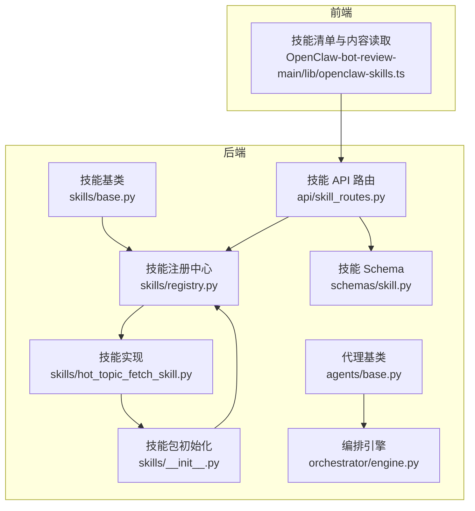
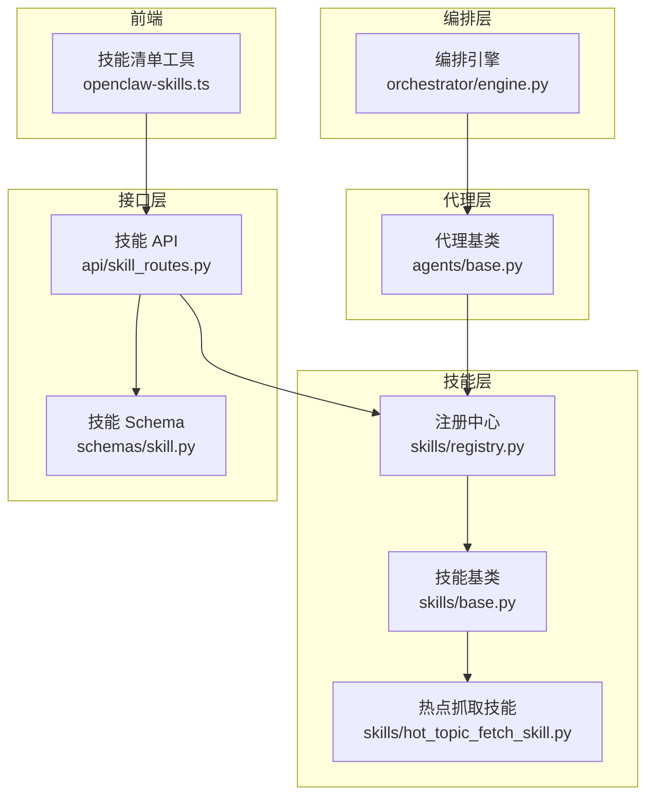
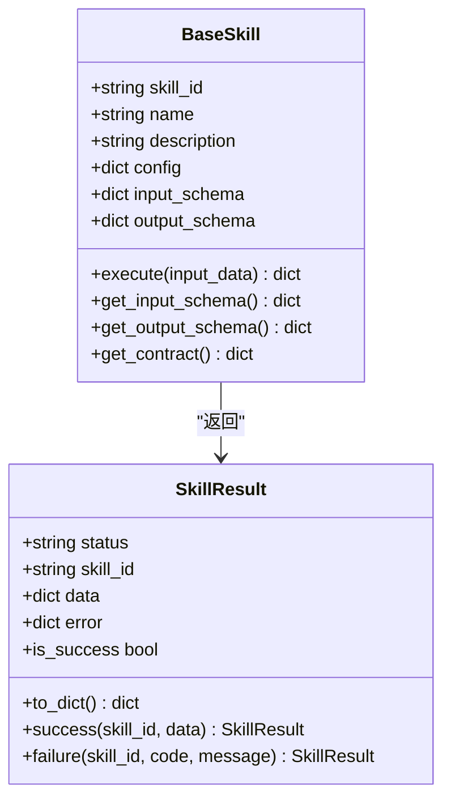
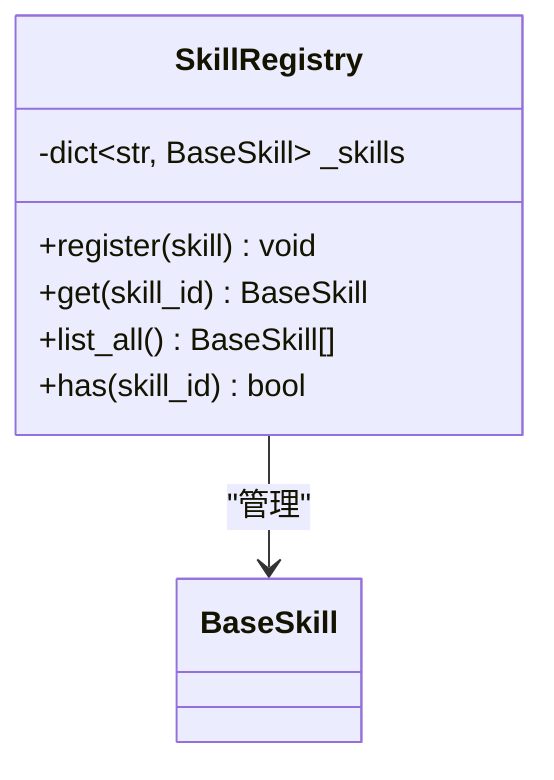
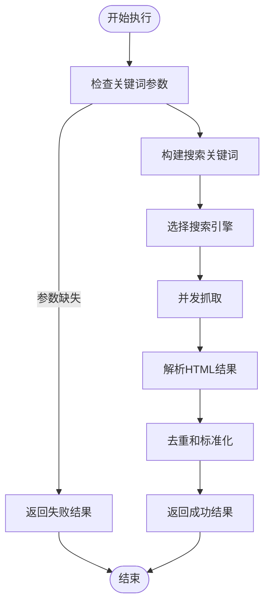
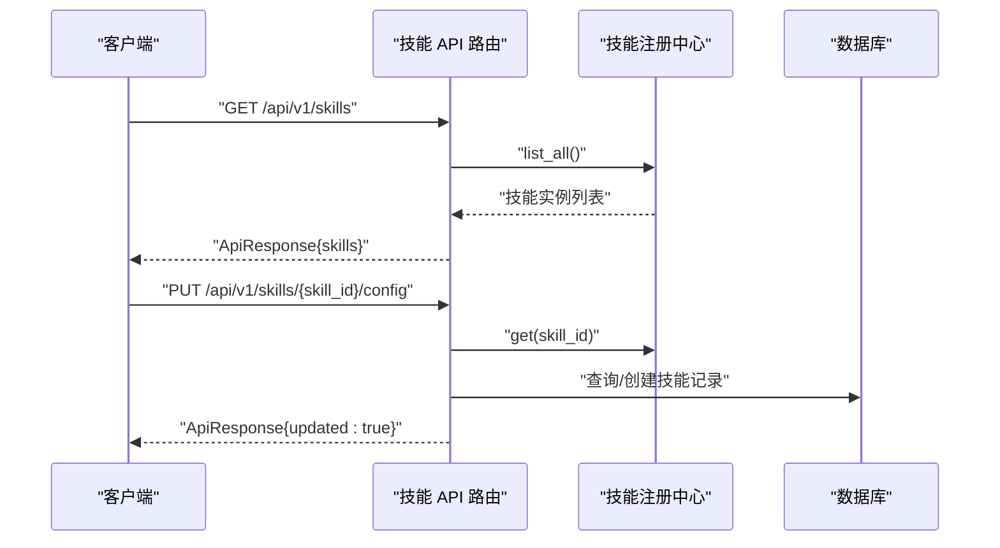
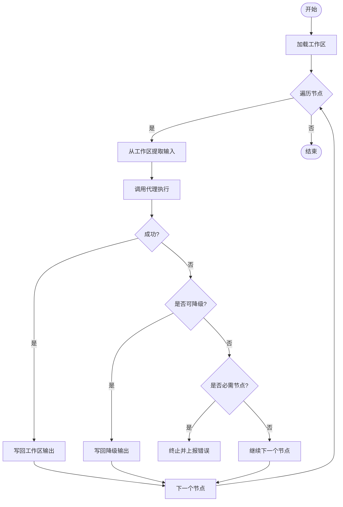
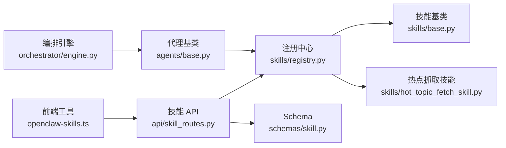

# 技能系统

<cite>
**本文引用的文件**
- [backend/app/skills/base.py](file://backend/app/skills/base.py)
- [backend/app/skills/hot_topic_fetch_skill.py](file://backend/app/skills/hot_topic_fetch_skill.py)
- [backend/app/skills/registry.py](file://backend/app/skills/registry.py)
- [backend/app/skills/__init__.py](file://backend/app/skills/__init__.py)
- [backend/app/schemas/skill.py](file://backend/app/schemas/skill.py)
- [backend/app/api/skill_routes.py](file://backend/app/api/skill_routes.py)
- [backend/app/agents/base.py](file://backend/app/agents/base.py)
- [backend/app/orchestrator/engine.py](file://backend/app/orchestrator/engine.py)
- [OpenClaw-bot-review-main/lib/openclaw-skills.ts](file://OpenClaw-bot-review-main/lib/openclaw-skills.ts)
</cite>

## 更新摘要
**所做更改**
- 新增完整的技能层抽象文档，包括 BaseSkill 基类和标准化 SkillResult 结构
- 新增 HotTopicFetchSkill 作为首个具体实现的详细分析
- 更新技能系统架构图以反映新的技能层设计
- 完善技能基类的设计原则和接口规范
- 增强技能注册机制和动态加载的说明
- 新增技能开发指南和最佳实践

## 目录
1. [引言](#引言)
2. [项目结构](#项目结构)
3. [核心组件](#核心组件)
4. [架构总览](#架构总览)
5. [详细组件分析](#详细组件分析)
6. [依赖分析](#依赖分析)
7. [性能考虑](#性能考虑)
8. [故障排查指南](#故障排查指南)
9. [结论](#结论)
10. [附录](#附录)

## 引言
本文件为 HotClaw 技能系统的全面技术文档，聚焦于"技能（Skill）"与"代理（Agent）"的职责边界、技能的无状态原子能力设计、可复用性原则，以及技能基类的输入输出与配置模式。文档详细介绍了全新的技能层抽象，包括 BaseSkill 基类、标准化的 SkillResult 结构，以及首个具体实现 HotTopicFetchSkill 的完整分析。同时梳理了技能的声明式注册机制、动态加载与配置管理，并给出新增技能的开发指南、测试策略、调试方法与最佳实践，帮助开发者高效扩展与维护技能体系。

## 项目结构
技能系统主要由后端 Python 后端与前端 TypeScript 辅助工具组成：
- 后端 Python
  - 技能基类与注册中心：backend/app/skills/base.py、backend/app/skills/registry.py
  - 技能实现：backend/app/skills/hot_topic_fetch_skill.py
  - 技能包初始化：backend/app/skills/__init__.py
  - 技能 API 路由：backend/app/api/skill_routes.py
  - 技能数据模型与 Schema：backend/app/schemas/skill.py
  - 代理基类与编排引擎：backend/app/agents/base.py、backend/app/orchestrator/engine.py
- 前端 TypeScript 工具
  - 技能清单与内容读取：OpenClaw-bot-review-main/lib/openclaw-skills.ts

```mermaid
graph TB
subgraph "后端"
A["技能基类<br/>skills/base.py"]
B["技能注册中心<br/>skills/registry.py"]
C["技能实现<br/>skills/hot_topic_fetch_skill.py"]
D["技能包初始化<br/>skills/__init__.py"]
E["技能 API 路由<br/>api/skill_routes.py"]
F["技能 Schema<br/>schemas/skill.py"]
G["代理基类<br/>agents/base.py"]
H["编排引擎<br/>orchestrator/engine.py"]
end
subgraph "前端"
I["技能清单与内容读取<br/>OpenClaw-bot-review-main/lib/openclaw-skills.ts"]
end
A --> B
B --> C
C --> D
D --> B
E --> B
E --> F
G --> H
I --> E
```

**图示来源**
- [backend/app/skills/base.py:1-142](file://backend/app/skills/base.py#L1-L142)
- [backend/app/skills/registry.py:1-37](file://backend/app/skills/registry.py#L1-L37)
- [backend/app/skills/hot_topic_fetch_skill.py:1-338](file://backend/app/skills/hot_topic_fetch_skill.py#L1-L338)
- [backend/app/skills/__init__.py:1-21](file://backend/app/skills/__init__.py#L1-L21)
- [backend/app/api/skill_routes.py:1-61](file://backend/app/api/skill_routes.py#L1-L61)
- [backend/app/schemas/skill.py:1-22](file://backend/app/schemas/skill.py#L1-L22)
- [backend/app/agents/base.py:1-215](file://backend/app/agents/base.py#L1-L215)
- [backend/app/orchestrator/engine.py:1-424](file://backend/app/orchestrator/engine.py#L1-L424)
- [OpenClaw-bot-review-main/lib/openclaw-skills.ts:1-162](file://OpenClaw-bot-review-main/lib/openclaw-skills.ts#L1-L162)

**章节来源**
- [backend/app/skills/base.py:1-142](file://backend/app/skills/base.py#L1-L142)
- [backend/app/skills/registry.py:1-37](file://backend/app/skills/registry.py#L1-L37)
- [backend/app/skills/hot_topic_fetch_skill.py:1-338](file://backend/app/skills/hot_topic_fetch_skill.py#L1-L338)
- [backend/app/skills/__init__.py:1-21](file://backend/app/skills/__init__.py#L1-L21)
- [backend/app/api/skill_routes.py:1-61](file://backend/app/api/skill_routes.py#L1-L61)
- [backend/app/schemas/skill.py:1-22](file://backend/app/schemas/skill.py#L1-L22)
- [backend/app/agents/base.py:1-215](file://backend/app/agents/base.py#L1-L215)
- [backend/app/orchestrator/engine.py:1-424](file://backend/app/orchestrator/engine.py#L1-L424)
- [OpenClaw-bot-review-main/lib/openclaw-skills.ts:1-162](file://OpenClaw-bot-review-main/lib/openclaw-skills.ts#L1-L162)

## 核心组件
- 技能基类 BaseSkill
  - 定义技能的统一接口与生命周期：技能标识、名称、描述；构造时注入配置；抽象执行接口。
  - 设计要点：无状态、原子化、稳定输出、可复用。
- 标准化技能结果 SkillResult
  - 统一的技能执行结果结构，包含状态、技能ID、数据和错误信息。
  - 提供成功和失败结果的便捷构建方法。
- 技能注册中心 SkillRegistry
  - 提供注册、查询、枚举与存在性检查；记录日志与异常抛出。
- 技能实现 HotTopicFetchSkill
  - 首个具体技能实现，负责从多个搜索引擎抓取热点数据。
  - 展示了完整的输入输出Schema定义和异步执行实现。
- 技能 API 路由
  - 列出已注册技能；更新技能配置（持久化到数据库）。
- 技能 Schema
  - 统一技能信息、列表响应与配置更新请求的数据结构。
- 代理基类 BaseAgent 与编排引擎 OrchestratorEngine
  - 代理负责业务任务与结构化输出，可调用技能；编排器按顺序调度代理节点，管理工作区与追踪。

**章节来源**
- [backend/app/skills/base.py:23-142](file://backend/app/skills/base.py#L23-L142)
- [backend/app/skills/registry.py:10-37](file://backend/app/skills/registry.py#L10-L37)
- [backend/app/skills/hot_topic_fetch_skill.py:51-338](file://backend/app/skills/hot_topic_fetch_skill.py#L51-L338)
- [backend/app/api/skill_routes.py:17-61](file://backend/app/api/skill_routes.py#L17-L61)
- [backend/app/schemas/skill.py:6-22](file://backend/app/schemas/skill.py#L6-L22)
- [backend/app/agents/base.py:72-215](file://backend/app/agents/base.py#L72-L215)
- [backend/app/orchestrator/engine.py:132-424](file://backend/app/orchestrator/engine.py#L132-L424)

## 架构总览
技能系统遵循"代理编排 + 技能工具"的分层架构：
- 代理层：承担业务任务，负责输入输出与上下文传递。
- 技能层：提供无状态原子能力，被代理调用以完成具体工具型处理。
- 注册与路由：通过注册中心集中管理技能实例，通过 API 路由暴露技能信息与配置更新。
- 前端工具：扫描并展示技能清单、来源与使用情况，辅助技能管理与可视化。

```mermaid
graph TB
subgraph "编排层"
OE["编排引擎<br/>orchestrator/engine.py"]
end
subgraph "代理层"
BA["代理基类<br/>agents/base.py"]
end
subgraph "技能层"
BS["技能基类<br/>skills/base.py"]
SR["注册中心<br/>skills/registry.py"]
HTFS["热点抓取技能<br/>skills/hot_topic_fetch_skill.py"]
end
subgraph "接口层"
API["技能 API<br/>api/skill_routes.py"]
SCH["技能 Schema<br/>schemas/skill.py"]
end
subgraph "前端"
TS["技能清单工具<br/>openclaw-skills.ts"]
end
OE --> BA
BA --> SR
SR --> BS
BS --> HTFS
API --> SR
API --> SCH
TS --> API
```

**图示来源**
- [backend/app/orchestrator/engine.py:132-424](file://backend/app/orchestrator/engine.py#L132-L424)
- [backend/app/agents/base.py:72-215](file://backend/app/agents/base.py#L72-L215)
- [backend/app/skills/base.py:78-142](file://backend/app/skills/base.py#L78-L142)
- [backend/app/skills/registry.py:10-37](file://backend/app/skills/registry.py#L10-L37)
- [backend/app/skills/hot_topic_fetch_skill.py:51-338](file://backend/app/skills/hot_topic_fetch_skill.py#L51-L338)
- [backend/app/api/skill_routes.py:17-61](file://backend/app/api/skill_routes.py#L17-L61)
- [backend/app/schemas/skill.py:6-22](file://backend/app/schemas/skill.py#L6-L22)
- [OpenClaw-bot-review-main/lib/openclaw-skills.ts:111-162](file://OpenClaw-bot-review-main/lib/openclaw-skills.ts#L111-L162)

## 详细组件分析

### 技能基类与职责边界
- 设计理念
  - 技能是"工具型处理"，不参与编排；应保持无状态、原子化、输出稳定且可复用。
  - 与代理的区别：代理是工作流节点，承担业务任务与结构化输出；技能仅提供可复用的工具能力。
- 接口与属性
  - 必备字段：skill_id、name、description。
  - 构造函数接收配置字典；execute 为异步执行接口，返回标准化的 SkillResult 结构。
- 可复用性原则
  - 输入输出 schema 明确；配置可注入；避免外部状态耦合；输出格式稳定。

```mermaid
classDiagram
class BaseSkill {
+string skill_id
+string name
+string description
+dict config
+dict input_schema
+dict output_schema
+execute(input_data) dict
+get_input_schema() dict
+get_output_schema() dict
+get_contract() dict
}
class SkillResult {
+string status
+string skill_id
+dict data
+dict error
+to_dict() dict
+is_success bool
+success(skill_id, data) SkillResult
+failure(skill_id, code, message) SkillResult
}
BaseSkill --> SkillResult : "返回"
```

**图示来源**
- [backend/app/skills/base.py:78-142](file://backend/app/skills/base.py#L78-L142)
- [backend/app/skills/base.py:23-76](file://backend/app/skills/base.py#L23-L76)

**章节来源**
- [backend/app/skills/base.py:1-14](file://backend/app/skills/base.py#L1-L14)
- [backend/app/skills/base.py:78-142](file://backend/app/skills/base.py#L78-L142)
- [backend/app/agents/base.py:1-18](file://backend/app/agents/base.py#L1-L18)

### 标准化技能结果结构
- SkillResult 设计目标
  - 统一所有技能的执行结果格式，确保调用方能够一致地处理成功和失败场景。
  - 包含状态码、技能ID、结构化数据和错误信息。
- 核心属性
  - status：执行状态（"success" | "failed"）
  - skill_id：技能唯一标识
  - data：成功时的结构化输出数据
  - error：失败时的错误信息（包含code和message）
- 工具方法
  - to_dict()：转换为字典格式
  - is_success：判断执行是否成功
  - success()：便捷构建成功结果
  - failure()：便捷构建失败结果

**章节来源**
- [backend/app/skills/base.py:23-76](file://backend/app/skills/base.py#L23-L76)

### 技能注册中心与声明式注册
- 注册流程
  - 将技能实例注册到注册中心，以 skill_id 为键；重复注册会记录告警。
  - 提供 get/list/has 等操作；查询不存在时抛出技能未找到异常。
- 声明式注册机制
  - 通过在应用启动阶段或模块导入时调用注册中心的 register 方法，即可完成技能的声明式注册。
- 动态加载与配置管理
  - 技能配置可通过 API 更新并持久化；前端工具可扫描技能清单并展示来源与使用情况。

```mermaid
classDiagram
class SkillRegistry {
-dict~str, BaseSkill~ _skills
+register(skill) void
+get(skill_id) BaseSkill
+list_all() BaseSkill[]
+has(skill_id) bool
}
SkillRegistry --> BaseSkill : "管理"
```

**图示来源**
- [backend/app/skills/registry.py:10-37](file://backend/app/skills/registry.py#L10-L37)

**章节来源**
- [backend/app/skills/registry.py:16-32](file://backend/app/skills/registry.py#L16-L32)
- [backend/app/api/skill_routes.py:34-61](file://backend/app/api/skill_routes.py#L34-L61)
- [OpenClaw-bot-review-main/lib/openclaw-skills.ts:111-162](file://OpenClaw-bot-review-main/lib/openclaw-skills.ts#L111-L162)

### HotTopicFetchSkill：首个具体实现
- 技能概述
  - 负责从多个搜索引擎（微信搜索、搜狗搜索、360搜索）抓取热点数据。
  - 返回归一化后的原始结果列表，供代理层进行进一步处理。
- 输入输出 Schema
  - 输入：关键词列表、指定搜索引擎、每引擎最大结果数
  - 输出：归一化后的热点列表、总数量、使用的搜索引擎
- 核心功能
  - 并发抓取多个搜索引擎
  - HTML解析和数据提取
  - 结果去重和标准化
  - 异常处理和降级策略

```mermaid
flowchart TD
Start(["开始执行"]) --> Keywords["检查关键词参数"]
Keywords --> BuildKeyword["构建搜索关键词"]
BuildKeyword --> Engines["选择搜索引擎"]
Engines --> Fetch["并发抓取"]
Fetch --> Parse["解析HTML结果"]
Parse --> Dedup["去重和标准化"]
Dedup --> Success["返回成功结果"]
Keywords --> |参数缺失| Failure["返回失败结果"]
Failure --> End(["结束"])
Success --> End
```

**图示来源**
- [backend/app/skills/hot_topic_fetch_skill.py:114-153](file://backend/app/skills/hot_topic_fetch_skill.py#L114-L153)
- [backend/app/skills/hot_topic_fetch_skill.py:163-202](file://backend/app/skills/hot_topic_fetch_skill.py#L163-L202)

**章节来源**
- [backend/app/skills/hot_topic_fetch_skill.py:51-108](file://backend/app/skills/hot_topic_fetch_skill.py#L51-L108)
- [backend/app/skills/hot_topic_fetch_skill.py:114-338](file://backend/app/skills/hot_topic_fetch_skill.py#L114-L338)

### 技能 API 与配置管理
- 列表接口
  - 返回所有已注册技能的基本信息、版本、配置与状态。
- 配置更新接口
  - 支持按 skill_id 更新配置；若数据库中不存在对应记录则创建；返回更新结果。
- 数据模型与 Schema
  - 使用 Pydantic 模型统一技能信息、列表响应与配置更新请求体。

```mermaid
sequenceDiagram
participant Client as "客户端"
participant API as "技能 API 路由"
participant Registry as "技能注册中心"
participant DB as "数据库"
Client->>API : "GET /api/v1/skills"
API->>Registry : "list_all()"
Registry-->>API : "技能实例列表"
API-->>Client : "ApiResponse{skills}"
Client->>API : "PUT /api/v1/skills/{skill_id}/config"
API->>Registry : "get(skill_id)"
API->>DB : "查询/创建技能记录"
API-->>Client : "ApiResponse{updated : true}"
```

**图示来源**
- [backend/app/api/skill_routes.py:17-61](file://backend/app/api/skill_routes.py#L17-L61)
- [backend/app/skills/registry.py:22-26](file://backend/app/skills/registry.py#L22-L26)

**章节来源**
- [backend/app/api/skill_routes.py:17-61](file://backend/app/api/skill_routes.py#L17-L61)
- [backend/app/schemas/skill.py:6-22](file://backend/app/schemas/skill.py#L6-L22)

### 代理与编排中的技能调用
- 代理职责
  - 代理负责业务任务，具备明确输入输出与上下文；可调用技能完成工具型处理。
- 编排引擎
  - 按固定顺序调度代理节点，提取输入、执行代理、回写输出至工作区；失败时尝试降级或终止。
- 技能在编排中的位置
  - 技能作为工具被代理调用，不直接参与编排节点的顺序控制。

```mermaid
flowchart TD
Start(["开始"]) --> LoadWS["加载工作区"]
LoadWS --> ForNode{"遍历节点"}
ForNode --> |是| Extract["从工作区提取输入"]
Extract --> CallAgent["调用代理执行"]
CallAgent --> Result{"成功?"}
Result --> |是| WriteBack["写回工作区输出"]
Result --> |否| Fallback{"是否可降级?"}
Fallback --> |是| WriteDegraded["写回降级输出"]
Fallback --> |否| Required{"是否必需节点?"}
Required --> |是| Stop["终止并上报错误"]
Required --> |否| Continue["继续下一个节点"]
WriteBack --> Next["下一个节点"]
WriteDegraded --> Next
Continue --> Next
Next --> ForNode
ForNode --> |否| End(["结束"])
```

**图示来源**
- [backend/app/orchestrator/engine.py:145-344](file://backend/app/orchestrator/engine.py#L145-L344)

**章节来源**
- [backend/app/agents/base.py:72-215](file://backend/app/agents/base.py#L72-L215)
- [backend/app/orchestrator/engine.py:132-424](file://backend/app/orchestrator/engine.py#L132-L424)

### 四大内置技能（概念性说明）
根据项目命名与常见工作流，以下为四大内置技能的概念性说明（非具体实现细节）。开发者可据此扩展自定义技能：
- 新闻抓取技能
  - 输入：关键词、时间范围、来源站点等；输出：新闻条目列表（含标题、链接、摘要、发布时间）。
- 摘要技能
  - 输入：长文本；输出：结构化摘要（要点、长度限制、语言偏好）。
- 风险检测技能
  - 输入：文本/URL；输出：风险标签、置信度、规则依据。
- 标题评分技能
  - 输入：标题、内容片段；输出：评分、推荐等级、改进建议。

说明：以上为概念性描述，用于指导新增技能的输入输出设计与配置项规划。具体实现需遵循技能基类接口与 Schema 规范。

## 依赖分析
- 组件内聚与耦合
  - 技能基类与注册中心低耦合：通过接口与键值访问交互。
  - API 路由依赖注册中心与数据库模型；Schema 为数据契约。
  - 代理与编排引擎通过注册中心间接依赖技能实例。
- 外部依赖与集成点
  - 前端工具通过文件系统扫描技能清单与内容，支持内置、扩展与自定义技能。
  - 技能配置持久化依赖数据库模型与路由接口。

```mermaid
graph LR
API["技能 API<br/>api/skill_routes.py"] --> REG["注册中心<br/>skills/registry.py"]
API --> SCH["Schema<br/>schemas/skill.py"]
REG --> BASE["技能基类<br/>skills/base.py"]
REG --> HTFS["热点抓取技能<br/>skills/hot_topic_fetch_skill.py"]
ORCH["编排引擎<br/>orchestrator/engine.py"] --> AGENT["代理基类<br/>agents/base.py"]
AGENT --> REG
FE["前端工具<br/>openclaw-skills.ts"] --> API
```

**图示来源**
- [backend/app/api/skill_routes.py:17-61](file://backend/app/api/skill_routes.py#L17-L61)
- [backend/app/skills/registry.py:10-37](file://backend/app/skills/registry.py#L10-L37)
- [backend/app/skills/base.py:78-142](file://backend/app/skills/base.py#L78-L142)
- [backend/app/skills/hot_topic_fetch_skill.py:51-338](file://backend/app/skills/hot_topic_fetch_skill.py#L51-L338)
- [backend/app/orchestrator/engine.py:132-424](file://backend/app/orchestrator/engine.py#L132-L424)
- [backend/app/agents/base.py:72-215](file://backend/app/agents/base.py#L72-L215)
- [OpenClaw-bot-review-main/lib/openclaw-skills.ts:111-162](file://OpenClaw-bot-review-main/lib/openclaw-skills.ts#L111-L162)

**章节来源**
- [backend/app/api/skill_routes.py:17-61](file://backend/app/api/skill_routes.py#L17-L61)
- [backend/app/skills/registry.py:10-37](file://backend/app/skills/registry.py#L10-L37)
- [backend/app/skills/base.py:78-142](file://backend/app/skills/base.py#L78-L142)
- [backend/app/skills/hot_topic_fetch_skill.py:51-338](file://backend/app/skills/hot_topic_fetch_skill.py#L51-L338)
- [backend/app/orchestrator/engine.py:132-424](file://backend/app/orchestrator/engine.py#L132-L424)
- [backend/app/agents/base.py:72-215](file://backend/app/agents/base.py#L72-L215)
- [OpenClaw-bot-review-main/lib/openclaw-skills.ts:111-162](file://OpenClaw-bot-review-main/lib/openclaw-skills.ts#L111-L162)

## 性能考虑
- 技能执行
  - 保持无状态与原子化，避免长耗时阻塞；必要时引入超时与重试策略。
  - HotTopicFetchSkill 使用异步并发抓取，提高整体性能。
- 编排与工作区
  - 工作区快照与映射尽量轻量；减少不必要的数据复制。
- 日志与追踪
  - 为每个节点记录耗时与令牌统计，便于性能分析与瓶颈定位。
- 前端扫描
  - 扫描技能清单时注意 I/O 开销，建议缓存结果并在变更时刷新。

## 故障排查指南
- 技能未找到
  - 现象：查询技能时报错。
  - 排查：确认技能是否已注册；检查 skill_id 是否正确；查看注册中心日志。
- 配置更新失败
  - 现象：更新配置后未生效。
  - 排查：确认数据库记录是否存在；检查请求体结构；验证路由权限。
- 代理执行失败
  - 现象：节点失败或超时。
  - 排查：查看编排日志与错误广播；检查代理 fallback 实现；核对系统提示词来源。
- 前端技能清单为空
  - 现象：技能列表显示为空。
  - 排查：确认技能目录结构与 SKILL.md 格式；检查包路径与候选目录。
- 技能执行异常
  - 现象：技能返回失败结果。
  - 排查：检查输入参数是否符合 Schema；查看技能内部日志；验证外部服务可用性。

**章节来源**
- [backend/app/skills/registry.py:22-26](file://backend/app/skills/registry.py#L22-L26)
- [backend/app/api/skill_routes.py:43-58](file://backend/app/api/skill_routes.py#L43-L58)
- [backend/app/orchestrator/engine.py:280-304](file://backend/app/orchestrator/engine.py#L280-L304)
- [OpenClaw-bot-review-main/lib/openclaw-skills.ts:49-72](file://OpenClaw-bot-review-main/lib/openclaw-skills.ts#L49-L72)

## 结论
HotClaw 技能系统以"无状态原子能力 + 标准化结果结构 + 声明式注册 + 结构化配置"为核心，通过代理编排与技能工具的清晰分工，实现了高内聚、可复用、易扩展的能力体系。全新的 BaseSkill 基类和标准化的 SkillResult 结构确保了技能的一致性和可靠性，而 HotTopicFetchSkill 作为首个具体实现展示了完整的技能开发模式。依托统一的 Schema、注册中心与 API 路由，开发者可以快速新增技能并纳入现有工作流；前端工具进一步增强了技能的可见性与可管理性。建议在新增技能时严格遵循输入输出与配置规范，结合测试与监控持续优化性能与稳定性。

## 附录

### 新增技能开发指南
- 接口实现
  - 继承技能基类，实现 execute 方法；设置 skill_id、name、description。
  - 定义 input_schema 和 output_schema，确保输入输出的结构化。
- 配置定义
  - 在构造函数中接收配置字典；确保配置项可序列化与持久化。
- 错误处理
  - 对异常进行捕获与包装；使用 SkillResult.failure 构建标准错误结果。
  - 必要时提供降级输出；记录日志与追踪 ID。
- 性能优化
  - 避免外部状态耦合；拆分长任务；合理使用缓存；关注 I/O 与网络延迟。
  - 考虑异步并发执行，提高吞吐量。
- 测试策略
  - 单元测试：覆盖正常路径、异常路径与边界条件。
  - 集成测试：模拟代理调用与编排执行，验证输入输出一致性。
  - 回归测试：随着配置与依赖变化，定期回归验证。
- 调试方法
  - 使用编排日志与 SSE 广播观察节点执行状态；利用前端技能清单核对技能来源与使用情况。
  - 通过 SkillResult 的 to_dict 方法输出详细的调试信息。
- 最佳实践
  - 保持技能无状态与幂等；输出结构化且稳定；为配置提供默认值与校验。
  - 为关键路径添加超时与重试；实现优雅的降级策略。
  - 遵循技能契约：不直接写主业务状态，只能被 Agent 调用。