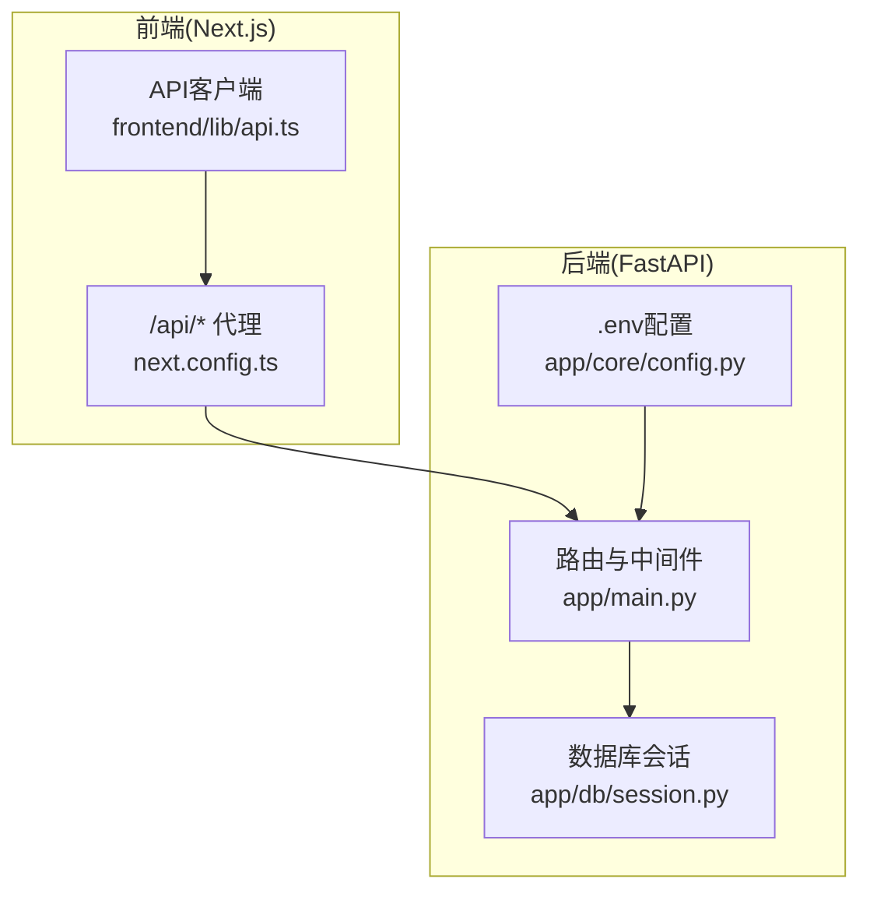
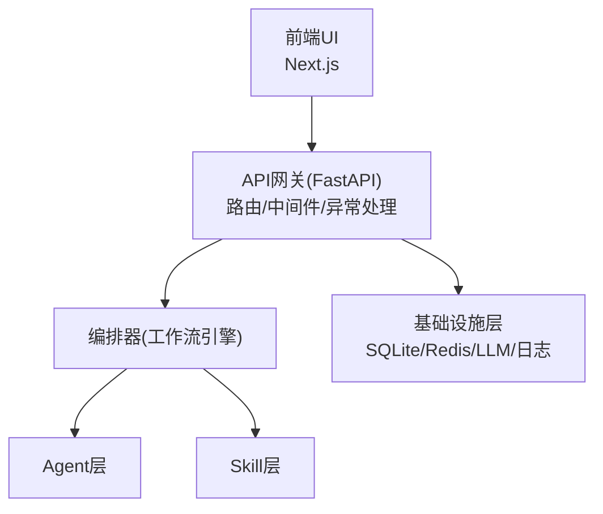
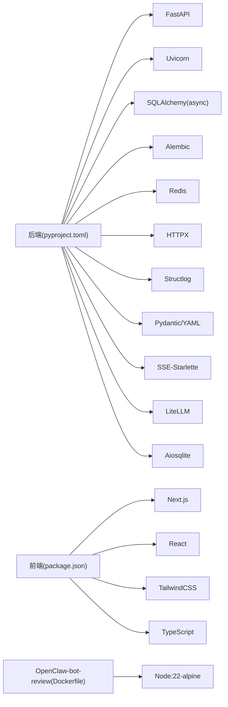
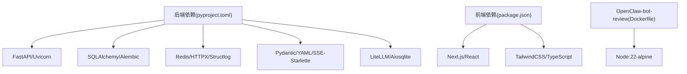

# 常见问题解决

<cite>
**本文引用的文件**
- [ARCHITECTURE.md](file://ARCHITECTURE.md)
- [backend/pyproject.toml](file://backend/pyproject.toml)
- [frontend/package.json](file://frontend/package.json)
- [OpenClaw-bot-review-main/package.json](file://OpenClaw-bot-review-main/package.json)
- [start.sh](file://start.sh)
- [start.bat](file://start.bat)
- [backend/app/core/config.py](file://backend/app/core/config.py)
- [backend/app/core/exceptions.py](file://backend/app/core/exceptions.py)
- [backend/app/main.py](file://backend/app/main.py)
- [backend/app/db/session.py](file://backend/app/db/session.py)
- [frontend/lib/api.ts](file://frontend/lib/api.ts)
- [frontend/next.config.ts](file://frontend/next.config.ts)
- [OpenClaw-bot-review-main/Dockerfile](file://OpenClaw-bot-review-main/Dockerfile)
- [backend/alembic.ini](file://backend/alembic.ini)
</cite>

## 目录
1. [简介](#简介)
2. [项目结构](#项目结构)
3. [核心组件](#核心组件)
4. [架构总览](#架构总览)
5. [详细组件分析](#详细组件分析)
6. [依赖分析](#依赖分析)
7. [性能注意事项](#性能注意事项)
8. [故障排查指南](#故障排查指南)
9. [结论](#结论)
10. [附录](#附录)

## 简介
本指南面向HotClaw项目使用者与维护者，聚焦“启动失败、连接超时、配置错误、权限问题”等常见故障场景，提供可操作的问题诊断步骤与修复方案。内容覆盖：
- 后端与前端联调问题（跨域、代理、SSE）
- 数据库连接失败与迁移问题
- LLM服务不可用与超时
- 环境变量与配置文件错误
- Docker容器启动与端口占用
- 依赖版本冲突与安装问题
- 问题自检清单与快速修复步骤

## 项目结构
HotClaw采用前后端分离架构：前端Next.js应用通过本地反向代理访问后端FastAPI服务；后端通过Uvicorn提供REST与SSE接口；数据库默认使用SQLite（开发）或PostgreSQL（生产），并通过异步ORM访问。

图表来源
- [frontend/next.config.ts:1-15](file://frontend/next.config.ts#L1-L15)
- [frontend/lib/api.ts:1-110](file://frontend/lib/api.ts#L1-L110)
- [backend/app/main.py:1-142](file://backend/app/main.py#L1-L142)
- [backend/app/core/config.py:1-51](file://backend/app/core/config.py#L1-L51)
- [backend/app/db/session.py:1-33](file://backend/app/db/session.py#L1-L33)

章节来源
- [ARCHITECTURE.md:1-200](file://ARCHITECTURE.md#L1-L200)
- [frontend/next.config.ts:1-15](file://frontend/next.config.ts#L1-L15)
- [frontend/lib/api.ts:1-110](file://frontend/lib/api.ts#L1-L110)
- [backend/app/main.py:1-142](file://backend/app/main.py#L1-L142)
- [backend/app/core/config.py:1-51](file://backend/app/core/config.py#L1-L51)
- [backend/app/db/session.py:1-33](file://backend/app/db/session.py#L1-L33)

## 核心组件
- 配置系统：后端通过环境变量加载配置，支持数据库URL、Redis、LLM参数、超时、调试级别等。
- 异常体系：统一的异常分层与HTTP映射，便于前端识别错误类别。
- 数据库会话：异步引擎与会话工厂，支持SQLite与PostgreSQL。
- 前后端代理：前端next.config.ts将/api/*转发至后端8000端口。
- 启动脚本：跨平台启动脚本自动安装依赖并分别启动前后端服务。

章节来源
- [backend/app/core/config.py:1-51](file://backend/app/core/config.py#L1-L51)
- [backend/app/core/exceptions.py:1-125](file://backend/app/core/exceptions.py#L1-L125)
- [backend/app/db/session.py:1-33](file://backend/app/db/session.py#L1-L33)
- [frontend/next.config.ts:1-15](file://frontend/next.config.ts#L1-L15)
- [start.sh:1-79](file://start.sh#L1-L79)
- [start.bat:1-74](file://start.bat#L1-L74)

## 架构总览
HotClaw系统由前端SPA、API网关、编排器、Agent与Skill层、基础设施层组成。前端通过SSE订阅任务节点状态，后端统一处理参数校验、异常与SSE事件广播。

图表来源
- [ARCHITECTURE.md:37-78](file://ARCHITECTURE.md#L37-L78)
- [backend/app/main.py:1-142](file://backend/app/main.py#L1-L142)

章节来源
- [ARCHITECTURE.md:37-78](file://ARCHITECTURE.md#L37-L78)
- [backend/app/main.py:1-142](file://backend/app/main.py#L1-L142)

## 详细组件分析

### 启动与健康检查
- 后端健康端点：/api/v1/health
- 前端开发代理：/api/* → http://localhost:8000/api/*
- 跨域设置：开发环境允许任意来源，生产需收紧

章节来源
- [backend/app/main.py:139-142](file://backend/app/main.py#L139-L142)
- [frontend/next.config.ts:1-15](file://frontend/next.config.ts#L1-L15)

### 数据库连接与迁移
- 默认开发使用SQLite，生产建议PostgreSQL
- 异步引擎与会话工厂，支持池预连接（非SQLite）
- alembic配置指向PostgreSQL URL（开发/CI环境）

章节来源
- [backend/app/core/config.py:8-14](file://backend/app/core/config.py#L8-L14)
- [backend/app/db/session.py:1-33](file://backend/app/db/session.py#L1-L33)
- [backend/alembic.ini:1-38](file://backend/alembic.ini#L1-L38)

### LLM与外部服务
- LLM API密钥、基础URL、默认模型名、超时等通过环境变量配置
- 异常映射：Agent超时映射为504，便于前端识别网络/超时类问题

章节来源
- [backend/app/core/config.py:22-31](file://backend/app/core/config.py#L22-L31)
- [backend/app/core/exceptions.py:78-84](file://backend/app/core/exceptions.py#L78-L84)
- [backend/app/main.py:88-114](file://backend/app/main.py#L88-L114)

### 前后端联调（SSE/代理/CORS）
- 前端API前缀为/api/v1，统一由next.config.ts代理到后端
- 后端启用CORS中间件，开发环境允许任意来源
- SSE事件类型：node_start/node_progress/node_complete/node_error/task_complete/task_error

章节来源
- [frontend/lib/api.ts:12-50](file://frontend/lib/api.ts#L12-L50)
- [frontend/next.config.ts:1-15](file://frontend/next.config.ts#L1-L15)
- [backend/app/main.py:67-84](file://backend/app/main.py#L67-L84)
- [ARCHITECTURE.md:325-360](file://ARCHITECTURE.md#L325-L360)

## 依赖分析
- 后端依赖：FastAPI、Uvicorn、SQLAlchemy(async)、Alembic、Redis、HTTPX、Structlog、Pydantic、YAML、SSE-Starlette、LiteLLM、Aiosqlite
- 前端依赖：Next.js、React、TailwindCSS、TypeScript
- Docker：OpenClaw-bot-review前端镜像构建（Node 22 Alpine）

图表来源
- [backend/pyproject.toml:1-41](file://backend/pyproject.toml#L1-L41)
- [frontend/package.json:1-23](file://frontend/package.json#L1-L23)
- [OpenClaw-bot-review-main/package.json:1-23](file://OpenClaw-bot-review-main/package.json#L1-L23)
- [OpenClaw-bot-review-main/Dockerfile:1-27](file://OpenClaw-bot-review-main/Dockerfile#L1-L27)

章节来源
- [backend/pyproject.toml:1-41](file://backend/pyproject.toml#L1-L41)
- [frontend/package.json:1-23](file://frontend/package.json#L1-L23)
- [OpenClaw-bot-review-main/package.json:1-23](file://OpenClaw-bot-review-main/package.json#L1-L23)
- [OpenClaw-bot-review-main/Dockerfile:1-27](file://OpenClaw-bot-review-main/Dockerfile#L1-L27)

## 性能注意事项
- SSE事件推送与前端消费需避免阻塞主线程
- 数据库连接池与预连接（非SQLite）提升并发
- LLM调用超时与重试策略需结合业务容忍度配置
- 开发环境开启SQL日志有助于定位慢查询，生产关闭以降低开销

## 故障排查指南

### 一、启动失败

#### 1.1 后端启动失败（端口占用/依赖缺失）
- 现象：启动报错或无法访问健康端点
- 排查步骤
  - 检查端口占用：确认8000端口未被占用
  - 检查Python版本：确保Python 3.11+
  - 安装后端依赖：使用启动脚本自动安装或手动pip install -e ".[dev]"
  - 查看日志：后端启动日志包含环境与调试开关信息
- 修复建议
  - 修改端口或释放端口占用
  - 使用虚拟环境并重新安装依赖
  - 检查requirements与pyproject.toml一致性

章节来源
- [start.sh:11-30](file://start.sh#L11-L30)
- [start.bat:10-36](file://start.bat#L10-L36)
- [backend/app/main.py:42-58](file://backend/app/main.py#L42-L58)

#### 1.2 前端启动失败（端口占用/依赖缺失）
- 现象：前端无法启动或页面空白
- 排查步骤
  - 检查3000端口占用
  - 检查Node.js版本：确保Node 18+
  - 安装前端依赖：若node_modules不存在则执行npm install
  - 检查代理配置：确认next.config.ts已正确rewrites
- 修复建议
  - 释放端口或修改PORT
  - 清理node_modules并重新安装
  - 确认后端已启动且可访问

章节来源
- [start.sh:32-40](file://start.sh#L32-L40)
- [start.bat:38-46](file://start.bat#L38-L46)
- [frontend/next.config.ts:1-15](file://frontend/next.config.ts#L1-L15)

#### 1.3 Docker容器启动失败
- 现象：容器启动后立即退出或端口未开放
- 排查步骤
  - 构建镜像是否成功（builder阶段）
  - 容器内环境变量与端口是否正确（EXPOSE 3000，ENV PORT=3000）
  - 宿主机端口映射与防火墙
- 修复建议
  - 使用官方Node镜像并确保构建产物复制完整
  - 检查CMD命令与工作目录
  - 确认容器日志输出

章节来源
- [OpenClaw-bot-review-main/Dockerfile:1-27](file://OpenClaw-bot-review-main/Dockerfile#L1-L27)

### 二、连接超时

#### 2.1 数据库连接失败
- 现象：启动时报数据库连接错误或迁移失败
- 排查步骤
  - 检查database_url配置（开发默认SQLite，生产建议PostgreSQL）
  - 若使用PostgreSQL，确认连接串、主机、端口、凭据正确
  - 检查异步驱动与网络连通性
- 修复建议
  - 使用默认SQLite进行本地开发
  - 如需PostgreSQL，修正连接串并在alembic.ini中同步
  - 确保数据库服务运行并允许本地连接

章节来源
- [backend/app/core/config.py:8-14](file://backend/app/core/config.py#L8-L14)
- [backend/app/db/session.py:1-33](file://backend/app/db/session.py#L1-L33)
- [backend/alembic.ini:1-38](file://backend/alembic.ini#L1-L38)

#### 2.2 LLM服务不可用/超时
- 现象：Agent执行报错或超时，SSE中断
- 排查步骤
  - 检查LLM API密钥、基础URL、默认模型名
  - 检查llm_timeout与agent/skill超时配置
  - 确认网络可达与速率限制
- 修复建议
  - 补充有效API密钥与正确的基础URL
  - 适当提高超时阈值或优化模型选择
  - 使用降级策略（已有异常映射与fallback机制）

章节来源
- [backend/app/core/config.py:22-45](file://backend/app/core/config.py#L22-L45)
- [backend/app/core/exceptions.py:78-84](file://backend/app/core/exceptions.py#L78-L84)
- [backend/app/main.py:88-114](file://backend/app/main.py#L88-L114)

#### 2.3 前后端联调超时
- 现象：前端创建任务后无法收到SSE事件
- 排查步骤
  - 检查next.config.ts的/api/*代理是否生效
  - 确认后端CORS中间件允许前端Origin
  - 检查后端SSE端点与事件广播
- 修复建议
  - 保持代理配置一致，避免路径差异
  - 生产环境收紧CORS白名单
  - 检查后端日志与trace-id头定位问题

章节来源
- [frontend/next.config.ts:1-15](file://frontend/next.config.ts#L1-L15)
- [backend/app/main.py:67-84](file://backend/app/main.py#L67-L84)
- [ARCHITECTURE.md:325-360](file://ARCHITECTURE.md#L325-L360)

### 三、配置错误

#### 3.1 环境变量配置错误
- 现象：后端启动后行为异常或某些功能不可用
- 排查步骤
  - 检查.env文件是否存在与字段完整
  - 核对database_url、redis_url、llm_*相关字段
  - 验证app_env、app_debug、log_level等
- 修复建议
  - 补齐缺失字段或删除无效项
  - 使用默认值进行最小化验证

章节来源
- [backend/app/core/config.py:47-51](file://backend/app/core/config.py#L47-L51)

#### 3.2 配置校验失败（Manifest/Schema）
- 现象：系统启动失败或Agent/Skill注册失败
- 排查步骤
  - 检查manifest文件格式与字段完整性
  - 校验输入/输出Schema与模块路径
- 修复建议
  - 依据架构文档中的Schema定义逐项核对
  - 修复后重启服务使配置生效

章节来源
- [ARCHITECTURE.md:1423-1461](file://ARCHITECTURE.md#L1423-L1461)
- [backend/app/core/exceptions.py:110-114](file://backend/app/core/exceptions.py#L110-L114)

### 四、权限问题

#### 4.1 文件/目录权限
- 现象：后端无法写入数据库文件或日志
- 排查步骤
  - 检查当前用户对项目目录的读写权限
  - 检查SQLite数据库文件所在目录权限
- 修复建议
  - 提升目录权限或切换到有权限的用户
  - 使用PostgreSQL避免文件权限问题

章节来源
- [backend/app/core/config.py:10-14](file://backend/app/core/config.py#L10-L14)

#### 4.2 Redis/网络权限
- 现象：缓存不可用或连接被拒绝
- 排查步骤
  - 检查redis_url与网络连通性
  - 确认Redis服务监听地址与访问控制
- 修复建议
  - 修正redis_url或启动本地Redis
  - 开放防火墙或调整绑定地址

章节来源
- [backend/app/core/config.py:16-20](file://backend/app/core/config.py#L16-L20)

### 五、依赖版本冲突

#### 5.1 Python依赖冲突
- 现象：pip安装失败或导入异常
- 排查步骤
  - 使用虚拟环境隔离依赖
  - 比对pyproject.toml与实际安装包版本
- 修复建议
  - 清理虚拟环境并重新安装
  - 使用锁定版本或兼容范围

章节来源
- [backend/pyproject.toml:1-41](file://backend/pyproject.toml#L1-L41)
- [start.sh:26-30](file://start.sh#L26-L30)
- [start.bat:29-36](file://start.bat#L29-L36)

#### 5.2 Node依赖冲突
- 现象：npm install失败或构建报错
- 排查步骤
  - 清理node_modules与package-lock.json
  - 检查package.json中Next.js与TypeScript版本兼容性
- 修复建议
  - 使用推荐版本组合
  - 重新安装并执行构建

章节来源
- [frontend/package.json:1-23](file://frontend/package.json#L1-L23)
- [OpenClaw-bot-review-main/package.json:1-23](file://OpenClaw-bot-review-main/package.json#L1-L23)

### 六、Docker容器启动问题

#### 6.1 构建失败
- 现象：构建阶段npm install或build失败
- 排查步骤
  - 检查网络与镜像源
  - 确认工作目录与COPY指令
- 修复建议
  - 使用稳定镜像与国内镜像源
  - 确保构建产物完整复制到runner阶段

章节来源
- [OpenClaw-bot-review-main/Dockerfile:1-27](file://OpenClaw-bot-review-main/Dockerfile#L1-L27)

#### 6.2 容器无法访问
- 现象：浏览器无法打开页面
- 排查步骤
  - 检查EXPOSE与ENV PORT
  - 确认端口映射与宿主机防火墙
- 修复建议
  - 映射到宿主机未占用端口
  - 检查安全组与防火墙规则

章节来源
- [OpenClaw-bot-review-main/Dockerfile:21-26](file://OpenClaw-bot-review-main/Dockerfile#L21-L26)

### 七、数据库迁移与回滚

#### 7.1 迁移失败
- 现象：启动时报表不存在或迁移异常
- 排查步骤
  - 检查alembic.ini中的sqlalchemy.url
  - 确认数据库服务可用与凭据正确
- 修复建议
  - 使用默认SQLite进行开发验证
  - 在PostgreSQL环境中修正连接串并执行迁移

章节来源
- [backend/alembic.ini:1-38](file://backend/alembic.ini#L1-L38)
- [backend/app/db/session.py:1-33](file://backend/app/db/session.py#L1-L33)

### 八、SSE与前端消费问题

#### 8.1 事件丢失/断流
- 现象：节点状态不更新或任务完成后无完成事件
- 排查步骤
  - 检查后端SSE端点与事件类型
  - 确认前端EventSource连接与重试逻辑
- 修复建议
  - 保持事件类型与前端消费一致
  - 增加重试与错误提示

章节来源
- [ARCHITECTURE.md:325-360](file://ARCHITECTURE.md#L325-L360)
- [frontend/lib/api.ts:48-50](file://frontend/lib/api.ts#L48-L50)

## 依赖分析

图表来源
- [backend/pyproject.toml:1-41](file://backend/pyproject.toml#L1-L41)
- [frontend/package.json:1-23](file://frontend/package.json#L1-L23)
- [OpenClaw-bot-review-main/Dockerfile:1-27](file://OpenClaw-bot-review-main/Dockerfile#L1-L27)

章节来源
- [backend/pyproject.toml:1-41](file://backend/pyproject.toml#L1-L41)
- [frontend/package.json:1-23](file://frontend/package.json#L1-L23)
- [OpenClaw-bot-review-main/package.json:1-23](file://OpenClaw-bot-review-main/package.json#L1-L23)
- [OpenClaw-bot-review-main/Dockerfile:1-27](file://OpenClaw-bot-review-main/Dockerfile#L1-L27)

## 性能注意事项
- 启用数据库池预连接（非SQLite）以减少连接开销
- 合理设置LLM超时与重试，避免长时间阻塞
- 生产环境关闭SQL日志与调试模式
- 前端SSE消费避免阻塞UI线程，必要时拆分Worker

## 故障排查指南

### 问题自检清单
- 环境与依赖
  - Python 3.11+、Node 18+ 是否满足
  - 后端/前端依赖是否安装完成
- 端口与服务
  - 8000/3000端口是否被占用
  - 后端健康端点是否可达
- 配置与连接
  - .env文件是否存在且字段完整
  - database_url/redis_url/llm_*是否正确
  - 数据库/Redis/Llm服务是否可达
- 跨域与代理
  - next.config.ts代理是否生效
  - CORS是否允许前端Origin
- Docker
  - 构建阶段是否成功
  - 容器端口映射与防火墙是否开放

### 快速修复步骤
- 启动失败
  - 释放端口或修改端口
  - 使用虚拟环境重新安装依赖
  - 检查后端日志与trace-id
- 连接超时
  - 修正database_url或启动本地数据库
  - 补充LLM API密钥与基础URL
  - 提高超时阈值或优化网络
- 配置错误
  - 补齐.env字段或删除无效项
  - 依据Schema核对manifest
- 权限问题
  - 提升目录权限或使用PostgreSQL
  - 修正redis_url与网络访问控制
- Docker问题
  - 使用稳定镜像与国内源
  - 确认端口映射与容器日志

## 结论
通过上述系统化排查与修复步骤，可快速定位并解决HotClaw项目在启动、连接、配置与权限方面的常见问题。建议在生产环境收紧CORS与日志级别，完善监控与告警，持续优化LLM与数据库性能。

## 附录

### A. 常见错误码与HTTP映射
- 用户输入异常（1xxx）→ 400
- 冲突（2xxx）→ 409
- 外部/执行异常（3xxx）→ 502（Agent超时映射504）
- 配置异常（4xxx）→ 400
- 系统异常（5xxx）→ 500

章节来源
- [backend/app/core/exceptions.py:88-104](file://backend/app/core/exceptions.py#L88-L104)
- [backend/app/main.py:88-114](file://backend/app/main.py#L88-L114)