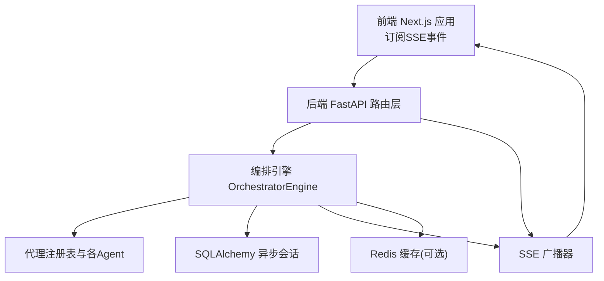
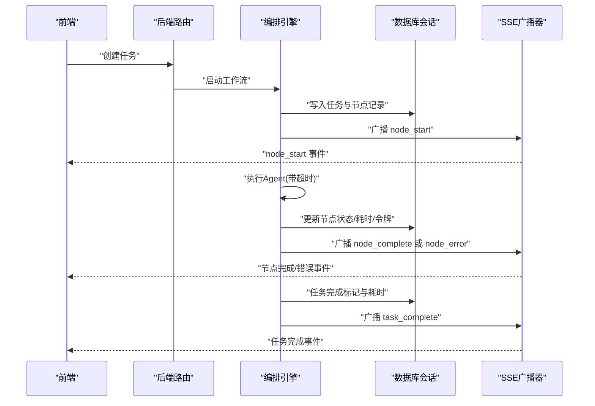
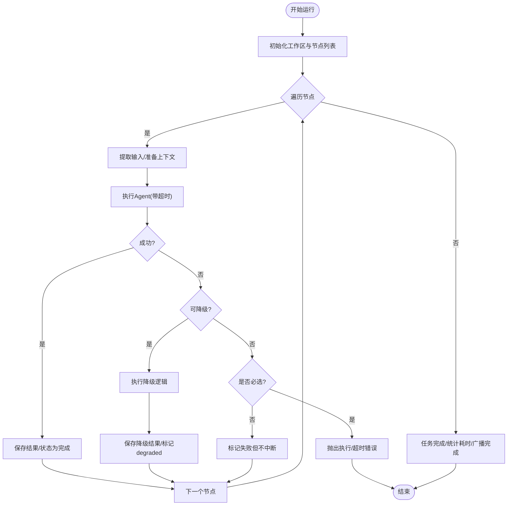
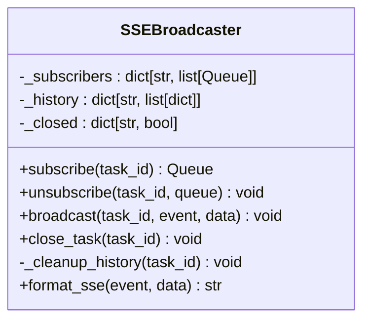
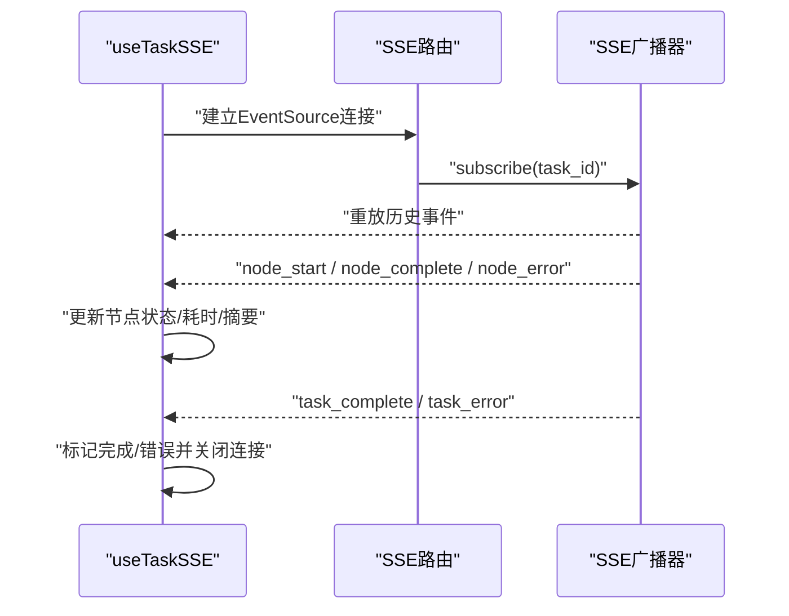
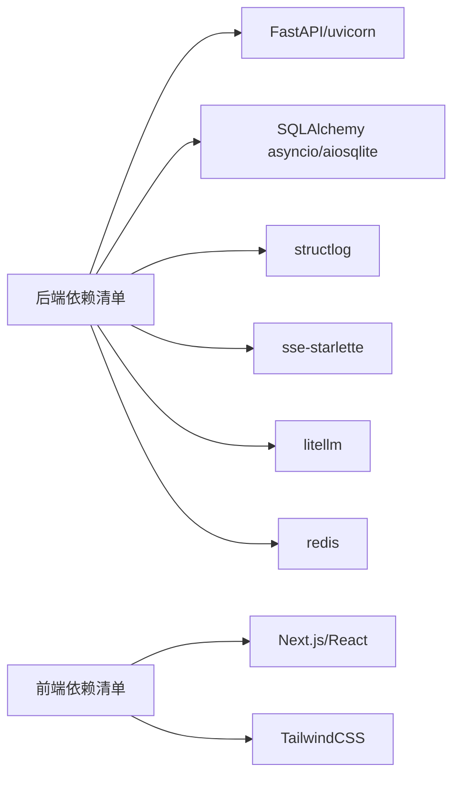

# 性能优化与监控

<cite>
**本文引用的文件**
- [backend/app/main.py](file://backend/app/main.py)
- [backend/app/core/config.py](file://backend/app/core/config.py)
- [backend/app/db/session.py](file://backend/app/db/session.py)
- [backend/app/orchestrator/engine.py](file://backend/app/orchestrator/engine.py)
- [backend/app/orchestrator/broadcaster.py](file://backend/app/orchestrator/broadcaster.py)
- [backend/app/api/stream_routes.py](file://backend/app/api/stream_routes.py)
- [backend/app/core/tracer.py](file://backend/app/core/tracer.py)
- [backend/app/core/logger.py](file://backend/app/core/logger.py)
- [frontend/lib/api.ts](file://frontend/lib/api.ts)
- [frontend/hooks/useTaskSSE.ts](file://frontend/hooks/useTaskSSE.ts)
- [frontend/next.config.ts](file://frontend/next.config.ts)
- [backend/pyproject.toml](file://backend/pyproject.toml)
- [frontend/package.json](file://frontend/package.json)
</cite>

## 目录
1. [简介](#简介)
2. [项目结构](#项目结构)
3. [核心组件](#核心组件)
4. [架构总览](#架构总览)
5. [详细组件分析](#详细组件分析)
6. [依赖分析](#依赖分析)
7. [性能考虑](#性能考虑)
8. [故障排查指南](#故障排查指南)
9. [结论](#结论)
10. [附录](#附录)

## 简介
本指南面向HotClaw项目的性能优化与监控，聚焦以下目标：
- 识别并优化系统性能瓶颈：CPU使用率高、内存泄漏、数据库查询慢、SSE连接阻塞等
- 建立性能监控指标体系：Agent执行时间统计、数据库连接池使用情况、前端渲染性能监控
- 优化缓存策略：Redis缓存配置、数据库查询缓存与静态资源缓存
- 异步处理优化、并发控制与资源管理最佳实践
- 性能基准测试与持续性能监控实施方案

## 项目结构
HotClaw采用前后端分离架构：
- 后端基于FastAPI，负责任务编排、代理执行、SSE事件广播与数据库交互
- 前端基于Next.js，通过EventSource订阅SSE流，实时展示任务节点状态
- 配置集中于后端Settings，支持数据库、Redis、LLM提供商、超时等参数
- 日志采用structlog结构化输出，便于性能分析与问题定位

图表来源
- [backend/app/main.py:69-147](file://backend/app/main.py#L69-L147)
- [backend/app/orchestrator/engine.py:89-285](file://backend/app/orchestrator/engine.py#L89-L285)
- [backend/app/orchestrator/broadcaster.py:11-99](file://backend/app/orchestrator/broadcaster.py#L11-L99)
- [backend/app/db/session.py:3-21](file://backend/app/db/session.py#L3-L21)
- [frontend/hooks/useTaskSSE.ts:28-144](file://frontend/hooks/useTaskSSE.ts#L28-L144)

章节来源
- [backend/app/main.py:1-153](file://backend/app/main.py#L1-L153)
- [frontend/next.config.ts:1-15](file://frontend/next.config.ts#L1-L15)

## 核心组件
- 应用入口与中间件：统一CORS、全局异常处理、Trace ID注入
- 配置中心：数据库URL、Redis URL、LLM提供商、超时阈值等
- 数据库会话：异步引擎与会话工厂，支持回滚与自动关闭
- 编排引擎：顺序执行节点、超时控制、事件广播、令牌统计
- SSE广播器：按任务维护订阅队列与历史缓冲，支持延迟重放
- SSE路由：事件生成器、断开检测、心跳保活
- 前端API与SSE钩子：直连后端SSE、事件监听与状态更新

章节来源
- [backend/app/main.py:69-153](file://backend/app/main.py#L69-L153)
- [backend/app/core/config.py:52-99](file://backend/app/core/config.py#L52-L99)
- [backend/app/db/session.py:3-50](file://backend/app/db/session.py#L3-L50)
- [backend/app/orchestrator/engine.py:89-285](file://backend/app/orchestrator/engine.py#L89-L285)
- [backend/app/orchestrator/broadcaster.py:11-99](file://backend/app/orchestrator/broadcaster.py#L11-L99)
- [backend/app/api/stream_routes.py:14-43](file://backend/app/api/stream_routes.py#L14-L43)
- [frontend/lib/api.ts:48-55](file://frontend/lib/api.ts#L48-L55)
- [frontend/hooks/useTaskSSE.ts:28-144](file://frontend/hooks/useTaskSSE.ts#L28-L144)

## 架构总览
下图展示从任务创建到SSE事件推送的关键流程，以及性能相关的关键点（超时、事件缓冲、连接管理）。

图表来源
- [backend/app/orchestrator/engine.py:92-234](file://backend/app/orchestrator/engine.py#L92-L234)
- [backend/app/api/stream_routes.py:14-43](file://backend/app/api/stream_routes.py#L14-L43)
- [backend/app/orchestrator/broadcaster.py:57-85](file://backend/app/orchestrator/broadcaster.py#L57-L85)

## 详细组件分析

### 编排引擎（OrchestratorEngine）
- 执行模式：顺序节点执行，严格控制Agent顺序与失败降级
- 超时控制：每个Agent执行受settings.agent_timeout限制
- 事件广播：节点开始/完成/错误、任务完成均通过SSE广播
- 统计信息：累计提示与补全tokens，计算节点与任务耗时
- 错误处理：必选节点失败直接抛出；可选节点降级或标记失败

图表来源
- [backend/app/orchestrator/engine.py:92-234](file://backend/app/orchestrator/engine.py#L92-L234)

章节来源
- [backend/app/orchestrator/engine.py:89-285](file://backend/app/orchestrator/engine.py#L89-L285)

### SSE广播器（SSEBroadcaster）
- 订阅管理：按任务维护订阅队列，支持延迟重放历史事件
- 历史缓冲：保留past events用于新订阅者，避免竞态丢失事件
- 关闭策略：任务结束后发送哨兵终止消息，并在60秒后清理历史
- 心跳保活：事件生成器定期发送注释保持连接活跃

图表来源
- [backend/app/orchestrator/broadcaster.py:11-99](file://backend/app/orchestrator/broadcaster.py#L11-L99)

章节来源
- [backend/app/orchestrator/broadcaster.py:1-99](file://backend/app/orchestrator/broadcaster.py#L1-L99)
- [backend/app/api/stream_routes.py:14-43](file://backend/app/api/stream_routes.py#L14-L43)

### 前端SSE钩子（useTaskSSE）
- 连接策略：EventSource自动重连，onerror不主动关闭
- 事件映射：node_start/complete/error与task_complete/error映射到UI状态
- 初始化节点状态：与后端默认工作流节点顺序一致
- 清理逻辑：组件卸载时关闭连接并重置状态

图表来源
- [frontend/hooks/useTaskSSE.ts:28-144](file://frontend/hooks/useTaskSSE.ts#L28-L144)
- [frontend/lib/api.ts:48-55](file://frontend/lib/api.ts#L48-L55)
- [backend/app/api/stream_routes.py:14-43](file://backend/app/api/stream_routes.py#L14-L43)

章节来源
- [frontend/hooks/useTaskSSE.ts:1-144](file://frontend/hooks/useTaskSSE.ts#L1-L144)
- [frontend/lib/api.ts:1-289](file://frontend/lib/api.ts#L1-L289)

### 数据库会话与连接池
- 使用SQLAlchemy异步引擎与async_session_factory
- SQLite场景禁用pool_pre_ping，其他数据库启用以减少失效连接
- 会话自动回滚与关闭，避免连接泄漏

章节来源
- [backend/app/db/session.py:3-50](file://backend/app/db/session.py#L3-L50)

### 配置中心（Settings）
- 支持数据库URL、Redis URL、LLM提供商、超时等关键参数
- LLM配置根据默认提供商动态加载
- 提供应用环境、日志级别、主机端口等运行参数

章节来源
- [backend/app/core/config.py:52-99](file://backend/app/core/config.py#L52-L99)

## 依赖分析
- 后端依赖：FastAPI、uvicorn、SQLAlchemy asyncio、aiosqlite、structlog、sse-starlette、nanoid、litellm、redis等
- 前端依赖：Next.js、React、TailwindCSS等
- 关键耦合点：编排引擎依赖数据库会话与SSE广播器；SSE路由依赖广播器；前端SSE钩子依赖后端SSE路由

图表来源
- [backend/pyproject.toml:6-22](file://backend/pyproject.toml#L6-L22)
- [frontend/package.json:11-22](file://frontend/package.json#L11-L22)

章节来源
- [backend/pyproject.toml:1-41](file://backend/pyproject.toml#L1-L41)
- [frontend/package.json:1-23](file://frontend/package.json#L1-L23)

## 性能考虑

### CPU使用率高
- 优化方向
  - 将长耗时操作（如LLM调用）放入异步任务队列或外部Worker，避免阻塞主事件循环
  - 对Agent内部重复计算进行缓存（如Prompt模板、常用查询）
  - 合理设置settings.agent_timeout与并发度，避免过多协程同时竞争CPU
- 参考实现位置
  - Agent执行与超时控制：[backend/app/orchestrator/engine.py:236-243](file://backend/app/orchestrator/engine.py#L236-L243)
  - LLM提供商配置：[backend/app/core/config.py:21-49](file://backend/app/core/config.py#L21-L49)

章节来源
- [backend/app/orchestrator/engine.py:236-243](file://backend/app/orchestrator/engine.py#L236-L243)
- [backend/app/core/config.py:21-49](file://backend/app/core/config.py#L21-L49)

### 内存泄漏
- 优化方向
  - 确保SSE广播器在close_task后清理历史缓冲，防止长期任务导致内存累积
  - 数据库会话在finally中关闭，异常时回滚，避免连接泄漏
  - 前端EventSource连接在组件卸载时关闭，避免悬挂连接
- 参考实现位置
  - 历史清理：[backend/app/orchestrator/broadcaster.py:78-90](file://backend/app/orchestrator/broadcaster.py#L78-L90)
  - 会话生命周期：[backend/app/db/session.py:23-50](file://backend/app/db/session.py#L23-L50)
  - 前端清理：[frontend/hooks/useTaskSSE.ts:135-140](file://frontend/hooks/useTaskSSE.ts#L135-L140)

章节来源
- [backend/app/orchestrator/broadcaster.py:78-90](file://backend/app/orchestrator/broadcaster.py#L78-L90)
- [backend/app/db/session.py:23-50](file://backend/app/db/session.py#L23-L50)
- [frontend/hooks/useTaskSSE.ts:135-140](file://frontend/hooks/useTaskSSE.ts#L135-L140)

### 数据库查询慢
- 优化方向
  - 使用异步会话与连接池，避免阻塞
  - 在SQLite外使用pool_pre_ping，减少无效连接
  - 对高频查询添加索引与分页，避免一次性加载大量数据
  - 使用结构化日志记录慢查询与异常，结合Trace ID定位
- 参考实现位置
  - 引擎与会话：[backend/app/db/session.py:3-21](file://backend/app/db/session.py#L3-L21)
  - 结构化日志：[backend/app/core/logger.py:8-36](file://backend/app/core/logger.py#L8-L36)

章节来源
- [backend/app/db/session.py:3-21](file://backend/app/db/session.py#L3-L21)
- [backend/app/core/logger.py:8-36](file://backend/app/core/logger.py#L8-L36)

### SSE连接阻塞
- 优化方向
  - 事件生成器设置合理超时并发送keepalive注释，维持连接活跃
  - 前端使用EventSource自动重连，避免单点失败导致阻塞
  - 广播器对延迟订阅者重放历史事件，保证消息可达性
- 参考实现位置
  - 事件生成器与keepalive：[backend/app/api/stream_routes.py:18-38](file://backend/app/api/stream_routes.py#L18-L38)
  - 前端自动重连与onerror策略：[frontend/hooks/useTaskSSE.ts:129-133](file://frontend/hooks/useTaskSSE.ts#L129-L133)
  - 历史重放与订阅管理：[backend/app/orchestrator/broadcaster.py:30-45](file://backend/app/orchestrator/broadcaster.py#L30-L45)

章节来源
- [backend/app/api/stream_routes.py:18-38](file://backend/app/api/stream_routes.py#L18-L38)
- [frontend/hooks/useTaskSSE.ts:129-133](file://frontend/hooks/useTaskSSE.ts#L129-L133)
- [backend/app/orchestrator/broadcaster.py:30-45](file://backend/app/orchestrator/broadcaster.py#L30-L45)

### 缓存策略优化
- Redis缓存配置
  - 使用settings.redis_url配置Redis连接
  - 缓存热点数据（如Agent系统提示、LLM响应、任务元数据），降低后端压力
- 数据库查询缓存
  - 对只读高频查询结果进行短期缓存（如技能列表、Agent配置）
  - 与数据库事务隔离，避免脏读
- 静态资源缓存
  - 前端Next.js构建产物由CDN缓存，减少带宽与延迟
  - 通过rewrites将/api转发至后端，避免跨域带来的额外开销

章节来源
- [backend/app/core/config.py:59-63](file://backend/app/core/config.py#L59-L63)
- [frontend/next.config.ts:4-11](file://frontend/next.config.ts#L4-L11)

### 异步处理优化、并发控制与资源管理
- 异步处理
  - 使用async/await与asyncio.wait_for控制超时
  - 将I/O密集型操作（LLM调用、数据库访问）置于异步上下文中
- 并发控制
  - 编排器顺序执行节点，避免Agent间资源竞争
  - 如需并行，引入任务队列与限速器，配合Redis实现分布式锁
- 资源管理
  - 会话自动关闭与回滚，异常路径清晰
  - SSE队列与历史缓冲在任务完成后清理，避免内存泄漏

章节来源
- [backend/app/orchestrator/engine.py:236-243](file://backend/app/orchestrator/engine.py#L236-L243)
- [backend/app/db/session.py:23-50](file://backend/app/db/session.py#L23-L50)
- [backend/app/orchestrator/broadcaster.py:78-90](file://backend/app/orchestrator/broadcaster.py#L78-L90)

### 性能监控指标与分析
- Agent执行时间统计
  - 节点开始/结束时间差即为节点耗时；任务完成时记录总耗时
  - 可扩展记录prompt_tokens与completion_tokens，用于成本与性能双监控
- 数据库连接池使用情况
  - 通过日志观察连接创建/回收频率；必要时增加连接池大小或调整超时
- 前端渲染性能监控
  - 使用浏览器性能面板记录首屏、交互延迟；结合SSE事件到达时间评估端到端延迟

章节来源
- [backend/app/orchestrator/engine.py:211-226](file://backend/app/orchestrator/engine.py#L211-L226)
- [backend/app/core/logger.py:8-36](file://backend/app/core/logger.py#L8-L36)

### 基准测试与持续监控实施方案
- 基准测试
  - 使用HTTP压测工具对关键接口（创建任务、SSE流）施压，记录P50/P95/P99延迟
  - 对Agent执行设置不同输入规模，测量吞吐与资源占用
- 持续监控
  - 结构化日志输出包含trace_id，结合日志聚合平台进行关联分析
  - 前端埋点上报SSE事件到达时间与节点状态变更，形成端到端SLI/SLO

章节来源
- [backend/app/core/tracer.py:10-34](file://backend/app/core/tracer.py#L10-L34)
- [backend/app/core/logger.py:8-36](file://backend/app/core/logger.py#L8-L36)

## 故障排查指南
- 全局异常处理
  - HotClawError映射到HTTP状态码，便于前端识别业务错误
  - 未捕获异常统一返回500并记录错误详情（调试模式下包含堆栈）
- SSE连接问题
  - 检查SSE路由是否正确订阅与取消订阅；确认事件生成器未提前退出
  - 前端EventSource onerror不主动关闭，等待浏览器自动重连
- 数据库会话异常
  - 确认异常路径已回滚并关闭会话；检查连接URL与驱动版本

章节来源
- [backend/app/main.py:96-138](file://backend/app/main.py#L96-L138)
- [backend/app/api/stream_routes.py:18-42](file://backend/app/api/stream_routes.py#L18-L42)
- [frontend/hooks/useTaskSSE.ts:129-133](file://frontend/hooks/useTaskSSE.ts#L129-L133)
- [backend/app/db/session.py:23-50](file://backend/app/db/session.py#L23-L50)

## 结论
HotClaw在编排、SSE与日志方面具备良好的异步与可观测基础。建议优先解决SSE阻塞、数据库连接池与内存泄漏风险，再逐步引入缓存与分布式并发控制。通过结构化日志与端到端监控，持续迭代性能指标，确保系统在高负载下的稳定性与可扩展性。

## 附录
- 关键配置项参考
  - 数据库URL：[backend/app/core/config.py:54-57](file://backend/app/core/config.py#L54-L57)
  - Redis URL：[backend/app/core/config.py:60-63](file://backend/app/core/config.py#L60-L63)
  - LLM提供商配置：[backend/app/core/config.py:21-49](file://backend/app/core/config.py#L21-L49)
  - 超时阈值：[backend/app/core/config.py:79-82](file://backend/app/core/config.py#L79-L82)
- 前端API与SSE直连
  - SSE URL构造：[frontend/lib/api.ts:48-55](file://frontend/lib/api.ts#L48-L55)
  - Next.js重写规则：[frontend/next.config.ts:4-11](file://frontend/next.config.ts#L4-L11)