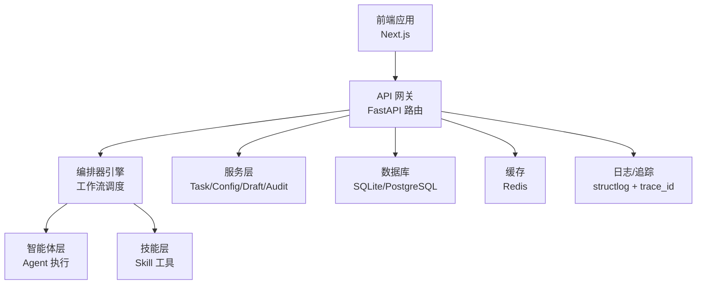
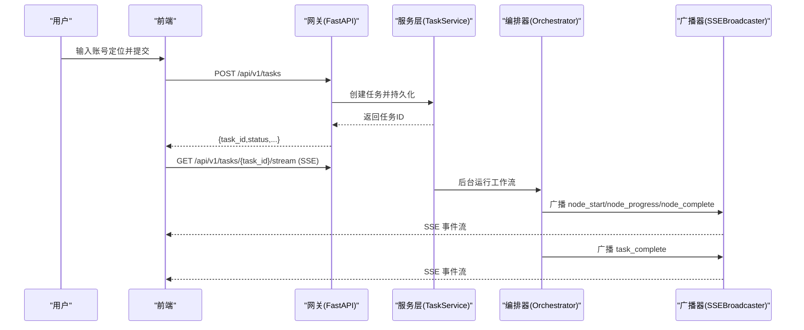
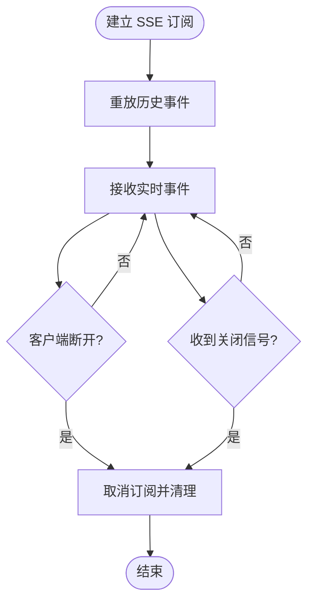
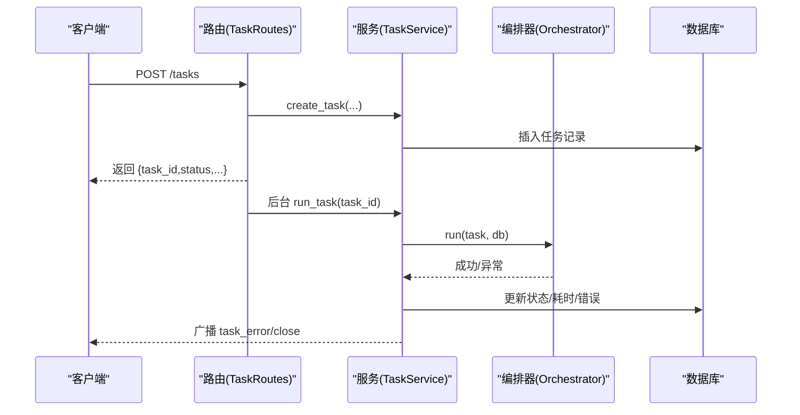
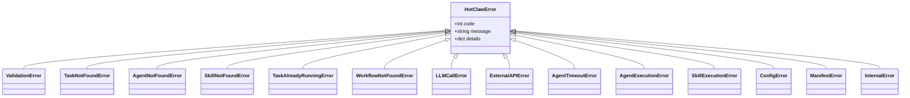
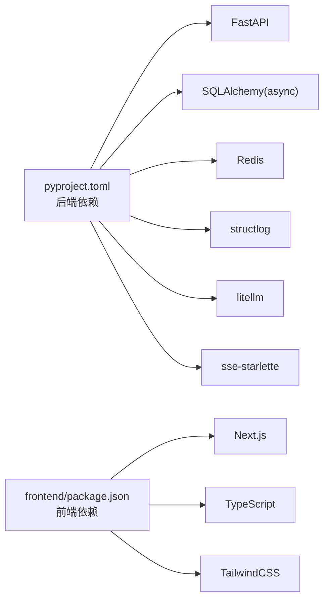

# 故障排除

<cite>
**本文引用的文件**
- [ARCHITECTURE.md](file://ARCHITECTURE.md)
- [Notice.md](file://Notice.md)
- [ai_readme.md](file://ai_readme.md)
- [backend/app/main.py](file://backend/app/main.py)
- [backend/app/core/exceptions.py](file://backend/app/core/exceptions.py)
- [backend/app/core/logger.py](file://backend/app/core/logger.py)
- [backend/app/core/config.py](file://backend/app/core/config.py)
- [backend/app/api/task_routes.py](file://backend/app/api/task_routes.py)
- [backend/app/api/stream_routes.py](file://backend/app/api/stream_routes.py)
- [backend/app/services/task_service.py](file://backend/app/services/task_service.py)
- [backend/app/orchestrator/broadcaster.py](file://backend/app/orchestrator/broadcaster.py)
- [backend/pyproject.toml](file://backend/pyproject.toml)
- [frontend/package.json](file://frontend/package.json)
</cite>

## 目录
1. [简介](#简介)
2. [项目结构](#项目结构)
3. [核心组件](#核心组件)
4. [架构总览](#架构总览)
5. [详细组件分析](#详细组件分析)
6. [依赖分析](#依赖分析)
7. [性能考量](#性能考量)
8. [故障排除指南](#故障排除指南)
9. [结论](#结论)
10. [附录](#附录)

## 简介
本指南面向用户与运维人员，提供 HotClaw 多智能体内容生产平台的系统化故障排除方法。内容涵盖启动失败、连接错误、性能问题与配置错误的诊断与修复步骤，配套日志分析、错误追踪与性能监控实践，以及错误码对照表与恢复策略。文档同时给出网络、数据库与第三方服务集成的排查清单，帮助快速定位问题根因并恢复服务。

## 项目结构
HotClaw 采用前后端分离架构：前端为 Next.js 应用，后端为 FastAPI 应用，通过 HTTP + SSE 实现实时状态推送。系统核心模块包括网关层、编排器、智能体与技能层、服务层、数据模型与配置/日志/异常处理等。

图表来源
- [ARCHITECTURE.md](file://ARCHITECTURE.md)
- [backend/app/main.py](file://backend/app/main.py)
- [backend/app/api/task_routes.py](file://backend/app/api/task_routes.py)
- [backend/app/api/stream_routes.py](file://backend/app/api/stream_routes.py)
- [backend/app/services/task_service.py](file://backend/app/services/task_service.py)
- [backend/app/orchestrator/broadcaster.py](file://backend/app/orchestrator/broadcaster.py)

章节来源
- [ARCHITECTURE.md](file://ARCHITECTURE.md)
- [backend/app/main.py](file://backend/app/main.py)

## 核心组件
- 网关与路由：统一入口、参数校验、SSE 端点、健康检查与全局异常处理。
- 编排器与广播：按工作流顺序调度智能体，事件广播与历史缓冲，支持延迟订阅。
- 服务层：任务生命周期管理、节点运行记录、分页查询与统计。
- 配置与日志：环境变量驱动的配置、结构化日志、统一错误码映射。
- 前端：SSE 订阅、任务状态可视化、历史任务与配置管理页面。

章节来源
- [backend/app/api/task_routes.py](file://backend/app/api/task_routes.py)
- [backend/app/api/stream_routes.py](file://backend/app/api/stream_routes.py)
- [backend/app/services/task_service.py](file://backend/app/services/task_service.py)
- [backend/app/orchestrator/broadcaster.py](file://backend/app/orchestrator/broadcaster.py)
- [backend/app/core/exceptions.py](file://backend/app/core/exceptions.py)
- [backend/app/core/logger.py](file://backend/app/core/logger.py)
- [backend/app/core/config.py](file://backend/app/core/config.py)

## 架构总览
系统采用“网关-编排器-智能体/技能-基础设施”的分层设计，SSE 实时推送节点状态，支持任务级追踪与回放。

图表来源
- [backend/app/api/task_routes.py](file://backend/app/api/task_routes.py)
- [backend/app/api/stream_routes.py](file://backend/app/api/stream_routes.py)
- [backend/app/services/task_service.py](file://backend/app/services/task_service.py)
- [backend/app/orchestrator/broadcaster.py](file://backend/app/orchestrator/broadcaster.py)

## 详细组件分析

### 组件A：SSE 广播与事件流
- 订阅/取消订阅：按 task_id 维护队列，支持历史事件重放与延迟加入。
- 广播：将事件推送到所有订阅者，带缓冲避免丢失早期事件。
- 关闭：任务完成后发送结束哨兵并清理历史，防止内存泄漏。

图表来源
- [backend/app/orchestrator/broadcaster.py](file://backend/app/orchestrator/broadcaster.py)
- [backend/app/api/stream_routes.py](file://backend/app/api/stream_routes.py)

章节来源
- [backend/app/orchestrator/broadcaster.py](file://backend/app/orchestrator/broadcaster.py)
- [backend/app/api/stream_routes.py](file://backend/app/api/stream_routes.py)

### 组件B：任务生命周期与后台运行
- 创建任务：生成 task_id，写入初始状态与输入数据。
- 后台运行：在后台协程中执行编排器，避免阻塞 HTTP 响应。
- 失败处理：捕获异常，更新任务状态与耗时，广播任务级错误并关闭流。

图表来源
- [backend/app/api/task_routes.py](file://backend/app/api/task_routes.py)
- [backend/app/services/task_service.py](file://backend/app/services/task_service.py)

章节来源
- [backend/app/api/task_routes.py](file://backend/app/api/task_routes.py)
- [backend/app/services/task_service.py](file://backend/app/services/task_service.py)

### 组件C：统一异常与错误码映射
- 异常层次：基于 HotClawError 的分类（用户输入、冲突、外部/执行、配置、系统）。
- HTTP 映射：根据错误码前缀映射到 4xx/5xx，特殊码有特例。
- 未处理异常：统一返回 5000 并在调试模式下返回细节。

图表来源
- [backend/app/core/exceptions.py](file://backend/app/core/exceptions.py)

章节来源
- [backend/app/core/exceptions.py](file://backend/app/core/exceptions.py)
- [backend/app/main.py](file://backend/app/main.py)

## 依赖分析
- 后端依赖：FastAPI、SQLAlchemy/Async、Redis、structlog、litellm、sse-starlette 等。
- 前端依赖：Next.js、TypeScript、TailwindCSS 等。
- 关键耦合点：网关与服务层、服务层与编排器、编排器与广播器、网关与前端。

图表来源
- [backend/pyproject.toml](file://backend/pyproject.toml)
- [frontend/package.json](file://frontend/package.json)

章节来源
- [backend/pyproject.toml](file://backend/pyproject.toml)
- [frontend/package.json](file://frontend/package.json)

## 性能考量
- I/O 密集：LLM/外部 API 调用、数据库读写、SSE 广播。
- 并发模型：异步 FastAPI + asyncio，后台任务避免阻塞。
- 超时与降级：节点/技能/LLM 超时阈值可配置，失败时降级策略减少整链路崩溃。
- 日志与追踪：结构化日志与 trace_id，便于定位慢节点与错误根因。

章节来源
- [backend/app/core/config.py](file://backend/app/core/config.py)
- [backend/app/core/logger.py](file://backend/app/core/logger.py)
- [ARCHITECTURE.md](file://ARCHITECTURE.md)

## 故障排除指南

### 一、启动失败
常见症状
- 后端无法启动或健康检查失败
- 前端无法访问或跨域报错
- 数据库连接失败或表未创建

排查步骤
1. 检查后端进程与监听地址/端口
   - 查看监听配置与日志级别
   - 访问健康端点确认服务状态
2. 检查数据库连接
   - 确认连接 URL 与驱动可用
   - 开发环境自动建表，生产环境需手动迁移
3. 检查 Redis 连接
   - 确认地址可达且无认证问题
4. 检查 CORS 设置
   - 前端域名与请求头需允许
5. 检查环境变量
   - LLM API Key/Base URL、超时参数、日志等级

定位参考
- 启动与生命周期：应用生命周期钩子、日志初始化
- 健康检查：健康端点
- 数据库建表：开发模式自动建表
- CORS 与中间件：跨域与追踪中间件
- 配置加载：环境变量与默认值

章节来源
- [backend/app/main.py](file://backend/app/main.py)
- [backend/app/core/config.py](file://backend/app/core/config.py)
- [backend/app/core/logger.py](file://backend/app/core/logger.py)

### 二、连接错误
网络与第三方服务
- LLM API 连接失败
  - 检查 API Key/Base URL/模型名称
  - 设置合理超时与重试
  - 使用 litellm 统一接口，避免平台差异
- 外部新闻源/服务调用失败
  - 检查网络连通性与代理
  - 降低并发或增加超时
  - 使用技能层的缓存与降级策略
- Redis 连接失败
  - 检查地址、密码、网络策略
  - 关注连接池与超时设置

数据库连接
- SQLite/PostgreSQL 连接串
  - 开发默认 SQLite，生产使用 PostgreSQL
  - 确认驱动与权限
- Alembic 迁移
  - 确保版本与模型一致
  - 执行迁移脚本

章节来源
- [backend/app/core/config.py](file://backend/app/core/config.py)
- [backend/app/core/exceptions.py](file://backend/app/core/exceptions.py)
- [backend/pyproject.toml](file://backend/pyproject.toml)

### 三、性能问题
症状
- 任务执行缓慢、SSE 推送延迟
- LLM/外部 API 超时频繁
- CPU/内存占用偏高

排查与优化
- 超时与并发
  - 调整节点/技能/LLM 超时阈值
  - 限制并发数，避免资源争用
- 日志与追踪
  - 启用结构化日志，定位慢节点
  - 使用 trace_id 关联任务全链路
- 缓存与降级
  - 利用技能层缓存与降级策略
  - 减少重复外部调用
- 数据库优化
  - 确保索引与查询计划合理
  - 分页查询与批量写入

章节来源
- [backend/app/core/config.py](file://backend/app/core/config.py)
- [backend/app/core/logger.py](file://backend/app/core/logger.py)
- [ARCHITECTURE.md](file://ARCHITECTURE.md)

### 四、配置错误
症状
- 接口返回 400/404，提示参数或资源不存在
- 配置校验失败导致启动异常
- 环境变量缺失导致功能异常

排查
- 统一错误响应结构与错误码
  - 用户输入错误、资源不存在、配置错误等分类
- 配置加载与默认值
  - 环境变量文件与默认值
  - 关键配置（数据库、Redis、LLM）必须提供
- 前后端一致性
  - 接口返回结构与前端状态处理一致

章节来源
- [Notice.md](file://Notice.md)
- [backend/app/core/exceptions.py](file://backend/app/core/exceptions.py)
- [backend/app/core/config.py](file://backend/app/core/config.py)

### 五、日志分析与错误追踪
- 结构化日志
  - JSON 渲染、时间戳、级别、trace_id
- 任务级追踪
  - 每个任务与节点均记录 trace_id
  - 通过 trace_id 关联前后端日志
- 错误定位
  - 优先查看节点级错误与异常栈
  - 结合 SSE 事件流定位失败节点

章节来源
- [backend/app/core/logger.py](file://backend/app/core/logger.py)
- [backend/app/main.py](file://backend/app/main.py)
- [Notice.md](file://Notice.md)

### 六、SSE 与前端连接问题
症状
- 前端无法接收事件或断连
- 事件延迟或丢失

排查
- 订阅时机
  - 在创建任务后尽快发起 SSE 订阅
- 断线重连
  - 前端实现自动重连与心跳处理
- 服务器端
  - 广播器缓冲与延迟订阅机制
  - 超时与保活消息

章节来源
- [backend/app/api/stream_routes.py](file://backend/app/api/stream_routes.py)
- [backend/app/orchestrator/broadcaster.py](file://backend/app/orchestrator/broadcaster.py)

### 七、错误码对照表与解读
说明
- 错误码前缀映射到 HTTP 状态码
- 特殊错误码有特例映射
- 未处理异常统一返回 5000

错误码分类与示例
- 用户输入错误：1xxx（如参数校验失败）
- 冲突/资源不存在：2xxx（如任务/Agent/技能不存在、工作流不存在）
- 外部/执行错误：3xxx（如 LLM 调用失败、外部 API 失败、节点/技能执行失败、节点超时）
- 配置错误：4xxx（如配置校验失败、Manifest 格式错误）
- 系统错误：5xxx（如内部服务器错误）

HTTP 映射要点
- 1xxx/4xxx → 400
- 2xxx → 409
- 3xxx → 502（除 3003 超时映射 504）
- 5xxx → 500

章节来源
- [backend/app/core/exceptions.py](file://backend/app/core/exceptions.py)
- [backend/app/main.py](file://backend/app/main.py)

### 八、监控告警与故障恢复
- 监控指标
  - 任务成功率、平均耗时、节点失败率、SSE 连接数、数据库/Redis 延迟
- 告警策略
  - 失败率阈值、超时比例、SSE 断流、关键依赖不可用
- 恢复策略
  - 自动重试与退避、降级策略、熔断与快速失败
  - 任务回放与人工干预通道

章节来源
- [Notice.md](file://Notice.md)
- [ARCHITECTURE.md](file://ARCHITECTURE.md)

## 结论
通过统一的异常与错误码体系、结构化日志与 trace_id 追踪、SSE 实时事件流与广播器缓冲机制，HotClaw 能够在 MVP 阶段实现可运行、可追踪、可维护的最小闭环。本指南提供了系统化的故障排除方法与工具使用建议，帮助用户与运维人员快速定位并解决问题，保障平台稳定运行。

## 附录

### A. 常见问题与解决方案速查
- 启动失败
  - 检查监听地址/端口、数据库连接、Redis 连接、CORS 设置
- 连接错误
  - LLM API Key/Base URL/模型；外部服务网络；数据库驱动与迁移
- 性能问题
  - 调整超时与并发、启用缓存与降级、优化数据库查询
- 配置错误
  - 环境变量与默认值、接口返回结构一致性

### B. 关键文件与定位路径
- 后端入口与中间件：[backend/app/main.py](file://backend/app/main.py)
- 异常与错误码：[backend/app/core/exceptions.py](file://backend/app/core/exceptions.py)
- 日志与配置：[backend/app/core/logger.py](file://backend/app/core/logger.py)、[backend/app/core/config.py](file://backend/app/core/config.py)
- 任务与流式接口：[backend/app/api/task_routes.py](file://backend/app/api/task_routes.py)、[backend/app/api/stream_routes.py](file://backend/app/api/stream_routes.py)
- 服务层与编排器广播：[backend/app/services/task_service.py](file://backend/app/services/task_service.py)、[backend/app/orchestrator/broadcaster.py](file://backend/app/orchestrator/broadcaster.py)
- 项目约束与协议：[Notice.md](file://Notice.md)、[ai_readme.md](file://ai_readme.md)、[ARCHITECTURE.md](file://ARCHITECTURE.md)