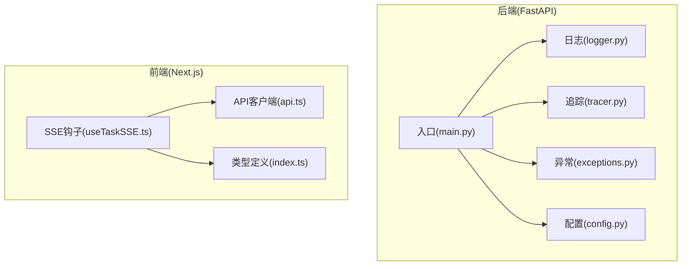
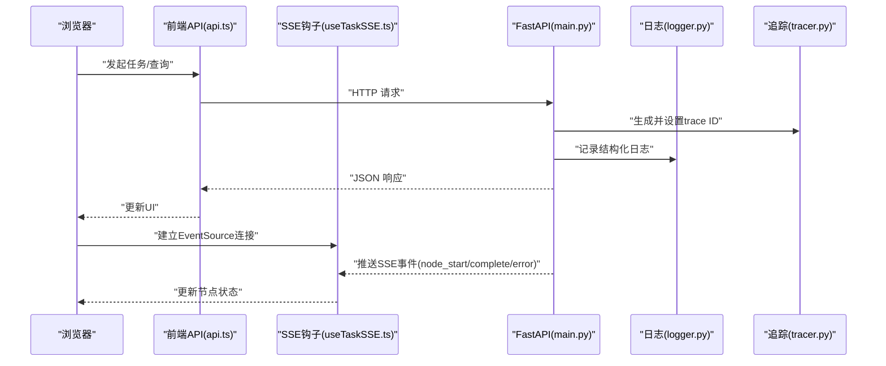
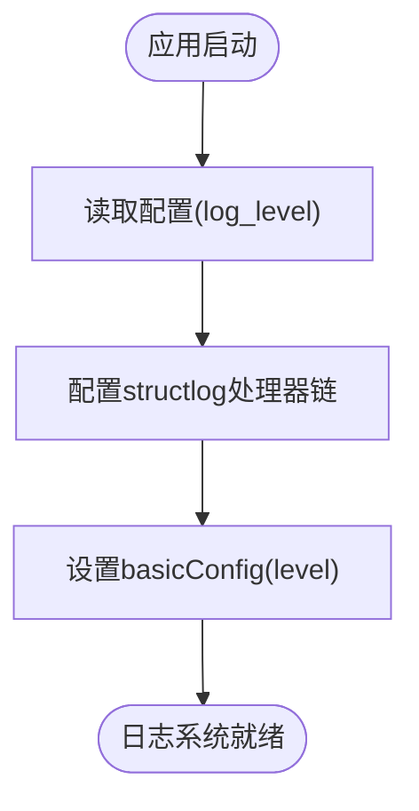
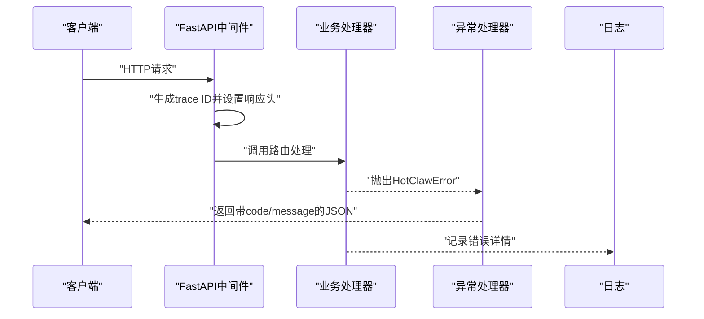
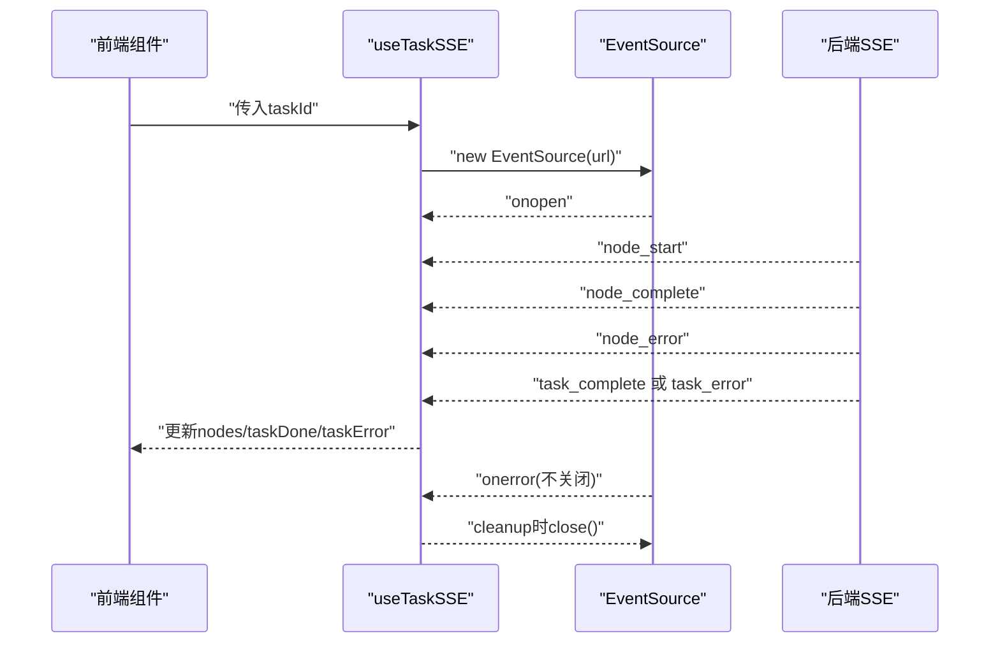
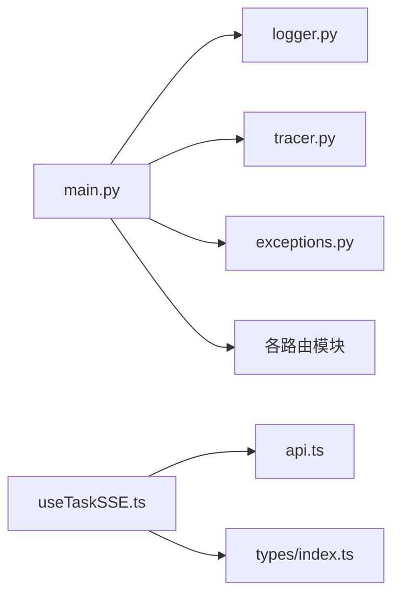

# 调试工具与方法

<cite>
**本文引用的文件**
- [backend/app/main.py](file://backend/app/main.py)
- [backend/app/core/logger.py](file://backend/app/core/logger.py)
- [backend/app/core/tracer.py](file://backend/app/core/tracer.py)
- [backend/app/core/config.py](file://backend/app/core/config.py)
- [backend/app/core/exceptions.py](file://backend/app/core/exceptions.py)
- [backend/tests/conftest.py](file://backend/tests/conftest.py)
- [frontend/hooks/useTaskSSE.ts](file://frontend/hooks/useTaskSSE.ts)
- [frontend/lib/api.ts](file://frontend/lib/api.ts)
- [frontend/types/index.ts](file://frontend/types/index.ts)
</cite>

## 目录
1. [简介](#简介)
2. [项目结构](#项目结构)
3. [核心组件](#核心组件)
4. [架构总览](#架构总览)
5. [详细组件分析](#详细组件分析)
6. [依赖分析](#依赖分析)
7. [性能考虑](#性能考虑)
8. [故障排查指南](#故障排查指南)
9. [结论](#结论)
10. [附录](#附录)

## 简介
本指南面向HotClaw项目的开发与运维人员，提供从后端日志系统到前端SSE事件流的完整调试方法。内容涵盖：
- 后端结构化日志的配置与查看
- 错误追踪（trace ID）与异常处理机制
- 浏览器开发者工具在SSE监控、错误查看与性能分析中的应用
- 日志级别与调试模式的配置
- 断点调试、单元测试与集成测试的调试步骤

## 项目结构
HotClaw采用前后端分离架构：后端基于FastAPI，前端基于Next.js。调试涉及的关键位置包括：
- 后端日志与追踪：日志初始化、结构化输出、全局中间件注入trace ID
- 异常体系：统一错误类与全局异常处理器
- 前端SSE钩子：实时任务节点状态流
- 测试环境：pytest + AsyncClient + 内存数据库

图示来源
- [backend/app/main.py:1-153](file://backend/app/main.py#L1-L153)
- [backend/app/core/logger.py:1-36](file://backend/app/core/logger.py#L1-L36)
- [backend/app/core/tracer.py:1-34](file://backend/app/core/tracer.py#L1-L34)
- [backend/app/core/config.py:1-99](file://backend/app/core/config.py#L1-L99)
- [backend/app/core/exceptions.py:1-125](file://backend/app/core/exceptions.py#L1-L125)
- [frontend/hooks/useTaskSSE.ts:1-144](file://frontend/hooks/useTaskSSE.ts#L1-L144)
- [frontend/lib/api.ts:1-289](file://frontend/lib/api.ts#L1-L289)
- [frontend/types/index.ts:1-119](file://frontend/types/index.ts#L1-L119)

章节来源
- [backend/app/main.py:1-153](file://backend/app/main.py#L1-L153)
- [frontend/hooks/useTaskSSE.ts:1-144](file://frontend/hooks/useTaskSSE.ts#L1-L144)

## 核心组件
- 结构化日志系统：通过structlog配置JSON格式输出，支持时间戳、堆栈信息、异常渲染等处理器，并以基础格式化方式设置根日志级别。
- 追踪ID系统：使用上下文变量在请求生命周期内生成并传播trace ID，响应头中携带X-Trace-Id便于跨服务关联。
- 统一异常体系：定义HotClawError及其子类，覆盖输入校验、任务/代理/技能不存在、外部调用失败、超时、配置错误、系统内部错误等场景；全局异常处理器将业务错误映射为合适的HTTP状态码。
- SSE任务流钩子：前端通过EventSource订阅后端SSE，监听节点开始/完成/错误、任务完成/错误事件，用于可视化任务执行过程。

章节来源
- [backend/app/core/logger.py:1-36](file://backend/app/core/logger.py#L1-L36)
- [backend/app/core/tracer.py:1-34](file://backend/app/core/tracer.py#L1-L34)
- [backend/app/core/exceptions.py:1-125](file://backend/app/core/exceptions.py#L1-L125)
- [frontend/hooks/useTaskSSE.ts:1-144](file://frontend/hooks/useTaskSSE.ts#L1-L144)

## 架构总览
下图展示从浏览器到后端的请求链路，以及日志与追踪如何贯穿其中。

图示来源
- [backend/app/main.py:69-94](file://backend/app/main.py#L69-L94)
- [backend/app/core/logger.py:8-31](file://backend/app/core/logger.py#L8-L31)
- [backend/app/core/tracer.py:10-34](file://backend/app/core/tracer.py#L10-L34)
- [frontend/lib/api.ts:14-24](file://frontend/lib/api.ts#L14-L24)
- [frontend/hooks/useTaskSSE.ts:60-140](file://frontend/hooks/useTaskSSE.ts#L60-L140)

## 详细组件分析

### 后端日志系统与结构化输出
- 初始化流程：启动时调用setup_logging，根据配置读取日志级别，配置structlog处理器链，最终以basicConfig写入标准输出。
- 处理器链要点：合并上下文变量、按级别过滤、添加logger名称与level、时间戳、堆栈渲染、异常格式化、Unicode解码、JSON渲染。
- 使用建议：在业务关键路径调用get_logger获取绑定日志器，记录结构化字段（如trace_id、task_id、节点名、耗时等），便于后续检索与聚合。

图示来源
- [backend/app/core/logger.py:8-31](file://backend/app/core/logger.py#L8-L31)
- [backend/app/core/config.py:76-78](file://backend/app/core/config.py#L76-L78)

章节来源
- [backend/app/core/logger.py:1-36](file://backend/app/core/logger.py#L1-L36)
- [backend/app/core/config.py:1-99](file://backend/app/core/config.py#L1-L99)

### 追踪ID与异常处理
- 追踪ID：中间件在每次请求进入时生成trace ID并注入响应头，便于跨服务串联日志与监控。
- 异常映射：对HotClawError按错误类别映射到不同HTTP状态码；对未捕获异常统一返回500并在调试模式下返回细节。
- 日志记录：全局异常处理器会记录未处理异常，便于快速定位问题。

图示来源
- [backend/app/main.py:86-138](file://backend/app/main.py#L86-L138)
- [backend/app/core/tracer.py:10-34](file://backend/app/core/tracer.py#L10-L34)
- [backend/app/core/exceptions.py:4-125](file://backend/app/core/exceptions.py#L4-L125)

章节来源
- [backend/app/main.py:1-153](file://backend/app/main.py#L1-L153)
- [backend/app/core/exceptions.py:1-125](file://backend/app/core/exceptions.py#L1-L125)

### 前端SSE任务流钩子
- 连接策略：根据当前页面host动态拼接后端SSE地址，避免Next.js代理导致的缓冲；连接打开后置isConnected为true。
- 事件监听：node_start/node_complete/node_error/task_complete/task_error，分别更新节点状态、耗时、摘要、错误信息与任务完成标志。
- 自动重连：onerror不关闭连接，交由浏览器自动指数退避重连，便于网络抖动恢复。
- 清理逻辑：组件卸载或重置时关闭连接并重置状态。

图示来源
- [frontend/hooks/useTaskSSE.ts:60-140](file://frontend/hooks/useTaskSSE.ts#L60-L140)
- [frontend/lib/api.ts:48-55](file://frontend/lib/api.ts#L48-L55)

章节来源
- [frontend/hooks/useTaskSSE.ts:1-144](file://frontend/hooks/useTaskSSE.ts#L1-L144)
- [frontend/lib/api.ts:1-289](file://frontend/lib/api.ts#L1-L289)
- [frontend/types/index.ts:66-95](file://frontend/types/index.ts#L66-L95)

### 浏览器开发者工具调试技巧
- Network面板
  - 查找SSE连接：过滤“/api/v1/tasks/{id}/stream”，观察连接状态与事件帧。
  - 查看请求头：确认X-Trace-Id是否随请求返回，用于后端日志关联。
  - 检查响应体：关注SSE事件数据结构（节点开始/完成/错误、任务完成/错误）。
- Console面板
  - 查看SSE日志：钩子会在连接、事件到达、错误时打印控制台日志，便于快速定位问题。
  - 检查错误信息：若接口返回非零code，前端会抛出错误，可在Console中查看。
- Performance面板
  - 录制页面交互：观察SSE事件触发后的UI更新开销，识别卡顿点。
  - 关注主线程阻塞：结合事件流频率与节点耗时，评估后端处理压力。

章节来源
- [frontend/hooks/useTaskSSE.ts:69-133](file://frontend/hooks/useTaskSSE.ts#L69-L133)
- [frontend/lib/api.ts:14-24](file://frontend/lib/api.ts#L14-L24)

### 日志级别与调试模式配置
- 后端日志级别
  - 通过配置项log_level设置，默认INFO；可调整为DEBUG/INFO/WARNING/ERROR/CRITICAL。
  - 配置加载顺序：优先读取.env文件，再由Pydantic Settings加载默认值。
- 调试模式
  - app_debug为布尔开关，影响未捕获异常时是否返回details。
  - 建议在开发环境开启app_debug以便快速定位问题，生产环境保持关闭。

章节来源
- [backend/app/core/config.py:76-78](file://backend/app/core/config.py#L76-L78)
- [backend/app/core/config.py:71-72](file://backend/app/core/config.py#L71-L72)
- [backend/app/main.py:126-138](file://backend/app/main.py#L126-L138)

### 断点调试、单元测试与集成测试
- 断点调试
  - 后端：在路由处理函数、业务服务层设置断点，配合X-Trace-Id在日志中定位请求。
  - 前端：在useTaskSSE中为事件回调设置断点，观察事件数据结构与UI更新。
- 单元测试调试
  - 使用pytest_asyncio与AsyncClient，内存数据库SQLite，禁用echo减少噪声。
  - 在conftest中注入测试客户端与数据库会话，必要时在测试函数中打印或断点检查。
- 集成测试调试
  - 通过ASGI传输创建测试客户端，绕过真实网络，直接调用路由。
  - 可在测试中模拟SSE事件流，验证前端钩子行为与错误处理。

章节来源
- [backend/tests/conftest.py:1-48](file://backend/tests/conftest.py#L1-L48)
- [frontend/hooks/useTaskSSE.ts:60-140](file://frontend/hooks/useTaskSSE.ts#L60-L140)

## 依赖分析
- 后端模块耦合
  - main.py依赖logger、tracer、exceptions与各路由模块；日志与追踪在启动阶段初始化，中间件贯穿所有请求。
  - 异常体系独立于路由，通过全局处理器统一处理。
- 前端模块耦合
  - useTaskSSE依赖api.ts提供的SSE地址与类型定义；类型定义集中于index.ts，确保事件结构一致性。

图示来源
- [backend/app/main.py:14-21](file://backend/app/main.py#L14-L21)
- [frontend/hooks/useTaskSSE.ts:3-6](file://frontend/hooks/useTaskSSE.ts#L3-L6)
- [frontend/lib/api.ts:12](file://frontend/lib/api.ts#L12)
- [frontend/types/index.ts:66-95](file://frontend/types/index.ts#L66-L95)

章节来源
- [backend/app/main.py:1-153](file://backend/app/main.py#L1-L153)
- [frontend/hooks/useTaskSSE.ts:1-144](file://frontend/hooks/useTaskSSE.ts#L1-L144)
- [frontend/lib/api.ts:1-289](file://frontend/lib/api.ts#L1-L289)
- [frontend/types/index.ts:1-119](file://frontend/types/index.ts#L1-L119)

## 性能考虑
- SSE事件频率：前端默认不关闭连接，由浏览器自动重连；若事件过于频繁，可能造成前端UI更新压力，需在后端适当节流或在前端批量处理。
- 日志开销：DEBUG级别会产生大量结构化日志，建议仅在开发环境开启；生产环境使用INFO或更高级别。
- 中间件成本：trace ID生成与响应头设置为轻量操作，通常不影响性能，但应避免在高频短请求中重复计算。

## 故障排查指南
- 无法建立SSE连接
  - 检查后端SSE路由可用性与CORS配置；确认前端SSE地址拼接正确且端口一致。
  - 在Network面板观察连接状态与事件帧；在Console查看连接与错误日志。
- 任务节点状态异常
  - 在Console中确认事件回调是否被触发；核对事件数据结构与类型定义是否匹配。
  - 若出现节点错误，检查后端日志中对应trace ID的上下文信息。
- 未捕获异常
  - 查看后端日志中“unhandled_exception”记录；在调试模式下，前端会收到details字段，便于定位。
- 日志级别过低
  - 提升log_level至DEBUG，补充结构化字段（如节点名、耗时、trace_id），便于检索与聚合。

章节来源
- [frontend/hooks/useTaskSSE.ts:69-133](file://frontend/hooks/useTaskSSE.ts#L69-L133)
- [backend/app/main.py:126-138](file://backend/app/main.py#L126-L138)
- [backend/app/core/logger.py:8-31](file://backend/app/core/logger.py#L8-L31)

## 结论
通过结构化日志、trace ID与统一异常处理，HotClaw实现了清晰的可观测性；结合浏览器开发者工具的SSE监控与性能分析，能够高效定位问题并优化体验。建议在开发环境启用DEBUG与app_debug，在生产环境保持严格的日志级别与最小化异常细节输出。

## 附录
- 快速检查清单
  - 后端：确认log_level与app_debug设置；检查trace ID是否出现在响应头；查看结构化日志中关键字段。
  - 前端：确认SSE地址拼接正确；在Console中观察事件日志；在Performance面板录制交互。
  - 测试：使用pytest_asyncio与内存数据库；在测试中模拟SSE事件，验证错误处理路径。