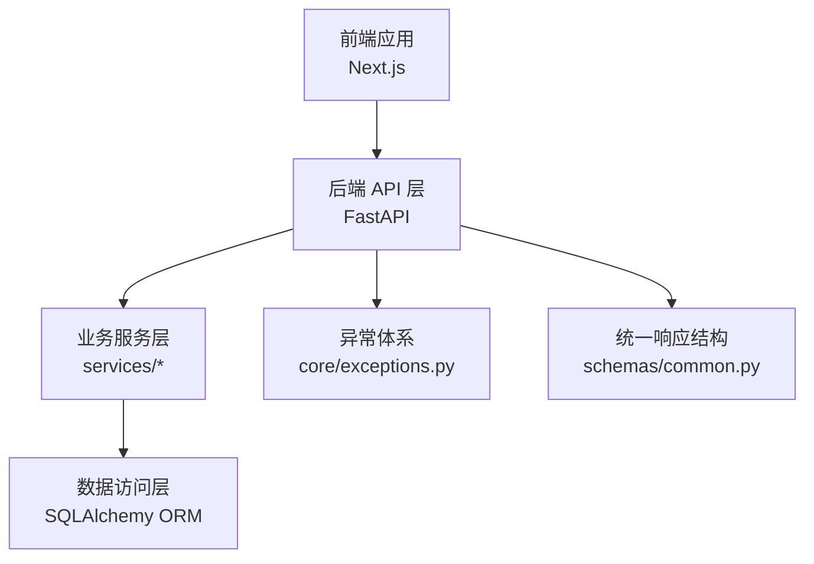
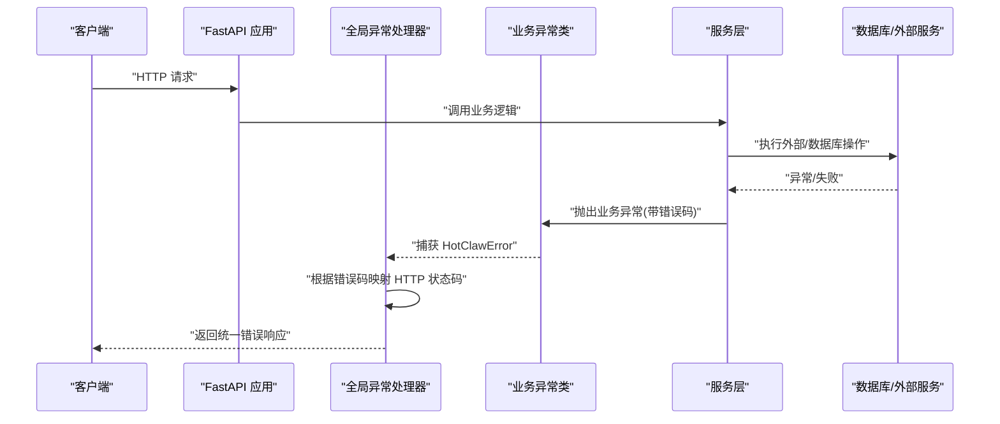
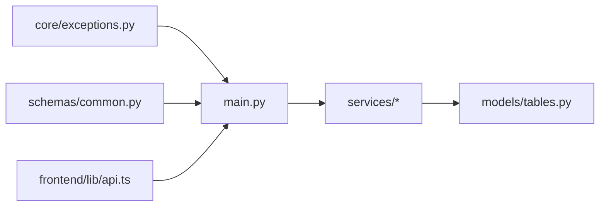

# 错误码对照表

<cite>
**本文引用的文件**
- [backend/app/core/exceptions.py](file://backend/app/core/exceptions.py)
- [backend/app/main.py](file://backend/app/main.py)
- [backend/app/schemas/common.py](file://backend/app/schemas/common.py)
- [backend/app/services/task_service.py](file://backend/app/services/task_service.py)
- [backend/app/models/tables.py](file://backend/app/models/tables.py)
- [frontend/lib/api.ts](file://frontend/lib/api.ts)
- [Notice.md](file://Notice.md)
</cite>

## 目录
1. [简介](#简介)
2. [项目结构](#项目结构)
3. [核心组件](#核心组件)
4. [架构总览](#架构总览)
5. [详细组件分析](#详细组件分析)
6. [依赖分析](#依赖分析)
7. [性能考量](#性能考量)
8. [故障排查指南](#故障排查指南)
9. [结论](#结论)
10. [附录](#附录)

## 简介
本手册面向 HotClaw 平台的使用者与维护者，提供统一的错误码对照表与错误信息参考，涵盖：
- HTTP 状态码映射与含义
- 业务逻辑错误码（用户输入、冲突、外部/执行、配置、系统）
- 系统异常码与统一错误响应结构
- 错误分类与诊断修复指引
- 错误码与解决方案的对应关系
- 常见错误预防与最佳实践
- 错误报告标准格式与提交方式

## 项目结构
HotClaw 采用前后端分离架构，后端基于 FastAPI，前端基于 Next.js。错误处理遵循统一的响应结构与异常体系。

图表来源
- [backend/app/main.py:69-147](file://backend/app/main.py#L69-L147)
- [backend/app/schemas/common.py:7-27](file://backend/app/schemas/common.py#L7-L27)
- [backend/app/core/exceptions.py:4-125](file://backend/app/core/exceptions.py#L4-L125)

章节来源
- [backend/app/main.py:69-147](file://backend/app/main.py#L69-L147)
- [backend/app/schemas/common.py:7-27](file://backend/app/schemas/common.py#L7-L27)
- [Notice.md:190-242](file://Notice.md#L190-L242)

## 核心组件
- 统一异常基类与业务错误码：定义了用户输入、冲突、外部/执行、配置、系统等类别的错误码与语义。
- 全局异常处理器：将业务错误码映射为 HTTP 状态码，并返回统一的错误响应结构。
- 统一响应结构：定义了成功与错误响应的字段，便于前端一致处理。
- 业务服务层：在服务层抛出具体业务异常，确保错误语义清晰。
- 前端 API 客户端：对非零 code 的响应进行错误抛出，便于上层 UI 捕获与展示。

章节来源
- [backend/app/core/exceptions.py:4-125](file://backend/app/core/exceptions.py#L4-L125)
- [backend/app/main.py:96-138](file://backend/app/main.py#L96-L138)
- [backend/app/schemas/common.py:14-20](file://backend/app/schemas/common.py#L14-L20)
- [frontend/lib/api.ts:14-24](file://frontend/lib/api.ts#L14-L24)

## 架构总览
后端异常与响应处理的关键流程如下：

图表来源
- [backend/app/main.py:96-138](file://backend/app/main.py#L96-L138)
- [backend/app/core/exceptions.py:4-125](file://backend/app/core/exceptions.py#L4-L125)
- [backend/app/services/task_service.py:39-63](file://backend/app/services/task_service.py#L39-L63)

## 详细组件分析

### 统一异常与错误码分类
- 用户输入错误（1xxx）：参数校验失败、对象不存在等。
- 冲突错误（2xxx）：并发/状态冲突，如任务已在运行。
- 外部/执行错误（3xxx）：LLM/外部 API 调用失败、Agent 执行超时或失败、技能执行失败等。
- 配置错误（4xxx）：配置校验失败、清单文件格式错误等。
- 系统错误（5xxx）：未处理异常转为内部错误。

章节来源
- [backend/app/core/exceptions.py:17-124](file://backend/app/core/exceptions.py#L17-L124)

### HTTP 状态码映射规则
- 1xxx → 400（除特殊例外）
- 2xxx → 409
- 3xxx → 502（除特殊例外）
- 4xxx → 400
- 5xxx → 500
- 特殊例外：
  - 1002/1003/1004/2002 → 404
  - 3003（Agent 执行超时）→ 504

章节来源
- [backend/app/main.py:99-113](file://backend/app/main.py#L99-L113)

### 统一错误响应结构
- 成功：code=0，message="ok"，data 为业务数据
- 失败：code 为业务错误码，message 为错误描述，data=null，details 可选携带上下文详情

章节来源
- [backend/app/schemas/common.py:7-20](file://backend/app/schemas/common.py#L7-L20)
- [Notice.md:190-212](file://Notice.md#L190-L212)

### 前端错误处理约定
- 当响应 code≠0 时，前端抛出错误，交由 UI 层处理加载/错误/空/成功四态
- SSE 等场景需绕过代理直连后端，避免响应缓冲导致事件丢失

章节来源
- [frontend/lib/api.ts:14-24](file://frontend/lib/api.ts#L14-L24)
- [frontend/lib/api.ts:48-55](file://frontend/lib/api.ts#L48-L55)

### 业务服务层与错误传播
- 服务层在查询不到任务/节点时抛出相应业务异常，确保错误语义明确
- 任务运行中异常会写入任务表的错误字段并广播错误事件

章节来源
- [backend/app/services/task_service.py:65-78](file://backend/app/services/task_service.py#L65-L78)
- [backend/app/services/task_service.py:39-63](file://backend/app/services/task_service.py#L39-L63)

### 数据模型与错误关联
- 任务与节点模型包含错误信息字段，便于持久化错误上下文
- 系统日志模型支持结构化日志与追踪字段，便于问题定位

章节来源
- [backend/app/models/tables.py:23-46](file://backend/app/models/tables.py#L23-L46)
- [backend/app/models/tables.py:48-74](file://backend/app/models/tables.py#L48-L74)
- [backend/app/models/tables.py:220-233](file://backend/app/models/tables.py#L220-L233)

## 依赖分析
后端异常与响应处理的依赖关系如下：

图表来源
- [backend/app/core/exceptions.py:4-125](file://backend/app/core/exceptions.py#L4-L125)
- [backend/app/main.py:96-138](file://backend/app/main.py#L96-L138)
- [backend/app/schemas/common.py:7-20](file://backend/app/schemas/common.py#L7-L20)
- [frontend/lib/api.ts:14-24](file://frontend/lib/api.ts#L14-L24)

章节来源
- [backend/app/main.py:96-138](file://backend/app/main.py#L96-L138)
- [backend/app/core/exceptions.py:4-125](file://backend/app/core/exceptions.py#L4-L125)
- [backend/app/schemas/common.py:7-20](file://backend/app/schemas/common.py#L7-L20)
- [frontend/lib/api.ts:14-24](file://frontend/lib/api.ts#L14-L24)

## 性能考量
- 错误映射与响应序列化开销极低，主要影响在异常路径上的日志与广播
- 建议在高并发下保持合理的日志级别，避免在错误路径产生过多 I/O
- 对外部调用设置合理超时，防止阻塞导致资源耗尽

## 故障排查指南

### 错误码与处理对照表
- 1001：参数校验失败
  - HTTP：400
  - 处理：检查请求参数与类型；查看 details 获取字段级提示
- 1002：任务不存在
  - HTTP：404
  - 处理：确认任务 ID 是否正确；检查任务生命周期
- 1003：Agent 不存在
  - HTTP：404
  - 处理：确认 Agent 注册与 ID；检查配置持久化
- 1004：技能不存在
  - HTTP：404
  - 处理：确认技能 ID；检查技能清单
- 2001：任务已在运行
  - HTTP：409
  - 处理：等待任务结束或取消后重试
- 2002：工作流不存在
  - HTTP：404
  - 处理：确认工作流模板存在且启用
- 3001：LLM 调用失败
  - HTTP：502
  - 处理：检查模型提供商配置、网络连通性、限流与配额
- 3002：外部 API 调用失败
  - HTTP：502
  - 处理：检查上游服务健康、鉴权与网络
- 3003：Agent 执行超时
  - HTTP：504
  - 处理：调整超时阈值、优化 Agent 逻辑、检查资源瓶颈
- 3004：Agent 执行失败
  - HTTP：502
  - 处理：查看 details 中的错误详情；检查 Agent 输入/输出与依赖
- 3005：技能执行失败
  - HTTP：502
  - 处理：检查技能配置与输入；查看 details
- 4001：配置校验失败
  - HTTP：400
  - 处理：修正配置项类型与取值范围
- 4002：清单文件格式错误
  - HTTP：400
  - 处理：校验清单 JSON 结构与字段
- 5000：内部服务器错误
  - HTTP：500
  - 处理：查看后端日志与追踪 ID；必要时重启服务

章节来源
- [backend/app/main.py:99-113](file://backend/app/main.py#L99-L113)
- [backend/app/core/exceptions.py:17-124](file://backend/app/core/exceptions.py#L17-L124)

### 错误分类与诊断要点
- 网络连接错误
  - 表现：3001/3002/504；上游服务不可达或超时
  - 诊断：检查 DNS、防火墙、代理、超时配置
- 认证授权错误
  - 表现：外部服务返回 401/403 或 5xx
  - 诊断：核对 API Key、权限范围、服务端策略
- 数据验证错误
  - 表现：1001；字段缺失、类型不符、越界
  - 诊断：比对接口文档与请求体；查看 details
- 业务规则错误
  - 表现：1002/1003/1004/2001/2002；对象不存在或状态冲突
  - 诊断：检查业务前置条件与状态机
- 系统异常
  - 表现：5000；未捕获异常
  - 诊断：查看后端日志、追踪 ID、堆栈

章节来源
- [Notice.md:316-339](file://Notice.md#L316-L339)
- [backend/app/main.py:126-138](file://backend/app/main.py#L126-L138)

### 解决方案与最佳实践
- 参数校验
  - 在前端与后端均进行参数校验；使用统一的错误响应结构
- 并发控制
  - 避免重复触发同一任务；对关键操作加锁或幂等设计
- 超时与重试
  - 为外部调用设置合理超时；对瞬时失败进行指数退避重试
- 配置治理
  - 使用系统配置表集中管理敏感配置；避免硬编码
- 观测性
  - 为每个任务与节点生成 trace_id；记录结构化日志
- 前端健壮性
  - 区分 loading/error/empty/success 四态；对 SSE 直连后端

章节来源
- [Notice.md:316-370](file://Notice.md#L316-L370)
- [frontend/lib/api.ts:48-55](file://frontend/lib/api.ts#L48-L55)

### 错误报告标准格式
- 时间戳：UTC
- 路径：请求路径
- 方法：HTTP 方法
- Trace-ID：X-Trace-Id 响应头
- 错误码：业务错误码
- 错误信息：message
- 详情：details（若有）
- 影响范围：任务 ID、Agent/技能 ID（若有）
- 复现步骤：简明步骤
- 日志链接：后端日志检索条件（trace_id/任务 ID）

章节来源
- [backend/app/main.py:86-93](file://backend/app/main.py#L86-L93)
- [backend/app/schemas/common.py:14-20](file://backend/app/schemas/common.py#L14-L20)

### 提交方式
- 通过项目 Issue 模板提交，附带上述标准格式
- 若涉及敏感信息，仅提供脱敏后的上下文

## 结论
通过统一的异常体系、明确的错误码分类与 HTTP 映射、以及前后端一致的错误响应结构，HotClaw 实现了清晰、可追踪、易诊断的错误处理机制。建议在日常使用与维护中遵循本文提供的分类、诊断与最佳实践，以提升系统的稳定性与可维护性。

## 附录

### 错误码与 HTTP 映射速查
- 1001 → 400
- 1002 → 404
- 1003 → 404
- 1004 → 404
- 2001 → 409
- 2002 → 404
- 3001 → 502
- 3002 → 502
- 3003 → 504
- 3004 → 502
- 3005 → 502
- 4001 → 400
- 4002 → 400
- 5000 → 500

章节来源
- [backend/app/main.py:99-113](file://backend/app/main.py#L99-L113)